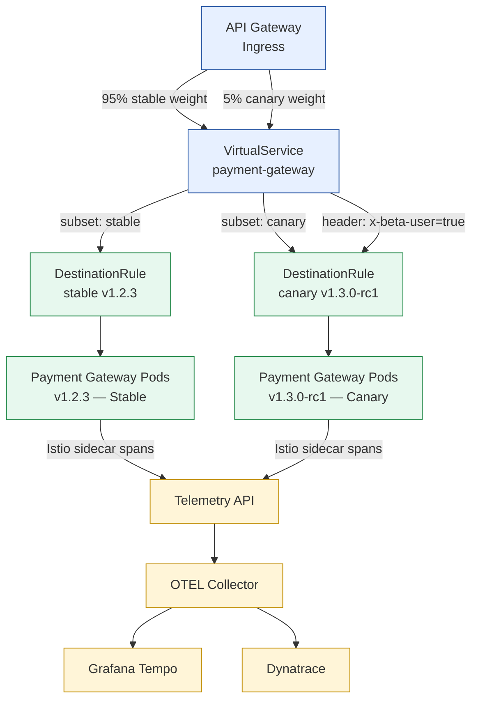

# Service Mesh Traffic Management

Status: Draft | Last Reviewed: 2026-05-10 | Owner: @platform-lead
Catalog ID: PLT-001 | Radii
Tier Applicability: T0, T1

## Problem Statement

Without a service mesh traffic layer:
- Canary releases require application-level routing code in every service — high implementation cost and risk
- Blue/green deployments on NAPAS payment gateway adapters require manual Kubernetes Deployment swaps — minutes of risk exposure
- Fault injection for quarterly DR drills requires test-specific code paths in production services
- Inter-pod latency and error rates are invisible at the infrastructure level — only application metrics exist
- Circuit breaking at the network layer is unavailable; Resilience4j only handles application-layer faults
- mTLS policy migration from PERMISSIVE → STRICT has no controlled rollout path

**Boundary with SEC-001 (Zero-Trust Security):**
- **SEC-001** owns Istio *security*: `PeerAuthentication` (mTLS enforcement), `AuthorizationPolicy` (service access control), certificate management.
- **PLT-001** owns Istio *traffic management*: `VirtualService`, `DestinationRule`, `Telemetry`, canary routing, fault injection, and mesh-level observability. Do not duplicate security controls here.

## Solution

Use Istio traffic management resources (`VirtualService` + `DestinationRule`) for canary releases, header-based routing, fault injection, and mesh-level telemetry fed to the OTEL Collector.



## Implementation Guidelines

### 1. Canary Release — VirtualService + DestinationRule

**DestinationRule** defines stable and canary subsets via pod labels:

```yaml
# istio/payment-gateway-destination-rule.yaml
apiVersion: networking.istio.io/v1beta1
kind: DestinationRule
metadata:
  name: payment-gateway
  namespace: banking
spec:
  host: payment-gateway
  trafficPolicy:
    connectionPool:
      tcp:
        maxConnections: 200
        connectTimeout: 5s
      http:
        http1MaxPendingRequests: 200
        http2MaxRequests: 2000
        idleTimeout: 90s
    outlierDetection:
      consecutive5xxErrors: 5
      interval: 30s
      baseEjectionTime: 30s
      maxEjectionPercent: 50
  subsets:
    - name: stable
      labels:
        version: stable
    - name: canary
      labels:
        version: canary
```

**VirtualService** routes 95% stable / 5% canary, with header override for internal QA:

```yaml
# istio/payment-gateway-virtual-service.yaml
apiVersion: networking.istio.io/v1beta1
kind: VirtualService
metadata:
  name: payment-gateway
  namespace: banking
spec:
  hosts:
    - payment-gateway
  http:
    # Internal QA and beta users always hit canary
    - match:
        - headers:
            x-beta-user:
              exact: "true"
        - headers:
            x-internal-qa:
              exact: "true"
      route:
        - destination:
            host: payment-gateway
            subset: canary

    # Production traffic: 95/5 weighted routing
    - route:
        - destination:
            host: payment-gateway
            subset: stable
          weight: 95
        - destination:
            host: payment-gateway
            subset: canary
          weight: 5

    # Retry policy for all routes
    retries:
      attempts: 3
      perTryTimeout: 5s
      retryOn: "5xx,reset,connect-failure,retriable-4xx"

    # Timeout
    timeout: 30s
```

**Kubernetes Deployment labels** (must match DestinationRule subset selectors):

```yaml
# kubernetes/payment-gateway-canary.yaml
apiVersion: apps/v1
kind: Deployment
metadata:
  name: payment-gateway-canary
  namespace: banking
spec:
  replicas: 1
  selector:
    matchLabels:
      app: payment-gateway
      version: canary
  template:
    metadata:
      labels:
        app: payment-gateway
        version: canary     # ← matches DestinationRule subset
    spec:
      containers:
        - name: payment-gateway
          image: techcombank/payment-gateway:1.3.0-rc1
```

### 2. Automated Canary Promotion — Argo Rollouts

For T0 services, automate canary promotion based on success rate analysis:

```yaml
# argo-rollouts/payment-gateway-rollout.yaml
apiVersion: argoproj.io/v1alpha1
kind: Rollout
metadata:
  name: payment-gateway
  namespace: banking
spec:
  replicas: 10
  strategy:
    canary:
      trafficRouting:
        istio:
          virtualService:
            name: payment-gateway
            routes:
              - primary
      steps:
        - setWeight: 5
        - pause: {}   # Manual gate for T0 — requires human approval
        - setWeight: 20
        - analysis:
            templates:
              - templateName: success-rate-analysis
            args:
              - name: service-name
                value: payment-gateway
        - setWeight: 50
        - pause: {duration: 10m}
        - setWeight: 100
      analysis:
        templates:
          - templateName: success-rate-analysis

---
apiVersion: argoproj.io/v1alpha1
kind: AnalysisTemplate
metadata:
  name: success-rate-analysis
  namespace: banking
spec:
  metrics:
    - name: success-rate
      interval: 1m
      successCondition: result[0] >= 0.999
      failureLimit: 3
      provider:
        prometheus:
          address: http://prometheus.monitoring:9090
          query: |
            sum(rate(http_server_requests_seconds_count{
              status!~"5..",
              app="{{args.service-name}}",
              version="canary"
            }[5m]))
            /
            sum(rate(http_server_requests_seconds_count{
              app="{{args.service-name}}",
              version="canary"
            }[5m]))
```

### 3. Fault Injection — Quarterly DR Drills

Apply fault injection VirtualService only during scheduled chaos drills (BP-005). Never apply in production outside drill windows.

```yaml
# istio/dr-drill-t24-connector-fault.yaml
# Apply: kubectl apply -f ... (drill start)
# Remove: kubectl delete -f ... (drill end)
apiVersion: networking.istio.io/v1beta1
kind: VirtualService
metadata:
  name: t24-ofs-connector-fault-injection
  namespace: banking
  annotations:
    drill-id: "DR-2026-Q2"
    apply-window: "2026-06-15T02:00:00+07:00 to 2026-06-15T04:00:00+07:00"
spec:
  hosts:
    - t24-ofs-connector
  http:
    - fault:
        delay:
          percentage:
            value: 30.0
          fixedDelay: 800ms
        abort:
          percentage:
            value: 5.0
          httpStatus: 503
      route:
        - destination:
            host: t24-ofs-connector
```

Drill validation: apply fault injection → assert circuit breaker (RES-002) opens within 30s → assert payment service falls back (RES-007) → assert DLQ alert does NOT fire (no messages lost) → assert Argo Rollouts health check fails → rollback triggered automatically.

### 4. Mesh-Level Telemetry

The Istio `Telemetry` API generates spans for every inter-pod call without requiring code changes. These mesh spans appear in Grafana Tempo alongside application spans from OBS-001.

```yaml
# istio/banking-telemetry.yaml
apiVersion: telemetry.istio.io/v1alpha1
kind: Telemetry
metadata:
  name: banking-mesh-telemetry
  namespace: banking
spec:
  tracing:
    - providers:
        - name: otel-tracing
      randomSamplingPercentage: 100.0
      customTags:
        bank.namespace:
          literal:
            value: banking
  metrics:
    - providers:
        - name: prometheus
      overrides:
        - match:
            metric: ALL_METRICS
          tagOverrides:
            service_tier:
              operation: UPSERT
              value: |
                has(destination.labels["service.tier"]) ? destination.labels["service.tier"] : "unknown"
  accessLogging:
    - providers:
        - name: envoy
```

Istio OTEL provider configuration in `IstioOperator`:

```yaml
# istio-operator/istio-control-plane.yaml
apiVersion: install.istio.io/v1alpha1
kind: IstioOperator
spec:
  meshConfig:
    enableTracing: true
    defaultConfig:
      tracing:
        openCensusAgent:
          address: "otel-collector.monitoring:55678"
    extensionProviders:
      - name: otel-tracing
        opentelemetry:
          port: 4317
          service: otel-collector.monitoring.svc.cluster.local
```

**Kiali service graph** provides real-time dependency visualisation. Deploy as part of Istio add-ons (governed by PLT-002).

### 5. mTLS Migration — PERMISSIVE → STRICT

For brownfield services not yet ready for mTLS, use PERMISSIVE mode during migration. The Kiali topology view shows mTLS coverage percentages.

Migration steps (cross-link to SEC-001 for `PeerAuthentication` resource):
1. **PERMISSIVE** (default): accepts both TLS and plaintext — safe starting point.
2. **Verify coverage**: Kiali → Services → check lock icon (green = mTLS, red = plaintext).
3. **Identify plaintext callers**: `istio-proxy` access log shows `tls_version: ""` for plaintext.
4. **Fix callers**: update sidecar injection; redeploy uninstrumented services.
5. **Flip to STRICT**: update `PeerAuthentication` (SEC-001); Istio enforces mTLS for the namespace.

## Banking Use Case: NAPAS Payment Gateway Canary

When deploying a new NAPAS adapter version (e.g., NAPAS ISO 20022 migration):
1. Build `payment-gateway:v2.0.0-rc1` with new NAPAS adapter.
2. Deploy as canary Deployment with `version: canary` label.
3. Route 5% production traffic + all internal QA (`x-internal-qa: true`) to canary.
4. Monitor Argo Rollouts analysis (success rate > 99.9% over 30 min).
5. Human approval gate (EA-Board for T0 NAPAS changes) → promote to 100%.
6. Stable Deployment becomes new stable; canary Deployment deleted.

Zero downtime. Automatic rollback if success rate drops below threshold.

## NFR Acceptance Criteria

- **Canary routing overhead**: VirtualService weight evaluation adds < 1ms P99 vs direct pod-to-pod call (measured via Istio telemetry).
- **Outlier detection**: Consistently erroring pods ejected within 60s of triggering the 5× consecutive error threshold.
- **Fault injection cleanup**: All fault-injection VirtualServices must be deleted within 1h of drill end; automated cleanup job verifies and alerts.
- **Mesh span coverage**: > 95% of inter-pod calls in the `banking` namespace produce mesh spans in Grafana Tempo.
- **Argo Rollouts rollback**: Automatic rollback completes within 2 min of analysis failure.

## Compliance Mapping

| Layer | Reference | Section/Control | How this satisfies |
|---|---|---|---|
| Ring 0 (generic) | NIST SP 800-204 (Microservices Security) | §3.2 Service-to-service communication control | VirtualService routing and DestinationRule outlier detection provide network-level fault isolation |
| Ring 0 (generic) | Istio Traffic Management Documentation | VirtualService / DestinationRule spec | Canonical Istio resource usage; no custom extensions |
| Ring 1 (intl banking) | BCBS 230 Principle 4 ⚠️ (working summary — pending PDF fetch) | Change management and release risk management | Canary releases with automated success-rate analysis reduce change-induced outage risk |
| Ring 2 (Vietnam) | SBV Circular 09/2020 §IV.2 ⚠️ (working summary — pending Legal review) | IT change management and operational continuity | Canary + auto-rollback ensures payment processing continuity during software updates |

## Cost / FinOps Notes

| Item | Driver | Order of magnitude |
|---|---|---|
| Istio control plane (istiod) | ~0.5 vCPU + 256 MB RAM per cluster | Negligible vs cluster cost |
| Envoy sidecar per pod | ~10 MB RAM + < 1ms added latency P99 | Budget: 10 MB × pod count |
| Argo Rollouts controller | ~50 MB RAM | Negligible |
| Kiali | ~128 MB RAM | Negligible |

**Cost of NOT using canary**: a bad NAPAS adapter deployment with direct blue/green swap causes full P0 payment outage during cutover (~5 min minimum). At banking transaction volumes, 5 min of downtime = significant revenue and regulatory reporting obligation.

## Threat Model Summary

STRIDE focus: **Tampering** (VirtualService misconfiguration) and **Denial of Service** (fault injection left enabled).

- **Top 3 threats addressed**:
  1. *VirtualService misconfiguration routing 100% to canary* — Argo Rollouts validates analysis before each weight increase; T0 services require human approval at the manual gate step.
  2. *Fault injection left enabled post-drill* — automated cleanup job checks for fault-injection VirtualServices > 1h after drill window; alerts if found; GitLab CI blocks merge if drill annotations are stale.
  3. *Outlier detection ejecting healthy pods* — `maxEjectionPercent: 50` ensures at least 50% of pods remain in rotation; Alertmanager fires if ejection rate exceeds 30%.
- **Top 3 residual threats**:
  1. *Canary with broken behaviour serving 5% of users* — mitigation: Argo Rollouts automated rollback on success rate < 99.9%; P99 latency analysis included.
  2. *Kiali service graph exposing internal topology to developers without need-to-know* — mitigation: Kiali RBAC limits read access to the `banking` namespace; admin access requires MFA.
  3. *Istio control plane upgrade breaking traffic routing* — mitigation: Istio version pinned in PLT-002 governed selection; upgrade tested in staging mesh before production.

## Operational Runbook (stub)

**Alerts:**
- `IstioCanaryRollbackTriggered`: Argo Rollouts detected analysis failure and is rolling back → P2 PagerDuty. Review analysis metrics; check canary error logs.
- `IstioPodEjectionHighRate`: `istio_pilot_total_xds_rejects > 5` in 5 min → P2. Check Istiod logs; verify VirtualService YAML is valid.
- `FaultInjectionStale`: Fault-injection VirtualService active outside drill window → P1. Immediately delete: `kubectl delete vs t24-ofs-connector-fault-injection -n banking`.

**Canary promotion playbook:**
1. Deploy canary Deployment: `kubectl apply -f kubernetes/payment-gateway-canary.yaml`.
2. Verify canary pods running: `kubectl get pods -n banking -l version=canary`.
3. Monitor Argo Rollouts: `kubectl argo rollouts get rollout payment-gateway -n banking --watch`.
4. Review analysis in Grafana — `canary-analysis` dashboard.
5. Approve promotion (T0): `kubectl argo rollouts promote payment-gateway -n banking`.

## Test Strategy (stub)

- **Routing correctness**: Deploy canary at 5%; send 1,000 requests; assert between 40–60 requests hit canary pod (via response header `x-served-by`); assert 940–960 hit stable.
- **Header routing**: Send 100 requests with `x-beta-user: true`; assert 100% routed to canary.
- **Outlier detection**: Kill canary pod repeatedly causing 5xx; assert ejection within 60s via `istio_pilot_total_xds_rejects` metric.
- **Fault injection drill**: Apply fault VirtualService; assert P99 latency increase detected in 2 min; assert circuit breaker (RES-002) opens; remove fault VirtualService; assert recovery within 60s.
- **Auto-rollback**: Inject 5xx into canary above analysis threshold; assert Argo Rollouts rolls back within 2 min.

## Related Patterns

- [SEC-001 Zero-Trust Security](../../principles/zero-trust-security.md) — mTLS enforcement (PeerAuthentication, AuthorizationPolicy) — PLT-001's security complement
- [RES-002 Circuit Breaker](../resilience/circuit-breaker.md) — Resilience4j at application layer; Istio DestinationRule outlier detection at mesh layer
- [BP-005 Chaos Engineering](../../best-practices/chaos-engineering.md) — fault injection via PLT-001 is the delivery mechanism for chaos drills
- [OBS-001 OpenTelemetry Instrumentation](../observability/otel-instrumentation.md) — Istio telemetry feeds OTEL Collector
- [PLT-002 CNCF Stack Selection](cncf-stack-selection.md) — Istio, Argo CD, Argo Rollouts governed selection

## References

- [Istio Traffic Management](https://istio.io/latest/docs/concepts/traffic-management/)
- [Argo Rollouts Documentation](https://argoproj.github.io/argo-rollouts/)
- [Kiali Service Mesh Observability](https://kiali.io/)
- [NIST SP 800-204 Security Strategies for Microservices](https://csrc.nist.gov/publications/detail/sp/800-204/final)

---

**Key Takeaway**: Use `VirtualService` + `DestinationRule` for canary releases (95/5 weighted routing + header-based QA routing). Automate promotion via Argo Rollouts analysis with P99 success rate gate. Use fault injection VirtualServices for quarterly DR drills — always clean up within 1h. Istio Telemetry API generates mesh spans automatically; pipe to OTEL Collector alongside application spans.
