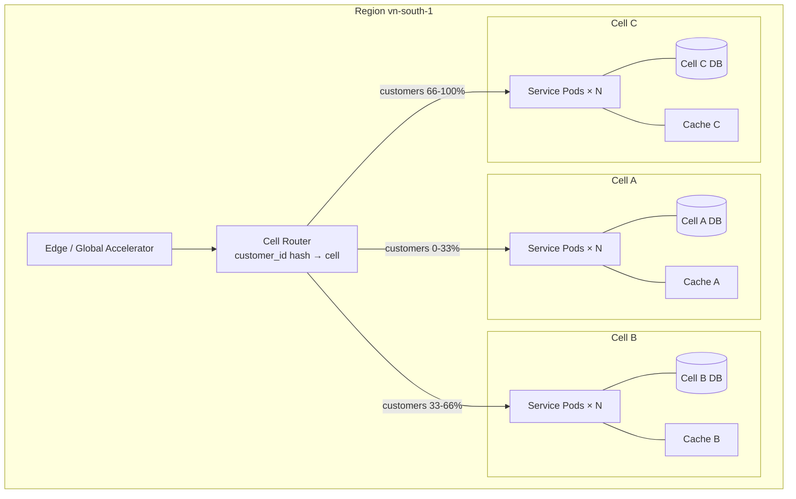

# Cell-Based Architecture

Status: Draft | Last Reviewed: 2026-05-09 | Owner: @sre-lead
Catalog ID: RES-005 | Radii
Tier Applicability: T0 (mandatory), T1 (recommended)

## Problem Statement

Within a single region, a [REF-001 Multi-Region Active-Active](../../reference-architectures/multi-region-active-active.md) deployment still has a single failure domain — one bad deployment, one runaway query, one DDoS at the edge can affect 100% of in-region users. Cell-Based Architecture partitions a region's capacity into N independent cells (default 3 per region) so that the blast radius of any failure is bounded to ≤ 1/N of users. This is the BCBS 230 impact-tolerance bounding (Principles 1–3) pattern made concrete.

## Context

Reach for this pattern when:

- Designing T0 services where a region-wide outage is regulator-relevant.
- Capacity-planning a service that handles > 1M users and a single failure cannot affect them all.
- Designing a deployment topology that allows progressive rollout (canary by cell).
- Planning a chaos-engineering programme ([BP-005](../../best-practices/chaos-engineering.md)) where blast-radius bounding makes drills safe in production.

This pattern *extends* [RES-001 Bulkhead Isolation](bulkhead-isolation.md) — bulkhead isolates resource pools within one process; cell-based isolates entire deployment slices including their own DBs.

## Solution



### Cell partitioning strategies

| Strategy | Routing key | When to use |
| --- | --- | --- |
| **Customer-hash (default)** | `hash(customer_id) mod N` | Most retail-banking flows |
| **Account-hash** | `hash(account_id) mod N` | Account services, ledger |
| **Tenant-hash** | `hash(tenant_id) mod N` | Multi-tenant B2B |
| **Time-based** | `hash(transaction_id) mod N` | Stateless / batch jobs |

The routing key MUST be stable for the same customer over time. Re-sharding (moving a customer between cells) is a controlled migration, not an automatic event.

### Cell sizing

- **Small cells (N=10+)**: tighter blast radius, more operational overhead
- **Medium cells (N=3-5)**: default for most T0 services
- **Large cells (N=2-3)**: minimal overhead but coarse blast radius

Sizing rule: each cell should be able to absorb 1/(N-1) of one failed cell's traffic during cell failover, without breaching latency budget. With N=3, each cell sized at 1.5× steady-state.

### Cell isolation requirements

Each cell must have its own:

- Compute (Kubernetes namespace + node-pool, or separate cluster)
- Database (separate Aurora cluster — not the same cluster split by schema)
- Cache (separate Redis cluster)
- Configuration (separate config-server profile)
- Observability namespace (separate Grafana folder, alerts, dashboards)

Cross-cell calls are forbidden in the request path. If a flow inherently crosses cells (e.g., transferring money between two customers in different cells), it goes through an inter-cell saga (INT-001) — never a synchronous call.

### Cell rollouts

Deployments roll out cell-by-cell:

1. Deploy to canary cell (1/N).
2. Bake for the configured period (15 minutes for T0, 1 hour for T1).
3. Measure golden signals ([BP-007](../../best-practices/golden-signals-sre.md)) against baseline.
4. Auto-rollback on regression; otherwise advance to next cell.
5. Final cell complete = full rollout.

## Implementation Guidelines

### Java / Spring — cell-aware routing at the gateway

```java
@Component
public class CellRouter {

    @Value("${techcombank.cells.count:3}")
    private int cellCount;

    public String routeToCell(String customerId) {
        int hash = Hashing.murmur3_32_fixed().hashString(customerId, StandardCharsets.UTF_8).asInt();
        int cell = Math.floorMod(hash, cellCount);
        return "cell-" + (char) ('A' + cell);   // cell-A, cell-B, cell-C
    }
}

@Configuration
public class GatewayCellConfig {

    @Bean
    public RouteLocator cellRoutes(RouteLocatorBuilder builder, CellRouter router) {
        return builder.routes()
            .route("cell-aware-payments", r -> r
                .path("/payments/**")
                .filters(f -> f
                    .filter((exchange, chain) -> {
                        String customerId = exchange.getRequest().getHeaders().getFirst("X-Customer-Id");
                        String cell = router.routeToCell(customerId);
                        URI cellUri = URI.create("lb://payment-auth-" + cell);
                        ServerWebExchange mutated = exchange.mutate()
                            .request(req -> req.uri(cellUri))
                            .build();
                        return chain.filter(mutated);
                    })
                )
                .uri("no://op")  // overridden by filter
            )
            .build();
    }
}
```

### Kubernetes — cell-isolated deployment

```yaml
# values per cell
# regions/vn-south-1/payment-auth/cell-A/values.yaml
cell: A
replicaCount: 6     # sized for 1/(N-1) absorption: 1.5 × steady-state
namespace: payment-auth-cell-a
database:
  cluster: payment-aurora-vns1-cell-a
cache:
  cluster: payment-redis-vns1-cell-a

# templates/deployment.yaml
metadata:
  namespace: {{ .Values.namespace }}
  labels:
    app: payment-auth
    techcombank.io/cell: {{ .Values.cell }}
    techcombank.io/region: {{ .Values.region }}
    techcombank.io/tier: T0
spec:
  template:
    spec:
      affinity:
        nodeAffinity:
          requiredDuringSchedulingIgnoredDuringExecution:
            nodeSelectorTerms:
              - matchExpressions:
                  - key: techcombank.io/cell-pool
                    operator: In
                    values: [{{ .Values.cell }}]
```

### Database — cell-scoped Aurora cluster

```yaml
# Each cell gets a separate Aurora Global Database cluster.
# Cross-cell DB queries are not possible (and not desired).
clusters:
  - name: payment-aurora-vns1-cell-a
    primary_region: vn-south-1
    secondary_region: vn-north-1
    instances: 2
  - name: payment-aurora-vns1-cell-b
    primary_region: vn-south-1
    secondary_region: vn-north-1
    instances: 2
  - name: payment-aurora-vns1-cell-c
    primary_region: vn-south-1
    secondary_region: vn-north-1
    instances: 2
```

### Cell migration (rare; controlled)

Moving a customer between cells (e.g., re-sharding when adding a 4th cell) is a planned operation:

1. Mark customer as "migrating".
2. Quiesce traffic to source cell for that customer (route to a "hold" service).
3. Copy DB rows; verify hash consistency.
4. Update routing-table entry.
5. Resume traffic on target cell.
6. Schedule source cleanup after cooling period.

This is a control-plane operation; not user-initiated.

### T24 / legacy

T24 is a single-region, single-cell system. Cell-based architecture in front of T24 is achieved by routing greenfield-service cells to a *shared* T24, with idempotency keys ensuring T24 round-trips remain safe under concurrent cell traffic. T24 itself remains a regional bottleneck — addressed long-term by the Strangler Fig migration ([INT-006](../integration/strangler-fig.md)).

### Frontend / Mobile

Clients don't choose cells; the edge / gateway routes them based on customer-id. To clients, cells are invisible. However, debugging tooling (logs, support tools) should display the routed cell for a customer to aid incident triage.

## Variants & Trade-offs

| Variant | When | Trade-off |
| --- | --- | --- |
| **Static cells (default)** | T0/T1 customer-facing | Simple; rebalance is rare |
| **Dynamic cells (auto-scaling cell count)** | Variable load | Complex routing; rebalance overhead |
| **Cell-per-tenant** | B2B with regulatory isolation | Strong isolation; many cells = high overhead |
| **Read-write split cells** | Read-heavy with cell-local replicas | Optimisation; complicates failover |

## NFR Acceptance Criteria

- **HA**: cell-level failure affects ≤ 1/N of users; surviving cells absorb the load. Combines with REF-001 multi-region to get RTO < 5 min on the affected fraction.
- **HP**: per-request latency unaffected (one extra hash lookup, < 0.1ms). Cells size to fit [NFR-002](../../nfr/latency-budget-model.md) per service tier.
- **HR**: blast radius bounded to 1/N. No silent cross-cell failure mode (forbidden cross-cell calls would be caught at code review).

## Compliance Mapping

| Layer | Reference | Section/Control | How this satisfies |
| --- | --- | --- | --- |
| Ring 0 | AWS Operational Excellence — bulkhead pattern | "Limit blast radius" | Cell-based is the deployment-level realisation of this principle |
| Ring 0 | Microsoft Cloud Patterns — Deployment Stamps | "Independent copies of components" | Equivalent concept; cells = stamps |
| Ring 1 | Basel BCBS 230 — Impact tolerance (Principles 1–3) ⚠️ (working summary — pending PDF fetch + Legal review) | "Banks must define and bound the impact of disruptions" | Cells make impact bounded to 1/N |
| Ring 1 | Basel BCBS 239 §6 (Accuracy) | Risk-data aggregation must avoid double-counting | Strict cell isolation prevents cross-cell duplicate processing |
| Ring 2 | SBV Circular 09/2020 §IV.2 | Operational continuity ⚠️ (working summary — pending Legal review) | Cells preserve service for the unaffected fraction during a single-cell incident |

## Cost / FinOps Notes

| Item | Cost driver | Order of magnitude |
|---|---|---|
| Compute | N cells × (1+ headroom) replicas | 1.2–1.5× single-cell baseline (depending on cell sizing rule) |
| Database | N independent Aurora clusters | ~N × per-cluster cost; possibly higher per-instance class |
| Cache | N independent Redis clusters | ~N × baseline |
| Cross-AZ data | Internal cell traffic only | Lower than one big cluster (bounded data movement) |
| Operational overhead | More moving parts to monitor | ~0.1 FTE per service for first 3 cells |

**Levers**:
- Use shared Kubernetes worker-node pool with cell taint/affinity to amortise infra costs.
- Consider read-only cells (no DB writes) for cheaper analytics/reporting workloads.

**Cost of NOT having cells for T0**: a single bug or DDoS that affects one cluster takes down 100% of in-region users. The differential cost of a 100% outage vs a 33% outage is far higher than the cell overhead.

## Threat Model Summary

STRIDE: addresses **Denial of Service** primarily; secondary on **Tampering** (cross-cell data leakage).

- **Top 3 threats addressed**:
  1. *Cell-wide bug* — affects 1/N users; surviving cells continue.
  2. *Targeted DDoS on one cell* — other cells absorb routed traffic; affected cell can be drained.
  3. *Bad deployment* — caught by canary cell metrics before reaching others.
- **Top 3 residual threats**:
  1. *Routing-table bug* — routes everyone to one cell. Mitigation: routing-table validation in CI; smoke test on every deploy.
  2. *Shared bottleneck* (T24, NAPAS, single cache) — outage of the shared dependency affects all cells. Mitigation: per-cell circuit breakers (RES-002); explicit dependency mapping.
  3. *Cell-pinning attack* — attacker forces traffic to one cell to overload it. Mitigation: customer-id is hash-distributed and stable; no client-controlled cell choice.

## Operational Runbook (stub)

- **Alerts**:
  - `Cell_Health_<cell>`: per-cell error rate / latency outside budget. Severity: tier-dependent.
  - `Cell_Skew_Detected`: customer distribution skew > 10% from expected (1/N). Severity: Warning.
  - `Cross_Cell_Call_Detected`: log message indicating an unexpected cross-cell synchronous call. Severity: Critical (architecture violation).
- **Dashboards**: Grafana — `cell-overview` (per-cell health), `cell-routing-distribution`, `cell-deployment-progress`.
- **Recovery**:
  - Cell down: drain traffic at routing layer; verify other cells absorb; deploy fix to the cell; restore.
  - Cell DB issue: failover at cell level (cell's own Aurora Global Database promotion); does not affect other cells.

## Test Strategy (stub)

- **Unit**: routing-table tests (hash distribution; no overlap; complete coverage).
- **Integration**: cell-isolation test — chaos-kill cell A's pods, verify cell B and C unaffected.
- **Chaos** ([BP-005](../../best-practices/chaos-engineering.md)): monthly cell-drain drill in production (one cell at a time); measure traffic shift, latency impact.
- **Performance**: load-test scenario where one cell is fully loaded — verify the other cells maintain their own load characteristics.
- **Deployment**: canary cell rollout test — verify automated regression detection and rollback.

## When to Use

- **Mandatory** for T0 customer-facing services with > 100k active users.
- **Recommended** for T1 services with significant blast-radius exposure (e.g., internet banking).

## When NOT to Use

- T2 batch / reporting services where blast radius is internal-only.
- T3 internal tooling.
- Services with a single hard external dependency that can't itself be cell-partitioned (e.g., a single-instance regulatory reporting endpoint) — the cell partitioning yields little benefit.

## Related Patterns

- [RES-001 Bulkhead Isolation](bulkhead-isolation.md) — within-process partitioning that cell-based extends
- [REF-001 Multi-Region Active-Active](../../reference-architectures/multi-region-active-active.md) — across-region; complementary
- [RES-002 Circuit Breaker](circuit-breaker.md) — per-cell circuit breakers prevent cross-cell cascades
- [RES-008 Throttling / Rate Limiting](throttling-rate-limiting.md) — per-cell rate limits
- [INT-001 Saga Orchestration](../integration/saga-orchestration.md) — required for inter-cell flows
- [BP-005 Chaos Engineering](../../best-practices/chaos-engineering.md) — cell-drain is the canonical chaos drill

## References

- AWS Reliability Pillar — "Cell-based architecture"
- "Reducing the Blast Radius" — AWS Operational Excellence whitepaper
- Microsoft "Deployment Stamps Pattern"
- Werner Vogels — "Cells are great, here's why" (re:Invent talk)

---

**Key Takeaway**: T0 services partition each region into N independent cells (default 3). Customer hash → cell. Each cell has its own DB / cache. Failure of one cell affects ≤ 1/N. Combined with REF-001 multi-region, blast radius is fully bounded.
