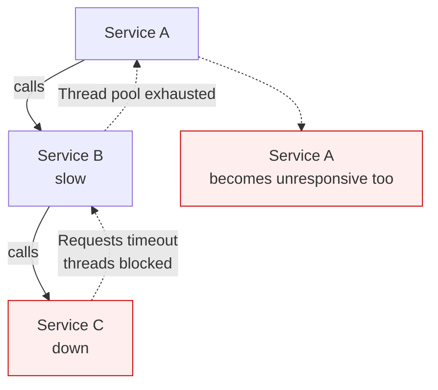
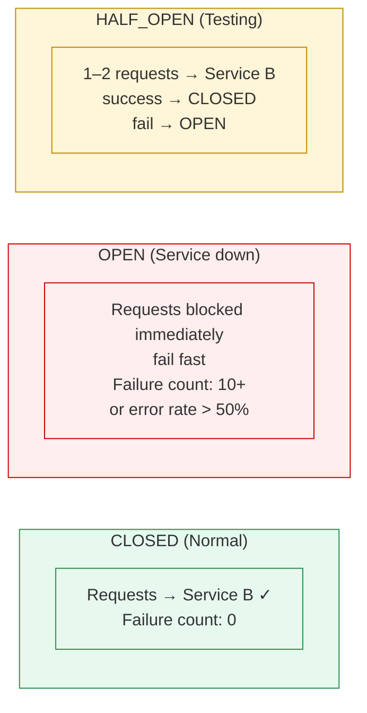
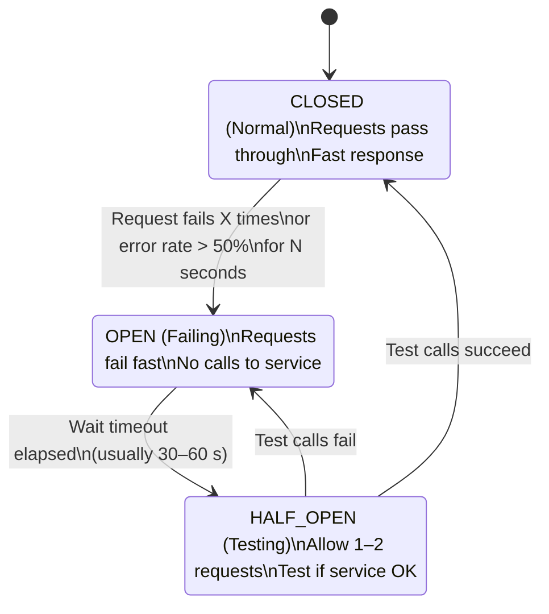

# Circuit Breaker Pattern

Status: Approved | Last Reviewed: 2026-05-09 | Owner: @sre-lead
Catalog ID: RES-002 | Radii
Tier Applicability: T0, T1, T2

## Problem Statement

Cascading failures occur when a service calls a downstream service that's slow or down:
- Thread pool exhaustion: requests wait for timeout, threads starve
- Resource depletion: connections, memory pile up
- Cascading outage: failures propagate upstream
- Slow requests degrade user experience



## Solution

Implement a circuit breaker. Monitor call failures; fail fast when service is struggling.



## State Diagram



## Implementation Guidelines

1. **Resilience4j Configuration** (Java)
   ```java
   @Configuration
   public class CircuitBreakerConfig {

     @Bean
     public CircuitBreaker orderServiceCircuitBreaker() {
       CircuitBreakerConfig config = CircuitBreakerConfig.custom()
         .failureRateThreshold(50)           // Open if error rate > 50%
         .slowCallRateThreshold(50)          // Count slow calls as failures
         .slowCallDurationThreshold(         // 2 second timeout = slow
           Duration.ofSeconds(2))
         .waitDurationInOpenState(           // Stay open for 30 seconds
           Duration.ofSeconds(30))
         .permittedNumberOfCallsInHalfOpenState(3)  // Allow 3 calls in half-open
         .slidingWindowType(SlidingWindowType.COUNT_BASED)
         .slidingWindowSize(10)              // Evaluate last 10 calls
         .build();

       return CircuitBreaker.of("order-service", config);
     }

     @Bean
     public CircuitBreakerRegistry circuitBreakerRegistry() {
       return CircuitBreakerRegistry.of(
         CircuitBreakerConfig.ofDefaults()
       );
     }
   }
   ```

2. **Annotated Service Call**
   ```java
   @Service
   public class OrderService {

     @Autowired
     private PaymentServiceClient paymentClient;

     @CircuitBreaker(name = "payment-service", fallbackMethod = "paymentFallback")
     @Retry(name = "payment-service")
     @Timeout(name = "payment-service")
     public PaymentResult processPayment(PaymentRequest request) {
       log.info("Calling payment service");
       return paymentClient.processPayment(request);
     }

     // Fallback method: called when circuit is open
     public PaymentResult paymentFallback(
         PaymentRequest request,
         CallNotPermittedException e) {
       log.error("Payment service circuit open, using fallback");
       // Option 1: Reject order
       throw new PaymentUnavailableException("Payment service unavailable");

       // Option 2: Use cached/stale data
       // return cache.getLastPaymentResult();

       // Option 3: Queue for async retry
       // asyncRetryQueue.add(request);
       // return PaymentResult.PENDING;
     }

     // Alternative: Fallback on any exception
     public PaymentResult paymentFallback(
         PaymentRequest request,
         Exception e) {
       if (e instanceof CallNotPermittedException) {
         log.error("Circuit breaker open");
         return PaymentResult.CIRCUIT_OPEN;
       }
       return PaymentResult.ERROR;
     }
   }
   ```

3. **Manual CircuitBreaker Usage**
   ```java
   @Service
   public class InventoryService {

     @Autowired
     private CircuitBreaker inventoryCircuitBreaker;

     public InventoryCheckResult checkInventory(String productId) {
       return inventoryCircuitBreaker.executeSupplier(() -> {
         // This is called when circuit is CLOSED
         log.info("Checking inventory for: {}", productId);
         return inventoryClient.check(productId);
       });
     }
   }
   ```

4. **Composite Resilience Pattern** (Circuit Breaker + Retry + Timeout)
   ```java
   @Service
   public class ResilientOrderService {

     @Autowired
     private OrderServiceClient orderClient;

     // Combined: timeout (2s) → retry (3 attempts) → circuit breaker
     @CircuitBreaker(name = "order-service", fallbackMethod = "orderFallback")
     @Retry(
       name = "order-service",
       maxAttempts = 3,
       delay = 1000,
       multiplier = 2.0  // exponential backoff
     )
     @Timeout(name = "order-service", duration = 2000)  // 2 second timeout
     public Order createOrder(CreateOrderRequest request) {
       return orderClient.create(request);
     }

     public Order orderFallback(CreateOrderRequest request, Exception e) {
       log.warn("Order service failed: {}", e.getMessage());
       // Return degraded response
       return new Order()
         .status(OrderStatus.PENDING_RETRY)
         .reason("Service temporarily unavailable");
     }
   }
   ```

5. **Monitoring Circuit Breaker State**
   ```java
   @Component
   public class CircuitBreakerMetrics {

     @Autowired
     private CircuitBreakerRegistry registry;

     @Scheduled(fixedRate = 10000)  // Every 10 seconds
     public void logCircuitBreakerStatus() {
       registry.getAllCircuitBreakers().forEach(cb -> {
         CircuitBreaker.State state = cb.getState();
         CircuitBreakerMetrics metrics = cb.getMetrics();

         log.info("CircuitBreaker: {} | State: {} | " +
           "Calls: {} | Failures: {} | Slow: {} | Error Rate: {}%",
           cb.getName(),
           state,
           metrics.getNumberOfBufferedCalls(),
           metrics.getNumberOfFailedCalls(),
           metrics.getNumberOfSlowCalls(),
           Math.round(metrics.getFailureRate() * 100)
         );
       });
     }

     @GetMapping("/health/circuit-breakers")
     public ResponseEntity<List<CircuitBreakerStatus>> getCircuitBreakerStatus() {
       List<CircuitBreakerStatus> statuses = registry.getAllCircuitBreakers()
         .stream()
         .map(cb -> new CircuitBreakerStatus(
           cb.getName(),
           cb.getState().toString(),
           cb.getMetrics().getFailureRate(),
           cb.getMetrics().getSlowCallRate()
         ))
         .collect(Collectors.toList());

       return ResponseEntity.ok(statuses);
     }
   }
   ```

6. **Configuration Best Practices**
   ```yaml
   # application.yml
   resilience4j:
     circuitbreaker:
       configs:
         default:
           failureRateThreshold: 50
           slowCallRateThreshold: 100
           slowCallDurationThreshold: 2000ms
           waitDurationInOpenState: 30s
           permittedNumberOfCallsInHalfOpenState: 3
           automaticTransitionFromOpenToHalfOpenEnabled: true
           slidingWindowType: COUNT_BASED
           slidingWindowSize: 100

       instances:
         payment-service:
           baseConfig: default
           failureRateThreshold: 60  # More lenient
           waitDurationInOpenState: 60s

         inventory-service:
           baseConfig: default
           failureRateThreshold: 40  # Stricter
           waitDurationInOpenState: 15s

     retry:
       configs:
         default:
           maxAttempts: 3
           waitDuration: 1000
           retryExceptions:
             - java.io.IOException
             - java.net.ConnectException
           ignoreExceptions:
             - java.lang.IllegalArgumentException

     timeout:
       configs:
         default:
           timeoutDuration: 2s
           cancelRunningFuture: true

   management:
     endpoints:
       web:
         exposure:
           include: health,metrics
     health:
       circuitbreakers:
         enabled: true
   ```

## Fallback Strategies

| Strategy | Use Case |
|----------|----------|
| **Fail Fast** | User gets error immediately |
| **Cached Data** | Show stale data (dashboard, catalog) |
| **Queue for Retry** | Async retry later (background jobs) |
| **Default Value** | Return sensible default |
| **Graceful Degradation** | Limited functionality |

## When to Use

- Microservice calls across services
- External API calls (payment gateway, SMS provider)
- Database queries that might be slow
- Cache misses (call database)
- Any call that might fail or be slow

## When NOT to Use

- Local method calls (no network involved)
- Critical paths that require real-time data
- Calls where failure must be immediate

## NFR Acceptance Criteria

- **HA**: prevents thread-pool exhaustion → preserves the calling service's availability when a downstream is degraded. A correctly configured CB never holds threads waiting through a timeout cycle on a confirmed-bad downstream.
- **HP**: state-machine evaluation < 0.1ms P95 in the CLOSED state (negligible). In OPEN state, fail-fast adds 0ms (immediate exception) versus 2s+ that a timeout would cost. Thus CB *improves* P95/P99 during downstream incidents, the opposite of what naïve thinking suggests.
- **HR**: failure mode is bounded — the CB does not cascade. State-transition observability ([BP-007 Golden Signals](../../best-practices/golden-signals-sre.md)) gives leading indicator of downstream issues. Pair with [RES-006 Timeout Budget](timeout-budget.md) and [RES-003 Retry with Backoff](retry-with-backoff.md) for full coverage.

## Compliance Mapping

| Layer | Reference | Section/Control | How this satisfies |
|---|---|---|---|
| Ring 0 (generic) | Resilience4j `/circuitbreaker` documentation | State-machine spec; config schema | Canonical implementation reference |
| Ring 0 (generic) | Microsoft Cloud Patterns — Circuit Breaker | "Handle faults that take variable time to fix" | Same pattern; same intent |
| Ring 0 (generic) | AWS Well-Architected Reliability — Failure mode design | Fault tolerance guidance | CB is the canonical fail-fast implementation |
| Ring 1 (intl banking) | Basel BCBS 230 Principle 6 (Incident Management) ⚠️ (working summary) | Operational resilience requires bounded fault propagation | CB bounds the time-to-fail on a degraded downstream → bounded incident impact |
| Ring 2 (Vietnam) | SBV Circular 09/2020 §IV.2 ⚠️ (working summary — pending Legal review) | Operational continuity | CB prevents single-downstream issues from cascading to T0 services |

## Cost / FinOps Notes

| Item | Driver | Order of magnitude |
|---|---|---|
| Runtime overhead (CLOSED) | sliding-window record per call | < 0.1ms; effectively free |
| Memory for state | per-instance × per-CB | A few KB per CB instance |
| Tooling | Resilience4j (free, MIT-licensed) | $0 |

**Cost of NOT having CB**: a single slow downstream causes thread-pool exhaustion across all upstream services, manifesting as a cluster-wide hang. Recovery requires manual restart of every affected pod. The differential cost vs an outage is enormous.

## Threat Model Summary

STRIDE: addresses **Denial of Service** primarily — CB defends against slow-downstream-induced thread starvation.

- **Top 3 threats addressed**:
  1. *Cascading failure from a slow downstream* — CB opens, calls fail fast, threads return immediately.
  2. *Thread-pool exhaustion DoS* — CB caps the number of in-flight requests against a struggling downstream.
  3. *Recovery storm on downstream restart* — HALF_OPEN gates the trickle of test traffic, preventing thundering herd.
- **Top 3 residual threats**:
  1. *Mis-tuned thresholds* — too sensitive trips on noise; too lenient never opens. Mitigation: review thresholds quarterly against actual outage data; chaos drills verify trip behaviour.
  2. *Fallback returns wrong/stale data without flagging* — graceful degradation must always surface the degraded state to the caller (e.g., HTTP 503 with `Retry-After`, or response body flag).
  3. *CB shared across diverse callers* — different callers tolerate different latency/error budgets. Mitigation: separate CB instances per (service, downstream) pair, not per service alone.

## Operational Runbook (stub)

- **Alerts**:
  - `CB_Opened`: any T0 circuit transitioned to OPEN. Severity: High (PagerDuty).
  - `CB_FlappingDetected`: > 5 OPEN↔CLOSED transitions in 10 min. Severity: High — usually a borderline downstream needing a separate fix.
  - `CB_StuckOpen`: a CB has been OPEN for > 30 min with no recovery. Severity: Critical — engages downstream-team escalation.
- **Dashboards**: Grafana — `circuit-breaker-overview` (state per CB, failure rate, slow-call rate, transitions over time).
- **On-call playbook**:
  1. Identify the OPEN circuit and its downstream.
  2. Check downstream's own health dashboard.
  3. If downstream is recovering: leave CB to auto-close via HALF_OPEN (default 30–60 s wait).
  4. If downstream is degraded indefinitely: engage downstream owner; consider feature-flagging the affected flow.
  5. Document the incident in `governance/decisions/REVIEW-LOG-{date}-incident.md`.

## Test Strategy (stub)

- **Unit**: CB state-machine transitions (CLOSED → OPEN on threshold; OPEN → HALF_OPEN after wait; HALF_OPEN → CLOSED/OPEN on test calls).
- **Integration**: Testcontainer downstream that simulates failures; verify CB opens, HALF_OPEN gates, recovers.
- **Chaos** ([BP-005 Chaos Engineering](../../best-practices/chaos-engineering.md)): inject downstream latency/errors during a quarterly drill; verify CB behaviour preserves upstream P95.
- **Performance**: load test with a downstream simulator that flips between healthy and degraded; verify upstream P99 stays bounded.

## Related Patterns

- [PRIN-006 Idempotency-by-default](../../principles/idempotency-by-default.md) — required for safe retry path
- [NFR-001 Service Tiering + RTO/RPO](../../nfr/service-tiering-rto-rpo.md) — tier dictates CB sensitivity
- [NFR-002 Latency Budget Model](../../nfr/latency-budget-model.md) — `slowCallDurationThreshold` derives from tier P95
- [RES-003 Retry with Backoff](retry-with-backoff.md) — pair with CB; retry inside the CB window
- [RES-005 Cell-Based Architecture](cell-based-architecture.md) — per-cell CBs prevent cross-cell cascades
- [RES-006 Timeout Budget](timeout-budget.md) — CB and timeout work together
- [RES-007 Fallback Strategies](fallback-strategies.md) — what to do when the CB is OPEN
- [BP-005 Chaos Engineering](../../best-practices/chaos-engineering.md) — drills exercise CB behaviour
- [BP-007 Golden Signals (SRE)](../../best-practices/golden-signals-sre.md) — CB transitions are an observability signal

## References

- [Resilience4j Documentation](https://resilience4j.readme.io/)
- [Martin Fowler on Circuit Breaker](https://martinfowler.com/bliki/CircuitBreaker.html)
- [Release It! (Book)](https://pragprog.com/titles/mnee2/release-it-second-edition/)

---

**Key Takeaway**: Monitor failures; fail fast when service is struggling. Circuit breaker prevents cascading failures by stopping requests before they timeout.
