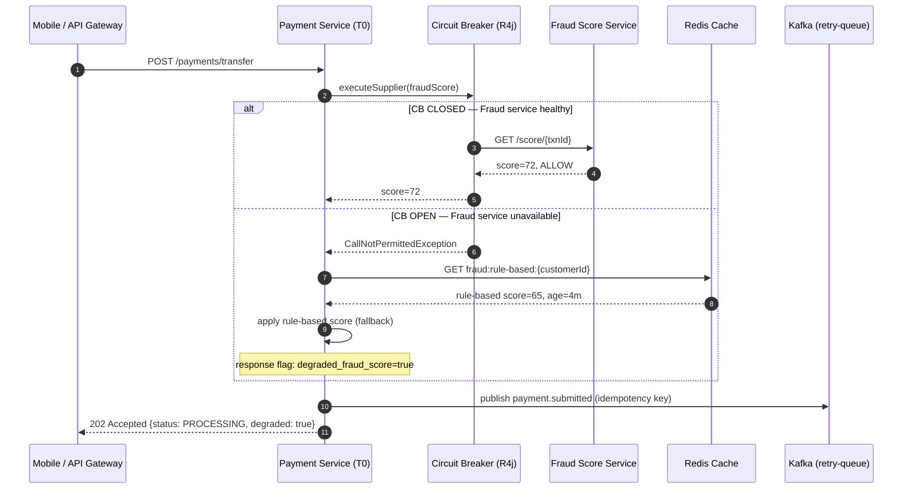

# Fallback Strategies

Status: Draft | Last Reviewed: 2026-05-09 | Owner: @sre-lead
Catalog ID: RES-007 | Radii
Tier Applicability: T0, T1

## Problem Statement

When a primary dependency is unavailable, the absence of an explicit fallback leaves the caller with a raw exception or a blank error surface:

- A circuit breaker in OPEN state (see [RES-002 Circuit Breaker](circuit-breaker.md)) stops calls to the downstream — but without a fallback method the caller sees `CallNotPermittedException` rather than a usable degraded response.
- Payment fraud scoring at Techcombank contacts a real-time ML model; if that model is unreachable, rejecting every payment cold is worse than serving a last-known rule-based score from cache.
- T24 Temenos core banking connectivity is not guaranteed at 100% uptime; balance enquiry flows that hard-fail when T24 is flapping erode customer trust in digital channels unnecessarily.
- NAPAS real-time credit transfers are T0; an outright rejection on transient NAPAS gateway errors violates the bank's SLA commitments and SBV payment continuity obligations.
- Notification services (FCM/APNs) experience regional outages; mobile push failures must not surface as visible errors to customers when in-app delivery on next open is acceptable.
- Without explicit fallback contracts, individual teams make inconsistent decisions about degraded-mode behaviour, creating audit gaps and unpredictable customer outcomes.

## Context

When a primary dependency is unavailable, the service must choose between hard failure and a degraded-but-functional response. For Techcombank T0 payment flows, hard failure is often worse than serving a stale risk score or queuing the request for retry. Resilience4j `@CircuitBreaker(fallbackMethod=...)` binds a fallback method to every protected call, ensuring that the degraded response is pre-defined, tested, and observable. The fallback strategy must be chosen per dependency: cached data works for balance enquiry; a Kafka deferred queue works for NAPAS retries; silent-fail works for push notifications.

## Solution

Define an explicit, tested fallback response for every external call: choose from cached-stale data, rule-based default, deferred-queue, or silent-fail strategies based on the consequence of each dependency being absent.



## Implementation Guidelines

1. **Resilience4j `@Fallback` binding** — attach a fallback method to every `@CircuitBreaker`-annotated call. The fallback must accept the same parameter signature plus the triggering exception.

   ```java
   @Service
   @Slf4j
   public class FraudScoringService {

       private static final String CB_NAME = "fraud-score-service";

       @CircuitBreaker(name = CB_NAME, fallbackMethod = "ruleBasedScoreFallback")
       public FraudScore realtimeScore(String customerId, BigDecimal amount, String correlationId) {
           log.info("correlationId={} Calling realtime fraud score", correlationId);
           return fraudClient.score(customerId, amount);
       }

       // Fallback 1: circuit open or any exception
       private FraudScore ruleBasedScoreFallback(
               String customerId, BigDecimal amount, String correlationId,
               Exception ex) {
           log.warn("correlationId={} Fraud score fallback triggered cause={}", correlationId, ex.getClass().getSimpleName());
           FraudScore cached = fraudScoreCache.getLastKnown(customerId);
           if (cached != null && cached.ageSeconds() < 300) {
               return cached.withFlag(DegradedFlag.RULE_BASED_CACHE);
           }
           // Conservative allow if no cache — block only if amount exceeds threshold
           return amount.compareTo(HIGH_RISK_THRESHOLD) > 0
               ? FraudScore.conservativeBlock(correlationId)
               : FraudScore.conservativeAllow(correlationId);
       }
   }
   ```

2. **Spring Cache as stale-but-available fallback** — balance enquiry falls back to read-replica cache when T24 OFS is unreachable. The response envelope always carries a `dataFreshness` timestamp so consumers can make informed decisions.

   ```java
   @Service
   @Slf4j
   public class BalanceEnquiryService {

       @CircuitBreaker(name = "t24-ofs", fallbackMethod = "cachedBalanceFallback")
       @Cacheable(value = "balance", key = "#accountId", unless = "#result.degraded")
       public BalanceResponse liveBalance(String accountId, String correlationId) {
           log.info("correlationId={} Fetching live balance from T24 for account={}", correlationId, accountId);
           return t24OfsClient.getBalance(accountId);
       }

       private BalanceResponse cachedBalanceFallback(
               String accountId, String correlationId, Exception ex) {
           log.warn("correlationId={} T24 unavailable, serving cached balance account={}", correlationId, accountId);
           BalanceResponse stale = balanceCache.get(accountId);
           if (stale == null) {
               throw new CoreBankingUnavailableException("Balance unavailable; T24 unreachable and no cache entry");
           }
           return stale.toBuilder()
               .degraded(true)
               .stalenessNotice("Balance as at " + stale.asAt() + "; live data temporarily unavailable")
               .build();
       }
   }
   ```

3. **Kafka deferred-execution fallback for NAPAS** — a transient NAPAS gateway failure must not immediately reject a customer payment. Queue the payment on Kafka for ordered retry; respond 202 Accepted to preserve the T0 commitment.

   ```java
   @Service
   @Slf4j
   public class NapasGatewayService {

       @CircuitBreaker(name = "napas-gateway", fallbackMethod = "deferToRetryQueue")
       public NapasAck submitCreditTransfer(CreditTransferRequest req, String correlationId) {
           log.info("correlationId={} Submitting to NAPAS txnId={}", correlationId, req.getTxnId());
           return napasClient.submit(req);
       }

       private NapasAck deferToRetryQueue(CreditTransferRequest req, String correlationId, Exception ex) {
           log.warn("correlationId={} NAPAS unavailable, queuing for retry txnId={}", correlationId, req.getTxnId());
           PaymentRetryEvent event = PaymentRetryEvent.builder()
               .txnId(req.getTxnId())
               .payload(req)
               .correlationId(correlationId)
               .enqueuedAt(Instant.now())
               .maxRetries(5)
               .build();
           kafkaTemplate.send("payment.napas.retry", req.getTxnId(), event);
           return NapasAck.queued(req.getTxnId(), correlationId);
       }
   }
   ```

4. **Product catalogue: cached static list fallback** — non-transactional T1 flows tolerate stale content gracefully. Serve from a pre-warmed local cache; omit dynamic pricing fields with a visible content-warning header.

   ```java
   @Service
   @Slf4j
   public class ProductCatalogueService {

       @CircuitBreaker(name = "cms-service", fallbackMethod = "staticCatalogueFallback")
       public List<Product> fetchCatalogue(String correlationId) {
           return cmsClient.getProducts();
       }

       private List<Product> staticCatalogueFallback(String correlationId, Exception ex) {
           log.warn("correlationId={} CMS unavailable, serving static catalogue", correlationId);
           return staticProductLoader.load(); // loaded from classpath at startup
       }
   }
   ```

5. **Push notification: silent-fail / in-app fallback** — if FCM/APNs are unreachable, record a pending in-app notification. No error is surfaced to the customer; the notification appears on next app open.

   ```java
   @Service
   @Slf4j
   public class NotificationDispatchService {

       @CircuitBreaker(name = "push-gateway", fallbackMethod = "inAppNotificationFallback")
       public void sendPush(PushNotification notification, String correlationId) {
           log.info("correlationId={} Sending push to userId={}", correlationId, notification.getUserId());
           pushGatewayClient.send(notification);
       }

       private void inAppNotificationFallback(PushNotification notification, String correlationId, Exception ex) {
           log.warn("correlationId={} Push gateway unavailable, storing in-app notification userId={}", correlationId, notification.getUserId());
           inAppNotificationRepository.save(InAppNotification.from(notification));
           // No exception rethrown — silent degradation is correct behaviour here
       }
   }
   ```

6. **YAML configuration** — tune circuit breaker windows per dependency; keep fallback timeouts well inside the tier's latency budget.

   ```yaml
   resilience4j:
     circuitbreaker:
       instances:
         fraud-score-service:
           failureRateThreshold: 40
           waitDurationInOpenState: 20s
           slidingWindowSize: 20
           permittedNumberOfCallsInHalfOpenState: 2
         t24-ofs:
           failureRateThreshold: 50
           waitDurationInOpenState: 30s
           slidingWindowSize: 10
         napas-gateway:
           failureRateThreshold: 30
           waitDurationInOpenState: 15s
           slidingWindowSize: 20
         cms-service:
           failureRateThreshold: 60
           waitDurationInOpenState: 60s
           slidingWindowSize: 10
         push-gateway:
           failureRateThreshold: 70
           waitDurationInOpenState: 30s
           slidingWindowSize: 20

   spring:
     cache:
       type: redis
     data:
       redis:
         timeout: 500ms
   ```

## When to Use

- The service has a well-defined degraded-mode response that is safer than hard failure (stale data, rule-based default, deferred queue).
- The dependency is external or shared-infrastructure (T24, NAPAS, fraud ML, CMS, push gateways).
- Compliance or UX requires the user journey to continue at reduced fidelity rather than terminate.
- The fallback can be instrumented distinctly (separate metric labels) so SREs see degraded-mode usage.

## When Not to Use

- Consistency is non-negotiable: a debit instruction must never proceed on stale balance if the stale value would lead to an overdraft beyond policy limits.
- The fallback itself requires the unavailable dependency (circular fallback).
- The operation is idempotency-critical and the fallback cannot guarantee deduplication — queue-based fallbacks must carry idempotency keys (see [PRIN-006 Idempotency-by-default](../../principles/idempotency-by-default.md)).
- The degraded response could cause regulatory mis-reporting (e.g., serving a cached transaction list that omits a just-settled payment to a compliance query).

## Variants & Trade-offs

| Variant | When | Trade-off |
|---|---|---|
| **Cache-stale** | Read-heavy, tolerance for seconds-to-minutes staleness (balance enquiry, product list) | Cache invalidation complexity; staleness window must be disclosed in response |
| **Rule-based default** | ML/AI service unavailable; deterministic rules exist as a safe baseline (fraud scoring) | Less accurate than model; requires rule maintenance; audit trail needed |
| **Deferred queue (Kafka)** | Operation must eventually complete; immediate confirmation acceptable (NAPAS retry) | Eventual consistency; consumer must handle ordering and deduplication |
| **Silent-fail** | Side-effect only; failure has no business impact on the primary flow (push notification) | Notification debt accumulates if gateway is down for extended periods |
| **Hard reject** | No safe degraded response exists; wrong data is worse than no data (overdraft risk) | Worse UX; should only apply to T0 safety-critical paths |

## NFR Acceptance Criteria

```yaml
service_name: "payment-service-fallback-strategies-compliance"
tier: T0
acceptance_criteria:
  - id: FS-1
    description: "Fallback activation latency"
    requirement: "Fallback method must complete within 200ms P99 when invoked; cache reads must complete within 50ms P99"
    measurement: "Micrometer timer on fallback method execution; alert if P99 > 200ms"
  - id: FS-2
    description: "Fallback observability"
    requirement: "Every fallback invocation emits a structured log entry (correlationId, dependency name, fallback type) and increments a labeled Prometheus counter; Grafana dashboard shows fallback rate per dependency"
    measurement: "Zero-tolerance for silent fallback invocations lacking log + metric; verify in integration test"
  - id: FS-3
    description: "Degraded-response disclosure"
    requirement: "Any API response produced by a fallback path must carry a machine-readable degradation flag (JSON field degraded:true or HTTP header X-Degraded-Response:true); UI layer must surface a user-facing notice within 1 release cycle"
    measurement: "Contract test asserts presence of flag on fallback response; UI acceptance test verifies notice"
  - id: FS-4
    description: "Queue-based fallback durability"
    requirement: "Kafka retry topic must have replication-factor=3, min.insync.replicas=2; consumer must process with exactly-once semantics using idempotency key; no payment lost during a 30-minute NAPAS outage simulation"
    measurement: "Chaos drill: shut NAPAS gateway for 30 min; verify all queued payments settled post-recovery with zero duplicates"
```

## Compliance Mapping

| Layer | Reference | Section/Control | How |
|---|---|---|---|
| Ring 0 | AWS Well-Architected Reliability — Design for Failure | REL 10: Use graceful degradation | Fallback strategies are the implementation mechanism for graceful degradation at the API level |
| Ring 0 | Resilience4j Documentation — Fallback | `@CircuitBreaker(fallbackMethod=...)` spec | Canonical library used; implementation follows documented fallback method contract |
| Ring 0 | Microsoft Cloud Design Patterns — Fallback | Fallback pattern specification | Pattern definition aligns; Kafka deferred-queue variant maps to Queue-Based Load Levelling |
| Ring 1 | BCBS 230 Principle 6 ⚠️ (working summary — pending PDF fetch) | Operational resilience — continuity of critical functions | Explicit fallbacks bound failure impact: critical payment flows continue in degraded mode rather than halting entirely |
| Ring 2 | SBV Circular 09/2020; Decree 13/2023 | §IV.2 Payment system continuity | Queue-based NAPAS fallback satisfies continuity obligation; cached-balance fallback with staleness disclosure satisfies transparency obligation ⚠️ (working summary — pending Legal review) |

## Cost / FinOps Notes

| Item | Driver | Order of magnitude |
|---|---|---|
| Redis cache (fallback store) | Memory per cached entity × number of accounts | Existing Redis cluster; incremental cost for balance/score cache < 5% headroom |
| Kafka retry topic | Partition × replication × message size | ~1 MB/s at peak; retained for 24 h; ~86 GB/day — fits within existing Kafka allocation |
| Additional metric cardinality | Label dimensions: dependency × fallback_type | ~30 new time series; negligible Prometheus cost |
| Rule-based fallback compute | CPU for rule evaluation vs. ML call | Lower CPU than ML inference; net cost reduction during degraded mode |

**Cost of NOT having fallbacks**: a single T24 OFS disruption that hard-fails all balance enquiries causes customer-visible errors on the digital banking app, escalates to contact centre, and may trigger SBV incident reporting obligations.

## Threat Model Summary

STRIDE focus: **Tampering** and **Elevation of Privilege** via fallback path abuse.

- **Top 3 threats addressed:**
  1. *Dependency failure causing T0 service cascade (Denial of Service)* — fallback bounds the blast radius; the calling service remains available at reduced fidelity.
  2. *Inconsistent degraded-mode behaviour across teams* — a catalogued fallback contract standardises the response, reducing audit surface.
  3. *Silent data staleness (Information Disclosure)* — degraded-response disclosure flag prevents consumers from treating stale data as fresh.
- **Top 3 residual threats:**
  1. *Fallback abused as an attack vector (Elevation of Privilege)* — an attacker that can force a dependency to fail may intentionally trigger rule-based fraud scoring (which may be less accurate). Mitigation: fallback fraud scores above a conservative threshold still block; threshold reviewed quarterly.
  2. *Cache poisoning (Tampering)* — stale balance served from a compromised Redis entry. Mitigation: Redis secured with mTLS + ACL; balance cache entries include a HMAC; Vault-managed secrets.
  3. *Kafka retry queue message injection (Tampering)* — malformed retry events could replay arbitrary payments. Mitigation: retry topic ACL restricts producers to payment-service identity; idempotency key checked before processing.

## Operational Runbook (stub)

- **Alerts:**
  - Alert: FallbackRateHigh — fallback rate for any dependency > 5% over 5 min. Severity: Warning.
  - Alert: FallbackRateCritical — fallback rate > 20% over 2 min (fraud-score or T24). Severity: High — PagerDuty.
  - Alert: NapasRetryQueueDepth — `payment.napas.retry` consumer lag > 500. Severity: Critical — payment backlog accumulating.
- **Dashboards:** Grafana — `fallback-strategies-overview`: fallback rate per dependency, cache hit ratio, retry queue lag, degraded-response rate.
- **On-call playbook:**
  1. Identify which dependency triggered the fallback from the `dependency` label on the `fallback_invocation_total` metric.
  2. Check the dependency's own health dashboard and alert channel.
  3. If the fallback is cache-stale: confirm cache TTL has not expired; check Redis sentinel health.
  4. If the fallback is queue-based: confirm Kafka consumer group is running; check consumer lag trend.
  5. Engage dependency owner if fallback has been active > 15 min for T0 dependencies.
  6. Log incident in `governance/decisions/REVIEW-LOG-{date}-incident.md`.

## Test Strategy (stub)

- **Unit:** Mock the downstream client to throw `CallNotPermittedException`; assert the fallback method returns the expected degraded response with the correct flag.
- **Integration:** WireMock stub the dependency to return 503; verify the full request cycle produces a 202 with `degraded:true` in the response body.
- **Cache fallback test:** Pre-load Redis with a known stale entry; shut the dependency; assert the fallback serves the stale entry with correct `stalenessNotice`.
- **Queue fallback test:** Testcontainers Kafka; shut the NAPAS mock; assert the retry event is published with the correct idempotency key and no duplicate after consumer processes it.
- **Chaos:** Quarterly drill — inject 100% error rate on T24 OFS for 5 min during business hours; verify balance enquiry fallback rate rises, no 5xx surfaces to clients, and SLO breach counter does not increment.

## Related Patterns

- [RES-002 Circuit Breaker](circuit-breaker.md) — fallback strategies are the complement to circuit breaker OPEN state
- [RES-003 Retry with Backoff](retry-with-backoff.md) — retry is the first line; fallback is the last resort when retry budget is exhausted
- [RES-006 Timeout Budget](timeout-budget.md) — timeout triggers the exception that activates the fallback
- [RES-009 Load Shedding](load-shedding.md) — shed requests may also need a fallback response (HTTP 503 + Retry-After)
- [RES-012 Health Check Aggregation](health-check-aggregation.md) — dependency health status informs fallback readiness monitoring
- [PRIN-006 Idempotency-by-default](../../principles/idempotency-by-default.md) — queue-based fallbacks require idempotency keys
- [NFR-001 Service Tiering + RTO/RPO](../../nfr/service-tiering-rto-rpo.md) — tier dictates acceptable fallback fidelity
- [BP-007 Golden Signals (SRE)](../../best-practices/golden-signals-sre.md) — fallback rate is an error-budget signal

## References

- [Resilience4j Documentation — Fallback](https://resilience4j.readme.io/docs/circuitbreaker)
- [AWS Well-Architected — Reliability Pillar](https://docs.aws.amazon.com/wellarchitected/latest/reliability-pillar/welcome.html)
- [Microsoft Cloud Design Patterns — Fallback](https://learn.microsoft.com/en-us/azure/architecture/patterns/)
- [Release It! (Michael T. Nygard)](https://pragprog.com/titles/mnee2/release-it-second-edition/)

---
**Key Takeaway**: Every circuit-breaker OPEN state must have a pre-defined, tested fallback response — for Techcombank T0 flows, that means cached risk scores, stale balances with disclosure, or Kafka-queued retries rather than blank errors.
