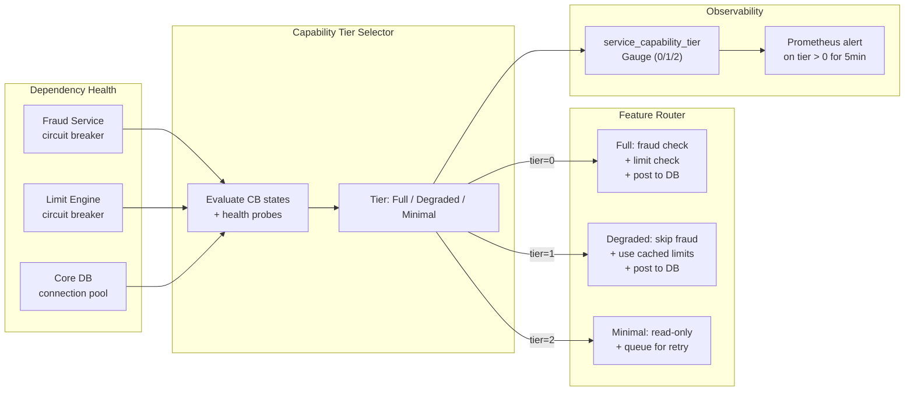

# Graceful Degradation

Status: Draft | Last Reviewed: 2026-05-27 | Owner: @sre-lead
Catalog ID: RES-004 | Radii
Tier Applicability: T0, T1, T2

## Problem Statement

Services fail completely when a non-critical dependency becomes unavailable, denying all users even when a meaningful subset of features can still be served from local state or cached data. A payment gateway that calls a real-time fraud-screening service and returns HTTP 500 to every payment request on a scoring service timeout is denying 100% of payments — when the operationally correct behaviour for amounts below a pre-approved threshold is to accept the payment and route it to a post-hoc fraud review queue. The binary model (fully-functional or fully-broken) violates BCBS 230 impact tolerance: a T0 service must continue operating at a defined reduced-service level under stress, not shut down entirely.

Banking systems fail this way for two reasons: the dependency graph is not documented with criticality tiers, and services do not distinguish between "I need this dependency to do anything" and "I need this dependency to do this specific optional thing." A settlement batch that aborts entirely when the position-keeping reporting feed is slow — instead of completing the batch and flagging the report as pending — is a design flaw, not an infrastructure problem.

## Context

Graceful degradation is a resilience strategy that defines multiple capability tiers for a service, each representing a different level of feature availability based on the health of its dependencies. The service continuously monitors dependency health (via circuit breakers, RES-002) and transitions to the appropriate tier automatically when a dependency circuit opens. The tier selection is exposed as a metric (`service.capability.tier`) for observability and alerting.

Graceful degradation is complementary to circuit breakers (RES-002), fallback strategies (RES-007), and load shedding (RES-009). The circuit breaker detects the failure; the fallback strategy provides the alternative data source; graceful degradation is the coordination layer that ties them together and makes the tier-selection logic explicit and auditable. The IDP golden path (PLT-004) includes a capability tier configuration template in the service skeleton.

## Solution

Define a capability tier enum per service (Full, Degraded, Minimal) with explicit documentation of which features are available at each tier. A `CapabilityTierSelector` bean evaluates the circuit breaker states of all dependencies and returns the highest available tier. Feature availability is gated by `@ConditionalOnCapability(tier = FULL)` annotations (or equivalent feature flags from PLT-004). A Prometheus Gauge metric `service_capability_tier` (0=Full, 1=Degraded, 2=Minimal) enables alerting on extended degradation.



## Implementation Guidelines

**1. Capability tier enum and selector (Spring Boot + Resilience4j)**

```java
// src/main/java/com/banking/resilience/CapabilityTier.java
public enum CapabilityTier {
    FULL(0, "All features available"),
    DEGRADED(1, "Non-critical dependencies unavailable — core features only"),
    MINIMAL(2, "Read-only mode — writes queued for retry");

    public final int metricValue;
    public final String description;

    CapabilityTier(int metricValue, String description) {
        this.metricValue = metricValue;
        this.description = description;
    }
}

// src/main/java/com/banking/resilience/CapabilityTierSelector.java
@Component
public class CapabilityTierSelector {

    private final CircuitBreakerRegistry circuitBreakerRegistry;
    private final AtomicReference<CapabilityTier> currentTier =
        new AtomicReference<>(CapabilityTier.FULL);

    public CapabilityTierSelector(CircuitBreakerRegistry registry,
                                   MeterRegistry meterRegistry) {
        this.circuitBreakerRegistry = registry;
        Gauge.builder("service.capability.tier", currentTier,
                      ref -> ref.get().metricValue)
             .description("Current service capability tier (0=Full, 1=Degraded, 2=Minimal)")
             .register(meterRegistry);
    }

    @Scheduled(fixedDelay = 5000)
    public void evaluate() {
        boolean fraudOpen    = isOpen("fraud-screening-service");
        boolean limitsOpen   = isOpen("limit-engine");
        boolean dbAvailable  = !isOpen("core-database");

        CapabilityTier tier;
        if (!dbAvailable) {
            tier = CapabilityTier.MINIMAL;
        } else if (fraudOpen || limitsOpen) {
            tier = CapabilityTier.DEGRADED;
        } else {
            tier = CapabilityTier.FULL;
        }

        currentTier.set(tier);
    }

    public CapabilityTier current() {
        return currentTier.get();
    }

    private boolean isOpen(String name) {
        return circuitBreakerRegistry.circuitBreaker(name)
            .getState() == CircuitBreaker.State.OPEN;
    }
}
```

**2. Feature gating in the payment service**

```java
// src/main/java/com/banking/payment/PaymentService.java
@Service
public class PaymentService {

    private final CapabilityTierSelector tierSelector;
    private final FraudScreeningClient fraudClient;
    private final LimitEngineClient limitClient;
    private final CachedLimitRepository cachedLimits;
    private final PaymentRepository paymentRepo;
    private final RetryQueue retryQueue;

    public PaymentResult processPayment(PaymentRequest request) {
        CapabilityTier tier = tierSelector.current();

        return switch (tier) {
            case FULL -> processFullCapability(request);
            case DEGRADED -> processDegradedCapability(request);
            case MINIMAL -> processMinimalCapability(request);
        };
    }

    private PaymentResult processFullCapability(PaymentRequest request) {
        FraudScore score = fraudClient.score(request);
        if (score.isHighRisk()) {
            return PaymentResult.declined("FRAUD_HIGH_RISK");
        }
        limitClient.checkAndDeduct(request);
        paymentRepo.persist(request);
        return PaymentResult.approved();
    }

    private PaymentResult processDegradedCapability(PaymentRequest request) {
        // Skip real-time fraud; apply rule-based pre-approval for low amounts
        if (request.amountVnd().compareTo(DEGRADED_AUTO_APPROVE_THRESHOLD) > 0) {
            retryQueue.enqueue(request);   // queue for post-processing
            return PaymentResult.pendingReview("FRAUD_SERVICE_UNAVAILABLE");
        }
        // Use cached limits instead of real-time
        cachedLimits.checkAndDeduct(request);
        paymentRepo.persist(request);
        return PaymentResult.approved().withFlag("DEGRADED_MODE");
    }

    private PaymentResult processMinimalCapability(PaymentRequest request) {
        retryQueue.enqueue(request);
        return PaymentResult.queued("SERVICE_DEGRADED_QUEUED_FOR_RETRY");
    }
}
```

**3. Prometheus alert for degraded mode**

```yaml
# platform/prometheus/rules/capability-tier.yaml
groups:
  - name: capability.degradation
    rules:
      - alert: ServiceCapabilityDegraded
        expr: service_capability_tier{job="payment-gateway"} >= 1
        for: 5m
        labels:
          severity: warning
        annotations:
          summary: "{{ $labels.job }} operating in degraded capability tier {{ $value }}"
          description: >
            Service {{ $labels.job }} has been in tier {{ $value }}
            ({{ if eq $value 1.0 }}DEGRADED{{ else }}MINIMAL{{ end }})
            for more than 5 minutes. Check circuit breaker states.
          runbook_url: "https://backstage.internal/docs/resilience/graceful-degradation"

      - alert: ServiceCapabilityMinimal
        expr: service_capability_tier{job="payment-gateway"} >= 2
        for: 2m
        labels:
          severity: critical
        annotations:
          summary: "{{ $labels.job }} in MINIMAL capability — writes queued"
          description: >
            Service {{ $labels.job }} is in MINIMAL mode (primary DB unavailable).
            Payments are being queued for retry. Page the on-call SRE immediately.
```

**4. Capability tier configuration in application.yml**

```yaml
# src/main/resources/application.yml
banking:
  capability:
    degraded-auto-approve-threshold-vnd: 5_000_000   # 5M VND
    evaluation-interval-ms: 5000
    dependencies:
      fraud-screening:
        circuit-breaker: fraud-screening-service
        tier-impact: DEGRADED              # if open → DEGRADED
      limit-engine:
        circuit-breaker: limit-engine
        tier-impact: DEGRADED              # if open → DEGRADED
      core-database:
        circuit-breaker: core-database
        tier-impact: MINIMAL               # if open → MINIMAL

resilience4j:
  circuitbreaker:
    instances:
      fraud-screening-service:
        failure-rate-threshold: 50
        wait-duration-in-open-state: 30s
        sliding-window-size: 20
      limit-engine:
        failure-rate-threshold: 50
        wait-duration-in-open-state: 30s
        sliding-window-size: 10
      core-database:
        failure-rate-threshold: 80
        wait-duration-in-open-state: 10s
        sliding-window-size: 5
```

## When to Use

- Any T0/T1 service that calls non-critical dependencies where partial functionality is better than complete denial
- When BCBS 230 impact tolerance requires the service to operate at a defined reduced-service level under stress
- When a service's dependency graph has a clear criticality hierarchy (critical path vs. enrichment services)
- When incident retrospectives reveal that a service failed completely due to a non-critical dependency timeout

## When Not to Use

- Services where all dependencies are equally critical and no meaningful subset of functionality can be served without them (e.g., a pure ledger posting service that cannot post without its primary database)
- Simple CRUD services that directly proxy a single backend — graceful degradation requires a meaningful "reduced feature" definition to be worthwhile
- When the degraded behaviour is more dangerous than complete failure (e.g., a compliance screening service that must not approve any transaction if the screening dependency is unavailable — use a fail-safe default of reject, not degrade)

## Variants

| Variant | When to prefer | Trade-off |
|---------|----------------|-----------|
| Capability tier with circuit breaker (this pattern) | Services with clear non-critical dependency hierarchy | Requires explicit tier definition and feature gating code per service |
| Feature flag–based degradation (LaunchDarkly / GrowthBook) | Teams already using feature flags for progressive delivery | Requires external flag evaluation service (itself a dependency); better for user-facing features than infrastructure degradation |
| Bulkhead + timeout only (RES-001 + RES-006) | Teams not ready for full capability tier model | Prevents cascade but does not enable partial service; simpler to implement |
| Stale-while-revalidate (cache-first) | Read-heavy services where stale data is acceptable | No write support during degradation; simpler code path |

## NFR Acceptance Criteria

```yaml
nfr_acceptance_criteria:
  catalog_id: RES-004
  pattern: Graceful Degradation
  performance:
    - id: RES-004-HP-01
      description: Capability tier transition (Full → Degraded) must complete within 100ms of circuit breaker opening — no user requests should fail during the transition window.
      threshold: tier_transition_latency < 100ms
    - id: RES-004-HP-02
      description: Services in Degraded mode must serve at least 80% of core transaction volume at the T0 latency SLO (p99 < 300ms for payment processing).
      threshold: degraded_mode_core_throughput >= 80%
  compliance:
    - id: RES-004-COMP-01
      description: Every T0 service must document at least 2 capability tiers (Full and Degraded) with explicit feature availability per tier in its catalog-info.yaml and runbook.
      threshold: 0 T0 services without documented degraded capability tier
    - id: RES-004-COMP-02
      description: Service capability tier must be emitted as a Prometheus Gauge metric and must trigger a PagerDuty alert when in Degraded mode for more than 5 minutes.
      threshold: 0 T0 services without service_capability_tier metric and alert
```

## Compliance Mapping

| Ring | Regulation | Provision | How this pattern satisfies |
|------|-----------|-----------|---------------------------|
| Ring 0 | Microsoft Cloud Design Patterns — Graceful Degradation | Recommendation: services should define degraded modes and transition automatically to maintain core service availability | Capability tier selector + circuit breaker integration implements automatic tier transition; feature gating enforces tier boundaries; metric and alert provide observability into degraded state |
| Ring 1 | BCBS 230 | Principle 6 — impact tolerance: critical operations must remain within tolerated disruption thresholds under severe but plausible stress scenarios | Capability tier model defines the tolerated disruption level explicitly (Degraded = 80% throughput at SLO); automatic tier selection ensures the service remains within tolerance without manual SRE intervention; `service_capability_tier` metric provides auditable evidence of disruption duration |
| Ring 2 | SBV Circular 09/2020 | §IV.2 — availability continuity obligations for critical banking services: services must maintain defined service levels during partial infrastructure failures | Degraded capability tier ensures payment processing continues at reduced capacity even when fraud screening or limit engine is unavailable; Minimal tier ensures payments are queued (not lost) when the primary database is unavailable ⚠️ (working summary — pending Legal review) |

## Cost / FinOps Notes

- Implementation cost: 2–3 engineer-days per service to define tiers, implement `CapabilityTierSelector`, and add feature gating — one-time cost
- Retry queue storage: Kafka-backed retry queue for Minimal-mode queued payments; at peak 1,000 TPS × 10-minute Minimal window = 600,000 messages × 1 KB each = 600 MB Kafka storage; within normal Kafka retention budget
- No additional infrastructure: capability tier evaluation is in-process (no external service required); the only external dependency is the existing Prometheus + PagerDuty stack
- Incident cost reduction: a 30-minute complete payment outage at T0 volume costs ~3,000 failed transactions; graceful degradation to 80% throughput reduces the cost to ~600 failed transactions — 80% reduction in customer impact

## Threat Model

**Deliberate Degradation — forcing Minimal capability to bypass fraud screening (Elevation of Privilege)**: an attacker deliberately triggers timeouts on the fraud-screening service circuit breaker (by sending high-volume invalid requests to the fraud endpoint), causing the payment gateway to enter Degraded mode and process high-value transactions without real-time fraud screening. Mitigation: the Degraded auto-approve threshold is set to 5M VND (configurable per business risk appetite); transactions above the threshold are queued for post-processing even in Degraded mode (not auto-approved); a SIEM alert fires when the fraud-screening circuit opens while payment volume is above the 95th percentile baseline, indicating a potential deliberate degradation attack; the circuit breaker's sliding window is sized to require sustained failure (not a single request) before opening.

**Cascade Degradation — degradation contagion across services (Denial of Service)**: service A enters Degraded mode and calls service B with a shorter timeout (to avoid adding to service B's latency budget), triggering B's circuit breaker and causing B to enter Degraded mode. The degradation cascades through N dependent services, eventually reaching Minimal mode across the entire service mesh. Mitigation: the capability tier selector evaluates only the direct dependencies of the service — it does not propagate tier state from upstream callers; each service's Degraded timeout configuration is set independently of upstream callers; Istio AuthorizationPolicy (PLT-008) prevents a service in Degraded mode from calling additional services that are not in its approved dependency list.

## Operational Runbook (stub)

1. Alert: ServiceCapabilityDegraded — fires when `service_capability_tier >= 1` for more than 5 minutes. p50 resolution: 10 min; p99: 45 min. Check which circuit breaker opened: `kubectl exec -n banking-prod -it payment-gateway-pod -- curl localhost:9090/actuator/circuitbreakers | jq`. Common causes: fraud-screening service deployment (check ArgoCD); limit engine database maintenance; network partition in the platform namespace (check Istio service mesh health). Resolution: restore the failing dependency; the circuit breaker will transition to Half-Open and then Closed automatically (check Resilience4j metrics for `HALF_OPEN` state).

2. Alert: ServiceCapabilityMinimal — fires when `service_capability_tier >= 2` (primary database unavailable) for more than 2 minutes. p50 resolution: 5 min; p99: 20 min. Page the on-call SRE immediately. Check the PostgreSQL primary health: `kubectl exec -n banking-prod -it payment-gateway-pod -- curl localhost:9090/actuator/health/db`. Check RDS status in AWS console. If RDS is undergoing automated failover, wait for the Multi-AZ standby to promote (typically 60–120 seconds). After recovery, verify the retry queue is draining: `kafka-consumer-groups.sh --group payment-retry-consumer --describe`.

## Test Strategy

**Unit**: `CapabilityTierSelectorTest` — mock `CircuitBreakerRegistry`; set fraud circuit to OPEN; assert `evaluate()` returns `DEGRADED`; set database circuit to OPEN; assert `evaluate()` returns `MINIMAL`; set all circuits to CLOSED; assert `evaluate()` returns `FULL`; assert `service.capability.tier` Gauge metric reports the correct integer value for each tier.

**Integration**: Deploy payment service in a `kind` cluster with a mock fraud service and a real PostgreSQL container; inject a fault into the mock fraud service (return 503 for all requests); assert the payment service transitions to `DEGRADED` within 10 seconds; submit a payment below the auto-approve threshold; assert HTTP 200 with `DEGRADED_MODE` flag; submit a payment above the threshold; assert HTTP 202 with `PENDING_REVIEW` status; stop the PostgreSQL container; assert the service transitions to `MINIMAL`; submit a payment; assert HTTP 202 with `QUEUED_FOR_RETRY` status.

**Compliance**: `ImpactToleranceTest` — in a degraded environment (fraud service unavailable), assert core payment processing throughput is ≥ 80% of baseline (measured over 60 seconds); assert p99 latency remains < 300ms for payments below the auto-approve threshold; assert no payments are lost (verify retry queue depth equals the number of high-value payments submitted during degraded window).

**Chaos**: Use Chaos Mesh to inject a network partition between the payment gateway and the fraud screening service; assert `DEGRADED` tier activates within 30 seconds; restore the network; assert the circuit breaker transitions through Half-Open to Closed; assert `FULL` tier resumes; assert no data loss (all queued payments processed after recovery).

## Related Patterns

- [RES-002 Circuit Breaker](circuit-breaker.md) — circuit breaker state is the primary input to the capability tier selector; RES-004 is the coordination layer above RES-002
- [RES-006 Timeout Budget](timeout-budget.md) — timeout budgets trigger the circuit breaker transitions that drive tier changes
- [RES-007 Fallback Strategies](fallback-strategies.md) — the Degraded capability tier implements fallback strategies (cached data, rule-based decisions) when real-time services are unavailable
- [RES-009 Load Shedding](load-shedding.md) — Minimal tier may activate load shedding to prevent queue overflow when the retry queue grows
- [PLT-004 Internal Developer Platform](../platform/internal-developer-platform.md) — IDP golden path template includes capability tier configuration and Prometheus alert scaffolding
- [OBS-003 SLO Alerting](../observability/slo-alerting.md) — `service_capability_tier` metric feeds into SLO burn-rate calculation; extended Degraded mode consumes error budget

## References

- Microsoft Cloud Design Patterns — Graceful Degradation
- Resilience4j documentation — CircuitBreaker state machine
- BCBS 230 Sound Practices for the Management and Supervision of Operational Risk — Principle 6
- SBV Circular 09/2020 — Information System Security for Credit Institutions §IV.2
- Netflix Tech Blog — Failure as a Service: Hystrix at Scale

---
**Key Takeaway**: Define explicit capability tiers (Full → Degraded → Minimal) for every T0/T1 service, drive tier selection from circuit breaker state, and gate features by tier — so services automatically serve partial functionality rather than failing completely when non-critical dependencies are unavailable, satisfying BCBS 230 impact tolerance requirements.
