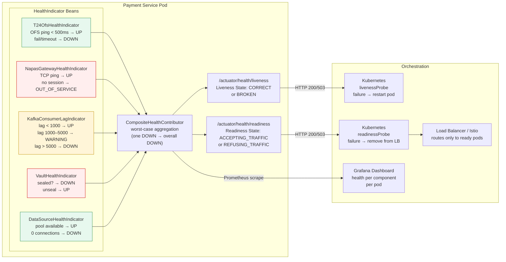

# Health Check Aggregation

Status: Draft | Last Reviewed: 2026-05-09 | Owner: @sre-lead
Catalog ID: RES-012 | Radii
Tier Applicability: T0, T1, T2

## Problem Statement

Without composite health signals, load balancers and Kubernetes probes cannot distinguish a fully healthy pod from one that is running but unable to serve requests due to a degraded dependency:

- A payment-service pod whose T24 OFS connection pool is exhausted will accept new HTTP connections (JVM alive) but fail every payment — Kubernetes liveness probe passes, so the pod is never restarted; load balancer keeps routing traffic to it.
- NAPAS gateway connectivity failures are invisible to a naive `/ping` health check; the service appears healthy while being unable to settle any real-time transfer.
- Kafka consumer lag beyond a threshold indicates the service is falling behind on event processing, yet a simple HTTP 200 from `/actuator/health` hides this backlog from the orchestration layer.
- Vault seal events (secret rotation, HA failover) render credential retrieval impossible for all downstream calls, but the JVM continues running — only a Vault-aware health indicator surfaces this.
- Multiple teams implement ad-hoc health endpoints with inconsistent schemas, making it impossible to build a unified SRE dashboard or feed a single readiness probe without custom per-service logic.
- Cascading health: when T24 is degraded, all services that depend on T24 should signal `OUT_OF_SERVICE` on their readiness probe so the load balancer routes around them — without aggregation, this cascade is invisible.

## Solution

Implement a composite health aggregator using Spring Boot Actuator's `HealthIndicator` extension points, producing a single `/actuator/health` response that liveness and readiness probes, load balancers, and service meshes can consume, with per-component detail for SRE dashboards.



## Implementation Guidelines

1. **T24 OFS health indicator** — pings T24 via a lightweight OFS enquiry; times out within 500ms to avoid blocking the probe endpoint.

   ```java
   @Component
   @Slf4j
   public class T24OfsHealthIndicator implements HealthIndicator {

       private final T24OfsClient t24Client;
       private final MeterRegistry meterRegistry;

       @Override
       public Health health() {
           long start = System.currentTimeMillis();
           try {
               T24PingResponse ping = t24Client.ping(Duration.ofMillis(500));
               long latencyMs = System.currentTimeMillis() - start;
               meterRegistry.timer("health.t24_ofs.ping_latency_ms").record(latencyMs, TimeUnit.MILLISECONDS);

               if (!ping.isAvailable()) {
                   log.warn("T24 OFS health check: DEGRADED response latency={}ms", latencyMs);
                   return Health.outOfService()
                       .withDetail("t24_status", ping.getStatus())
                       .withDetail("latency_ms", latencyMs)
                       .build();
               }
               return Health.up()
                   .withDetail("t24_version", ping.getVersion())
                   .withDetail("latency_ms", latencyMs)
                   .build();
           } catch (Exception ex) {
               long latencyMs = System.currentTimeMillis() - start;
               log.error("T24 OFS health check: DOWN cause={} latency={}ms", ex.getClass().getSimpleName(), latencyMs);
               meterRegistry.counter("health.t24_ofs.failure_total").increment();
               return Health.down(ex)
                   .withDetail("cause", ex.getMessage())
                   .withDetail("latency_ms", latencyMs)
                   .build();
           }
       }
   }
   ```

2. **NAPAS gateway health indicator** — verifies the active NAPAS TCP session (delegates to the leader candidate) and falls back to a TCP ping if no session is established on this pod.

   ```java
   @Component
   @Slf4j
   public class NapasGatewayHealthIndicator implements HealthIndicator {

       private final NapasSessionLeaderCandidate leaderCandidate;
       private final NapasGatewayPinger pinger;

       @Override
       public Health health() {
           if (leaderCandidate.isLeader()) {
               boolean sessionActive = leaderCandidate.isSessionActive();
               if (sessionActive) {
                   return Health.up().withDetail("role", "leader").withDetail("session", "active").build();
               }
               log.warn("NAPAS session leader but session is not active");
               return Health.outOfService()
                   .withDetail("role", "leader")
                   .withDetail("session", "inactive")
                   .build();
           }
           // Follower: verify gateway reachability via TCP ping
           try {
               boolean reachable = pinger.tcpPing(Duration.ofMillis(300));
               return reachable
                   ? Health.up().withDetail("role", "follower").withDetail("gateway", "reachable").build()
                   : Health.down().withDetail("role", "follower").withDetail("gateway", "unreachable").build();
           } catch (Exception ex) {
               return Health.down(ex).withDetail("role", "follower").build();
           }
       }
   }
   ```

3. **Kafka consumer lag health indicator** — queries the Kafka AdminClient for consumer group lag; maps lag thresholds to UP / WARNING / DOWN.

   ```java
   @Component
   @Slf4j
   public class KafkaConsumerLagHealthIndicator implements HealthIndicator {

       private static final long LAG_WARNING_THRESHOLD = 1_000L;
       private static final long LAG_CRITICAL_THRESHOLD = 5_000L;

       private final AdminClient kafkaAdminClient;
       private final String consumerGroupId;

       @Override
       public Health health() {
           try {
               long totalLag = computeTotalLag();
               if (totalLag > LAG_CRITICAL_THRESHOLD) {
                   log.error("Kafka consumer lag CRITICAL lag={}", totalLag);
                   return Health.down()
                       .withDetail("consumer_group", consumerGroupId)
                       .withDetail("total_lag", totalLag)
                       .withDetail("threshold_critical", LAG_CRITICAL_THRESHOLD)
                       .build();
               }
               if (totalLag > LAG_WARNING_THRESHOLD) {
                   log.warn("Kafka consumer lag WARNING lag={}", totalLag);
                   return Health.status("WARNING")
                       .withDetail("consumer_group", consumerGroupId)
                       .withDetail("total_lag", totalLag)
                       .withDetail("threshold_warning", LAG_WARNING_THRESHOLD)
                       .build();
               }
               return Health.up()
                   .withDetail("consumer_group", consumerGroupId)
                   .withDetail("total_lag", totalLag)
                   .build();
           } catch (Exception ex) {
               log.error("Kafka admin client health check failed", ex);
               return Health.down(ex).withDetail("consumer_group", consumerGroupId).build();
           }
       }

       private long computeTotalLag() throws Exception {
           Map<TopicPartition, OffsetAndMetadata> offsets =
               kafkaAdminClient.listConsumerGroupOffsets(consumerGroupId)
                   .partitionsToOffsetAndMetadata().get(5, TimeUnit.SECONDS);
           // compute lag against end offsets — abbreviated for brevity
           return lagCalculator.compute(offsets);
       }
   }
   ```

4. **Composite health contributor and liveness/readiness split** — wire all indicators into a named composite; configure liveness to react only to JVM-level faults, readiness to react to all dependency failures.

   ```java
   @Configuration
   public class HealthAggregationConfig {

       @Bean
       public CompositeHealthContributor paymentServiceHealth(
               T24OfsHealthIndicator t24,
               NapasGatewayHealthIndicator napas,
               KafkaConsumerLagHealthIndicator kafka,
               VaultHealthIndicator vault,
               DataSourceHealthIndicator dataSource) {
           return CompositeHealthContributor.fromMap(Map.of(
               "t24-ofs",        t24,
               "napas-gateway",  napas,
               "kafka-consumer", kafka,
               "vault",          vault,
               "database",       dataSource
           ));
       }
   }
   ```

   ```yaml
   # application.yml
   management:
     endpoint:
       health:
         show-details: always
         show-components: always
         group:
           liveness:
             include: livenessState
             # Only JVM liveness — don't restart pods due to dependency flaps
           readiness:
             include: readinessState,t24-ofs,napas-gateway,kafka-consumer,vault,database
             # All dependency checks gate traffic routing
     endpoints:
       web:
         exposure:
           include: health,metrics,prometheus,info
     health:
       livenessstate:
         enabled: true
       readinessstate:
         enabled: true
   ```

5. **Kubernetes probe configuration** — liveness uses a generous failure threshold to avoid restarting pods on transient flaps; readiness is more aggressive to protect traffic routing.

   ```yaml
   # deployment.yaml (relevant probe section)
   containers:
     - name: payment-service
       livenessProbe:
         httpGet:
           path: /actuator/health/liveness
           port: 8080
         initialDelaySeconds: 30
         periodSeconds: 10
         failureThreshold: 3        # Restart after 3 consecutive failures (30 s)
         timeoutSeconds: 5
       readinessProbe:
         httpGet:
           path: /actuator/health/readiness
           port: 8080
         initialDelaySeconds: 20
         periodSeconds: 5           # Check every 5 s
         failureThreshold: 2        # Remove from LB after 10 s of dependency failure
         successThreshold: 2        # Re-add only after 2 consecutive successes
         timeoutSeconds: 3
   ```

6. **Prometheus metrics and Grafana alerting** — expose individual indicator status as a numeric gauge for alerting and trending.

   ```java
   @Component
   @Slf4j
   public class HealthMetricsExporter {

       private final HealthEndpoint healthEndpoint;
       private final MeterRegistry meterRegistry;

       @Scheduled(fixedRate = 10_000)
       public void exportHealthMetrics() {
           HealthComponent composite = healthEndpoint.health();
           if (composite instanceof SystemHealth systemHealth) {
               systemHealth.getComponents().forEach((name, component) -> {
                   int statusCode = switch (component.getStatus().getCode()) {
                       case "UP"             -> 1;
                       case "WARNING"        -> 2;
                       case "OUT_OF_SERVICE" -> 3;
                       default               -> 0; // DOWN or UNKNOWN
                   };
                   meterRegistry.gauge("health.component.status",
                       Tags.of("component", name, "pod", podName()),
                       statusCode);
               });
           }
       }

       private String podName() {
           return System.getenv().getOrDefault("POD_NAME", "local");
       }
   }
   ```

## When to Use / When NOT to Use

**Use when:**
- The service depends on external systems whose availability directly affects the service's ability to serve requests (T24, NAPAS, Kafka, Vault).
- Kubernetes readiness/liveness probes must reflect real dependency health, not just JVM liveness.
- SREs need per-component health visibility in a unified dashboard without custom per-service scraping logic.
- The service participates in a cascading health model: T24 degradation should propagate through all services that depend on T24, removing them from LB rotation automatically.

**Do NOT use when:**
- Health check logic is expensive or slow enough to affect probe timeouts — each indicator must complete within the probe's `timeoutSeconds` minus network overhead (< 2 s per indicator); use circuit-broken fast-fail checks, not live queries.
- A dependency is non-critical and its failure should not affect readiness — exclude it from the readiness group and include it in a separate `management` group for SRE dashboards only.
- The service is a pure batch processor with no Kubernetes readiness semantics (cron jobs, one-shot containers) — standard actuator health is sufficient.

## Variants & Trade-offs

| Variant | When | Trade-off |
|---|---|---|
| **Liveness only (JVM ping)** | Simple services with no external dependencies; want to avoid false pod restarts | Does not reflect dependency failures; traffic routes to degraded instances |
| **Readiness + all dependencies** | Standard for T0/T1 services with external dependencies | Dependency flap causes pod removal from LB; must tune failure thresholds carefully to avoid instability |
| **Tiered readiness groups** | Distinguish "degraded but serving" from "fully healthy"; expose tier-weighted score | More complex client logic; useful for progressive traffic routing with Istio/Envoy |
| **Composite with weighted score** | Each component weighted by business impact; score drives traffic weight in service mesh | Most accurate; requires custom aggregation logic; overkill for most services |
| **External health check (blackbox exporter)** | Synthetic transaction monitoring (Prometheus blackbox exporter hitting a real payment flow) | Tests the full path end-to-end; complements internal health indicators but does not replace them |

## NFR Acceptance Criteria

```yaml
service_name: "payment-service-health-check-aggregation-compliance"
tier: T0
acceptance_criteria:
  - id: HCA-1
    description: "Probe response time"
    requirement: "GET /actuator/health/readiness must respond within 2000ms P99 under normal load; individual HealthIndicator implementations must complete within 500ms each (enforced by timeout wrapper)"
    measurement: "Micrometer timer on each HealthIndicator.health() call; alert if P99 > 500ms for any indicator; load test verifies endpoint P99"
  - id: HCA-2
    description: "Cascading readiness on T24 failure"
    requirement: "When T24 OFS becomes unavailable (simulated by shutting the OFS mock), payment-service readiness probe must return HTTP 503 within 2 probe cycles (10 seconds); Kubernetes must remove the pod from LB rotation within 15 seconds of T24 failure"
    measurement: "Chaos test: shut T24 OFS mock; measure time from outage to pod removal from kube_endpoint_addresses_available metric; alert if > 15s"
  - id: HCA-3
    description: "Indicator completeness"
    requirement: "The readiness health group must include all T0-impacting dependencies: T24 OFS, NAPAS gateway, Kafka consumer, Vault, and database connection pool; no T0-impacting dependency may be absent from the readiness group"
    measurement: "Automated test: parse /actuator/health/readiness JSON; assert all 5 component keys present; fails the build if any are missing"
  - id: HCA-4
    description: "Liveness/readiness separation"
    requirement: "Liveness probe must not include dependency health checks; a T24 failure must not trigger a pod restart (only LB removal); verified by confirming pod restartCount does not increment during a 5-minute T24 outage simulation"
    measurement: "Chaos test: shut T24 for 5 min; assert kubectl get pod restartCount is unchanged; assert pod is removed from readiness endpoints"
```

## Compliance Mapping

| Layer | Reference | Section/Control | How |
|---|---|---|---|
| Ring 0 | AWS Well-Architected Reliability — Monitor workload health | REL 7: Monitor all components | Composite health aggregation provides the single observable signal required for automated recovery actions |
| Ring 0 | Microsoft Cloud Patterns — Health Endpoint Monitoring | "Implement functional checks in an application" | Actuator `HealthIndicator` per dependency implements the functional check pattern; composite endpoint implements the aggregation |
| Ring 0 | Kubernetes documentation — Configure Liveness/Readiness Probes | Probe configuration reference | Liveness/readiness split, failure thresholds, and period settings follow Kubernetes best practices |
| Ring 1 | BCBS 230 Principle 6 ⚠️ (working summary — pending PDF fetch) | Operational resilience — detection and recovery | Automated health aggregation enables fast, automated detection of degraded components, reducing MTTD and supporting bounded incident impact |
| Ring 2 | SBV Circular 09/2020 §IV.2 ⚠️ (working summary — pending Legal review) | Operational continuity — monitoring and fault detection | Health check aggregation is a monitoring control that surfaces dependency failures to the orchestration layer, enabling automatic traffic rerouting that supports payment system continuity |

## Cost / FinOps Notes

| Item | Driver | Order of magnitude |
|---|---|---|
| Health check traffic | Probe every 5 s × 3 probes (liveness + readiness + Prometheus scrape) × pod count | ~18 HTTP requests/pod/min; negligible versus payment traffic |
| T24 OFS ping | OFS lightweight enquiry; 1 per 5 s per pod | T24 must be provisioned to handle probe load; factor into T24 connection pool sizing |
| Kafka AdminClient calls | `listConsumerGroupOffsets` every 10 s | Single AdminClient per pod; Kafka broker handles this efficiently |
| Grafana panels | ~30 new time series from `health.component.status` gauge | Negligible at existing Prometheus scale |
| Operational savings | Automatic LB removal of degraded pods reduces customer-visible errors; reduces escalation-to-resolution time by exposing root cause (which component is down) at a glance | Estimated 30–50% reduction in MTTD for dependency-induced incidents |

**Cost of NOT aggregating health**: a degraded pod that stays in LB rotation serves failed requests until manual investigation identifies it as degraded — MTTD measured in minutes or hours; customer impact extends through the entire outage duration.

## Threat Model Summary

STRIDE focus: **Information Disclosure** via overly detailed health responses and **Denial of Service** via probe endpoint abuse.

- **Top 3 threats addressed:**
  1. *Traffic routed to degraded pods* — readiness probe removes unhealthy pods from LB rotation automatically, preventing customer-visible errors from accumulating on a degraded instance.
  2. *Silent dependency failures* — each indicator surfaces dependency state explicitly; SREs receive a Grafana alert within one probe cycle of a component going DOWN.
  3. *JVM liveness masking dependency failures* — liveness/readiness split ensures pod restarts are triggered only by JVM faults, not dependency flaps, reducing unnecessary restart storms.
- **Top 3 residual threats:**
  1. *Health endpoint information disclosure* — `/actuator/health` with `show-details: always` exposes T24 version, internal hostnames, and error messages. Mitigation: restrict `show-details: always` to internal scrape (management port 8081, not exposed via ingress); external `/health` returns UP/DOWN only.
  2. *Health check DoS via slow dependency* — a slow T24 OFS response blocks the health endpoint thread. Mitigation: each indicator wrapped in a timeout (500ms); Circuit Breaker on the OFS ping client; health endpoint served on a dedicated management thread pool.
  3. *False-positive DOWN triggers mass pod removal* — if a shared dependency (e.g., Redis) flaps, all pods signal DOWN simultaneously, removing all pods from LB and causing a self-inflicted outage. Mitigation: readiness failure threshold >= 2 consecutive failures; pod disruption budget prevents all pods from being removed simultaneously; cascade is intentional for T24 but reviewed for shared infrastructure.

## Operational Runbook (stub)

- **Alerts:**
  - `HealthComponentDown`: any indicator status transitions to DOWN for > 30 s. Severity: Warning → maps to the dependent component's own alert (T24, NAPAS, Kafka).
  - `ReadinessProbeFailure`: Kubernetes `kube_pod_container_status_ready` drops to 0 for any payment-service pod. Severity: High — PagerDuty.
  - `AllPodsUnready`: all payment-service pods removed from LB rotation. Severity: Critical — immediate escalation; service fully unavailable.
  - `HealthEndpointSlow`: `/actuator/health/readiness` P99 > 2 s. Severity: Warning — probe may time out, causing false readiness failure.
- **Dashboards:** Grafana — `health-check-aggregation-overview`: component status heatmap per pod, readiness probe pass/fail rate, time-since-last-UP per component, indicator latency distribution.
- **On-call playbook:**
  1. Check the Grafana heatmap to identify which component is DOWN and on which pods.
  2. If a single pod: check pod logs for errors; consider cordoning and draining the pod.
  3. If all pods: the dependency itself is down; escalate to the relevant component owner (T24, NAPAS, Kafka cluster).
  4. If `AllPodsUnready`: activate the incident runbook for the dependent system; consider enabling a maintenance-mode static response at the API Gateway layer.
  5. For false-positive alerts: check indicator latency; verify timeout configuration matches probe `timeoutSeconds`.

## Test Strategy (stub)

- **Unit:** Mock T24 client to return error; assert `T24OfsHealthIndicator.health()` returns `Health.down()`; assert latency detail is populated.
- **Integration:** WireMock the OFS endpoint to return 503; hit `/actuator/health/readiness`; assert HTTP 503 and JSON component status DOWN for `t24-ofs`.
- **Kafka lag test:** Publish 6000 messages to the test topic without starting the consumer; assert `KafkaConsumerLagHealthIndicator` returns DOWN; start consumer; assert indicator returns UP within 30 s.
- **Probe timeout test:** Configure T24 mock with 600ms delay; assert health indicator completes within 550ms (timeout) and returns DOWN, not a thread hang.
- **End-to-end Kubernetes test:** Apply a network policy blocking T24 pod; assert `kube_pod_status_ready` for payment-service drops within 15 s; remove network policy; assert readiness returns within 30 s.
- **Information disclosure test:** Verify `/actuator/health` is not accessible on the ingress port (443); verify management port (8081) is not exposed externally via service mesh policy.

## Related Patterns

- [RES-002 Circuit Breaker](circuit-breaker.md) — health indicators should use circuit-broken clients for dependency pings, not raw calls that could block
- [RES-007 Fallback Strategies](fallback-strategies.md) — when readiness goes DOWN, upstream services should activate their fallback strategies (serve from cache, queue for retry)
- [RES-009 Load Shedding](load-shedding.md) — CPU/queue saturation signals that drive adaptive shedding are surfaced via health indicators and Prometheus
- [RES-010 Leader Election](leader-election.md) — leader status (is this pod the NAPAS session leader?) is exposed as a health detail via NAPAS indicator
- [NFR-001 Service Tiering + RTO/RPO](../../nfr/service-tiering-rto-rpo.md) — T0 readiness probe failure thresholds derive from T0 RTO requirements
- [BP-007 Golden Signals (SRE)](../../best-practices/golden-signals-sre.md) — saturation and error signals from health indicators feed into the four golden signals dashboard
- [BP-005 Chaos Engineering](../../best-practices/chaos-engineering.md) — chaos drills validate that health checks correctly surface dependency failures and trigger automated recovery

## References

- [Spring Boot Actuator Health](https://docs.spring.io/spring-boot/docs/current/reference/html/actuator.html#actuator.endpoints.health)
- [Kubernetes Liveness and Readiness Probes](https://kubernetes.io/docs/tasks/configure-pod-container/configure-liveness-readiness-startup-probes/)
- [Microsoft Cloud Patterns — Health Endpoint Monitoring](https://learn.microsoft.com/en-us/azure/architecture/patterns/health-endpoint-monitoring)
- [AWS Well-Architected Reliability Pillar — REL 7](https://docs.aws.amazon.com/wellarchitected/latest/reliability-pillar/rel_monitor_aws_resources.html)

---
**Key Takeaway**: Aggregate all dependency health signals into a single composite readiness probe so Kubernetes automatically removes degraded pods from load balancer rotation — a T24 failure should never result in customer-visible payment errors because traffic continues to be routed to the degraded pod.
