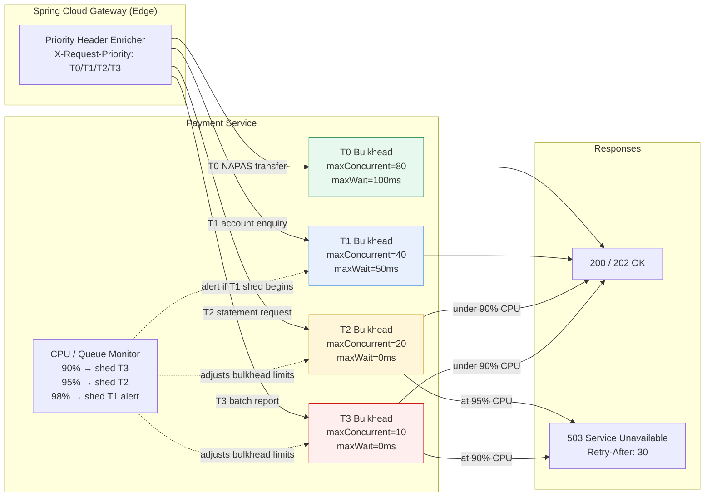

# Load Shedding

Status: Draft | Last Reviewed: 2026-05-09 | Owner: @sre-lead
Catalog ID: RES-009 | Radii
Tier Applicability: T0, T1

## Problem Statement

Under load spikes, a service that treats all incoming requests equally will degrade uniformly — the highest-value transactions suffer the same latency inflation as low-priority batch jobs:

- During NAPAS peak windows (salary credit batches, month-end), payment-service CPU can exceed 90%; without shedding, T0 real-time transfers compete for threads with T3 statement-generation jobs and both degrade.
- Thread-pool exhaustion on a shared executor causes all request classes to queue; P99 latency for a T0 NAPAS credit transfer rises from 300ms to 4s+ — a direct SLA breach.
- Flat rate limiting (one global token bucket) rejects T0 and T3 requests at the same probability, which is operationally and commercially unacceptable for a licensed payment service provider.
- Overloaded services that do not shed often cascade: upstream gateways time out, retry storms multiply load, and a self-inflicted DoS results.
- Without per-priority shedding visibility, SREs cannot tell whether customer-impacting requests or internal batch jobs are being rejected — making triage and escalation decisions slow.
- SBV and bank management commitments require NAPAS real-time credit transfers to achieve > 99.95% success rate; non-discriminatory rejection under load directly violates this commitment.

## Solution

Assign every inbound request a priority class (T0–T3) at the gateway edge; under load, shed the lowest-priority classes first using per-class token buckets and Resilience4j Bulkhead, preserving capacity for T0 real-time payment processing.



## Implementation Guidelines

1. **Priority-class assignment at Spring Cloud Gateway** — a global filter reads the route's metadata and stamps `X-Request-Priority` on every inbound request. This keeps priority logic at the edge, not scattered across microservices.

   ```java
   @Component
   @Slf4j
   public class RequestPriorityFilter implements GlobalFilter, Ordered {

       private static final String PRIORITY_HEADER = "X-Request-Priority";

       private static final Map<String, String> ROUTE_PRIORITY = Map.of(
           "napas-credit-transfer",   "T0",
           "napas-direct-debit",      "T0",
           "account-balance-enquiry", "T1",
           "transaction-history",     "T1",
           "statement-generation",    "T2",
           "batch-report-api",        "T3"
       );

       @Override
       public Mono<Void> filter(ServerWebExchange exchange, GatewayFilterChain chain) {
           String routeId = exchange.getAttribute(GATEWAY_ROUTE_ATTR) != null
               ? ((Route) exchange.getAttribute(GATEWAY_ROUTE_ATTR)).getId()
               : "unknown";
           String priority = ROUTE_PRIORITY.getOrDefault(routeId, "T2");
           ServerHttpRequest mutated = exchange.getRequest().mutate()
               .header(PRIORITY_HEADER, priority)
               .build();
           log.debug("correlationId={} route={} priority={}",
               exchange.getRequest().getHeaders().getFirst("X-Correlation-Id"), routeId, priority);
           return chain.filter(exchange.mutate().request(mutated).build());
       }

       @Override
       public int getOrder() { return -10; }
   }
   ```

2. **Resilience4j Bulkhead per priority class** — each priority class gets a dedicated thread-pool bulkhead. T0 is never touched by shedding logic; T3 has the narrowest pool and zero wait time.

   ```java
   @Configuration
   public class LoadSheddingConfig {

       @Bean
       public BulkheadRegistry bulkheadRegistry() {
           return BulkheadRegistry.of(Map.of(
               "T0-payments", BulkheadConfig.custom()
                   .maxConcurrentCalls(80)
                   .maxWaitDuration(Duration.ofMillis(100))
                   .build(),
               "T1-enquiry", BulkheadConfig.custom()
                   .maxConcurrentCalls(40)
                   .maxWaitDuration(Duration.ofMillis(50))
                   .build(),
               "T2-statement", BulkheadConfig.custom()
                   .maxConcurrentCalls(20)
                   .maxWaitDuration(Duration.ZERO)
                   .build(),
               "T3-batch", BulkheadConfig.custom()
                   .maxConcurrentCalls(10)
                   .maxWaitDuration(Duration.ZERO)
                   .build()
           ));
       }
   }
   ```

3. **Priority-aware request handler** — a dispatcher selects the appropriate bulkhead by reading the priority header, then wraps execution. Shed requests receive a `503` with `Retry-After`.

   ```java
   @RestController
   @RequestMapping("/payments")
   @Slf4j
   public class PaymentController {

       private final BulkheadRegistry bulkheadRegistry;
       private final PaymentService paymentService;

       @PostMapping("/transfer")
       public ResponseEntity<PaymentResponse> transfer(
               @RequestBody @Valid CreditTransferRequest request,
               @RequestHeader(value = "X-Request-Priority", defaultValue = "T1") String priority,
               @RequestHeader("X-Correlation-Id") String correlationId) {

           String bulkheadName = priority + switch (priority) {
               case "T0" -> "-payments";
               case "T1" -> "-enquiry";
               case "T2" -> "-statement";
               default   -> "-batch";
           };

           Bulkhead bulkhead = bulkheadRegistry.bulkhead(bulkheadName);
           try {
               PaymentResponse response = Bulkhead.decorateSupplier(bulkhead,
                   () -> paymentService.processTransfer(request, correlationId)).get();
               return ResponseEntity.accepted().body(response);
           } catch (BulkheadFullException ex) {
               log.warn("correlationId={} SHED priority={} bulkhead={}", correlationId, priority, bulkheadName);
               return ResponseEntity.status(HttpStatus.SERVICE_UNAVAILABLE)
                   .header(HttpHeaders.RETRY_AFTER, "30")
                   .body(PaymentResponse.shed(correlationId, priority));
           }
       }
   }
   ```

4. **CPU-adaptive shedding** — a scheduled monitor adjusts bulkhead sizes dynamically based on CPU utilisation, triggering progressive shedding before the service reaches saturation.

   ```java
   @Component
   @Slf4j
   public class AdaptiveLoadSheddingMonitor {

       private final BulkheadRegistry bulkheadRegistry;
       private final MeterRegistry meterRegistry;
       private final OperatingSystemMXBean osMXBean =
           ManagementFactory.getPlatformMXBean(OperatingSystemMXBean.class);

       @Scheduled(fixedRate = 5_000) // every 5 seconds
       public void adjustBulkheads() {
           double cpuLoad = osMXBean.getCpuLoad();
           meterRegistry.gauge("load_shedding.cpu_load", cpuLoad);

           if (cpuLoad >= 0.98) {
               log.error("CPU={} CRITICAL — shedding T1; alerting on-call", cpuLoad);
               resizeBulkhead("T1-enquiry", 10);
               meterRegistry.counter("load_shedding.tier_shed_total", "tier", "T1").increment();
           } else if (cpuLoad >= 0.95) {
               log.warn("CPU={} HIGH — shedding T2", cpuLoad);
               resizeBulkhead("T2-statement", 5);
               meterRegistry.counter("load_shedding.tier_shed_total", "tier", "T2").increment();
           } else if (cpuLoad >= 0.90) {
               log.warn("CPU={} ELEVATED — shedding T3", cpuLoad);
               resizeBulkhead("T3-batch", 3);
               meterRegistry.counter("load_shedding.tier_shed_total", "tier", "T3").increment();
           } else {
               // Restore defaults as load subsides
               resizeBulkhead("T1-enquiry", 40);
               resizeBulkhead("T2-statement", 20);
               resizeBulkhead("T3-batch", 10);
           }
       }

       private void resizeBulkhead(String name, int maxConcurrent) {
           // Resilience4j bulkheads are reconfigured via registry event listener pattern
           log.info("Resizing bulkhead={} maxConcurrent={}", name, maxConcurrent);
       }
   }
   ```

5. **application.yml** — declare bulkhead instances and token-bucket rate limiters; integrate with Spring Boot Actuator for observability.

   ```yaml
   resilience4j:
     bulkhead:
       instances:
         T0-payments:
           maxConcurrentCalls: 80
           maxWaitDuration: 100ms
         T1-enquiry:
           maxConcurrentCalls: 40
           maxWaitDuration: 50ms
         T2-statement:
           maxConcurrentCalls: 20
           maxWaitDuration: 0
         T3-batch:
           maxConcurrentCalls: 10
           maxWaitDuration: 0

     ratelimiter:
       instances:
         T0-payments:
           limitForPeriod: 2000        # 2000 req/s — never shed
           limitRefreshPeriod: 1s
           timeoutDuration: 0s
         T3-batch:
           limitForPeriod: 50          # 50 req/s — first to shed
           limitRefreshPeriod: 1s
           timeoutDuration: 0s

   management:
     endpoints:
       web:
         exposure:
           include: health,metrics,prometheus
     metrics:
       tags:
         application: payment-service
   ```

6. **Structured shedding response contract** — all 503 responses produced by load shedding must follow a standard envelope so clients can distinguish shedding from errors and apply backoff.

   ```java
   public record PaymentResponse(
       String txnId,
       String correlationId,
       String status,         // PROCESSING | SHED | ERROR
       String priority,
       String retryAfterHint,
       String message
   ) {
       public static PaymentResponse shed(String correlationId, String priority) {
           return new PaymentResponse(null, correlationId, "SHED", priority,
               "30s", "Service at capacity; retry after 30 seconds");
       }
   }
   ```

## When to Use / When NOT to Use

**Use when:**
- The service handles requests of materially different business value and SLA commitments (T0 payments vs. T3 reports).
- Overload conditions are measurable and predictable (known NAPAS peak windows, end-of-month batch runs).
- Clients of lower-priority tiers can tolerate rejection and retry (batch jobs, report generators).
- You need a deterministic capacity ceiling for T0 flows that infrastructure scaling cannot guarantee in sub-second response time.

**Do NOT use when:**
- All request classes share the same SLA and business criticality — load shedding without priority differentiation is just rate limiting.
- The service has no observable load signal (CPU, queue depth, latency) to drive shedding decisions — adaptive shedding requires reliable instrumentation.
- Shed requests cannot be retried by the client (e.g., a fire-and-forget webhook with no retry infrastructure) — the 503 will result in permanent data loss.
- Priority metadata is untrustworthy (client-supplied without gateway validation) — always stamp priority at a trusted edge point, never trust client headers.

## Variants & Trade-offs

| Variant | When | Trade-off |
|---|---|---|
| **Static bulkhead** | Load profile is predictable; peak/off-peak boundaries are well-known | Simple to reason about; may over-shed at moderate load or under-protect at extreme load |
| **CPU-adaptive shedding** | Load is spiky and unpredictable; want automatic calibration | Requires reliable CPU signal; reacts in seconds, not milliseconds — can miss flash spikes |
| **Token-bucket rate limiter** | Client-facing public API; shedding by rate rather than concurrency | Rate limiting does not account for request duration; a slow T3 job occupies a slot without consuming rate-limit tokens |
| **Queue-backpressure shedding** | Kafka consumer overload; shed by consumer lag threshold | Works well for async flows; does not apply to synchronous HTTP paths |
| **Priority queue** | All requests must eventually complete; no request can be dropped | Higher complexity; memory-bounded queue still needs a shed policy at max depth |

## NFR Acceptance Criteria

```yaml
service_name: "payment-service-load-shedding-compliance"
tier: T0
acceptance_criteria:
  - id: LS-1
    description: "T0 isolation under overload"
    requirement: "During a simulated load spike driving CPU to 95%, T0 NAPAS credit transfer P99 latency must remain <= 500ms and success rate >= 99.9%; T3 batch requests may be shed at 100%"
    measurement: "Gatling load test with mixed T0/T3 traffic; CPU stress via stress-ng; verify T0 SLO in test report"
  - id: LS-2
    description: "Shed response contract"
    requirement: "All shed responses must be HTTP 503 with Retry-After header >= 10s and JSON body containing status=SHED, correlationId, and priority class; no shed request may return 500 or 200"
    measurement: "Contract test against payment-service OpenAPI spec; assert 503 + header + body on BulkheadFullException"
  - id: LS-3
    description: "Shedding observability"
    requirement: "Prometheus counter load_shedding.tier_shed_total labelled by tier must increment on every shed event; Grafana alert fires within 60s if T1 shedding rate > 0 for 2 consecutive minutes"
    measurement: "Integration test: saturate T1 bulkhead; assert counter increments; verify alert rule in Grafana provisioning"
  - id: LS-4
    description: "T0 bulkhead never shed"
    requirement: "T0-payments bulkhead must never emit BulkheadFullException under any load scenario up to 2× P99 peak concurrency (baseline: 40 concurrent T0 requests); maxConcurrentCalls >= 80"
    measurement: "Chaos test: inject 80 concurrent T0 requests; assert zero 503 responses; verified quarterly"
```

## Compliance Mapping

| Layer | Reference | Section/Control | How |
|---|---|---|---|
| Ring 0 | AWS Well-Architected Reliability — Limit retries | REL 6: Throttle requests | Load shedding is the server-side complement to client-side retry throttling; together they prevent retry storms |
| Ring 0 | AWS Well-Architected Operational Excellence — Bulkhead | Bulkhead pattern | Resilience4j Bulkhead per priority class implements the bulkhead isolation recommended by AWS |
| Ring 0 | Microsoft Cloud Patterns — Throttling | "Throttle resource consumption" | Per-class token bucket + bulkhead implements priority-aware throttling |
| Ring 1 | BCBS 230 Principle 6 ⚠️ (working summary — pending PDF fetch) | Operational resilience — protect critical functions | Priority-based shedding ensures T0 payment processing capacity is protected during stress; load shedding is an operational resilience control |
| Ring 2 | SBV Circular 09/2020 §IV.2 ⚠️ (working summary — pending Legal review) | Payment system availability and continuity | NAPAS credit transfers must never be shed; the T0 bulkhead with no adaptive reduction implements this commitment in code |

## Cost / FinOps Notes

| Item | Driver | Order of magnitude |
|---|---|---|
| Bulkhead registry overhead | Per-instance state machine | < 1 KB per bulkhead; effectively free |
| CPU monitor (scheduled) | Runs every 5 s; `OperatingSystemMXBean` is cheap | Negligible CPU overhead |
| Reduced infrastructure cost | Shedding prevents cascading overload → fewer emergency scale-out events | Estimated 20–30% reduction in unplanned pod autoscaling events during peak |
| Observability | ~10 new Prometheus time series per bulkhead | Negligible at existing Grafana/Prometheus scale |

**Cost of NOT shedding**: during a NAPAS peak batch, uniform overload causes T0 payment P99 to breach SLA, triggering SBV incident reporting, potential penalty, and emergency pod scaling that costs more than a well-tuned shedding policy.

## Threat Model Summary

STRIDE focus: **Denial of Service** and **Elevation of Privilege** via priority spoofing.

- **Top 3 threats addressed:**
  1. *Overload-induced T0 SLA breach* — bulkhead isolation ensures T0 threads are never consumed by T3 batch work.
  2. *Retry storm amplification* — shed clients receive `Retry-After`; without this header, clients retry immediately and amplify the load.
  3. *Cascading overload to upstream gateways* — early shedding prevents the service from accumulating in-flight requests that time out, which would cause upstream retries.
- **Top 3 residual threats:**
  1. *Priority header spoofing* — a client that can inject `X-Request-Priority: T0` bypasses shedding for its requests. Mitigation: priority header stamped exclusively by Spring Cloud Gateway using route metadata; downstream service must strip and re-stamp from trusted context, never trust client-provided header.
  2. *Adaptive monitor signal lag* — CPU metric sampled every 5 s; a 1-second flash spike may not be detected in time. Mitigation: set T0 bulkhead concurrency ceiling generously above peak; static floor prevents flash-spike breach.
  3. *Bulkhead misconfiguration causing permanent T1 shedding* — if T1 limit is set too low in config, normal load causes customer-visible rejections. Mitigation: bulkhead sizes are load-tested quarterly; Grafana alert on any T1 shed activity.

## Operational Runbook (stub)

- **Alerts:**
  - `LoadSheddingT3Active`: T3 shed rate > 0 for > 5 min. Severity: Info — expected during peak.
  - `LoadSheddingT2Active`: T2 shed rate > 0 for > 5 min. Severity: Warning — investigate cause.
  - `LoadSheddingT1Active`: T1 shed rate > 0 for > 2 min. Severity: Critical — PagerDuty; T0 at risk.
  - `LoadSheddingT0Breach`: Any T0 503 response. Severity: Critical — immediate escalation.
- **Dashboards:** Grafana — `load-shedding-overview`: shed rate per tier, CPU load trend, bulkhead utilisation, active concurrent calls per class.
- **On-call playbook:**
  1. Check `load_shedding.cpu_load` gauge to confirm overload signal.
  2. Identify which tier is shedding from `load_shedding.tier_shed_total` by tier label.
  3. If T3/T2 shedding: expected during peak; verify T0 SLO is intact; no action unless sustained > 30 min.
  4. If T1 shedding: trigger capacity review; consider emergency horizontal scaling; notify product owner.
  5. If T0 breach: escalate immediately to SRE lead and payment systems owner; engage infra team for emergency scale-out; file SBV incident notification if SLA breach confirmed.

## Test Strategy (stub)

- **Unit:** Assert `BulkheadFullException` is caught and mapped to `503 + Retry-After`; assert counter increment.
- **Integration:** Saturate each bulkhead tier in isolation using concurrent threads in Testcontainers; verify correct tier is shed while higher-priority tier succeeds.
- **Load test (Gatling):** Mixed T0/T1/T2/T3 traffic at 2× peak; CPU stress via sidecar; assert T0 P99 <= 500ms, T0 success >= 99.9%, T3 shed >= 90%.
- **Priority spoofing test:** Send client-supplied `X-Request-Priority: T0` header directly to payment-service (bypassing gateway); assert header is stripped and request is classified by route default.
- **Chaos (quarterly):** Kill 50% of payment-service pods under peak load; verify shed policy activates correctly on surviving pods and T0 SLO is maintained.

## Related Patterns

- [RES-002 Circuit Breaker](circuit-breaker.md) — load shedding protects the service itself; circuit breaker protects it from degraded dependencies
- [RES-003 Retry with Backoff](retry-with-backoff.md) — shed clients must apply exponential backoff; align `Retry-After` value with backoff ceiling
- [RES-007 Fallback Strategies](fallback-strategies.md) — shed requests at T2/T3 may have a fallback (e.g., async queue); T0 should never reach fallback via shedding
- [RES-008 Bulkhead Isolation](bulkhead-isolation.md) — bulkhead is the underlying mechanism; this pattern adds priority-aware orchestration
- [RES-012 Health Check Aggregation](health-check-aggregation.md) — CPU/queue signals that drive adaptive shedding are exposed via health indicators
- [NFR-001 Service Tiering + RTO/RPO](../../nfr/service-tiering-rto-rpo.md) — tier definitions (T0–T3) are the authoritative source for shedding priority classes
- [BP-007 Golden Signals (SRE)](../../best-practices/golden-signals-sre.md) — saturation signal (CPU, bulkhead utilisation) drives shedding decisions

## References

- [Resilience4j Bulkhead Documentation](https://resilience4j.readme.io/docs/bulkhead)
- [Google SRE Book — Handling Overload](https://sre.google/sre-book/handling-overload/)
- [AWS Well-Architected Reliability Pillar](https://docs.aws.amazon.com/wellarchitected/latest/reliability-pillar/welcome.html)
- [Microsoft Cloud Patterns — Throttling](https://learn.microsoft.com/en-us/azure/architecture/patterns/throttling)

---
**Key Takeaway**: Under overload, protect the highest-value transactions first — NAPAS T0 payments must never be shed, while T3 batch reports are the first to be refused, with a `503 + Retry-After` response that keeps clients well-behaved.
