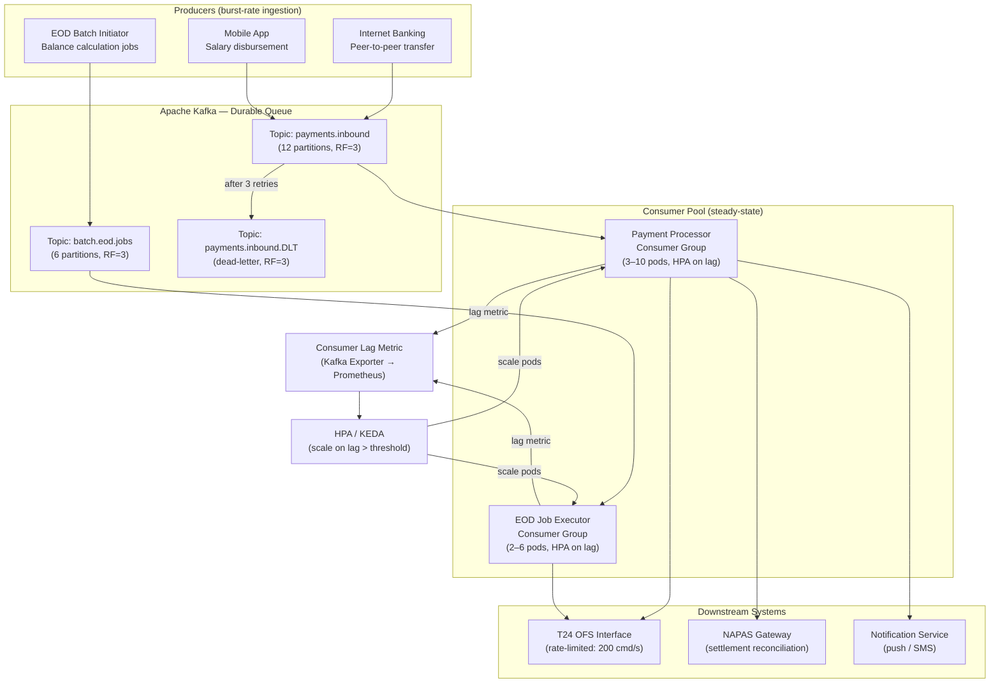

# Queue-Based Load Levelling

Status: Draft | Last Reviewed: 2026-05-09 | Owner: @sre-lead
Catalog ID: RES-011 | Radii
Tier Applicability: T0, T1, T2

## Problem Statement

- Some banking flows are intrinsically bursty: Tet-eve peer-to-peer transfers, EOD batch balance calculations, and salary-crediting runs arrive in compressed time windows that can be 10–20× steady-state volume.
- Synchronous processing at peak forces over-provisioning the compute and database tiers for 99% of the calendar year to handle 1% of peak time, driving unjustifiable infrastructure cost.
- NAPAS settlement reconciliation requires all daily transactions to be reconciled by a hard cut-off; a synchronous design fails the cut-off if processing falls behind during the peak window.
- Downstream T24 core-banking OFS commands are rate-sensitive; flooding OFS without a queue causes "OVERLOAD" error codes that require manual intervention and audit trail entries.

## Context

Banking batch windows and end-of-day settlement create predictable spikes; placing a durable queue between producers and consumers lets the system absorb bursts and process them at a sustainable rate. The queue depth becomes a leading indicator of back-pressure. At Techcombank, Tet-eve peer-to-peer transfers and salary-crediting runs can be 10–20× steady-state volume; synchronous processing at peak forces over-provisioning the compute and database tiers for 99% of the calendar year. Apache Kafka with KEDA autoscaling provides the durable buffer and the dynamic consumer fleet to match processing capacity to demand without incurring peak-sized infrastructure cost year-round.

## Solution

A durable Kafka topic decouples producers (fast accept) from consumers (steady-state processing). Producers write at burst rate; consumers pull at a sustainable pace with auto-scaling based on consumer-group lag.



## Implementation Guidelines

### 1. Kafka Producer — Idempotent Transactional Producer

```java
@Configuration
public class KafkaProducerConfig {

    @Value("${spring.kafka.bootstrap-servers}")
    private String bootstrapServers;

    @Bean
    public ProducerFactory<String, PaymentEvent> paymentProducerFactory() {
        Map<String, Object> props = new HashMap<>();
        props.put(ProducerConfig.BOOTSTRAP_SERVERS_CONFIG, bootstrapServers);
        props.put(ProducerConfig.KEY_SERIALIZER_CLASS_CONFIG, StringSerializer.class);
        props.put(ProducerConfig.VALUE_SERIALIZER_CLASS_CONFIG, JsonSerializer.class);
        // Idempotent producer: exactly-once delivery to Kafka
        props.put(ProducerConfig.ENABLE_IDEMPOTENCE_CONFIG, true);
        props.put(ProducerConfig.ACKS_CONFIG, "all");
        props.put(ProducerConfig.RETRIES_CONFIG, Integer.MAX_VALUE);
        props.put(ProducerConfig.MAX_IN_FLIGHT_REQUESTS_PER_CONNECTION, 5);
        // Transactional ID scoped to pod so each pod has its own producer epoch
        props.put(ProducerConfig.TRANSACTIONAL_ID_CONFIG,
                "payment-producer-" + System.getenv("POD_NAME"));
        return new DefaultKafkaProducerFactory<>(props);
    }

    @Bean
    public KafkaTemplate<String, PaymentEvent> kafkaTemplate() {
        return new KafkaTemplate<>(paymentProducerFactory());
    }
}
```

```java
@Service
@RequiredArgsConstructor
@Slf4j
public class PaymentSubmissionService {

    private static final String PAYMENTS_TOPIC = "payments.inbound";
    private final KafkaTemplate<String, PaymentEvent> kafkaTemplate;

    /**
     * Accepts a payment request at burst rate; returns immediately after Kafka ack.
     * The idempotency key (correlationId) is used as the Kafka message key so that
     * Kafka's partitioner routes retries to the same partition, preserving ordering
     * per-account and enabling idempotent consumer deduplication (PRIN-006).
     */
    public PaymentAcknowledgement acceptPayment(PaymentRequest request) {
        PaymentEvent event = PaymentEvent.builder()
                .correlationId(request.getCorrelationId())
                .accountId(request.getSourceAccountId())
                .amount(request.getAmount())
                .currency("VND")
                .submittedAt(Instant.now())
                .build();

        kafkaTemplate.executeInTransaction(ops -> {
            ops.send(PAYMENTS_TOPIC,
                    event.getAccountId(),   // key: route same account to same partition
                    event)
               .whenComplete((result, ex) -> {
                   if (ex != null) {
                       log.error("Kafka send failed correlationId={} error={}",
                               event.getCorrelationId(), ex.getMessage());
                       throw new KafkaProducerException("Failed to enqueue payment", ex);
                   }
                   log.info("Enqueued correlationId={} partition={} offset={}",
                           event.getCorrelationId(),
                           result.getRecordMetadata().partition(),
                           result.getRecordMetadata().offset());
               });
            return null;
        });

        return PaymentAcknowledgement.builder()
                .correlationId(request.getCorrelationId())
                .status(AckStatus.ACCEPTED)
                .estimatedProcessingTime(Duration.ofSeconds(5))
                .build();
    }
}
```

### 2. Kafka Consumer — Manual Acknowledge with Dead-Letter Routing

```java
@Configuration
public class KafkaConsumerConfig {

    @Value("${spring.kafka.bootstrap-servers}")
    private String bootstrapServers;

    /**
     * Manual acknowledgement factory so the consumer commits only after successful
     * processing. Combined with a fixed retry backoff to absorb transient errors
     * before routing to the DLT.
     */
    @Bean
    public ConsumerFactory<String, PaymentEvent> paymentConsumerFactory() {
        Map<String, Object> props = new HashMap<>();
        props.put(ConsumerConfig.BOOTSTRAP_SERVERS_CONFIG, bootstrapServers);
        props.put(ConsumerConfig.GROUP_ID_CONFIG, "payment-processor-group");
        props.put(ConsumerConfig.KEY_DESERIALIZER_CLASS_CONFIG, StringDeserializer.class);
        props.put(ConsumerConfig.VALUE_DESERIALIZER_CLASS_CONFIG, JsonDeserializer.class);
        props.put(ConsumerConfig.AUTO_OFFSET_RESET_CONFIG, "earliest");
        props.put(ConsumerConfig.ENABLE_AUTO_COMMIT_CONFIG, false);  // manual ACK
        props.put(ConsumerConfig.MAX_POLL_RECORDS_CONFIG, 50);        // batch size
        props.put(JsonDeserializer.TRUSTED_PACKAGES, "vn.techcombank.events.*");
        return new DefaultKafkaConsumerFactory<>(props);
    }

    @Bean
    public ConcurrentKafkaListenerContainerFactory<String, PaymentEvent>
            paymentKafkaListenerContainerFactory() {

        ConcurrentKafkaListenerContainerFactory<String, PaymentEvent> factory =
                new ConcurrentKafkaListenerContainerFactory<>();
        factory.setConsumerFactory(paymentConsumerFactory());
        factory.getContainerProperties()
               .setAckMode(ContainerProperties.AckMode.MANUAL_IMMEDIATE);
        // Thread pool: 3 threads (matches partition count / pods)
        factory.setConcurrency(3);
        // Dead-letter on exhausted retries
        factory.setCommonErrorHandler(buildErrorHandler());
        return factory;
    }

    private DefaultErrorHandler buildErrorHandler() {
        // 3 retries with exponential backoff: 1s, 2s, 4s
        ExponentialBackOffWithMaxRetries backOff =
                new ExponentialBackOffWithMaxRetries(3);
        backOff.setInitialInterval(1_000L);
        backOff.setMultiplier(2.0);

        DeadLetterPublishingRecoverer recoverer = new DeadLetterPublishingRecoverer(
                kafkaTemplate(), (record, ex) ->
                        new TopicPartition(record.topic() + ".DLT",
                                record.partition()));

        return new DefaultErrorHandler(recoverer, backOff);
    }

    @Bean
    public KafkaTemplate<String, PaymentEvent> kafkaTemplate() {
        return new KafkaTemplate<>(paymentConsumerFactory());
    }
}
```

```java
@Component
@RequiredArgsConstructor
@Slf4j
public class PaymentProcessorConsumer {

    private final T24OfsClient ofsClient;
    private final NapasGatewayClient napasClient;
    private final NotificationService notificationService;
    private final MeterRegistry meterRegistry;

    /**
     * Processes payments at steady-state rate. Manual ACK ensures the offset is
     * committed only after all downstream calls succeed.
     * Back-pressure is implicit: if OFS is slow, poll() blocks until the batch
     * completes, naturally reducing the consumer throughput.
     */
    @KafkaListener(
            topics = "payments.inbound",
            groupId = "payment-processor-group",
            containerFactory = "paymentKafkaListenerContainerFactory")
    public void processPayment(
            PaymentEvent event,
            @Header(KafkaHeaders.RECEIVED_PARTITION) int partition,
            @Header(KafkaHeaders.OFFSET) long offset,
            Acknowledgment ack) {

        Timer.Sample timer = Timer.start(meterRegistry);
        log.info("Processing correlationId={} partition={} offset={} accountId={}",
                event.getCorrelationId(), partition, offset, event.getAccountId());

        try {
            // 1. Post to T24 via OFS command
            OfsResponse ofsResponse = ofsClient.postTransaction(event);

            // 2. Submit to NAPAS if inter-bank
            if (event.isInterBank()) {
                napasClient.submit(event, ofsResponse.getT24Reference());
            }

            // 3. Notify customer
            notificationService.sendCompletionPush(event);

            // 4. Commit offset — only if all downstream calls succeed
            ack.acknowledge();
            timer.stop(meterRegistry.timer("payment.processing.duration",
                    "status", "success"));

            log.info("Completed correlationId={} t24Ref={}",
                    event.getCorrelationId(), ofsResponse.getT24Reference());

        } catch (TransientException ex) {
            // Let the error handler retry with backoff
            log.warn("Transient error correlationId={} error={}",
                    event.getCorrelationId(), ex.getMessage());
            timer.stop(meterRegistry.timer("payment.processing.duration",
                    "status", "retry"));
            throw ex;  // re-throw triggers DefaultErrorHandler backoff
        } catch (Exception ex) {
            log.error("Fatal error correlationId={} error={}",
                    event.getCorrelationId(), ex.getMessage(), ex);
            timer.stop(meterRegistry.timer("payment.processing.duration",
                    "status", "dlt"));
            throw ex;  // exhausted retries → DLT
        }
    }

    /**
     * Dead-letter topic listener — human review queue.
     * Alerts the on-call team and writes to the incident audit log.
     */
    @KafkaListener(topics = "payments.inbound.DLT", groupId = "payment-dlt-group")
    public void handleDeadLetter(PaymentEvent event, Acknowledgment ack) {
        log.error("DLT received correlationId={} accountId={} — requires manual review",
                event.getCorrelationId(), event.getAccountId());
        meterRegistry.counter("payment.dlt.received").increment();
        // Write to audit log and page on-call
        auditService.recordDltEvent(event);
        ack.acknowledge();
    }
}
```

### 3. KEDA ScaledObject — Autoscale on Consumer Lag

```yaml
# keda-payment-consumer.yaml
apiVersion: keda.sh/v1alpha1
kind: ScaledObject
metadata:
  name: payment-processor-scaler
  namespace: payments
spec:
  scaleTargetRef:
    name: payment-processor
  pollingInterval: 15       # seconds between lag checks
  cooldownPeriod: 60        # seconds before scale-down
  minReplicaCount: 3        # always-on for T0
  maxReplicaCount: 10       # cap at 10 to protect OFS
  triggers:
    - type: kafka
      metadata:
        bootstrapServers: kafka-cluster:9092
        consumerGroup: payment-processor-group
        topic: payments.inbound
        lagThreshold: "500"          # scale up if lag > 500 messages
        activationLagThreshold: "10"
        offsetResetPolicy: earliest
```

### 4. EOD Batch — Salary Crediting Producer

```java
@Service
@RequiredArgsConstructor
@Slf4j
public class SalaryCreditingBatchProducer {

    private static final String BATCH_TOPIC = "batch.eod.jobs";
    private static final int CHUNK_SIZE = 500;  // records per Kafka message
    private final KafkaTemplate<String, SalaryCreditJob> kafkaTemplate;

    /**
     * Reads salary crediting records from the upload file and writes them to
     * the Kafka batch topic in chunks. A 50 000-record file produces 100 messages.
     * Each message carries a partition key of the processing date so that all
     * jobs for a given day land on the same partition, preserving ordering.
     */
    public BatchJobSummary submitSalaryCreditBatch(
            String batchId, List<SalaryRecord> records) {

        List<List<SalaryRecord>> chunks = Lists.partition(records, CHUNK_SIZE);
        AtomicInteger sent = new AtomicInteger(0);

        chunks.forEach(chunk -> {
            SalaryCreditJob job = SalaryCreditJob.builder()
                    .batchId(batchId)
                    .chunkIndex(sent.getAndIncrement())
                    .records(chunk)
                    .submittedAt(Instant.now())
                    .build();

            kafkaTemplate.send(BATCH_TOPIC,
                    LocalDate.now().toString(),  // partition key: processing date
                    job);
        });

        log.info("Salary batch submitted batchId={} totalRecords={} chunks={}",
                batchId, records.size(), chunks.size());

        return BatchJobSummary.builder()
                .batchId(batchId)
                .totalRecords(records.size())
                .chunksEnqueued(chunks.size())
                .build();
    }
}
```

### 5. Backpressure — Consumer Pause on Downstream Pressure

```java
@Component
@RequiredArgsConstructor
@Slf4j
public class BackpressureController {

    private final KafkaListenerEndpointRegistry registry;
    private final T24HealthIndicator t24Health;

    /**
     * If T24 OFS signals OVERLOAD, pause all payment consumer containers.
     * Resumption is attempted every 30 s. This prevents the queue from growing
     * stale acknowledgements that block newer messages.
     */
    @Scheduled(fixedRate = 10_000)
    public void checkAndApplyBackpressure() {
        MessageListenerContainer container =
                registry.getListenerContainer("payment-processor-group");
        if (container == null) return;

        if (t24Health.isOverloaded() && container.isRunning()) {
            log.warn("T24 OFS OVERLOAD detected — pausing payment consumer");
            container.pause();
            meterRegistry.counter("consumer.backpressure.pause").increment();
        } else if (!t24Health.isOverloaded() && container.isContainerPaused()) {
            log.info("T24 OFS recovered — resuming payment consumer");
            container.resume();
            meterRegistry.counter("consumer.backpressure.resume").increment();
        }
    }
}
```

## When to Use

- Flows with known bursty ingestion patterns (Tet-eve P2P transfers, salary crediting batches, EOD settlement) where synchronous processing at peak is cost-prohibitive.
- Downstream systems with a hard rate limit (T24 OFS: 200 cmd/s; NAPAS settlement cut-off) that cannot absorb burst load directly.
- Scenarios where the producer SLA (accept within 500 ms P99) must be decoupled from the consumer SLA (process within the settlement cut-off window).
- Any flow requiring exactly-once delivery with durable replay capability for disaster recovery.

## When Not to Use

- Synchronous flows where the caller requires an immediate authoritative response (e.g., real-time credit decision requiring a synchronous T24 balance check) — use timeout budget (RES-006) and circuit breaker (RES-002) instead.
- Low-volume flows where Kafka's operational overhead (broker cluster, ZooKeeper/KRaft, schema registry) exceeds the benefit.
- Flows where message ordering across all partitions is required and a single-partition topic would become a throughput bottleneck.

## Variants & Trade-offs

- **Single topic + KEDA (default)** — one high-throughput topic per flow; KEDA scales consumers on lag; simple to operate; partition count sets maximum parallelism ceiling.
- **Priority topics** — separate Kafka topics per tier (T0/T1/T2); consumers poll T0 topic with higher concurrency; adds operational complexity but ensures T0 lag is bounded independently.
- **Outbox + CDC** — producer writes to a DB outbox table instead of Kafka directly; CDC streams to Kafka; strongest exactly-once semantics at the cost of DB write amplification.
- **Redis Streams** — lower operational overhead than Kafka; suitable for low-volume intra-cluster load levelling; lacks Kafka's durable log and replay semantics for compliance use cases.

## Compliance Mapping

| Ring | Regulation | Provision | How this pattern satisfies |
|------|-----------|-----------|---------------------------|
| Ring 0 | NIST SP 800-53 | CP-2 Contingency Plan / CP-10 Information System Recovery | Durable Kafka queue (RF=3, log retention) ensures no messages are lost during consumer outages; replay on recovery satisfies contingency data-availability requirements. |
| Ring 0 | ISO 27001 | A.12.1.3 Capacity Management | Queue depth metrics and KEDA autoscaling demonstrate proactive capacity management with documented thresholds. |
| Ring 1 | BCBS 239 | Principle 5 — Timeliness | Kafka's durable log ensures settlement-reconciliation records are available within the NAPAS cut-off window even if consumers restart; retention log proves the data was received on time. |
| Ring 1 | ISO 20022 | Async payment notification semantics | ISO 20022 `pacs.002` status reports map naturally to the async-ack model: accept → status-pending → status-final pushed via notification service. |
| Ring 2 | SBV Circular 09/2020; Decree 13/2023 | §IV Operational continuity | Kafka's replicated log and consumer-group replay capability satisfies the circular's requirement for operational continuity of payment processing during partial system failures. ⚠️ (working summary — pending Legal review) |

## NFR Acceptance Criteria

```yaml
nfr_acceptance_criteria:
  id: RES-011
  pattern: Queue-Based Load Levelling

  availability:
    - id: RA-01
      statement: >
        Producer acknowledgement (message durably written to Kafka) MUST succeed
        within 500 ms P99 even during peak burst (10× steady-state).
      measurement: Load test: drive 10× steady-state rps for 5 minutes;
        assert producer.send() P99 ≤ 500 ms.
    - id: RA-02
      statement: >
        Stopping all consumer pods MUST NOT cause message loss; on restart,
        processing MUST resume from the last committed offset.
      measurement: Chaos test: kill all consumer pods; wait 60 s; restart;
        verify all messages processed exactly once (idempotency key dedup).

  performance:
    - id: RP-01
      statement: >
        Consumer processing throughput MUST reach 200 payments/second per pod
        (T24 OFS sustained command rate) when consumer lag exceeds 1 000 messages.
      measurement: Benchmark test with T24 stub; measure throughput at lag = 2 000;
        assert ≥ 200 payments/s per pod.
    - id: RP-02
      statement: >
        KEDA must scale the consumer deployment from minReplicaCount to
        maxReplicaCount within 3 minutes of lag crossing the threshold.
      measurement: Inject 10 000 messages; observe HPA events; assert full scale-out
        within 3 minutes.

  reliability:
    - id: RR-01
      statement: >
        Messages that fail all 3 retry attempts MUST be routed to the DLT topic
        within 30 seconds of the first failure, with the original payload and
        exception cause preserved in Kafka headers.
      measurement: Inject a poison-pill message; verify DLT receipt within 30 s;
        assert DLT headers contain exception class and stack trace summary.
    - id: RR-02
      statement: >
        Queue depth (consumer lag) MUST trigger a PagerDuty alert when lag
        exceeds 10 000 messages for more than 2 consecutive minutes.
      measurement: Stop consumers; produce 12 000 messages; verify alert fires
        within 2 minutes + scrape interval.
```

## Cost / FinOps

- Kafka cluster (3 brokers, 3 ZooKeeper/KRaft nodes) on MSK or self-managed EKS: approximately USD 800–1 500/month depending on instance type (kafka.m5.xlarge recommended for T0); topic replication factor 3 triples storage cost, justified by durability requirement.
- KEDA eliminates the need to permanently provision for peak — consumer pods scale from 3 (steady state) to 10 (peak) during Tet and EOD windows; this avoids 7 × pod × peak hours of idle compute, saving approximately 30–40% of consumer compute cost annually.
- Kafka log retention is set to 7 days for the payments topic; storage cost at 1 KB/message × 5 million messages/day × 7 days ≈ 35 GB/broker, approximately USD 3.50/broker/month on EBS gp3.
- Dead-letter topic retention is 30 days to support compliance review; add approximately 2 GB/month storage — negligible.
- Cost of NOT queue-levelling: synchronous peak provisioning for 10× steady state would require 10× the payment-processor fleet running 24/7, which at USD 0.15/core-hour is approximately 5× the cost of the Kafka + KEDA solution.

## Threat Model

STRIDE analysis — queue-based systems face unique poisoning and replay threats:

- **Spoofing — Unauthorized producer**: A compromised service writes fraudulent payment events to the Kafka topic. Mitigation: Kafka ACLs with mTLS (SEC-008) restrict `produce` permission to the payment-submission service account only; all other services are `consume`-only on their respective topics.
- **Tampering — Message payload modification**: An attacker with broker access modifies a payment event in-flight or at-rest. Mitigation: Kafka topics are encrypted at rest (AES-256, KMS-managed key); in-transit encryption via TLS 1.3 between producer/consumer and broker. Payload includes a HMAC-SHA256 signature verified by the consumer before processing.
- **Repudiation — Offset manipulation**: Consumer commits an offset before processing, causing a message to be silently skipped. Mitigation: `MANUAL_IMMEDIATE` ACK mode ensures offset is committed only after downstream T24/NAPAS calls succeed; DLT captures all failures.
- **Information Disclosure — Consumer group lag metric leaks volume data**: The Prometheus lag exporter publishes message counts that could reveal transaction volumes to observers of the monitoring endpoint. Mitigation: Prometheus scrape endpoints require mTLS; Grafana dashboards are on the internal network only.
- **Denial of Service — Queue poisoning with large messages**: An attacker writes 10 MB messages to exhaust broker disk. Mitigation: `message.max.bytes` is set to 1 MB on the broker; producers that exceed this receive a `RecordTooLargeException` before the message is written.
- **Denial of Service — Consumer starvation via DLT loop**: A poison-pill message that always fails could exhaust retry credits and flood the DLT. Mitigation: DLT has its own consumer group with manual review; the original topic's partition is not blocked because the failed message moves to DLT after 3 retries (< 10 s).
- **Elevation of Privilege — DLT re-injection**: An operator re-queues a DLT message with elevated privileges or modified payload. Mitigation: DLT re-injection requires a separate `dlt-reprocess` role (RBAC); re-injected messages carry a `reinjected=true` header so the consumer can apply stricter validation.

## Operational Runbook

1. **Alert: `KafkaConsumerLagHigh`** fires when `kafka_consumer_lag_sum > 10 000` for 2 minutes on any consumer group. Check Grafana `kafka-consumer-overview` for the affected topic and partition distribution. Determine if the lag is growing (consumer slower than producer) or stable (brief spike).

2. **Growing lag — scale consumers**: If KEDA has not already triggered scale-out, manually patch the deployment replica count (`kubectl scale deployment payment-processor --replicas=8`). Verify KEDA ScaledObject is healthy (`kubectl get scaledobject`). Check T24 OFS health; if OFS is overloaded, the backpressure controller will have paused the consumer (check `consumer.backpressure.pause` metric).

3. **T24 OFS OVERLOAD**: Notify the T24 operations team. Do not force-resume the consumer; let the `BackpressureController` resume automatically when T24 recovers. If T24 is expected to be down for > 30 minutes, assess whether the Kafka retention window (7 days) is sufficient; escalate to the incident commander if messages risk expiry.

4. **DLT messages received** (`payment.dlt.received` counter increments): Page the on-call engineer. Inspect the DLT message headers for the exception cause. Common causes: T24 duplicate key (idempotency violation — investigate whether the producer sent duplicates), NAPAS scheme validation error (schema mismatch — check ISO 20022 mapping), OFS command timeout (transient — safe to re-inject after OFS recovery).

5. **Dead-letter reprocessing procedure**: After root cause is fixed, use the `dlt-reprocess` tool (`java -jar dlt-reprocessor.jar --topic payments.inbound.DLT --batchId <id> --correlationId <id>`) with the `dlt-reprocess` service account. Verify via the payment status API that re-injected messages complete successfully. Log the reprocessing action in the incident ticket.

6. **EOD cut-off risk**: If consumer lag at 22:00 HCT exceeds the threshold that risks missing the NAPAS 23:30 settlement cut-off, escalate to the NAPAS operations team immediately and activate the manual settlement fallback procedure defined in the Business Continuity Plan.

7. **Kafka broker failure**: MSK/self-managed Kafka replication factor 3 tolerates one broker failure with no data loss. Kafka controller will re-assign the failed broker's partitions within 30 s. Verify consumer groups rebalance successfully (`kafka-consumer-groups.sh --describe`). If rebalance exceeds 5 minutes, restart the affected consumer pods.

8. **Post-incident**: Update the DLT handling playbook with the new failure mode. Review whether the retry count or backoff duration needs adjustment. File a change request if Kafka configuration changes are warranted.

## Test Strategy

### Unit Tests
- `PaymentSubmissionServiceTest`: mock `KafkaTemplate`; verify message key equals accountId, correlationId is preserved, and `PaymentAcknowledgement.status = ACCEPTED` is returned.
- `PaymentProcessorConsumerTest`: mock `T24OfsClient` to throw `TransientException`; verify exception re-thrown (triggers retry); mock `OfsClient` to succeed; verify `ack.acknowledge()` is called exactly once.
- `BackpressureControllerTest`: mock `T24HealthIndicator.isOverloaded() = true`; verify `container.pause()` is called; flip to `false`; verify `container.resume()`.

### Integration Tests
- Testcontainers (Kafka + T24 stub + Redis): produce 1 000 payment events; verify all 1 000 are processed in order, offsets committed, and T24 stub receives 1 000 OFS commands.
- Retry and DLT: configure T24 stub to fail for 3 consecutive calls for a specific correlationId; verify the event appears on `payments.inbound.DLT` with exception headers.
- Idempotency: produce the same correlationId twice; verify T24 stub receives exactly one OFS command (deduplication via PRIN-006).

### Compliance Tests
- BCBS 239 timeliness: produce 50 000 salary crediting records at 08:00; verify all records are processed (T24 stub acknowledgement count = 50 000) before a configurable cut-off time (default 12:00).
- Message durability: kill one Kafka broker during production; verify no messages are lost (Kafka offset count matches producer send count).

### Chaos Tests
- Consumer kill: kill all consumer pods during a 2 000-message burst; restart after 60 s; verify all messages are processed exactly once.
- Broker kill: terminate one Kafka broker; verify consumer group rebalances within 30 s and lag does not permanently grow.
- T24 sustained slowdown: configure T24 stub to respond in 3 s (vs 200 ms normal); verify backpressure controller pauses the consumer and lag grows at a controlled rate without overwhelming OFS.

## Related Patterns

- [RES-002 Circuit Breaker](circuit-breaker.md) — pair with the consumer to fast-fail on sustained T24/NAPAS errors before flooding the DLT
- [RES-006 Timeout Budget](timeout-budget.md) — each consumer call to T24 OFS and NAPAS must carry an explicit timeout to prevent the consumer from blocking indefinitely on a slow downstream
- [RES-007 Fallback Strategies](fallback-strategies.md) — queue-based fallback is a named variant of RES-007; the pattern here is the full implementation of the deferred-queue fallback strategy
- [RES-010 Leader Election](leader-election.md) — the EOD batch producer should be gated by leader election to ensure exactly one instance submits the batch to the queue
- [INT-002 Outbox + CDC](../integration/cdc-outbox-pattern.md) — transactional outbox is an alternative producer pattern providing stronger exactly-once semantics than direct Kafka writes

## References

- [Apache Kafka Documentation](https://kafka.apache.org/documentation/)
- [Spring for Apache Kafka Reference](https://docs.spring.io/spring-kafka/docs/current/reference/html/)
- [KEDA Kafka Scaler](https://keda.sh/docs/latest/scalers/apache-kafka/)
- [Microsoft Cloud Patterns: Queue-Based Load Leveling](https://learn.microsoft.com/en-us/azure/architecture/patterns/queue-based-load-leveling)
- [BCBS 239 Principles for effective risk data aggregation](https://www.bis.org/publ/bcbs239.htm)
- [PRIN-006 Idempotency by Default](../../principles/idempotency-by-default.md)
- [RES-002 Circuit Breaker](circuit-breaker.md)
- [INT-002 Outbox + CDC](../integration/cdc-outbox-pattern.md)

---

**Key Takeaway**: Write fast, process steady — a durable Kafka queue absorbs Tet-eve and EOD burst traffic at full ingestion speed while consumers process at a rate T24 OFS and NAPAS can sustain, eliminating the cost of peak-sized synchronous provisioning.
