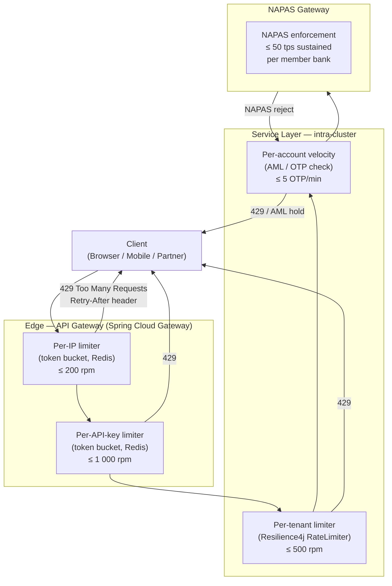

# Throttling / Rate Limiting

Status: Draft | Last Reviewed: 2026-05-09 | Owner: @sre-lead
Catalog ID: RES-008 | Radii
Tier Applicability: T0, T1, T2

## Problem Statement

- A misbehaving client or a Tet-eve traffic spike can saturate any service; without explicit per-client throttling the entire platform absorbs the burst at the cost of legitimate users.
- NAPAS mandates maximum transaction submission rates per member bank (50 tps sustained); exceeding this results in NAPAS-side rejection and can trigger regulatory scrutiny of the originating institution.
- OTP endpoints are credential-stuffing targets; without velocity controls an attacker can exhaust the OTP namespace for a victim account in minutes.
- AML transaction-velocity rules require that suspicious bursts (e.g., 30 transfers in 60 seconds from one account) are flagged before they reach the core — a service-level rate limiter is the enforcement point.

## Solution

Multi-tier throttling: each layer enforces different dimensions (IP, API key, tenant, account) so no single bypass defeats the whole chain.



## Implementation Guidelines

### 1. Spring Cloud Gateway — Redis Token Bucket (Edge)

Spring Cloud Gateway's `RequestRateLimiter` filter uses the Redis `SCRIPT` command to execute an atomic token-bucket Lua script bundled with the `spring-cloud-starter-gateway` dependency.

```yaml
# application.yml — API Gateway service
spring:
  cloud:
    gateway:
      routes:
        - id: payment-api
          uri: lb://payment-service
          predicates:
            - Path=/api/v1/payments/**
          filters:
            - name: RequestRateLimiter
              args:
                redis-rate-limiter.replenishRate: 500      # tokens added per second
                redis-rate-limiter.burstCapacity: 1000     # max burst tokens
                redis-rate-limiter.requestedTokens: 1
                key-resolver: "#{@apiKeyResolver}"
        - id: otp-api
          uri: lb://auth-service
          predicates:
            - Path=/api/v1/auth/otp/**
          filters:
            - name: RequestRateLimiter
              args:
                redis-rate-limiter.replenishRate: 5        # 5 OTP requests per second burst
                redis-rate-limiter.burstCapacity: 5
                redis-rate-limiter.requestedTokens: 1
                key-resolver: "#{@accountIdResolver}"

  data:
    redis:
      host: ${REDIS_HOST}
      port: 6379
      ssl:
        enabled: true
```

```java
/**
 * Key resolvers — determine the throttle key for each incoming request.
 * Registered as Spring beans so the YAML #{@beanName} references resolve.
 */
@Configuration
public class RateLimiterKeyResolvers {

    /**
     * Throttle by API key extracted from the Authorization header.
     * Falls back to client IP so unauthenticated requests are still bounded.
     */
    @Bean
    public KeyResolver apiKeyResolver() {
        return exchange -> {
            String apiKey = exchange.getRequest()
                    .getHeaders()
                    .getFirst("X-API-Key");
            if (apiKey != null && !apiKey.isBlank()) {
                return Mono.just("apikey:" + apiKey);
            }
            // Fallback: remote IP (handles unauthenticated probes)
            String remoteIp = Objects.requireNonNull(
                    exchange.getRequest().getRemoteAddress()).getAddress().getHostAddress();
            return Mono.just("ip:" + remoteIp);
        };
    }

    /**
     * For OTP endpoints: throttle per account-id extracted from the request body.
     * Returns IP as fallback if account-id is not yet known.
     */
    @Bean
    public KeyResolver accountIdResolver() {
        return exchange -> exchange.getRequest()
                .getBody()
                .next()
                .map(buffer -> {
                    String body = buffer.toString(StandardCharsets.UTF_8);
                    // Parse accountId from JSON body (simplified)
                    JsonNode node = parseJson(body);
                    String accountId = node.path("accountId").asText("");
                    return accountId.isBlank() ? "ip:" +
                            Objects.requireNonNull(exchange.getRequest()
                                    .getRemoteAddress()).getAddress().getHostAddress()
                            : "account:" + accountId;
                })
                .switchIfEmpty(Mono.just("unknown"));
    }
}
```

### 2. Resilience4j RateLimiter — Service-Level Per-Tenant

```java
@Configuration
public class TenantRateLimiterConfig {

    /**
     * One RateLimiter per tenant created on demand; stored in a ConcurrentHashMap.
     * LimitForPeriod is the number of permissions per refresh period.
     */
    @Bean
    public RateLimiterRegistry rateLimiterRegistry() {
        RateLimiterConfig defaultConfig = RateLimiterConfig.custom()
                .limitRefreshPeriod(Duration.ofSeconds(1))
                .limitForPeriod(500)           // 500 calls/second per tenant (T0 default)
                .timeoutDuration(Duration.ZERO) // Fail immediately on limit breach
                .build();

        return RateLimiterRegistry.of(defaultConfig);
    }
}
```

```java
@Service
@RequiredArgsConstructor
@Slf4j
public class PaymentService {

    private final RateLimiterRegistry rateLimiterRegistry;
    private final NapasGatewayClient napasClient;

    /**
     * Acquire a permit before forwarding to NAPAS.
     * 429 is surfaced via RateLimiterAcquireTimeoutException.
     */
    @RateLimiter(name = "napas-submission", fallbackMethod = "napasRateLimitFallback")
    public PaymentResult submitToNapas(PaymentRequest request, String tenantId) {
        // Per-tenant rate limiter created/retrieved lazily
        RateLimiter tenantLimiter = rateLimiterRegistry.rateLimiter(
                "tenant:" + tenantId,
                buildTenantConfig(tenantId));

        return RateLimiter.decorateSupplier(tenantLimiter,
                () -> napasClient.submit(request)).get();
    }

    private RateLimiterConfig buildTenantConfig(String tenantId) {
        // T0 tenants get a more generous limit; T1/T2 are stricter
        int limitPerSecond = "T0".equals(resolveTier(tenantId)) ? 50 : 10;
        return RateLimiterConfig.custom()
                .limitRefreshPeriod(Duration.ofSeconds(1))
                .limitForPeriod(limitPerSecond)
                .timeoutDuration(Duration.ZERO)
                .build();
    }

    public PaymentResult napasRateLimitFallback(
            PaymentRequest request, String tenantId,
            RequestNotPermitted ex) {
        log.warn("NAPAS rate limit reached for tenant={} correlationId={}",
                tenantId, request.getCorrelationId());
        // Structured 429 response — caller must respect Retry-After
        throw new RateLimitExceededException(
                "NAPAS submission rate exceeded. Retry after 1s.",
                Duration.ofSeconds(1));
    }

    private String resolveTier(String tenantId) {
        // Lookup tenant tier from config or cache
        return tenantTierCache.getOrDefault(tenantId, "T2");
    }
}
```

### 3. AML Transaction Velocity Check (Sliding Window in Redis)

```java
@Component
@RequiredArgsConstructor
@Slf4j
public class AmlVelocityGuard {

    private static final int MAX_TRANSFERS_PER_MINUTE = 30;
    private static final int OTP_MAX_PER_MINUTE = 5;
    private final StringRedisTemplate redis;

    /**
     * Sliding-log algorithm: each event is stored with timestamp as score.
     * ZRemRangeByScore prunes events outside the window before counting.
     */
    public void checkTransferVelocity(String accountId, String correlationId) {
        String key = "aml:velocity:transfer:" + accountId;
        long now = System.currentTimeMillis();
        long windowStart = now - Duration.ofMinutes(1).toMillis();

        redis.execute((RedisCallback<Void>) conn -> {
            conn.zSetCommands().zRemRangeByScore(
                    key.getBytes(), Double.NEGATIVE_INFINITY, windowStart);
            conn.zSetCommands().zAdd(
                    key.getBytes(), now, (correlationId + ":" + now).getBytes());
            conn.expire(key.getBytes(), 120L);
            return null;
        });

        Long count = redis.opsForZSet().zCount(key, windowStart, now);
        if (count != null && count > MAX_TRANSFERS_PER_MINUTE) {
            log.error("AML velocity breach accountId={} count={} correlationId={}",
                    accountId, count, correlationId);
            throw new AmlVelocityBreachException(
                    "Transaction velocity limit exceeded. Account flagged for review.");
        }
    }

    public void checkOtpVelocity(String accountId) {
        String key = "aml:velocity:otp:" + accountId;
        long now = System.currentTimeMillis();
        long windowStart = now - Duration.ofMinutes(1).toMillis();

        redis.execute((RedisCallback<Void>) conn -> {
            conn.zSetCommands().zRemRangeByScore(
                    key.getBytes(), Double.NEGATIVE_INFINITY, windowStart);
            conn.zSetCommands().zAdd(key.getBytes(), now, String.valueOf(now).getBytes());
            conn.expire(key.getBytes(), 120L);
            return null;
        });

        Long count = redis.opsForZSet().zCount(key, windowStart, now);
        if (count != null && count > OTP_MAX_PER_MINUTE) {
            log.warn("OTP velocity breach accountId={} count={}", accountId, count);
            throw new OtpRateLimitException("Too many OTP requests. Wait 60 seconds.");
        }
    }
}
```

### 4. application.yml — Resilience4j Rate Limiter Defaults

```yaml
resilience4j:
  ratelimiter:
    configs:
      default:
        limitRefreshPeriod: 1s
        limitForPeriod: 500
        timeoutDuration: 0
        registerHealthIndicator: true
        eventConsumerBufferSize: 100
      napas-submission:
        limitRefreshPeriod: 1s
        limitForPeriod: 50          # Hard NAPAS cap: 50 tps per member bank
        timeoutDuration: 0
      otp-generation:
        limitRefreshPeriod: 60s
        limitForPeriod: 5           # 5 OTP per minute per account
        timeoutDuration: 0

management:
  endpoints:
    web:
      exposure:
        include: health,metrics,ratelimiters
  health:
    ratelimiters:
      enabled: true
```

## Compliance Mapping

| Ring | Regulation | Provision | How this pattern satisfies |
|------|-----------|-----------|---------------------------|
| Ring 0 | NIST SP 800-53 | SC-5 Denial of Service Protection | Token-bucket at edge plus service-level rate limiter collectively bound request rates, preventing resource exhaustion DoS. |
| Ring 0 | OWASP ASVS | V13.2.1 API Rate Limiting | Per-API-key and per-IP throttle with 429 + Retry-After enforces ASVS requirement for rate-limiting on all API endpoints. |
| Ring 0 | AWS WAF | Rate-based rule (managed) | Edge token-bucket mirrors WAF rate-based rule semantics; WAF can be wired in front of the API Gateway for L3/L4 protection. |
| Ring 1 | PCI-DSS v4.0 | Req 6.4 (Protect public-facing web apps from attacks) | Rate limiting reduces attack surface for credential stuffing and L7 DoS on payment APIs. |
| Ring 1 | BCBS 230 | Principle 7 (ICT Security) | Velocity controls on NAPAS submission channels and OTP endpoints reduce exposure to enumeration and resource-exhaustion attacks. |
| Ring 2 | SBV Circular 09/2020 | §IV.2 Operational continuity ⚠️ (working summary — pending Legal review) | Per-tenant throttle prevents a single member-bank misbehaviour from disrupting system-wide operations. |

## NFR Acceptance Criteria

```yaml
nfr_acceptance_criteria:
  id: RES-008
  pattern: Throttling / Rate Limiting

  availability:
    - id: RA-01
      statement: >
        The rate limiter must not be a single point of failure; Redis cluster failure
        MUST fail open (pass-through) for T0 payment flows with an alert triggered.
      measurement: Inject Redis unavailability; verify payment flow degrades to pass-through
        within 200 ms and SRE alert fires within 60 s.

  performance:
    - id: RP-01
      statement: >
        Token-bucket evaluation at the API Gateway adds ≤ 2 ms P95 latency
        to any request that is within its quota.
      measurement: Load test at 1 000 rps sustained; compare P95 with and without
        the rate limiter filter; delta must be ≤ 2 ms.
    - id: RP-02
      statement: >
        NAPAS submission path must never exceed 50 tps aggregate across all tenants;
        excess requests receive HTTP 429 within 5 ms.
      measurement: Drive 60 tps against the NAPAS gateway mock; verify requests 51–60
        receive 429 with Retry-After: 1, measured response time ≤ 5 ms.

  reliability:
    - id: RR-01
      statement: >
        A 429 response MUST include a Retry-After header (seconds) and a
        machine-readable error body with code RATE_LIMIT_EXCEEDED.
      measurement: Unit test asserts response headers and body schema on every
        rate-limited path.
    - id: RR-02
      statement: >
        OTP endpoints MUST reject the 6th OTP request within a 60-second window
        for the same accountId, returning 429 before any OTP is generated.
      measurement: Integration test drives 6 sequential OTP requests; verifies 6th
        returns 429 and no OTP SMS is dispatched.

  security:
    - id: RS-01
      statement: >
        The AML velocity guard MUST flag any account submitting ≥ 30 transfers
        within a rolling 60-second window.
      measurement: Automated test injects 31 transfer events in 55 s; verifies
        AmlVelocityBreachException is raised on the 31st.
```

## Cost / FinOps

- Redis cluster (3-node HA) for rate-limiter counters adds approximately USD 150–300/month on AWS ElastiCache (cache.r7g.large x3); this is shared with session and JWKS caching so marginal cost is low.
- At 10 000 rps peak, each token-bucket evaluation executes one Lua script round-trip to Redis (~0.3 ms); network cost is negligible versus the cost of an unthrottled outage.
- Resilience4j in-process rate limiter for intra-cluster paths uses a single AtomicInteger + LockSupport; memory footprint is a few bytes per limiter instance, effectively zero.
- Cost of NOT throttling: a single runaway batch job saturating NAPAS has caused T0 P1 incidents industry-wide — remediation typically costs 2–4 engineer-weeks and regulatory correspondence.
- Review Redis memory allocation quarterly; sliding-log AML keys carry a 120-second TTL so memory is bounded at O(active accounts × events per window).

## Threat Model

STRIDE analysis — rate limiting primarily defends against Denial of Service and partially against Enumeration:

- **Spoofing — IP header manipulation**: Attacker spoofs `X-Forwarded-For` to bypass IP-based throttle. Mitigation: API Gateway trusts only a configured number of proxy hops; raw TCP source IP is the primary key for unauthenticated endpoints.
- **Tampering — Token bucket key collision**: Two tenants hash to the same Redis key, sharing quota. Mitigation: keys are prefixed with full tenant-id string; SHA-256 is not used so no collision risk from truncation.
- **Repudiation — Silent rate-limit bypass on Redis failure**: If Redis is down and the gateway fails open, quota enforcement ceases with no audit trail. Mitigation: Redis failure triggers a structured alert (within 60 s); pass-through mode is logged at WARN level with a distinct `throttle_bypass=true` field in the structured log.
- **Information Disclosure — 429 reveals account existence**: An attacker submitting OTP requests can infer that an account-id exists if they receive 429 (velocity limit) vs 404 (not found). Mitigation: OTP endpoint returns a generic 429 without confirming account existence; the velocity key uses a hash of the account-id.
- **Denial of Service — Quota exhaustion by a legitimate burst**: A salary-day batch legitimately fires 10 000 payment initiations in 5 minutes, triggering the tenant rate limiter for other users of the same tenant. Mitigation: batch flows use a dedicated API key with a higher quota; batch-specific rate limits are documented in the integration guide.
- **Elevation of Privilege — Bypassing OTP throttle via direct service call**: Attacker routes directly to auth-service, bypassing the gateway. Mitigation: service-mesh mTLS (SEC-008) enforces that auth-service only accepts traffic from the gateway's service account; Resilience4j limiter on the service itself provides defence-in-depth.
- **Denial of Service — AML flag weaponized**: Attacker submits 30 transfers on behalf of a victim to trigger the AML hold. Mitigation: AML velocity breach triggers a review queue, not an automatic account lock; a human operator confirms before restricting the account.

## Operational Runbook

1. **Alert: `RateLimiter_429SpikeRate`** fires when 429 responses exceed 5% of total responses on any route for 2 consecutive minutes. Triage: check Grafana dashboard `rate-limiter-overview` for the offending route and key dimension (IP vs API-key vs tenant).

2. **Identify the source**: query the structured log (`throttle_key`, `route`, `tenant_id`). Determine if the spike is from a legitimate burst (salary day, campaign), a misbehaving integration partner, or a credential-stuffing attack.

3. **Legitimate burst — increase quota temporarily**: Use the admin API to update the Redis token-bucket capacity for the affected API key. Document the change in the incident ticket. Revert within 24 hours or after the event window.

4. **Attack traffic — block at WAF**: Escalate IP ranges to the security team to add WAF block rules (Ring 0: AWS WAF). Rate limiter remains active as secondary control. Open an AML case if transfers are involved.

5. **NAPAS rate limit breach** (`napas_tps_exceeded` alert): immediately check whether the aggregate tenant submission rate has hit 50 tps. If so, identify the highest-volume tenant, reduce their per-second limit via config refresh (`@RefreshScope`), and notify the NAPAS operations team per the NAPAS incident-notification SLA.

6. **OTP velocity alert**: If `otp_velocity_breach` fires for a specific account, freeze the account's OTP generation, notify the fraud team, and log the event to the immutable audit trail. Do NOT generate the OTP that triggered the breach.

7. **Redis failover during rate limiting**: If ElastiCache primary fails, the gateway switches to replica within ~10–30 s (automatic failover). During that window, some requests may bypass the rate limiter. Verify that `throttle_bypass=true` events appear in logs; open a post-incident review if bypass duration exceeds 60 s.

8. **Recovery validation**: After incident resolution, confirm 429 rates return below 1%, review Redis memory usage (should be stable), and update the runbook with any new patterns identified.

## Test Strategy

### Unit Tests
- `TokenBucketKeyResolverTest`: verify `apiKeyResolver` returns `apikey:<key>` for authenticated requests and `ip:<addr>` for unauthenticated requests.
- `AmlVelocityGuardTest`: drive a Redis mock; verify that the 31st transfer within 60 s raises `AmlVelocityBreachException` and the 30th does not.
- `OtpVelocityGuardTest`: verify the 6th OTP request within 60 s raises `OtpRateLimitException`.
- `RateLimitExceededExceptionTest`: verify the exception message includes `Retry-After` duration.

### Integration Tests
- Spring Boot Test with Testcontainers (Redis + Spring Cloud Gateway): send requests exceeding the configured quota; assert HTTP 429 with `Retry-After` header and `RATE_LIMIT_EXCEEDED` body.
- NAPAS gateway mock: drive 60 tps; verify exactly 50 pass and the remaining 10 receive 429 within 5 ms.
- Tenant isolation: two tenants each at 499 rpm should both succeed; 501 for one tenant must not affect the other.

### Compliance Tests
- OTP brute-force scenario: 10 OTP attempts in 60 s against a single account; assert 6th+ returns 429 with no OTP generated (verify via SMS gateway mock call count = 5).
- AML velocity: verify event is written to the audit log for every velocity breach (log sink assertion in test).

### Chaos Tests
- Kill Redis primary during sustained 800 rps load; verify gateway fails open (requests pass through), `throttle_bypass=true` log events appear, and SRE alert fires within 60 s.
- Restart rate-limiter service mid-load; verify in-memory Resilience4j counters reset gracefully and do not cause a burst after restart.

## References

- [Resilience4j RateLimiter documentation](https://resilience4j.readme.io/docs/ratelimiter)
- [Spring Cloud Gateway RequestRateLimiter filter](https://docs.spring.io/spring-cloud-gateway/docs/current/reference/html/#the-requestratelimiter-gatewayfilter-factory)
- [NIST SP 800-53 SC-5 Denial of Service Protection](https://csrc.nist.gov/projects/cprt/catalog#/cprt/framework/version/SP_800_53_5_1_0/home?element=SC-5)
- [OWASP ASVS V13 API and Web Service Verification Requirements](https://owasp.org/www-project-application-security-verification-standard/)
- [RES-002 Circuit Breaker](circuit-breaker.md)
- [RES-009 Load Shedding](load-shedding.md)
- [INT-003 API Gateway](../integration/api-gateway-routing.md)
- [SEC-008 Service Mesh mTLS](../security/mtls-service-mesh.md)

---

**Key Takeaway**: Apply throttling at every tier — edge, service, and NAPAS channel — using a token-bucket algorithm backed by Redis so that no single misbehaving client, partner, or batch job can saturate shared banking infrastructure.
