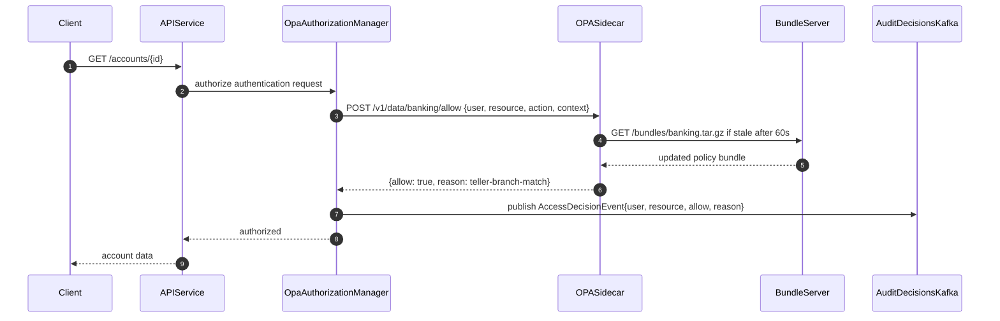

# Attribute-Based Access Control

Status: Draft | Last Reviewed: 2026-05-16 | Owner: @ciso-delegate
Catalog ID: SEC-010 | Radii
Tier Applicability: T0, T1, T2

## Problem Statement

- RBAC is insufficient for fine-grained banking access control: a teller should access accounts only when the account belongs to their branch AND the balance is below VND 500M AND the customer is not a PEP. Modelling this in RBAC requires hundreds of roles, making role management unauditable.
- Role proliferation: each new business constraint (branch isolation, amount threshold, PEP flag, time-of-day restriction) multiplies the role count, producing role catalogs no IAM team can maintain or audit effectively.
- Audit evidence for PCI-DSS section 7 must capture not just who accessed what, but why access was granted — the specific attribute values that satisfied the policy; RBAC access logs cannot provide this reasoning.
- OPA policy changes (new business rules, updated thresholds) must not require code deployments; policy-as-code decouples business rule changes from the Spring Security release cycle, enabling quarterly regulatory threshold updates without a service release.

## Context

In a Vietnamese commercial bank, access control decisions combine branch geography (`user.branch_id` vs `resource.account.branch_id`), risk classification (`resource.customer.is_pep`), monetary thresholds (VND 500M teller limit), and time-of-day constraints. OPA (Open Policy Agent) is the industry standard for ABAC in cloud-native environments. Spring Security's `AuthorizationManager` SPI provides the injection point for OPA-backed decisions without replacing the existing filter chain. Policy bundles are served from an Nginx bundle server and updated without service restart — satisfying the change-velocity requirement.

Reach for this pattern when:

- Fine-grained banking access control where role + attribute combinations (branch, amount, customer risk tier) must all be evaluated in a single policy decision.
- Environments where access control rules change frequently and policy changes must not require code releases (e.g., quarterly regulatory threshold updates).
- Audit-intensive workloads where every access decision must be logged with its reasoning (reason field) for PCI-DSS section 7 or SBV Circular 09/2020 compliance evidence.

## Solution

OPA evaluates access decisions based on structured attributes: `user.role`, `user.branch_id`, `resource.account.branch_id`, `resource.amount`, `context.time_of_day`. Spring Security's `OpaAuthorizationManager` calls the OPA REST API (`POST /v1/data/banking/allow`) with a typed input document and receives `{allow: true/false, reason: "..."}`. The reason string is logged to Kafka `audit.access.decisions` for every request. The OPA bundle server (Nginx) serves policy updates; OPA polls every 60 seconds — policy changes propagate without service restart.



## Implementation Guidelines

### 1. OpaAuthorizationManager — Spring Security SPI

The `OpaAuthorizationManager` implements the Spring Security `AuthorizationManager<RequestAuthorizationContext>` SPI. Fail-closed design: if OPA is unreachable for any reason, the method returns `AuthorizationDecision(false)` — no request is authorised while OPA is down.

```java
@Component
public class OpaAuthorizationManager
        implements AuthorizationManager<RequestAuthorizationContext> {

    private final String opaUrl;
    private final RestTemplate rest;
    private final AuditEventPublisher auditPublisher;

    @Override
    public AuthorizationDecision check(
            Supplier<Authentication> authentication,
            RequestAuthorizationContext context) {

        OpaInput input = OpaInput.from(authentication.get(), context.getRequest());
        OpaResponse response;
        try {
            response = rest.postForObject(opaUrl, input, OpaResponse.class);
        } catch (Exception e) {
            return new AuthorizationDecision(false);
        }
        if (response == null || !response.result().allow()) {
            return new AuthorizationDecision(false);
        }
        auditPublisher.publish(input, response.result());
        return new AuthorizationDecision(true);
    }
}

@Bean
SecurityFilterChain securityFilterChain(HttpSecurity http,
        OpaAuthorizationManager opaManager) throws Exception {
    return http
        .authorizeHttpRequests(auth -> auth
            .requestMatchers("/actuator/health").permitAll()
            .anyRequest().access(opaManager))
        .oauth2ResourceServer(o -> o.jwt(Customizer.withDefaults()))
        .build();
}
```

### 2. OPA Rego policy — banking bundle

The policy enforces three distinct rules: teller access scoped to own branch with balance and PEP checks; branch manager access scoped to own branch without amount restriction; compliance officer read-only access across all branches.

```rego
package banking

import future.keywords.if

default allow = false

allow if {
    input.user.role == "teller"
    input.action == "account:read"
    input.resource.branch_id == input.user.branch_id
    input.resource.balance < 500000000
    not input.resource.customer.is_pep
}

allow if {
    input.user.role == "branch_manager"
    input.action == "account:read"
    input.resource.branch_id == input.user.branch_id
}

allow if {
    input.user.role == "compliance_officer"
    input.action == "account:read"
}
```

### 3. OPA bundle server — Nginx config

```yaml
apiVersion: v1
kind: ConfigMap
metadata:
  name: opa-bundle-nginx
data:
  nginx.conf: |
    server {
      listen 80;
      root /bundles;
      location / {
        add_header Cache-Control "no-cache, must-revalidate";
      }
    }
```

### 4. OPA sidecar — Kubernetes pod spec

```yaml
containers:
  - name: opa
    image: openpolicyagent/opa:0.63.0-rootless
    args:
      - run
      - --server
      - --addr=:8181
      - --bundle
      - http://opa-bundle-server/bundles/banking.tar.gz
      - --bundle-polling-min-delay-seconds=60
      - --bundle-polling-max-delay-seconds=60
    resources:
      requests: { cpu: "100m", memory: "64Mi" }
      limits:   { cpu: "300m", memory: "128Mi" }
    readinessProbe:
      httpGet: { path: /health, port: 8181 }
```

## When to Use

- Fine-grained banking access control where role + attribute combinations (branch, amount, customer risk tier) must all be evaluated in a single policy decision.
- Environments where access control rules change frequently and policy changes must not require code releases (e.g., quarterly regulatory threshold updates).
- Audit-intensive workloads where every access decision must be logged with its reasoning (reason field) for PCI-DSS section 7 or SBV Circular 09/2020 compliance evidence.

## When Not to Use

- Simple read/write RBAC with fewer than 20 roles and no attribute-based conditions — RBAC is operationally simpler; OPA adds a network hop and sidecar overhead not justified for simple permission models.
- Ultra-low-latency hot paths where even 5 ms p99 OPA overhead is unacceptable (e.g., Kafka stream processors) — embed OPA's Go library as a sidecar or use pre-computed permission tokens.
- Greenfield services with no defined attribute taxonomy — ABAC requires well-defined attribute schemas; premature adoption leads to ad-hoc policy that is harder to audit than RBAC.

## Variants

| Variant | Use when | Trade-off |
|---------|----------|-----------|
| OPA sidecar co-located per service (this pattern) | Lowest latency (in-process network call); independent policy per service; standard for T0/T1 | One OPA sidecar per pod; higher pod resource consumption |
| Shared OPA cluster with bundle caching | High-throughput batch workloads; many services sharing identical policy; reduces total OPA pod count | Higher network latency vs sidecar; shared-cluster failure affects all services |
| ALFA / XACML PDP (enterprise standard) | Regulated environments requiring XACML-certified PDP; interoperability with legacy IAM vendor products | Higher operational weight; less ecosystem tooling than OPA in cloud-native stacks |

## NFR Acceptance Criteria

```yaml
nfr_acceptance_criteria:
  id: SEC-010
  pattern: Attribute-Based Access Control

  performance:
    - id: ABAC-01
      statement: >
        OPA authorization decision p99 latency (Spring Security to OPA sidecar to response)
        MUST be at most 10 ms in-cluster.
      measurement: >
        Load test at 500 rps; measure OPA HTTP call duration via Micrometer; assert p99 at most 10 ms.

  availability:
    - id: ABAC-02
      statement: >
        On OPA sidecar unavailability, all requests MUST be denied (fail-closed).
        OPA recovery MUST restore normal authorisation within 30 s.
      measurement: >
        Kill OPA sidecar pod; verify all requests return 403; restore OPA pod; assert
        first successful authorisation within 30 s.

  operational:
    - id: ABAC-03
      statement: >
        Policy bundle changes MUST propagate to all OPA sidecar instances within 60 s.
      measurement: >
        Push bundle update to bundle server; poll OPA /v1/data/banking/allow on all
        pods; assert updated policy active within 60 s.
```

## Compliance Mapping

| Ring | Regulation | Provision | How this pattern satisfies |
|------|-----------|-----------|---------------------------|
| Ring 0 | NIST SP 800-162 | ABAC guide — subject, object, environment attributes drive access decisions | OPA input maps to NIST model: subject (`user.role`, `user.branch_id`), object (`resource.account.*`), environment (`context.time_of_day`); policy is version-controlled and auditable. |
| Ring 1 | PCI-DSS v4.0 | Section 7 — restrict access to system components and cardholder data to those whose job requires it | Rego policy enforces need-to-know: tellers cannot access accounts outside their branch or above VND 500M; every decision logged to `audit.access.decisions` Kafka topic for PCI audit evidence. |
| Ring 2 | SBV Circular 09/2020 | Section IV.4 — access control requirements for critical information systems (working summary — pending Legal review) | OPA policy enforces role and branch attribute checks for all account access; access decision log provides audit trail for SBV inspection; policy-as-code enables documented change control; Legal review required to confirm attribute taxonomy and logging format satisfy SBV section IV.4 in full. |

## Cost / FinOps

- OPA sidecar per pod: 64 MiB memory, 0.1 vCPU at idle, 0.3 vCPU at 500 rps. At 10 services x 3 pods = 30 sidecars: approximately 9 vCPU + 1.9 GiB incremental — negligible on a banking Kubernetes cluster.
- Bundle server (Nginx): 1 pod, 128 MiB, static file serving for 30 OPA sidecars polling every 60 s — trivial cost.
- Kafka `audit.access.decisions`: at 500 rps x 0.5 KB/event = 250 KB/s; 30-day hot retention + 7-year S3 WORM at approximately USD 0.50/month.
- Cost of NOT using ABAC: a PCI-DSS section 7 audit finding on overly-permissive RBAC carries 4 to 8 engineer-weeks remediation per finding plus potential SBV fines.

## Threat Model

- **OPA bypass — fail-open on unavailability (Elevation of Privilege)**: If OPA is unreachable and Spring Security fails-open, all requests are authorised regardless of policy. Mitigation: `OpaAuthorizationManager` catches all exceptions and returns `AuthorizationDecision(false)` — fail-closed by design; OPA pod unavailability fires a P1 alert within 60 s.
- **Stale bundle — policy revocation not propagated (Elevation of Privilege)**: If the bundle server is unavailable for more than 60 s, OPA evaluates with its last-known-good bundle, which may pre-date an emergency policy revocation (e.g., revoking a compromised service account's access). Mitigation: alert if OPA bundle age exceeds 5 min; OPA switches to deny-all mode if bundle is more than 10 min stale; bundle server is HA (3-replica Nginx deployment).

## Operational Runbook Stub

**Alert: OpaDecisionLatencyHigh** — fires when OPA authorization decision p99 exceeds 50 ms for 2 minutes.

- **Alert `opa_decision_p99 > 50ms`**: Steps: (1) Check OPA pod CPU: `kubectl top pod -l app=opa-sidecar`. (2) If throttled, increase CPU limit. (3) Profile policy: `opa bench data.banking.allow -d policy.rego -i input.json` — if more than 10 ms, policy has O(n) iteration; refactor to indexed rule sets.
- **Alert `opa_bundle_age > 300s`**: Steps: (1) Check bundle server health: `kubectl get pods -l app=opa-bundle-server`. (2) If down, restore from backup bundle or redeploy. (3) If healthy but OPA not fetching, check OPA log for fetch errors. (4) If bundle age exceeds 600 s, OPA enters deny-all mode — escalate immediately.
- **Dashboards**: Grafana — `opa-abac-decisions`.
- **Full runbook**: `governance/runbooks/attribute-based-access-control.md`

## Test Strategy Stub

- **Unit**: `OpaAuthorizationManagerTest` — mock OPA returning `{allow: true}` asserts `AuthorizationDecision(true)`. Mock returning `{allow: false}` asserts `AuthorizationDecision(false)`. Mock connection refused asserts `AuthorizationDecision(false)` (fail-closed).
- **Unit**: `OpaInputBuilderTest` — JWT with `role=teller, branch_id=HN001` asserts `input.user.role=="teller"` and `input.user.branch_id=="HN001"`.
- **Integration**: Spring Boot Test with Testcontainers (OPA + Kafka) — teller JWT `branch_id=HN001` requests account in `HN001`, balance 200M, asserts 200. Same teller requests account in `HN002`, asserts 403. Same teller, `HN001`, balance 600M, asserts 403. Verify `AccessDecisionEvent` in Kafka for each.
- **Integration**: Bundle update — start OPA with v1 policy (500M limit); push v2 (300M limit); wait 60 s; retry 350M account access, assert 403.
- **Compliance**: PCI-DSS section 7 coverage — enumerate all API endpoints; assert each has an OPA Rego rule (no endpoint implicitly permitted). Fail-closed verification: kill OPA pod; assert all requests return 403 within 5 s.

## Related Patterns

- [PRIN-011 Least Privilege](../../principles/least-privilege.md) — the principle that SEC-010 enforces at the API layer via attribute-scoped policies
- [SEC-012 Tamper-Evident Audit Logging](audit-logging-tamper-evident.md) — stores the `AccessDecisionEvent` records produced by this pattern
- [BSP-005 Reversal and Chargeback](../banking-solutions/reversal-and-chargeback.md) — dual-approval reversal flow uses ABAC to enforce the four-eyes requirement

## References

- OPA Documentation — Policy Language (Rego) (openpolicyagent.org/docs/latest/policy-language)
- OPA REST API Reference (openpolicyagent.org/docs/latest/rest-api)
- NIST SP 800-162 — Guide to Attribute Based Access Control (csrc.nist.gov/publications/detail/sp/800-162/final)
- PCI-DSS v4.0 Section 7 — Restrict Access to System Components (pcisecuritystandards.org/document_library)
- Spring Security AuthorizationManager SPI (docs.spring.io/spring-security/reference/servlet/authorization/architecture.html)
- Catalog reference: `governance/standards/enterprise-architecture-catalog.md`
- Research notes: `knowledge-base/_research-notes.md`

---

**Key Takeaway**: Use OPA-backed ABAC when RBAC cannot express the combination of branch, amount, and customer-risk attributes needed for regulatory-grade banking access control — the policy-as-code model decouples business rule updates from service deployments, while fail-closed design ensures OPA unavailability never creates a security gap.
