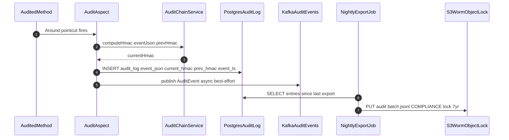

# Tamper-Evident Audit Logging

Status: Draft | Last Reviewed: 2026-05-16 | Owner: @ciso-delegate
Catalog ID: SEC-012 | Radii
Tier Applicability: T0, T1

## Problem Statement

- Insider threat: a privileged DBA or sysadmin deletes or modifies audit log entries to conceal unauthorised activity; standard ELK or PostgreSQL with unrestricted DML does not prevent record modification.
- PCI-DSS section 10.3 requires audit log integrity protection — logs backed up to a server "difficult to alter" — but storage alone without cryptographic chaining leaves gaps undetectable.
- BCBS 239 requires a complete audit trail for all risk data changes; deleted records leave no evidence of their prior existence unless a cryptographic chain links consecutive entries.
- Regulators conducting post-incident examinations years after the fact cannot trust an audit log that can be altered by anyone with database access.

## Context

Tamper-evident logging applies the HMAC chaining principle from certificate transparency logs to a SQL database, without distributed-ledger complexity. Each audit entry includes a hash of the previous entry, forming a chain where any deletion or modification breaks subsequent hash verification. The chain is anchored to a GENESIS sentinel. S3 WORM Object Lock (COMPLIANCE mode, 7-year retention) provides the immutable secondary store required by PCI-DSS section 10.5. Spring AOP `@Audited` intercepts annotated business methods transparently.

Reach for this pattern when:

- Any T0/T1 service where audit trail integrity must be provable under regulatory examination (PCI-DSS section 10, BCBS 239, SBV Circular 09/2020 section IV.2).
- Insider-threat-sensitive environments where DBAs or infrastructure admins have database access and standard GRANT/REVOKE controls are insufficient.
- Environments subject to WORM data retention requirements — HMAC chaining on top of S3 WORM provides dual-layer tamper evidence.

## Solution

HMAC-SHA256 chain: each `AuditEntry` carries `previousHmac` and `currentHmac = HMAC(eventJson + "|" + previousHmac, vaultKey)`. The chain is stored in a PostgreSQL append-only table (INSERT-only via a RULE that converts UPDATE/DELETE to NOTHING). A nightly S3 export job writes batches to WORM storage. A nightly chain verification job recomputes all HMACs; any break fires a CRITICAL alert and pauses the verification job (preserving evidence).



## Implementation Guidelines

### 1. @Audited annotation and AuditChainService

The `@Audited` annotation is placed on business methods that require tamper-evident logging. `AuditChainService` computes the HMAC using the Vault-managed signing key, chaining each entry to the previous one.

```java
@Target(ElementType.METHOD)
@Retention(RetentionPolicy.RUNTIME)
public @interface Audited {
    String action();
    String resourceType();
}

@Service
public class AuditChainService {

    @Value("${audit.signing-key}")
    private String signingKey;

    public String computeHmac(String eventContent, String previousHmac) {
        try {
            Mac mac = Mac.getInstance("HmacSHA256");
            mac.init(new SecretKeySpec(
                signingKey.getBytes(StandardCharsets.UTF_8), "HmacSHA256"));
            String input = eventContent + "|" + previousHmac;
            return "sha256-" + Hex.encodeHexString(
                mac.doFinal(input.getBytes(StandardCharsets.UTF_8)));
        } catch (Exception e) {
            throw new IllegalStateException("HMAC computation failed", e);
        }
    }
}
```

### 2. AuditAspect — Spring AOP @Around

The aspect intercepts every `@Audited` method after successful execution, fetches the last HMAC from the repository (or uses GENESIS for the first entry), and inserts a new chained audit record atomically.

```java
@Aspect
@Component
@RequiredArgsConstructor
public class AuditAspect {

    private final AuditChainService chainService;
    private final AuditRepository auditRepository;
    private final ApplicationEventPublisher publisher;

    @Around("@annotation(audited)")
    public Object auditMethod(ProceedingJoinPoint pjp, Audited audited)
            throws Throwable {
        Object result = pjp.proceed();

        AuditEntry last = auditRepository.findLastEntry();
        String prevHmac = last != null ? last.currentHmac() : "GENESIS";

        AuditRecord record = AuditRecord.builder()
            .action(audited.action())
            .resourceType(audited.resourceType())
            .principal(SecurityContextHolder.getContext()
                .getAuthentication().getName())
            .eventTs(Instant.now())
            .build();

        String json = JsonUtil.serialize(record);
        String hmac = chainService.computeHmac(json, prevHmac);
        auditRepository.insert(json, hmac, prevHmac);
        publisher.publishEvent(new AuditKafkaEvent(record, hmac));
        return result;
    }
}
```

### 3. PostgreSQL append-only table

The PostgreSQL RULE converts any UPDATE or DELETE on `audit_log` to a no-op, enforcing append-only at the database engine level — even DBAs with full privileges cannot remove records.

```sql
CREATE TABLE audit_log (
    id           BIGSERIAL,
    event_json   JSONB        NOT NULL,
    current_hmac TEXT         NOT NULL,
    prev_hmac    TEXT         NOT NULL,
    event_ts     TIMESTAMPTZ  NOT NULL DEFAULT NOW()
) PARTITION BY RANGE (event_ts);

CREATE RULE no_update_audit AS ON UPDATE TO audit_log DO INSTEAD NOTHING;
CREATE RULE no_delete_audit AS ON DELETE TO audit_log DO INSTEAD NOTHING;
```

### 4. Nightly chain verification

The verification job traverses all entries in order, recomputing each HMAC. On a mismatch it logs the break point, fires a CRITICAL alert, and halts — preserving the forensic evidence without overwriting the broken chain.

```java
@Scheduled(cron = "0 2 * * *")
public void verifyChain() {
    List<AuditEntry> entries = auditRepository.findAllOrderById();
    String expectedPrev = "GENESIS";
    for (AuditEntry entry : entries) {
        String recomputed = chainService.computeHmac(
            entry.eventJson(), expectedPrev);
        if (!recomputed.equals(entry.currentHmac())) {
            log.error("CHAIN_BREAK at id={}", entry.id());
            alertService.fireCritical(
                "audit_chain_verification_failure", entry.id());
            return;
        }
        expectedPrev = entry.currentHmac();
    }
    log.info("Chain verification PASSED: {} entries", entries.size());
}
```

## When to Use

- Any T0/T1 service where audit trail integrity must be provable under regulatory examination (PCI-DSS section 10, BCBS 239, SBV Circular 09/2020 section IV.2).
- Insider-threat-sensitive environments where DBAs or infrastructure admins have database access and standard GRANT/REVOKE controls are insufficient.
- Environments subject to WORM data retention requirements — HMAC chaining on top of S3 WORM provides dual-layer tamper evidence.

## When Not to Use

- High-volume diagnostic logs (application trace, debug) — HMAC chaining adds approximately 2 ms per entry; at more than 10000 entries/s this becomes prohibitive; use standard ELK for diagnostic logs.
- T2/T3 services handling only non-PCI, non-PII data — standard append-only logging without chaining is sufficient.
- Development and sandbox environments — chain verification complexity adds overhead without regulatory benefit.

## Variants

| Variant | Use when | Trade-off |
|---------|----------|-----------|
| HMAC-SHA256 chain (this pattern) | Standard banking audit trail; low overhead; verifiable without distributed infrastructure | Chain rewrite requires HMAC key + HSM compromise — two separate controls |
| Merkle tree per batch | Higher integrity per batch (blockchain-grade); use when batches are the regulatory submission unit | Higher implementation complexity; batch boundary delays detection |
| S3 WORM only (no chaining) | Satisfies PCI-DSS section 10.5 storage requirement; simpler implementation | Does not detect gaps from DB-level deletion before export — chain break undetectable |

## NFR Acceptance Criteria

```yaml
nfr_acceptance_criteria:
  id: SEC-012
  pattern: Tamper-Evident Audit Logging

  performance:
    - id: TAL-01
      statement: >
        Audit log write p99 latency (HMAC compute plus PostgreSQL INSERT)
        MUST be at most 20 ms. Audit writes MUST NOT block the calling business method
        beyond the aspect Around overhead.
      measurement: >
        Load test at 100 audit events per second; measure AuditAspect execution duration;
        assert p99 at most 20 ms.

  operational:
    - id: TAL-02
      statement: >
        Chain verification MUST complete within 1 hour for 1 million entries (nightly job).
      measurement: >
        Run verification on 1 million-entry test table; assert job completes within 60 min.

  compliance:
    - id: TAL-03
      statement: >
        S3 WORM Object Lock COMPLIANCE retention MUST be 7 years.
        Any DELETE attempt within retention period MUST return S3 AccessDenied.
      measurement: >
        Attempt DeleteObject on WORM-locked file; assert AccessDenied.
        Verify bucket Object Lock configuration via AWS CLI.
```

## Compliance Mapping

| Ring | Regulation | Provision | How this pattern satisfies |
|------|-----------|-----------|---------------------------|
| Ring 0 | PCI-DSS v4.0 | Section 10.3.2 — protect audit logs from unauthorised modification | PostgreSQL INSERT-only RULE prevents UPDATE/DELETE at the DB engine level; HMAC chain detects out-of-band modification; S3 WORM COMPLIANCE mode is the immutable secondary store. |
| Ring 1 | BCBS 239 | Principle 3 — accuracy and integrity of risk data; complete audit trail for all risk data changes | `@Audited` aspect captures all annotated business events with `principal`, `action`, `resourceType`, and `eventTs`; chain verification proves no entries have been removed or altered since original write. |
| Ring 2 | SBV Circular 09/2020 | Section IV.2 — minimum 5-year log retention for critical system events ⚠️ (working summary — pending Legal review) | S3 WORM configured for 7-year retention (exceeds 5-year minimum); PostgreSQL monthly partitions enable DROP after confirmed WORM export; Legal review required to confirm 7-year retention and WORM export satisfy SBV section IV.2. |

## Cost / FinOps

- HMAC compute: approximately 0.1 ms per entry on JDK 21; at 100 events/s negligible CPU overhead.
- PostgreSQL: approximately 760 bytes/entry (JSONB + 2 HMAC fields); at 100 events/s approximately 6.5 GB/year uncompressed, approximately 3 GB compressed. Monthly partition DROP after confirmed WORM export keeps DB size bounded.
- S3 WORM: 7-year x approximately 3 GB/year = approximately 21 GB; at AWS S3 Standard pricing approximately USD 0.48/month — negligible.
- Nightly verification job: full 1 million-entry scan in less than 1 h; runs at 02:00; one small pod for less than 1 h/night.

## Threat Model

- **Complete chain rewrite (Tampering)**: Attacker with DB access + Vault key rewrites all audit entries and recomputes the HMAC chain, making the forged chain appear valid. Mitigation: HMAC signing key stored exclusively in Vault; Vault access is itself audited; the GENESIS anchor provides a known-good start state; rewriting requires both the Vault key AND the GENESIS value — separate controls.
- **S3 WORM bypass via AWS admin deletion (Tampering)**: AWS root account attempts to delete WORM-locked objects during the retention period. Mitigation: Object Lock COMPLIANCE mode prevents deletion even by the AWS root account; MFA delete required to modify retention; AWS CloudTrail logs any retention policy change attempt.

## Operational Runbook Stub

**Alert: AuditChainVerificationFailure** — CRITICAL: fires when a tamper-evidence chain break is detected; preserve forensic state and notify CISO immediately.

- **Alert `audit_chain_verification_failure`** (fires when a chain break is detected): CRITICAL — Steps: (1) Immediately `pg_dump audit_log > /tmp/audit_snapshot_$(date +%s).sql` to preserve evidence. (2) Identify break point from verification log (CHAIN_BREAK at id=...). (3) Compare PostgreSQL entry against S3 WORM export for the same time range. (4) Notify CISO; open forensics investigation. (5) Do NOT repair the chain — preserve broken state as forensic evidence. (6) Notify SBV within regulatory incident reporting window.
- **Alert `audit_export_lag > 1h`** (nightly export job overdue): Steps: (1) Check export job logs: `kubectl logs -l app=audit-export-job`. (2) If S3 unreachable, write to secondary S3 region. (3) If PostgreSQL read replica slow, export from primary with read-only connection. (4) Increase export job resource limits if OOMKilled.
- **Dashboards**: Grafana — `audit-log-tamper-evident`.
- **Full runbook**: `governance/runbooks/audit-logging-tamper-evident.md`

## Test Strategy Stub

- **Unit**: `AuditChainServiceTest` — same inputs produce same HMAC (deterministic). Different `previousHmac` produces different `currentHmac`. Null key throws `IllegalStateException`.
- **Unit**: `AuditAspectTest` — mock `AuditRepository` and `AuditChainService`; invoke `@Audited` method; assert `insert` called once; assert `publishEvent` called.
- **Unit**: Chain verifier — build 100-entry chain; inject one modified entry at position 50; run verifier; assert break detected at position 50.
- **Integration**: Testcontainers (PostgreSQL + Kafka) — invoke 10 `@Audited` business methods; SELECT all entries; recompute chain; assert all HMACs valid. Attempt UPDATE on `audit_log`; assert 0 rows affected (RULE). Attempt DELETE; assert 0 rows affected.
- **Integration**: LocalStack S3 WORM — run export job; attempt `DeleteObject`; assert `AccessDenied`.
- **Compliance**: ArchUnit — assert all `@Transactional` service methods carry `@Audited`; pipeline fails on violation. PCI-DSS section 10.3.2: run chain verifier against a 10000-entry chain with one modified entry; assert `audit_chain_verification_failure` alert fires.

## Related Patterns

- [SEC-010 Attribute-Based Access Control](attribute-based-access-control.md) — ABAC decisions published as audit events stored by this pattern
- [PRIN-011 Least Privilege](../../principles/least-privilege.md) — restricts who can access the signing key and WORM bucket
- [DATA-009 Data Lineage](../data/data-lineage.md) — lineage tracking is a consumer of the audit events this pattern produces

## References

- PCI-DSS v4.0 Section 10 — Log and Monitor All Access to System Components (pcisecuritystandards.org/document_library)
- BCBS 239 — Principles for Effective Risk Data Aggregation and Reporting (bis.org/publ/bcbs239.htm)
- AWS S3 Object Lock — COMPLIANCE mode (docs.aws.amazon.com/AmazonS3/latest/userguide/object-lock.html)
- Spring AOP Reference — Around advice (docs.spring.io/spring-framework/reference/core/aop/ataspectj/advice.html)
- Java Mac — HmacSHA256 (JDK 21) (docs.oracle.com/en/java/docs/jdk/21)
- Catalog reference: `governance/standards/enterprise-architecture-catalog.md`
- Research notes: `knowledge-base/_research-notes.md`

---

**Key Takeaway**: Use HMAC-SHA256 chaining on an append-only PostgreSQL table with S3 WORM secondary storage when audit trail integrity must be provable to regulators — the chain makes deletion detectable even when the deleter has full database access, and WORM provides the immutable secondary store that PCI-DSS section 10.5 requires.
