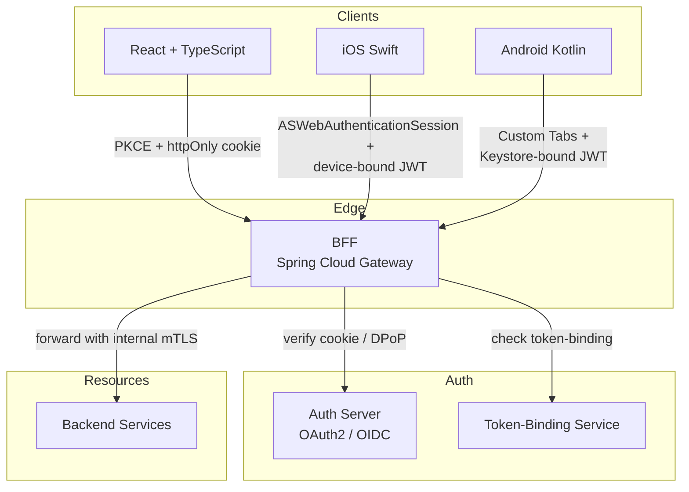

# BFF + Token-Binding (Web, iOS, Android)

Status: Draft | Last Reviewed: 2026-05-09 | Owner: @ciso-delegate, @tech-lead-web, @tech-lead-mobile
Catalog ID: SEC-005 | Radii
Tier Applicability: T0, T1

## Problem Statement

Direct-to-API auth from a browser or mobile app exposes long-lived bearer tokens to client storage (XSS-readable cookies; stolen Keychain entries; copied refresh tokens). For a banking platform, a leaked refresh token is direct access to customer money. The Backend-for-Frontend (BFF) pattern moves token handling server-side and uses **token binding** (per-device cryptographic binding of access tokens) to make stolen tokens unusable on a different device. This pattern unifies the auth stack across React web, iOS Swift, and Android Kotlin clients.

## Context

Reach for this pattern when:

- Building any customer-facing web or mobile auth flow.
- Designing the auth boundary for [REF-002 Real-Time Payments](../../reference-architectures/real-time-payments-napas.md), [REF-003 KYC/AML](../../reference-architectures/kyc-aml-onboarding.md), [REF-004 Card Authorization](../../reference-architectures/card-authorization-3ds2.md).
- Hardening an existing OAuth2 implementation (SEC-002) against client-side token theft.
- Aligning multi-platform auth (avoid platform drift between web and mobile).

## Solution



### Per-platform auth model

#### React (web)

- **OAuth2 Authorization Code + PKCE** — initiated from the BFF; auth server redirects back to BFF, not to React.
- **Session cookie** — `httpOnly`, `Secure`, `SameSite=Lax`, scoped to `*.techcombank.vn`. The cookie is opaque to React; it is the BFF's session handle.
- **CSRF token** — required on every state-changing request; double-submit cookie pattern.
- React never sees access tokens or refresh tokens. React talks to the BFF, the BFF talks to the resource APIs.

#### iOS Swift

- **ASWebAuthenticationSession** — for OAuth2 Authorization Code + PKCE; system-managed browser, no shared cookies.
- **Refresh token in Keychain** — `kSecAttrAccessibleWhenUnlockedThisDeviceOnly`; bound to device via Secure Enclave-backed key.
- **Device-bound JWT** (DPoP — Demonstrating Proof of Possession; RFC 9449) — every request signed with a device key whose private half lives in Secure Enclave; auth server issues access tokens bound to the device key's thumbprint.
- **Biometric gate** — `LocalAuthentication.LAContext` evaluates `.deviceOwnerAuthenticationWithBiometrics` before refresh-token use.

#### Android Kotlin

- **Custom Tabs** — for OAuth2 PKCE; system-managed browser.
- **Refresh token in EncryptedSharedPreferences** — backed by `AndroidKeyStore`; StrongBox where available.
- **Device-bound JWT (DPoP)** — same RFC 9449 model; private key in `AndroidKeyStore` with `setUserAuthenticationRequired(true)`.
- **Biometric gate** — `androidx.biometric.BiometricPrompt` with class-3 authentication before key use.

### Common BFF logic

1. Client (web cookie / mobile DPoP) calls BFF.
2. BFF verifies session.
3. BFF mints / refreshes the upstream access token from the auth server.
4. BFF forwards the request to the resource API over **internal mTLS** ([SEC-001](mtls-service-mesh.md)) with the access token in the `Authorization` header.
5. Resource API verifies the access token; checks `cnf` claim (DPoP thumbprint or token-binding ID) for mobile.

### Threat surface bounded

- A stolen web cookie cannot be used outside the browser (httpOnly + Secure + SameSite).
- A stolen mobile refresh token cannot be used without the Keychain/Keystore-resident private key (which is biometric-gated).
- A stolen mobile access token cannot be replayed without the corresponding device key (DPoP signature mismatch).
- The resource API never sees a long-lived secret bound only to user identity — only access tokens bound to device.

## Implementation Guidelines

### Spring Cloud Gateway BFF — cookie-based session for web

```java
@Configuration
public class WebBffConfig {

    @Bean
    public SecurityWebFilterChain webBffFilters(ServerHttpSecurity http) {
        return http
            .authorizeExchange(ex -> ex
                .pathMatchers("/auth/**").permitAll()
                .anyExchange().authenticated()
            )
            .oauth2Login(ol -> ol.authorizationRequestResolver(pkceResolver()))
            .csrf(c -> c.csrfTokenRepository(CookieServerCsrfTokenRepository.withHttpOnlyFalse()))
            .securityContextRepository(new WebSessionServerSecurityContextRepository())
            .build();
    }

    @Bean
    public ServerOAuth2AuthorizationRequestResolver pkceResolver() {
        DefaultServerOAuth2AuthorizationRequestResolver r =
            new DefaultServerOAuth2AuthorizationRequestResolver(clientRegistrations);
        r.setAuthorizationRequestCustomizer(OAuth2AuthorizationRequestCustomizers.withPkce());
        return r;
    }

    @Bean
    public CookieServerWebExchangeMatcher cookieAttributes() {
        // Configure session cookie: httpOnly, Secure, SameSite=Lax, domain=*.techcombank.vn
        // (Spring config detail elided)
        return new CookieServerWebExchangeMatcher("TC_SESSION");
    }
}
```

### Spring Cloud Gateway BFF — DPoP verification for mobile

```java
@Component
public class DpopVerificationFilter implements GlobalFilter {

    @Override
    public Mono<Void> filter(ServerWebExchange exchange, GatewayFilterChain chain) {
        ServerHttpRequest req = exchange.getRequest();
        String dpop = req.getHeaders().getFirst("DPoP");
        String accessToken = bearer(req);

        if (dpop != null) {
            // 1. Parse DPoP JWT (RFC 9449)
            // 2. Verify it covers this method+URL
            // 3. Verify access token's `cnf.jkt` matches DPoP key thumbprint
            // 4. Reject on mismatch
            try {
                dpopValidator.validate(dpop, req.getMethod(), req.getURI(), accessToken);
            } catch (DpopException e) {
                exchange.getResponse().setStatusCode(HttpStatus.UNAUTHORIZED);
                return exchange.getResponse().setComplete();
            }
        }
        return chain.filter(exchange);
    }
}
```

### iOS Swift — DPoP key + biometric gate

```swift
import LocalAuthentication
import CryptoKit
import Security

final class DeviceKeyManager {

    /// Generate a P-256 keypair in Secure Enclave; private key never leaves the chip.
    static func generateDeviceKey() throws -> SecureEnclave.P256.Signing.PrivateKey {
        let access = SecAccessControlCreateWithFlags(
            nil,
            kSecAttrAccessibleWhenUnlockedThisDeviceOnly,
            [.privateKeyUsage, .biometryCurrentSet],
            nil
        )!
        return try SecureEnclave.P256.Signing.PrivateKey(accessControl: access)
    }

    /// Authenticate the user, then sign a DPoP JWT for the given HTTP request.
    static func makeDpopProof(for url: URL, method: String,
                              key: SecureEnclave.P256.Signing.PrivateKey) async throws -> String {
        let context = LAContext()
        var error: NSError?
        guard context.canEvaluatePolicy(.deviceOwnerAuthenticationWithBiometrics, error: &error) else {
            throw AuthError.biometricNotAvailable
        }

        try await context.evaluatePolicy(
            .deviceOwnerAuthenticationWithBiometrics,
            localizedReason: "Authorise payment"
        )

        let header = #"{"typ":"dpop+jwt","alg":"ES256","jwk":\#(key.publicKey.jwk())}"#
        let claims = """
        {"jti":"\(UUID().uuidString)","htm":"\(method)","htu":"\(url.absoluteString)","iat":\(Int(Date().timeIntervalSince1970))}
        """
        let signingInput = "\(header.base64UrlEncoded()).\(claims.base64UrlEncoded())"
        let signature = try key.signature(for: Data(signingInput.utf8))
        return "\(signingInput).\(signature.derRepresentation.base64UrlEncoded())"
    }
}
```

### Android Kotlin — DPoP key + biometric gate

```kotlin
import android.security.keystore.KeyGenParameterSpec
import android.security.keystore.KeyProperties
import androidx.biometric.BiometricPrompt
import java.security.KeyStore
import java.security.Signature

class DeviceKeyManager(private val activity: FragmentActivity) {

    fun generateDeviceKey(alias: String) {
        val spec = KeyGenParameterSpec.Builder(
            alias,
            KeyProperties.PURPOSE_SIGN
        ).run {
            setAlgorithmParameterSpec(java.security.spec.ECGenParameterSpec("secp256r1"))
            setDigests(KeyProperties.DIGEST_SHA256)
            setUserAuthenticationRequired(true)
            setUserAuthenticationParameters(
                30,
                KeyProperties.AUTH_BIOMETRIC_STRONG
            )
            setIsStrongBoxBacked(true)   // hardware-isolated where supported
            build()
        }
        val gen = java.security.KeyPairGenerator.getInstance(
            KeyProperties.KEY_ALGORITHM_EC,
            "AndroidKeyStore"
        )
        gen.initialize(spec)
        gen.generateKeyPair()
    }

    suspend fun signDpop(alias: String, method: String, url: String): String {
        val key = (KeyStore.getInstance("AndroidKeyStore").apply { load(null) })
            .getKey(alias, null) as java.security.PrivateKey
        val sig = Signature.getInstance("SHA256withECDSA").apply { initSign(key) }

        // Trigger biometric prompt — caller must wrap signing in BiometricPrompt callback.
        val prompt = BiometricPrompt(
            activity,
            ContextCompat.getMainExecutor(activity),
            object : BiometricPrompt.AuthenticationCallback() {}
        )
        // (full async wrapping elided — biometric callback resumes coroutine)

        val signingInput = "$header.$claims"
        sig.update(signingInput.toByteArray())
        val signature = sig.sign()
        return "$signingInput.${Base64.encodeToString(signature, Base64.URL_SAFE or Base64.NO_WRAP)}"
    }
}
```

### React — invisible to auth, but CSRF-aware

```typescript
// src/lib/api.ts — note: NO bearer tokens; cookie-based session is automatic.
export async function bffPost<T>(path: string, body: unknown): Promise<T> {
    const csrf = getCookie('XSRF-TOKEN');
    const res = await fetch(`${BFF_BASE}${path}`, {
        method: 'POST',
        credentials: 'include',          // include the httpOnly session cookie
        headers: {
            'Content-Type': 'application/json',
            'X-XSRF-TOKEN': csrf ?? '',  // double-submit CSRF
            'Idempotency-Key': crypto.randomUUID(),  // PRIN-006 + EIP-024
        },
        body: JSON.stringify(body),
    });
    if (!res.ok) throw new Error(`BFF ${res.status}`);
    return res.json();
}
```

## Variants & Trade-offs

| Variant | When | Trade-off |
| --- | --- | --- |
| **BFF + cookie (web)** | Default for browser flows | Strong; requires same eTLD+1 for cookie scope |
| **BFF + DPoP (mobile)** | Default for native iOS/Android | Strong; requires per-platform crypto handling |
| **Pure SPA + bearer token in memory** | Niche cases (embedded apps) | Weaker; bearer in JS heap is XSS-readable |
| **mTLS client cert** (instead of DPoP) | Internal apps with managed devices | Strong; harder to provision for consumer apps |

## NFR Acceptance Criteria

- **HA**: BFF horizontally scaled per cell; auth server (OAuth) is HA per [REF-001](../../reference-architectures/multi-region-active-active.md).
- **HP**: BFF round-trip overhead ≤ 10 ms P95 (cookie verify + token attach); DPoP verification ≤ 5 ms P95.
- **HR**: stolen tokens bounded — short access-token TTL (5 min); refresh requires biometric (mobile) or session cookie (web); revocation via JTI denylist (Redis).

## Compliance Mapping

| Layer | Reference | Section/Control | How this satisfies |
|---|---|---|---|
| Ring 0 | OWASP ASVS V3 (Session Management) | "Stateful sessions; secure cookies; logout invalidation" | httpOnly + Secure + SameSite cookies; revocation list |
| Ring 0 | OWASP ASVS V4 (Access Control) | "Access tokens bound to user and context" | DPoP binds tokens to device key |
| Ring 0 | NIST SP 800-63B | AAL2 / AAL3 (multi-factor + hardware-bound key) | Mobile flow with biometric + hardware-backed key satisfies AAL3 |
| Ring 0 | RFC 9449 (DPoP) | Demonstrating Proof-of-Possession at the Application Layer | Direct implementation |
| Ring 1 | PCI-DSS 4.0 §8 (Authentication) | "Strong cryptographic-based authentication for non-console access" | DPoP + cookies + TLS satisfy |
| Ring 1 | FAPI 2.0 (Financial-grade API) | Token-binding requirements for financial APIs | DPoP is the FAPI-2 sender-constrained token mechanism |
| Ring 2 | SBV Circular 09/2020; Decree 13/2023 ⚠️ (working summary — pending Legal review) | Multi-factor authentication for banking; personal-data protection | Biometric + device key + cookie/DPoP satisfies multi-factor expectations; session data stays within Vietnam-resident infrastructure |

## Cost / FinOps Notes

| Item | Cost driver | Order of magnitude |
|---|---|---|
| BFF compute | One additional hop per request | ~10–15% of resource-API compute baseline |
| Token-binding service | DPoP verification CPU | Modest — ECDSA verify is cheap |
| Cookie store / session DB | Active sessions × footprint | Small (Redis) |
| Mobile dev complexity | Per-platform crypto code | One-time engineering investment |

**Cost of NOT having SEC-005**: token theft via XSS / app-data-leak → direct customer-money exposure. Single such incident (regulatory reporting + customer reimbursement + reputational) far exceeds the engineering cost of BFF + DPoP.

## Threat Model Summary

STRIDE: addresses **Spoofing**, **Tampering**, **Information Disclosure** primarily.

- **Top 3 threats addressed**:
  1. *Token theft via XSS* (Information Disclosure) — httpOnly cookie unreadable from JavaScript.
  2. *Stolen refresh token used on another device* (Spoofing) — DPoP signature requires private key bound to original device.
  3. *Cross-site request forgery* (Tampering) — CSRF double-submit cookie + SameSite=Lax.
- **Top 3 residual threats**:
  1. *Compromised device* (Elevation of Privilege) — attacker has physical access + biometric. Mitigation: device-attestation extensions; backend behavioural anomaly detection.
  2. *Phishing into the OAuth consent screen* — user grants consent on attacker-controlled domain. Mitigation: domain consistency enforcement; user education; FIDO2 Webauthn for high-value flows.
  3. *DPoP replay within the proof's iat window* — attacker captures and replays. Mitigation: short `iat` window (60 s); `jti` uniqueness check on the BFF.

## Operational Runbook

- **Alerts**:
  - Alert: BFFTokenValidationFailureRateHigh — `BFF_CookieRejectionSpike`: rate of session-cookie verification failures up > 3× baseline. Severity: High (possible token-theft attempt).
  - `BFF_DpopMismatchSpike`: rate of DPoP cnf-mismatch failures up > 3× baseline. Severity: High.
  - `Auth_RevocationListGrowth`: revocation list growing at unusual rate. Severity: Warning (possible mass-revocation event).
- **Dashboards**: Grafana — `bff-auth-overview`, `dpop-verification`, `revocation-list`, `auth-anomalies-by-region`.
- **Mass revocation procedure** (compromised auth server): rotate all OAuth signing keys; revoke all sessions; force re-login. Documented in `governance/runbooks/mass-revocation.md` (to author).

## Test Strategy

- **Unit**: cookie attribute config; CSRF validation; DPoP verifier (positive + negative cases).
- **Integration**: Testcontainer auth server + BFF; full PKCE flow; DPoP-bound flow.
- **Mobile**: per-platform UI test (Detox / Espresso) covering biometric prompt, DPoP signing, refresh.
- **Security**: pen-test annually; verify XSS resilience, CSRF resilience, DPoP replay rejection.
- **Chaos**: kill auth server; verify graceful degradation (existing sessions continue; no new logins).

## When to Use

- **Mandatory** for every customer-facing auth flow (web, mobile, partner-app).
- **Mandatory** for any API exposed externally that returns customer data.

## When NOT to Use

- Internal service-to-service auth → use [SEC-001 mTLS](mtls-service-mesh.md) + [SEC-002 OAuth2 client-credentials](oauth2-authorization.md).
- Legacy clients that absolutely cannot upgrade — flag as exception with EA-Board sign-off + compensating controls (rate-limit, anomaly detection, time-bound migration plan).

## Related Patterns

- [SEC-001 mTLS Service Mesh](mtls-service-mesh.md) — internal-call hardening
- [SEC-002 OAuth2 Authorization](oauth2-authorization.md) — auth-server side
- [SEC-006 JWT Best Practices](jwt-best-practices.md) — token-format hygiene
- [SEC-011 Session Revocation](session-revocation.md) — denylist-based revocation
- [PRIN-003 Zero-Trust Security](../../principles/zero-trust-security.md) — overarching
- [PRIN-008 Defense-in-Depth](../../principles/defense-in-depth.md) — BFF is one layer
- [MOB-002 Mobile Secure Storage](../mobile/mobile-secure-storage.md) — Keychain/Keystore reference
- [MOB-003 Mobile Biometric Auth](../mobile/mobile-biometric-auth.md) — biometric prompt reference

## References

- RFC 9449 — DPoP (Demonstrating Proof-of-Possession at the Application Layer)
- OWASP ASVS V3 / V4
- NIST SP 800-63B — Authenticator Assurance Levels
- FAPI 2.0 (OpenID Foundation Financial-grade API)
- iOS — `ASWebAuthenticationSession`, `LocalAuthentication`, `SecureEnclave`
- Android — `androidx.biometric.BiometricPrompt`, `AndroidKeyStore`, StrongBox guidance
- `_research-notes.md` §PCI-DSS

---

**Key Takeaway**: Move auth state server-side (BFF). Web = httpOnly Secure SameSite=Lax cookie + CSRF. Mobile = ASWebAuthenticationSession / Custom Tabs + DPoP-bound JWT signed by Secure-Enclave / Keystore-resident key + biometric gate. Stolen tokens are unusable on a different device.
