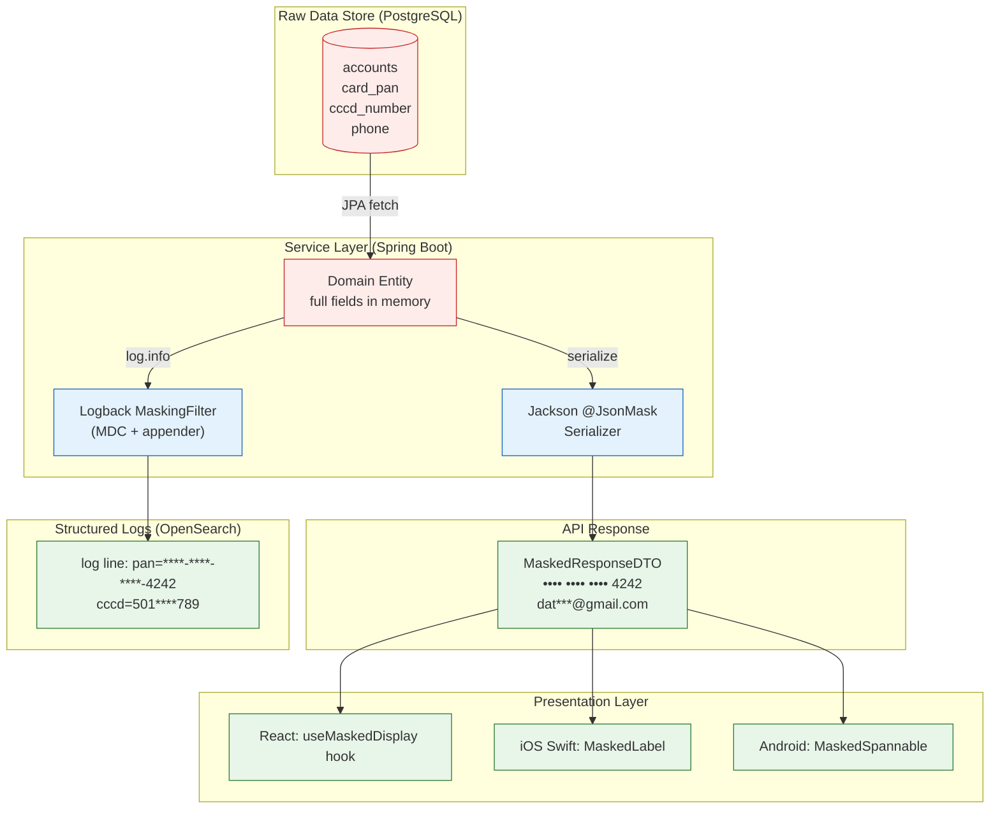

# Data Masking

Status: Draft | Last Reviewed: 2026-05-09 | Owner: @ciso-delegate
Catalog ID: SEC-008 | Radii
Tier Applicability: T0, T1, T2

## Problem Statement

Display, log, and lower-environment use of customer data must not expose PII or PCI-scoped fields unnecessarily:

- **Log leakage**: unguarded `toString()` or generic JSON serialisation writes card PANs, national IDs, and phone numbers into application logs — accessible to anyone with log-system read access.
- **API over-sharing**: privileged-data fields are returned to non-privileged callers (customer support agents, analytics consumers) when the serialiser emits every field by default.
- **Environment bleed**: production database snapshots restored to dev/test expose real customer data to a wider set of engineers and third-party tools.
- **Support-view exposure**: call-centre screens display full account numbers and card PANs despite agents having no need for the complete value.
- **Regulatory obligation**: PCI-DSS §3.3 mandates that PANs be masked at display (showing at most the first 6 and last 4 digits); Decree 13/2023 requires data minimisation at every processing point.

## Solution

Apply masking at the layer closest to the data source — never rely on a single downstream layer to catch what the upstream missed. Four masking layers operate in concert: persistence views, API serialisation, log scrubbing, and UI rendering.



### Masking Type Reference

| Type | Example (Card PAN) | Use Case |
|---|---|---|
| Full mask | `**** **** **** ****` | Logs, debug endpoints |
| Partial mask — last-N | `•••• •••• •••• 4242` | Customer-facing UI, support screens |
| Partial mask — first+last | `424242•••••• 4242` | BIN-preserving display (PCI-compliant) |
| Format-preserving mask | `4111-••••-••••-1111` | Printed statements, API for card-present |
| Domain-specific | `501****789` | CCCD national ID (first 3 + *** + last 3) |

## Implementation Guidelines

### 1. `@JsonMask` Annotation and Jackson Custom Serialiser (Java 21 / Spring Boot 3.x)

```java
// annotation definition
@Retention(RetentionPolicy.RUNTIME)
@Target(ElementType.FIELD)
@JacksonAnnotationsInside
@JsonSerialize(using = MaskingSerializer.class)
public @interface JsonMask {
    MaskType type() default MaskType.FULL;
    int keepFirst() default 0;
    int keepLast()  default 4;
    char maskChar() default '•';
}
```

```java
public enum MaskType { FULL, PARTIAL_LAST, PARTIAL_FIRST_LAST, CCCD, EMAIL, PHONE }
```

```java
public class MaskingSerializer extends JsonSerializer<String>
        implements ContextualSerializer {

    private final MaskType type;
    private final int keepFirst;
    private final int keepLast;
    private final char maskChar;

    // constructor used by ContextualSerializer wiring
    public MaskingSerializer(JsonMask ann) {
        this.type      = ann.type();
        this.keepFirst = ann.keepFirst();
        this.keepLast  = ann.keepLast();
        this.maskChar  = ann.maskChar();
    }

    public MaskingSerializer() {
        this.type = MaskType.FULL; this.keepFirst = 0;
        this.keepLast = 4; this.maskChar = '•';
    }

    @Override
    public JsonSerializer<?> createContextual(SerializerProvider prov,
                                              BeanProperty prop) {
        JsonMask ann = prop.getAnnotation(JsonMask.class);
        return ann != null ? new MaskingSerializer(ann) : new MaskingSerializer();
    }

    @Override
    public void serialize(String value, JsonGenerator gen,
                          SerializerProvider prov) throws IOException {
        gen.writeString(apply(value));
    }

    private String apply(String value) {
        if (value == null || value.isBlank()) return value;
        return switch (type) {
            case FULL             -> "•".repeat(value.length());
            case PARTIAL_LAST     -> mask(value, 0, keepLast);
            case PARTIAL_FIRST_LAST -> mask(value, keepFirst, keepLast);
            case CCCD             -> maskCccd(value);
            case EMAIL            -> maskEmail(value);
            case PHONE            -> maskPhone(value);
        };
    }

    private String mask(String v, int first, int last) {
        int len = v.length();
        if (len <= first + last) return "•".repeat(len);
        return v.substring(0, first)
             + String.valueOf(maskChar).repeat(len - first - last)
             + v.substring(len - last);
    }

    /** 501****789 — first 3 + **** + last 3 */
    private String maskCccd(String v) {
        if (v.length() < 7) return "•".repeat(v.length());
        return v.substring(0, 3) + "****" + v.substring(v.length() - 3);
    }

    /** dat***@gmail.com */
    private String maskEmail(String v) {
        int at = v.indexOf('@');
        if (at < 2) return "***" + v.substring(at < 0 ? 0 : at);
        return v.substring(0, Math.min(3, at)) + "***"
             + (at >= 0 ? v.substring(at) : "");
    }

    /** +84 •••• •••• 789 — keep country code + last 3 */
    private String maskPhone(String v) {
        String digits = v.replaceAll("[^\\d+]", "");
        if (digits.startsWith("+84") && digits.length() >= 9) {
            return "+84 " + "•".repeat(digits.length() - 6) + " " + digits.substring(digits.length() - 3);
        }
        return mask(v, 0, 3);
    }
}
```

```java
// Usage on a DTO
public class AccountSummaryResponse {

    @JsonMask(type = MaskType.PARTIAL_LAST, keepLast = 4)
    private String accountNumber;       // 000001234567 → ••••••••4567

    @JsonMask(type = MaskType.PARTIAL_FIRST_LAST, keepFirst = 6, keepLast = 4)
    private String cardPan;             // 4111111111111111 → 411111••••••1111

    @JsonMask(type = MaskType.CCCD)
    private String nationalId;          // 501234567890 → 501****890

    @JsonMask(type = MaskType.EMAIL)
    private String email;               // customer@gmail.com → cus***@gmail.com

    @JsonMask(type = MaskType.PHONE)
    private String phone;               // +84901234567 → +84 ••••••• 567
}
```

### 2. Logback MDC Masking Filter

Masking must apply before the log line is serialised by the appender — not as a post-processing step.

```xml
<!-- logback-spring.xml -->
<configuration>
  <appender name="JSON_STDOUT" class="ch.qos.logback.core.ConsoleAppender">
    <filter class="com.techcombank.logging.PiiMaskingFilter"/>
    <encoder class="net.logstash.logback.encoder.LogstashEncoder">
      <includeCallerData>false</includeCallerData>
    </encoder>
  </appender>

  <root level="INFO">
    <appender-ref ref="JSON_STDOUT"/>
  </root>
</configuration>
```

```java
public class PiiMaskingFilter extends Filter<ILoggingEvent> {

    // Patterns ordered from most-specific to least-specific
    private static final List<Map.Entry<Pattern, String>> RULES = List.of(
        Map.entry(Pattern.compile(
            "\\b(\\d{4})[- ]?(\\d{4})[- ]?(\\d{4})[- ]?(\\d{4})\\b"),
            "****-****-****-$4"),                        // 16-digit PAN
        Map.entry(Pattern.compile(
            "\\b(\\+84|0)(\\d{3})(\\d{3,4})(\\d{3})\\b"),
            "$1***$4"),                                  // VN phone
        Map.entry(Pattern.compile(
            "\\b(\\d{3})\\d{5,6}(\\d{3})\\b"),
            "$1****$2"),                                 // CCCD national ID
        Map.entry(Pattern.compile(
            "([a-zA-Z0-9._%+\\-]{1,3})[a-zA-Z0-9._%+\\-]*@"),
            "$1***@")                                    // email local-part
    );

    @Override
    public FilterReply decide(ILoggingEvent event) {
        // Logback events are immutable — we wrap via MDC replacement
        return FilterReply.NEUTRAL; // masking applied in encoder via MessageConverter
    }

    /** Called from a custom MessageConverter registered in logback-spring.xml */
    public static String scrub(String message) {
        String result = message;
        for (var rule : RULES) {
            result = rule.getKey().matcher(result).replaceAll(rule.getValue());
        }
        return result;
    }
}
```

### 3. Non-Production Environment Data Masking (T24 Integration)

T24 writes application logs via OFS (Open Financial Service) responses that may contain raw field values. Intercept at the ACL (INT-005) adapter before persisting to the log sink:

```java
@Component
public class T24OfsLogMaskingAdvice {

    @Around("execution(* com.techcombank.t24.ofs.OfsGateway.*(..))")
    public Object maskOfsResponse(ProceedingJoinPoint pjp) throws Throwable {
        Object result = pjp.proceed();
        if (result instanceof String ofsResponse) {
            // OFS fields are colon-delimited; mask PAN and account fields
            return PiiMaskingFilter.scrub(ofsResponse);
        }
        return result;
    }
}
```

### 4. iOS Swift — MaskedLabel for Account Display

```swift
import UIKit

enum MaskType {
    case partialLast(keep: Int)
    case partialFirstLast(keepFirst: Int, keepLast: Int)
    case cccd
    case phone
}

extension String {
    func masked(_ type: MaskType) -> String {
        switch type {
        case .partialLast(let keep):
            guard count > keep else { return String(repeating: "•", count: count) }
            let suffix = String(suffix(keep))
            return String(repeating: "•", count: count - keep) + suffix

        case .partialFirstLast(let f, let l):
            guard count > f + l else { return String(repeating: "•", count: count) }
            let prefix = String(prefix(f))
            let suffix = String(suffix(l))
            return prefix + String(repeating: "•", count: count - f - l) + suffix

        case .cccd:
            guard count >= 6 else { return String(repeating: "•", count: count) }
            return String(prefix(3)) + "****" + String(suffix(3))

        case .phone:
            // +84•••••••567
            if hasPrefix("+84"), count >= 9 {
                return "+84 " + String(repeating: "•", count: count - 6) + String(suffix(3))
            }
            return String(repeating: "•", count: max(0, count - 3)) + String(suffix(3))
        }
    }
}

// UILabel subclass that renders masked text
final class MaskedLabel: UILabel {
    var maskType: MaskType = .partialLast(keep: 4)
    var rawValue: String = "" {
        didSet { text = rawValue.masked(maskType) }
    }
}
```

### 5. Android Kotlin — SpannableString for Masked Card Display

```kotlin
import android.text.SpannableString
import android.text.style.ReplacementSpan
import android.graphics.Canvas
import android.graphics.Paint

class BulletMaskSpan(
    private val bulletCount: Int,
    private val bulletChar: Char = '•'
) : ReplacementSpan() {
    override fun getSize(paint: Paint, text: CharSequence?, start: Int, end: Int,
                         fm: Paint.FontMetricsInt?) =
        (paint.measureText(bulletChar.toString()) * bulletCount).toInt()

    override fun draw(canvas: Canvas, text: CharSequence?, start: Int, end: Int,
                      x: Float, top: Int, y: Int, bottom: Int, paint: Paint) {
        canvas.drawText(bulletChar.toString().repeat(bulletCount), x, y.toFloat(), paint)
    }
}

fun String.toMaskedCardSpannable(keepLast: Int = 4): SpannableString {
    val display = SpannableString(this)
    val maskLength = length - keepLast
    if (maskLength > 0) {
        display.setSpan(BulletMaskSpan(maskLength), 0, maskLength,
                        SpannableString.SPAN_EXCLUSIVE_EXCLUSIVE)
    }
    return display
}

// Usage in a ViewHolder
cardNumberTextView.text = accountNumber.toMaskedCardSpannable(keepLast = 4)
```

## Compliance Mapping

| Ring | Regulation | Provision | How this pattern satisfies |
|---|---|---|---|
| Ring 0 | NIST SP 800-53 | AC-3 (Access Enforcement) | `@JsonMask` enforces field-level access control at serialisation; non-privileged callers never receive raw PII in API responses |
| Ring 0 | OWASP ASVS | V6.2 — Data Classification; V8.3 — Sensitive Private Data | Pattern implements ASVS V6 masking requirements: masked fields in logs, API, and UI layers |
| Ring 0 | ISO 27001 | A.8.11 Data Masking | Documented masking policy with consistent implementation across all service layers |
| Ring 1 | PCI-DSS v4.0 | §3.3 — Protect stored account data; display PAN with at most first 6 + last 4 | `@JsonMask(type = PARTIAL_FIRST_LAST, keepFirst = 6, keepLast = 4)` on every PAN field; T24 OFS log masking intercepts raw PANs before persistence |
| Ring 1 | BCBS 239 | §4 Accuracy and Integrity | Masking does not alter the authoritative stored value; masked representations are clearly distinguished from raw data in data lineage documentation |
| Ring 2 | Decree 13/2023 | Art. 6 Data Minimisation; Art. 9 Processing of Sensitive Personal Data | `@JsonMask` limits personal data returned per API call to the minimum required by the requesting role; lower-environment datasets use masked copies only ⚠️ (working summary — pending Legal review) |
| Ring 2 | SBV Circular 09/2020 | §III — Access management and information security controls | Masking enforces least-privilege at the data layer; combined with RBAC (SEC-010) ensures only privileged roles access raw fields ⚠️ (working summary — pending Legal review) |

## NFR Acceptance Criteria

```yaml
nfr_acceptance_criteria:
  catalog_id: SEC-008
  pattern: Data Masking

  performance:
    - id: SEC-008-HP-01
      description: >
        @JsonMask serialisation overhead must not exceed 2ms per response object
        containing up to 20 masked fields at P99 under production load.
      measurement: micrometer timer on MaskingSerializer.serialize()
      threshold: p99 < 2ms

  security:
    - id: SEC-008-SEC-01
      description: >
        No raw PAN, CCCD, phone number, or email address may appear in any
        application log line at INFO or below in any environment.
      measurement: automated log scan in CI pipeline (regex rules from PiiMaskingFilter)
      threshold: 0 violations per deployment gate

    - id: SEC-008-SEC-02
      description: >
        Non-privileged API callers (role: CUSTOMER_SUPPORT) must receive masked
        accountNumber (last 4), cardPan (first 6 + last 4), and nationalId (CCCD format).
      measurement: integration test asserting masked patterns in JSON response
      threshold: 100% of PII fields masked for non-privileged roles

    - id: SEC-008-SEC-03
      description: >
        Non-production environments (dev, test, staging) must not contain raw
        production PII; seed data must pass PiiMaskingFilter.scrub() before load.
      measurement: quarterly data audit; automated check on DB restore pipeline
      threshold: 0 raw PII rows in non-production databases

  availability:
    - id: SEC-008-HA-01
      description: >
        Masking failure must not cause API failure. If MaskingSerializer throws,
        the field must be omitted (null) rather than returning the raw value.
      measurement: unit test injecting serialiser exception; assert field is absent
      threshold: 0 raw-value leaks on serialiser error
```

## Cost / FinOps

- **Runtime overhead**: `@JsonMask` regex replacement costs approximately 1–2 µs per field. A typical account-summary response with 8 masked fields adds under 20 µs — well within T0 latency budgets. No additional infrastructure required.
- **Logback filter**: regex scanning per log line adds ~5 µs per message. At 10,000 log lines/second, that is 50ms CPU/sec per pod — a rounding error relative to business logic.
- **Test data engineering**: the largest cost is maintaining a masked synthetic dataset for non-production environments. Budget 2–3 person-days per quarter for refresh pipelines (masked snapshots via `pg_dump` + `PiiMaskingFilter.scrub()` pipeline).
- **No licensing cost**: `@JsonMask` is custom annotation code; Logback is Apache-licensed. Zero additional tooling spend.
- **Cost of non-compliance**: a single PCI-DSS violation finding for PAN exposure in logs can incur fines of USD 5,000–100,000 per month plus mandatory forensic audit. The pattern pays for itself on the first incident it prevents.

## Threat Model

STRIDE analysis against the data masking pattern:

- **Spoofing — privileged-role impersonation**: an attacker obtains a support-agent JWT and calls the API expecting full PAN. Mitigation: masking is applied based on the serialised DTO class and role-aware `@JsonView`, not solely on the JWT claim. Even a stolen support token receives only masked fields.
- **Tampering — serialiser bypass**: a developer bypasses `@JsonMask` by returning a raw entity instead of a DTO. Mitigation: architecture review gate enforces DTO-only API contracts; ArchUnit test asserts no `@Entity` class is returned from `@RestController` methods.
- **Repudiation — log tampering after the fact**: masked logs are immutable after ingestion into OpenSearch. Mitigation: OpenSearch index lifecycle policy sets `index.blocks.write: true` after 24 hours; S3 archive with Object Lock (WORM).
- **Information Disclosure — pattern-matching re-identification**: partial masks (first 6 + last 4 of PAN) combined with BIN databases can narrow card identity. Mitigation: this is acceptable per PCI-DSS §3.3; full de-identification is handled by SEC-013 FPE tokenisation for analytics flows.
- **Information Disclosure — log aggregation pipeline**: metrics or trace systems (Jaeger, OpenTelemetry) may capture span attributes containing PII. Mitigation: custom OpenTelemetry `SpanProcessor` applies `PiiMaskingFilter.scrub()` to all string span attributes before export.
- **Denial of Service — regex catastrophic backtracking**: a malformed input value triggers exponential backtracking in the PAN regex. Mitigation: all regexes are pre-compiled with possessive quantifiers or atomic groups; unit tests exercise long degenerate inputs.
- **Elevation of Privilege — non-production database access**: a developer restores a production backup to dev without masking, then exports. Mitigation: automated restore pipeline enforces masking before the database becomes accessible; IAM controls block direct production DB access from dev VPCs.

## Operational Runbook

1. **Alert: `pii_raw_in_log_detected`** — triggered by OpenSearch scheduled query matching PAN/CCCD/phone regex in log index. Severity: Critical. Immediately rotate affected service pod; open P1 incident; identify which log appender bypassed the `PiiMaskingFilter`; hotfix and redeploy within RTO.
2. **Alert: `masking_serializer_error_rate > 0.1%`** — MaskingSerializer throwing exceptions. Check Grafana `SEC-008` panel; identify the DTO field causing failure; if the raw value is being returned as fallback, treat as P1 and roll back the offending deployment.
3. **Non-production refresh**: run the masked-snapshot pipeline before each sprint's environment refresh. Pipeline steps: (a) `pg_dump` production schema only (no data), (b) export data through `PiiMaskingFilter.scrub()` transformation job, (c) load into dev/test; (d) run automated PII scan to confirm zero raw values.
4. **Privileged-role access request**: when a fraud investigator requires raw account data, the request must go through the privileged-access workflow (PAM, SEC-010). Masked API endpoints remain the default; the investigator uses a separate privileged endpoint with full audit logging.
5. **New PII field onboarding**: when a new field is identified as PII in `governance/standards/data-classification.md`, the owning team must: (a) annotate the DTO field with `@JsonMask`, (b) add the field's pattern to `PiiMaskingFilter` regex rules, (c) open a PR with the ArchUnit test update, (d) re-run the compliance test suite before merging.
6. **T24 OFS masking verification**: after any T24 OFS gateway upgrade, run the OFS masking integration test suite (`T24OfsLogMaskingAdviceIT`) to confirm the `@Around` advice still intercepts OFS responses. T24 upgrades sometimes change the class hierarchy of the gateway bean.
7. **Annual PCI-DSS audit support**: export evidence artifacts from the CI pipeline: log-scan reports (zero PAN findings), integration test results (masked API assertions), and non-production PII scan reports. Package under `governance/evidence/pci-dss/SEC-008-{year}/`.

## Test Strategy

### Unit Tests
- `MaskingSerializerTest`: parametrised test covering all `MaskType` values with edge cases (null, blank, shorter-than-mask, exact-length, Unicode characters).
- `PiiMaskingFilterTest`: feed known PAN, CCCD, email, and phone strings through `scrub()`; assert zero raw values in output; test regex performance with 10,000-character adversarial strings (no catastrophic backtracking).
- `T24OfsLogMaskingAdviceTest`: mock `OfsGateway`; inject raw PAN in OFS response string; assert masked output.

### Integration Tests
- `AccountSummaryApiIT`: call `/api/v1/accounts/{id}/summary` with a `CUSTOMER_SUPPORT` role token; assert JSON response contains masked `accountNumber` (last 4), masked `cardPan` (first 6 + last 4), masked `nationalId` (CCCD pattern). Use `Testcontainers` PostgreSQL with masked seed data.
- `LogMaskingIT`: trigger a transaction flow that logs account data; capture log output via a `ListAppender`; assert zero raw PAN/CCCD/phone matches in captured lines.

### Compliance Tests
- `PiiFieldCoverageTest` (ArchUnit): assert every field annotated `@PiiData` in the domain model has a corresponding `@JsonMask` on the DTO counterpart. Fails the build if a new PII field is added to the entity without a masked DTO field.
- `NoPiiInApiResponseTest`: use `RestAssured` to call all `@RestController` endpoints with non-privileged tokens; parse response JSON and apply PAN/CCCD/phone regexes; assert zero matches.
- Non-production PII scan: Gradle task `checkNonProdPii` queries the test database and asserts zero rows where `card_pan ~ '\d{16}'` or `cccd_number ~ '\d{12}'` contain unmasked values.

### Chaos / Resilience Tests
- Inject a `RuntimeException` in `MaskingSerializer.serialize()`; assert the field is omitted from the response (null) and no raw value is returned.
- Force-disable the Logback filter and run `PiiInLogChaosTest`; assert the CI pipeline log-scan gate catches the violation.

## References

- PCI-DSS v4.0 §3.3 — Protection of stored account data
- OWASP ASVS v4.0 V6 (Data Classification) and V8 (Data Protection)
- NIST SP 800-53 Rev 5 — AC-3 Access Enforcement
- Decree 13/2023/ND-CP — Personal Data Protection (Vietnam)
- SBV Circular 09/2020/TT-NHNN — Information Security in Banking
- [SEC-013 PII Tokenization (Format-Preserving)](pii-tokenization-format-preserving.md) — reversible alternative
- [SEC-004 Tokenization + HSM](tokenization-hsm.md) — HSM-backed token vault
- [governance/standards/data-classification.md](../../governance/standards/data-classification.md)
- Jackson Databind — `ContextualSerializer` documentation
- Logback — `Filter<ILoggingEvent>` and custom `MessageConverter`

---

**Key Takeaway**: Apply masking at every layer — serialiser, log filter, and UI renderer — so that no single gap exposes raw PII or PAN regardless of which path the data travels.
