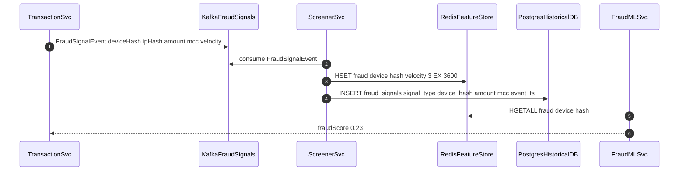

# Fraud Signal Collection

Status: Draft | Last Reviewed: 2026-05-16 | Owner: @risk-management-domain-owner
Catalog ID: SEC-009 | Radii
Tier Applicability: T0, T1

## Problem Statement

- Fraud ML models starve without sufficient behavioural signals; signals scattered across login, payment, and session services make cross-service velocity correlation impossible without a unified ingestion layer.
- Raw PII signals (device ID, IP address) create data retention compliance risk under Decree 13/2023; processing raw signals without masking treats behavioural data as personal data requiring explicit consent and a defined retention period.
- Signal ingestion latency exceeding 1 second degrades real-time fraud scoring accuracy — a stale feature store produces scores based on hour-old velocity data, missing rapid card-testing attacks where dozens of low-value probes occur within minutes.
- Absence of a standardised `FraudSignalEvent` schema forces each consuming service to implement its own signal parsing, leading to inconsistent feature definitions and divergent ML model inputs across fraud scoring, dispute management, and AML.

## Context

Fraud screening at Techcombank operates at the intersection of real-time payment authorisation (T0 critical path, less than 200 ms budget) and regulatory data governance (Decree 13/2023 treats behavioural and device data as personal data requiring consent and defined retention periods). The fraud signal collection layer satisfies both: low-latency ingestion with PII masking at the boundary, durable storage partitioned for regulatory retention enforcement (OPA policy), and a feature store serving both real-time scoring (Redis, less than 5 ms) and historical model retraining (PostgreSQL, partitioned by date).

Reach for this pattern when:

- A payment or login service needs to publish behavioural signals to a centralised fraud scoring engine without the scoring engine becoming a synchronous dependency on the critical path.
- Cross-service velocity correlation is required (login attempts + payment probes from the same device hash within a 5-minute window).
- Decree 13/2023 compliance requires per-signal-type retention limits enforced automatically without manual DBA intervention.
- A new fraud detection model requires historical signal data for retraining that spans multiple microservices.

## Solution

A standardised `FraudSignalEvent` is published to Kafka topic `fraud.signals.raw`. The ScreenerService (Spring Kafka consumer) masks PII at ingest — replacing device ID and IP with HMAC-SHA256 hashes keyed from Vault — before writing enriched signals to a Redis feature store (for real-time velocity scoring) and a PostgreSQL date-partitioned table (for historical analysis). OPA policy enforces signal-type retention TTLs. The FraudMLService reads from Redis to produce a real-time fraud score returned to the originating transaction service.



## Implementation Guidelines

### 1. FraudSignalEvent schema and PII masking

Signal producers publish a typed event to Kafka. The ScreenerService enforces PII masking before any persistence — raw device ID and IP are never written to any store.

```java
public record FraudSignalEvent(
    String deviceHash,      // HMAC-SHA256(rawDeviceId, vaultKey)
    String ipHash,          // HMAC-SHA256(rawIp, vaultKey)
    BigDecimal amount,
    String mcc,
    int velocityCount,
    Instant eventTimestamp
) {}

@Component
public class DeviceFingerprinter {

    @Value("${fraud.device-hmac-key}")
    private String hmacKey;

    public String hash(String rawDeviceId) {
        try {
            Mac mac = Mac.getInstance("HmacSHA256");
            mac.init(new SecretKeySpec(
                hmacKey.getBytes(StandardCharsets.UTF_8), "HmacSHA256"));
            return Hex.encodeHexString(
                mac.doFinal(rawDeviceId.getBytes(StandardCharsets.UTF_8)));
        } catch (Exception e) {
            throw new IllegalStateException("Device fingerprinting failed", e);
        }
    }
}
```

### 2. ScreenerService — Kafka consumer with feature store writes

```java
@Service
@RequiredArgsConstructor
public class FraudSignalScreener {

    private final StringRedisTemplate redis;
    private final JdbcTemplate jdbc;
    private static final Duration VELOCITY_TTL = Duration.ofHours(1);

    @KafkaListener(topics = "fraud.signals.raw", groupId = "screener-svc",
                   containerFactory = "fraudSignalContainerFactory")
    public void onSignal(FraudSignalEvent event) {
        String key = "fraud:device:" + event.deviceHash();
        redis.opsForHash()
             .put(key, "velocity", String.valueOf(event.velocityCount()));
        redis.expire(key, VELOCITY_TTL);

        jdbc.update(
            "INSERT INTO fraud_signals (signal_type, device_hash, amount, mcc, event_ts)"
            + " VALUES (?,?,?,?,?)",
            "TRANSACTION", event.deviceHash(),
            event.amount(), event.mcc(), event.eventTimestamp()
        );
    }
}
```

### 3. OPA retention policy

```rego
package fraud.retention

import future.keywords.if

default allow_retain = false

allow_retain if {
    input.signal_type == "behavioral"
    age_days(input.event_ts) <= 90
}
allow_retain if {
    input.signal_type == "device"
    age_days(input.event_ts) <= 365
}
allow_retain if {
    input.signal_type == "account"
    age_days(input.event_ts) <= 2555
}
```

### 4. PostgreSQL table DDL

```sql
CREATE TABLE fraud_signals (
    id          BIGSERIAL,
    signal_type TEXT         NOT NULL,
    device_hash TEXT         NOT NULL,
    amount      NUMERIC(20,2),
    mcc         TEXT,
    event_ts    TIMESTAMPTZ  NOT NULL DEFAULT NOW()
) PARTITION BY RANGE (event_ts);

CREATE INDEX ON fraud_signals (device_hash, event_ts);
```

## When to Use

- Real-time fraud scoring pipelines where feature freshness must be less than 1 second (card-present and card-not-present authorisation).
- Multi-service behavioural correlation where login, payment, and session signals must be joined into a unified feature vector for scoring.
- Regulatory environments requiring per-signal-type retention enforcement — OPA policy makes retention rules auditable and independently testable.

## When Not to Use

- Batch-only fraud analytics with no real-time scoring requirement — a simpler daily ETL into a data warehouse avoids Kafka operational overhead without latency penalty.
- Single-service environments where all fraud signals originate from one service — intra-service feature computation avoids the Kafka hop entirely.
- Environments where Decree 13/2023 consent for behavioural profiling cannot yet be obtained — collect only non-personal-data signals (amount, MCC) until the consent framework is in place.

## Variants

| Variant | Use when | Trade-off |
|---------|----------|-----------|
| Kafka streaming with per-event Redis writes (this pattern) | Sub-second feature freshness; multi-service signal correlation; production scoring | Higher operational complexity; Kafka + Redis + PostgreSQL must all be highly available |
| Flink window aggregation | Features over 5 to 60 minute windows; higher throughput than per-event processing | Feature granularity limited to window boundaries; near-real-time rather than real-time |
| Batch daily feature computation | Historical model retraining only; no real-time scoring path | Zero latency benefit for fraud prevention; not suitable for card-testing attack detection |

## NFR Acceptance Criteria

```yaml
nfr_acceptance_criteria:
  id: SEC-009
  pattern: Fraud Signal Collection

  performance:
    - id: FSC-01
      statement: >
        Signal ingestion p99 latency (producer publish to Kafka acknowledged)
        MUST be at most 100 ms under 1000 events per second sustained load.
      measurement: >
        Load test at 1000 events per second; measure Kafka producer ack latency;
        assert p99 at most 100 ms.

    - id: FSC-02
      statement: >
        Feature store update p99 latency (Kafka consume to Redis write confirmed)
        MUST be at most 500 ms.
      measurement: >
        Consumer lag metric; assert end-to-end p99 at most 500 ms via Micrometer timer.

  availability:
    - id: FSC-03
      statement: >
        Kafka ingest availability MUST be 99.95% for T0/T1 signal producers.
        Redis Cluster MUST maintain 99.9% availability (3-node quorum).
      measurement: >
        Kill one Redis node; verify ingest continues via remaining nodes.
        Monitor Kafka broker uptime over 30-day window.

  resilience:
    - id: FSC-04
      statement: >
        On ScreenerSvc pod failure, Kafka consumer group must rebalance and resume
        processing within 30 s; no signal events must be lost (at-least-once delivery).
      measurement: >
        Chaos test: kill screener pod; assert no consumer lag accumulates beyond 30 s
        recovery window; assert event count in PostgreSQL matches Kafka offset.
```

## Compliance Mapping

| Ring | Regulation | Provision | How this pattern satisfies |
|------|-----------|-----------|---------------------------|
| Ring 0 | OWASP Top 10 | A02 Cryptographic Failures — protect sensitive data in transit and at rest | Device ID and IP replaced with HMAC-SHA256 hashes using Vault-managed HMAC key before any persistence; raw PII never reaches Redis, PostgreSQL, or any log. |
| Ring 1 | PCI-DSS v4.0 | Section 10.7 — fraud monitoring and anomaly detection event logging | All `FraudSignalEvent` records written to append-only PostgreSQL table with signal_type, device_hash, amount, and event_ts; OPA policy enforces 7-year account signal retention satisfying audit trail requirements. |
| Ring 2 | Decree 13/2023/ND-CP | Section 9 — behavioural and device data treated as personal data; consent and defined retention required ⚠️ (working summary — pending Legal review) | Device hash and behavioural features are derived from personal data; OPA TTLs (behavioural 90 days, device 365 days) align with proportionality principle; Legal review required to confirm consent mechanism and TTL adequacy satisfy section 9. |

## Cost / FinOps

- Kafka topic `fraud.signals.raw`: at 1000 events/s with 512-byte average payload approximately 0.5 MB/s; within a 3-broker MSK `kafka.m5.large` cluster. Retain topic 24 hours only — signals durably stored in PostgreSQL.
- Redis feature store: HSET per event at 1000 events/s = 1000 ops/s; `cache.r7g.large` handles this with headroom. Device hash keys with 1-hour TTL bound memory to active session count.
- PostgreSQL partitioned table: date-based partitioning enables cheap DROP PARTITION for TTL enforcement (no row-level DELETE). Storage: approximately 50 GB/year at 1000 events/s with compression.
- Nightly OPA retention enforcement job: compute cost negligible; avoids regulatory penalties for retaining behavioural data beyond consent period.

## Threat Model

- **Signal poisoning (Tampering)**: Attacker submits many low-risk transactions to shift the behavioural baseline, causing the fraud model to under-score subsequent fraudulent transactions. Mitigation: model retraining pipeline monitors feature distribution via Z-score; alert fires if any feature shifts more than 2 standard deviations within a 1-hour window, triggering manual model review before next promotion.
- **PII re-identification (Information Disclosure)**: HMAC-SHA256 hash of device ID may be reversible via dictionary attack if the HMAC key is static and the device ID space is small (e.g., IMEI numbers are 15 digits). Mitigation: HMAC key rotated quarterly via Vault; on rotation all stored device hashes are migrated to the new HMAC before the old key is retired; Vault access logged on every read.

## Operational Runbook Stub

**Alert: FraudSignalIngestionLagHigh** — fires when Kafka consumer group lag exceeds 5 s sustained for 2 minutes.

- **Alert `fraud_signal_ingestion_lag > 5s`** (Kafka consumer group lag): Steps: (1) `kubectl get pods -l app=screener-svc` — check pod count and restarts. (2) If lag growing, scale: `kubectl scale deploy screener-svc --replicas=6`. (3) If OOM: increase memory limit in Helm values. (4) If Kafka broker is bottleneck, rebalance partitions via Kafka admin.
- **Alert `feature_store_staleness > 60s`**: Steps: (1) Check Redis cluster connectivity: `redis-cli -h redis-cluster ping`. (2) If Redis unreachable, screener is failing silently — check pod logs. (3) If healthy, screener may be stuck on consumer rebalance — restart screener pods. (4) Escalate to on-call DBA if Redis Cluster shows a node failure.
- **Dashboards**: Grafana — `fraud-signal-collection`.
- **Full runbook**: `governance/runbooks/fraud-signal-collection.md`

## Test Strategy Stub

- **Unit**: `DeviceFingerprinterTest` — same input + same key produces same hash; different keys produce different hashes; null input throws `IllegalArgumentException`.
- **Unit**: `FraudSignalScreenerTest` — mock Redis and JDBC; verify HSET called with correct key pattern `fraud:device:{hash}`; verify expire called with 3600 s TTL; verify JDBC insert uses device_hash not raw device ID.
- **Integration**: Spring Boot Test with Testcontainers (Kafka + Redis + PostgreSQL) — publish 100 `FraudSignalEvent` records; assert all 100 rows in PostgreSQL; assert Redis keys exist with correct TTL; assert zero raw device IDs or raw IPs in any stored record (PII scan).
- **Compliance**: PII scan — produce 1000 events with known raw device IDs; scan PostgreSQL and Redis for any value matching raw IMEI format; assert zero matches. Kafka ACL test: attempt to consume `fraud.signals.raw` with an unauthorised service account; assert AuthorizationException.

## Related Patterns

- [REF-007 Fraud Screening Platform](../../reference-architectures/fraud-screening-platform.md) — reference architecture that uses this signal collection pattern as its ingestion layer
- [SEC-010 Attribute-Based Access Control](attribute-based-access-control.md) — governs which services may produce signals and which may consume the feature store
- [BSP-003 Sanction Screening Pipeline](../banking-solutions/sanction-screening-pipeline.md) — complementary real-time screening pattern sharing the same Kafka infrastructure

## References

- Kafka Consumer Groups and Offset Management (kafka.apache.org/documentation)
- Redis HSET and TTL management (redis.io/commands/hset)
- OPA Policy Language (Rego) (openpolicyagent.org/docs/latest/policy-language)
- Decree 13/2023/ND-CP — Personal Data Protection (vanban.chinhphu.vn)
- PCI-DSS v4.0 Section 10 — Audit Logging Requirements (pcisecuritystandards.org)
- Catalog reference: `governance/standards/enterprise-architecture-catalog.md`
- Research notes: `knowledge-base/_research-notes.md`

---

**Key Takeaway**: Use fraud signal collection when you need sub-second feature freshness for real-time fraud scoring across multiple microservices — the HMAC-SHA256 device hashing at ingestion boundary is the critical control that satisfies Decree 13/2023 PII compliance while preserving full behavioural signal utility for fraud ML models.
