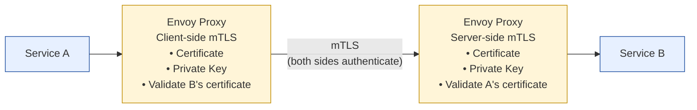

# mTLS via Service Mesh (Istio) Pattern

Status: Approved | Last Reviewed: 2026-02-20 | Owner: @ea-board
Catalog ID: SEC-001 | Radii
Tier Applicability: T0, T1, T2

## Problem Statement

Service-to-service communication lacks authentication:
- Cannot verify service identity (any process can call any service)
- Lateral movement attacks: compromised service talks to any other service
- No encryption of inter-pod traffic
- Manual certificate management is error-prone and labor-intensive
- Network policies only work at network layer, not application

## Solution

Implement mutual TLS (mTLS) via service mesh (Istio). Automatic certificate issuance, rotation, and enforcement at network boundary.



## Implementation Guidelines

1. **Install Istio**
   ```bash
   # Download and install Istio
   curl -L https://istio.io/downloadIstio | sh -
   cd istio-*
   export PATH=$PWD/bin:$PATH

   # Install Istio into cluster
   istioctl install --set profile=demo -y

   # Verify installation
   kubectl get pods -n istio-system

   # Enable sidecar auto-injection
   kubectl label namespace default istio-injection=enabled
   ```

2. **Enable mTLS**
   ```yaml
   # istio-mtls-config.yaml
   apiVersion: security.istio.io/v1beta1
   kind: PeerAuthentication
   metadata:
     name: default
     namespace: default
   spec:
     mtls:
       mode: STRICT  # Enforce mTLS for all traffic

   ---
   # Default allow all (Destination Rule)
   apiVersion: networking.istio.io/v1beta1
   kind: DestinationRule
   metadata:
     name: default
     namespace: default
   spec:
     host: "*.default.svc.cluster.local"
     trafficPolicy:
       tls:
         mode: ISTIO_MUTUAL  # Use Istio-managed certificates
   ```

3. **Service Deployment with Istio**
   ```yaml
   # order-service-deployment.yaml
   apiVersion: apps/v1
   kind: Deployment
   metadata:
     name: order-service
     namespace: default
   spec:
     selector:
       matchLabels:
         app: order-service
     replicas: 3
     template:
       metadata:
         labels:
           app: order-service
           version: v1
       spec:
         containers:
         - name: order-service
           image: registry.techcombank.com/order-service:1.0.0
           ports:
           - containerPort: 8080
             name: http
           env:
           - name: PAYMENT_SERVICE_URL
             value: "http://payment-service:8080"  # Internal DNS
           - name: INVENTORY_SERVICE_URL
             value: "http://inventory-service:8080"

   ---
   # Service definition
   apiVersion: v1
   kind: Service
   metadata:
     name: order-service
     namespace: default
     labels:
       app: order-service
   spec:
     ports:
     - port: 8080
       name: http
       protocol: TCP
     selector:
       app: order-service
   ```

4. **Network Policies (Authentication)**
   ```yaml
   # Allow Order Service to Payment Service
   apiVersion: security.istio.io/v1beta1
   kind: AuthorizationPolicy
   metadata:
     name: order-to-payment
     namespace: default
   spec:
     selector:
       matchLabels:
         app: payment-service
     action: ALLOW
     rules:
     - from:
       - source:
           principals: ["cluster.local/ns/default/sa/order-service"]
       to:
       - operation:
           methods: ["POST"]
           paths: ["/api/v1/payments/*"]

   ---
   # Deny all other traffic (default deny)
   apiVersion: security.istio.io/v1beta1
   kind: AuthorizationPolicy
   metadata:
     name: default-deny
     namespace: default
   spec:
     {} # Empty spec = deny all
   ```

5. **Certificate Rotation** (Automatic)
   ```yaml
   # Istio certificate rotation is automatic
   # Default: 90-day certificate lifetime
   # Rotation: every 24 hours starting at 80% of lifetime
   apiVersion: v1
   kind: ConfigMap
   metadata:
     name: istio
     namespace: istio-system
   data:
     mesh: |
       trustedMtlsCertDir: /etc/istio/certs
       # Certificate lifetime
       cert-chain-file: /etc/istio/certs/cert-chain.pem
       key-file: /etc/istio/certs/key.pem
       root-cert-file: /etc/istio/certs/root-cert.pem
   ```

6. **Monitoring & Debugging**
   ```bash
   # Check certificate details
   kubectl get secret istio.default -o jsonpath='{.data.cert-chain\.pem}' | \
     base64 -d | openssl x509 -text -noout

   # View mTLS status
   istioctl analyze -n default

   # Check if service is enforcing mTLS
   kubectl logs -l app=order-service -c istio-proxy

   # Test mTLS with debug container
   kubectl run -it debug \
     --image=nicolaka/netshoot:latest \
     -- bash

   # Inside debug container:
   # Test plain HTTP (should fail)
   curl -v http://payment-service:8080/health

   # Check certificates in sidecar
   kubectl exec payment-service-pod -c istio-proxy -- \
     ls -la /etc/istio/certs/
   ```

7. **Java Service Configuration** (automatic with Istio)
   ```java
   @RestController
   @RequestMapping("/api/v1")
   public class OrderController {

     @Autowired
     private RestTemplate restTemplate;

     @PostMapping("/orders")
     public ResponseEntity<Order> createOrder(@RequestBody CreateOrderRequest request) {
       // Call payment-service via mTLS (transparent to code)
       // Istio proxy handles TLS negotiation
       PaymentResult result = restTemplate.postForObject(
         "http://payment-service:8080/api/v1/payments",
         new PaymentRequest(request.getAmount()),
         PaymentResult.class
       );

       // Service continues with HTTP semantics
       // Istio sidecar proxy upgrades to TLS
       return ResponseEntity.ok(order);
     }
   }
   ```

## Certificate Flow

```
1. Pod starts
   ↓
2. Istio Webhook injects sidecar proxy (Envoy)
   ↓
3. Sidecar contacts Istio CA
   ↓
4. CA issues certificate (identity: namespace/service-account)
   ↓
5. Sidecar stores cert in /etc/istio/certs/
   ↓
6. Application makes HTTP request to another service
   ↓
7. Sidecar intercepts, upgrades to mTLS
   ↓
8. Target sidecar validates client certificate
   ↓
9. mTLS established
```

## Enforcing mTLS Modes

| Mode | Behavior |
|------|----------|
| **PERMISSIVE** | Accept both mTLS and plain HTTP (migration phase) |
| **STRICT** | Enforce mTLS, reject plain HTTP |
| **DISABLE** | No mTLS (not recommended for production) |

Migration strategy:
1. **Phase 1**: PERMISSIVE (supports old and new)
2. **Phase 2**: Monitor metrics, ensure all clients use mTLS
3. **Phase 3**: STRICT (enforce mTLS)

## Metrics & Monitoring

```bash
# View mTLS connections
kubectl logs -l app=order-service -c istio-proxy | grep -i tls

# Prometheus queries
# mTLS connections:
envoy_cluster_ssl_connections_total

# mTLS handshake failures:
envoy_cluster_ssl_handshake_failures_total

# Set up alerts
alert: mTLSHandshakeFailureRate
expr: rate(envoy_cluster_ssl_handshake_failures_total[5m]) > 0.01
for: 5m
```

## Common Issues

| Issue | Solution |
|-------|----------|
| "connection refused" | Verify AuthorizationPolicy allows traffic |
| "certificate expired" | Istio auto-rotates; check CA |
| "peer certificate cannot be authenticated" | Verify service identity in certificate |

## When to Use

- All Kubernetes clusters with microservices
- Regulatory requirements (PCI-DSS, SOC2)
- Zero-trust security model
- Service-to-service encryption required

## When NOT to Use

- Single monolithic service
- External traffic (use Istio Ingress Gateway + TLS)
- Non-Kubernetes environments (use alternative like Linkerd)

## Alternatives

| Tool | Use Case |
|------|----------|
| **Istio** | Full-featured service mesh (recommended) |
| **Linkerd** | Lightweight, Rust-based |
| **Consul** | HashiCorp ecosystem |

## References

- [Istio Security](https://istio.io/latest/docs/concepts/security/)
- [Istio Mutual TLS Authentication](https://istio.io/latest/docs/tasks/security/authentication/mtls-migration/)
- [mTLS Best Practices](https://www.cncf.io/blog/2019/05/16/securing-cloud-native-deployments-with-mutual-tls-mtls/)

---

**Key Takeaway**: Deploy Istio, enable STRICT mTLS mode, define AuthorizationPolicies for service-to-service access. Certificate management is automatic.
