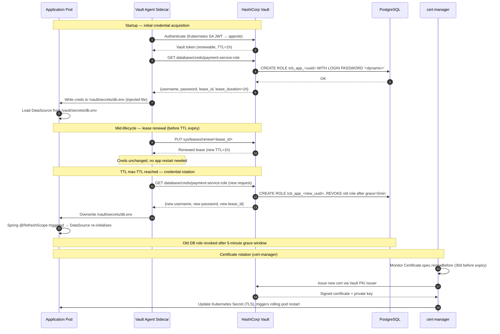

# Secrets Rotation

Status: Draft | Last Reviewed: 2026-05-09 | Owner: @ciso-delegate
Catalog ID: SEC-007 | Radii
Tier Applicability: T0, T1, T2

## Problem Statement

- Static, long-lived secrets (database passwords, API keys, signing keys, TLS certificates) accumulate operational entropy: they are copied into wikis, leaked into log files, embedded in git history, and re-used across environments, making the effective blast radius of any one leak unbounded.
- PCI-DSS requires demonstrable cryptographic key rotation on a defined schedule; without automated tooling, compliance evidence is manual, error-prone, and routinely fails audit.
- Secret rotation that requires a service restart or a deployment window conflicts with T0 payment-service availability requirements (99.99% SLO, 52-minute annual downtime budget); any rotation mechanism that is not zero-downtime is not acceptable for T0 services.
- Certificate expiry is a leading cause of P1 incidents industry-wide; without automated renewal (cert-manager) and rotation monitoring, Techcombank is exposed to mTLS handshake failures during high-value payment windows.

## Solution

HashiCorp Vault (primary) with dynamic credential generation for databases and short-TTL leases for all other secrets; cert-manager for Kubernetes TLS certificates; `@RefreshScope` beans in Spring Boot for zero-restart secret adoption.



## Implementation Guidelines

### 1. Vault Agent Sidecar — Kubernetes Deployment Annotation

```yaml
# payment-service-deployment.yaml (excerpt)
apiVersion: apps/v1
kind: Deployment
metadata:
  name: payment-service
  namespace: payments
spec:
  template:
    metadata:
      annotations:
        # Vault Agent injector annotations
        vault.hashicorp.com/agent-inject: "true"
        vault.hashicorp.com/role: "payment-service"
        vault.hashicorp.com/agent-inject-secret-db: "database/creds/payment-service-role"
        vault.hashicorp.com/agent-inject-template-db: |
          {{- with secret "database/creds/payment-service-role" -}}
          spring.datasource.username={{ .Data.username }}
          spring.datasource.password={{ .Data.password }}
          {{- end }}
        vault.hashicorp.com/agent-inject-secret-api-key: "secret/data/napas/api-key"
        vault.hashicorp.com/agent-inject-template-api-key: |
          {{- with secret "secret/data/napas/api-key" -}}
          napas.api.key={{ .Data.data.value }}
          {{- end }}
        # Trigger Spring @RefreshScope when secrets file changes
        vault.hashicorp.com/agent-inject-command-db: >
          wget -q -O- http://localhost:8080/actuator/refresh -X POST || true
        vault.hashicorp.com/secret-volume-path: /vault/secrets
    spec:
      serviceAccountName: payment-service-sa
      containers:
        - name: payment-service
          image: tcb/payment-service:latest
          envFrom:
            - configMapRef:
                name: payment-service-config
          volumeMounts:
            - name: vault-secrets
              mountPath: /vault/secrets
              readOnly: true
```

### 2. Spring Cloud Vault — DataSource with @RefreshScope

```java
/**
 * DataSource bean is @RefreshScope so that when the Vault agent overwrites
 * /vault/secrets/db.env and calls POST /actuator/refresh, Spring re-creates
 * the DataSource with the new credentials without restarting the JVM.
 *
 * HikariCP drains the existing connection pool gracefully (max 30 s) before
 * switching to the new credentials, achieving zero-downtime rotation.
 */
@Configuration
public class DataSourceConfig {

    @Bean
    @RefreshScope
    @ConfigurationProperties(prefix = "spring.datasource")
    public HikariDataSource dataSource(DataSourceProperties properties) {
        HikariDataSource ds = properties.initializeDataSourceBuilder()
                .type(HikariDataSource.class)
                .build();
        // Pool sizing for T0 payment service
        ds.setMaximumPoolSize(20);
        ds.setMinimumIdle(5);
        ds.setConnectionTimeout(3_000L);
        ds.setIdleTimeout(60_000L);
        ds.setMaxLifetime(600_000L);  // 10 min — must be less than Vault lease duration
        // Validate connection before borrow to detect rotated credentials early
        ds.setConnectionTestQuery("SELECT 1");
        return ds;
    }
}
```

```java
/**
 * External API key beans (NAPAS, AML provider) are @RefreshScope-aware.
 * When Vault agent refreshes the secret file, the bean is re-created with
 * the new API key on the next call — no restart required.
 */
@Component
@RefreshScope
@Slf4j
public class NapasApiKeyProvider {

    @Value("${napas.api.key}")
    private String apiKey;

    public String getApiKey() {
        return apiKey;
    }

    @EventListener(RefreshScopeRefreshedEvent.class)
    public void onRefresh(RefreshScopeRefreshedEvent event) {
        log.info("NAPAS API key refreshed via Vault rotation");
    }
}
```

### 3. Vault Database Engine — Role Configuration (HCL)

```hcl
# Vault policy: payment-service can only read its own DB credentials
path "database/creds/payment-service-role" {
  capabilities = ["read"]
}

path "secret/data/napas/*" {
  capabilities = ["read"]
}

# Deny access to other services' credentials
path "database/creds/+" {
  capabilities = ["deny"]
}
```

```hcl
# Database secret engine role
resource "vault_database_secret_backend_role" "payment_service" {
  backend = "database"
  name    = "payment-service-role"
  db_name = "payment-postgres"

  creation_statements = [
    "CREATE ROLE \"{{name}}\" WITH LOGIN PASSWORD '{{password}}' VALID UNTIL '{{expiration}}';",
    "GRANT SELECT, INSERT, UPDATE, DELETE ON ALL TABLES IN SCHEMA payment TO \"{{name}}\";",
    "GRANT USAGE, SELECT ON ALL SEQUENCES IN SCHEMA payment TO \"{{name}}\";"
  ]

  revocation_statements = [
    "REASSIGN OWNED BY \"{{name}}\" TO payment_owner;",
    "DROP OWNED BY \"{{name}}\";",
    "DROP ROLE IF EXISTS \"{{name}}\";"
  ]

  default_ttl = "1h"
  max_ttl     = "24h"
}
```

### 4. cert-manager — Automatic TLS Certificate Rotation

```yaml
# certificate.yaml — mutual TLS cert for payment-service
apiVersion: cert-manager.io/v1
kind: Certificate
metadata:
  name: payment-service-tls
  namespace: payments
spec:
  secretName: payment-service-tls-secret
  duration: 8760h       # 1 year
  renewBefore: 720h     # Renew 30 days before expiry
  issuerRef:
    name: vault-issuer
    kind: ClusterIssuer
  commonName: payment-service.payments.svc.cluster.local
  dnsNames:
    - payment-service.payments.svc.cluster.local
    - payment-service.techcombank.internal
  privateKey:
    algorithm: RSA
    size: 4096
    rotationPolicy: Always  # Generate new private key on each renewal
```

### 5. Emergency Rotation — Break-Glass Procedure

```java
/**
 * Emergency rotation endpoint: triggered by the CISO delegate or SRE lead
 * during a suspected credential compromise. Requires the BREAK_GLASS Vault policy.
 * Revokes ALL active leases for the service immediately (no grace window).
 */
@RestController
@RequiredArgsConstructor
@Slf4j
@PreAuthorize("hasRole('BREAK_GLASS')")
public class EmergencyRotationController {

    private final VaultTemplate vaultTemplate;
    private final ApplicationEventPublisher eventPublisher;

    @PostMapping("/internal/admin/emergency-rotation")
    public ResponseEntity<EmergencyRotationResponse> triggerEmergencyRotation(
            @RequestHeader("X-Correlation-Id") String correlationId,
            @RequestBody EmergencyRotationRequest request) {

        log.error("EMERGENCY ROTATION triggered correlationId={} initiator={} reason={}",
                correlationId, request.getInitiator(), request.getReason());

        // 1. Revoke all current database leases immediately
        vaultTemplate.write("sys/leases/revoke-prefix/database/creds/payment-service-role",
                Collections.emptyMap());

        // 2. Publish rotation event to force immediate @RefreshScope refresh
        eventPublisher.publishEvent(new EmergencyRotationEvent(this, correlationId));

        // 3. Audit log to immutable store
        auditService.recordEmergencyRotation(correlationId,
                request.getInitiator(), request.getReason());

        return ResponseEntity.ok(EmergencyRotationResponse.builder()
                .correlationId(correlationId)
                .status("ROTATION_INITIATED")
                .message("All database leases revoked. New credentials will be issued within 30s.")
                .build());
    }
}
```

### 6. Rotation Schedule Summary (application.yml)

```yaml
# Secret rotation schedule — informational; enforced by Vault TTL and cert-manager
secrets:
  rotation:
    database:
      default-ttl: 1h
      max-ttl: 24h
      mechanism: vault-dynamic
    api-keys:
      rotation-frequency: 90d
      mechanism: vault-kv-versioned
    jwt-signing-keys:
      rotation-frequency: 90d
      mechanism: vault-pki
      grace-window: 30m       # Old key stays in JWKS for 30 min after rotation
    tls-certificates:
      duration: 1y
      renew-before: 30d
      mechanism: cert-manager-vault
    encryption-keys-pci:
      rotation-frequency: 1y  # PCI-DSS §3.6 minimum; internal policy = 1y
      mechanism: vault-transit
```

## Compliance Mapping

| Ring | Regulation | Provision | How this pattern satisfies |
|------|-----------|-----------|---------------------------|
| Ring 0 | NIST SP 800-57 Part 1 | Key Management Lifecycle — generation, distribution, storage, use, revocation, destruction | Vault dynamic secrets implement the full lifecycle: generation (DB engine), use (application), revocation (TTL expiry), destruction (DROP ROLE). Vault Transit handles encryption key lifecycle. |
| Ring 0 | ISO 27001 | A.10.1.2 Key Management | Centralised Vault with HSM backend provides the key management system required by ISO 27001; rotation schedule is documented and automated. |
| Ring 1 | PCI-DSS v4.0 | Req 3.5 — Protect primary account numbers; Req 3.6 — Key management procedures; Req 3.7 — Protect cryptographic keys | Database passwords and API keys never stored in plaintext; rotation schedule enforced by Vault TTL; PCI-scoped encryption keys use Vault Transit with HSM backend (paired with SEC-004). |
| Ring 1 | BCBS 230 | Principle 7 (ICT Security) | Automated, zero-downtime rotation reduces the window of exposure for any compromised credential; emergency rotation enables rapid response to a suspected breach. |
| Ring 2 | SBV Circular 09/2020 | §III Cryptographic controls — key generation, storage, use, and destruction ⚠️ (working summary — pending Legal review) | Vault's HSM-backed key management satisfies the circular's cryptographic control requirements; rotation schedule and audit log meet the evidence requirements. |

## NFR Acceptance Criteria

```yaml
nfr_acceptance_criteria:
  id: SEC-007
  pattern: Secrets Rotation

  availability:
    - id: RA-01
      statement: >
        Database credential rotation (Vault dynamic secrets, max-TTL reached)
        MUST complete without dropping any in-flight database connections and
        without returning an HTTP error to any client of the payment service.
      measurement: Run 500 rps sustained load against the payment service;
        trigger a manual credential rotation; assert zero HTTP 5xx errors
        and zero HikariCP connection acquisition timeouts during the rotation window.
    - id: RA-02
      statement: >
        If Vault is unreachable, the application MUST continue to operate using
        cached credentials until the credential's max-TTL is reached.
      measurement: Bring Vault down; verify the application serves requests
        for at least 24 hours (max-TTL) using cached credentials; verify
        alert fires within 5 minutes of Vault becoming unreachable.

  security:
    - id: RS-01
      statement: >
        No database password, API key, or JWT signing key MUST appear in
        application logs, environment variables exposed via /actuator/env,
        or Kubernetes pod describe output.
      measurement: Deploy the service; check /actuator/env (requires auth);
        run `kubectl describe pod`; grep application logs for known secret patterns.
        All assertions must return no matches.
    - id: RS-02
      statement: >
        Emergency rotation MUST revoke all active database leases within 30 seconds
        of the API call and new credentials MUST be in use within 60 seconds.
      measurement: Trigger emergency rotation; measure time until old DB role
        is revoked in PostgreSQL (pg_roles query); measure time until application
        uses new credentials (log correlation).
    - id: RS-03
      statement: >
        TLS certificates MUST be renewed at least 30 days before expiry;
        no certificate used in production MUST have fewer than 7 days remaining.
      measurement: cert-manager Certificate resource status is monitored by
        Prometheus; alert fires when remaining validity < 30 days.
```

## Cost / FinOps

- HashiCorp Vault OSS covers all dynamic secret and PKI use cases required here; Vault Enterprise is only needed if Vault DR replication across regions is required (approximately USD 25 000/year for small cluster). Start with OSS on 3-node HA cluster on EKS; approximately USD 200/month in compute.
- cert-manager is open-source (Apache 2.0); zero licensing cost. Vault PKI issuer eliminates the need for a managed CA service (e.g., AWS ACM Private CA at USD 400/month).
- Dynamic database credentials eliminate the need to store passwords in parameter stores, config maps, or CI/CD secrets, reducing secret sprawl management overhead by an estimated 4–8 engineer-hours per quarter.
- Vault agent sidecar adds one container per pod (approximately 128 MB memory, 0.1 CPU); at 50 pods this is 6.4 GB extra memory — approximately USD 15/month additional EKS cost.
- Cost of NOT rotating: a single leaked long-lived DB password that grants access to the payment database carries an estimated remediation cost of USD 500 000–2 000 000 (breach investigation, customer notification under Decree 13/2023, SBV regulatory response, reputational impact). The entire Vault deployment pays for itself on the first prevented incident.

## Threat Model

STRIDE analysis — secrets rotation defends primarily against Information Disclosure and Elevation of Privilege:

- **Information Disclosure — Secret in git history**: A developer accidentally commits a database password to the application repository. Mitigation: Vault dynamic secrets mean no long-lived password exists to commit; the only secret stored in git is the Vault role name (not a credential). Pre-commit hooks (gitleaks) scan for secret patterns.
- **Information Disclosure — Secret in application log**: A misconfigured exception handler logs the DataSource connection string including the password. Mitigation: HikariCP never includes the password in toString(); Spring property masking hides `password` from /actuator/env; structured logging strips values matching secret patterns via a Logback filter.
- **Elevation of Privilege — Vault token theft**: An attacker steals the Vault agent token and uses it to request database credentials. Mitigation: Vault tokens are scoped to the minimum policy (only `database/creds/payment-service-role`); Kubernetes SA token authentication means the Vault token is tied to the pod's SA identity and automatically expires. Token TTL is 1 hour.
- **Elevation of Privilege — Dynamic credential reuse across environments**: A development credential is accidentally granted production-level permissions. Mitigation: Vault namespaces (or paths) are strictly separated by environment; production Vault is in a separate cluster with no network reachability from development.
- **Denial of Service — Rotation-induced connection storm**: All pods rotate credentials simultaneously, all connection pools drain at the same time, and PostgreSQL receives a spike in new connections. Mitigation: HikariCP's `maxLifetime` is set to less than the Vault lease duration, causing gradual pool drain rather than simultaneous eviction; cert-manager rolling restart staggers pod restarts.
- **Repudiation — Emergency rotation without audit trail**: A rogue operator triggers emergency rotation to cover tracks, revoking all credentials and claiming it was a false positive. Mitigation: all Vault operations are logged to Vault Audit log (append-only); emergency rotation endpoint writes to the immutable audit log with the initiator's identity; requires `BREAK_GLASS` role which is assigned only to CISO delegate and SRE lead.
- **Tampering — Vault secret modification**: An attacker with Vault write access modifies the NAPAS API key to a controlled value, enabling MITM on NAPAS calls. Mitigation: Vault policies grant `read` only to application roles; `write` to production secrets requires the `secret-admin` role with MFA step-up and is logged. Vault Enterprise Sentinel policies can enforce dual approval.

## Operational Runbook

1. **Scheduled rotation (normal)**: Vault agent renews leases automatically. No operator action is required. Monitor the `vault_agent_lease_renewal_success` metric in Grafana. If this metric drops to zero for any service, page the SRE on-call — the Vault agent may have lost its own token.

2. **Alert: `VaultUnreachable`** fires when the Vault agent cannot authenticate or renew its token for > 5 minutes. Check Vault cluster health (`vault status`). If Vault is degraded, the application continues with cached credentials until max-TTL. Priority: P1 for T0 services (max-TTL is 24h; action window is the lease duration remaining).

3. **Alert: `CertificateExpiryLow`** fires when any cert-manager Certificate has fewer than 30 days remaining. Check cert-manager logs (`kubectl logs -n cert-manager deployment/cert-manager`). Common cause: Vault PKI issuer is unreachable. Resolve Vault connectivity; cert-manager will automatically retry issuance.

4. **Emergency rotation procedure**: Confirm the security incident with the CISO delegate. Use the `BREAK_GLASS` credential (stored in a sealed physical envelope in the ops room) to call `POST /internal/admin/emergency-rotation` with the incident correlation ID and reason. Monitor the `payment.datasource.rotation.completed` metric (should appear within 60 s). Notify the NAPAS operations team if the NAPAS API key is rotated, as NAPAS may need to provision the new key on their side.

5. **Dual-secret window for NAPAS API key rotation**: When rotating the NAPAS API key, the new key must be provisioned on the NAPAS portal before the application switches. Procedure: (a) request a new key on the NAPAS partner portal (48-hour SLA); (b) store the new key in Vault at `secret/data/napas/api-key-new`; (c) update the application to try the new key on 401 from NAPAS, falling back to the old key; (d) once NAPAS confirms the new key is active, remove the old key.

6. **Post-rotation validation**: After any secret rotation, run the smoke test suite (`./scripts/smoke-test.sh`) against the production environment. The suite verifies database connectivity, NAPAS handshake, and JWT signing. All checks must pass within 2 minutes of rotation.

7. **PCI-DSS evidence collection**: Quarterly, export the Vault audit log for the PCI-scoped paths (`database/creds/*`, `pki/issue/*`, `transit/rotate/*`) and store in the compliance evidence repository. The audit log serves as the rotation schedule evidence for PCI-DSS Req 3.6.

8. **Certificate expiry monitoring**: A Prometheus alert watches cert-manager's `certmanager_certificate_expiration_timestamp_seconds` metric. Any certificate with fewer than 30 days remaining pages the SRE on-call. The on-call engineer checks cert-manager Certificate status (`kubectl get certificate -A`) and triggers manual renewal if auto-renewal has stalled.

## Test Strategy

### Unit Tests
- `NapasApiKeyProviderTest`: verify that `@RefreshScope` re-reads the `napas.api.key` property after a `RefreshScopeRefreshedEvent`; mock the property source to return an updated value.
- `EmergencyRotationControllerTest`: mock VaultTemplate; verify that `sys/leases/revoke-prefix/database/creds/payment-service-role` is called; verify audit log entry is created with the correct initiator and reason.
- `DataSourceConfigTest`: verify HikariCP `maxLifetime` (600 000 ms) is less than Vault `max-ttl` (86 400 000 ms), ensuring the pool naturally drains before the credential expires.

### Integration Tests
- Testcontainers (Vault dev mode + PostgreSQL): configure Vault database engine with the payment-service-role; start Spring Boot with Vault agent config; verify the application connects to PostgreSQL with the dynamic credential; trigger a refresh; verify the new credential is used.
- Zero-downtime rotation: run 200 rps against a test endpoint backed by PostgreSQL; trigger a Vault credential rotation; assert no HTTP 5xx errors during the rotation window.
- cert-manager integration: use cmctl to trigger a manual certificate renewal; verify the Kubernetes Secret is updated and the pod picks up the new certificate on next TLS handshake.

### Compliance Tests
- Secret exposure scan: deploy the service in a test cluster; call `/actuator/env`, `/actuator/configprops`; scrape application logs for 5 minutes; assert no database password, NAPAS API key, or JWT private key pattern appears.
- PCI-DSS rotation evidence: in the staging environment, force a Vault max-TTL expiry; verify the Vault audit log records credential revocation and creation; export the log and assert it satisfies the PCI-DSS audit evidence format.

### Chaos Tests
- Vault network partition: block network traffic from the application pod to Vault; verify the application continues to serve requests using cached credentials for 1 hour (default TTL); verify alert fires within 5 minutes.
- Simultaneous rotation + load: trigger emergency rotation while driving 500 rps; verify zero connection pool acquisition timeouts and zero HTTP 5xx responses during the rotation.

## References

- [HashiCorp Vault Database Secrets Engine](https://developer.hashicorp.com/vault/docs/secrets/databases)
- [HashiCorp Vault Agent Injector](https://developer.hashicorp.com/vault/docs/platform/k8s/injector)
- [Spring Cloud Vault documentation](https://docs.spring.io/spring-cloud-vault/docs/current/reference/html/)
- [cert-manager documentation](https://cert-manager.io/docs/)
- [NIST SP 800-57 Part 1 — Recommendation for Key Management](https://csrc.nist.gov/publications/detail/sp/800-57-part-1/rev-5/final)
- [PCI-DSS v4.0 Requirements 3.5–3.7](https://www.pcisecuritystandards.org/document_library/)
- [SEC-003 Vault Secret Management](vault-secret-management.md)
- [SEC-004 Tokenization + HSM](tokenization-hsm.md)
- [SEC-006 JWT Best Practices](jwt-best-practices.md)

---

**Key Takeaway**: Automated secret rotation via Vault dynamic credentials and cert-manager eliminates the blast radius of any individual credential leak by ensuring secrets are short-lived, never static, and adopted by running services without a restart — turning rotation from a compliance checkbox into a continuous security control.
