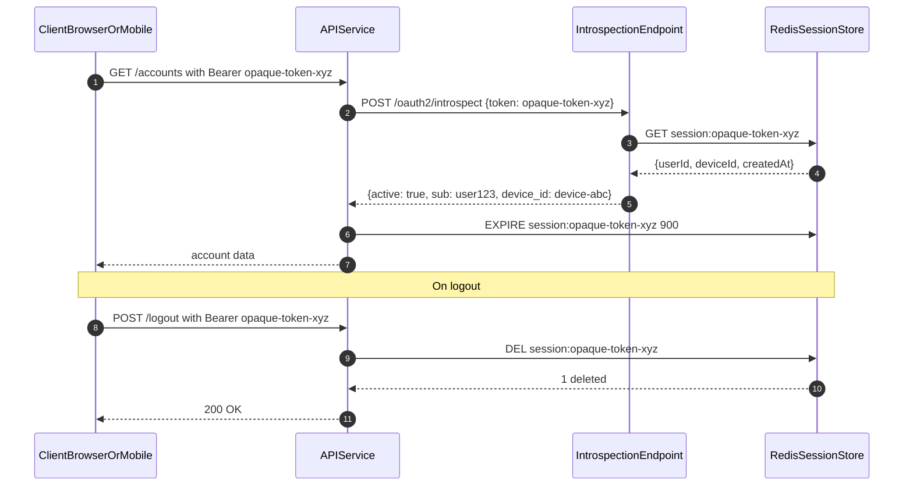

# Session Revocation

Status: Draft | Last Reviewed: 2026-05-16 | Owner: @ciso-delegate
Catalog ID: SEC-011 | Radii
Tier Applicability: T0, T1, T2

## Problem Statement

- JWT access tokens remain cryptographically valid until natural expiry even after user logout; a stolen token cannot be invalidated without an explicit blocklist or token introspection infrastructure — making pure JWT logout security theatre.
- Mobile devices sharing a user account cannot have individual sessions revoked on device theft when the authentication system issues a single long-lived JWT — all sessions share the same token and cannot be individually targeted.
- PCI-DSS section 8.2.6 requires session timeout after 15 minutes of inactivity for CDE access; JWT exp-based expiry cannot implement sliding (activity-refreshed) timeouts without re-issuing tokens on every request.
- SBV Circular 09/2020 section III.2 requires session management controls enabling forced server-side logout — a capability structurally absent from stateless JWT authentication.

## Context

Session revocation is the complement to JWT issuance (SEC-006). Pure JWT authentication optimises for statelessness and horizontal scaling but sacrifices revocability. The opaque reference token pattern trades a small introspection overhead (one Redis round-trip per API call, p99 at most 5 ms) for immediate revocation capability. This trade-off is correct for banking: the cost of a stolen session token that cannot be revoked (fraudulent transaction execution) vastly exceeds the cost of one Redis lookup per request.

Reach for this pattern when:

- Logout-critical flows where session invalidation must be effective within one API call (banking, payment authorisation, high-security admin panels).
- Multi-device user accounts where individual device sessions must be independently revocable (e.g., "log out all other devices" on mobile banking).
- PCI-DSS CDE access where the 15-minute sliding inactivity timeout cannot be satisfied by JWT exp-based expiry alone.

## Solution

Opaque reference tokens (UUIDs) are issued at login and stored in Redis (`SET session:{token_id} {session_json} EX 900`). An introspection endpoint (`POST /oauth2/introspect`) validates token existence in Redis. Logout deletes the Redis key immediately — effective revocation in less than 1 ms. Device binding: each token stores a `deviceId` claim; introspection validates `X-Device-ID` header match, enabling per-device revocation. Idle timeout: Redis TTL is reset to 900 s on every successful API call (`EXPIRE session:{id} 900`), satisfying PCI-DSS section 8.2.6 sliding inactivity timeout.



## Implementation Guidelines

### 1. SessionStore — Redis-backed session management

The SessionStore wraps all Redis operations — create, introspect, revoke, refresh TTL. The TTL is reset on every successful introspection call, implementing the sliding inactivity timeout required by PCI-DSS section 8.2.6.

```java
@Service
@RequiredArgsConstructor
public class SessionStore {

    private final StringRedisTemplate redis;
    private static final Duration SESSION_TTL = Duration.ofSeconds(900);
    private static final String PREFIX = "session:";

    public String createSession(String userId, String deviceId) {
        String tokenId = UUID.randomUUID().toString();
        SessionData session = new SessionData(userId, deviceId, Instant.now());
        redis.opsForValue().set(
            PREFIX + tokenId, JsonUtil.serialize(session), SESSION_TTL);
        return tokenId;
    }

    public Optional<SessionData> introspect(String tokenId) {
        String raw = redis.opsForValue().get(PREFIX + tokenId);
        return Optional.ofNullable(raw).map(JsonUtil::deserialize);
    }

    public void revoke(String tokenId) {
        redis.delete(PREFIX + tokenId);
    }

    public void refreshTtl(String tokenId) {
        redis.expire(PREFIX + tokenId, SESSION_TTL);
    }
}
```

### 2. RedisOpaqueTokenIntrospector — Spring Security SPI

The `RedisOpaqueTokenIntrospector` implements the Spring Security `OpaqueTokenIntrospector` SPI. On every API request, it looks up the token in Redis and resets the TTL (sliding window). A missing token throws `OAuth2IntrospectionException`, which Spring Security maps to HTTP 401.

```java
@Component
@RequiredArgsConstructor
public class RedisOpaqueTokenIntrospector implements OpaqueTokenIntrospector {

    private final SessionStore sessionStore;

    @Override
    public OAuth2AuthenticatedPrincipal introspect(String token) {
        SessionData session = sessionStore.introspect(token)
            .orElseThrow(() ->
                new OAuth2IntrospectionException("Token not found or expired"));
        sessionStore.refreshTtl(token);
        Map<String, Object> attrs = Map.of(
            OAuth2TokenIntrospectionClaimNames.SUB, session.userId(),
            "device_id", session.deviceId(),
            OAuth2TokenIntrospectionClaimNames.ACTIVE, true
        );
        return new DefaultOAuth2AuthenticatedPrincipal(
            session.userId(), attrs, List.of());
    }
}

@Bean
SecurityFilterChain resourceServer(HttpSecurity http,
        RedisOpaqueTokenIntrospector introspector) throws Exception {
    return http
        .authorizeHttpRequests(a -> a.anyRequest().authenticated())
        .oauth2ResourceServer(o -> o
            .opaqueToken(t -> t.introspector(introspector)))
        .build();
}
```

### 3. Logout endpoint

```java
@RestController
@RequiredArgsConstructor
public class SessionController {

    private final SessionStore sessionStore;

    @PostMapping("/logout")
    public ResponseEntity<Void> logout(
            @RequestHeader("Authorization") String bearer) {
        String tokenId = bearer.replace("Bearer ", "").strip();
        sessionStore.revoke(tokenId);
        return ResponseEntity.ok().build();
    }
}
```

## When to Use

- Logout-critical flows where session invalidation must be effective within one API call (banking, payment authorisation, high-security admin panels).
- Multi-device user accounts where individual device sessions must be independently revocable (e.g., "log out all other devices" on mobile banking).
- PCI-DSS CDE access where the 15-minute sliding inactivity timeout cannot be satisfied by JWT exp-based expiry alone.

## When Not to Use

- Public stateless read-only APIs where session revocation is not a security requirement — JWT with short TTL (15 min) is simpler and avoids the Redis round-trip.
- High-throughput service-to-service calls within a zero-trust mTLS mesh — mTLS provides authentication; opaque token introspection adds unnecessary latency.
- Environments without a highly available Redis Cluster — introspection becomes a SPOF; do not use this pattern without Redis Cluster with at least 3 nodes.

## Variants

| Variant | Use when | Trade-off |
|---------|----------|-----------|
| Opaque token + Redis introspection (this pattern) | Immediate revocation required; PCI-DSS CDE sessions; multi-device session management | One Redis round-trip per API call; Redis is a hard dependency |
| JWT with JTI denylist (SEC-006) | JWT-native stack; revocation needed only for logout and suspicious activity | Denylist check is best-effort if Redis is unavailable; window of exposure equals token TTL on Redis outage |
| OAuth2 Token Introspection RFC 7662 | Federation with external OAuth2 AS; standardised introspection across multiple resource servers | Standard protocol overhead; adds network hop to external AS |

## NFR Acceptance Criteria

```yaml
nfr_acceptance_criteria:
  id: SEC-011
  pattern: Session Revocation

  performance:
    - id: SRV-01
      statement: >
        Redis GET introspection round-trip p99 MUST be at most 5 ms in-cluster.
      measurement: >
        Load test at 1000 rps; measure Intro to Redis to response duration; assert p99 at most 5 ms.

  security:
    - id: SRV-02
      statement: >
        After logout, the next API call with the same token MUST return HTTP 401.
        Revocation MUST be effective within less than 1 API request.
      measurement: >
        Integration test: POST /logout; immediately call protected endpoint; assert 401.

    - id: SRV-03
      statement: >
        Idle timeout: a session with no API activity for 15 minutes MUST be expired.
      measurement: >
        Create session; wait 15 min without API calls; call protected endpoint; assert 401.

  availability:
    - id: SRV-04
      statement: >
        Redis Cluster MUST maintain 99.95% availability (3-node quorum).
        Session data MUST survive a single-node Redis failure.
      measurement: >
        Kill one Redis node; verify introspection continues for existing sessions.
```

## Compliance Mapping

| Ring | Regulation | Provision | How this pattern satisfies |
|------|-----------|-----------|---------------------------|
| Ring 0 | OWASP ASVS | V3.3 — Session Termination: logout MUST invalidate server-side session state | `sessionStore.revoke(tokenId)` deletes the Redis key; subsequent introspection throws `OAuth2IntrospectionException` and returns HTTP 401 — server-side state definitively terminated. |
| Ring 1 | PCI-DSS v4.0 | Section 8.2.6 — idle timeout of 15 minutes for CDE interactive sessions | Redis TTL reset to 900 s on every API call via `refreshTtl`; if no call made for 15 minutes, key expires and next request returns 401. |
| Ring 2 | SBV Circular 09/2020 | Section III.2 — session management requirements for internet banking systems (working summary — pending Legal review) | Server-side session store enables forced logout on device theft; device binding enables per-device revocation; Legal review required to confirm 15-minute idle timeout and forced-logout capability satisfy SBV section III.2. |

## Cost / FinOps

- Redis Cluster (3 nodes, `cache.r7g.large`): shared with JTI denylist (SEC-006) and rate limiter. Marginal cost: 1 SET (login) + 1 GET + 1 EXPIRE (per API call) + 1 DEL (logout). At 1000 active sessions x 10 calls/minute = 20000 Redis ops/minute — negligible.
- Session memory: approximately 200 bytes serialised per session; 50000 concurrent sessions = 10 MB Redis memory — trivial on `cache.r7g.large` (12.93 GiB).
- Cost of NOT using this pattern: a stolen JWT with 60-minute TTL is valid for the full TTL regardless of user action. At VND 100M per-transfer limit, a single session window represents significant fraud exposure — the Redis cost is orders of magnitude less.

## Threat Model

- **Redis token store compromise (Information Disclosure)**: Attacker with Redis access reads all active session tokens, enabling impersonation. Mitigation: Redis AUTH enforced; TLS in transit; session tokens stored as HMAC-SHA256 hashes of the raw UUID — raw UUID never stored in Redis.
- **Introspection endpoint DDoS (Denial of Service)**: High-volume requests to `/oauth2/introspect` saturate the endpoint, degrading all API authentication. Mitigation: Resilience4j rate limiter on introspection endpoint (1000 rps per client IP); Redis Cluster provides horizontal read scaling; introspection endpoint scales independently via HPA.

## Operational Runbook Stub

**Alert: SessionIntrospectionLatencyHigh** — fires when session introspection p99 exceeds 50 ms sustained for 2 minutes.

- **Alert `session_introspection_p99 > 50ms`**: Steps: (1) Check Redis latency: `redis-cli --latency-history -h redis-cluster`. (2) If `used_memory` near `maxmemory`, eviction is occurring — increase `maxmemory` or reduce session TTL. (3) Scale introspection endpoint pods via HPA. (4) If Redis failover in progress, latency spike is transient — monitor for recovery within 30 s.
- **Alert `mass_session_revocation > 1000/min`**: Steps: (1) Confirm if scheduled forced re-auth or anomalous. (2) If anomalous, check login service for credential stuffing. (3) Trigger ABAC step-up authentication for all active accounts via OPA bundle update. (4) Notify security team.
- **Dashboards**: Grafana — `session-revocation`.
- **Full runbook**: `governance/runbooks/session-revocation.md`

## Test Strategy Stub

- **Unit**: `SessionStoreTest` — create then introspect asserts userId/deviceId match. Create then revoke then introspect asserts `Optional.empty()`. `refreshTtl` calls `expire` with 900 s (mock `StringRedisTemplate`).
- **Unit**: `RedisOpaqueTokenIntrospectorTest` — valid token returns `OAuth2AuthenticatedPrincipal` with correct `sub`. Missing token throws `OAuth2IntrospectionException`.
- **Integration**: Testcontainers (Redis) — login then call protected asserts 200. Logout then call same token asserts 401. Idle timeout: TTL override to 2 s; wait 3 s; call asserts 401.
- **Integration**: Device binding — create session for `device-A`; call with `X-Device-ID: device-B`; assert 401.
- **Compliance**: PCI-DSS section 8.2.6 — TTL set to 900 s; make one request; advance mock clock 900 s; next request asserts 401. Token entropy: generate 10000 session tokens; assert all valid UUIDs (128-bit entropy); assert zero duplicates.

## Related Patterns

- [SEC-006 JWT Best Practices](jwt-best-practices.md) — JWT alternative with JTI denylist for lower-overhead revocation
- [MOB-003 Mobile Biometric Auth](../mobile/mobile-biometric-auth.md) — mobile authentication that issues opaque tokens managed by this pattern
- [SEC-010 Attribute-Based Access Control](attribute-based-access-control.md) — policy-based access control evaluated on each introspection call

## References

- RFC 7662 — OAuth 2.0 Token Introspection (rfc-editor.org/rfc/rfc7662)
- PCI-DSS v4.0 Section 8 — Identify Users and Authenticate Access (pcisecuritystandards.org/document_library)
- Spring Security Opaque Token Introspection (docs.spring.io/spring-security/reference/servlet/oauth2/resource-server/opaque-tokens.html)
- Redis EXPIRE command (redis.io/commands/expire)
- OWASP ASVS V3.3 — Session Termination (owasp.org/www-project-application-security-verification-standard)
- Catalog reference: `governance/standards/enterprise-architecture-catalog.md`
- Research notes: `knowledge-base/_research-notes.md`

---

**Key Takeaway**: Use opaque reference tokens with Redis introspection when banking sessions require immediate revocation on logout or device theft — the one Redis round-trip per request is the minimal cost for a revocation capability that JWT alone structurally cannot provide.
