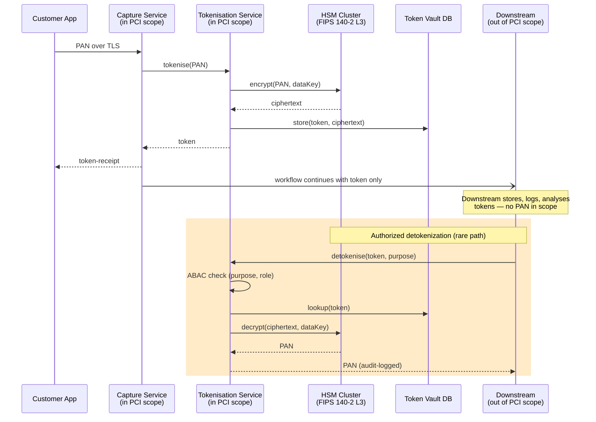

# Tokenization + HSM Key Management

Status: Draft | Last Reviewed: 2026-05-09 | Owner: @ciso-delegate
Catalog ID: SEC-004 | Radii
Tier Applicability: T0 (card flows mandatory), T1 (PII flows recommended)

## Problem Statement

Storing card PANs, national-ID numbers, or other sensitive identifiers anywhere outside a hardened vault triggers PCI-DSS scope expansion across the entire data path — every system that touches the data must be PCI-audited, every backup is in scope, every log must be sanitised. Tokenisation replaces sensitive values with non-sensitive surrogates (tokens) while keeping the original safely in an HSM-backed vault. Downstream systems handle tokens; only authorised callers in PCI scope can detokenise. This pattern is the foundation of Techcombank's PCI-DSS §3 posture.

## Context

Reach for this pattern when:

- Storing or transmitting card PANs anywhere outside the auth gateway and the HSM vault.
- Persisting Vietnamese national IDs (CCCD/CMND) per [Decree 13/2023 personal-data minimisation](../../compliance/decree-13-2023-personal-data.md).
- Sharing data with analytics, fraud-screening, or third-party services without exposing the raw value.
- Designing a new flow where PCI / PII data passes through ≥ 3 services.

## Solution



### Token types

| Type | Format | Reversibility | Use |
| --- | --- | --- | --- |
| **Random opaque** | UUID-shaped | Reversible via vault | Default for storage |
| **Format-preserving** (FPE; see [SEC-013](pii-tokenization-format-preserving.md)) | Same shape as plaintext | Reversible via HSM | Legacy systems requiring fixed-format input (T24 OFS) |
| **Deterministic HMAC** | Fixed-length hash | Not reversible (one-way) | Joinable analytics; no detok possible |

### Token vault schema

```sql
CREATE TABLE token_vault (
    token         VARCHAR(64)  PRIMARY KEY,    -- UUID v4
    ciphertext    BYTEA        NOT NULL,
    data_key_id   VARCHAR(64)  NOT NULL,       -- which HSM key encrypted it (envelope encryption)
    classification VARCHAR(16) NOT NULL CHECK (classification IN ('PAN','CCCD','PHONE','EMAIL','OTHER')),
    created_at    TIMESTAMPTZ  NOT NULL DEFAULT now(),
    last_accessed TIMESTAMPTZ,
    access_count  BIGINT       NOT NULL DEFAULT 0
);
CREATE INDEX token_vault_classification ON token_vault (classification);
```

Vault DB is itself in PCI scope — encrypted at rest, access logged, replicated cross-region.

## Implementation Guidelines

### Java / Spring — TokenisationService client

```java
public interface TokenisationService {
    /** Tokenise a sensitive value. Returns an opaque token. */
    String tokenise(String plaintext, DataClassification cls);

    /** Detokenise — requires elevated permission and audit purpose. */
    String detokenise(String token, DetokenisationPurpose purpose);
}

@Service
@RequiredArgsConstructor
public class HsmTokenisationService implements TokenisationService {

    private final HsmClient hsm;        // AWS CloudHSM or Thales Luna SDK
    private final TokenVaultRepository vault;
    private final AbacService abac;
    private final AuditLogger audit;

    @Override
    public String tokenise(String plaintext, DataClassification cls) {
        String dataKeyId = hsm.currentDataKeyId(cls);
        byte[] ciphertext = hsm.encrypt(dataKeyId, plaintext.getBytes(UTF_8));
        String token = UUID.randomUUID().toString();
        vault.save(new TokenRecord(token, ciphertext, dataKeyId, cls));
        return token;
    }

    @Override
    public String detokenise(String token, DetokenisationPurpose purpose) {
        abac.requireDetokenisationPermission(currentPrincipal(), token, purpose);
        audit.logDetokenisation(currentPrincipal(), token, purpose);

        TokenRecord record = vault.findById(token).orElseThrow();
        byte[] plaintext = hsm.decrypt(record.dataKeyId(), record.ciphertext());
        record.recordAccess();
        vault.save(record);
        return new String(plaintext, UTF_8);
    }
}
```

### Spring AOP — auto-tokenise marked fields

```java
@Target(ElementType.FIELD)
@Retention(RetentionPolicy.RUNTIME)
public @interface Tokenisable {
    DataClassification value();
}

class CustomerOnboardRequest {
    @Tokenisable(DataClassification.CCCD)
    private String nationalId;
    // ...
}

@Aspect
@Component
public class TokenisationAspect {
    private final TokenisationService tok;

    @Before("execution(* save(..)) && args(request,..)")
    public void tokeniseFields(Object request) {
        for (Field f : request.getClass().getDeclaredFields()) {
            Tokenisable ann = f.getAnnotation(Tokenisable.class);
            if (ann != null) {
                f.setAccessible(true);
                String original = (String) f.get(request);
                String token = tok.tokenise(original, ann.value());
                f.set(request, token);
            }
        }
    }
}
```

### HSM key management

| Aspect | Convention |
|---|---|
| HSM model | AWS CloudHSM (FIPS 140-2 Level 3) or Thales Luna Network HSM |
| Key hierarchy | Root → Class-Master → Data-Key (envelope encryption) |
| Rotation | Data-keys rotated quarterly; class-masters rotated annually; roots per HSM-vendor recommendation |
| Backup | HSM-native cluster backup (multiple HSM partitions in active-active) |
| Access | Application principals issued via mTLS client cert + IAM role; full audit trail |

### T24 / legacy integration

T24 stores tokens (not PANs) in any field mapped to a tokenisable column. The capture service tokenises before writing to T24 via the OFS bridge; downstream T24 reads return tokens. If a legitimate operational need requires PAN on a T24 screen (very rare), detokenise via SEC-004 with audited purpose `T24_OPERATIONAL_LOOKUP`.

For card-network communication (NAPAS, SWIFT, card schemes), the tokenisation boundary moves to the protocol gateway — the gateway holds the PAN briefly during the message exchange and tokenises before the response is logged.

### Frontend / Mobile

Clients never log PANs. iOS Apple Pay / Android Google Pay deliver network-level tokens (DPAN — Device Primary Account Number) — this is a different, vendor-managed tokenisation mechanism that *complements* SEC-004; both layers apply to card-on-file flows.

## Variants & Trade-offs

| Variant | When | Trade-off |
| --- | --- | --- |
| **Random opaque (default)** | Storage; pure obfuscation | Easy; not joinable for analytics |
| **Format-preserving (FPE; SEC-013)** | Legacy fixed-format inputs (T24, partner files) | More complex; specific NIST-approved modes only |
| **Deterministic HMAC** | Joinable analytics where reversal not needed | Fast; one-way only; collision risk if not properly salted |
| **Vendor-managed** (Apple Pay DPAN / Google Pay) | Card-on-file in mobile wallets | Complements SEC-004; doesn't replace it |

## NFR Acceptance Criteria

- **HA**: HSM cluster active-active across both regions; vault DB on Aurora Global with sync replication. Tokenisation service horizontally scaled per cell ([RES-005](../resilience/cell-based-architecture.md)).
- **HP**: tokenise / detokenise round-trip P95 ≤ 5 ms (HSM-side) + ≤ 5 ms (vault DB primary-key read). Total < 10 ms; sits within T0 budget per [NFR-002](../../nfr/latency-budget-model.md).
- **HR**: HSM cluster failure → tokenisation service refuses new requests (fail-secure); existing tokens still valid (vault is the resolution path). Recovery RTO < 5 min for HSM swap-in via Application Recovery Controller.

## Compliance Mapping

| Layer | Reference | Section/Control | How this satisfies |
|---|---|---|---|
| Ring 0 | NIST SP 800-57 Part 1 (Key Management) | Key lifecycle: generation, distribution, storage, destruction | HSM hierarchy + rotation procedure satisfies the lifecycle requirements |
| Ring 0 | NIST SP 800-38G (FF1, FF3-1 — for FPE variant) | Format-Preserving Encryption modes | When using SEC-013 variant, FF1 is the canonical mode |
| Ring 1 | PCI-DSS 4.0 §3.4 | "PAN must not be stored after authorisation unless masked or otherwise unreadable" | Tokens are non-readable; vault is in scope |
| Ring 1 | PCI-DSS 4.0 §3.5 | "Cryptographic keys protected against disclosure and misuse" | HSM at FIPS 140-2 L3 satisfies |
| Ring 1 | PCI-DSS 4.0 §3.6 | "Cryptographic keys managed throughout their lifecycle" | Quarterly data-key rotation, annual master rotation, audited key access |
| Ring 1 | PCI-DSS 4.0 §3.7 | "Key management policies and procedures formally defined" | Documented in this pattern + linked runbook |
| Ring 1 | GDPR Article 32 (security of processing) | Encryption recommended for personal data | Tokenisation is a "pseudonymisation" measure under GDPR |
| Ring 2 | Decree 13/2023 (UNOFFICIAL TRANSLATION) | Personal-data protection — biometric and sensitive data | National-ID (CCCD) tokenised end-to-end |
| Ring 2 | SBV Circular 09/2020 §III (UNOFFICIAL TRANSLATION pending Legal) | Cryptographic controls | HSM-based key management satisfies cryptographic-control expectations |

## Cost / FinOps Notes

| Item | Cost driver | Order of magnitude |
|---|---|---|
| HSM cluster | 2+ HSM partitions × monthly fee | ~$3,000–10,000/month per cluster (AWS CloudHSM or Thales) |
| Tokenisation service | Per-call CPU; horizontally scaled | Modest |
| Vault DB | Sync-replicated Aurora Global | ~$1,000/month for typical T0 footprint |
| Compliance audit | Annual PCI assessment | $$$ |

**Levers**:
- Use envelope encryption (data-key encrypted by class-master) so HSM does fewer crypto ops.
- Cache tokens client-side (within service, not across services) to avoid repeat detokenisation.
- Move detokenisation off the hot path — most flows operate on tokens end-to-end.

**Cost of NOT having SEC-004 for card flows**: PCI-DSS scope expansion to every system that touches the PAN — easily 10× the audit + compliance cost.

## Threat Model Summary

STRIDE: primarily **Information Disclosure**.

- **Top 3 threats addressed**:
  1. *Database breach* exposing tokens — useless without HSM access.
  2. *Insider read* of production data — sees tokens, not PANs.
  3. *PCI scope expansion* — bounded to capture / vault / detokenise services.
- **Top 3 residual threats**:
  1. *HSM compromise* — catastrophic; mitigation: FIPS 140-2 L3 hardware; multi-HSM; tamper alarms; HSM logs to immutable store.
  2. *Detokenisation abuse* by an authorised insider — mitigation: ABAC + audit logging + alerts on unusual detok rate per principal.
  3. *Token leakage via logs* — mitigation: structured logging with mandatory `LogMasker` (see [SEC-008 Data Masking](data-masking.md)); CI lint that flags any field named `pan` / `cardNumber` / `cccd` in log statements.

## Operational Runbook

- **Alerts**:
  - `HSM_PartitionDown`: any HSM partition unhealthy. Severity: Critical.
  - `Tokenisation_LatencyBudget`: P95 > 10 ms for > 5 min. Severity: High.
  - `Detokenisation_AnomalousRate`: a principal detokenises > 3× their baseline rate. Severity: High (possible insider abuse).
  - `Vault_ReplicationLag`: cross-region vault lag > 1 s. Severity: High.
- **Dashboards**: Grafana — `tokenisation-overview`, `hsm-health`, `detokenisation-audit-trail`.
- **Key rotation procedure**: documented in `governance/runbooks/hsm-key-rotation.md` (to be authored). Quarterly data-key rotation is a 30-minute procedure that does not require service downtime (envelope encryption + dual-key window).
- **Incident: suspected HSM compromise**: engage CISO immediately; rotate all data-keys via emergency procedure; quarantine the affected HSM partition; full forensic review.

## Test Strategy

- **Unit**: `TokenisationService` against an HSM mock; round-trip tokenise/detokenise; ABAC enforcement.
- **Integration**: Testcontainer with HSM emulator (SoftHSM); end-to-end tokenise → store → detokenise flow.
- **Performance**: load test 1000 tokenisations/sec; verify P95 within budget.
- **Chaos**: kill HSM partition; verify failover to alternate; verify fail-secure on full HSM cluster loss.
- **Audit**: annual PCI penetration test must include attempts to extract PANs from non-vault systems.

## When to Use

- **Mandatory** for any PAN storage or transmission in non-PCI-scope systems.
- **Mandatory** for Vietnamese national-ID (CCCD/CMND) storage in any system.
- **Recommended** for phone numbers and emails when these will be analytics-joined.

## When NOT to Use

- For data that is genuinely public (e.g., merchant name, transaction amount).
- Within the PCI scope itself — there, the data is held under direct PCI controls (encryption, mTLS, restricted access).
- For derived analytics where the data minimisation principle says don't capture it at all.

## Related Patterns

- [SEC-003 Vault Secret Management](vault-secret-management.md) — manages the HSM access credentials
- [SEC-007 Secrets Rotation](secrets-rotation.md) — partner pattern for credential lifecycle
- [SEC-008 Data Masking](data-masking.md) — display-side complement
- [SEC-013 PII Tokenization (Format-Preserving)](pii-tokenization-format-preserving.md) — variant for legacy systems
- [SEC-010 ABAC](attribute-based-access-control.md) — gates detokenisation
- [SEC-012 Tamper-Evident Audit Logging](audit-logging-tamper-evident.md) — detokenisation audit trail
- [PRIN-007 Data Residency](../../principles/data-residency.md) — HSM and vault must be in Vietnam per Decree 53
- [REF-002 Real-Time Payments NAPAS](../../reference-architectures/real-time-payments-napas.md) — primary consumer
- [REF-004 Card Authorization 3DS2](../../reference-architectures/card-authorization-3ds2.md) — primary consumer

## References

- NIST SP 800-57 Part 1 — Key Management
- NIST SP 800-38G — Format-Preserving Encryption
- PCI-DSS v4.0 Requirements 3 + 4
- AWS CloudHSM documentation
- Thales Luna Network HSM
- `_research-notes.md` §PCI-DSS

---

**Key Takeaway**: PANs and PII never live outside the vault. Tokenise at capture, operate on tokens everywhere, detokenise only via ABAC-gated audited path. HSM-backed envelope encryption + quarterly key rotation. PCI-DSS §3 satisfied; Decree 13 personal-data protection satisfied; Vietnam data-residency satisfied.
