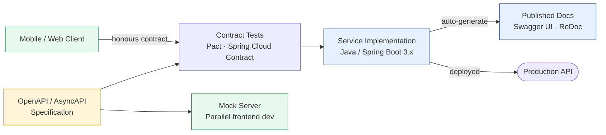

# API-First Design

Status: Approved | Last Reviewed: 2026-01-15 | Owner: @ea-board
Catalog ID: PRIN-001 | Radii
Tier Applicability: T0, T1, T2, T3

## Problem Statement

Teams often design service implementations first, then craft APIs as an afterthought. This leads to:
- Brittle APIs that expose implementation details
- Tight coupling between clients and service internals
- Difficulty in parallel development (frontend waits for backend)
- Inconsistent API patterns across services
- Breaking changes that require client updates

## Solution

Design the API contract before implementation. Treat the API as the primary interface to your service—a contract between producer and consumer.



### Key Principles

1. **Specification First**: Define OpenAPI/AsyncAPI specs before writing service code
2. **Contract Testing**: Validate that consumers and producers honor the contract
3. **Backward Compatibility**: Never remove fields; deprecate through headers
4. **Clear Semantics**: HTTP methods and status codes should reflect intent
5. **Versioning Strategy**: Use URL paths (`/v1/`, `/v2/`) or content negotiation

## Implementation Guidelines

1. **Create OpenAPI Specification**
   - Document all endpoints, parameters, request/response schemas
   - Use meaningful descriptions for every field
   - Define clear error responses (400, 401, 403, 404, 500, etc.)

2. **Align with Techcombank Standards**
   - Resource-based URLs: `/api/v1/accounts/{accountId}/transactions`
   - HTTP methods: GET (read), POST (create), PUT/PATCH (update), DELETE
   - JSON request/response bodies
   - Standard error format:
     ```json
     {
       "error": {
         "code": "INSUFFICIENT_FUNDS",
         "message": "Account has insufficient balance",
         "timestamp": "2026-03-08T10:30:00Z",
         "traceId": "abc123def456"
       }
     }
     ```

3. **Implement Contract Tests**
   - Use tools like Spring Cloud Contract or Pact
   - Verify producer generates correct responses
   - Verify consumer deserializes correctly

4. **Design for Evolution**
   - Include version header: `X-API-Version: 1.0`
   - Mark deprecated fields: `"deprecated": true` in OpenAPI
   - Use feature flags for gradual rollouts
   - Maintain backward compatibility for minimum 6 months

5. **API Documentation**
   - Auto-generate from OpenAPI spec (Swagger UI, ReDoc)
   - Include example requests and responses
   - Document authentication requirements
   - List required scopes/permissions

### OpenAPI 3.2 Additions

OpenAPI 3.2 aligns fully with JSON Schema 2020-12 and adds three capabilities relevant to Techcombank:

**1. Webhooks object** — replaces the informal `x-webhooks` extension previously used in the payment gateway spec. Use for PSD2 open banking callbacks and partner event notifications:

```yaml
openapi: 3.2.0
info:
  title: Payment Gateway API
  version: 2.3.0

webhooks:
  paymentStatusCallback:
    post:
      summary: Notified when a payment transaction status changes
      requestBody:
        required: true
        content:
          application/cloudevents+json:
            schema:
              $ref: '#/components/schemas/PaymentStatusEvent'
      responses:
        '200':
          description: Webhook received and acknowledged
        '400':
          description: Webhook payload rejected
```

**2. JSON Schema 2020-12 alignment** — removes prior `nullable` and `exclusiveMinimum` inconsistencies. Migrate existing specs:

| OpenAPI 3.0 / 3.1 syntax | OpenAPI 3.2 / JSON Schema 2020-12 |
|---|---|
| `nullable: true` on a string field | `type: [string, "null"]` |
| `exclusiveMinimum: true, minimum: 0` | `exclusiveMinimum: 0` |
| `type: string` | `type: string` (unchanged — not null by default) |

Migration is relevant for KYC document schemas and payment instruction validation where strict schema validators (OpenSearch, Microcks) expect JSON Schema 2020-12 syntax. New projects: use 3.2 from the start. Existing 3.1 specs: migrate `nullable: true` fields when the spec is next edited — no big-bang migration required.

**3. `pathItem` `$ref`** — reuse path definitions across the internal spec and the partner-facing open banking spec without duplication:

```yaml
# partner-openbanking-api.yaml
paths:
  /payments/{paymentId}:
    $ref: 'internal-payment-api.yaml#/paths/~1payments~1{paymentId}'
```

This reduces drift between the internal and partner-facing specs — a single source of truth for the `/payments/{paymentId}` path object, referenced from both specs.

**Techcombank standard error format** — update all existing specs to RFC 9457 format (see [INT-012 Error Code Mapping](../patterns/integration/error-code-mapping.md)):

```yaml
# In OpenAPI 3.2 spec components:
components:
  responses:
    UnprocessableEntity:
      description: Business rule violation
      content:
        application/problem+json:
          schema:
            $ref: '#/components/schemas/ProblemDetail'
  schemas:
    ProblemDetail:
      type: object
      required: [type, title, status]
      properties:
        type:
          type: string
          format: uri
          example: "https://errors.techcombank.com/ERR-PAY-001"
        title:
          type: string
        status:
          type: integer
        detail:
          type: string
        instance:
          type: string
          format: uri
        errorCode:
          type: string
          pattern: "^ERR-[A-Z]+-[0-9]{3}$"
        traceId:
          type: string
```

## When to Use

- All public APIs (internal or external)
- Microservice-to-microservice communication
- Mobile/web backend APIs
- Partner integrations
- Real-time APIs (WebSocket, Server-Sent Events)

## When NOT to Use

- Internal utility libraries (can skip formal API-first, but document signatures)
- Temporary proof-of-concepts (establish API-first before production)

## Examples

**Good: API-First Order Service**
```yaml
# orders-api-v1.yaml
openapi: 3.0.0
paths:
  /api/v1/orders:
    post:
      summary: Create a new order
      requestBody:
        required: true
        content:
          application/json:
            schema:
              type: object
              properties:
                customerId:
                  type: string
                items:
                  type: array
                  items:
                    type: object
                    properties:
                      productId:
                        type: string
                      quantity:
                        type: integer
      responses:
        '201':
          description: Order created successfully
          content:
            application/json:
              schema:
                $ref: '#/components/schemas/Order'
```

## References

- [OpenAPI Specification](https://spec.openapis.org/)
- [REST API Design Best Practices](https://restfulapi.net/)
- [Swagger UI](https://swagger.io/tools/swagger-ui/)
- [Spring Cloud Contract](https://spring.io/projects/spring-cloud-contract)
- [Pact Contract Testing](https://pact.foundation/)

---

**Key Takeaway**: Define your API contract before implementation. Use OpenAPI specs, contract tests, and backward compatibility strategies to ensure stable, evolvable interfaces that enable parallel development and reduce coupling.
