# Async by Default

Status: Draft | Last Reviewed: 2026-05-09 | Owner: @tech-lead-backend
Catalog ID: PRIN-012 | Radii
Tier Applicability: T0, T1, T2

## Problem Statement

- Synchronous payment processing chains — mobile app waits for the Spring backend, which waits for NAPAS, which waits for the beneficiary bank — mean that a 200ms NAPAS network timeout propagates directly into the customer's UI as a spinning loader or an error, and a total downstream failure blocks all in-flight transactions simultaneously.
- Cascading failures in synchronous call stacks are non-linear: if the fraud scoring service takes 800ms instead of 80ms, every upstream caller blocks a thread or a reactive subscription for that window, exhausting thread pools and connection pools in a failure amplification pattern that can bring down the entire payment service.
- Account statement generation triggered synchronously by an HTTP request ties a response thread to a potentially multi-second database scan; under concurrent load this creates head-of-line blocking that degrades unrelated, fast endpoints sharing the same JVM.
- KYC status propagation implemented as synchronous polling — where the mobile client or backend polls the KYC provider every N seconds — wastes network capacity, inflates egress costs, and produces status lag bounded by the polling interval rather than the actual completion time.
- Fraud enrichment added to the synchronous payment path adds its latency directly to the customer-facing response time, incentivising teams to skip enrichment or set dangerously short timeouts to preserve UX — a security trade-off driven by the architecture, not the threat model.
- Systems designed around synchronous chains are harder to throttle independently: a burst of payment requests also bursts the fraud scoring service, the NAPAS connector, and the account posting service simultaneously, requiring all of them to be scaled in lockstep.

## Solution / Principle Statement

Services communicate asynchronously via events and messages by default; synchronous request-response is an exception reserved for interactions where the caller cannot proceed until it has the response, and must be justified in the service's ADR.

```mermaid
graph TD
    subgraph MOBILE["Mobile Client (iOS / Android)"]
        APP["TCB App"]
    end

    subgraph SYNC_WRONG["Anti-Pattern: Synchronous Payment Chain"]
        W1["POST /payments"] -->|"wait"| W2["Fraud Score\n~80ms"]
        W2 -->|"wait"| W3["NAPAS Submit\n~200ms"]
        W3 -->|"wait"| W4["Account Post\n~50ms"]
        W4 -->|"wait"| W5["Response to App\n~330ms+"]
        style W1 fill:#f5b7b1,stroke:#c0392b
        style W2 fill:#f5b7b1,stroke:#c0392b
        style W3 fill:#f5b7b1,stroke:#c0392b
        style W4 fill:#f5b7b1,stroke:#c0392b
        style W5 fill:#f5b7b1,stroke:#c0392b
    end

    subgraph ASYNC_RIGHT["Principle: Async-by-Default Payment Flow"]
        A1["POST /payments"] -->|"validate + ack\n~30ms"| A2["202 Accepted\ntxn-id: abc-123"]
        A1 -->|"publish"| KAFKA["Kafka: payment.submitted"]
        KAFKA --> A3["Fraud Enrichment\n(async consumer)"]
        KAFKA --> A4["NAPAS Connector\n(async consumer)"]
        A4 -->|"result event"| KAFKA2["Kafka: payment.confirmed"]
        KAFKA2 --> A5["Account Posting\n(consumer)"]
        KAFKA2 --> A6["WebSocket / FCM Push\nto Mobile App"]
        style A2 fill:#a9dfbf,stroke:#1e8449
        style KAFKA fill:#d6eaf8,stroke:#2471a3
        style KAFKA2 fill:#d6eaf8,stroke:#2471a3
    end

    subgraph SYNC_OK["Justified Synchronous Calls"]
        S1["GET /accounts/{id}/balance\n(customer needs value now)"]
        S2["POST /payments/validate-account\n(before payment initiation)"]
        style S1 fill:#fef9e7,stroke:#b7950b
        style S2 fill:#fef9e7,stroke:#b7950b
    end
```



### Core Rules

1. **Publish before you respond.** When a business operation has downstream consequences (fraud scoring, NAPAS submission, account posting), publish the event to Kafka and return HTTP 202 Accepted with a correlation ID before any downstream processing begins. The caller learns the outcome through a push channel, not by waiting.
2. **Sync requires justification.** Any new synchronous service-to-service call must be documented in the service's ADR with the answer to: "Why can the caller not proceed without the response at call time?" Balance enquiry and pre-payment account validation are canonical justified cases; all others default to async.
3. **Events are the source of truth for state transitions.** A payment is not "confirmed" because a downstream service returned 200 — it is confirmed when a `payment.confirmed` event lands in the Kafka topic. Downstream consumers derive state from events, not from synchronous return values.
4. **Push, don't poll.** The mobile client receives payment status updates via WebSocket (active session) or FCM/APNs push notification (background). Backend services receive KYC and fraud enrichment updates via Kafka consumer. Polling endpoints for status are not exposed; if a client requires a status check for resilience it reads from the event-sourced projection, not the originating service.
5. **Dead-letter queues are mandatory.** Every Kafka consumer that processes business events must declare a dead-letter topic (`<topic>.DLT`) with a configured retry policy (exponential backoff, max 5 attempts). Events that exhaust retries land in the DLT and trigger an alert; they are never silently discarded.

## Implementation Guidelines

### 1. Payment Submission: Publish to Kafka, Return 202

The payment controller validates the request, publishes a `PaymentSubmittedEvent` to Kafka, and immediately returns 202. No downstream services are called synchronously in the payment path.

```java
@RestController
@RequestMapping("/api/v1/payments")
@Validated
public class PaymentController {

    private final PaymentEventPublisher eventPublisher;
    private final PaymentRequestValidator validator;

    @PostMapping
    public ResponseEntity<PaymentAck> submitPayment(
            @Valid @RequestBody PaymentRequest request,
            @AuthenticationPrincipal Jwt jwt) {

        // Synchronous operations permitted here: validation and idempotency check.
        validator.validate(request, jwt);

        String correlationId = UUID.randomUUID().toString();
        PaymentSubmittedEvent event = PaymentSubmittedEvent.builder()
            .correlationId(correlationId)
            .tenantId(jwt.getClaimAsString("tenant_id"))
            .amount(request.getAmount())
            .currency(request.getCurrency())
            .beneficiaryAccount(request.getBeneficiaryAccount())
            .submittedAt(Instant.now())
            .build();

        // Publish to Kafka — do not wait for downstream processing.
        eventPublisher.publish("payment.submitted", correlationId, event);

        // Return 202 immediately. The customer receives the outcome via push.
        return ResponseEntity
            .accepted()
            .header("X-Correlation-ID", correlationId)
            .body(PaymentAck.of(correlationId, PaymentStatus.SUBMITTED));
    }
}
```

### 2. Kafka Consumer: Fraud Enrichment (Async)

The fraud enrichment consumer reads from `payment.submitted`, calls the fraud scoring service, and publishes a `PaymentFraudScoredEvent`. If fraud scoring fails after retries, the event lands in the dead-letter topic.

```java
@Service
public class FraudEnrichmentConsumer {

    private final FraudScoringClient fraudClient;
    private final KafkaTemplate<String, Object> kafkaTemplate;
    private final MeterRegistry meterRegistry;

    @KafkaListener(
        topics = "payment.submitted",
        groupId = "fraud-enrichment",
        containerFactory = "paymentKafkaListenerContainerFactory"
    )
    @RetryableTopic(
        attempts = "5",
        backoff = @Backoff(delay = 1000, multiplier = 2, maxDelay = 30_000),
        dltTopicSuffix = ".DLT",
        dltStrategy = DltStrategy.FAIL_ON_ERROR
    )
    public void onPaymentSubmitted(
            PaymentSubmittedEvent event,
            @Header(KafkaHeaders.RECEIVED_TOPIC) String topic,
            @Header(KafkaHeaders.OFFSET) long offset) {

        log.info("fraud-enrichment received event. correlationId={} topic={} offset={}",
            event.getCorrelationId(), topic, offset);

        FraudScore score = fraudClient.score(event);

        PaymentFraudScoredEvent scoredEvent = PaymentFraudScoredEvent.builder()
            .correlationId(event.getCorrelationId())
            .tenantId(event.getTenantId())
            .fraudScore(score.getValue())
            .riskLevel(score.getRiskLevel())
            .scoredAt(Instant.now())
            .build();

        kafkaTemplate.send("payment.fraud-scored", event.getCorrelationId(), scoredEvent);
        meterRegistry.counter("payment.fraud_enrichment.processed",
            "risk_level", score.getRiskLevel().name()).increment();
    }

    // Dead-letter handler — alerting only; no silent discard
    @DltHandler
    public void handleDlt(PaymentSubmittedEvent event,
                          @Header(KafkaHeaders.RECEIVED_TOPIC) String dltTopic) {
        log.error("payment.submitted event exhausted retries. Moving to DLT. " +
            "correlationId={} dltTopic={}", event.getCorrelationId(), dltTopic);
        meterRegistry.counter("payment.fraud_enrichment.dlt_events").increment();
        // Alert on-call; do not re-process inline.
    }
}
```

### 3. WebSocket Push: Delivering Async Confirmation to the Mobile Client

The notification service consumes `payment.confirmed` events and pushes the status to the mobile client's active WebSocket session or falls back to FCM/APNs for background delivery.

```java
@Service
public class PaymentNotificationConsumer {

    private final SimpMessagingTemplate wsTemplate;
    private final FcmPushClient fcmClient;
    private final SessionRegistry sessionRegistry;

    @KafkaListener(topics = "payment.confirmed", groupId = "notification-service")
    public void onPaymentConfirmed(PaymentConfirmedEvent event) {
        String customerId = event.getCustomerId();
        PaymentStatusMessage message = PaymentStatusMessage.builder()
            .correlationId(event.getCorrelationId())
            .status(PaymentStatus.CONFIRMED)
            .napasReference(event.getNapasReference())
            .confirmedAt(event.getConfirmedAt())
            .build();

        if (sessionRegistry.isActive(customerId)) {
            // Customer has an active WebSocket session — push directly.
            wsTemplate.convertAndSendToUser(
                customerId,
                "/queue/payments/status",
                message
            );
            log.info("WebSocket push sent. customerId={} correlationId={}",
                customerId, event.getCorrelationId());
        } else {
            // Background — use FCM/APNs push notification.
            fcmClient.sendPaymentConfirmation(customerId, message);
            log.info("FCM push sent. customerId={} correlationId={}",
                customerId, event.getCorrelationId());
        }
    }
}
```

### 4. KYC Status Update: Event-Driven, Not Polling

The KYC provider webhook posts to an internal ingest endpoint. The ingest endpoint publishes a `KycStatusChangedEvent` to Kafka. Downstream services that need KYC status consume the event rather than calling the KYC service synchronously.

```java
// Ingest endpoint — receives webhook from KYC provider
@RestController
@RequestMapping("/internal/kyc/webhooks")
public class KycWebhookController {

    private final KafkaTemplate<String, KycStatusChangedEvent> kafkaTemplate;

    @PostMapping
    public ResponseEntity<Void> receiveKycUpdate(
            @Valid @RequestBody KycWebhookPayload payload,
            @RequestHeader("X-KYC-Signature") String signature) {

        // Validate HMAC signature from KYC provider before publishing
        webhookValidator.verify(payload, signature);

        KycStatusChangedEvent event = KycStatusChangedEvent.builder()
            .customerId(payload.getCustomerId())
            .status(payload.getStatus())   // PENDING | APPROVED | REJECTED
            .reason(payload.getReason())
            .changedAt(Instant.now())
            .build();

        kafkaTemplate.send("kyc.status-changed", payload.getCustomerId(), event);
        return ResponseEntity.ok().build();
    }
}

// Downstream consumer — account activation service
@KafkaListener(topics = "kyc.status-changed", groupId = "account-activation")
public void onKycStatusChanged(KycStatusChangedEvent event) {
    if (event.getStatus() == KycStatus.APPROVED) {
        accountActivationService.activateAccount(event.getCustomerId());
    }
    // No polling. No synchronous KYC API call.
}
```

### 5. Justified Synchronous Call: Pre-Payment Account Validation

Account validation before payment initiation is a justified synchronous call because the customer cannot proceed without confirming the beneficiary account is valid. This is documented in ADR-047.

```java
// Justified sync call — see ADR-047
@Service
public class PrePaymentValidationService {

    private final AccountValidationClient accountClient;

    /**
     * Synchronous validation before payment initiation.
     * Justified: the customer cannot submit the payment form without
     * confirming the beneficiary account exists and matches the name.
     * See ADR-047 — Pre-Payment Validation Sync Exception.
     */
    public AccountValidationResult validateBeneficiary(String accountNumber, String bankCode) {
        return accountClient.validate(accountNumber, bankCode);
        // Timeout: 2s. Circuit breaker: PRIN-010 fail-closed if unavailable.
    }
}
```

## When to Apply

- Payment submission from mobile or web — publish to `payment.submitted` Kafka topic, return 202.
- Account statement generation — trigger via Kafka event, deliver via email/push when ready.
- KYC status propagation — consume `kyc.status-changed` events from Kafka, not polling loops.
- Fraud enrichment after payment ack — consume `payment.submitted`, publish `payment.fraud-scored`.
- NAPAS confirmation routing — NAPAS response arrives as a callback, published as `payment.confirmed`.
- Notification delivery — all payment and account status notifications go via WebSocket or push, not synchronous response bodies.
- Any operation that takes longer than 500ms or involves more than one external dependency in sequence.

## When to Make an Exception

Synchronous request-response is appropriate when all of the following conditions hold. Each exception must be documented in an ADR.

| Scenario | Conditions | ADR Required |
|---|---|---|
| Balance enquiry | Customer or system requires the current account balance before taking an action; data is tenant-isolated and served from a read replica under circuit breaker | ADR with Tech Lead sign-off |
| Pre-payment account validation | Customer cannot proceed with payment initiation without confirming beneficiary details; p95 latency under 500ms; circuit-breaker and fail-closed on PRIN-010 | ADR-047 (existing) |
| Real-time limit check | Regulatory daily transfer limit must be checked before accepting the payment event; check is a lightweight in-memory read against a materialized view | ADR with CISO Delegate sign-off if limit data is sensitive |
| Synchronous internal gRPC call within the same deployment unit | Caller and callee are co-deployed as modules in the same JVM (modular monolith context per PRIN-013); no network hop; latency is sub-millisecond | Document in service README; no external ADR required |

## Checklist

- [ ] New payment path returns HTTP 202 Accepted with a correlation ID, not 200 with a final status
- [ ] Kafka topic names follow the convention `<domain>.<event-past-tense>` (e.g., `payment.submitted`, `kyc.status-changed`)
- [ ] Dead-letter topic declared for every consumer (`<topic>.DLT`) with retry backoff configured via `@RetryableTopic`
- [ ] DLT handler emits a log at ERROR level and increments `<domain>.dlt_events` counter — no silent discard
- [ ] WebSocket and/or FCM/APNs push is the delivery mechanism for async outcomes to mobile clients — no polling endpoint exposed
- [ ] Any synchronous service-to-service call is documented in an ADR with the justification
- [ ] Consumer group IDs are service-scoped and not shared across services
- [ ] Schema Registry entry created for each new event type (Avro / JSON Schema)
- [ ] `fail_safe_deny_total` wired to DLT exhaustion path per PRIN-010

## NFR Acceptance Criteria

```yaml
service_name: "payment-service-async-compliance"
tier: T0
acceptance_criteria:
  - id: ABD-1
    description: >
      Payment submission endpoint (POST /api/v1/payments) returns HTTP 202 Accepted
      in under 100ms at p99 under the nominal load profile (500 TPS).
      Response body contains a valid correlation ID.
    verification: >
      Load test with k6: 500 virtual users, 60-second ramp; assert p99 < 100ms;
      assert HTTP 202 on all successful requests; assert correlation-id header present.

  - id: ABD-2
    description: >
      When a downstream Kafka consumer fails and exhausts retries, the event lands
      in the dead-letter topic within 5 retry attempts (exponential backoff) and
      triggers a PagerDuty alert. No event is silently discarded.
    verification: >
      Integration test: configure consumer to always throw; publish 10 events;
      assert all 10 appear in the .DLT topic; assert dlt_events counter = 10;
      assert PagerDuty alert fired (mock webhook).

  - id: ABD-3
    description: >
      Payment confirmation is delivered to the mobile client WebSocket session
      within 2 seconds of the payment.confirmed event landing in Kafka,
      measured end-to-end in the staging environment.
    verification: >
      E2E test: initiate payment, subscribe to WebSocket /queue/payments/status;
      assert status CONFIRMED message received within 2000ms of Kafka offset commit.

  - id: ABD-4
    description: >
      No synchronous inter-service HTTP call exists in the payment submission path
      (POST /payments through to Kafka publish). Verified by OpenTelemetry trace
      analysis — zero child spans of type CLIENT in the payment submission trace.
    verification: >
      Trace analysis in Jaeger/Tempo: for a sample of 100 payment traces,
      assert zero spans with span.kind=CLIENT after the Kafka publish span.
```

## Compliance Mapping

| Layer | Reference | Section / Control | How this principle satisfies |
|---|---|---|---|
| Ring 0 (global) | BCBS 239 (Jan 2013) | Principle 2 — Data Architecture and IT Infrastructure | Async event-driven architecture with Kafka as the durable event backbone provides the data lineage and auditability required by BCBS 239 Principle 2 for risk data aggregation |
| Ring 0 (global) | BCBS 239 (Jan 2013) | Principle 3 — Accuracy and Integrity | Events in Kafka are immutable and sequenced; the event log is the source of truth for payment state transitions, satisfying accuracy requirements |
| Ring 1 (international banking) | BCBS 230 (Oct 2012) | Principle 6 — Incident Management | Async decoupling means a failure in the NAPAS connector does not propagate to the payment submission surface; failure domains are isolated, directly supporting resilient incident management ⚠️ (working summary — pending PDF fetch) |
| Ring 1 (international banking) | BCBS 239 (Jan 2013) | §3 Timeliness — Principle 6 | Event-driven KYC and fraud enrichment means status changes propagate to downstream systems within seconds of the upstream event, satisfying timeliness requirements for risk reporting ⚠️ (working summary — pending PDF fetch) |
| Ring 2 (Vietnam) | SBV Circular 09/2020 §IV.2 — System Availability | Operational Continuity Requirements | Async architecture reduces blast radius of downstream failures; payment submission availability is independent of NAPAS connector availability, satisfying SBV continuity requirements ⚠️ (working summary — pending Legal review) |

## Cost / FinOps Notes

- Kafka (MSK Provisioned) for T0 payment traffic at Techcombank's projected scale (500 TPS peak) requires approximately 3 broker nodes (kafka.m5.large) plus storage. Estimated cost: USD 900–1,400/month. This replaces the synchronous thread-per-request cost of scaling the payment service API tier vertically — async decoupling allows horizontal scaling of individual consumers independently, reducing over-provisioning.
- Dead-letter queue monitoring adds negligible cost (Kafka topic storage for DLT events is a small fraction of the main topic volume). The operational benefit — zero silent event loss — eliminates the unbounded cost of discovering lost payment events during a customer dispute or SBV investigation.
- WebSocket infrastructure (Application Load Balancer + sticky sessions or AWS API Gateway WebSocket API) adds approximately USD 200–400/month at Techcombank's active-session scale. This replaces the cost of polling-based status endpoints that generate 10–50x more requests per payment transaction than a single push notification.
- Each synchronous inter-service call that is replaced with an async event eliminates a thread-hold duration from the caller's thread pool. At 500 TPS with a synchronous NAPAS call averaging 200ms, the required thread pool size to maintain headroom is approximately 200 threads; with async this reduces to the time needed to produce the Kafka event (~5ms), reducing thread pool sizing by roughly 40x and proportionally reducing JVM memory requirements.

## Threat Model Summary

STRIDE: Denial of Service, Tampering, Information Disclosure

- **Top threats addressed:**
  - Denial of Service via synchronous cascade: a slow or failing downstream service (NAPAS, fraud scoring) cannot exhaust the thread pool of the payment service when the two are decoupled by Kafka — each consumer scales and fails independently.
  - Tampering of payment state via synchronous response spoofing: payment state is derived from immutable Kafka events rather than from synchronous return values, making it impossible to inject a false "confirmed" status without writing to the Kafka topic (which requires Kafka ACL write permission).
  - Information Disclosure via polling endpoint enumeration: replacing polling with push eliminates the status polling endpoint that could be probed to enumerate payment states across customer accounts.
- **Residual risks:**
  - Event ordering cannot be guaranteed across Kafka partitions. Payment state machines must be designed to handle out-of-order events using event timestamps and idempotent state transitions. Mitigated by partitioning on `customerId` to ensure per-customer ordering.
  - Dead-letter queue events contain sensitive payment data and must be subject to the same encryption and access controls as the primary topics. Mitigated by applying Kafka ACLs and field-level encryption at the schema level.

## Operational Runbook (stub)

1. **Alert: consumer lag spike** — If `kafka_consumer_group_lag` for any payment consumer group exceeds 1,000 messages, page the on-call engineer. Investigate whether the consumer is crashing (check pod logs for `ERROR`), whether the upstream produces events faster than consumers handle them (scale consumer replicas), or whether a downstream dependency is slow.
2. **Alert: DLT event received** — If any event lands in a `.DLT` topic, the on-call engineer must investigate within 15 minutes. Identify the exception in the consumer logs using the correlation ID in the DLT event header. Determine whether the event can be replayed from the DLT after the root cause is fixed.
3. **Replay events from DLT** — After fixing the consumer bug, use the Kafka admin script (`scripts/replay-dlt.sh --topic payment.submitted.DLT --from-offset <offset>`) to replay events into the primary topic. Monitor the consumer log to confirm successful processing.
4. **WebSocket delivery failure** — If customers report not receiving payment confirmation notifications, check the notification-service pod logs for `FCM push sent` or `WebSocket push sent` entries. Verify FCM API key validity. Check WebSocket ALB sticky-session health. Fall back to FCM for all active sessions if WebSocket ALB is degraded.
5. **Schema incompatibility after event schema change** — If a consumer fails with a schema deserialization error after a producer deployed a new event version, verify the new schema is backward-compatible in the Schema Registry. If not, roll back the producer and initiate a schema migration ADR.
6. **Kafka broker degraded** — If MSK broker availability drops, check AWS MSK console for broker health. Payment submission will continue to accept requests but the Kafka producer will buffer events in memory (up to the configured `buffer.memory` limit). If the Kafka outage persists beyond 5 minutes, activate the payment service degraded-mode runbook to surface appropriate messaging to customers.

## Test Strategy (stub)

- **Unit:** Test `PaymentController` with `@WebMvcTest` — assert HTTP 202 Accepted is returned; assert `eventPublisher.publish()` is called with the correct topic name and correlation ID; assert no downstream service is called directly. Test `FraudEnrichmentConsumer` with a `KafkaTemplate` mock — assert `payment.fraud-scored` is published after successful scoring; assert DLT handler increments the meter on exhausted retries.
- **Integration:** Use `@EmbeddedKafka` with Spring Boot test to run the full event pipeline: submit a payment, assert the Kafka `payment.submitted` topic receives the event, assert the fraud enrichment consumer picks it up, assert `payment.fraud-scored` is published. Use Testcontainers with a real Kafka broker for DLT retry behaviour — configure the consumer to throw on the first 4 attempts and assert the event is successfully processed on attempt 5.
- **Security / Compliance:** Verify Kafka topic ACLs in staging — assert that no service has write access to topics it does not own. Verify Schema Registry rejects incompatible schema changes for `payment.submitted` and `payment.confirmed`. Trace analysis in Jaeger — assert zero synchronous CLIENT spans in the payment submission trace beyond the Kafka producer span.

## Related Patterns / Principles

- [PRIN-010 Fail-Safe Defaults](fail-safe-defaults.md) — DLT exhaustion and consumer failures must follow fail-safe semantics
- [PRIN-013 Modular Monolith Preference](modular-monolith-preference.md) — intra-module calls within a modular monolith may be synchronous; async applies at the service boundary
- [PRIN-003 Zero-Trust Security](zero-trust-security.md) — Kafka topic ACLs enforce zero-trust between producers and consumers
- [RES-002 Circuit Breaker](../patterns/resilience/circuit-breaker.md) — synchronous justified calls must be wrapped in circuit breakers per PRIN-010
- [INT-001 NAPAS Connector](../patterns/integration/napas-connector.md) — NAPAS integration is the canonical async integration pattern

## References

- BCBS 239 — Principles for Effective Risk Data Aggregation and Risk Reporting (Jan 2013)
- BCBS 230 — Principles for Effective Risk Data Aggregation and Risk Reporting (Oct 2012)
- SBV Circular 09/2020 on Information Security in Banking Operations — §IV.2
- Richardson, C. — Microservices Patterns (2018) — Chapter 3: Interprocess Communication in a Microservice Architecture
- Kleppmann, M. — Designing Data-Intensive Applications (2017) — Chapter 11: Stream Processing
- Apache Kafka Documentation — Producer and Consumer Configuration, Dead-Letter Queue patterns

---
**Key Takeaway**: Techcombank systems publish events and return 202 by default — customers learn payment outcomes via push, not by waiting, and downstream failures stay downstream.
