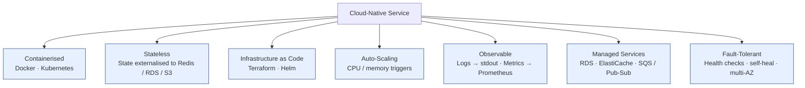

# Cloud-Native-First

Status: Approved | Last Reviewed: 2026-02-05 | Owner: @ea-board
Catalog ID: PRIN-005 | Radii
Tier Applicability: T0, T1, T2, T3

## Problem Statement

Systems designed for on-premises data centers don't scale efficiently in cloud:
- Requires manual instance provisioning and maintenance
- No automatic failover or self-healing
- Difficult to scale horizontally (app architecture assumes fixed servers)
- High operational overhead (patching, monitoring, backups)
- Cannot leverage cloud services (managed databases, messaging, CDN)
- Cost overruns from inefficient resource utilization

## Solution

Design for cloud from day one. Build stateless, containerized applications that auto-scale and self-heal using infrastructure as code.



### Cloud-Native Principles

1. **Containerized**: Docker containers, immutable images
2. **Stateless**: No local state; externalize to databases, caches, queues
3. **Declarative Configuration**: Infrastructure as code (Terraform, CloudFormation)
4. **Resilient**: Designed to survive failures; auto-recovery
5. **Observable**: Comprehensive logging, metrics, tracing
6. **Auto-Scaling**: Respond to load automatically
7. **Managed Services**: Prefer cloud-managed services over self-hosted

## Implementation Guidelines

1. **12-Factor App Methodology**
   - **Codebase**: Single codebase in Git, one version per environment
   - **Dependencies**: Explicitly declared in pom.xml or requirements.txt
   - **Config**: Environment variables, never hardcoded
   - **Backing Services**: Treat DB, cache, queue as attached resources
   - **Build/Run Separation**: Build once, run in any environment
   - **Processes**: Stateless processes; state in backing services
   - **Port Binding**: Self-contained HTTP server, no separate web server
   - **Concurrency**: Horizontally scalable process model
   - **Disposability**: Fast startup/shutdown
   - **Dev/Prod Parity**: Same tools, databases, services everywhere
   - **Logs**: Write to stdout/stderr; let platform collect
   - **Admin Tasks**: One-off tasks via CLI, not cron jobs

2. **Containerization**
   ```dockerfile
   FROM openjdk:17-slim

   # Multistage build
   FROM maven:3.8-openjdk-17 AS builder
   COPY . /workspace
   WORKDIR /workspace
   RUN mvn clean package -DskipTests

   # Runtime
   FROM openjdk:17-slim
   COPY --from=builder /workspace/target/*.jar app.jar
   EXPOSE 8080
   ENV JAVA_OPTS="-Xmx512m"
   ENTRYPOINT ["java", "${JAVA_OPTS}", "-jar", "app.jar"]
   ```

3. **Configuration Management**
   ```yaml
   # application.yml (defaults)
   spring:
     datasource:
       url: jdbc:postgresql://localhost:5432/myapp
     kafka:
       bootstrap-servers: localhost:9092

   # Environment variable overrides
   SPRING_DATASOURCE_URL=jdbc:postgresql://prod-db:5432/myapp
   SPRING_KAFKA_BOOTSTRAP_SERVERS=kafka-prod:9092
   ```

4. **Infrastructure as Code**
   ```hcl
   # main.tf (Terraform)
   resource "aws_ecs_service" "payment_service" {
     name          = "payment-service"
     cluster       = aws_ecs_cluster.main.name
     desired_count = 3

     task_definition = aws_ecs_task_definition.payment.arn

     load_balancer {
       target_group_arn = aws_lb_target_group.payment.arn
       container_name   = "payment-service"
       container_port   = 8080
     }

     auto_scaling_policy {
       target_cpu_utilization       = 70
       target_memory_utilization    = 80
       scale_up_cooldown            = 60
       scale_down_cooldown          = 300
     }
   }
   ```

5. **Stateless Design**
   - No local files; store in S3 or cloud storage
   - No in-memory cache; use Redis
   - No local sessions; use distributed session store
   - Multiple instances can be killed/replaced anytime

6. **Auto-Scaling Configuration**
   - Set resource requests/limits per container
   - Define scaling policies: CPU > 70% → add instance
   - Test scaling under load (load testing required)
   - Set reasonable min/max replicas

7. **Managed Services**
   - Database: RDS (AWS), Cloud SQL (GCP), Azure Database
   - Message Queue: SQS/SNS (AWS), Cloud Pub/Sub (GCP)
   - Cache: ElastiCache (AWS), Cloud Memorystore (GCP)
   - Monitoring: CloudWatch (AWS), Cloud Monitoring (GCP)
   - Secrets: Secrets Manager (AWS), Secret Manager (GCP)

## Cloud Platform Migration

- **AWS**: ECS/Fargate for containers, RDS for databases, SQS/SNS for messaging
- **GCP**: Cloud Run for serverless, Cloud SQL for databases, Pub/Sub for messaging
- **Azure**: Container Instances, Azure SQL Database, Service Bus
- **On-Premise**: Kubernetes (mimic cloud APIs locally)

## Kubernetes Manifests Example

```yaml
apiVersion: apps/v1
kind: Deployment
metadata:
  name: payment-service
spec:
  replicas: 3
  selector:
    matchLabels:
      app: payment-service
  template:
    metadata:
      labels:
        app: payment-service
    spec:
      containers:
      - name: payment-service
        image: registry.techcombank.com/payment-service:1.2.3
        ports:
        - containerPort: 8080
        env:
        - name: DATABASE_URL
          valueFrom:
            secretKeyRef:
              name: payment-secrets
              key: database-url
        resources:
          requests:
            cpu: 500m
            memory: 512Mi
          limits:
            cpu: 1000m
            memory: 1Gi
        livenessProbe:
          httpGet:
            path: /actuator/health/liveness
            port: 8080
          initialDelaySeconds: 30
          periodSeconds: 10
        readinessProbe:
          httpGet:
            path: /actuator/health/readiness
            port: 8080
          initialDelaySeconds: 10
          periodSeconds: 5
```

## Checklist

- [ ] Application containerized (Dockerfile)
- [ ] All config via environment variables
- [ ] No local state (external backing services)
- [ ] Infrastructure as code (Terraform/CloudFormation)
- [ ] Health check endpoints (liveness, readiness)
- [ ] Auto-scaling policies defined
- [ ] Logs written to stdout (structured JSON)
- [ ] Metrics exposed (Prometheus format)
- [ ] Secrets managed (Vault, cloud secrets manager)

## References

- [The Twelve-Factor App](https://12factor.net/)
- [Cloud Native Computing Foundation](https://www.cncf.io/)
- [Kubernetes Documentation](https://kubernetes.io/docs/)
- [Docker Best Practices](https://docs.docker.com/develop/dev-best-practices/)

---

**Key Takeaway**: Build stateless, containerized apps. Use infrastructure as code. Leverage managed cloud services. Design for auto-scaling and resilience.
