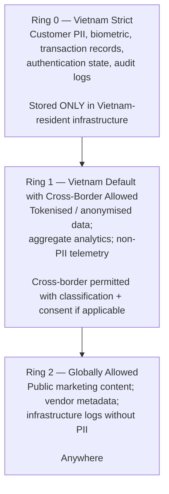

# Data Residency

Status: Draft | Last Reviewed: 2026-05-09 | Owner: @head-of-compliance, @ea-board
Catalog ID: PRIN-007 | Radii
Tier Applicability: T0, T1, T2, T3

## Problem Statement

Vietnam's Decree 53/2022 (implementing the Cybersecurity Law) and Decree 13/2023 (Personal Data Protection) impose data-localisation requirements on banks. Customer personal data, transaction records, and authentication data must be stored in Vietnam by default; cross-border transfer requires specific legal basis (consent, contract necessity, regulator approval). Without a clear data-residency principle, services accidentally route data to overseas SaaS / analytics tools / observability backends — creating regulatory and audit exposure. This principle defines the boundary: what stays in Vietnam, what may cross, and how to gate the decision.

## Context

Reach for this principle when:

- Designing any new service that handles customer data.
- Selecting a SaaS vendor (observability, analytics, search, communication).
- Onboarding a third-party integration with data flow either direction.
- Reviewing a DAB submission — every data flow is residency-tagged.

## Solution — three concentric residency rings



### Per-data-class residency

| Class | Examples | Residency | Cross-border basis |
| --- | --- | --- | --- |
| **PII raw** | CCCD, name, address, DOB | Vietnam Strict | None — must not leave |
| **Biometric** | Selfie images, fingerprint templates | Vietnam Strict + minimal retention | None |
| **Card data (PAN)** | Card primary account numbers | Vietnam Strict (in HSM-backed vault) | None |
| **Transaction records** | Payment, balance, ledger entries | Vietnam Strict | None |
| **Authentication state** | Sessions, refresh tokens | Vietnam Strict | None |
| **Audit logs** | Access logs, security events | Vietnam Strict (7+ year retention) | None |
| **Tokens (vault-protected)** | Tokens of any of the above | Vietnam Default | Allowed for analytics under consent |
| **Aggregate analytics** | Daily counts, trend metrics | Vietnam Default | Allowed for global reporting |
| **Non-PII telemetry** | Latency / error metrics labels stripped of PII | Vietnam Default | Allowed for observability vendors with DPA |
| **Public content** | Marketing copy, public docs | Globally Allowed | Anywhere |

### Decision gate — "is this cross-border?"

A flow is cross-border if any of:

1. Storage location is outside Vietnam.
2. Data passes through a service whose primary processing is outside Vietnam (e.g., a US-based SaaS).
3. Backups are replicated to a non-Vietnamese region.
4. Vendor support staff in another country may access the data.

For Ring-0 data, none of the above is permitted. For Ring-1 / Ring-2 data, the basis must be documented in the service's NFR-AC YAML and approved by the Head of Compliance.

## Implementation Guidelines

### Java / Spring — data-class annotation + RLS guard

```java
public enum DataClass {
    PII_RAW, BIOMETRIC, CARD_PAN, TRANSACTION, AUTH_STATE, AUDIT,
    TOKEN, AGGREGATE_ANALYTICS, NON_PII_TELEMETRY, PUBLIC
}

public enum Residency {
    VIETNAM_STRICT, VIETNAM_DEFAULT, GLOBAL
}

@Target({ElementType.FIELD, ElementType.TYPE})
@Retention(RetentionPolicy.RUNTIME)
public @interface DataResidency {
    DataClass dataClass();
    Residency residency() default Residency.VIETNAM_DEFAULT;
}

@Entity
@DataResidency(dataClass = DataClass.PII_RAW, residency = Residency.VIETNAM_STRICT)
public class CustomerProfile {
    @Tokenisable(DataClassification.CCCD)
    private String nationalId;       // tokenised by aspect SEC-004
    private String fullName;
    // ...
}
```

### CI lint — residency consistency

A CI job (Phase 4 enhancement) inspects every entity's `@DataResidency` against the deployment manifest:

- VIETNAM_STRICT entities must deploy only to `vn-*` regions.
- The deployment Helm chart's `region` value must be in the allow-list per data-class.
- Cross-region replication on VIETNAM_STRICT entities must replicate within Vietnam regions only.

```python
# scripts/lint-residency.py — outline
def check_entity_residency(entity_class, deployment_regions):
    annotation = entity_class.get_annotation(DataResidency)
    if annotation.residency() == Residency.VIETNAM_STRICT:
        for region in deployment_regions:
            if not region.startswith("vn-"):
                yield f"FAIL: {entity_class} VIETNAM_STRICT but deploys to {region}"
```

### PostgreSQL — Row-Level Security on cross-border views

```sql
-- Strict tables stay in Vietnam-only Aurora cluster.
-- Cross-region read replicas in non-Vietnam are forbidden by replication config.

-- For RING-1 data accessed cross-border via consent:
CREATE TABLE customer_aggregates (
    customer_token VARCHAR(64) NOT NULL,
    monthly_txn_count INT NOT NULL,
    cross_border_consent BOOLEAN NOT NULL DEFAULT FALSE,
    region_consent_granted VARCHAR(8)[]
);
ALTER TABLE customer_aggregates ENABLE ROW LEVEL SECURITY;

CREATE POLICY cross_border_reader ON customer_aggregates
    FOR SELECT TO cross_border_role
    USING (cross_border_consent = TRUE
           AND current_setting('app.requesting_region') = ANY(region_consent_granted));
```

### Vendor selection guard

Every SaaS vendor proposal is evaluated against the data-residency matrix:

| Question | Implication |
|---|---|
| Where does the vendor host data at rest? | Must include a Vietnam region for Ring-0/1 data |
| Where does support personnel access from? | Affects Ring-1 cross-border classification |
| Where are backups stored? | Backups are first-class data — same residency rules |
| Can data subjects exercise rights via Vietnamese interface? | Decree 13/2023 requires |

If a vendor cannot meet the residency requirement for the data class, either (a) reject the vendor, (b) redact / tokenise data before sending, or (c) negotiate a regional deployment with a strict DPA.

### T24 / legacy

T24 is single-region (in-Vietnam) and naturally satisfies VIETNAM_STRICT for Ring-0 data. Modern services that integrate with T24 must inherit T24's residency posture for the data they exchange.

### Frontend / Mobile

Clients carry minimal PII (only what's needed for the current screen, decrypted via SEC-004 where the user is the legitimate subject). Client analytics packages (Firebase, Mixpanel, etc.) must be configured with Vietnamese data centres or replaced — or sanitised so they never see PII.

## Variants & Trade-offs

| Variant | When | Trade-off |
|---|---|---|
| **Strict (default for Ring-0)** | All PII / transactional data | No cross-border; some vendor restrictions |
| **Tokenise-then-cross-border** | Analytics / fraud-screening with global vendors | Requires SEC-004; tokens are not PII per Decree-13 in opinion |
| **Consent-gated cross-border** | Cross-border banking, partner integrations | Customer consent + regulator approval; complex audit |
| **Anonymisation + cross-border** | Aggregate analytics | Anonymisation must be irreversible; verified periodically |

## NFR Acceptance Criteria

- **HA**: Vietnam-resident infrastructure must be HA via REF-001 multi-region (vn-south-1 + vn-north-1).
- **HP**: residency does not directly affect performance, but vendor-region selection may add cross-region latency for distant SaaS.
- **HR**: residency controls compliant under standard DR (BP-002) and chaos drills (BP-005).

## Compliance Mapping

| Layer | Reference | Section/Control | How |
|---|---|---|---|
| Ring 0 | ISO 27017 (Cloud Security) | 6.1.5 Data localisation considerations | Per-data-class residency mapping is the implementation |
| Ring 0 | ISO 27018 (PII in Cloud) | A.7 Data residency / disclosure | PII stays in Vietnam by default |
| Ring 1 | GDPR Art. 44–49 (Cross-border transfers) | "Adequacy decision" or "appropriate safeguards" | Where Techcombank handles EU-resident customer data, strict-cross-border carries SCCs / BCRs |
| Ring 2 | Decree 53/2022 ⚠️ (working summary — pending Legal review) | Articles 26–28 — data localisation for banks | Default-Vietnam enforced; cross-border requires basis |
| Ring 2 | Decree 13/2023 ⚠️ (working summary — pending Legal review) | Articles 11–13 (cross-border PII transfer) | Tokenisation + consent gates cross-border for non-strict data |

## Cost / FinOps Notes

| Item | Cost driver | Order of magnitude |
|---|---|---|
| Vietnam-only infrastructure | Limited cloud-region selection | Comparable to other cloud regions; some vendors may not have presence |
| Vendor restrictions | Loss of access to some global SaaS | Project-specific |
| Audit / compliance overhead | Annual review of vendor residency posture | ~0.2 FTE compliance officer |
| Tokenisation infrastructure | SEC-004 amortised | Already in budget |

**Cost of NOT applying**: regulatory fine + reputational damage + potential operating-licence impact. The risk dominates infrastructure cost considerations.

## Threat Model Summary

STRIDE: residency primarily addresses **Information Disclosure** (jurisdictional access).

- **Top 3 threats addressed**:
  1. *Foreign government data-disclosure request* on PII (Information Disclosure) — bounded by residency.
  2. *Vendor breach affecting customers globally* (Information Disclosure) — bounded if data is region-isolated.
  3. *Inadvertent cross-border copy via vendor backup* (Tampering) — caught by residency-lint at deploy time.
- **Top 3 residual threats**:
  1. *Mis-classification of data* (Elevation of Privilege) — a field flagged Ring-1 that is actually Ring-0. Mitigation: annual data-classification review; Phase 4 lint catches obvious mismatches.
  2. *Aggregation re-identification* (Information Disclosure) — anonymised data combined cross-region re-identifies. Mitigation: differential-privacy where feasible; periodic re-identification testing.
  3. *Vendor sub-processor without DPA* (Spoofing) — the vendor's vendor moves data. Mitigation: DPA + sub-processor disclosure required.

## Operational Runbook (stub)

- **Alerts**:
  - **Alert: ResidencyViolationDetected** — lint-pipeline detects a Ring-0 entity deploying outside Vietnam. Severity: Critical (block merge).
  - **Alert: CrossBorderTransferRateAnomaly** — cross-border data egress rate up > 3× baseline for an unexpected destination. Severity: High.
- **Dashboards**: Grafana — `data-residency-overview` (egress destinations, data-class breakdown, vendor-region matrix).
- **New-vendor onboarding**: residency review checklist; runbook in `governance/runbooks/new-vendor-residency.md`.

## Test Strategy (stub)

- **Unit**: residency-lint script tests.
- **Integration**: deployment manifest + entity annotation coherence.
- **Compliance audit**: annual sample of 20 services; trace data flows from capture to backup; verify residency.

## When to Use

- Always — every data flow is residency-tagged.

## When NOT to Use

- N/A — there is no opt-out for banking customer data in Vietnam.

## Related Patterns

- [PRIN-003 Zero-Trust Security](zero-trust-security.md) — residency is one boundary
- [SEC-004 Tokenization + HSM](../patterns/security/tokenization-hsm.md) — enables cross-border for tokenised flows
- [SEC-008 Data Masking](../patterns/security/data-masking.md), [SEC-013 PII FPE](../patterns/security/pii-tokenization-format-preserving.md)
- [REF-001 Multi-Region Active-Active](../reference-architectures/multi-region-active-active.md) — both regions must be in Vietnam for Ring-0
- [COMP-001 Compliance Mapping Matrix](../compliance/compliance-mapping-matrix.md) — Decree 53 / 13 cells reference this principle

## References

- Decree 53/2022/NĐ-CP ⚠️ (working summary — pending Legal review)
- Decree 13/2023/NĐ-CP ⚠️ (working summary — pending Legal review)
- ISO 27017 / 27018
- GDPR Articles 44–49
- `_research-notes.md`

---

**Key Takeaway**: PII / biometric / transactional / authentication / audit data is **Vietnam-strict** — never cross-border. Tokens and anonymised aggregates may cross with consent. Every data flow is residency-tagged in code and at deploy time; mismatches block merge.
