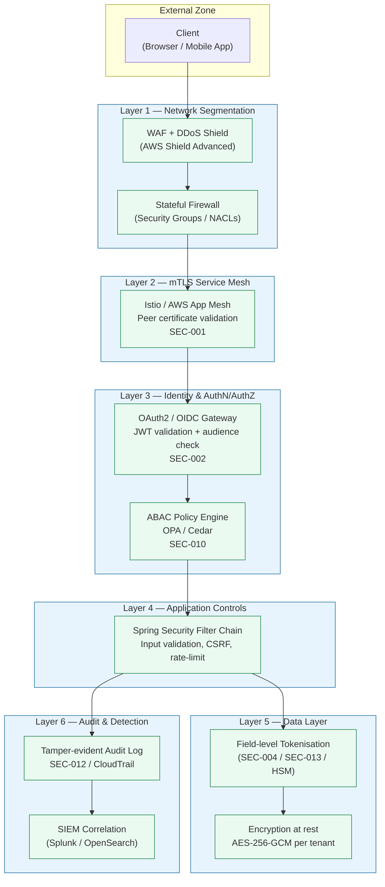

# Defense-in-Depth

Status: Draft | Last Reviewed: 2026-05-09 | Owner: @ciso-delegate
Catalog ID: PRIN-008 | Radii
Tier Applicability: T0, T1, T2, T3

## Problem Statement

- A single perimeter control — WAF, firewall, or auth proxy — is a single point of compromise; once breached, the attacker reaches every resource behind it without further resistance.
- Banking platforms face adversaries who probe individual layers systematically: network controls are bypassed with stolen VPN credentials; application auth is bypassed with JWT forgery; data-layer controls are bypassed with SQL injection. Each layer must hold independently.
- Implicit trust between internal services is the most common post-breach pivot path: once inside the mesh, a compromised pod should still encounter identity, authorization, and data-layer controls that limit lateral movement.
- Regulatory bodies (SBV, PCI-DSS) prescribe multi-layer controls explicitly; a flat security model fails audit and leaves the bank exposed to regulatory sanction following an incident.

## Solution

Implement a six-layer defense stack where each layer is independently enforced and fails secure (deny by default) when it degrades.



Each layer is independently authoritative: removing Layer 1 does not weaken Layer 3's JWT validation. A compromised service account cannot bypass field tokenisation. A stolen JWT does not grant write access to the audit log.

## Implementation Guidelines

### 1. Layer 1 — Network Segmentation

Deploy services into VPC private subnets. Public-facing load balancers sit in public subnets with AWS WAF attached. Internal service-to-service traffic never traverses the public internet. Security Groups follow deny-all-inbound defaults; rules open only required ports.

```yaml
# terraform snippet — security group principle
resource "aws_security_group" "payment_service" {
  name        = "payment-service-sg"
  description = "Payment service — inbound from mesh only"
  vpc_id      = var.vpc_id

  ingress {
    from_port       = 8443
    to_port         = 8443
    protocol        = "tcp"
    security_groups = [aws_security_group.istio_ingress.id]
    description     = "mTLS traffic from Istio ingress only"
  }

  egress {
    from_port   = 443
    to_port     = 443
    protocol    = "tcp"
    cidr_blocks = [var.internal_cidr]
    description = "Internal HTTPS egress only"
  }
}
```

### 2. Layer 2 — mTLS Service Mesh (SEC-001)

All pod-to-pod communication uses Istio with STRICT PeerAuthentication. Certificates rotate automatically via SPIFFE/SPIRE. Services never open HTTP; the mesh enforces TLS termination at the sidecar.

```yaml
# Istio PeerAuthentication — namespace-wide strict mTLS
apiVersion: security.istio.io/v1beta1
kind: PeerAuthentication
metadata:
  name: default
  namespace: tcb-payments
spec:
  mtls:
    mode: STRICT
```

### 3. Layer 3 — OAuth2/OIDC + ABAC (SEC-002, SEC-010)

Spring Security validates JWTs at the gateway and at individual services. ABAC policies further restrict what authenticated principals can do based on attributes (tenant, tier, time-of-day, account ownership).

```java
@Configuration
@EnableMethodSecurity
public class SecurityConfig {

    @Bean
    public SecurityFilterChain filterChain(HttpSecurity http) throws Exception {
        http
            .csrf(AbstractHttpConfigurer::disable)          // stateless API
            .sessionManagement(sm ->
                sm.sessionCreationPolicy(SessionCreationPolicy.STATELESS))
            .authorizeHttpRequests(auth -> auth
                .requestMatchers("/actuator/health").permitAll()
                .requestMatchers("/api/v1/payments/**")
                    .hasAuthority("SCOPE_payment:write")
                .requestMatchers("/api/v1/accounts/**")
                    .hasAuthority("SCOPE_account:read")
                .anyRequest().denyAll()                     // fail-secure default
            )
            .oauth2ResourceServer(oauth2 ->
                oauth2.jwt(jwt -> jwt.jwtAuthenticationConverter(
                    jwtAuthenticationConverter()
                ))
            )
            // Rate-limiting filter applied before business logic
            .addFilterBefore(
                rateLimitingFilter(),
                UsernamePasswordAuthenticationFilter.class
            )
            // ABAC policy evaluation filter
            .addFilterAfter(
                abacPolicyFilter(),
                OAuth2AuthenticationProcessingFilter.class
            );
        return http.build();
    }

    @Bean
    public AbacPolicyFilter abacPolicyFilter() {
        // Calls OPA sidecar: POST /v1/data/tcb/payments/allow
        return new AbacPolicyFilter(opaClient, tenantContextHolder);
    }

    private JwtAuthenticationConverter jwtAuthenticationConverter() {
        JwtGrantedAuthoritiesConverter converter = new JwtGrantedAuthoritiesConverter();
        converter.setAuthorityPrefix("SCOPE_");
        converter.setAuthoritiesClaimName("scp");
        JwtAuthenticationConverter jwtConverter = new JwtAuthenticationConverter();
        jwtConverter.setJwtGrantedAuthoritiesConverter(converter);
        return jwtConverter;
    }
}
```

### 4. Layer 4 — Application-Level Controls

Input validation, output encoding, and request-level rate limiting are applied in the Spring filter chain before any business logic executes. Structured validation rejects malformed payloads before they reach service code.

```java
@RestController
@Validated
@RequestMapping("/api/v1/payments")
public class PaymentController {

    @PostMapping("/initiate")
    public ResponseEntity<PaymentResponse> initiatePayment(
            @Valid @RequestBody PaymentRequest request,
            @AuthenticationPrincipal Jwt jwt) {

        // Explicit scope check — defence against confused deputy
        if (!jwt.getClaimAsStringList("scp").contains("payment:write")) {
            throw new AccessDeniedException("payment:write scope required");
        }

        // Tenant isolation — bound request to authenticated tenant
        String tenantId = jwt.getClaimAsString("tenant_id");
        request.setTenantId(tenantId);   // never trust client-supplied tenant

        return ResponseEntity.ok(paymentService.initiate(request));
    }
}
```

### 5. Layer 5 — Data-Layer Controls (SEC-004, SEC-013)

PAN, account numbers, and national ID fields are tokenised before storage using an HSM-backed vault (SEC-004). The raw value never lands in application logs or unencrypted database columns.

```java
@Service
public class PaymentDataService {

    private final TokenisationClient tokeniser;
    private final PaymentRepository repository;

    public Payment save(Payment payment) {
        // Tokenise sensitive fields before persistence
        String panToken = tokeniser.tokenise(
            payment.getPan(), TokenType.PAN, payment.getTenantId());
        payment.setPan(panToken);           // store token, not raw PAN

        String accountToken = tokeniser.tokenise(
            payment.getBeneficiaryAccount(),
            TokenType.ACCOUNT_NUMBER,
            payment.getTenantId());
        payment.setBeneficiaryAccount(accountToken);

        return repository.save(payment);
    }
}
```

### 6. iOS Defense Layers (Swift)

```swift
// Certificate pinning via URLSession delegate
class PinnedSessionDelegate: NSObject, URLSessionDelegate {
    private let pinnedSPKIHash = "sha256/AAAAAABBBBBBCCCCCCDDDDDDEEEEEEFFFFFFFFGG="

    func urlSession(_ session: URLSession,
                    didReceive challenge: URLAuthenticationChallenge,
                    completionHandler: @escaping (URLSession.AuthChallengeDisposition, URLCredential?) -> Void) {
        guard
            let serverCert = challenge.protectionSpace.serverTrust,
            let spkiHash = serverCert.spkiHash(),
            spkiHash == pinnedSPKIHash
        else {
            // Fail-secure: reject unknown certificate
            completionHandler(.cancelAuthenticationChallenge, nil)
            return
        }
        completionHandler(.useCredential, URLCredential(trust: serverCert))
    }
}

// Biometric-gated Keychain access — defense layer for local secrets
class BiometricKeychain {
    func retrieveToken(key: String) throws -> String {
        let query: [CFString: Any] = [
            kSecClass:            kSecClassGenericPassword,
            kSecAttrAccount:      key,
            kSecReturnData:       true,
            kSecUseOperationPrompt: "Authenticate to access banking data",
            kSecAttrAccessControl: SecAccessControlCreateWithFlags(
                nil,
                kSecAttrAccessibleWhenPasscodeSetThisDeviceOnly,
                [.biometryCurrentSet, .privateKeyUsage],
                nil)!
        ]
        var item: CFTypeRef?
        let status = SecItemCopyMatching(query as CFDictionary, &item)
        guard status == errSecSuccess,
              let data = item as? Data,
              let token = String(data: data, encoding: .utf8) else {
            throw KeychainError.retrievalFailed(status)
        }
        return token
    }
}
```

### 7. Android Defense Layers (Kotlin)

```kotlin
// Play Integrity API — device attestation before sensitive operations
class DeviceIntegrityChecker(private val context: Context) {

    private val integrityManager = IntegrityManagerFactory.create(context)

    suspend fun assertDeviceIntegrity(nonce: String): IntegrityVerdict {
        val request = IntegrityTokenRequest.builder()
            .setNonce(nonce)
            .build()
        val token = integrityManager.requestIntegrityToken(request).await()
        // Send token to backend for server-side verdict decryption
        return backendClient.verifyIntegrityToken(token.token())
    }
}

// EncryptedSharedPreferences — defense layer for local session data
class SecurePreferenceStore(context: Context) {

    private val masterKey = MasterKey.Builder(context)
        .setKeyScheme(MasterKey.KeyScheme.AES256_GCM)
        .build()

    private val prefs = EncryptedSharedPreferences.create(
        context,
        "tcb_secure_prefs",
        masterKey,
        EncryptedSharedPreferences.PrefKeyEncryptionScheme.AES256_SIV,
        EncryptedSharedPreferences.PrefValueEncryptionScheme.AES256_GCM
    )

    fun storeToken(key: String, token: String) = prefs.edit().putString(key, token).apply()
    fun retrieveToken(key: String): String? = prefs.getString(key, null)
}

// BiometricPrompt — biometric defense layer for payment confirmation
class BiometricAuthManager(private val activity: FragmentActivity) {

    fun authenticateForPayment(onSuccess: () -> Unit, onFailure: (String) -> Unit) {
        val executor = ContextCompat.getMainExecutor(activity)
        val biometricPrompt = BiometricPrompt(activity, executor,
            object : BiometricPrompt.AuthenticationCallback() {
                override fun onAuthenticationSucceeded(result: BiometricPrompt.AuthenticationResult) {
                    onSuccess()
                }
                override fun onAuthenticationFailed() {
                    onFailure("Biometric authentication failed")
                }
                override fun onAuthenticationError(code: Int, msg: CharSequence) {
                    onFailure("Auth error $code: $msg")
                }
            })

        val promptInfo = BiometricPrompt.PromptInfo.Builder()
            .setTitle("Confirm Payment")
            .setSubtitle("Authenticate to authorise this transaction")
            .setNegativeButtonText("Cancel")
            .setAllowedAuthenticators(BIOMETRIC_STRONG)
            .build()

        biometricPrompt.authenticate(promptInfo)
    }
}
```

## Compliance Mapping

| Ring | Regulation | Provision | How this pattern satisfies |
|------|-----------|-----------|---------------------------|
| Ring 0 | NIST SP 800-53 | SC-7 Boundary Protection | Layer 1 (network segmentation, Security Groups, WAF) directly implements SC-7 controls |
| Ring 0 | NIST SP 800-53 | AC-4 Information Flow Enforcement | mTLS mesh (Layer 2) enforces inter-service flow controls; ABAC (Layer 3) enforces data-flow policy |
| Ring 0 | NIST SP 800-53 | AU-9 Protection of Audit Information | Layer 6 tamper-evident audit log (SEC-012) with write-once S3 and CloudTrail integrity validation |
| Ring 0 | OWASP ASVS | V1 Architecture, Design and Threat Modelling | Multi-layer architecture is the primary ASVS V1 structural requirement |
| Ring 0 | AWS WAF | Managed Rule Groups | WAF deployed at Layer 1 with OWASP Core Rule Set and rate-based rules |
| Ring 0 | ISO 27001 | A.13 Communications Security | mTLS (Layer 2) and network segmentation (Layer 1) satisfy A.13.1 and A.13.2 |
| Ring 1 | PCI-DSS v4.0 | Requirement 1 (Network Controls) | Layer 1 security groups and WAF implement Req 1 firewall and boundary requirements |
| Ring 1 | PCI-DSS v4.0 | Requirement 6 (Secure Systems) | Layer 4 input validation, CSRF, rate-limiting satisfy Req 6 application security requirements |
| Ring 1 | PCI-DSS v4.0 | Requirement 7 (Restrict Access) | ABAC + scoped OAuth2 tokens (Layer 3) satisfy Req 7 need-to-know access control |
| Ring 1 | PCI-DSS v4.0 | Requirement 8 (Authentication) | OAuth2/OIDC + MFA enforcement (Layer 3) + biometric (mobile) satisfy Req 8 |
| Ring 2 | SBV Circular 09/2020 §II | Security Organisation | Multi-layer controls map to SBV §II security policy requirements ⚠️ (working summary — pending Legal review) |
| Ring 2 | SBV Circular 09/2020 §III | Cryptographic and MFA controls | Layer 3 MFA, Layer 5 AES-256-GCM encryption, HSM tokenisation satisfy §III crypto requirements ⚠️ (working summary — pending Legal review) |

## NFR Acceptance Criteria

```yaml
service_name: defense-in-depth-principle
tier: T0
rto_minutes: 0          # controls are passive; their absence degrades every service
rpo_seconds: 0
latency:
  p95_ms: 15            # cumulative overhead of all six layers at steady state
  p99_ms: 30
  budget_notes: >
    Layer 1 (WAF): ~2ms; Layer 2 (mTLS handshake amortised): ~1ms;
    Layer 3 (JWT verify + ABAC OPA call): ~5ms; Layer 4 (filter chain): ~2ms;
    Layer 5 (tokenisation cache hit): ~3ms; Layer 6 (async audit): 0ms additive.
    Total composes under NFR-002 Latency Budget.
failure_modes:
  - mode: WAF unavailable
    impact: External traffic blocked; fail-secure (deny all inbound)
    mitigation: WAF in multi-AZ; bypass only via emergency change record
  - mode: ABAC policy engine unreachable
    impact: Authorization fails closed (deny all) — intentional fail-secure
    mitigation: OPA sidecar deployed per pod; not a remote call
  - mode: HSM tokenisation service degraded
    impact: Payment writes blocked; reads from token store still served
    mitigation: Active-active HSM cluster; RES-002 circuit breaker on tokenisation calls
  - mode: mTLS certificate expiry
    impact: Inter-service calls rejected
    mitigation: SPIFFE/SPIRE auto-rotation with 24h lead; PagerDuty alert at 72h-to-expiry
blast_radius:
  scope: Platform-wide — all services depend on shared network and identity layers
  isolation: Each layer degrades independently; no single failure disables all six layers
catalog_references:
  - PRIN-003   # Zero-Trust
  - SEC-001    # mTLS Service Mesh
  - SEC-002    # OAuth2/OIDC
  - SEC-004    # Tokenisation / HSM
  - SEC-010    # ABAC
  - SEC-012    # Tamper-evident Audit
  - NFR-002    # Latency Budget Model
```

## Cost/FinOps

- AWS WAF costs approximately USD 5 per rule group per month plus USD 0.60 per million requests; for Techcombank's T0 traffic volumes this projects to USD 800–2,000/month. Budget under the platform security cost centre, not individual service cost centres.
- Istio sidecar proxies add roughly 10–50 MiB memory per pod and negligible CPU at steady-state mTLS; at 200 services the fleet overhead is approximately 10 GB RAM — size node groups accordingly.
- OPA policy engine runs as a sidecar (not a shared service) to eliminate remote-call latency and availability coupling; resource cost is approximately 64 MiB RAM per pod. Policy bundle updates via OPA bundle API are near-zero cost.
- HSM (AWS CloudHSM) for tokenisation carries a fixed charge of approximately USD 1.45/hour per HSM plus per-operation costs; active-active pair for HA runs approximately USD 2,100/month. This is a fixed compliance cost for PCI-DSS Requirement 3.
- Field-level tokenisation eliminates PCI-DSS scope expansion: without it, every service that touches raw PAN data enters scope, multiplying audit and compliance costs by an estimated 3–5x. The HSM cost is well justified by scope reduction savings.

## Threat Model

- **Spoofing — forged JWT after Layer 3 bypass**: An attacker who obtains a valid JWT from a phishing attack can impersonate a user up to the ABAC layer. Mitigation: ABAC evaluates contextual attributes (IP, device fingerprint, time-of-day) that are not embedded in the JWT; anomalous context triggers step-up authentication.
- **Tampering — in-transit message modification**: Without mTLS, a compromised pod on the mesh could modify inter-service messages. Mitigation: Layer 2 mTLS STRICT mode with SPIFFE workload identity prevents unauthenticated injection; message signatures (JWS) on payment events provide a second tamper check.
- **Repudiation — deniable admin actions**: Admin actions (privilege escalation, configuration changes) could be repudiated without a tamper-evident record. Mitigation: Layer 6 CloudTrail with S3 Object Lock (COMPLIANCE mode, 7-year retention) provides court-admissible records.
- **Information Disclosure — data exfiltration through a compromised service**: A compromised application pod could read all data it has database access to. Mitigation: Layer 5 field tokenisation means the pod reads tokens, not raw PAN/account numbers; the HSM holds the only detokenisation key and enforces per-call audit.
- **Denial of Service — WAF bypass via volumetric attack**: Saturating origin servers by circumventing the WAF. Mitigation: AWS Shield Advanced absorbs volumetric DDoS; Security Groups deny all inbound traffic not originating from WAF; there is no direct path to origin.
- **Elevation of Privilege — pod escape to underlying node**: A container escape could give an attacker host-level access. Mitigation: Kubernetes PodSecurityStandards (Restricted profile) deny privileged containers, host-PID, host-network; Falco runtime rules alert on anomalous syscalls.
- **Lateral Movement — compromised service pivots to other services**: A compromised payment service should not be able to call the HR or loan origination service. Mitigation: mTLS workload identity (SPIFFE) limits each service to a named peer allowlist in Istio AuthorizationPolicy; a compromised pod cannot forge a different workload certificate.

## Operational Runbook

1. **WAF rule update**: Submit a change record; apply to staging environment and run synthetic traffic for 30 minutes; promote to production with canary (5% traffic) before full rollout. Roll back via AWS WAF version pinning if false-positive rate exceeds 0.01%.

2. **mTLS certificate emergency rotation**: If a service certificate is compromised, revoke the SPIFFE SVID via the SPIRE server API (`spire-server entry delete -id <entry-id>`). Istio picks up the CRL update within one rotation interval (default 30 minutes). For immediate effect, restart the affected pod — Envoy sidecar re-fetches the SVID on startup.

3. **ABAC policy rollout**: Author OPA Rego policy in the `policies/` repo; run `opa test` in CI. Deploy the new bundle to the OPA bundle server; pods pull the update within the bundle polling interval (60 seconds). Monitor the `opa_policy_evaluation_failed_total` metric for a spike indicating a broken policy.

4. **HSM key rotation**: Initiate key rotation via the tokenisation service admin API (`POST /admin/v1/keys/rotate`). The service performs dual-key reads (old key + new key) for the rotation window (24 hours), then drops the old key. Monitor `tokenisation_decrypt_failures_total` during the window.

5. **Layer failure alert response**: If `defense_layer_health_check` Grafana alert fires for any layer, follow the layer-specific runbook (SEC-001 for mTLS, SEC-002 for OAuth2, SEC-004 for HSM). Do not disable a layer without an active change record and CISO approval — a layer bypass creates a compliance gap that must be documented.

6. **Quarterly layer penetration review**: Schedule a quarterly pen test targeting one layer at a time. Verify that the next layer catches the simulated breach. Document results in `governance/decisions/PENTTEST-{year}-Q{quarter}.md`.

7. **Audit log integrity verification**: Run the weekly CloudTrail integrity validation job (`scripts/verify-audit-integrity.sh`). If hash mismatches are detected, immediately page the CISO-delegate and preserve the tampered log files for forensic analysis per the incident response playbook.

## Test Strategy

### Unit Tests

Test each Spring Security filter in isolation using `MockMvc` with `@WebMvcTest`. Verify that unauthenticated requests are rejected with HTTP 401, requests with insufficient scope receive HTTP 403, and ABAC policy denials return HTTP 403 with a structured error body. Test tokenisation service with mock HSM responses to verify fields are tokenised before persistence.

```java
@WebMvcTest(PaymentController.class)
class PaymentControllerSecurityTest {

    @Autowired MockMvc mvc;

    @Test
    void initiatePayment_withoutJwt_returns401() throws Exception {
        mvc.perform(post("/api/v1/payments/initiate")
                .contentType(MediaType.APPLICATION_JSON)
                .content(validPaymentJson()))
            .andExpect(status().isUnauthorized());
    }

    @Test
    void initiatePayment_withReadScopeOnly_returns403() throws Exception {
        mvc.perform(post("/api/v1/payments/initiate")
                .with(jwt().authorities(new SimpleGrantedAuthority("SCOPE_account:read")))
                .contentType(MediaType.APPLICATION_JSON)
                .content(validPaymentJson()))
            .andExpect(status().isForbidden());
    }
}
```

### Integration Tests

Use Testcontainers with a real OPA container loaded with production policies. Verify that the full filter chain (WAF → JWT → ABAC → application) correctly enforces access for representative roles. Test mTLS locally with embedded Istio or WireMock over TLS with pinned certs.

### Compliance Tests

Run OWASP ZAP active scan against the staging environment after every release. Verify WAF blocks OWASP Top 10 payloads (SQLi, XSS, path traversal). Verify tokenisation produces tokens that pass the Luhn-preserving format check for PAN tokens (PCI-DSS Req 3.5).

### Chaos Tests

Disable each layer in turn in a chaos environment (kill the WAF rule, rotate to an expired certificate, stop the OPA sidecar, take the HSM offline). Verify that the service fails closed (denies all requests) rather than failing open, and that the audit layer captures the failure event.

## When to Use

- **Tier 0 and Tier 1 internet-facing services**: every service that receives external traffic (payment APIs, mobile BFFs, open-banking endpoints) must implement all six layers.
- **PCI Cardholder Data Environment (CDE)**: any system that stores, processes, or transmits card data must apply Layer 5 (data-layer tokenisation) and Layer 6 (tamper-evident audit log) as hard requirements.
- **Systems handling personal data under Decree 13/2023**: PII stores require Layer 3 (ABAC consent enforcement) and Layer 5 (field-level masking) as mandatory controls.
- **Multi-tenant SaaS integrations**: where a single service hosts data for multiple tenants, Layer 3 ABAC must include `tenant_id` as a mandatory context attribute.

## When Not to Use

- **Isolated developer tooling with no production data**: internal CLI tools, seed-data generators, and local dev environments operated by vetted engineers need not implement the full six-layer stack. Apply Layer 1 (network restriction to corporate VPN) and Layer 3 (SSO) only.
- **Batch jobs with no external interface**: nightly ETL jobs that run inside a VPC with no inbound traffic surface require Layers 1, 5, and 6 but not Layers 2–4 (no inter-service mTLS or application-layer auth needed).
- **As a substitute for threat modelling**: Defense-in-Depth is a structural principle, not a threat-modelling exercise. Run STRIDE against each layer separately; this principle tells you where to place controls, not which controls to choose.

## References

- [PRIN-003 Zero-Trust Security](zero-trust-security.md)
- [SEC-001 mTLS Service Mesh](../patterns/security/mtls-service-mesh.md)
- [SEC-002 OAuth2/OIDC Authorization](../patterns/security/oauth2-authorization.md)
- [SEC-004 Tokenisation / HSM](../patterns/security/tokenization-hsm.md)
- [SEC-010 ABAC Policy Engine](../patterns/security/attribute-based-access-control.md)
- [SEC-012 Tamper-Evident Audit](../patterns/security/audit-logging-tamper-evident.md)
- [NFR-002 Latency Budget Model](../nfr/latency-budget-model.md)
- [NIST SP 800-53 Rev 5](https://csrc.nist.gov/publications/detail/sp/800-53/rev-5/final)
- [OWASP ASVS 4.0](https://owasp.org/www-project-application-security-verification-standard/)
- [PCI-DSS v4.0](https://www.pcisecuritystandards.org/document_library/)

---

**Key Takeaway**: Defense-in-Depth layers six independent controls — network, mesh, identity, application, data, and audit — so that no single breach grants an attacker full access to Techcombank's banking platform.
