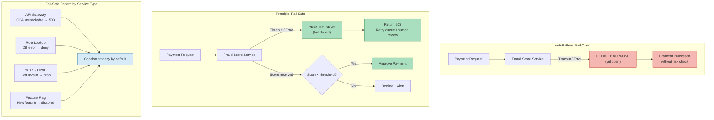

# Fail-Safe Defaults

Status: Draft | Last Reviewed: 2026-05-09 | Owner: @ciso-delegate
Catalog ID: PRIN-010 | Radii
Tier Applicability: T0, T1, T2, T3

## Problem Statement

- Payment authorisation systems that "default to approve" when upstream fraud-scoring services are unreachable allow transactions through without risk assessment — the exact moment an attacker may deliberately overwhelm the scoring service to execute fraudulent payments.
- API gateways and service meshes that fail open when the IAM or OPA policy engine is unavailable silently remove the authorisation layer from every request, granting unauthenticated callers production access without any visible alarm.
- Feature flags in banking products are frequently introduced with a "disabled unless active" assumption, then misconfigured at deployment with permissive defaults — releasing unfinished or unvalidated features to customers in production.
- Account and role permission lookups that fall back to a "grant access" state on database error cause privilege escalation during infrastructure incidents, precisely when threat actors are most likely to probe boundaries.
- Certificate validation failures for DPoP tokens and mTLS connections that are silently accepted instead of dropped open a channel for connection-level impersonation that is invisible to application-layer audit logs.
- Spring Security configurations that omit an explicit `.anyRequest()` rule inherit framework defaults that vary across versions; without an explicit `.denyAll()` sentinel new endpoints are inadvertently exposed as each route is added.

## Solution / Principle Statement

When a system component is uncertain, degraded, or lacks sufficient information to make a safe decision, it must default to the most restrictive state available — denial, rejection, or disconnection — rather than the most convenient permissive state.



### Core Rules

1. **Deny on uncertainty.** Any service that cannot obtain the information required to make an authorisation or risk decision — whether due to timeout, service unavailability, or malformed response — must reject the request and surface a retriable error, not silently approve.
2. **Feature flags start disabled.** Every new banking feature, API endpoint, and configuration flag is committed in the off/disabled/restricted state. Activation requires an explicit operational action; the deployed artefact must never be the enabling event.
3. **Spring Security `.anyRequest().denyAll()` is mandatory.** Every Spring Security filter chain configuration must terminate with `.anyRequest().denyAll()` as the final catch-all rule. Omitting this rule or using `.permitAll()` as a fallback is a blocking finding in every security review.
4. **Certificate and token failures terminate the connection.** DPoP proof validation failures, mTLS certificate validation failures, and JWT signature failures must result in immediate connection termination or 401 response. Silent downgrade to a less secure channel is prohibited.
5. **Fail-safe state must be observable.** Every fail-closed decision must emit a structured log event and increment a named Micrometer counter (`fail_safe_deny_total` labelled by `service`, `reason`, and `tier`) so that operations teams can distinguish planned denials from degradation signals.

## Implementation Guidelines

### 1. Payment Authorisation: Deny When Fraud Score Is Unreachable

The fraud scoring client wraps the remote call in a resilience4j circuit breaker. The fallback function does not return a default "safe" score — it throws a checked exception that the payment service maps to HTTP 503 with a Retry-After header.

```java
@Service
public class FraudScoringClient {

    private final CircuitBreaker circuitBreaker;
    private final MeterRegistry meterRegistry;

    public FraudScore score(PaymentContext ctx) {
        return circuitBreaker.executeSupplier(
            () -> fraudScoringApi.evaluate(ctx),
            throwable -> failSafe(ctx, throwable)   // fallback
        );
    }

    private FraudScore failSafe(PaymentContext ctx, Throwable cause) {
        // Never return a permissive default score.
        meterRegistry.counter("fail_safe_deny_total",
            "service", "fraud-scoring",
            "reason",  cause.getClass().getSimpleName(),
            "tier",    ctx.getTier())
            .increment();
        log.warn("fraud-scoring unreachable; failing closed. correlationId={} cause={}",
            ctx.getCorrelationId(), cause.getMessage());
        throw new FraudScoringUnavailableException(
            "Fraud score unavailable — payment denied for safety. correlationId=" +
            ctx.getCorrelationId());
    }
}

// Payment service maps the exception to a safe HTTP response
@RestControllerAdvice
public class PaymentExceptionAdvice {

    @ExceptionHandler(FraudScoringUnavailableException.class)
    public ResponseEntity<ProblemDetail> handleFraudUnavailable(
            FraudScoringUnavailableException ex, HttpServletRequest req) {
        ProblemDetail detail = ProblemDetail.forStatusAndDetail(
            HttpStatus.SERVICE_UNAVAILABLE, ex.getMessage());
        detail.setProperty("retryAfterSeconds", 30);
        return ResponseEntity.status(HttpStatus.SERVICE_UNAVAILABLE)
            .header("Retry-After", "30")
            .body(detail);
    }
}
```

### 2. API Gateway: Reject When OPA Is Unreachable

The OPA gateway filter calls the OPA sidecar via HTTP. If the sidecar returns a non-200 response or times out, the filter rejects with 503. There is no bypass path and no cached "last known allow" that survives a restart.

```java
@Component
public class OpaAuthorizationFilter implements GlobalFilter, Ordered {

    private final OpaClient opaClient;
    private final MeterRegistry meterRegistry;

    @Override
    public Mono<Void> filter(ServerWebExchange exchange, GatewayFilterChain chain) {
        return opaClient.evaluate(buildInput(exchange))
            .flatMap(result -> {
                if (!result.isAllow()) {
                    return denyRequest(exchange, HttpStatus.FORBIDDEN, "opa-policy-deny");
                }
                return chain.filter(exchange);
            })
            .onErrorResume(OpaUnavailableException.class, ex -> {
                // OPA sidecar is unreachable — fail closed.
                meterRegistry.counter("fail_safe_deny_total",
                    "service", "api-gateway",
                    "reason",  "opa-unreachable",
                    "tier",    "T0").increment();
                log.error("OPA unreachable; rejecting request. path={} correlationId={}",
                    exchange.getRequest().getPath(),
                    exchange.getRequest().getHeaders().getFirst("X-Correlation-ID"));
                return denyRequest(exchange, HttpStatus.SERVICE_UNAVAILABLE, "opa-unreachable");
            });
    }

    private Mono<Void> denyRequest(ServerWebExchange ex, HttpStatus status, String reason) {
        ex.getResponse().setStatusCode(status);
        ex.getResponse().getHeaders().add("X-Deny-Reason", reason);
        return ex.getResponse().setComplete();
    }

    @Override
    public int getOrder() { return -1; }  // Before all other filters
}
```

### 3. Spring Security: `.anyRequest().denyAll()` Sentinel

Every service security configuration must follow this pattern. The `denyAll()` sentinel is the last rule and is checked in CI via a custom ArchUnit test.

```java
@Configuration
@EnableMethodSecurity
public class ServiceSecurityConfig {

    @Bean
    public SecurityFilterChain filterChain(HttpSecurity http) throws Exception {
        http
            .sessionManagement(sm ->
                sm.sessionCreationPolicy(SessionCreationPolicy.STATELESS))
            .csrf(AbstractHttpConfigurer::disable)
            .oauth2ResourceServer(oauth2 ->
                oauth2.jwt(Customizer.withDefaults()))
            .authorizeHttpRequests(auth -> auth
                // Public health probe — no auth
                .requestMatchers("/actuator/health/liveness").permitAll()
                .requestMatchers("/actuator/health/readiness").permitAll()
                // Business endpoints — explicit scope per operation
                .requestMatchers(HttpMethod.POST, "/api/v1/payments/**")
                    .hasAuthority("SCOPE_payment:write")
                .requestMatchers(HttpMethod.GET,  "/api/v1/accounts/**")
                    .hasAuthority("SCOPE_account:read")
                // SENTINEL: deny everything not explicitly permitted above.
                // This line is required by PRIN-010 and checked by ArchUnit.
                .anyRequest().denyAll()
            );
        return http.build();
    }
}
```

```java
// ArchUnit enforcement — runs in every service's test suite
@AnalyzeClasses(packages = "vn.techcombank")
class FailSafeDefaultsArchTest {

    @ArchTest
    static final ArchRule anyRequestDenyAllRequired = noClasses()
        .that().areAnnotatedWith(Configuration.class)
        .and().implement(SecurityFilterChain.class)
        .should().callMethod(
            AuthorizeHttpRequestsConfigurer.AuthorizationManagerRequestMatcherRegistry.class,
            "anyRequest")
        // Verify the chained call is denyAll, not permitAll
        .because("PRIN-010: every SecurityFilterChain must terminate with .anyRequest().denyAll()");
}
```

### 4. Account Role Lookup: Deny on Database Error

The role resolver must not return a permissive default when the permission store is unavailable. A `DataAccessException` is mapped to an access-denied outcome, not a best-effort cached role set.

```java
@Component
public class RolePermissionResolver {

    private final PermissionRepository permissionRepository;
    private final MeterRegistry meterRegistry;

    /**
     * Returns the resolved permission set for the principal.
     * If the permission store is unavailable, throws AccessDeniedException (fail closed).
     * Never returns a default "allow-all" permission set.
     */
    public PermissionSet resolve(String principalId, String tenantId) {
        try {
            return permissionRepository.findByPrincipalAndTenant(principalId, tenantId)
                .orElseThrow(() -> new AccessDeniedException(
                    "No permissions found for principal " + principalId));
        } catch (DataAccessException ex) {
            meterRegistry.counter("fail_safe_deny_total",
                "service", "role-resolver",
                "reason",  "db-unavailable",
                "tier",    "T0").increment();
            log.error("Permission store unavailable; denying access. principal={} correlationId={}",
                principalId, MDC.get("correlationId"));
            // Do NOT return a default permissive role set.
            throw new AccessDeniedException(
                "Permission store unavailable — access denied for safety");
        }
    }
}
```

### 5. Feature Flags: New Features Disabled by Default

Feature flag configuration in `application.yml` always ships with the feature disabled. Activation is an explicit operational decision applied through the config pipeline — not a code change.

```yaml
# application.yml — committed to source control
# New features must be introduced with enabled: false
features:
  instalment-loans:
    enabled: false           # PRIN-010: disabled until explicit activation
    allowed-tiers: []        # Empty — no tier receives the feature at deploy time
  napas-instant-credit:
    enabled: false
    allowed-tiers: []

# Activation is done via config pipeline override, never by changing this file's default:
# features.instalment-loans.enabled=true
# features.instalment-loans.allowed-tiers=T1,T2
```

```java
@Service
public class FeatureFlagService {

    @Value("${features.instalment-loans.enabled:false}")  // Safe default
    private boolean instalmentLoansEnabled;

    public boolean isInstalmentLoansAvailable(CustomerContext ctx) {
        // Default value is false — Spring returns false if property is absent.
        if (!instalmentLoansEnabled) {
            log.debug("instalment-loans feature flag disabled. customerId={}", ctx.getCustomerId());
            return false;
        }
        return allowedTiers.contains(ctx.getTier());
    }
}
```

## When to Apply

- Any service that calls a remote dependency as a prerequisite to authorisation (fraud scoring, IAM, OPA, KYC status).
- Any Spring Boot service that exposes HTTP endpoints — the `.anyRequest().denyAll()` rule applies universally.
- All feature flag introductions, regardless of tier — new flags ship disabled.
- All mobile and web clients performing certificate pinning or DPoP token validation.
- Any configuration or infrastructure component where the "misconfigured" state is more permissive than the "correct" state (e.g., S3 bucket ACLs, Kafka topic ACLs, Kubernetes RBAC bindings).

## When to Make an Exception

Exceptions to fail-safe defaults require a documented Architecture Decision Record (ADR) and approval from the CISO delegate before the service reaches production.

| Scenario | Condition for Exception | Required Approvals |
|---|---|---|
| Read-only public data endpoint | Endpoint serves only non-sensitive, publicly available information (e.g., branch locator, FX rates) and carries no authentication context | Tech Lead + Domain Architect |
| Cached permission set for resilience | A local, short-TTL permission cache (max 60 seconds) may serve during a transient DB blip — but the cache must itself have been populated by a deny-by-default resolver and must expire to deny, not to allow | CISO Delegate + Security Review |
| Balance enquiry in degraded mode | Authenticated read of a customer's own account balance may be served from a read replica during primary failure — scope is limited to read, tenant-isolated, and rate-limited | CISO Delegate + incident change record |

No exception permits a payment to be authorised, a privilege to be granted, or a connection to be accepted when the system lacks the evidence needed to make that decision safely.

## Checklist

- [ ] Every `SecurityFilterChain` bean terminates with `.anyRequest().denyAll()`
- [ ] ArchUnit test `FailSafeDefaultsArchTest` exists in the service test suite and passes in CI
- [ ] All circuit breaker fallback functions throw exceptions — none return permissive default values
- [ ] `fail_safe_deny_total` counter is emitted for every fail-closed decision, labelled by `service` and `reason`
- [ ] Feature flags introduced in this change ship with `enabled: false` in `application.yml`
- [ ] DPoP and mTLS validation failures are wired to connection termination, not silent downgrade
- [ ] Permission resolver does not cache a permissive default — cache expiry resolves to deny
- [ ] Runbook entry added for each new fail-closed path so on-call can distinguish safety denials from bugs
- [ ] Exception documented in ADR if any permissive fallback is intentional

## NFR Acceptance Criteria

```yaml
service_name: "payment-service-fail-safe-compliance"
tier: T0
acceptance_criteria:
  - id: FSD-1
    description: >
      When the fraud scoring service is unreachable (circuit open or timeout),
      the payment service returns HTTP 503 with Retry-After header within 500ms.
      No payment is approved without a fraud score.
    verification: >
      Chaos test: stop the fraud-scoring pod; send 100 payment requests;
      assert all return 503; assert fail_safe_deny_total increments by 100;
      assert zero payments appear in the payment ledger.

  - id: FSD-2
    description: >
      When the OPA sidecar is unreachable, the API gateway rejects 100% of
      authorisation-bearing requests with HTTP 503 within 200ms.
    verification: >
      Integration test with OPA container stopped; assert no request returns
      2xx; assert opa-unreachable label on fail_safe_deny_total metric.

  - id: FSD-3
    description: >
      Every SecurityFilterChain in every T0/T1 service terminates with
      .anyRequest().denyAll(). Verified by ArchUnit in CI — build fails if
      any chain omits the sentinel.
    verification: >
      Run `./mvnw test -pl :arch-tests` in CI; assert zero ArchUnit violations
      across all service modules.

  - id: FSD-4
    description: >
      All feature flags introduced in a release ship with enabled=false.
      No new flag defaults to true in application.yml or any environment
      override committed to source control.
    verification: >
      CI lint step: grep -r "enabled: true" src/main/resources/application*.yml
      for any flag introduced in this release; assert zero matches.
```

## Compliance Mapping

| Layer | Reference | Section / Control | How this principle satisfies |
|---|---|---|---|
| Ring 0 (global) | NIST SP 800-160 Vol 1 | §3.3.2 — Secure Defaults | PRIN-010 operationalises the "secure-state preservation" concept: every failure mode is mapped to the most restrictive safe state before implementation |
| Ring 0 (global) | OWASP Top 10 2021 | A05 — Security Misconfiguration | `.anyRequest().denyAll()` sentinel and disabled-by-default feature flags directly close the misconfiguration vectors described in A05 |
| Ring 0 (global) | OWASP ASVS 4.0 | V4.1.3 — Deny by Default | ASVS requires that access control denies all access by default; this principle mandates that requirement in every Spring Security configuration |
| Ring 1 (international banking) | PCI-DSS v4.0 | §6.2 — Bespoke and Custom Software Security | PCI-DSS §6.2 requires secure defaults in software; PRIN-010 provides the engineering pattern that satisfies this for all cardholder data environment services |
| Ring 1 (international banking) | PCI-DSS v4.0 | §7.2 — Access Control Systems | Deny-by-default role resolution and permission lookup directly implement PCI-DSS §7.2 access control policy requirements |
| Ring 2 (Vietnam) | SBV Circular 09/2020 §III — Access Control | Article 12 — Privileged Access | Fail-closed permission resolution prevents privilege escalation during infrastructure incidents, satisfying §III access control requirements ⚠️ (working summary — pending Legal review) |

## Cost / FinOps Notes

- The primary cost of NOT following PRIN-010 is regulatory: a single fraudulent transaction approved because the fraud-scoring service was unreachable can trigger SBV investigation, PCI-DSS audit escalation, and customer liability — costs that dwarf any operational savings from fail-open defaults.
- Circuit breakers that fail closed increase the frequency of 503 responses during dependency degradation. Operations teams must size retry queues and human-review queues to absorb this traffic. Budget approximately 0.5 FTE of on-call capacity to tune thresholds so that fail-safe denials do not overwhelm review queues during normal transient outages.
- Fail-closed OPA calls add no marginal cost when OPA runs as a pod sidecar — the latency budget is already allocated under PRIN-008. The cost of a remote OPA call (shared service model) is approximately 3–8ms p95; the cost of a timeout and fail-closed response is the circuit-breaker open duration (typically 30 seconds of retry backoff), which must be accounted for in downstream SLA commitments.
- ArchUnit tests add under 5 seconds to the build time across a 20-service monorepo. This is a fixed cost that prevents the unbounded remediation cost of discovering missing `.denyAll()` sentinels during a penetration test or SBV audit.

## Threat Model Summary

STRIDE: Spoofing, Elevation of Privilege, Information Disclosure

- **Top threats addressed:**
  - Elevation of Privilege via degraded authorisation: an attacker deliberately overwhelms the OPA or IAM service to bypass authorisation checks — fail-closed API gateway eliminates this attack surface.
  - Spoofing via certificate downgrade: a man-in-the-middle suppresses mTLS certificate validation errors to inject itself into a service mesh connection — mandatory connection termination on cert failure closes this path.
  - Information Disclosure via permissive feature flag defaults: an unfinished banking feature shipped in a permissive default state exposes incomplete business logic or data access paths — disabled-by-default flags eliminate this exposure.
- **Residual risks:**
  - A locally cached permission set that has not yet expired may grant access to a principal whose permissions were revoked within the TTL window. Mitigated by keeping the TTL at or below 60 seconds and wiring revocation events to cache invalidation via Kafka.
  - A misconfigured circuit breaker threshold that is set too low may cause excessive fail-closed responses during normal transient latency spikes, creating an availability issue that operations teams may be tempted to resolve by raising the threshold unsafely. Mitigated by requiring CISO Delegate approval for any circuit breaker threshold change on T0 services.

## Operational Runbook (stub)

1. **Alert: `fail_safe_deny_total` spike** — If the counter increases by more than 500 denials per minute on any single `service`/`reason` label pair, page the on-call engineer. Investigate whether the upstream dependency (fraud scoring, OPA, permission DB) is genuinely degraded or whether the circuit breaker threshold is miscalibrated.
2. **Investigate upstream dependency** — Use the service's dependency health dashboard to confirm whether the upstream is returning errors or timeouts. If the upstream is healthy, check for a misconfigured circuit breaker threshold or a network policy change.
3. **If upstream is genuinely degraded** — Follow the upstream service's runbook (e.g., SEC-010 for OPA, RES-002 for circuit breaker). Do not lower the fail-safe threshold; restore the upstream instead.
4. **If a payment batch is stuck in fail-closed state** — Escalate to the payment operations team to route affected transactions to the human review queue. Do not bypass the fail-safe control to unblock the batch.
5. **Validate `.denyAll()` sentinel after a Spring Security upgrade** — After any Spring Security version upgrade, run `./mvnw test -pl :arch-tests` and manually review the effective filter chain using Spring Security's `logging.level.org.springframework.security=TRACE` on a staging environment before deploying to production.
6. **Feature flag activation** — To enable a new feature, apply the override through the config pipeline (not by editing `application.yml`). Verify the flag is active on one T3 (non-production) environment for at least one business day before activating on T0.

## Test Strategy (stub)

- **Unit:** Test each circuit breaker fallback to confirm it throws an exception rather than returning a value. Test `RolePermissionResolver` with a mock that throws `DataAccessException` and assert `AccessDeniedException` is raised. Test `FeatureFlagService` with the property absent — assert the feature is disabled.
- **Integration:** Chaos test using Testcontainers: stop the OPA container and assert the API gateway returns 503 for every subsequent request. Stop the fraud-scoring container and assert zero payments are written to the ledger. Use Spring Security Test's `@WithMockUser` to verify that a request to an unmapped path returns 403 (denyAll sentinel active).
- **Security / Compliance:** ArchUnit test suite run in CI on every pull request targeting `main`. OWASP ZAP scan of staging environment — verify that no endpoint returns 200 for an unauthenticated request except the declared health probes. Penetration test scenario: deliberately induce circuit-open state for fraud scoring and attempt payment — assert all are rejected and logged.

## Related Patterns / Principles

- [PRIN-008 Defense-in-Depth](defense-in-depth.md) — fail-safe defaults are the per-layer failure mode for the six-layer stack
- [PRIN-003 Zero-Trust Security](zero-trust-security.md) — zero-trust assumes breach; fail-safe defaults operationalise that assumption at the component level
- [SEC-002 OAuth2/OIDC Authorization](../patterns/security/oauth2-authorization.md) — JWT validation failure must terminate the request per PRIN-010
- [SEC-010 ABAC Policy Engine](../patterns/security/attribute-based-access-control.md) — OPA unreachable state maps to fail-closed per PRIN-010
- [RES-002 Circuit Breaker](../patterns/resilience/circuit-breaker.md) — circuit breaker fallback functions must implement PRIN-010 semantics

## References

- NIST SP 800-160 Vol 1 — Systems Security Engineering, §3.3 Trustworthiness
- OWASP Top 10 2021 — A05 Security Misconfiguration
- OWASP Application Security Verification Standard (ASVS) 4.0 — V4 Access Control
- PCI-DSS v4.0 — Requirement 6.2 (Secure Software Development), Requirement 7.2 (Access Control)
- SBV Circular 09/2020 on Information Security in Banking — §III Access Control
- Saltzer, J. H. & Schroeder, M. D. (1975) — "The Protection of Information in Computer Systems" — original formulation of the fail-safe defaults principle

---
**Key Takeaway**: When Techcombank systems cannot obtain the evidence needed for a safe decision, they must deny — a declined payment or a 503 is always cheaper than an approved fraudulent transaction or an unintended access grant.
