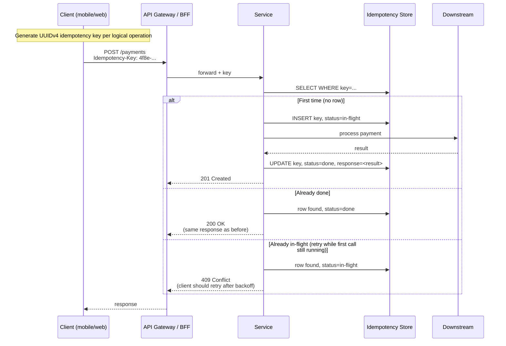

# Idempotency-by-default

Status: Draft | Last Reviewed: 2026-05-09 | Owner: @ea-board
Catalog ID: PRIN-006 | **Spine**
Tier Applicability: T0, T1, T2 (T3 may waive with explicit EA-Board approval)

## Problem Statement

Distributed systems retry. Networks blip. Mobile clients re-submit on unclear states. Without idempotency, every retry risks a duplicate ledger posting, a duplicate KYC record, a double-charge — failures that are visible to customers, regulators, and auditors. In a banking context, "process this payment exactly once" must hold under arbitrary retry topologies including:

- Mobile client retrying a slow `POST /payments`
- Backend service retrying a saga step after a transient failure
- Kafka consumer reprocessing after a rebalance
- DR failover replaying tail events from the standby

## Context

Reach for this principle whenever:

- Authoring a write API (POST/PUT/DELETE/PATCH).
- Authoring a Kafka / message-queue consumer.
- Authoring a saga step (INT-001) or outbox processor (INT-002).
- Designing a payment, ledger, or KYC flow.
- Reviewing a DAB submission — every write path must declare its idempotency strategy.

## Solution

Every write path in a Techcombank service MUST be idempotent. There are two enforcement strategies, used in combination:



### Strategy A — Client-supplied Idempotency-Key (preferred for sync APIs)

The client generates a UUIDv4 per logical operation and sends it in an `Idempotency-Key` HTTP header. The server stores `(key, response)` in a dedupe table with TTL ≥ 24 hours. On retry, the server returns the same response without re-executing.

### Strategy B — Server-derived natural key (preferred for async / message-driven)

For message-driven flows where no client header exists, the server uses a deterministic natural key (e.g., `EndToEndId` from ISO 20022, or a hash of the message body) as the idempotency key. The Idempotent Receiver pattern (EIP-024) implements this.

### Strategy C — Conditional updates with ETag / version

For idempotent updates of resource state, the client sends `If-Match: <etag>` and the server applies the change only if the version matches. This makes the operation naturally idempotent.

## Implementation Guidelines

### Java / Spring Boot — annotation-driven idempotency

```java
package com.techcombank.platform.idempotency;

import java.lang.annotation.*;
import java.time.Duration;

/** Marker to make a Spring controller method idempotent.
 *  Backed by IdempotencyAspect which intercepts, checks the dedupe store,
 *  and replays the cached response if the key has been seen. */
@Target(ElementType.METHOD)
@Retention(RetentionPolicy.RUNTIME)
public @interface Idempotent {
    /** TTL of the dedupe entry. Must be >= the longest plausible retry window. */
    long ttlHours() default 24;
    /** Header name supplying the key. */
    String header() default "Idempotency-Key";
    /** If true, return 409 Conflict for in-flight; if false, block and wait. */
    boolean failOnInFlight() default true;
}

@RestController
public class PaymentController {

    @PostMapping("/payments")
    @Idempotent(ttlHours = 24)
    @LatencyBudget(tier = "T0", p50Millis = 50, p95Millis = 200, p99Millis = 500)
    public ResponseEntity<PaymentResult> authorise(
            @RequestBody PaymentRequest req,
            @RequestHeader("Idempotency-Key") String idempotencyKey) {
        // method body executes only on first request with this key
        return ResponseEntity.ok(service.authorise(req));
    }
}
```

### Aspect implementation (single source of truth)

```java
@Aspect
@Component
public class IdempotencyAspect {

    private final IdempotencyStore store;
    private final ObjectMapper mapper;

    @Around("@annotation(idempotent)")
    public Object handle(ProceedingJoinPoint pjp, Idempotent idempotent) throws Throwable {
        String key = currentRequest().getHeader(idempotent.header());
        if (key == null || key.isBlank()) {
            throw new BadRequest("Missing " + idempotent.header());
        }

        Optional<DedupeEntry> existing = store.find(key);
        if (existing.isPresent()) {
            DedupeEntry e = existing.get();
            return switch (e.status()) {
                case DONE -> mapper.readValue(e.responseJson(), pjp.getSignature().getReturnType());
                case IN_FLIGHT -> throw new Conflict("Request " + key + " is in flight");
                case FAILED -> throw new BadRequest("Request " + key + " failed previously");
            };
        }

        store.put(key, DedupeEntry.inFlight(Duration.ofHours(idempotent.ttlHours())));
        try {
            Object result = pjp.proceed();
            store.put(key, DedupeEntry.done(mapper.writeValueAsString(result),
                                            Duration.ofHours(idempotent.ttlHours())));
            return result;
        } catch (Throwable t) {
            store.put(key, DedupeEntry.failed(t.getMessage(),
                                              Duration.ofHours(idempotent.ttlHours())));
            throw t;
        }
    }
}
```

### Dedupe store schema (PostgreSQL)

```sql
CREATE TABLE idempotency_keys (
    key             VARCHAR(64)  PRIMARY KEY,
    status          VARCHAR(16)  NOT NULL CHECK (status IN ('IN_FLIGHT','DONE','FAILED')),
    response_json   JSONB,
    error_message   TEXT,
    created_at      TIMESTAMPTZ  NOT NULL DEFAULT now(),
    expires_at      TIMESTAMPTZ  NOT NULL
);
CREATE INDEX idempotency_keys_expires_at ON idempotency_keys (expires_at);

-- background purge (or use pg_cron)
DELETE FROM idempotency_keys WHERE expires_at < now();
```

### T24 / legacy integration

Mainframe T24 integration via OFS bridge: the bridge layer maintains the idempotency key in the OFS request `keyId` field. Duplicate detection at the bridge prevents double-posting to T24 ledger. Reversal records use the same key (so a reversal of an already-reversed posting is itself idempotent).

### React + TypeScript — client-side key generation

```typescript
// src/lib/api.ts
import { v4 as uuid } from 'uuid';

interface IdempotentRequestOptions extends RequestInit {
    operationId?: string;   // override for retries — same key on retry
}

export async function idempotentPost<T>(url: string, body: unknown, opts: IdempotentRequestOptions = {}): Promise<T> {
    const key = opts.operationId ?? uuid();
    const headers = new Headers(opts.headers);
    headers.set('Idempotency-Key', key);
    headers.set('Content-Type', 'application/json');

    const res = await fetch(url, { ...opts, method: 'POST', body: JSON.stringify(body), headers });
    if (!res.ok) throw new Error(`HTTP ${res.status}`);
    return res.json();
}

// usage with retry — SAME key across attempts
async function authorisePayment(req: PaymentRequest) {
    const key = uuid();   // generated ONCE, kept across retries
    return retry(() => idempotentPost('/payments', req, { operationId: key }), { attempts: 3, backoff: 'exponential' });
}
```

### iOS Swift — client-side key generation

```swift
import Foundation

struct PaymentClient {
    let session: URLSession

    func authorise(_ payment: Payment, idempotencyKey: UUID = UUID()) async throws -> AuthResult {
        var req = URLRequest(url: URL(string: "https://api.techcombank.vn/payments")!)
        req.httpMethod = "POST"
        req.setValue(idempotencyKey.uuidString, forHTTPHeaderField: "Idempotency-Key")
        req.setValue("application/json", forHTTPHeaderField: "Content-Type")
        req.httpBody = try JSONEncoder().encode(payment)

        let (data, _) = try await session.data(for: req)
        return try JSONDecoder().decode(AuthResult.self, from: data)
    }
}

// retry with the SAME key
let key = UUID()
for attempt in 0..<3 {
    do {
        return try await client.authorise(payment, idempotencyKey: key)
    } catch let error where attempt < 2 {
        try await Task.sleep(nanoseconds: UInt64(pow(2.0, Double(attempt)) * 1_000_000_000))
    }
}
```

### Android Kotlin — client-side key generation

```kotlin
import java.util.UUID
import okhttp3.*

class PaymentClient(private val client: OkHttpClient) {

    suspend fun authorise(payment: Payment, idempotencyKey: UUID = UUID.randomUUID()): AuthResult {
        val req = Request.Builder()
            .url("https://api.techcombank.vn/payments")
            .header("Idempotency-Key", idempotencyKey.toString())
            .header("Content-Type", "application/json")
            .post(Json.encodeToString(payment).toRequestBody())
            .build()

        val response = client.newCall(req).execute()
        if (!response.isSuccessful) throw IOException("HTTP ${response.code}")
        return Json.decodeFromString(response.body!!.string())
    }
}
```

## Variants & Trade-offs

| Variant | Use when | Trade-off |
|---|---|---|
| **Strict idempotency** (Strategy A, header required, 24h TTL) | Default for sync APIs | Requires client cooperation; key collision risk if clients reuse keys |
| **Best-effort dedupe** (Strategy A but server uses request-hash if header missing) | Tolerant of legacy clients | Hashing cost; risk of false-positive dedupe if request body is non-deterministic |
| **Conditional update** (Strategy C, ETag / If-Match) | Updates of resource state | Requires server to maintain version; only suitable for state mutations |
| **Natural-key dedupe** (Strategy B) | Async / message-driven; Idempotent Receiver (EIP-024) | Depends on a deterministic natural key; otherwise needs extra coordination |

## NFR Acceptance Criteria

- **HA**: idempotency is a prerequisite for any retry, which is a prerequisite for HA. Without it, retries cause data corruption.
- **HP**: dedupe-store lookup adds 1–2 ms P95 (cache-hit path). Acceptable within T0 budgets per [NFR-002](../nfr/latency-budget-model.md).
- **HR**: enables safe replay of tail events from DR standby; safe consumer-rebalance recovery.

## Compliance Mapping

| Layer | Reference | Section/Control | How this satisfies |
|---|---|---|---|
| Ring 0 (generic) | NIST SP 800-53 SC-23 (Session Authenticity) | Authenticate session uniqueness | Idempotency keys provide unique-operation semantics |
| Ring 0 (generic) | EIP §10.1 (Hohpe/Woolf) — Idempotent Receiver | Pattern catalog defining idempotent message handling | EIP-024 is the messaging-side implementation of this principle |
| Ring 1 (international banking) | Basel BCBS 239 — Principle 3 (Accuracy) | Risk data must be accurate; aggregation must avoid double-counting | Idempotent posting prevents duplicate ledger entries → accurate risk-data aggregation |
| Ring 1 (international banking) | ISO 20022 — `EndToEndId` | Each message carries a unique end-to-end identifier | Used as the natural key for Strategy B (server-derived) |
| Ring 2 (Vietnam) | SBV Circular 09/2020 §IV.2; Decree 13/2023 | Operational continuity and personal data processing integrity ⚠️ (working summary — pending Legal review) | Required behaviour for retried transactions during EOD batch and network instability; idempotent processing prevents duplicate personal data records |

## Cost / FinOps Notes

| Item | Cost driver | Order of magnitude |
|---|---|---|
| Dedupe-store storage (PostgreSQL) | rows × payload size × TTL | Negligible (~$50/month at 10M ops/day, 24h TTL) |
| Dedupe-store latency overhead | extra DB round-trip per request | Hidden by cache; ~1ms P95 |
| Background purge job | one cron, low CPU | Negligible |

**Levers**:
- Use Redis instead of PostgreSQL for dedupe at high RPS (latency and cost win).
- Tune TTL to actual retry window; 24h is generous for most sync APIs.

**Cost of NOT being idempotent**: a single duplicate-payment incident in Vietnam triggers SBV reporting, customer goodwill payments, possible regulatory fines, and engineering time-to-recover that vastly exceeds any dedupe-store cost over years.

## Threat Model Summary

STRIDE: idempotency primarily addresses **Repudiation** and **Tampering**.

- **Top 3 threats addressed**:
  1. *Replay attacks* (Tampering) — same key returns same response, no double-effect. Combined with HMAC of the idempotency key (anti-forgery), defends against replay.
  2. *Race-condition double-posting* (Repudiation) during fail-fast retry — IN_FLIGHT state with 409 prevents the second concurrent attempt from re-executing.
  3. *Tail-event duplicate* on DR failover (Repudiation) — replayed events with same natural key are silently absorbed.
- **Top 3 residual threats**:
  1. *Idempotency-key forgery* (Spoofing) — attacker sends another user's key. Mitigation: bind key to user/session via HMAC; reject mismatched keys.
  2. *Key collision leading to information disclosure* (Information Disclosure) — clients reusing keys across operations is the real risk. Mitigation: client-side review at code-review; CI lint that flags hardcoded UUIDs.
  3. *TTL-too-short* causing a real retry to be treated as new (Denial of Service). Mitigation: 24h default; tunable per endpoint.

## Operational Runbook (stub)

- **Alerts**:
  - **Alert: IdempotencyDedupeRate** — % of requests served from dedupe cache. Sustained anomaly (>10% sudden change) → investigate client retry logic. Severity: Warning.
  - **Alert: IdempotencyInFlightCount** — count of IN_FLIGHT entries older than 60 s. Severity: Critical (suggests stuck request or crashed handler).
- **Dashboards**: Grafana — `idempotency-overview` (rate, dedupe %, store size, in-flight count).
- **Recovery**: stale IN_FLIGHT rows older than 60 s can be force-failed; subsequent retries with same key will re-execute.

## Test Strategy (stub)

- **Unit**: `IdempotencyAspect` test — same key returns cached response.
- **Integration**: send same payment 3× with same key → only one ledger row.
- **Contract**: client SDKs assert `Idempotency-Key` header is present on all POST/PUT/DELETE.
- **Chaos**: kill service mid-request (between IN_FLIGHT and DONE write); retry with same key — verify behaviour matches contract (rerun or fail-with-409).

## When to Use

- **Always** on POST/PUT/DELETE/PATCH endpoints of T0, T1, T2 services.
- **Always** on Kafka / message-queue consumers (use Strategy B + EIP-024).
- **Always** on saga compensations (INT-001) and outbox processors (INT-002).

## When NOT to Use

- Pure GET / read endpoints (already idempotent by HTTP semantics).
- T3 internal tooling (with explicit EA-Board waiver).
- Operations that genuinely cannot be made idempotent (extremely rare; flag at DAB).

## Related Patterns

- [EIP-024 Idempotent Receiver](../patterns/eip/idempotent-receiver.md) — messaging-side implementation
- [EIP-025 Dead Letter Channel](../patterns/eip/dead-letter-channel.md) — handles non-idempotent failures
- [INT-001 Saga Orchestration](../patterns/integration/saga-orchestration.md) — saga steps require idempotency
- [INT-002 Transactional Outbox + CDC](../patterns/integration/cdc-outbox-pattern.md) — outbox publish requires idempotency
- [RES-002 Circuit Breaker](../patterns/resilience/circuit-breaker.md) — fail-fast on duplicate detection
- [RES-003 Retry with Backoff](../patterns/resilience/retry-with-backoff.md) — retries assume idempotency
- [BSP-002 Idempotent Payment Key](../patterns/banking-solutions/idempotent-payment-key.md) — banking-specific application

## References

- Hohpe, G. & Woolf, B. — Enterprise Integration Patterns Chapter 10 (Idempotent Receiver)
- Stripe API Idempotency: <https://stripe.com/docs/api/idempotent_requests>
- IETF draft-ietf-httpapi-idempotency-key-header
- ISO 20022 EndToEndId definition
- `_research-notes.md` §EIP §Microservices.io §Resilience4j

---

**Key Takeaway**: Every write API and every message consumer is idempotent. Client supplies an Idempotency-Key on retries; server stores (key, response) for ≥24h. Without this principle, no other resilience pattern is safe to apply.
