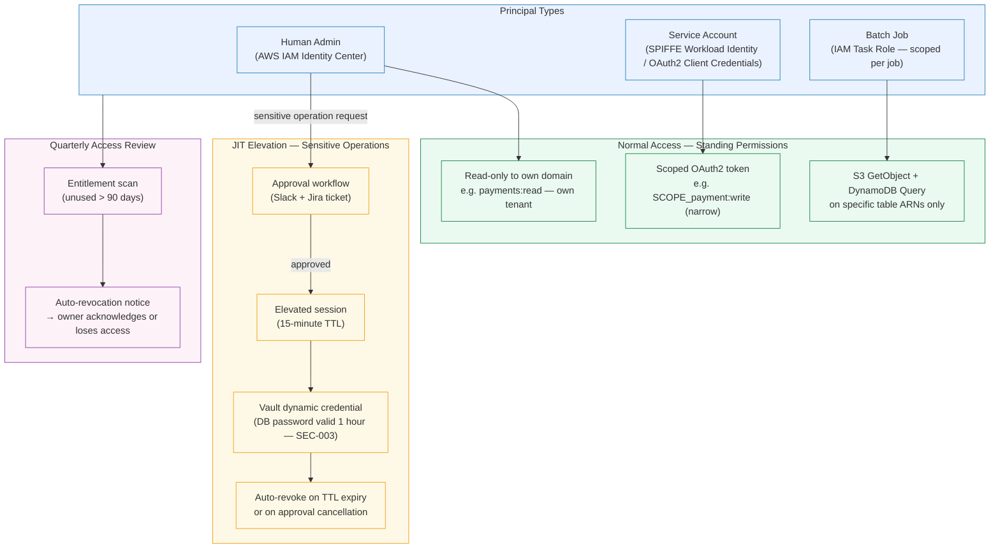

# Least-Privilege

Status: Draft | Last Reviewed: 2026-05-09 | Owner: @ciso-delegate
Catalog ID: PRIN-011 | Radii
Tier Applicability: T0, T1, T2, T3

## Problem Statement

- Over-granted permissions are the most common attack-surface enabler in banking platforms: a compromised service or human account with standing broad access allows an attacker to pivot across systems without needing to escalate privileges further.
- Permanent standing privileges for database administrators and payment operators violate PCI-DSS Requirement 7 and NIST AC-6; they also create insider-threat risk where a disgruntled employee can exfiltrate customer data or manipulate transactions undetected.
- T24 core banking OFS roles are coarse-grained by legacy design; without an explicit least-privilege mapping layer, modern services inherit T24's broad role set and expose unnecessary operations to any authenticated caller.
- Payment-initiation scope must be narrower than account-read scope — a service that can read balances must not implicitly be able to initiate transfers. Without explicit OAuth2 scope design, implicit scope inheritance creates privilege creep across microservices.

## Solution

Apply default-deny IAM across every principal type — human, service, and batch. Use just-in-time (JIT) elevation for sensitive operations with automatic revocation. Enforce scoped OAuth2 tokens per operation, not per service.



## Implementation Guidelines

### 1. Spring Security Method-Level Authorization with SpEL

```java
@Configuration
@EnableMethodSecurity(prePostEnabled = true)
public class MethodSecurityConfig {
    // @PreAuthorize annotations are active globally
}

@Service
public class PaymentService {

    // Only a service with payment:write scope for the exact tenant can initiate
    @PreAuthorize("""
        hasAuthority('SCOPE_payment:write')
        and #request.tenantId == authentication.token.claims['tenant_id']
        and !authentication.token.claims['roles'].contains('READONLY')
        """)
    public PaymentResult initiatePayment(PaymentRequest request) {
        return processInternal(request);
    }

    // account:read is sufficient to read balance, but NOT to initiate payment
    @PreAuthorize("""
        hasAuthority('SCOPE_account:read')
        and #accountId.startsWith(authentication.token.claims['tenant_id'])
        """)
    public AccountBalance getBalance(String accountId) {
        return balanceRepository.findByAccountId(accountId);
    }

    // Payment reversal requires an elevated scope — not granted by default
    @PreAuthorize("hasAuthority('SCOPE_payment:reverse') and hasRole('ROLE_OPERATIONS')")
    @PostAuthorize("returnObject.tenantId == authentication.token.claims['tenant_id']")
    public PaymentResult reversePayment(String paymentId) {
        return reversalService.reverse(paymentId);
    }
}
```

### 2. OAuth2 Scope Design — Narrow Scopes per Operation

```yaml
# Scope registry — each scope maps to exactly one class of operation
oauth2:
  scopes:
    account:read:      "Read own account balances and transaction history"
    account:write:     "Update account preferences (NOT initiate payments)"
    payment:initiate:  "Initiate domestic payment (NAPAS / VietQR)"
    payment:write:     "Initiate and modify pending domestic payments"
    payment:reverse:   "Reverse a completed payment (operations role only)"
    payment:swift:     "Initiate international SWIFT payment"
    admin:read:        "Read platform configuration (read-only admin)"
    admin:write:       "Modify platform configuration (change-record required)"
```

```java
// Client credentials configuration — each service requests ONLY its needed scopes
@Configuration
public class OAuth2ClientConfig {

    @Bean
    public OAuth2AuthorizedClientManager authorizedClientManager(
            ClientRegistrationRepository clients,
            OAuth2AuthorizedClientService clientService) {

        OAuth2AuthorizedClientProvider provider =
            OAuth2AuthorizedClientProviderBuilder.builder()
                .clientCredentials(c -> c.accessTokenResponseClient(
                    // Request only the scopes this service needs
                    clientCredentialsTokenResponseClient()
                ))
                .build();

        AuthorizedClientServiceOAuth2AuthorizedClientManager manager =
            new AuthorizedClientServiceOAuth2AuthorizedClientManager(clients, clientService);
        manager.setAuthorizedClientProvider(provider);
        return manager;
    }
}

// application.yml — payment-service only requests payment:initiate, NOT payment:reverse
spring:
  security:
    oauth2:
      client:
        registration:
          payment-service:
            client-id: ${PAYMENT_SERVICE_CLIENT_ID}
            client-secret: ${PAYMENT_SERVICE_CLIENT_SECRET}
            scope:
              - payment:initiate
              - account:read
            # NOT: payment:reverse, admin:write
        provider:
          techcombank-idp:
            token-uri: https://idp.techcombank.com.vn/oauth2/token
```

### 3. Vault Dynamic Database Credentials (SEC-003)

No service or human uses a static database password. Vault issues short-lived credentials that expire automatically, making credential theft time-bounded.

```java
@Configuration
public class VaultDataSourceConfig {

    @Bean
    @Primary
    public DataSource vaultManagedDataSource(VaultTemplate vault) {
        // Lease a dynamic PostgreSQL credential — valid for 1 hour
        VaultResponse response = vault.read("database/creds/payment-service-role");
        Map<String, Object> data = response.getData();

        String username = (String) data.get("username");
        String password = (String) data.get("password");
        String leaseId  = response.getLeaseId();
        long   leaseDur = response.getLeaseDuration(); // seconds

        HikariDataSource ds = new HikariDataSource();
        ds.setJdbcUrl("jdbc:postgresql://db.tcb.internal:5432/payments");
        ds.setUsername(username);
        ds.setPassword(password);
        ds.setMaximumPoolSize(20);
        // Rotate before lease expires — schedule renewal at 75% of TTL
        scheduleLeaseRenewal(leaseId, leaseDur, ds);
        return ds;
    }

    private void scheduleLeaseRenewal(String leaseId, long leaseDurationSeconds,
                                       HikariDataSource ds) {
        long renewAt = (long)(leaseDurationSeconds * 0.75);
        scheduler.schedule(() -> {
            vault.lease().renew(leaseId, leaseDurationSeconds);
            log.info("Vault DB lease renewed lease_id={}", leaseId);
        }, renewAt, TimeUnit.SECONDS);
    }
}
```

### 4. T24 OFS Role Constraints

T24 roles are coarse-grained. The ACL layer (INT-005) maps modern OAuth2 scopes to the minimum required T24 OFS user profile. The T24 OFS user for the payment service has access only to `FUNDS.TRANSFER.CREATE` and `FUNDS.TRANSFER.AUTHORISE` — not to `CUSTOMER.MAINTENANCE` or `ACCOUNT.PARAMETER`.

```java
@Service
public class T24OfsRoleMapper {

    // Modern scope → T24 OFS function allowlist
    private static final Map<String, Set<String>> SCOPE_TO_OFS_FUNCTIONS = Map.of(
        "payment:initiate", Set.of("FUNDS.TRANSFER.CREATE"),
        "payment:write",    Set.of("FUNDS.TRANSFER.CREATE", "FUNDS.TRANSFER.AMEND"),
        "payment:reverse",  Set.of("FUNDS.TRANSFER.REVERSE"),
        "account:read",     Set.of("ACCOUNT.ENQUIRY", "BALANCE.ENQUIRY")
        // NOTE: no scope maps to CUSTOMER.MAINTENANCE or ACCOUNT.PARAMETER
    );

    public Set<String> allowedOfsFunction(Collection<String> scopes) {
        return scopes.stream()
            .flatMap(s -> SCOPE_TO_OFS_FUNCTIONS.getOrDefault(s, Set.of()).stream())
            .collect(Collectors.toUnmodifiableSet());
    }

    public void assertOfsCallAllowed(String ofsFunction, Collection<String> scopes) {
        if (!allowedOfsFunction(scopes).contains(ofsFunction)) {
            throw new AccessDeniedException(
                "OFS function " + ofsFunction + " not permitted for scopes: " + scopes);
        }
    }
}
```

### 5. iOS — Entitlements Minimization (Swift)

```xml
<!-- Entitlements.plist — request only required capabilities -->
<?xml version="1.0" encoding="UTF-8"?>
<!DOCTYPE plist PUBLIC "-//Apple//DTD PLIST 1.0//EN" ...>
<plist version="1.0">
<dict>
    <!-- Network access — only required domains -->
    <key>com.apple.developer.networking.networkextension</key>
    <false/>
    <!-- Keychain sharing — only within Techcombank app group -->
    <key>keychain-access-groups</key>
    <array>
        <string>$(AppIdentifierPrefix)com.techcombank.mobile</string>
    </array>
    <!-- Push notifications — required for payment alerts -->
    <key>aps-environment</key>
    <string>production</string>
    <!-- NOT included: com.apple.developer.healthkit, contacts, camera (unless needed) -->
</dict>
</plist>
```

```swift
// Keychain access group enforcement — secrets stored in app-specific group only
class KeychainService {
    private let accessGroup = "$(AppIdentifierPrefix)com.techcombank.mobile"

    func store(key: String, value: String) throws {
        let query: [CFString: Any] = [
            kSecClass:            kSecClassGenericPassword,
            kSecAttrAccount:      key,
            kSecAttrAccessGroup:  accessGroup,    // enforce access group boundary
            kSecValueData:        value.data(using: .utf8)!,
            // Only accessible when device is unlocked — fail-secure when locked
            kSecAttrAccessible:   kSecAttrAccessibleWhenUnlockedThisDeviceOnly
        ]
        let status = SecItemAdd(query as CFDictionary, nil)
        guard status == errSecSuccess else {
            throw KeychainError.storeFailed(status)
        }
    }
}
```

### 6. Android — Permissions Minimization (Kotlin)

```xml
<!-- AndroidManifest.xml — request only permissions required for banking functionality -->
<manifest ...>
    <!-- Required: internet access for API calls -->
    <uses-permission android:name="android.permission.INTERNET" />
    <!-- Required: biometric for payment confirmation -->
    <uses-permission android:name="android.permission.USE_BIOMETRIC" />
    <!-- Required: camera for QR code scanning (VietQR) -->
    <uses-permission android:name="android.permission.CAMERA" />

    <!-- NOT requested: READ_CONTACTS, READ_SMS, ACCESS_FINE_LOCATION (unless feature-justified) -->
    <!-- If location is needed for fraud detection: use ACCESS_COARSE_LOCATION, not FINE -->
</manifest>
```

```kotlin
// Runtime permission request — camera only requested when QR scan feature is used
class QrScanActivity : AppCompatActivity() {

    private val cameraPermissionLauncher = registerForActivityResult(
        ActivityResultContracts.RequestPermission()
    ) { granted ->
        if (granted) startQrScanner()
        else showPermissionDeniedMessage()
    }

    fun onScanQrClicked() {
        when {
            ContextCompat.checkSelfPermission(this, Manifest.permission.CAMERA)
                == PackageManager.PERMISSION_GRANTED -> startQrScanner()

            shouldShowRequestPermissionRationale(Manifest.permission.CAMERA) ->
                showRationale()   // explain why camera is needed before requesting

            else -> cameraPermissionLauncher.launch(Manifest.permission.CAMERA)
        }
    }
}
```

## Compliance Mapping

| Ring | Regulation | Provision | How this pattern satisfies |
|------|-----------|-----------|---------------------------|
| Ring 0 | NIST SP 800-53 | AC-6 Least Privilege | Default-deny IAM, scoped OAuth2 tokens, JIT elevation, and quarterly access review directly implement AC-6 |
| Ring 0 | NIST SP 800-53 | AC-2 Account Management | Automated entitlement scanning and auto-revocation of unused privileges implement AC-2 account lifecycle controls |
| Ring 0 | OWASP ASVS | V4 Access Control | @PreAuthorize SpEL, scope-checking, and tenant isolation satisfy ASVS V4 access control verification requirements |
| Ring 0 | ISO 27001 | A.9.2 User Access Management | Scoped service identities, JIT elevation, and quarterly review satisfy A.9.2 provisioning and review controls |
| Ring 1 | PCI-DSS v4.0 | Requirement 7 — Restrict Access by Need-to-Know | Narrow OAuth2 scopes per operation and T24 OFS function allowlist implement PCI-DSS Req 7 directly |
| Ring 1 | PCI-DSS v4.0 | Requirement 8 — Authentication | Vault dynamic credentials eliminate shared static passwords; JIT elevation adds MFA gate for Req 8.3 |
| Ring 1 | BCBS 230 | Principle 7 — Information and Technology Risk | Bounded service permissions and JIT elevation limit blast radius of a compromised identity, satisfying Principle 7 risk management expectations |
| Ring 2 | SBV Circular 09/2020 §III | Access management and authentication controls | Default-deny IAM, MFA for elevated access, and quarterly entitlement review satisfy §III access management requirements ⚠️ (working summary — pending Legal review) |
| Ring 2 | Decree 13/2023 | Article 26 — Personal data processing accountability | Narrow read scopes ensure only authorised services can access personal data; processing-purpose logging per access satisfies Article 26 ⚠️ (working summary — pending Legal review) |

## NFR Acceptance Criteria

```yaml
service_name: least-privilege-principle
tier: T0
rto_minutes: 0    # IAM is a prerequisite control; its degradation affects all services
rpo_seconds: 0
latency:
  jit_elevation_approval_seconds: 300    # target: approval granted within 5 minutes
  vault_credential_issue_ms: 200         # p95 latency to issue dynamic DB credential
  preauthorize_evaluation_ms: 5          # p95: SpEL evaluation is in-process
failure_modes:
  - mode: Vault credential service unavailable
    impact: New DB connections cannot be established; existing pool connections continue until TTL
    mitigation: Vault in HA (3-node Raft); connection pool keeps credentials valid for TTL window; alert at Vault unavailability > 60s
  - mode: OAuth2 IDP unavailable
    impact: Token validation fails; all authenticated requests rejected
    mitigation: JWT public keys cached locally (JWKS cache, 5-minute TTL); tokens validated locally during IDP outage
  - mode: JIT approval workflow timeout
    impact: Admin cannot perform urgent sensitive operation
    mitigation: Break-glass procedure documented in runbook; break-glass use is logged to CISO-delegate within 15 minutes
  - mode: Entitlement scanner false positive revocation
    impact: A legitimate service loses access mid-operation
    mitigation: Revocation applies 7-day grace period with owner notification before hard revocation
blast_radius:
  scope: Cross-cutting — every service that authenticates or authorises is affected
  isolation: Token validation is local (cached JWKS); a compromised single scope cannot escalate to other scopes by design
catalog_references:
  - PRIN-003    # Zero-Trust
  - PRIN-008    # Defense-in-Depth (this principle is Layer 3 of that stack)
  - SEC-002     # OAuth2/OIDC Authorization
  - SEC-003     # Vault Dynamic Secrets
  - SEC-010     # ABAC Policy Engine
  - INT-005     # Anti-Corruption Layer (T24 OFS role mapping)
  - NFR-001     # Service Tiering RTO/RPO
```

## Cost/FinOps

- HashiCorp Vault Enterprise for dynamic secrets runs approximately USD 0.03/secret/month; at Techcombank's scale (estimated 500 active leases across all services), this is approximately USD 15/month in lease overhead — negligible versus the audit and breach risk mitigation value.
- Quarterly entitlement review processes add approximately 40 person-hours of security and team-lead time per review cycle; this is a fixed operational overhead that replaces the unbounded cost of investigating a privilege-abuse incident (estimated 500+ hours for a major insider threat investigation).
- JIT approval workflow tooling (Slack + Jira automation) requires a Jira Cloud integration at no additional license cost for Techcombank's existing enterprise agreement; Slack workflow automation is included in the Business+ tier.
- iOS entitlements minimization and Android permissions minimization have no direct cost and reduce App Store / Play Store review friction — over-broad permission requests are a common cause of app submission delays and user trust issues.
- Vault dynamic DB credential rotation eliminates the need for manual password rotation procedures, saving approximately 20 person-hours/quarter in DBA time and eliminating static credential leakage risk.

## Threat Model

- **Elevation of Privilege — scope creep via implicit inheritance**: A service that holds `account:read` attempts to call a payment endpoint that was accidentally not protected with `payment:initiate` scope. Mitigation: `anyRequest().denyAll()` as the terminal filter chain rule; no endpoint is reachable without an explicit `hasAuthority` rule.
- **Lateral Movement — compromised service account pivots to other services**: A compromised payment service pod presents its SPIFFE certificate to the HR service. Mitigation: Istio AuthorizationPolicy explicitly enumerates allowed peers per service; the HR service rejects the payment service's workload identity.
- **Insider Threat — DBA exfiltrates customer data using standing credentials**: A privileged DBA with a permanent password copies the customer table. Mitigation: Vault dynamic credentials have a 1-hour TTL; the DBA must re-authenticate through JIT elevation (which is logged) to get a new credential; there are no standing DBA passwords.
- **Privilege Abuse — operator reverses a payment without authorisation**: An operations-team member initiates a payment reversal that requires `payment:reverse` scope. Mitigation: `payment:reverse` is not granted to any standard role; it requires a JIT elevation request with approval from a second operations manager.
- **Tampering — forged JIT approval**: An attacker approves their own JIT elevation request by compromising the Slack approval bot. Mitigation: JIT approvals require a second approval from the CISO-delegate for any scope above `admin:read`; approval events are written to the tamper-evident audit log (SEC-012) immediately.
- **Repudiation — service denies having used an elevated scope**: Mitigation: every token introspection event is logged with the full scope list and caller service identity; audit log is immutable (SEC-012 CloudTrail with S3 Object Lock).
- **T24 OFS over-permission — ACL layer misconfiguration allows CUSTOMER.MAINTENANCE**: If the T24 OFS role mapper has a bug, a service might call a T24 function beyond its allowed set. Mitigation: the T24 OFS user profile in T24 itself is scoped to only the functions in the allowlist; even a buggy mapper cannot call functions the T24 user is not permitted to invoke.

## Operational Runbook

1. **Grant JIT elevated access**: Operator submits a JIT request via the `#jit-access-requests` Slack channel (form bot). The bot creates a Jira ticket, notifies the CISO-delegate (or delegate-on-call). On approval, AWS Identity Center issues a 15-minute session with the elevated permission set. The session expires automatically; no manual revocation is needed.

2. **Emergency break-glass procedure**: If the JIT approval workflow is unavailable and immediate production access is required (P1 incident only), the on-call SRE can use the break-glass IAM role (`arn:aws:iam::ACCOUNT:role/breakglass-sre`). Break-glass use is logged to CloudTrail and triggers an automatic PagerDuty page to the CISO-delegate. A post-incident review is mandatory within 48 hours.

3. **Rotate a compromised service client secret**: Update the secret in AWS Secrets Manager. Trigger a rolling restart of the affected service deployment. Revoke the old client ID in the OAuth2 IDP. Monitor `oauth2_token_validation_failures_total` for a spike that would indicate services still using the old secret.

4. **Quarterly entitlement review**: Run `scripts/entitlement-review.sh` which generates a report of all IAM roles, OAuth2 client registrations, and Vault policies with their last-used timestamps. Any entitlement unused for 90+ days receives an auto-generated Jira ticket to the owner. Owners have 14 days to acknowledge or the entitlement is revoked.

5. **Add a new OAuth2 scope**: Update the scope registry YAML in the `iam-config` repo. Submit a change record. The IDP picks up the new scope on next config reload. Update the relevant `@PreAuthorize` annotations in the target service. Verify in staging that only holders of the new scope can call the protected endpoint.

6. **Investigate an AC-6 audit finding**: If an audit flags a service with broader-than-needed permissions, pull the service's OAuth2 client registration from the IDP and compare the requested scopes against the actual API endpoints called (from OTel trace data). Remove unused scopes from the client registration and submit a change record documenting the remediation.

7. **T24 OFS role audit**: Quarterly, export the T24 user profile for each OFS integration account. Compare the allowed OFS functions against the `SCOPE_TO_OFS_FUNCTIONS` mapper. Any T24 function in the profile but not in the mapper constitutes a privilege gap; raise a security finding and remove the function from the T24 profile.

## Test Strategy

### Unit Tests

Test `@PreAuthorize` annotations using `@WithMockUser` and `@WithMockJwt`. Verify that each protected endpoint returns HTTP 403 when the required scope is absent, and HTTP 200 when it is present. Test the `T24OfsRoleMapper.assertOfsCallAllowed` method with a matrix of scope/function combinations.

```java
@WebMvcTest(PaymentController.class)
class LeastPrivilegeMvcTest {

    @Test
    void initiatePayment_withPaymentReadScope_returns403() throws Exception {
        mvc.perform(post("/api/v1/payments/initiate")
                .with(jwt().claim("scp", List.of("payment:read"))
                           .claim("tenant_id", "TCB-001"))
                .contentType(APPLICATION_JSON)
                .content(validPayment("TCB-001")))
            .andExpect(status().isForbidden());
    }

    @Test
    void initiatePayment_withPaymentInitiateScope_sameTenan_returns200() throws Exception {
        mvc.perform(post("/api/v1/payments/initiate")
                .with(jwt().claim("scp", List.of("payment:initiate"))
                           .claim("tenant_id", "TCB-001"))
                .contentType(APPLICATION_JSON)
                .content(validPayment("TCB-001")))
            .andExpect(status().isOk());
    }

    @Test
    void initiatePayment_crossTenant_returns403() throws Exception {
        mvc.perform(post("/api/v1/payments/initiate")
                .with(jwt().claim("scp", List.of("payment:initiate"))
                           .claim("tenant_id", "TCB-001"))
                .contentType(APPLICATION_JSON)
                .content(validPayment("TCB-002")))   // different tenant
            .andExpect(status().isForbidden());
    }
}
```

### Integration Tests

Use Testcontainers with a real Vault container. Verify that `VaultDataSourceConfig` successfully leases a dynamic credential, that the credential expires after the configured TTL, and that the lease renewal fires at 75% TTL. Verify that expired credentials result in connection pool eviction and re-lease.

### Compliance Tests

Run an automated scope-mapping audit: scan all `@PreAuthorize` annotations in the codebase and verify that each referenced scope exists in the scope registry YAML. This prevents phantom scopes that are checked in code but not registered in the IDP. Run a Vault policy audit to verify no policy grants more permissions than the service's documented minimum.

### Chaos Tests

Revoke a service's OAuth2 client credentials mid-test and verify the service returns HTTP 401 with a structured error body (not a 500 Internal Server Error). Kill the Vault sidecar and verify the service continues serving requests from the existing connection pool until TTL expiry, then alerts on the inability to renew.

## References

- [PRIN-003 Zero-Trust Security](zero-trust-security.md)
- [PRIN-008 Defense-in-Depth](defense-in-depth.md)
- [SEC-002 OAuth2/OIDC Authorization](../patterns/security/oauth2-authorization.md)
- [SEC-003 Vault Dynamic Secrets](../patterns/security/vault-secret-management.md)
- [SEC-010 ABAC Policy Engine](../patterns/security/attribute-based-access-control.md)
- [INT-005 Anti-Corruption Layer](../patterns/integration/anti-corruption-layer.md)
- [NFR-001 Service Tiering RTO/RPO](../nfr/service-tiering-rto-rpo.md)
- [NIST SP 800-53 AC-6](https://csrc.nist.gov/publications/detail/sp/800-53/rev-5/final)
- [PCI-DSS v4.0 Requirement 7](https://www.pcisecuritystandards.org/document_library/)
- [HashiCorp Vault Dynamic Secrets](https://developer.hashicorp.com/vault/docs/secrets/databases)

---

**Key Takeaway**: Least-privilege means every Techcombank principal — human, service, or batch job — holds only the minimum permissions to perform its declared function, with JIT elevation for sensitive operations and automatic revocation when those permissions are no longer needed.
