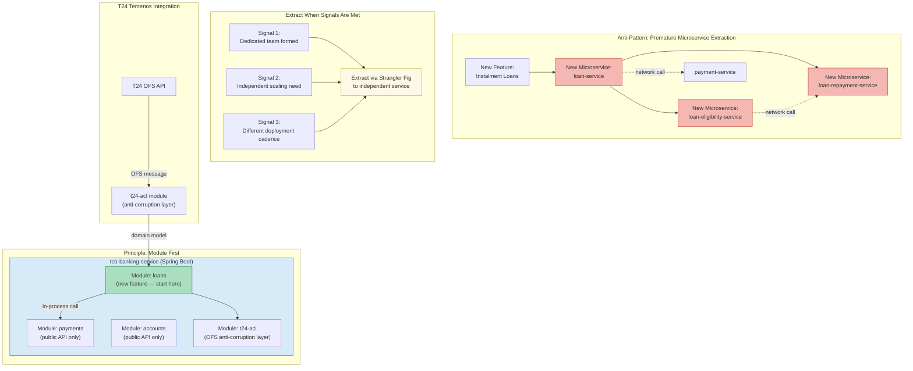

# Modular Monolith Preference

Status: Draft | Last Reviewed: 2026-05-09 | Owner: @tech-lead-backend
Catalog ID: PRIN-013 | Radii
Tier Applicability: T0, T1, T2, T3

## Problem Statement

- Teams building new digital banking features (instalment loans, savings goals, rewards) reflexively create a new microservice for each feature, resulting in a proliferation of services that each require their own CI/CD pipeline, observability stack, Kubernetes namespace, on-call rotation, and operational runbook — adding approximately 1 FTE of ongoing operational overhead per service before the feature ships a single line of business logic.
- Microservice boundaries drawn before the domain is understood (pre-mature decomposition) encode incorrect boundaries into the system topology. Refactoring a wrong service boundary requires migrating data, versioning APIs, and coordinating deployments across multiple teams — a far higher cost than refactoring a module boundary within a single codebase.
- Conway's Law operates whether teams acknowledge it or not: if the team owning instalment loans is the same team owning the payment service, splitting them into separate services creates a cross-team coordination dependency for every feature that touches both domains, without delivering any of the promised team autonomy.
- T24 Temenos is itself a large, well-structured monolith. The correct integration pattern is an anti-corruption layer (ACL) that translates OFS messages into the Techcombank domain model — not a new microservice that wraps T24 and then spawns further microservices downstream of the wrapper.
- Distributed systems are fundamentally harder to test, debug, and reason about than well-structured modular codebases. Network partitions, partial failures, serialization gaps between service versions, and distributed tracing overhead are all problems that do not exist within a single process — introducing them early sacrifices the very developer velocity that microservices are supposed to deliver.
- Operational incident response is slower across many services: correlating a customer-reported payment failure across five microservices (each with its own log stream, its own trace IDs, and its own deployment history) takes materially longer than isolating the same failure within a single structured codebase.

## Solution / Principle Statement

New features and bounded contexts are built as well-structured modules within the existing backend monolith; a feature is extracted into an independent microservice only when a specific, documented scaling or team-boundary problem demands it and the team structure supports a dedicated ownership model.



### Core Rules

1. **New features start as modules.** Every new banking feature — instalment loans, savings goals, FX conversion, rewards — is implemented as a Java module within the existing `tcb-banking-service` Spring Boot application. A new service is not created unless at least two of the three extraction signals are present (dedicated team, independent scaling need, different deployment cadence).
2. **Module boundaries enforce information hiding.** Each module exposes a public API package (`vn.techcombank.<module>.api`) containing only interfaces, DTOs, and events. All implementation classes are package-private. Cross-module calls go through the public API only — never through internal implementation classes. ArchUnit enforces this at build time.
3. **T24 OFS integration lives in the `t24-acl` module.** All communication with T24 Temenos — OFS request construction, response parsing, retry logic — is encapsulated in the `t24-acl` module. Upstream feature modules call the ACL module's domain interfaces; they never construct OFS strings or depend on T24 data structures directly.
4. **The Strangler Fig is the extraction path.** When a module is ready for extraction, it is extracted incrementally via the Strangler Fig pattern: the module's public API is first exposed via an internal interface, then a network facade is placed in front of it, then the implementation is moved to a separate deployable. There is no "big bang" microservice creation.
5. **Extraction requires a dedicated team.** A module may not be extracted into a separate service unless a dedicated, named team owns it. A shared team that owns two services owns neither effectively. If no dedicated team exists, the feature stays in the monolith.

## Implementation Guidelines

### 1. Module Structure: Package Layout and API Boundary

Each module follows a strict package layout. ArchUnit enforces that nothing outside the `api` package is accessed from other modules.

```
tcb-banking-service/
├── src/main/java/vn/techcombank/
│   ├── payments/
│   │   ├── api/                  ← public: interfaces, DTOs, events only
│   │   │   ├── PaymentService.java
│   │   │   ├── PaymentRequest.java
│   │   │   └── PaymentSubmittedEvent.java
│   │   └── internal/             ← package-private: implementation
│   │       ├── PaymentServiceImpl.java
│   │       ├── PaymentRepository.java
│   │       └── NapasGateway.java
│   ├── loans/                    ← new feature module
│   │   ├── api/
│   │   │   ├── LoanService.java
│   │   │   ├── LoanApplicationRequest.java
│   │   │   └── LoanApprovedEvent.java
│   │   └── internal/
│   │       ├── LoanServiceImpl.java
│   │       ├── EligibilityCalculator.java
│   │       └── LoanRepository.java
│   └── t24-acl/
│       ├── api/
│       │   ├── AccountBalanceQuery.java
│       │   └── T24AccountService.java
│       └── internal/
│           ├── OfsRequestBuilder.java
│           └── OfsResponseParser.java
```

```java
// ArchUnit: enforce module boundary — no cross-module internal access
@AnalyzeClasses(packages = "vn.techcombank")
class ModuleBoundaryArchTest {

    @ArchTest
    static final ArchRule noInternalCrossModuleAccess = noClasses()
        .that().resideInAPackage("..loans.internal..")
        .should().accessClassesThat()
            .resideInAPackage("..payments.internal..")
        .because("PRIN-013: cross-module calls must go through the public api package only");

    @ArchTest
    static final ArchRule noDirectT24Access = noClasses()
        .that().resideOutsideOfPackage("..t24-acl..")
        .should().accessClassesThat()
            .resideInAPackage("..t24-acl.internal..")
        .because("PRIN-013: T24 OFS details are encapsulated in the t24-acl module");
}
```

### 2. T24 Anti-Corruption Layer: OFS Integration

The ACL module translates between the T24 OFS protocol and the Techcombank domain model. Feature modules call domain interfaces; they are never aware that T24 is the underlying system.

```java
// Public ACL interface — what the loans module sees
// vn.techcombank.t24acl.api.T24AccountService
public interface T24AccountService {
    AccountBalance queryBalance(String accountNumber, String currency);
    boolean isEligibleForCredit(String customerId, BigDecimal requestedAmount);
}

// ACL implementation — OFS details are hidden here
// vn.techcombank.t24acl.internal
@Service
class T24AccountServiceImpl implements T24AccountService {

    private final OfsClient ofsClient;
    private final OfsRequestBuilder requestBuilder;
    private final OfsResponseParser responseParser;

    @Override
    public AccountBalance queryBalance(String accountNumber, String currency) {
        // Build OFS enquiry request — T24-specific protocol detail
        String ofsRequest = requestBuilder.buildEnquiry(
            "ACCOUNT.BALANCE",
            Map.of("ACCOUNT.NO", accountNumber, "CURRENCY", currency)
        );

        OfsResponse raw = ofsClient.submit(ofsRequest);

        // Translate OFS response to domain model — caller sees nothing T24-specific
        return responseParser.parseBalance(raw);
    }

    @Override
    public boolean isEligibleForCredit(String customerId, BigDecimal requestedAmount) {
        String ofsRequest = requestBuilder.buildEnquiry(
            "CUSTOMER.CREDIT.CHECK",
            Map.of("CUSTOMER.ID", customerId, "AMOUNT", requestedAmount.toPlainString())
        );
        OfsResponse raw = ofsClient.submit(ofsRequest);
        return responseParser.parseCreditEligibility(raw).isEligible();
    }
}

// Loans module — calls domain interface, unaware of T24
// vn.techcombank.loans.internal
@Service
class LoanServiceImpl implements LoanService {

    private final T24AccountService t24AccountService;   // injected via Spring
    private final LoanRepository loanRepository;

    @Override
    public LoanApplicationResult apply(LoanApplicationRequest request) {
        boolean eligible = t24AccountService
            .isEligibleForCredit(request.getCustomerId(), request.getRequestedAmount());

        if (!eligible) {
            return LoanApplicationResult.declined("Credit eligibility check failed");
        }
        // ... rest of loan business logic
    }
}
```

### 3. Extraction via Strangler Fig: Step-by-Step

When the loans module is ready for extraction (signals met: dedicated team formed, independent scaling needed), the extraction follows these steps without a big-bang rewrite.

```java
// Step 1 (current state): In-process Spring bean — direct method call
// No network boundary; testable with unit tests; simple deployment
@Service
public class LoanServiceImpl implements LoanService { /* ... */ }

// Step 2: Introduce a facade that can be toggled between in-process and remote
// This lives in the monolith during the transition
@Service
@ConditionalOnProperty(name = "features.loan-service.remote", havingValue = "false",
                       matchIfMissing = true)
public class LocalLoanServiceFacade implements LoanService {
    private final LoanServiceImpl delegate;
    // Delegates to in-process implementation — no behaviour change yet
}

@Service
@ConditionalOnProperty(name = "features.loan-service.remote", havingValue = "true")
public class RemoteLoanServiceFacade implements LoanService {
    private final LoanServiceClient httpClient;  // REST or gRPC client
    // Delegates to the extracted service — toggled via feature flag
}

// Step 3 (after extraction): The extracted service hosts LoanServiceImpl.
// The monolith routes via RemoteLoanServiceFacade.
// Step 4: Once stable, remove the monolith's internal LoanServiceImpl.
```

### 4. Extraction Decision Gate: Checklist as Code

The extraction decision is captured in a Spring Boot auto-configuration that logs a warning at startup if a module's extraction signal properties are misconfigured.

```java
// Application startup check — ensures extraction is a deliberate decision
@Component
@Slf4j
public class ExtractionSignalValidator implements ApplicationListener<ApplicationReadyEvent> {

    @Value("${modules.loans.dedicated-team-confirmed:false}")
    private boolean loansDedicatedTeam;

    @Value("${modules.loans.independent-scaling-required:false}")
    private boolean loansIndependentScaling;

    @Value("${modules.loans.deployed-as-service:false}")
    private boolean loansDeployedAsService;

    @Override
    public void onApplicationEvent(ApplicationReadyEvent event) {
        if (loansDeployedAsService && !loansDedicatedTeam) {
            // Fail-fast: do not allow extraction without a dedicated team (PRIN-013)
            throw new IllegalStateException(
                "PRIN-013 violation: loans module is deployed as a service " +
                "but modules.loans.dedicated-team-confirmed is false. " +
                "A dedicated team must own this service before extraction. " +
                "See the Extraction Decision Record in docs/adr/ADR-0XX.md");
        }
        if (loansDeployedAsService) {
            log.info("Loans module deployed as independent service. " +
                "Dedicated team: {} | Independent scaling: {}",
                loansDedicatedTeam, loansIndependentScaling);
        }
    }
}
```

### 5. Spring Boot Module Configuration: Bounded Startup

Each module declares its own `@Configuration` class and Spring Data repository slice. This keeps the module self-contained and makes it straightforward to extract it later — the configuration boundary matches the future deployment boundary.

```java
// loans module — self-contained Spring configuration
@Configuration
@EnableJpaRepositories(basePackages = "vn.techcombank.loans.internal")
@EntityScan(basePackages = "vn.techcombank.loans.internal")
@ComponentScan(basePackages = {
    "vn.techcombank.loans.api",
    "vn.techcombank.loans.internal"
})
public class LoansModuleConfig {
    // Module-specific beans declared here.
    // No references to other modules' internal packages.

    @Bean
    public LoanService loanService(
            T24AccountService t24AccountService,   // cross-module via api interface
            LoanRepository loanRepository) {
        return new LoanServiceImpl(t24AccountService, loanRepository);
    }
}
```

## When to Apply

- Any new banking product feature (instalment loans, savings goals, FX conversion, digital wallet, rewards program) — start as a module.
- Any integration with a new external system (third-party KYC provider, insurance partner) — start as an ACL module within the monolith.
- Any sub-domain that does not yet have a dedicated team or a documented independent scaling requirement.
- Any context where T24 OFS integration is required — the `t24-acl` module is the single, shared integration point.
- Migration of legacy functionality from T24 into the Techcombank domain — incrementally via the ACL module, not via a new standalone microservice.

## When to Make an Exception

Extraction to an independent microservice is appropriate when all of the following signals are present and documented in an Architecture Decision Record approved by the Tech Lead and EA Board.

| Signal | Description | Verification |
|---|---|---|
| S1 — Dedicated team | A named, dedicated team owns the module and has committed to the full operational responsibilities (CI/CD, on-call, runbooks, observability) | Team roster documented in the ADR; team lead named |
| S2 — Independent scaling need | The module has a measurably different scaling profile from the rest of the monolith and co-deployment would require over-scaling the entire application to serve one module's peak | Load test data showing per-module scaling divergence |
| S3 — Different deployment cadence | The module requires deployments at a frequency or risk profile that conflicts with the monolith's release cadence and cannot be managed with feature flags | Deployment frequency data over the prior 3 months |
| S4 — Regulated data isolation | Regulatory or contractual requirement mandates that the module's data is isolated in a separate data store with independent access controls (e.g., a PCI-scoped module that must be carved out of PCI scope for the remaining monolith) | Documented regulatory requirement with Legal sign-off |

No extraction proceeds without S1. S1 alone is not sufficient — at least one of S2, S3, or S4 must also be present.

## Checklist

- [ ] New feature is implemented as a module under `vn.techcombank.<domain>` in `tcb-banking-service`
- [ ] Module exposes a public `api` package with interfaces and DTOs only — no implementation classes in `api`
- [ ] ArchUnit test `ModuleBoundaryArchTest` covers the new module and passes in CI
- [ ] Cross-module calls go through the `api` interface, not the `internal` implementation
- [ ] T24 OFS calls are routed through the `t24-acl` module — no direct OFS string construction in feature modules
- [ ] Module has its own `@Configuration` class scoped to its own packages
- [ ] No new microservice is created without an ADR documenting at least S1 + one of S2/S3/S4
- [ ] If extraction is planned, a Strangler Fig ADR is filed before the first remote facade is introduced
- [ ] `ExtractionSignalValidator` properties are set correctly for each module's deployment mode
- [ ] Module schema (database tables) is namespaced with the module prefix (e.g., `loans_application`, not `application`)

## NFR Acceptance Criteria

```yaml
service_name: "tcb-banking-service-modular-compliance"
tier: T0
acceptance_criteria:
  - id: MMP-1
    description: >
      Zero ArchUnit violations for cross-module internal package access.
      No class in any module's internal package is referenced from another
      module's internal or api package. Enforced in CI on every pull request.
    verification: >
      Run ./mvnw test -pl :arch-tests; assert ModuleBoundaryArchTest reports
      zero violations across all modules.

  - id: MMP-2
    description: >
      Zero direct OFS string constructions outside the t24-acl module.
      No class outside vn.techcombank.t24acl builds or parses OFS messages.
      Verified by ArchUnit.
    verification: >
      ArchUnit rule noDirectT24Access passes with zero violations;
      grep -r "OFS" --include="*.java" src/main/java/vn/techcombank excludes
      everything outside t24acl.

  - id: MMP-3
    description: >
      Build and test time for the full tcb-banking-service monolith does not
      exceed 8 minutes on the CI runner. Modular structure must not create
      dependency resolution bottlenecks that inflate build time beyond this
      threshold.
    verification: >
      CI pipeline duration measurement: assert ./mvnw verify -T 1C completes
      within 480 seconds on the standard CI runner (4 vCPU, 8 GB RAM).

  - id: MMP-4
    description: >
      No new microservice repository is created without a merged ADR that
      documents S1 (dedicated team) plus at least one of S2/S3/S4.
      Verified by repository governance check.
    verification: >
      Repository creation policy: the platform team's repository provisioning
      script requires an ADR file path parameter; the ADR must contain the
      extraction signal checklist with all S1 items checked before the
      repository is created.
```

## Compliance Mapping

| Layer | Reference | Section / Control | How this principle satisfies |
|---|---|---|---|
| Ring 0 (global) | BCBS 239 (Jan 2013) | Principle 4 — Mapping Dependencies | A modular monolith has a single, explicit dependency graph that is fully visible within the codebase; a proliferation of microservices creates implicit network-level dependencies that are harder to map and audit for risk data aggregation purposes |
| Ring 0 (global) | ISO 27001:2022 | A.8.8 — Management of Technical Vulnerabilities | Fewer deployment units means fewer surfaces to patch, fewer container images to scan, and a simpler vulnerability management process — directly reducing the operational burden of A.8.8 compliance |
| Ring 1 (international banking) | BCBS 230 (Oct 2012) | Principle 4 — Mapping Dependencies | Reducing the number of services reduces the complexity of the dependency map that must be maintained for operational risk management; a modular monolith's dependency map is a static code artifact, not a runtime topology ⚠️ (working summary — pending PDF fetch) |
| Ring 2 (Vietnam) | SBV Circular 09/2020 §IV.2 — System Architecture | Change Management and Operational Continuity | SBV §IV.2 requires documented system architecture and controlled change processes; a modular monolith reduces the number of independently deployable units, simplifying the change management surface and reducing the risk of uncoordinated deployments ⚠️ (working summary — pending Legal review) |

## Cost / FinOps Notes

- Each extracted microservice adds approximately 1 FTE of operational overhead in aggregate (CI/CD pipeline maintenance, observability instrumentation, Kubernetes resource tuning, on-call rotation, runbook authoring, and cross-service dependency management). For Techcombank at current team scale, keeping five features as modules rather than microservices avoids approximately 5 FTE-equivalents of platform overhead — freeing engineering capacity for feature delivery.
- A modular monolith deployed on a single ECS task or Kubernetes deployment family requires one set of ALB target groups, one CloudWatch log group, one set of Datadog dashboards, and one deployment pipeline. Equivalent microservice sprawl at ten services multiplies each of these costs by ten. At Techcombank's AWS infrastructure spend, this difference is approximately USD 3,000–8,000/month in platform tooling costs alone.
- When the wrong microservice boundary is drawn and must be corrected, the migration cost includes: data migration scripts, API versioning and deprecation management, consumer update coordination, and increased incident risk during the transition. Industry benchmarks place wrong-boundary correction at 3–6 months of engineering time per boundary. Spending two sprints designing the module boundary correctly in the monolith avoids this cost entirely.
- T24 OFS integration through a shared `t24-acl` module means the OFS connection pool, retry logic, and circuit breaker are shared across all feature modules — approximately 1 FTE of integration engineering amortised once. If each feature team wrote its own T24 integration, the total cost would multiply by the number of teams.

## Threat Model Summary

STRIDE: Elevation of Privilege, Tampering, Information Disclosure

- **Top threats addressed:**
  - Elevation of Privilege via misconfigured inter-service trust: when microservices call each other, they must establish mTLS trust relationships; a misconfigured trust relationship can grant one service access to another's data. Module-level calls within a single JVM eliminate this attack surface entirely for intra-monolith communication.
  - Tampering via network injection between services: in-process module calls cannot be intercepted by a network-layer attacker. Reducing the number of network hops between banking domains reduces the surface for man-in-the-middle injection attacks.
  - Information Disclosure via overly broad service-to-service credentials: microservices often receive broad credentials to call other services; a compromised service can exploit these credentials. Module-level calls use the same JVM security context and never require external credentials for intra-module access.
- **Residual risks:**
  - A bug in one module can affect the stability of the entire monolith (shared heap, shared thread pool). Mitigated by module-level bulkheads (separate thread pools for I/O-bound operations) and structured logging that attributes failures to the originating module.
  - Module boundary violations (a developer directly instantiating an internal class from another module) silently bypass the architectural control. Mitigated by ArchUnit enforcement in CI — the build fails if a boundary violation is introduced.

## Operational Runbook (stub)

1. **Alert: module boundary violation detected in CI** — If `ModuleBoundaryArchTest` fails on a pull request, block the merge. The developer must refactor the cross-module call to go through the public `api` interface. Do not add an `@ArchIgnore` annotation without a Tech Lead approval and a comment explaining the temporary exception.
2. **Alert: build time exceeds MMP-3 threshold** — If the CI build exceeds 8 minutes, profile the Maven build with `-Dmaven.profiler` to identify which module's compilation or test phase is the bottleneck. Consider parallel test execution (`-T 1C`) or splitting large test suites across parallel CI jobs.
3. **New feature onboarding** — When a new feature team starts work, run `scripts/scaffold-module.sh <module-name>` to create the module directory structure, register the `@Configuration` class, and add the ArchUnit rule for the new module's boundary. Do not allow the feature team to start without the ArchUnit rule in place.
4. **T24 OFS error investigation** — All OFS errors surface through the `t24-acl` module. Use the correlation ID in the structured log (`t24-acl.ofs-error`) to trace the OFS request. Check the T24 operator console for the corresponding OFS session ID. Do not add T24-specific error handling in feature modules — escalate to the `t24-acl` module owner.
5. **Extraction decision review** — Quarterly, review all modules against the extraction signal checklist (S1–S4). Modules that have met all signals for two consecutive quarters are candidates for extraction planning. Present the extraction ADR to the EA Board.
6. **Strangler Fig transition** — During the transition period (remote facade toggled via feature flag), monitor both the in-process and remote code paths for error rate divergence. If the remote path shows higher error rates than the in-process path, roll back by flipping the feature flag to `false` and investigate before proceeding.

## Test Strategy (stub)

- **Unit:** Test each module's service classes in isolation using standard Spring `@ExtendWith(MockitoExtension.class)` tests. Mock cross-module dependencies via the public `api` interface — never mock internal implementation classes. Test the `t24-acl` module with a WireMock server simulating OFS responses for each query type.
- **Integration:** Use `@SpringBootTest` with the full application context to verify that module wiring is correct — that `LoanServiceImpl` receives the correct `T24AccountService` bean and that the `@Configuration` class for each module loads without conflicts. Use Testcontainers for database integration tests scoped to a single module's schema tables.
- **Security / Compliance:** ArchUnit test suite (`ModuleBoundaryArchTest`, `noDirectT24Access`) run on every pull request targeting `main`. Verify at least annually that the module boundary rules have zero violations and that no `@ArchIgnore` annotations have been added without documented justification. Run a dependency analysis (`./mvnw dependency:analyze`) to ensure no unintended transitive dependencies cross module boundaries at the bytecode level.

## Related Patterns / Principles

- [PRIN-012 Async by Default](async-by-default.md) — intra-module calls may be synchronous; async applies at the service boundary when modules are extracted
- [PRIN-010 Fail-Safe Defaults](fail-safe-defaults.md) — module boundary violations detected at startup must fail the application boot
- [PRIN-008 Defense-in-Depth](defense-in-depth.md) — fewer deployment units reduce the surface area for network-layer attacks between services
- [INT-001 NAPAS Connector](../patterns/integration/napas-connector.md) — NAPAS integration is hosted within the monolith as a module until extraction signals are met
- [INT-002 T24 OFS Anti-Corruption Layer](../patterns/integration/t24-acl.md) — the canonical ACL module implementation referenced by Core Rule 3

## References

- Newman, S. — Building Microservices (2nd ed., 2021) — Chapter 2: How to Model Services (Strangler Fig)
- Fowler, M. — "MonolithFirst" (2015) — martinfowler.com/bliki/MonolithFirst.html
- Fowler, M. — "Strangler Fig Application" (2004) — martinfowler.com/bliki/StranglerFigApplication.html
- Conway, M. — "How Do Committees Invent?" (1968) — Datamation — Conway's Law origin paper
- Richardson, C. — Microservices Patterns (2018) — Chapter 1: Escaping Monolithic Hell (anti-patterns)
- BCBS 239 — Principles for Effective Risk Data Aggregation (Jan 2013) — Principle 4
- BCBS 230 — Principles for Effective Risk Data Aggregation (Oct 2012) — Principle 4
- SBV Circular 09/2020 on Information Security in Banking Operations — §IV.2

---
**Key Takeaway**: Techcombank starts every new banking feature as a well-bounded module within the existing backend — microservice extraction follows team structure and scaling evidence, not architectural fashion.
