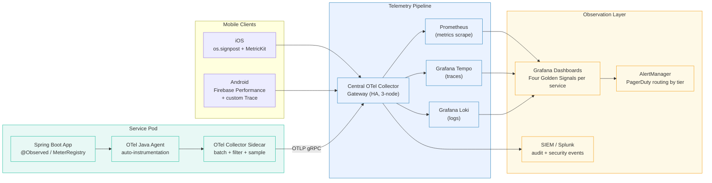

# Observability-First

Status: Draft | Last Reviewed: 2026-05-09 | Owner: @sre-lead
Catalog ID: PRIN-009 | Radii
Tier Applicability: T0, T1, T2, T3

## Problem Statement

- A service that cannot be observed cannot be operated: without structured telemetry, on-call engineers rely on customer complaints and log-grepping to detect incidents, pushing MTTR from minutes into hours.
- Banking platforms carry BCBS 239 obligations for data timeliness and consistency of reporting; missing or ad-hoc telemetry creates a direct regulatory gap that surfaces during supervisory review.
- Transaction audit trails are both an operational requirement (root-cause analysis of failed payments) and a legal obligation (SBV §IV.3 incident logging); implementing them as an afterthought produces patchy coverage that fails audit.
- EOD batch processing (reconciliation, position-keeping, regulatory reporting) requires telemetry specifically tailored to long-running jobs — throughput rates, record counts, error buckets — that standard request-response metrics do not cover.

## Context

A distributed banking platform running across multiple services, regions, and runtimes is impossible to debug reactively; structured telemetry emitted at creation time is the only reliable path to root-cause analysis under regulatory time pressure. OpenTelemetry-compatible traces, metrics, and logs must be designed in from the first line of code rather than retrofitted after the first production incident. In the Techcombank context, BCBS 239 mandates data timeliness and consistency of reporting — requirements that cannot be met unless the platform has continuous, structured visibility into every payment, reconciliation, and KYC state transition. Observability is therefore both a DevOps practice and a regulatory obligation, making it a non-negotiable definition-of-done gate for all tiers.

## Solution

Every service emits the LMTR telemetry stack — structured Logs, Prometheus Metrics, distributed Traces, and Alerts — before any feature is declared production-ready. Observability is a definition-of-done gate, not a follow-up ticket.



The four golden signals (latency, traffic, errors, saturation) as defined in [BP-007](../best-practices/golden-signals-sre.md) are mandatory for every T0 and T1 service. T2/T3 services must emit at minimum error rate and latency.

## Implementation Guidelines

### 1. Spring Boot OpenTelemetry Configuration

```xml
<!-- pom.xml — Spring Boot 3.x + Micrometer OTel bridge -->
<dependency>
    <groupId>io.micrometer</groupId>
    <artifactId>micrometer-tracing-bridge-otel</artifactId>
</dependency>
<dependency>
    <groupId>io.opentelemetry</groupId>
    <artifactId>opentelemetry-exporter-otlp</artifactId>
</dependency>
<dependency>
    <groupId>io.micrometer</groupId>
    <artifactId>micrometer-registry-prometheus</artifactId>
</dependency>
```

```yaml
# application.yml — telemetry configuration
management:
  tracing:
    sampling:
      probability: 1.0           # 100% for T0; use 0.1 for T2/T3 at high RPS
  otlp:
    tracing:
      endpoint: http://otel-collector:4317
  prometheus:
    metrics:
      export:
        enabled: true
  endpoints:
    web:
      exposure:
        include: health,metrics,prometheus,info

logging:
  structured:
    format:
      console: ecs              # Elastic Common Schema — JSON structured logs
  pattern:
    level: "%5p [${spring.application.name},%X{traceId},%X{spanId}]"

spring:
  application:
    name: payment-service
```

### 2. @Observed Annotation and Custom Metrics

```java
@Configuration
public class ObservabilityConfig {

    @Bean
    public ObservedAspect observedAspect(ObservationRegistry registry) {
        return new ObservedAspect(registry);
    }

    @Bean
    public MeterRegistryCustomizer<MeterRegistry> commonTags(
            @Value("${spring.application.name}") String appName,
            @Value("${service.tier:T2}") String tier) {
        return registry -> registry.config()
            .commonTags(
                "application", appName,
                "tier", tier,
                "region", System.getenv().getOrDefault("AWS_REGION", "ap-southeast-1")
            );
    }
}

@Service
@Slf4j
public class PaymentService {

    private final MeterRegistry meterRegistry;
    private final ObservationRegistry observationRegistry;

    // Four golden signals — declare as fields, not inside methods
    private final Counter paymentInitiated;
    private final Counter paymentFailed;
    private final DistributionSummary paymentAmountVnd;
    private final Gauge pendingPaymentsGauge;

    public PaymentService(MeterRegistry meterRegistry,
                          ObservationRegistry observationRegistry,
                          PendingPaymentRepository pendingRepo) {
        this.meterRegistry = meterRegistry;
        this.observationRegistry = observationRegistry;

        // Traffic signal
        this.paymentInitiated = Counter.builder("tcb.payments.initiated.total")
            .description("Total payment initiations")
            .register(meterRegistry);

        // Error signal
        this.paymentFailed = Counter.builder("tcb.payments.failed.total")
            .description("Total payment failures")
            .register(meterRegistry);

        // Business metric
        this.paymentAmountVnd = DistributionSummary.builder("tcb.payments.amount.vnd")
            .description("Payment amount in VND")
            .baseUnit("vnd")
            .register(meterRegistry);

        // Saturation signal — pending queue depth
        this.pendingPaymentsGauge = Gauge.builder("tcb.payments.pending.count",
                pendingRepo, PendingPaymentRepository::countPending)
            .description("Pending payments in queue (saturation indicator)")
            .register(meterRegistry);
    }

    @Observed(name = "payment.initiate",
              contextualName = "payment-initiation",
              lowCardinalityKeyValues = {"payment.type", "DOMESTIC"})
    public PaymentResult initiatePayment(PaymentRequest request) {
        // Latency automatically measured by @Observed
        paymentInitiated.increment();
        paymentAmountVnd.record(request.getAmountVnd().doubleValue());

        return Observation.createNotStarted("payment.napas.call", observationRegistry)
            .lowCardinalityKeyValue("napas.channel", request.getChannel())
            .observe(() -> {
                try {
                    return napasClient.submit(request);
                } catch (NapasException e) {
                    paymentFailed.increment(Tags.of("reason", e.getErrorCode()));
                    // Structured log with trace correlation
                    log.error("NAPAS submission failed trace_id={} payment_ref={} error={}",
                        MDC.get("traceId"), request.getPaymentRef(), e.getErrorCode());
                    throw e;
                }
            });
    }
}
```

### 3. Mandatory Structured Log Fields

Every log statement must include the following fields. Use the `MdcContextLifter` from Micrometer Tracing to auto-propagate `traceId` and `spanId` into MDC.

```java
@Component
public class TcbMdcFilter extends OncePerRequestFilter {

    @Override
    protected void doFilterInternal(HttpServletRequest request,
                                    HttpServletResponse response,
                                    FilterChain chain) throws IOException, ServletException {
        try {
            // These fields are mandatory in every log line (BCBS 239, SBV §IV.3)
            MDC.put("tenant",       extractTenant(request));
            MDC.put("user_id_hash", hashUserId(request));
            MDC.put("tier",         serviceTier());
            MDC.put("request_id",   extractOrGenerateRequestId(request));
            // traceId / spanId populated by Micrometer Tracing MdcContextLifter
            chain.doFilter(request, response);
        } finally {
            MDC.clear();
        }
    }
}
```

### 4. EOD Batch Telemetry

Long-running batch jobs must emit job-scoped metrics, not request-scoped metrics.

```java
@Component
@Slf4j
public class EodReconciliationJob {

    private final MeterRegistry meterRegistry;

    @Scheduled(cron = "0 30 23 * * *", zone = "Asia/Ho_Chi_Minh")
    public void runEodReconciliation() {
        Timer.Sample jobTimer = Timer.start(meterRegistry);
        AtomicLong recordsProcessed = new AtomicLong(0);
        AtomicLong recordsFailed   = new AtomicLong(0);

        log.info("EOD reconciliation started job=eod_recon date={}", LocalDate.now());

        try {
            processRecords(recordsProcessed, recordsFailed);

            log.info("EOD reconciliation completed job=eod_recon "
                    + "records_processed={} records_failed={} date={}",
                recordsProcessed.get(), recordsFailed.get(), LocalDate.now());
        } catch (Exception e) {
            log.error("EOD reconciliation failed job=eod_recon error={}", e.getMessage(), e);
            meterRegistry.counter("tcb.batch.eod_recon.failures.total").increment();
            throw e;
        } finally {
            jobTimer.stop(Timer.builder("tcb.batch.eod_recon.duration")
                .description("EOD reconciliation duration")
                .register(meterRegistry));

            meterRegistry.gauge("tcb.batch.eod_recon.records_processed",
                recordsProcessed.get());
            meterRegistry.gauge("tcb.batch.eod_recon.records_failed",
                recordsFailed.get());
        }
    }
}
```

### 5. iOS — os.signpost Performance Tracing (Swift)

```swift
import os.signpost

class PaymentNetworkClient {
    private let log = OSLog(subsystem: "com.techcombank.mobile", category: "network")
    private let signpostID = OSSignpostID(log: .default)

    func submitPayment(_ request: PaymentRequest) async throws -> PaymentResponse {
        // os.signpost marks appear in Instruments Time Profiler and Xcode Organizer
        os_signpost(.begin, log: log, name: "payment_submit",
                    signpostID: signpostID,
                    "amount=%lld channel=%{public}s",
                    request.amountVnd, request.channel)
        defer {
            os_signpost(.end, log: log, name: "payment_submit",
                        signpostID: signpostID)
        }

        // Propagate W3C traceparent header for end-to-end distributed tracing
        var urlRequest = URLRequest(url: paymentEndpoint)
        urlRequest.setValue(TraceContext.current().traceparent,
                            forHTTPHeaderField: "traceparent")

        let (data, response) = try await URLSession.shared.data(for: urlRequest)

        guard let http = response as? HTTPURLResponse, http.statusCode == 200 else {
            os_signpost(.event, log: log, name: "payment_submit_error",
                        "status=%d", (response as? HTTPURLResponse)?.statusCode ?? -1)
            throw PaymentError.httpError
        }
        return try JSONDecoder().decode(PaymentResponse.self, from: data)
    }
}
```

### 6. Android — Firebase Performance + Custom Trace (Kotlin)

```kotlin
import com.google.firebase.perf.FirebasePerformance
import com.google.firebase.perf.metrics.Trace

class PaymentApiClient(private val httpClient: OkHttpClient) {

    private val firebasePerf = FirebasePerformance.getInstance()

    suspend fun submitPayment(request: PaymentRequest): PaymentResponse {
        val trace: Trace = firebasePerf.newTrace("payment_submit")
        trace.putAttribute("channel", request.channel)
        trace.putAttribute("tier", "T0")
        trace.start()

        return try {
            val httpRequest = Request.Builder()
                .url(PAYMENT_ENDPOINT)
                // Propagate W3C traceparent for distributed tracing
                .addHeader("traceparent", TraceContext.current().traceparent)
                .post(request.toJsonBody())
                .build()

            val response = httpClient.newCall(httpRequest).await()

            trace.putMetric("response_bytes", response.body?.bytes()?.size?.toLong() ?: 0)
            trace.putAttribute("status", response.code.toString())
            response.parseAs<PaymentResponse>()
        } catch (e: Exception) {
            trace.putAttribute("error", e.javaClass.simpleName)
            throw e
        } finally {
            trace.stop()
        }
    }
}
```

## Compliance Mapping

| Ring | Regulation | Provision | How this pattern satisfies |
|------|-----------|-----------|---------------------------|
| Ring 0 | NIST SP 800-92 | Log Management Guidelines | Structured JSON logs with mandatory fields, centralised collection via Loki, 7-year retention for audit logs |
| Ring 0 | OWASP ASVS | V7 Error Handling and Logging | Structured logs without PII, correlation IDs, tamper-evident audit events |
| Ring 0 | AWS WAF | Access Logs | WAF access logs streamed to Loki pipeline for security correlation |
| Ring 0 | ISO 27001 | A.12.4 Logging and Monitoring | Centralised log management, alert thresholds, and log protection satisfy A.12.4.1–4 |
| Ring 1 | BCBS 239 | Principle 2 — Data Architecture | Distributed tracing provides lineage of data transformations across services |
| Ring 1 | BCBS 239 | Principle 5 — Timeliness | Prometheus scrape interval ≤ 15s; alert-to-page latency ≤ 60s for T0 incidents |
| Ring 1 | BCBS 239 | Principle 11 — Consistency of Reporting | Single OTel collector pipeline ensures metrics are computed consistently across all services |
| Ring 1 | SWIFT CSP 2024 | Control 6.1 Malware Protection | SIEM correlation of OTel events provides anomaly detection required by SWIFT CSP 6.1 |
| Ring 2 | SBV Circular 09/2020 §IV.3 | Incident logging requirements | Structured audit logs with trace correlation, mandatory tenant/user fields, and tamper-evident storage satisfy §IV.3 incident record obligations ⚠️ (working summary — pending Legal review) |
| Ring 2 | Decree 13/2023 | Personal data processing records | User ID is hashed (not raw) in logs; processing-purpose field logged per Decree 13 Article 9 ⚠️ (working summary — pending Legal review) |

## NFR Acceptance Criteria

```yaml
service_name: observability-first-principle
tier: T0
rto_minutes: 5           # telemetry pipeline must recover within 5 minutes
rpo_seconds: 30          # at most 30s of telemetry loss during pipeline failover
latency:
  instrumentation_overhead_cpu_pct: 1.0   # OTel agent CPU overhead ≤ 1%
  instrumentation_overhead_latency_ms: 2  # p95 overhead added by @Observed + MDC filter
  p95_ms: 2
alert_detection:
  t0_incident_detection_seconds: 60       # T0 alert fires within 60s of threshold breach
  t1_incident_detection_seconds: 120
  t2_incident_detection_seconds: 300
failure_modes:
  - mode: OTel Collector unavailable
    impact: Telemetry buffered in sidecar (1 minute buffer); then dropped
    mitigation: OTel Collector in HA (3-node); alert if collector drop rate > 0
  - mode: Prometheus storage full
    impact: New metrics not scraped; existing dashboards show gaps
    mitigation: Storage auto-scaling; alert at 80% utilisation
  - mode: Trace sampling rate reduced under load
    impact: Reduced trace coverage; tail-sampler preserves error traces
    mitigation: Head sampling at 10% for T2/T3 high-RPS; always-sample errors and slow calls
  - mode: PII accidentally logged
    impact: GDPR/Decree 13 violation; log quarantine required
    mitigation: Log scrubbing filter on Collector (redact patterns for PAN, CCCD, phone)
blast_radius:
  scope: All services — a broken telemetry pipeline degrades incident response across the platform
  isolation: Telemetry loss does not affect application functionality; services degrade to blind operation
catalog_references:
  - BP-007    # Golden Signals SRE
  - BP-004    # Observability Standards
  - SEC-012   # Tamper-Evident Audit (audit trail as observability artifact)
  - NFR-001   # Service Tiering RTO/RPO
  - NFR-002   # Latency Budget Model
  - RES-002   # Circuit Breaker (CB state transitions are observability signals)
```

## Cost/FinOps

- Prometheus metrics storage scales with the number of time-series, not request volume; at Techcombank's scale (estimated 50,000 active series across all services), a 30-day retention Prometheus cluster on AWS requires approximately 500 GB EBS and USD 150/month. Use recording rules aggressively to roll up high-cardinality series.
- Distributed tracing storage (Grafana Tempo on S3) is priced by ingestion volume. At 100% sampling for T0 (approximately 500 RPS), expect 5–10 GB/day of trace data and S3 costs of approximately USD 100/month. Apply tail sampling at T2/T3 (10% head sample, 100% error sample) to reduce costs by an estimated 60–70%.
- Loki log storage on S3 with 90-day hot retention and 7-year cold retention (S3 Glacier) for audit logs: audit logs at Techcombank volume project to approximately USD 300/month in storage. This is a non-negotiable compliance cost under SBV §IV.3 and BCBS 239.
- OTel Java agent adds approximately 10–30 MiB to heap per service; size JVM heap accordingly in Kubernetes resource requests. Do not under-provision — OTel agent GC pauses under memory pressure will directly appear as P99 latency spikes.
- Firebase Performance for Android and MetricKit for iOS are included in their respective platform SDKs at no additional licensing cost; backend processing in Firebase costs are negligible at mobile banking scale.

## Threat Model

- **Information Disclosure — PII in log streams**: Developers under pressure log raw payment data for debugging. Mitigation: OTel Collector pipeline includes a Transform processor with redaction rules for PAN, CCCD, phone, and account number patterns; CI lint rules flag log statements containing field names associated with PII.
- **Tampering — log injection via user-controlled input**: An attacker crafts a payment reference containing JSON-breaking characters to corrupt structured log entries and spoof log records. Mitigation: log all user-supplied fields via parameterised placeholders (`log.info("ref={}", ref)` rather than string concatenation); the logging framework escapes JSON special characters.
- **Repudiation — metric manipulation to hide fraud**: A compromised service pod suppresses its own error metrics to avoid triggering alerts during a fraudulent transaction window. Mitigation: metrics are scraped by Prometheus (pull model) — a pod cannot suppress scraping without being detected as a scrape target failure, which itself triggers an alert.
- **Denial of Service — cardinality explosion via high-cardinality labels**: An attacker or a misconfigured service creates millions of unique metric label combinations, exhausting Prometheus memory. Mitigation: MeterRegistry configured with `maximumAllowableMetrics` cap; Grafana Mimir enforces per-tenant series limits; CI checks reject metric registrations with user-supplied label values.
- **Elevation of Privilege — Grafana dashboard access without auth**: Grafana dashboards expose service topology and traffic patterns useful for attack planning. Mitigation: Grafana behind SSO (Okta/Azure AD); viewer/editor/admin RBAC; no public dashboard URLs; dashboards in a VPC-internal ALB only.
- **Information Disclosure — trace data leaks inter-tenant payment details**: A multi-tenant trace store could expose one tenant's payment traces to another tenant's SRE team. Mitigation: OTel Collector adds `tenant` attribute to all spans; Grafana Tempo configured with per-tenant isolation; Grafana data source permissions restrict dashboard access by tenant tag.

## Operational Runbook

1. **New service onboarding checklist**: Before declaring any new service production-ready, verify: (a) `@Observed` or equivalent instrumentation on all public methods; (b) `tcb.<service>.errors.total` and `tcb.<service>.latency` metrics exist in Prometheus; (c) a Grafana dashboard in the correct tier folder; (d) PagerDuty routing rule for the service's alert group; (e) trace sampling configured per tier table.

2. **Alert investigation — T0 latency spike**: On `payment_service_p95_latency > 500ms` alert, open the Grafana `payment-service-golden-signals` dashboard. Filter by `span.name=payment.napas.call` in Tempo to identify whether NAPAS or internal processing is slow. Correlate with the `tcb.payments.pending.count` gauge to assess queue saturation.

3. **OTel Collector down**: Alert: `otel_collector_up == 0`. Immediately check pod status (`kubectl get pods -n telemetry`). Services buffer telemetry in the sidecar for 60 seconds; restore the collector before the buffer fills. If the collector cannot be restored within 5 minutes, escalate to the SRE lead — the platform is operating blind.

4. **Log pipeline gap detected**: If Loki shows a gap in log ingestion (detected by the `loki_ingester_lines_total` rate dropping to zero), check the OTel Collector → Loki exporter configuration. Verify Loki cluster health. Retrieve missing logs from pod stdout via `kubectl logs` for manual ingestion.

5. **PII discovered in logs**: Immediately rotate the affected log stream to a quarantine S3 bucket with restricted access. Open a Decree 13/2023 incident record. Engage the Data Protection Officer within 2 hours. Remove PII from the quarantine copy and restore the sanitised stream. Update the Collector redaction rules to prevent recurrence.

6. **EOD batch telemetry not received**: If `tcb.batch.eod_recon.duration` gauge is absent after 00:00 ICT, check the batch job execution log via `kubectl logs job/eod-reconciliation`. A missing metric means the job either did not start or crashed before the `finally` block. Page the batch operations team if the job has not completed by 01:00 ICT.

7. **Quarterly telemetry health review**: Review the `tcb.observability.coverage` dashboard which tracks the percentage of services emitting all four golden signals. Any service below 100% coverage gets a remediation ticket. Review alert signal-to-noise ratio (false positive rate) and tune thresholds; target < 5% false positive rate for T0 alerts.

## Test Strategy

### Unit Tests

Test Micrometer counter and timer registration using `SimpleMeterRegistry` in unit tests. Assert that the payment service increments `tcb.payments.initiated.total` on successful calls and `tcb.payments.failed.total` on exception. Test the MDC filter to verify mandatory fields are present in log output using a `ListAppender` on the test logger.

```java
@ExtendWith(MockitoExtension.class)
class PaymentServiceObservabilityTest {

    private final SimpleMeterRegistry meterRegistry = new SimpleMeterRegistry();
    private final ObservationRegistry observationRegistry =
        ObservationRegistry.create();

    @Test
    void successfulPayment_incrementsInitiatedCounter() {
        PaymentService svc = new PaymentService(meterRegistry, observationRegistry,
            mockPendingRepo);
        when(napasClient.submit(any())).thenReturn(PaymentResult.ok());

        svc.initiatePayment(validRequest());

        assertThat(meterRegistry.counter("tcb.payments.initiated.total").count())
            .isEqualTo(1.0);
        assertThat(meterRegistry.counter("tcb.payments.failed.total").count())
            .isZero();
    }
}
```

### Integration Tests

Use Testcontainers to spin up an OTel Collector container; configure the Spring Boot test to export to it. After exercising the payment flow, query the collector's metrics endpoint and assert the expected metric names and label values are present.

### Compliance Tests

Verify audit log completeness: run a synthetic payment flow and assert that the resulting Loki log entry contains all mandatory fields (`trace_id`, `span_id`, `tenant`, `user_id_hash`, `tier`, `request_id`). Run the Grafana dashboard provisioning test to verify no dashboard references a deleted metric name.

### Chaos Tests

Kill the OTel Collector sidecar mid-test and verify: (a) the application continues serving requests without error; (b) metrics are buffered and replayed on collector recovery; (c) a `otel_collector_down` alert fires within 60 seconds of the sidecar being killed.

## When to Use

- **All production services, Tier 0–3**: every service that runs in production must emit the four Golden Signals (Latency, Traffic, Errors, Saturation) from day one. "Add it later" is explicitly disallowed by this principle — observability is a day-1 requirement.
- **Pre-GA staging environments**: staging must be instrumented identically to production; discrepancies between staging and production dashboards indicate instrumentation drift and must be resolved before GA.
- **During incident response**: any service without golden-signal dashboards delays incident resolution; this principle pre-empts that situation by requiring instrumentation before the first production deployment.
- **Greenfield and brownfield services**: both new services and services undergoing modernisation (Strangler Fig, ACL extraction) must implement OTEL tracing, Micrometer metrics, and structured logging as the first engineering tasks — before feature logic.

## When Not to Use

- **One-off administrative scripts that run once and are discarded**: a migration script run once by an engineer does not need a Prometheus metric. Add a progress log line to stdout; that is sufficient.
- **Developer-local tooling with no production footprint**: local mock servers, seed-data generators, and integration-test helpers that never run in a shared environment are exempt from full instrumentation.
- **As a replacement for alerting design**: Observability-First ensures the signals exist; the SRE team still needs to design SLOs and alert thresholds per NFR-005. Metrics without alerts are necessary but not sufficient.

## Variants & Trade-offs

- **Full four-golden-signals (T0/T1)** — mandatory latency, traffic, errors, and saturation metrics for all public service methods; highest operational fidelity but adds approximately 10–30 MiB heap per JVM for the OTel agent.
- **Reduced instrumentation (T2/T3)** — error rate and latency only, with 10% head-sample tracing; acceptable for low-risk internal services; reduces observability storage costs by approximately 60–70%.
- **Pull-based metrics (Prometheus)** — simplifies service instrumentation (expose `/actuator/prometheus`); the trade-off is that a pod that disappears between scrape intervals loses its final metric values; use push-based counters for critical business events as a complement.
- **Centralised vs. sidecar OTel Collector** — sidecar per pod provides isolation and buffer during collector outages; a single centralised collector is cheaper but creates a single point of failure for the entire telemetry pipeline; Techcombank uses sidecar + HA gateway topology for T0/T1 services.
- **Sampling trade-offs** — 100% trace sampling for T0 provides complete trace coverage for audit but increases Tempo storage costs proportionally; tail-based sampling (always capture errors and slow calls) is the cost-effective alternative for T2/T3 high-RPS services.

## Related Patterns

- [BP-007 Golden Signals (SRE)](../best-practices/golden-signals-sre.md)
- [BP-004 Observability Standards](../best-practices/observability-standards.md)
- [PRIN-006 Idempotency by Default](idempotency-by-default.md)
- [SEC-012 Tamper-Evident Audit Log](../patterns/security/audit-logging-tamper-evident.md)
- [NFR-001 Service Tiering RTO/RPO](../nfr/service-tiering-rto-rpo.md)
- [NFR-002 Latency Budget Model](../nfr/latency-budget-model.md)
- [RES-002 Circuit Breaker](../patterns/resilience/circuit-breaker.md)

## References

- [BP-007 Golden Signals (SRE)](../best-practices/golden-signals-sre.md)
- [BP-004 Observability Standards](../best-practices/observability-standards.md)
- [SEC-012 Tamper-Evident Audit Log](../patterns/security/audit-logging-tamper-evident.md)
- [NFR-001 Service Tiering RTO/RPO](../nfr/service-tiering-rto-rpo.md)
- [NFR-002 Latency Budget Model](../nfr/latency-budget-model.md)
- [RES-002 Circuit Breaker](../patterns/resilience/circuit-breaker.md)
- [OpenTelemetry Specification](https://opentelemetry.io/docs/specs/otel/)
- [Google SRE Book — Chapter 6: Monitoring Distributed Systems](https://sre.google/sre-book/monitoring-distributed-systems/)
- [BCBS 239 Principles for Effective Risk Data Aggregation](https://www.bis.org/publ/bcbs239.htm)

---

**Key Takeaway**: Observability is a definition-of-done gate — every Techcombank service must emit structured logs, Prometheus metrics, and distributed traces before going live, because a service you cannot observe is a service you cannot safely operate or audit.
