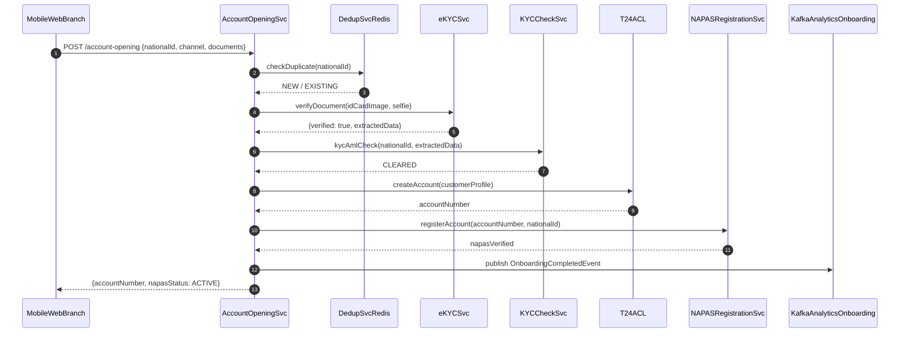

# Account Opening (Omnichannel)

Status: Draft | Last Reviewed: 2026-05-16 | Owner: @digital-channels-domain-owner
Catalog ID: REF-009 | Radii
Tier Applicability: T1

## Problem Statement

- eKYC document verification (ID card, face liveness) is implemented independently in mobile, web, and branch tablet apps, leading to three divergent verification flows with different fraud detection thresholds and inconsistent customer data captured into T24.
- NAPAS account registration requires a real-name verification step that must complete before the account number is issued; without synchronisation between T24 account creation and NAPAS registration, customers receive account numbers that are not yet valid for transfers, generating call-centre complaints.
- Regulatory eKYC requirements (SBV Circular 09/2020 §III.1) specify document types, liveness check standards, and retention periods for eKYC evidence; without a centralised eKYC service, each channel implements its own compliance interpretation, creating audit inconsistencies during SBV examination.
- Duplicate application detection is per-channel; a customer who starts an application on mobile and completes it on web creates two in-progress applications, neither of which can detect the other, resulting in duplicate account creation in T24.
- The onboarding funnel has a 40% drop-off rate between document upload and account number issuance; without step-by-step analytics events, the compliance team cannot identify where customers abandon — whether at eKYC, at document review, or at the NAPAS registration step.

## Context

Account opening is a T1 business-critical flow: not in the real-time payment hot path, but directly revenue-impacting (each completed account opening is a customer acquisition). The architecture supports 500–2,000 new accounts/day across three channels with a target TAT of < 10 minutes for digital channels (eKYC auto-approved) and < 2 business days for branch (manual document review). eKYC is provided by a third-party vendor (integrated via REST API); T24 account creation is via the Anti-Corruption Layer (INT-005).

## Solution

A shared AccountOpeningSvc orchestrates all channels via a channel-agnostic REST API. eKYC is delegated to a dedicated eKYCSvc that abstracts the third-party vendor. Duplicate detection uses a Redis deduplication key on `nationalId`. T24 account creation and NAPAS registration are orchestrated as a two-step saga (INT-001). Analytics events are emitted to Kafka for funnel analysis.



## Implementation Guidelines

### 1. AccountOpeningSvc — Spring Boot Orchestrator

```java
@Service
@RequiredArgsConstructor
public class AccountOpeningOrchestrator {

    private final DedupService dedupService;
    private final EkycClient ekycClient;
    private final KycCheckClient kycClient;
    private final T24AccountClient t24Client;
    private final NapasRegistrationClient napasClient;
    private final ApplicationEventPublisher analyticsPublisher;
    private final ApplicationRepository appRepo;

    @Transactional
    public AccountOpeningResult open(AccountOpeningRequest req) {
        if (dedupService.isDuplicate(req.nationalId())) {
            return AccountOpeningResult.duplicate(
                appRepo.findByNationalId(req.nationalId()).applicationId());
        }

        EkycResult ekyc = ekycClient.verify(req.idCardImage(), req.selfieImage());
        if (!ekyc.isVerified()) {
            analyticsPublisher.publishEvent(new FunnelDropEvent(req.applicationId(), "EKYC_FAILED"));
            throw new EkycVerificationException(ekyc.failureReason());
        }

        KycResult kyc = kycClient.check(req.nationalId(), ekyc.extractedData());
        if (kyc.isBlocked()) {
            throw new KycBlockedException(req.nationalId());
        }

        String accountNumber = t24Client.createAccount(
            CustomerProfile.from(req, ekyc.extractedData()));

        NapasResult napas = napasClient.register(accountNumber, req.nationalId());

        analyticsPublisher.publishEvent(new OnboardingCompletedEvent(
            req.applicationId(), req.channel(), accountNumber));

        return AccountOpeningResult.success(accountNumber, napas.status());
    }
}
```

### 2. eKYCSvc — Third-Party Vendor Abstraction

```java
@Service
@RequiredArgsConstructor
public class EkycService {

    private final EkycVendorClient vendorClient;
    private final EkycAuditRepository auditRepo;

    public EkycResult verify(byte[] idCardImage, byte[] selfieImage) {
        byte[] resizedId = ImageUtil.resize(idCardImage, 1024, 768);
        byte[] resizedSelfie = ImageUtil.resize(selfieImage, 640, 480);

        VendorEkycResponse vendorResp = vendorClient.verify(resizedId, resizedSelfie);

        auditRepo.save(EkycAuditRecord.builder()
            .sessionId(vendorResp.sessionId())
            .verificationResult(vendorResp.result())
            .idCardHash(sha256(idCardImage))
            .livenessScore(vendorResp.livenessScore())
            .capturedAt(Instant.now())
            .build());

        return EkycResult.fromVendorResponse(vendorResp);
    }
}
```

### 3. Deduplication — Redis with TTL

```java
@Service
@RequiredArgsConstructor
public class DedupService {

    private final StringRedisTemplate redis;
    private static final Duration DEDUP_WINDOW = Duration.ofDays(30);

    public boolean isDuplicate(String nationalId) {
        String key = "onboarding:dedup:" + nationalId;
        Boolean set = redis.opsForValue().setIfAbsent(key, "1", DEDUP_WINDOW);
        return !Boolean.TRUE.equals(set);
    }
}
```

## When to Use

- Digital account opening for retail customers requiring eKYC verification, KYC/AML screening, T24 account creation, and NAPAS registration in a single orchestrated flow.
- Unifying multiple channel-specific account opening implementations behind a shared AccountOpeningSvc to eliminate divergent eKYC implementations.
- Any new digital product launch requiring NAPAS-linked current accounts or savings accounts.

## When Not to Use

- Corporate and SME account opening — these require multi-signatory setup, director verification, and UBO disclosure that are out of scope for this architecture; use a separate corporate onboarding workflow.
- Account upgrades (e.g., basic savings to premium current) — the customer is already KYC-verified; use a simpler account type change flow in T24 without the full eKYC pipeline.
- Existing customer new-product application (credit card, loan) — customer identity is already established; use the loan origination (REF-006) or card-issuing flow.

## Variants

| Variant | Use when | Trade-off |
|---------|----------|-----------|
| Fully digital (eKYC auto-approved, this pattern) | Retail customers with Vietnamese ID and compatible mobile/web device | Depends on eKYC vendor uptime and liveness accuracy; edge cases require manual fallback |
| Branch-assisted digital | Remote areas with poor connectivity; elderly customers | Human agent guides eKYC on branch tablet; same backend pipeline; branch adds document scanner step |
| Manual document review fallback | eKYC score below confidence threshold | Adds 1–2 business day TAT; compliance team manually reviews scanned documents |

## NFR Acceptance Criteria

| Metric | Threshold | Measurement |
|--------|-----------|-------------|
| Digital account opening TAT p99 | 10 min (eKYC auto-approve path) | Measure applicationId created to accountNumber issued; assert p99 10 min |
| eKYC verification p99 latency | 8 s (vendor round-trip) | Measure `ekycClient.verify` duration; assert p99 8 s |
| NAPAS registration p99 latency | 3 s | Measure NAPAS client call duration; assert p99 3 s |
| Duplicate prevention | 0 duplicate T24 accounts for same nationalId | Dedup test: submit same nationalId twice; assert second returns existing applicationId |
| Availability | T1 — 99.9% (eKYC vendor degradation triggers manual review fallback) | Circuit breaker: if eKYC vendor p99 > 30s, switch to manual review queue |
| RTO | 1 h (AccountOpeningSvc pod failure; in-progress applications resume from saved state) | Chaos: kill AccountOpeningSvc; verify in-progress applications visible in queue |

## Compliance Mapping

| Ring | Regulation | Provision | How this architecture satisfies |
|------|-----------|-----------|--------------------------------|
| Ring 0 | FATF Recommendation 10 | Customer Due Diligence (CDD) — verify customer identity before establishing business relationship | eKYCSvc verifies government-issued ID and liveness before account creation; KYCCheckSvc screens against sanctions and PEP lists; no account is created without both checks passing. |
| Ring 1 | ISO 20022 | Account registration messages (acmt.001) — structured account opening confirmation | NAPAS registration triggers ISO 20022 acmt.001 account notification; AccountNumber and NationalId are structured per ISO 20022 field definitions. |
| Ring 2 | SBV Circular 09/2020 | §III.1 — eKYC standards for remote customer identification; document retention ⚠️ (working summary — pending Legal review) | eKYCSvc stores eKYC session ID, liveness score, and document hash per SBV §III.1; raw images are not stored (only SHA-256 hash); vendor session evidence retained 5 years; Legal review required to confirm that hash-only storage (not full image) and vendor-hosted evidence satisfy SBV eKYC evidence retention requirements. |

## Cost / FinOps

- eKYC vendor: charged per verification; at 1,500 new accounts/day, assume 1,800 eKYC calls/day (20% retry rate on failed liveness). Negotiate a per-call tier with the vendor based on monthly volume.
- AccountOpeningSvc: 2 Spring Boot pods × `t3.medium` = ~USD 60/month. Scales at peak (salary month) via HPA.
- Redis deduplication: 30-day retention × 1,500 keys/day × 50 bytes/key = 2.25 MB — negligible.
- eKYC audit record storage: 1,500 records/day × 500 bytes = 750 KB/day; 3-year retention = ~820 MB — negligible.

## Threat Model

- **eKYC liveness bypass (Spoofing)**: Attacker presents a high-quality photo of a victim's face to pass the liveness check and open an account in the victim's name. Mitigation: eKYC vendor uses 3D depth-map liveness (not 2D photo comparison); liveness confidence threshold set to 95%; sessions with score 90–95% trigger manual review; vendor SLA includes anti-spoofing performance guarantee.
- **Duplicate account creation race condition (Denial of Service)**: Two concurrent requests for the same nationalId pass the dedup check simultaneously if Redis write is not atomic. Mitigation: `redis.opsForValue().setIfAbsent(key, "1", DEDUP_WINDOW)` is atomic in Redis; only one of two concurrent requests will succeed; the second receives the existing applicationId.

## Operational Runbook Stub

**Alert: `ekyc_vendor_p99 > 30s`** (eKYC vendor degradation)
- p50 baseline: 3 s | p99 SLO: 8 s
- Remediation: (1) Check vendor status page. (2) If vendor degraded, activate manual review fallback: update OPA feature flag `ekyc.fallback_enabled = true`; AccountOpeningSvc routes to manual review queue. (3) Notify digital channels team that TAT will increase to 1–2 business days. (4) If vendor unavailable > 4h, escalate to vendor account manager.

**Alert: `onboarding_funnel_dropoff > 50%` at any step**
- p50 baseline: 40% | p99 SLO: N/A
- Remediation: (1) Identify drop-off step from `analytics.onboarding` Kafka topic aggregation. (2) If at `EKYC_FAILED`: check vendor liveness threshold — recent firmware update may have tightened the threshold. (3) If at `NAPAS_REGISTRATION`: check NAPAS connectivity. (4) Notify product team for UX investigation.

## Test Strategy Stub

- **Unit**: `AccountOpeningOrchestratorTest` — happy path asserts T24 and NAPAS called, `OnboardingCompletedEvent` published; eKYC failure asserts `EkycVerificationException`, T24 NOT called, `FunnelDropEvent` published; KYC blocked asserts `KycBlockedException`.
- **Unit**: `DedupServiceTest` — first call for nationalId returns false; immediate second call returns true (dedup active).
- **Integration**: Spring Boot Test with Testcontainers (Redis + PostgreSQL + Kafka) + WireMock (eKYC vendor, T24, NAPAS): full happy path asserts account number in DB and NAPAS status ACTIVE; duplicate nationalId asserts second call returns existing applicationId; eKYC vendor 500 asserts circuit breaker opens after 5 failures.
- **Compliance**: SBV §III.1 evidence retention — complete 10 eKYC sessions, query `ekycAuditRecords`, assert each has `sessionId`, `livenessScore`, `idCardHash`, and `capturedAt`, assert NO `idCardImageBytes` column. FATF CDD — attempt account opening with `isSanctioned = true`, assert `KycBlockedException`, assert no T24 account created.

## Related Patterns

- [REF-003 KYC/AML Onboarding](kyc-aml-onboarding.md)
- [MOB-003 Mobile Biometric Authentication](../patterns/mobile/mobile-biometric-auth.md)
- [INT-005 Anti-Corruption Layer](../patterns/integration/anti-corruption-layer.md)
- [BSP-002 Idempotent Payment Key](../patterns/banking-solutions/idempotent-payment-key.md)

## References

- [SBV Circular 09/2020/TT-NHNN — Information Technology Security in Banking](https://thuvienphapluat.vn/van-ban/Tien-te-ngan-hang/Thong-tu-09-2020-TT-NHNN)
- [FATF Guidance on Digital Identity](https://www.fatf-gafi.org/en/publications/Fatfrecommendations/Digital-identity-guidance.html)
- [ISO 20022 acmt.001 — Account Opening Request](https://www.iso20022.org/catalogue-messages/iso-20022-messages-archive?search=acmt.001)
- [NAPAS — National Payment Corporation of Vietnam](https://napas.com.vn/)
- [Decree 13/2023/ND-CP — Personal Data Protection](https://vanban.chinhphu.vn/default.aspx?pageid=27160&docid=207126)
- Catalog reference: `governance/standards/enterprise-architecture-catalog.md`
