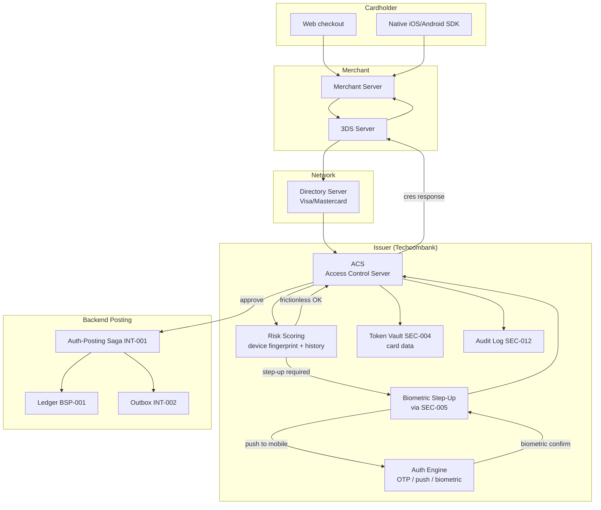

# Card Authorization (3DS2)

Status: Draft | Last Reviewed: 2026-05-09 | Owner: @payments-domain-owner, @ciso-delegate
Catalog ID: REF-004 | Radii (composes spine)
Tier Applicability: T0

## Problem Statement

E-commerce and in-app card payments must satisfy EMVCo 3-D Secure 2.x (3DS2) for cardholder authentication, plus PCI-DSS 4.0 for cardholder-data handling, while keeping the customer-experienced friction low (target step-up rate < 20%) and decision latency under 1 second. The Access Control Server (ACS) operated by Techcombank as issuer must provide risk-based authentication, biometric step-up where appropriate, and full auditability — across web, in-app SDK, and merchant-server flows.

## Context

Reach for this reference architecture when:

- Building or modifying any cardholder authentication flow (3DS2 issuer ACS).
- Integrating a new merchant or wallet (Apple Pay / Google Pay / VietQR card).
- Updating risk-scoring rules for step-up decisions.
- Coordinating with card-scheme rule changes (Visa / Mastercard).

This complements [REF-002 Real-Time Payments NAPAS](real-time-payments-napas.md) — REF-002 covers account-to-account NAPAS 247; REF-004 covers card-network authentication.

## Solution



### Frictionless vs challenge

3DS2 distinguishes:

- **Frictionless flow** — ACS approves based on risk score alone; no customer interaction. Target ≥ 80% of authentications.
- **Challenge flow** — ACS step-up requires customer to confirm via biometric (preferred) or OTP. Target ≤ 20%.

Risk score inputs: device fingerprint, geolocation consistency, transaction-amount-vs-history, merchant category, time-of-day pattern, prior-fraud-flag.

### Web vs in-app challenge UX

- **Web**: 3DS2 challenge in iframe; ACS-controlled. Customer types OTP or confirms via push.
- **In-app**: Visa or Mastercard 3DS SDK embedded in mobile app; ACS challenge rendered natively; biometric integrated via [SEC-005](../patterns/security/bff-token-binding.md) device-bound flow.

### Step-up to biometric

When step-up triggers AND the cardholder is using Techcombank's mobile app:

1. ACS sends a push notification to the cardholder's app via [SEC-005](../patterns/security/bff-token-binding.md) DPoP-authenticated channel.
2. App displays biometric prompt (Touch / Face ID on iOS; class-3 BiometricPrompt on Android).
3. App signs a challenge response with device-bound key (Secure Enclave / Keystore).
4. ACS verifies signature; approves authentication.

This satisfies PSD2 SCA + Vietnam SBV §III multi-factor expectations.

## Implementation Guidelines

### ACS — Spring Boot core

```java
@RestController
@RequestMapping("/3ds2/acs")
public class AcsController {

    @PostMapping("/areq")    // Authentication Request from DS
    @LatencyBudget(tier = "T0", p50Millis = 200, p95Millis = 800, p99Millis = 1500)
    public AReqResponse handleAReq(@RequestBody AReqMessage areq) {
        // 1. Verify message signature (DS-issued cert)
        signatureVerifier.verify(areq);

        // 2. Risk-score
        RiskDecision decision = riskEngine.assess(areq);

        return switch (decision.outcome()) {
            case FRICTIONLESS_APPROVE -> buildApproveResponse(areq, decision);
            case STEP_UP_BIOMETRIC -> {
                stepUpService.initiateBiometric(areq);
                yield buildChallengeResponse(areq);
            }
            case STEP_UP_OTP -> {
                stepUpService.initiateOtp(areq);
                yield buildChallengeResponse(areq);
            }
            case DECLINE -> buildDeclineResponse(areq, decision);
        };
    }

    @PostMapping("/cres")    // Challenge Result from cardholder device
    public CResResponse handleCRes(@RequestBody CResMessage cres) {
        StepUpResult result = stepUpService.verify(cres);
        return result.success() ? approve(cres) : decline(cres);
    }
}
```

### iOS Swift — 3DS SDK integration with biometric

```swift
import ThreeDSCore   // Visa / Mastercard 3DS SDK

final class CardChallengeHandler: ThreeDSChallengeStatusReceiver {

    func performChallenge(transactionId: String, challenge: ChallengeParameters) async throws {
        // 1. Show 3DS SDK challenge UI
        let result = try await threeDSService.doChallenge(challenge)

        // 2. If issuer requested biometric step-up, evaluate
        if result.requiresBiometric {
            let dpopProof = try await DeviceKeyManager.makeDpopProof(
                for: bffClient.acsCallbackURL,
                method: "POST",
                key: deviceKey
            )

            try await bffClient.post(
                path: "/3ds2/acs/biometric-confirm",
                body: BiometricConfirm(transactionId: transactionId, sdkResult: result),
                headers: ["DPoP": dpopProof]
            )
        }
    }
}
```

### Android Kotlin — analogous

(Uses Google's Mastercard / Visa SDK; same biometric-step-up via DPoP; uses `BiometricPrompt` class-3.)

### Risk engine

```java
@Component
public class RiskEngine {

    public RiskDecision assess(AReqMessage areq) {
        double score = 0.0;
        // Device fingerprint consistency
        score += deviceFingerprint.scoreConsistency(areq);
        // Geolocation
        score += geo.scoreConsistency(areq);
        // Velocity (txns in last 1h)
        score += velocity.score(areq.cardholderId());
        // Merchant category risk
        score += merchantCategoryRisk(areq.merchantId());
        // Amount anomaly vs cardholder history
        score += amountAnomaly.score(areq.amount(), areq.cardholderId());

        if (score < FRICTIONLESS_THRESHOLD) return RiskDecision.frictionlessApprove(score);
        if (score < CHALLENGE_THRESHOLD) return RiskDecision.stepUpBiometric(score);
        if (score < DECLINE_THRESHOLD) return RiskDecision.stepUpOtp(score);
        return RiskDecision.decline(score);
    }
}
```

### T24 / legacy — posting integration

Successful authentications trigger an authorisation-posting saga that places a hold on the cardholder's account. Integrates with T24 via [INT-005 Anti-Corruption Layer](../patterns/integration/anti-corruption-layer.md) and uses [PRIN-006 idempotent](../principles/idempotency-by-default.md) keys (transaction-id + auth-id) to ensure no double-hold under retry conditions. Settlement (clearing) is async via card-scheme files (typically T+1).

## Variants & Trade-offs

| Variant | When | Trade-off |
|---|---|---|
| **3DS2 frictionless-default (this doc)** | Default; majority of transactions | Best UX; depends on risk-engine quality |
| **Always-challenge** | Very high-value or first-time merchant | Lower fraud; higher cardholder friction |
| **Out-of-band push** (Techcombank app) | Cardholder uses TCB mobile app | Best UX for app users; needs SEC-005 device-binding |
| **In-iframe OTP** | Cardholder doesn't use TCB app | Wider compatibility; SMS dependency |

## NFR Acceptance Criteria

```yaml
nfr_acceptance_criteria:
  service_name: card-acs
  tier: T0
  rto_minutes: 5
  rpo_seconds: 0
  availability_target_pct: 99.99
  recovery_topology: multi-region-active-active

  latency:
    p50_ms: 200
    p95_ms: 800
    p99_ms: 1500
  throughput_target:
    sustained_rps: 2000
    peak_rps: 6000      # Black Friday / Tet

  failure_modes:
    - id: FM1
      description: Risk engine ML inference timeout
      response: fall through to step-up (conservative)
    - id: FM2
      description: Step-up channel unavailable (push, SMS)
      response: alternative channel; on full unavailability decline transaction
    - id: FM3
      description: Region failure
      response: Multi-region failover via REF-001
    - id: FM4
      description: Card-scheme DS unreachable
      response: fail-secure decline; alert payments-domain-owner

  catalog_references:
    - {id: NFR-001, reason: "Tier T0"}
    - {id: NFR-002, reason: "Sub-second latency budget"}
    - {id: PRIN-006, reason: "Auth-posting idempotency"}
    - {id: SEC-004, reason: "Card data tokenisation"}
    - {id: SEC-005, reason: "BFF + DPoP for biometric step-up"}
    - {id: SEC-010, reason: "ABAC for analyst tools"}
    - {id: SEC-012, reason: "Tamper-evident audit"}
    - {id: REF-001, reason: "Multi-region active-active"}
    - {id: RES-002, reason: "Circuit breaker on DS / step-up channels"}
    - {id: RES-005, reason: "Cell-based blast radius"}
    - {id: INT-001, reason: "Auth-posting saga"}
```

## Compliance Mapping

| Layer | Reference | Section/Control | How |
|---|---|---|---|
| Ring 0 | EMVCo 3-D Secure Specification 2.3 | Authentication message flow + UX requirements | Direct implementation |
| Ring 0 | NIST SP 800-63B AAL2/AAL3 | Multi-factor authentication assurance | Risk score + biometric / OTP step-up |
| Ring 1 | PCI-DSS 4.0 §6 (Secure systems) | Develop and maintain secure systems | ACS in PCI scope; SAST, DAST, pen-testing |
| Ring 1 | PCI-DSS 4.0 §8 (Authentication) | Strong cardholder authentication | 3DS2 frictionless or challenge |
| Ring 1 | PCI-DSS 4.0 §3 (PAN protection) | PAN never logged or stored outside vault | SEC-004 tokenisation |
| Ring 1 | PSD2 SCA / RTS (where applicable cross-border) | Strong Customer Authentication | 3DS2 + biometric satisfies SCA |
| Ring 1 | Visa / Mastercard scheme rules | Issuer obligations | ACS certified per scheme; annual recertification |
| Ring 2 | SBV Circular 09/2020 §III (UNOFFICIAL) | Multi-factor authentication for banking | Biometric + device-binding satisfies multi-factor |

## Cost / FinOps Notes

| Component | Order of magnitude / month |
|---|---|
| ACS infrastructure (cell-based, multi-region) | ~$10–20k |
| Risk engine ML inference | ~$2–5k |
| Step-up channels (SMS / push / OTP) | per-message + telco fees |
| HSM (PCI-DSS) | shared with REF-002 (~$5–10k) |
| Card-scheme certification + recertification | annual fee |

**Levers**:
- Improve frictionless rate (target 85%+) to reduce step-up channel cost.
- Cache device-fingerprint scores for repeat low-risk merchants.

## Threat Model Summary

STRIDE: primarily **Spoofing** (account takeover) and **Tampering** (transaction manipulation).

- **Top 3 threats addressed**:
  1. *Account takeover* — stolen card alone insufficient; risk-engine + biometric step-up requires possession of cardholder's device.
  2. *Sophisticated phishing* — biometric step-up via TCB app prevents SIM-swap-bypassed OTP attacks.
  3. *Replay of 3DS challenge* — `transactionId` and signed CRes prevent replay.
- **Top 3 residual threats**:
  1. *Compromised cardholder device with bypassed biometric* — outside our control; mitigated by behavioural-anomaly post-auth.
  2. *Issuer-side compromise of risk engine* — strict change control; ML drift monitoring.
  3. *Card-scheme fraud at the network level* — outside our control; bound by scheme rules.

## Operational Runbook

- **Alerts**:
  - `ACS_AReqLatency_P95`: > 800 ms for > 5 min. Severity: Critical.
  - `Frictionless_Rate_Drop`: < 70% over rolling 1 h. Severity: High (model regression or rule change).
  - `StepUp_ChannelFail`: any step-up channel error rate > 5%. Severity: High.
  - `Decline_Rate_Anomaly`: decline rate > 3× baseline. Severity: High (possible scheme-rule change or fraud campaign).
- **Dashboards**: Grafana — `acs-overview` (latency, frictionless rate, step-up rate, decline rate, channel health, saga depth).
- **Card-scheme certification renewals**: tracked in compliance calendar; pre-renewal performance test required.

## Test Strategy

- **Unit**: ARes / CRes parsers; risk-engine assessors; saga steps.
- **Integration**: Testcontainer ACS with mock DS; full frictionless + challenge flows.
- **Mobile**: per-platform test for in-app SDK + biometric step-up.
- **Performance**: peak load (6k RPS) for 30 min; verify P95.
- **Chaos**: kill DS connection; kill step-up channels; verify fail-secure behaviour.
- **Compliance**: annual PCI-DSS audit; annual scheme recertification; pen-test.

## When to Use

- All issuer-side card authentications for Techcombank-issued cards on e-commerce / in-app purchases.

## When NOT to Use

- Account-to-account transfers ([REF-002](real-time-payments-napas.md) is canonical for those).
- Card-present (POS) — different flow, falls under EMV chip + PIN; not in this doc.
- ATM withdrawals — different flow.

## Related Patterns

- All 6 spine docs
- [SEC-004 Tokenization + HSM](../patterns/security/tokenization-hsm.md), [SEC-005 BFF + Token-Binding](../patterns/security/bff-token-binding.md), [SEC-010 ABAC](../patterns/security/attribute-based-access-control.md), [SEC-012 Tamper-Evident Audit](../patterns/security/audit-logging-tamper-evident.md)
- [INT-001 Saga](../patterns/integration/saga-orchestration.md), [INT-002 Outbox+CDC](../patterns/integration/cdc-outbox-pattern.md), [INT-005 Anti-Corruption Layer](../patterns/integration/anti-corruption-layer.md)
- [RES-002 Circuit Breaker](../patterns/resilience/circuit-breaker.md), [RES-005 Cell-Based](../patterns/resilience/cell-based-architecture.md)
- [BSP-005 Reversal & Chargeback](../patterns/banking-solutions/reversal-and-chargeback.md), [SEC-009 Fraud Signal Collection](../patterns/security/fraud-signal-collection.md)
- [MOB-003 Mobile Biometric Auth](../patterns/mobile/mobile-biometric-auth.md)

## References

- EMVCo 3-D Secure 2.3 specification
- PCI-DSS v4.0
- PSD2 SCA / RTS
- Visa Secure / Mastercard SecureCode issuer guidelines
- `_research-notes.md` §PCI-DSS

---

**Key Takeaway**: T0 issuer ACS for 3DS2 = risk-scored frictionless-by-default + biometric step-up via TCB app where applicable + saga-driven authorisation posting + tokenised card data. Multi-region active-active. Sub-second latency. PCI-DSS §3, §6, §8 + EMVCo 3DS 2.3 + PSD2 SCA satisfied.
