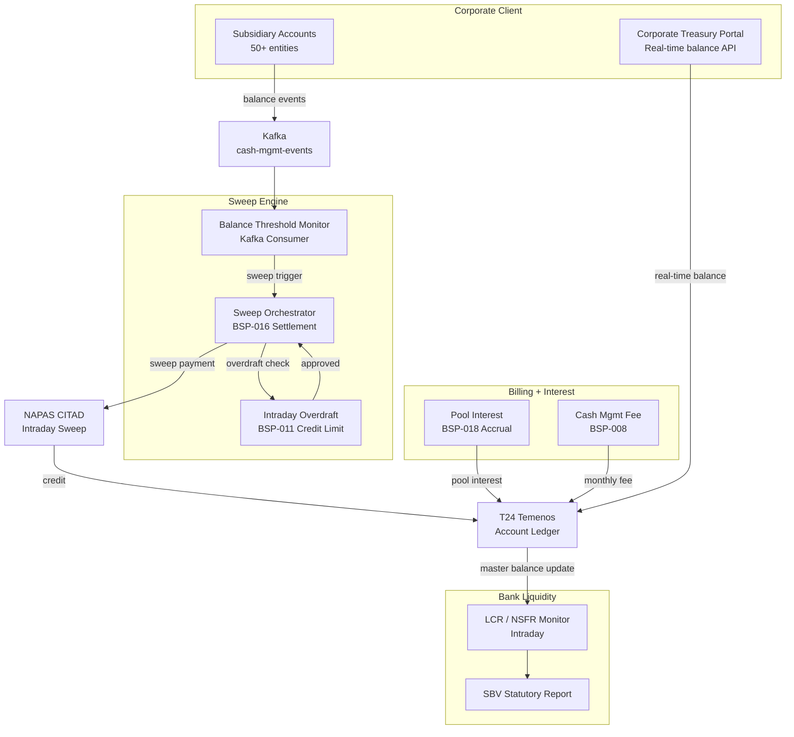

# Cash Management and Liquidity

Status: Draft | Last Reviewed: 2026-05-21 | Owner: @core-banking-domain-owner
Catalog ID: REF-020 | Radii
Tier Applicability: T0, T1

## Problem Statement

Corporate cash management — zero-balance accounts (ZBA), notional pooling, cash concentration, and intraday liquidity monitoring — requires real-time visibility across hundreds of subsidiary accounts and automated sweeping that the bank can offer as a service. Three failure modes are common. First, corporate treasurers managing 50+ subsidiary accounts receive daily PDF statements rather than API-accessible real-time balances, forcing manual spreadsheet consolidation that introduces errors and delays investment decisions. Second, cash sweeping (concentrating surplus balances to a master account) is configured as end-of-day T24 batch jobs, meaning intraday liquidity is trapped in subsidiary accounts rather than deployed to the overnight money market. Third, the bank's own intraday liquidity position (Basel III LCR/NSFR reporting) is calculated from T24 overnight batch data, violating Basel III's intraday monitoring requirements.

This platform integrates BSP-008 (Fee Engine for cash management fees), BSP-011 (Credit Limit Engine for intraday overdraft limits on sweeping accounts), BSP-016 (Settlement Engine for intraday sweep payments), and BSP-018 (Accrual Engine for interest on pooled balances) to deliver a real-time corporate cash management and bank liquidity monitoring solution.

## Context

The Cash Management and Liquidity Platform is used by corporate treasury clients, the bank's own ALM team, and the regulatory reporting function. It integrates with NAPAS CITAD for domestic VND sweeps and SWIFT for cross-currency concentration. Applicable for corporate clients with > 20 subsidiary accounts or for the bank's own LCR/NSFR monitoring. For small corporates with < 5 accounts, T24 standing order sweeps are sufficient.

## Solution

Four Wave 9 engines work together: BSP-016 executes intraday sweeps triggered by balance thresholds; BSP-011 monitors intraday overdraft on the master account during concentration; BSP-008 calculates cash management service fees; BSP-018 accrues interest on notional pool balances.



## Implementation Guidelines

**1. Balance Threshold Monitor + Intraday Sweep (BSP-016)**

```java
@KafkaListener(topics = "account-balance-events", groupId = "sweep-monitor")
public void onBalanceEvent(AccountBalanceEvent event) {
    SweepConfiguration config = sweepConfigRepository.findByAccountId(event.accountId());
    if (config == null) return;

    BigDecimal currentBalance = event.currentBalance();
    if (currentBalance.compareTo(config.sweepThreshold()) > 0) {
        BigDecimal sweepAmount = currentBalance.subtract(config.targetBalance());
        initiateSwep(event.accountId(), config.masterAccountId(), sweepAmount, event.currency());
    } else if (currentBalance.compareTo(config.minimumBalance()) < 0) {
        BigDecimal topUpAmount = config.targetBalance().subtract(currentBalance);
        initiateReverseSwep(config.masterAccountId(), event.accountId(), topUpAmount, event.currency());
    }
}

private void initiateSwep(String fromAccount, String toAccount, BigDecimal amount, String currency) {
    LimitCheckResult limitCheck = creditLimitEngine.check(toAccount, "INTRADAY_OVERDRAFT", amount, currency);
    if (!limitCheck.allowed()) {
        eventPublisher.publishEvent(new SweepBlockedEvent(fromAccount, toAccount, amount, "LIMIT_EXCEEDED"));
        return;
    }
    SettlementInstruction instruction = SettlementInstruction.builder()
        .settlementType("INTERNAL")
        .currency(currency)
        .amount(amount)
        .correspondentBIC("INTERNAL")
        .valueDate(LocalDate.now())
        .reference("SWEEP:" + fromAccount + ":" + Instant.now().getEpochSecond())
        .build();
    settlementEngine.settle(instruction);
}
```

BSP-016 routes internal sweeps (same bank) directly without NAPAS — sub-100 ms. Cross-entity sweeps (different legal entities) go via NAPAS CITAD.

**2. Intraday LCR / NSFR Monitoring**

```java
@Scheduled(fixedDelay = 60000) // every 60 seconds
public void calculateIntradayLcr() {
    BigDecimal hqla = portfolioService.getHqlaValue(); // Level 1 + Level 2 assets
    BigDecimal netCashOutflows = cashFlowProjection.getNext30DayNetOutflow();
    BigDecimal lcr = hqla.divide(netCashOutflows, 4, RoundingMode.HALF_UP)
        .multiply(BigDecimal.valueOf(100));

    metricsRegistry.gauge("liquidity.lcr.percent", lcr);

    if (lcr.compareTo(LCR_MINIMUM_PERCENT) < 0) {
        alertService.send(new LcrBreachEvent(lcr, LCR_MINIMUM_PERCENT));
    }
}
```

LCR minimum: 100% (Basel III). NSFR calculated daily. Both published to Kafka `liquidity-events` for SBV statutory reporting.

**3. Pool Interest Accrual (BSP-018)**

```java
@Scheduled(cron = "0 30 23 * * *")
public void accruePoolInterest() {
    List<NotionalPool> pools = poolRepository.findAllActive();
    pools.forEach(pool -> {
        BigDecimal poolBalance = pool.accounts().stream()
            .map(accountId -> accountService.getBalance(accountId))
            .reduce(BigDecimal.ZERO, BigDecimal::add);

        AccrualRequest req = AccrualRequest.builder()
            .principal(poolBalance)
            .annualRate(pool.poolRate())
            .convention(DayCountConvention.ACT_365)
            .fromDate(LocalDate.now())
            .toDate(LocalDate.now().plusDays(1))
            .build();

        BigDecimal dailyInterest = interestEngine.calculate(req).interestAmount();
        pool.accounts().forEach(accountId -> {
            BigDecimal share = calculateShare(accountId, pool, poolBalance);
            ledgerPostingService.postInterest(accountId, dailyInterest.multiply(share));
        });
    });
}
```

Notional pool interest is accrued daily and posted to each subsidiary account proportional to its average daily balance contribution.

**4. Cash Management Fee (BSP-008)**

```java
public FeeResult calculateMonthlyFee(String clientId, String masterId) {
    int sweepCount = sweepAuditRepository.countSweepsForMonth(masterId, YearMonth.now());
    BigDecimal avgDailyBalance = accountService.getAverageDailyBalance(masterId, YearMonth.now());

    FeeRequest req = FeeRequest.builder()
        .productCode("CASH_MGMT_POOLING")
        .transactionType("MONTHLY_SERVICE")
        .amount(avgDailyBalance)
        .customerId(clientId)
        .transactionCount(sweepCount)
        .build();
    return feeEngine.calculate(req);
}
```

Fee schedule in BSP-008: base monthly fee (VND 5 M/month) + per-sweep fee (VND 10,000/sweep above 50/day) + waived for Platinum relationship tier (BSP-020).

## Compliance Mapping

| Layer | Reference | Section/Control | How this satisfies |
|-------|-----------|----------------|-------------------|
| Ring 0 — Global | Basel III LCR | §§24–67 — Liquidity Coverage Ratio | Intraday LCR calculated every 60 s; published to Kafka; SBV reporting pipeline consumes `liquidity-events` |
| Ring 0 — Global | Basel III NSFR | §§114–140 — Net Stable Funding Ratio | NSFR calculated daily; HQLA composition (Level 1/2) maintained in portfolio service |
| Ring 0 — Global | IFRS 9 | §5.4 — Interest income recognition | BSP-018 accrual uses EIR for pool interest; daily accrual entries logged for IFRS audit |
| Ring 1 — International | BCBS 239 | §4 — Accuracy of risk data for liquidity | LCR/NSFR events published with idempotency key; complete audit trail to BCBS 239 standard |
| Ring 1 — International | ISO 20022 camt.052 | Account balance reporting | Corporate treasury portal exposes balance API using camt.052 message format |
| Ring 2 — Vietnam | SBV Circular 09/2020 | §IV.2 — Security of payment systems | NAPAS CITAD sweeps over encrypted leased line; T24 integration via internal network only ⚠️ (working summary — pending Legal review) |

## NFR Acceptance Criteria

```yaml
nfr_acceptance_criteria:
  catalog_id: REF-020
  pattern: Cash Management and Liquidity
  performance:
    - id: REF-020-HP-01
      description: Balance event to sweep trigger must complete within 500ms p99.
      threshold: p99 < 500ms
    - id: REF-020-HP-02
      description: Internal sweep settlement (same bank, no NAPAS) must complete within 100ms p99.
      threshold: p99 < 100ms
    - id: REF-020-HP-03
      description: Intraday LCR recalculation must complete within 10 seconds.
      threshold: calculation_window < 10s
  availability:
    - id: REF-020-HA-01
      description: Sweep Engine and LCR Monitor must maintain 99.99% uptime for T0.
      threshold: availability ≥ 99.99% (T0)
  correctness:
    - id: REF-020-COR-01
      description: Duplicate balance event must not produce a second sweep (idempotent consumer).
      threshold: 0 duplicate sweeps per day
    - id: REF-020-COR-02
      description: Pool interest allocation must sum exactly to total pool interest with zero rounding loss.
      threshold: allocation_variance_bps = 0
```

## Cost / FinOps Notes

- BSP-016 for internal sweeps: negligible additional cost — internal routing bypasses NAPAS fees
- NAPAS CITAD transaction fee: VND 2,000 per sweep for cross-entity; design sweep thresholds to minimise NAPAS calls (e.g., sweep only > VND 1 B moves)
- BSP-018 accrual for pool interest: runs nightly; 5 partitions for up to 1,000 pooled accounts; < 2 min
- Redis for balance event stream buffer: shared cluster with other payment events; incremental cost ~$50/month
- SBV LCR/NSFR statutory report: generated from Kafka events; no dedicated infra

## Threat Model

**Sweep manipulation for fund transfer fraud (Tampering)** — An attacker modifies sweep configuration thresholds to trigger sweeps to an attacker-controlled master account, draining subsidiary balances. Mitigation: sweep configuration changes require dual approval (RM + operations supervisor); all configuration changes emit `SweepConfigAuditEvent` to append-only Kafka topic; master account ID is validated against the client's corporate structure registry on each sweep.

**False LCR reporting (Repudiation)** — An insider suppresses `LcrBreachEvent` messages on Kafka before they reach the SBV reporting pipeline, hiding an LCR breach from regulators. Mitigation: Kafka `liquidity-events` topic has retention 90 days and offset committed only after SBV reporting pipeline confirms receipt; SBV reporting pipeline cross-checks received LCR values against T24 balance snapshots; discrepancies trigger `LcrAuditMismatchAlert`.

## Operational Runbook

1. Alert: SweepEngineBacklog — Kafka consumer group `sweep-monitor` lag > 1,000 balance events for > 2 min.
   - Scale sweep engine pods: `kubectl scale deployment sweep-engine --replicas=4 -n cash-mgmt`
   - Check for NAPAS CITAD degradation (if external sweeps are queuing)
   - If NAPAS is down, route all sweeps as internal until NAPAS recovers; notify @core-banking-domain-owner

2. Alert: LcrBreach — Intraday LCR drops below 100% threshold.
   - Alert ALM team and treasury immediately
   - Initiate emergency HQLA purchase via REF-018 Treasury (repo facility with SBV)
   - Pause discretionary cash sweeps to preserve liquidity at the bank level

3. Alert: PoolInterestPostingFail — nightly pool interest accrual batch fails to post for any pool.
   - Check BSP-018 accrual batch execution log
   - Re-run for failed pool: `POST /actuator/batch/jobs/poolInterestJob/restart?poolId={id}`
   - If T24 ledger is unavailable, hold accrual entries in local staging table and post on T24 recovery

## Test Strategy

**Unit:** Test `SweepOrchestrator` with account balance above threshold — assert sweep amount = balance - targetBalance; assert idempotent (duplicate event does not trigger second sweep). Test LCR calculation with HQLA = VND 500 B, net outflow = VND 400 B — assert LCR = 125%.

**Integration:** Testcontainers (PostgreSQL + Redis + Kafka) end-to-end: configure ZBA for 3 subsidiary accounts → publish balance events above threshold → assert sweep triggered → assert master account credited via BSP-016 → assert BSP-011 overdraft check called → assert LCR metric updated.

**Compliance:** Assert LCR is calculated within 60 s of any HQLA change event; assert pool interest allocation sums exactly to total pool interest (no rounding loss). Assert sweep configuration change audit event contains RM identity, old threshold, new threshold, and approval reference.

**Chaos:** Kill BSP-016 settlement pod during active sweeps; assert sweep is retried with original idempotency key on recovery without duplicate posting. Kill Redis balance event buffer; assert balance events are replayed from Kafka on reconnection without missed sweeps.

## When to Use

- Corporate client with > 20 subsidiary accounts requiring automated cash concentration
- Bank's own intraday LCR/NSFR monitoring (Basel III requirement)
- Notional pooling with interest allocation across a corporate group
- Automated intraday sweeping with threshold-based triggers

## When Not to Use

- Retail personal accounts — ZBA and notional pooling are corporate treasury products
- Small corporate (< 5 accounts) — T24 standing order sweeps are sufficient
- Cross-border multi-currency concentration — use REF-018 Treasury FX Platform for FX conversion before sweeping

## Variants

| Variant | When to prefer | Trade-off |
|---------|---------------|-----------|
| Zero-Balance Account (ZBA) | All subsidiary surpluses swept to zero daily | Simple; maximises master account balance; subsidiaries need overdraft limit (BSP-011) |
| Target Balance Account (TBA) | Subsidiaries maintain minimum operating balance | Subsidiaries retain liquidity buffer; less NAPAS sweep cost |
| Notional Pooling | No physical movement; interest calculated on combined balance | No settlement cost; IFRS treatment more complex; some jurisdictions restrict |

## Related Patterns

- [BSP-008 Fee Engine](../patterns/banking-solutions/fee-engine.md)
- [BSP-011 Credit Limit Engine](../patterns/banking-solutions/credit-limit-engine.md)
- [BSP-016 Settlement Engine](../patterns/banking-solutions/settlement-engine.md)
- [BSP-018 Accrual Engine](../patterns/banking-solutions/accrual-engine.md)
- [EIP-025 Dead Letter Channel](../patterns/eip/dead-letter-channel.md)
- [RES-005 Cell-Based Architecture](../patterns/resilience/cell-based-architecture.md)

## References

- Basel III: The Liquidity Coverage Ratio — BCBS January 2013
- Basel III: Net Stable Funding Ratio — BCBS October 2014
- IFRS 9 Financial Instruments — IASB 2014 (effective 2018)
- BCBS 239 — Principles for Effective Risk Data Aggregation — BCBS January 2013
- ISO 20022 camt.052 — Account Balance Reports
- NAPAS CITAD Operating Rules (internal reference)
- SBV Circular 09/2020 — Information System Security for Credit Institutions

---
**Key Takeaway**: The Cash Management and Liquidity Platform converts end-of-day batch sweeping into event-driven intraday concentration — giving corporate treasurers real-time balance APIs and giving the bank's ALM team the 60-second LCR visibility that Basel III's intraday monitoring requirements demand.
