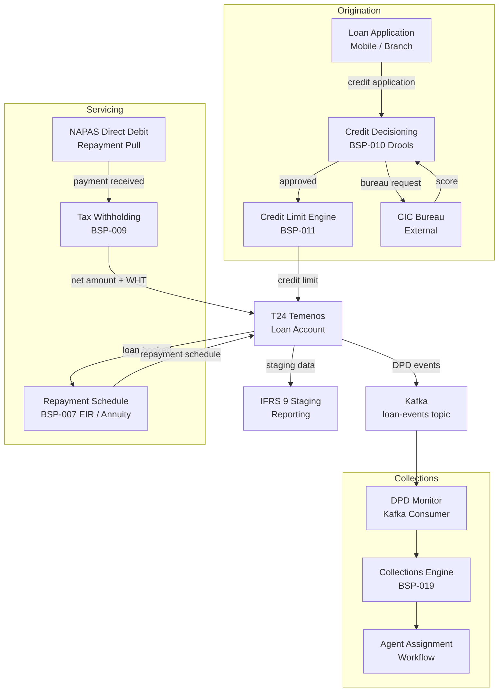

# Consumer Lending Platform

Status: Draft | Last Reviewed: 2026-05-21 | Owner: @lending-domain-owner
Catalog ID: REF-014 | Radii
Tier Applicability: T0, T1

## Problem Statement

Consumer lending — personal loans, auto loans, and salary-backed credit — suffers from three systemic deficiencies. First, credit decisioning relies on rule sets hard-coded in the core banking system, making policy changes a 4–6 week release cycle rather than a same-day configuration update. Second, tax withholding on interest income (PIT/CIT) is computed in a separate back-office system with nightly reconciliation, creating a 24-hour lag between payment receipt and tax liability posting. Third, collections workflows are manual spreadsheet-driven processes that miss early delinquency signals, causing NPL ratios to spike before collections teams engage.

This platform integrates the Rule/Decisioning Engine (BSP-010), Interest Calculation Engine (BSP-007), Tax Calculation Engine (BSP-009), Credit Limit Engine (BSP-011), and Collections Engine (BSP-019) into a coherent origination-to-servicing-to-collections lifecycle that is policy-driven, real-time, and auditable.

## Context

The Consumer Lending Platform is used by digital origination channels (mobile app loan application), branch origination staff, and automated collections workflows. It integrates upstream with the credit bureau (CIC Vietnam) for bureau scores and downstream with T24 for loan account posting and NAPAS for repayment pull. Applicable when loan portfolio exceeds 50 k accounts or when regulatory reporting requires IFRS 9 loan staging. For micro-lending (<VND 50 M ticket), a lighter decisioning flow (BSP-010 alone) is sufficient.

## Solution

The platform orchestrates five Wave 9 engines across three lifecycle stages: Origination (BSP-010 credit decisions + BSP-011 limit assignment), Servicing (BSP-007 repayment schedule + BSP-009 tax withholding), and Collections (BSP-019 delinquency management).



## Implementation Guidelines

**1. Credit Decisioning via BSP-010 (Drools)**

```java
@PostMapping("/loans/applications/{applicationId}/decision")
public DecisionResponse decide(@PathVariable String applicationId) {
    LoanApplication application = applicationRepository.findById(applicationId).orElseThrow();
    BureauScore bureauScore = bureauClient.fetchScore(application.customerId());

    DecisionRequest req = DecisionRequest.builder()
        .customerId(application.customerId())
        .requestedAmount(application.requestedAmount())
        .tenor(application.tenorMonths())
        .bureauScore(bureauScore.score())
        .dti(calculateDti(application.customerId()))
        .collateralValue(application.collateralValue())
        .build();

    DecisionResult result = ruleEngine.evaluate("consumer-lending-policy", req);
    applicationRepository.updateDecision(applicationId, result);
    return DecisionResponse.from(result);
}
```

Credit policy rules are managed in Drools 9.x `.drl` files versioned in Git; hot-reload via Spring Cloud Config without restart.

**2. Repayment Schedule + Tax Withholding (BSP-007 + BSP-009)**

```java
public LoanSchedule generateSchedule(LoanAccount loan) {
    List<InstallmentRow> rows = new ArrayList<>();
    BigDecimal outstanding = loan.principalAmount();

    for (int period = 1; period <= loan.tenorMonths(); period++) {
        LocalDate dueDate = loan.disbursementDate().plusMonths(period);
        AccrualRequest accrualReq = AccrualRequest.builder()
            .principal(outstanding)
            .annualRate(loan.nominalRate())
            .convention(DayCountConvention.ACT_365)
            .fromDate(dueDate.minusMonths(1))
            .toDate(dueDate)
            .build();
        BigDecimal interestDue = interestEngine.calculate(accrualReq).interestAmount();

        TaxRequest taxReq = TaxRequest.builder()
            .grossIncome(interestDue)
            .taxType(TaxType.WITHHOLDING_PIT)
            .residency(loan.customerResidency())
            .build();
        BigDecimal taxWithheld = taxEngine.calculate(taxReq).taxAmount();

        BigDecimal principalDue = annuityPrincipal(outstanding, loan.nominalRate(), loan.tenorMonths() - period + 1);
        outstanding = outstanding.subtract(principalDue);
        rows.add(new InstallmentRow(period, dueDate, principalDue, interestDue, taxWithheld));
    }
    return new LoanSchedule(loan.loanId(), rows);
}
```

Tax withholding is applied per-instalment and posted to a WHT suspense ledger in T24 for monthly remittance to the tax authority.

**3. Collections Trigger via BSP-019**

```java
@KafkaListener(topics = "loan-events", groupId = "collections-monitor")
public void onLoanEvent(LoanDpdEvent event) {
    if (event.dpd() >= 1) {
        CollectionsActionRequest req = CollectionsActionRequest.builder()
            .loanId(event.loanId())
            .customerId(event.customerId())
            .dpd(event.dpd())
            .outstanding(event.outstandingBalance())
            .build();
        collectionsEngine.initiate(req);
    }
}
```

BSP-019 assigns the account to a collection bucket (Bucket 1: 1–30 DPD, Bucket 2: 31–60 DPD, Bucket 3: >60 DPD) and triggers the appropriate workflow (SMS reminder → agent call → legal notice).

**4. IFRS 9 Staging**

```java
@Scheduled(cron = "0 30 23 * * *")
public void runIfrs9Staging() {
    List<LoanAccount> loans = loanRepository.findAllActive();
    loans.parallelStream().forEach(loan -> {
        Ifrs9Stage stage = ifrs9Classifier.classify(loan);
        loanRepository.updateStage(loan.loanId(), stage);
        kafkaTemplate.send("ifrs9-staging-events", new Ifrs9StagingEvent(loan.loanId(), stage));
    });
}
```

IFRS 9 staging uses PD/LGD/EAD parameters maintained in the Credit Limit Engine (BSP-011) risk parameter store.

## When to Use

- Consumer loan portfolio > 50 k accounts requiring IFRS 9 ECL staging
- Policy-driven credit decisioning with sub-day rule change SLA
- Automated collections with DPD-triggered workflow routing
- WHT on interest income requiring real-time tax calculation

## When Not to Use

- Micro-lending (< VND 50 M) where manual underwriting applies — BSP-010 alone is sufficient
- Corporate / syndicated lending — use REF-016 Corporate Lending instead
- Institutions with < 5 loan product types where T24 parameterisation is simpler

## Variants

| Variant | When to prefer | Trade-off |
|---------|---------------|-----------|
| Rule-based decisioning (Drools) | Policy changes frequent, compliance audit required | Higher deployment complexity; hot-reload via Spring Cloud Config |
| ML-assisted decisioning | >500 k historical applications for model training | Higher approval rates; requires MLOps pipeline; explainability obligation (FATF) |
| Manual underwriting queue | High-value loans (>VND 500 M) | Lower throughput; human judgment; integrates with CRM workflow tool |

## NFR Acceptance Criteria

```yaml
performance:
  credit_decision_p99_ms: 3000   # includes bureau call
  schedule_generation_p99_ms: 200
  tax_calculation_p99_ms: 50
availability:
  platform_uptime_percent: 99.99   # T0
  collections_engine_uptime_percent: 99.9   # T1
correctness:
  schedule_npv_variance_bps: 0   # exact amortisation
  tax_withholding_variance_percent: 0
```

## Compliance Mapping

| Layer | Reference | Section/Control | How this satisfies |
|-------|-----------|----------------|-------------------|
| Ring 0 — Global | IFRS 9 | §5.5 — Impairment, 3-stage ECL model | Staging job classifies each loan into Stage 1/2/3; ECL computed using BSP-011 PD parameters |
| Ring 0 — Global | Basel III | §72–89 — Retail credit risk weights | Credit Limit Engine (BSP-011) assigns risk weights per exposure class |
| Ring 0 — Global | FATF Rec. 6 | Targeted financial sanctions screening | Decision engine (BSP-010) includes sanctions screening step via OFAC/UN list lookup |
| Ring 1 — International | BCBS 239 | §5 — Risk data completeness | All decisioning inputs logged with idempotency key; complete audit trail |
| Ring 2 — Vietnam | SBV Circular 09/2020 | §IV — IT systems for credit institutions | Loan origination API secured with TLS 1.3; credit bureau integration encrypted at transit ⚠️ (working summary — pending Legal review) |

## Cost / FinOps Notes

- BSP-010 Drools pods: 2 replicas steady-state; scale to 8 during business hours (09:00–18:00 ICT) for origination peak
- CIC bureau calls: ~VND 2,000/call; cache bureau scores in Redis for 24 h (key: customerId → score) to avoid re-pulls
- IFRS 9 staging batch: runs nightly; terminates within 60 min for 500 k loan portfolio
- Kafka topic `loan-events` retention 14 days; collections and IFRS 9 consumers operate within 24-h SLA
- WHT suspense ledger reconciled monthly; no ongoing compute cost beyond ledger postings

## Threat Model

**Decisioning manipulation (Tampering)** — An insider modifies a Drools `.drl` rule file directly in the Git repository to approve loan applications for connected parties without proper credit checks. Mitigated by: branch protection on main (2-reviewer approval required); all rule deployments signed and verified by Spring Cloud Config; `RuleDeploymentAuditEvent` published to append-only Kafka topic.

**Bureau data interception (Information Disclosure)** — Man-in-the-middle attack on the CIC bureau API call intercepts customer credit scores and NID data. Mitigated by: TLS 1.3 with certificate pinning on bureau HTTP client; bureau API credentials stored in HashiCorp Vault with dynamic secret rotation every 24 h; bureau response logged with masked NID (last 4 digits only).

## Operational Runbook

1. Alert: CreditDecisionTimeout — bureau call exceeds 2,500 ms p99 over 5-min window.
   - Check CIC bureau API status page
   - Activate fallback: BSP-010 configured with `bureauFallbackEnabled=true` uses internal scorecard only
   - Notify @head-of-compliance — fallback decisions require post-hoc bureau validation

2. Alert: IfrsStageJobFailure — nightly staging job fails before 01:00 ICT.
   - Check Kafka `ifrs9-staging-events` lag on `ifrs9-reporter` consumer group
   - Re-run job: `POST /actuator/batch/jobs/ifrs9StagingJob/restart`
   - If persistent, escalate to @lending-domain-owner; manual staging extract required for regulatory report

3. Alert: CollectionsBucketLag — Kafka consumer group `collections-monitor` lag > 10,000 messages for > 10 min.
   - Scale up Collections Engine pods: `kubectl scale deployment collections-engine --replicas=6 -n lending`
   - Verify no DPD event schema mismatch (check `loan-events` consumer deserialisation errors)

## Test Strategy

**Unit:** Test `LoanSchedule` NPV matches reference amortisation table fixture for ACT_365 and 30/360 conventions; test tax withholding at PIT rates 5%, 10%, 20%; test `CollectionsBucketAssigner` assigns correct bucket at DPD 0, 1, 30, 31, 60, 61.

**Integration:** Testcontainers (PostgreSQL + Redis + Kafka + Drools) end-to-end: submit loan application → receive decision → generate schedule → simulate payment → assert WHT posting → simulate DPD=1 event → assert Collections Engine triggers Bucket 1 workflow.

**Compliance:** Assert IFRS 9 staging produces Stage 1 for DPD=0, Stage 2 for DPD=31, Stage 3 for DPD=90 using Basel III risk weight fixtures.

**Chaos:** Kill BSP-010 pod mid-decision; assert circuit breaker opens within 10 failures and origination channel receives `503 Service Unavailable`. Kill Kafka broker; assert DPD events are buffered and consumed on reconnection without duplicate collection actions.

## Related Patterns

- [BSP-007 Interest Calculation Engine](../patterns/banking-solutions/interest-calculation-engine.md)
- [BSP-009 Tax Calculation Engine](../patterns/banking-solutions/tax-calculation-engine.md)
- [BSP-010 Rule / Decisioning Engine](../patterns/banking-solutions/rule-decisioning-engine.md)
- [BSP-011 Credit Limit Engine](../patterns/banking-solutions/credit-limit-engine.md)
- [BSP-019 Collections Engine](../patterns/banking-solutions/collections-engine.md)
- [EIP-024 Idempotent Receiver](../patterns/eip/idempotent-receiver.md)
- [RES-002 Circuit Breaker](../patterns/resilience/circuit-breaker.md)

## References

- IFRS 9 Financial Instruments — IASB 2014 (effective 2018)
- Basel III: Finalising Post-Crisis Reforms — BCBS December 2017
- FATF Recommendations 2012 (updated 2023)
- CIC Vietnam — Credit Information Centre bureau API specification (internal)
- SBV Circular 09/2020 — Information System Security for Credit Institutions

---
**Key Takeaway**: The Consumer Lending Platform replaces hard-coded T24 credit logic with a composable engine stack — enabling same-day policy changes, real-time tax withholding, and automated DPD-triggered collections across a high-volume loan portfolio.
