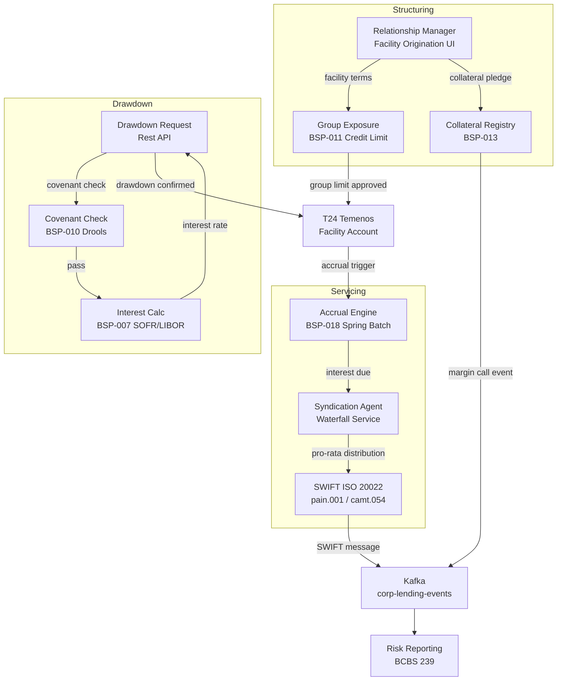

# Corporate Lending and Syndications

Status: Draft | Last Reviewed: 2026-05-21 | Owner: @lending-domain-owner
Catalog ID: REF-016 | Radii
Tier Applicability: T0, T1

## Problem Statement

Corporate lending — bilateral facilities, revolving credit facilities, and syndicated loans — combines large exposure sizes with complex covenant structures, multi-tranche drawdowns, and inter-lender coordination. Three pain points dominate. First, credit limit tracking for large corporate groups is manual: individual facility limits are managed in T24, but group-level exposure aggregation across subsidiaries and guarantors requires daily reconciliation spreadsheets — creating a 24-hour lag in group exposure visibility. Second, collateral valuation and margin call calculations are performed in a separate Excel-based system with no API integration, meaning collateral events (property revaluation, equity price drop) trigger manual calls rather than automated margin call workflows. Third, syndicated loan agent bank functions — pro-rata drawdown calculation, participant payment waterfall, and LIBOR/SOFR rate reset notifications — are handled through email chains between participant banks, creating an audit trail that fails BCBS 239 completeness requirements.

This platform integrates BSP-007 (Interest Calculation), BSP-010 (Rule/Decisioning), BSP-011 (Credit Limit), BSP-013 (Collateral Management), and BSP-018 (Accrual Engine) to automate the full corporate lending lifecycle from facility structuring through syndicated payment distribution.

## Context

The Corporate Lending and Syndications Platform serves relationship managers, credit risk officers, and the treasury middle office. It integrates with SWIFT (ISO 20022 pain.001 for payment instructions, camt.054 for credit confirmation) for inter-bank communication in syndicated deals. Applicable for corporate exposures > VND 100 billion or any syndicated facility. Consumer and SME lending use REF-014 instead.

## Solution

The platform orchestrates five engines across three phases: Structuring (BSP-011 group exposure + BSP-013 collateral intake), Drawdown (BSP-007 interest calculation + BSP-010 covenant check), and Servicing (BSP-018 accrual + SWIFT payment routing).



## Implementation Guidelines

**1. Group Exposure Aggregation (BSP-011)**

```java
@GetMapping("/corporate-groups/{groupId}/exposure")
public GroupExposureResponse getGroupExposure(@PathVariable String groupId) {
    List<String> entityIds = corporateGroupRepository.findEntityIds(groupId);
    List<CreditExposure> exposures = entityIds.stream()
        .map(entityId -> creditLimitEngine.getCurrentExposure(entityId))
        .collect(Collectors.toList());

    BigDecimal totalExposure = exposures.stream()
        .map(CreditExposure::outstandingBalance)
        .reduce(BigDecimal.ZERO, BigDecimal::add);

    BigDecimal groupLimit = creditLimitEngine.getGroupLimit(groupId);
    BigDecimal headroom = groupLimit.subtract(totalExposure);
    return new GroupExposureResponse(groupId, totalExposure, groupLimit, headroom, exposures);
}
```

Group limits are maintained in BSP-011's PostgreSQL store with effective dating; subsidiary exposures aggregate in real time via Redis materialized view refreshed on each drawdown event.

**2. Covenant Check on Drawdown (BSP-010)**

```java
public DrawdownResult processDrawdown(DrawdownRequest request) {
    FacilityCovenants covenants = facilityRepository.findCovenants(request.facilityId());
    CovenantCheckRequest check = CovenantCheckRequest.builder()
        .facilityId(request.facilityId())
        .drawdownAmount(request.amount())
        .existingUtilisation(request.currentUtilisation())
        .financialRatios(financialDataService.getLatestRatios(request.borrowerId()))
        .covenants(covenants)
        .build();

    DecisionResult decision = ruleEngine.evaluate("corporate-covenant-policy", check);
    if (!decision.approved()) {
        return DrawdownResult.declined(decision.declineReasons());
    }
    return DrawdownResult.approved(calculateInterestTerms(request));
}
```

Covenant rules include: maximum leverage ratio, minimum DSCR, maximum drawdown as % of facility, and collateral coverage ratio (BSP-013 LTV). Drools `.drl` files are managed in Git with dual-approval before deployment.

**3. SOFR/IBOR Interest Calculation (BSP-007)**

```java
public BigDecimal calculatePeriodInterest(Tranche tranche, LocalDate periodStart, LocalDate periodEnd) {
    BigDecimal sofr = rateProvider.getSofr(periodStart);
    BigDecimal margin = tranche.margin();
    BigDecimal allInRate = sofr.add(margin);

    AccrualRequest req = AccrualRequest.builder()
        .principal(tranche.outstandingBalance())
        .annualRate(allInRate)
        .convention(DayCountConvention.ACT_360)
        .fromDate(periodStart)
        .toDate(periodEnd)
        .build();
    return interestEngine.calculate(req).interestAmount();
}
```

SOFR/IBOR rate is fetched from the FX Rate Engine (BSP-014) reference rate feed and cached in Redis (TTL 3,600s — intraday rate).

**4. Syndicated Payment Waterfall**

```java
public void distributeRepayment(String facilityId, BigDecimal totalRepayment) {
    List<Participant> participants = syndicationRepository.findParticipants(facilityId);
    BigDecimal totalCommitment = participants.stream()
        .map(Participant::commitment)
        .reduce(BigDecimal.ZERO, BigDecimal::add);

    participants.forEach(participant -> {
        BigDecimal share = participant.commitment()
            .divide(totalCommitment, 8, RoundingMode.HALF_UP)
            .multiply(totalRepayment);
        swiftClient.sendPain001(participant.bankBIC(), share, facilityId);
    });
}
```

SWIFT pain.001 messages are sent to each participant bank; camt.054 confirmations are consumed and matched against expected distributions.

## When to Use

- Corporate bilateral facilities or revolving credit > VND 100 billion
- Syndicated loans with ≥ 2 participant banks
- Covenant monitoring with automated breach detection
- SWIFT-based inter-bank settlement

## When Not to Use

- Consumer or SME lending — use REF-014
- Trade finance facilities — collateral is document-based, not financial asset — use REF-017 instead
- Overdraft facilities < VND 5 billion — T24 parameterisation is sufficient

## Variants

| Variant | When to prefer | Trade-off |
|---------|---------------|-----------|
| Bilateral facility | Single lender, large corporate | Simpler; no syndication waterfall; full T24 parameterisation for small tickets |
| Club deal | 2–5 banks, equal participation | Lightweight waterfall; SWIFT messages to each participant; no formal agent bank role |
| Full syndication | >5 participants, agent bank role | Complex waterfall; LMA documentation; SWIFT GPI for international participants |

## NFR Acceptance Criteria

```yaml
performance:
  group_exposure_p99_ms: 500
  drawdown_decision_p99_ms: 2000
  interest_calculation_p99_ms: 200
  syndication_waterfall_per_participant_ms: 100
availability:
  platform_uptime_percent: 99.99   # T0
correctness:
  pro_rata_distribution_variance_bps: 0   # exact to 8 decimal places
  sofr_rate_staleness_max_seconds: 3600
```

## Compliance Mapping

| Layer | Reference | Section/Control | How this satisfies |
|-------|-----------|----------------|-------------------|
| Ring 0 — Global | IFRS 9 | §5.5 — ECL for corporate exposures | BSP-011 PD/LGD parameters drive Stage 1/2/3 classification; accrual trail maintained by BSP-018 |
| Ring 0 — Global | Basel III | §§72–89 — IRB corporate credit risk weights | Risk weights assigned per facility type (corporate, sovereign, bank) in BSP-011 |
| Ring 0 — Global | FATF Rec. 16 | Wire transfer information requirements | SWIFT pain.001 includes full originator/beneficiary data; BSP-010 covenant check includes AML screen |
| Ring 1 — International | BCBS 239 | §5 — Completeness and accuracy of risk data | All drawdown and repayment events published to Kafka with idempotency key; BCBS 239-compliant audit trail |
| Ring 1 — International | LMA Syndicated Loan Conventions | Agent bank obligations | Waterfall service calculates pro-rata distributions per LMA Schedule; SWIFT confirmations archived |
| Ring 2 — Vietnam | SBV Circular 09/2020 | §IV — Core banking system requirements | Facility origination API requires JWT + client certificate; drawdown approvals dual-authenticated ⚠️ (working summary — pending Legal review) |

## Cost / FinOps Notes

- BSP-011 PostgreSQL for group exposure: dedicated RDS instance (db.r6g.2xlarge); multi-AZ; ~$800/month
- SWIFT connectivity: leased line + SWIFT Bureau; fixed cost ~$3,000/month regardless of transaction count
- BSP-013 Collateral Registry: read-heavy; Redis cache hit rate target > 90% to avoid PostgreSQL load
- Accrual batch (BSP-018): runs daily; 20 partitions for up to 50 k corporate accounts; completes in < 15 min
- LMA-formatted reports: generated nightly by scheduled Spring Batch job; no additional infra cost

## Threat Model

**Drawdown fraud via covenant bypass (Elevation of Privilege)** — A relationship manager submits a drawdown request with falsified financial ratio inputs to bypass a failing DSCR covenant in BSP-010. Mitigated by: financial ratios fetched directly from the financial data service (not supplied by the requestor); covenant check results logged with input hash; dual-approval required for drawdowns > VND 100 billion.

**SWIFT message tampering (Tampering)** — An attacker intercepts a syndicated payment SWIFT pain.001 message and modifies the beneficiary BIC before transmission. Mitigated by: all SWIFT messages signed with RSA-4096 via HSM; camt.054 confirmations cross-checked against sent pain.001 hash; discrepancy triggers `SwiftMessageMismatchAlert`.

## Operational Runbook

1. Alert: GroupExposureSyncLag — Redis materialized view for group exposure is > 60 s stale (compare Redis timestamp with latest drawdown event timestamp on Kafka).
   - Trigger manual refresh: `POST /admin/exposure/group/{groupId}/refresh`
   - If Redis is unavailable, fall back to real-time PostgreSQL query (latency degrades to ~2 s)
   - Escalate to @risk-management-domain-owner if stale data has been served for > 5 min

2. Alert: CovenantCheckTimeout — BSP-010 Drools evaluation exceeds 1,500 ms p99 for drawdown requests.
   - Check Drools `.drl` compilation — recent rule deployment may have introduced a non-terminating loop
   - Roll back rule deployment: `POST /rule-engine/admin/rollback?version={prev}`
   - Pause drawdown processing until rule engine is stable

3. Alert: SwiftCamt054Mismatch — camt.054 confirmation received for amount not matching corresponding pain.001.
   - Immediately freeze further distributions for the affected facility
   - Alert @payments-domain-owner and legal/compliance team
   - Initiate SWIFT GPI investigation via correspondent bank

## Test Strategy

**Unit:** Test pro-rata waterfall distribution for 3-participant syndicate (30%/40%/30% split); assert each share rounded to 8 decimal places; assert totals sum exactly to input repayment amount. Test SOFR rate staleness guard — assert exception when Redis TTL expired and rate service is unreachable.

**Integration:** Testcontainers (PostgreSQL + Redis + Kafka) end-to-end: create facility → pledge collateral → submit drawdown → assert covenant check passes → assert SWIFT pain.001 emitted → simulate camt.054 → assert distribution confirmed on Kafka.

**Compliance:** Assert BCBS 239 audit log contains idempotency key, timestamp, entity IDs, and decision rationale for every drawdown event. Assert LTV covenant fires `CovenantBreachEvent` when collateral value drops below threshold.

**Chaos:** Kill BSP-013 pod during drawdown; assert drawdown is rejected (fail-closed) until collateral service recovers. Kill one SWIFT gateway replica; assert payment retries with exponential backoff without duplicate pain.001.

## Related Patterns

- [BSP-007 Interest Calculation Engine](../patterns/banking-solutions/interest-calculation-engine.md)
- [BSP-010 Rule / Decisioning Engine](../patterns/banking-solutions/rule-decisioning-engine.md)
- [BSP-011 Credit Limit Engine](../patterns/banking-solutions/credit-limit-engine.md)
- [BSP-013 Collateral Management Engine](../patterns/banking-solutions/collateral-management-engine.md)
- [BSP-018 Accrual Engine](../patterns/banking-solutions/accrual-engine.md)
- [EIP-025 Dead Letter Channel](../patterns/eip/dead-letter-channel.md)
- [COMP-001 Compliance Mapping Matrix](../compliance/compliance-mapping-matrix.md)

## References

- IFRS 9 Financial Instruments — IASB 2014 (effective 2018)
- Basel III: Finalising Post-Crisis Reforms — BCBS December 2017
- BCBS 239 — Principles for Effective Risk Data Aggregation — BCBS January 2013
- LMA Recommended Form of Syndicated Loan Agreement (current edition)
- SWIFT ISO 20022 pain.001 — Credit Transfer Initiation
- FATF Recommendations 2012 (updated 2023)
- SBV Circular 09/2020 — Information System Security for Credit Institutions

---
**Key Takeaway**: The Corporate Lending Platform replaces email-chain syndication and Excel-based collateral tracking with real-time group exposure aggregation, automated covenant monitoring, and SWIFT-integrated waterfall distribution — meeting BCBS 239 audit completeness requirements.
