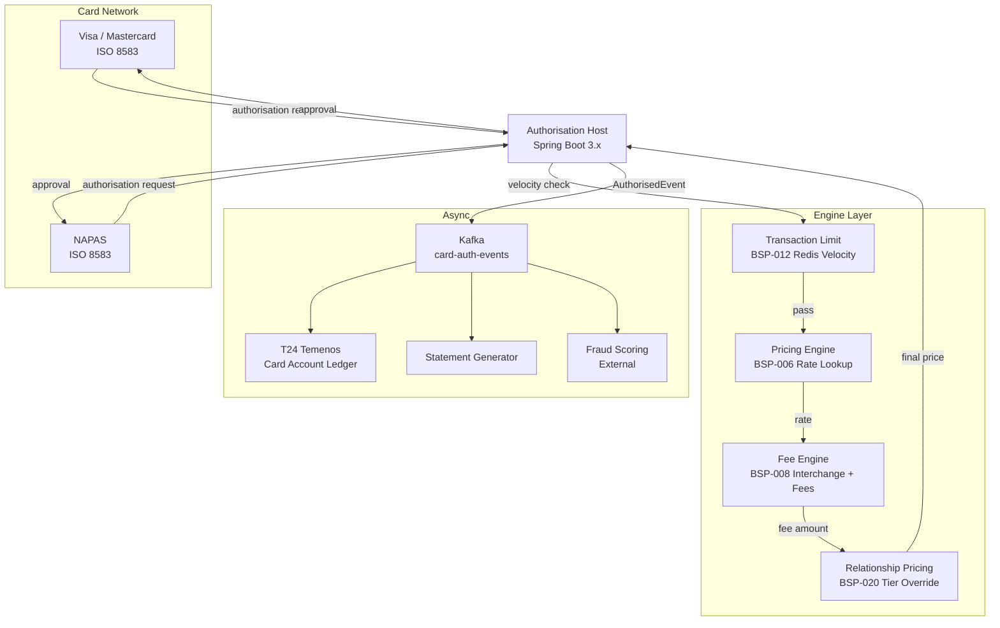

# Credit Card Issuing Platform

Status: Draft | Last Reviewed: 2026-05-21 | Owner: @payments-domain-owner
Catalog ID: REF-015 | Radii
Tier Applicability: T0

## Problem Statement

Credit card issuing combines the highest transaction velocity in retail banking with the most complex pricing logic: interchange categories, promotional APR windows, instalment plans, cash advance fees, and late payment charges all interact on a single account. Without a dedicated platform three problems emerge. First, authorisation decisions exceed Visa/Mastercard's 500 ms SLA when limit checks query T24 directly under peak load. Second, promotional rate windows (0% APR for 6 months) expire silently, causing customers to be charged full rate without advance notice — a compliance and reputational risk. Third, velocity controls are checked per-authorisation by the authorisation host without cross-channel awareness, allowing card-not-present fraud to bypass on-us velocity limits set for card-present transactions.

This platform integrates BSP-006 (Pricing Engine), BSP-008 (Fee Engine), BSP-012 (Transaction Limit), and BSP-020 (Relationship Pricing) to deliver a sub-200 ms authorisation response, rule-driven fee application, and cross-channel velocity control for a Visa/Mastercard issuing portfolio.

## Context

The Credit Card Issuing Platform sits between the Visa/Mastercard authorisation network and T24 core banking. It owns the authorisation logic, limit management, and fee calculation; it delegates account persistence and statement generation to T24. Applicable for Tier 0 portfolios exceeding 200 k active cards. NAPAS co-branded cards use the same platform with NAPAS scheme rules applied via BSP-008 fee schedule override.

## Solution

Authorisation requests arrive from the card scheme network via ISO 8583 and are processed in under 200 ms through a synchronous chain: limit check (BSP-012) → pricing lookup (BSP-006) → fee calculation (BSP-008) → relationship pricing override (BSP-020) → authorisation response. Approved transactions post to T24 asynchronously via Kafka.



## Implementation Guidelines

**1. Authorisation Chain (BSP-012 + BSP-006 + BSP-008 + BSP-020)**

```java
@Service
public class AuthorisationService {
    public AuthorisationResponse authorise(AuthorisationRequest request) {
        LimitCheckResult limitResult = transactionLimitEngine.check(
            request.cardId(), "DAILY_TXN_AMOUNT", request.transactionAmount(), request.currency()
        );
        if (!limitResult.allowed()) {
            return AuthorisationResponse.declined("LIMIT_EXCEEDED", limitResult.limitRemaining());
        }

        PricingResult pricing = pricingEngine.calculate(PricingRequest.builder()
            .productCode(request.cardProductCode())
            .currency(request.currency())
            .transactionType(request.transactionType())
            .merchantCategory(request.mcc())
            .valueDate(LocalDate.now())
            .build());

        FeeResult fee = feeEngine.calculate(FeeRequest.builder()
            .productCode(request.cardProductCode())
            .transactionType(request.transactionType())
            .amount(request.transactionAmount())
            .currency(request.currency())
            .customerId(request.customerId())
            .build());

        RelationshipPricingResult relPricing = relationshipPricingEngine.evaluate(
            request.customerId(), request.cardProductCode(), pricing.interchangeRate()
        );

        return AuthorisationResponse.approved(pricing, fee, relPricing);
    }
}
```

Total chain p99 target: ≤180 ms. BSP-012 Redis operations are O(1); BSP-006 and BSP-020 serve from Redis cache (TTL 300s).

**2. Promotional Rate Window Expiry Monitor**

```java
@Scheduled(cron = "0 0 7 * * *")
public void checkPromotionalWindowExpiries() {
    LocalDate tomorrow = LocalDate.now().plusDays(1);
    List<CardAccount> expiring = cardAccountRepository.findPromoWindowsExpiring(tomorrow);
    expiring.forEach(account -> {
        notificationService.send(account.customerId(), NotificationType.PROMO_RATE_EXPIRY_WARNING);
        eventPublisher.publishEvent(new PromoWindowExpiryEvent(account.cardId(), tomorrow));
    });
}
```

Runs daily at 07:00 ICT; sends T-1 day customer notification and updates BSP-006 pricing cache to reflect post-promo APR from next day.

**3. Cross-Channel Velocity (BSP-012)**

```java
public LimitCheckResult check(String cardId, String dimension, BigDecimal amount, String currency) {
    String dailyKey = "txlimit:" + cardId + ":DAILY_TXN_AMOUNT:86400";
    String hourlyKey = "txlimit:" + cardId + ":HOURLY_TXN_COUNT:3600";
    long minorAmount = amount.movePointRight(0).longValueExact();
    Long dailyTotal = redis.opsForValue().increment(dailyKey, minorAmount);
    if (dailyTotal != null && dailyTotal == minorAmount) {
        redis.expire(dailyKey, Duration.ofSeconds(86400));
    }
    BigDecimal dailyLimit = limitConfigService.getDailyAmountLimit(cardId);
    if (BigDecimal.valueOf(dailyTotal).compareTo(dailyLimit.movePointRight(0)) > 0) {
        return LimitCheckResult.exceeded(dailyLimit);
    }
    return LimitCheckResult.allowed(dailyLimit.subtract(BigDecimal.valueOf(dailyTotal).movePointLeft(0)));
}
```

Both card-present and card-not-present transactions increment the same Redis counter, enforcing the cross-channel daily limit.

**4. Asynchronous T24 Posting**

```java
@KafkaListener(topics = "card-auth-events", groupId = "t24-poster")
public void postToT24(CardAuthorisedEvent event) {
    LedgerPostingRequest posting = LedgerPostingRequest.builder()
        .accountId(event.cardAccountId())
        .debitAmount(event.transactionAmount())
        .currency(event.currency())
        .narrative("AUTH:" + event.authCode() + " " + event.merchantName())
        .valueDate(event.transactionDate())
        .build();
    t24Client.postLedger(posting);
}
```

T24 posting is async — authorisation is not held waiting for ledger confirmation, keeping p99 < 200 ms.

## When to Use

- Visa/Mastercard/NAPAS card issuing with > 200 k active cards
- Cross-channel velocity control required (card-present + card-not-present unified limits)
- Relationship pricing tiers for premium cardholders
- Promotional APR window management

## When Not to Use

- Debit card / prepaid programmes where limit checks are balance-based — use REF-020 Cash Management instead
- Small portfolios (< 50 k cards) where T24 card module handles authorisation natively
- Pure NAPAS QR payments — use INT-001 NAPAS integration pattern directly

## Variants

| Variant | When to prefer | Trade-off |
|---------|---------------|-----------|
| Visa/Mastercard issuing | International card programme | EMV 3DS, PCI-DSS HSM required |
| NAPAS domestic issuing | VND-only domestic card | Simpler fee schedule; NAPAS DNS netting; lower HSM cost |
| Co-badge (Visa + NAPAS) | Both domestic and international acceptance | Dual fee schedules; routing logic selects scheme by MCC and currency |

## NFR Acceptance Criteria

```yaml
performance:
  authorisation_p99_ms: 180
  authorisation_p50_ms: 40
  throughput_tps: 2000   # peak card authorisation
availability:
  authorisation_host_uptime_percent: 99.999   # T0 — card scheme SLA
  fee_engine_uptime_percent: 99.99
correctness:
  velocity_limit_false_positive_rate_percent: 0
  interchange_rate_accuracy_percent: 100
```

## Compliance Mapping

| Layer | Reference | Section/Control | How this satisfies |
|-------|-----------|----------------|-------------------|
| Ring 0 — Global | PCI-DSS v4 | §3.5 — Protection of stored account data | Card PAN stored only as token (BSP-006 uses tokenised card reference); full PAN never logged |
| Ring 0 — Global | EMV 3DS | 3DS2 authentication for card-not-present | Authorisation host integrates 3DS2 server; unauthenticated CNP transactions declined above VND 500 k |
| Ring 1 — International | Visa/MC Network Rules | Authorisation response SLA ≤ 500 ms | Platform p99 = 180 ms; Visa/MC SLA headroom = 320 ms |
| Ring 1 — International | ISO 8583 | Message format for financial transactions | Authorisation host parses ISO 8583 bitmap using jpos library |
| Ring 2 — Vietnam | NAPAS Card Scheme Rules | Domestic card transaction processing | NAPAS variant uses separate fee schedule in BSP-008; settlement via NAPAS DNS net ⚠️ (working summary — pending Legal review) |

## Cost / FinOps Notes

- Redis cluster (5-node) for velocity counters and rate cache: ~$500/month; counters are small (8-byte int per key)
- Authorisation host: minimum 3 replicas across 3 AZs; auto-scale to 12 at peak (Friday 17:00–22:00 ICT)
- HSM for PAN tokenisation: dedicated hardware; amortised cost ~$2,000/month
- ISO 8583 parsing via jpos library: open-source; no licence cost
- NAPAS DNS netting reduces RTGS settlement transaction count by ~80%, saving ~VND 5,000 per batch vs. gross settlement

## Threat Model

**PAN theft via authorisation log (Information Disclosure)** — Centralised authorisation logs contain merchant name, amount, and partial PAN — an attacker with log access can correlate transactions to individual cardholders. Mitigated by: PAN tokenised at ingress; logs contain only last 4 digits and token reference; log storage in Elasticsearch with RBAC — only fraud team role can access full token mapping.

**Velocity bypass via distributed attack (Denial of Service)** — Attacker uses multiple terminals to spread transactions across 100 cards belonging to the same compromised batch, each staying below the per-card daily limit. Mitigated by: BSP-012 includes a per-BIN velocity check (aggregate across all cards in a BIN); anomaly detection alert triggers at >5× average BIN transaction rate.

## Operational Runbook

1. Alert: AuthorisationLatencyHigh — p99 > 350 ms for authorisation endpoint over 2-min window.
   - Check Redis velocity counter latency: `redis-cli latency history authorisation`
   - If Redis latency > 10 ms, failover to replica cluster
   - If Pricing Engine cache miss rate > 20%, warm BSP-006 cache: `POST /pricing/admin/warm`
   - Escalate to @payments-domain-owner if p99 exceeds 450 ms (approaching Visa SLA breach)

2. Alert: T24PostingLag — Kafka consumer group `t24-poster` lag > 5,000 messages for > 5 min.
   - Scale T24 poster replicas: `kubectl scale deployment t24-poster --replicas=6 -n payments`
   - Check T24 API response time; if T24 is degraded, activate local queue hold and notify @core-banking-domain-owner

3. Alert: VelocityCounterDesync — BSP-012 Redis counter exceeds T24 authorised balance by > 5%.
   - Run reconciliation job: `POST /admin/velocity/reconcile?cardId={id}`
   - If desync persists, reset counter from T24 authorised balance and alert fraud team

## Test Strategy

**Unit:** Test `AuthorisationService` chain with mocked engines; verify declined response when BSP-012 returns limit exceeded; verify BSP-020 relationship tier override applies lower interchange rate for gold-tier customers.

**Integration:** Testcontainers (Redis + Kafka + PostgreSQL) ISO 8583 end-to-end: send authorisation request → assert velocity counter incremented → assert pricing applied → assert `CardAuthorisedEvent` on Kafka → assert T24 posting consumed.

**Compliance:** Assert PAN never appears in authorisation log (search for 16-digit sequences in log output); assert EMV 3DS unauthenticated CNP transactions above VND 500 k are declined.

**Chaos:** Kill BSP-012 Redis node; assert authorisation host fails closed (declines all transactions) within 100 ms. Kill one T24 poster replica; assert remaining replicas resume consumption without duplicate postings.

## Related Patterns

- [BSP-006 Pricing Engine](../patterns/banking-solutions/pricing-engine.md)
- [BSP-008 Fee Engine](../patterns/banking-solutions/fee-engine.md)
- [BSP-012 Transaction Limit Engine](../patterns/banking-solutions/transaction-limit-engine.md)
- [BSP-020 Relationship Pricing Engine](../patterns/banking-solutions/relationship-pricing-engine.md)
- [EIP-024 Idempotent Receiver](../patterns/eip/idempotent-receiver.md)
- [SEC-013 PII Tokenization](../patterns/security/pii-tokenization-format-preserving.md)

## References

- PCI-DSS v4.0 — PCI Security Standards Council 2022
- EMV 3-D Secure — EMVCo 2016 (3DS2 2019 update)
- ISO 8583:2003 — Financial transaction card originated messages
- Visa Core Rules and Visa Product and Service Rules (current edition)
- NAPAS Card Scheme Operating Rules (internal reference)
- SBV Circular 09/2020 — Information System Security for Credit Institutions

---
**Key Takeaway**: The Credit Card Issuing Platform delivers sub-200 ms cross-channel authorisation by composing BSP-012 Redis velocity counters, BSP-006 interchange pricing, and BSP-020 relationship tiers — keeping 99.999% availability while satisfying Visa/Mastercard and NAPAS scheme SLAs.
