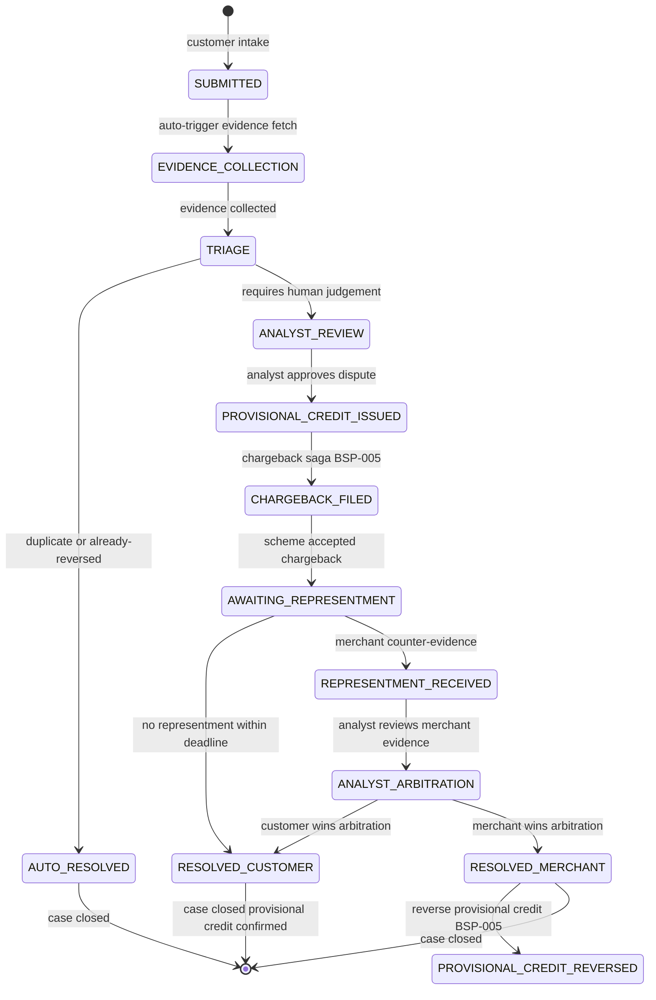

# Dispute Management

Status: Draft | Last Reviewed: 2026-05-16 | Owner: @payments-domain-owner
Catalog ID: REF-012 | Radii
Tier Applicability: T1

## Problem Statement

- Card dispute SLA breaches (Visa: 45 days, Mastercard: 45 days from transaction date to chargeback filing) are caused by manual dispute intake via customer service email, which creates queues that are not prioritised by SLA expiry date; disputes approaching the deadline go unnoticed until they expire.
- Chargeback investigation requires evidence from multiple systems (authorisation record from payment authorisation, settlement record from card processor, merchant response from acquirer network); without a single dispute case that aggregates all evidence, investigators manually query 4–5 systems, taking 30–60 minutes per case.
- Provisional credit to the customer account during investigation must be reversed if the dispute is resolved in the merchant's favour; without a state machine that tracks provisional credit issuance and outcome, reversals are missed, resulting in incorrect account balances and IFRS 9 exposure understatement.
- Merchant chargeback representments (counter-evidence) arrive via card-scheme API as structured data; without an automated intake that maps representment to the open dispute case, representments are handled manually from email, missing the tight representment response window (5–10 business days per scheme rules).
- BSP-005 (Reversal and Chargeback pattern) defines the dual-leg reversal mechanics; this reference architecture must show how to orchestrate BSP-005 across the full dispute lifecycle including provisional credit, final resolution, and regulatory customer communication.

## Context

Dispute management covers three dispute types: card-present (CP) disputes, card-not-present (CNP) e-commerce disputes, and ATM/POS disputes. The architecture covers the full lifecycle from customer intake to scheme-network chargeback/representment and final ledger resolution. The card schemes (Visa, Mastercard) are the external arbitration authority. Integration is via card-scheme dispute API (REST/OAuth2). Daily dispute volume: 50–200 cases at current scale; SLA is the primary driver.

## Solution

A DisputeCaseSvc manages the dispute state machine. Customer intake creates a `SUBMITTED` case. Automated evidence collection (auth record, settlement record) enriches the case. Risk triage auto-resolves clear-cut cases (e.g., duplicate charge, already-reversed transaction); all others move to analyst review. Approved disputes trigger a chargeback saga (BSP-005) via Kafka. Provisional credit is posted immediately (BSP-001) and reversed or confirmed at resolution.



## Implementation Guidelines

### 1. DisputeCaseSvc — State Machine with Spring State Machine

```java
@Configuration
@EnableStateMachineFactory
public class DisputeStateMachineConfig
        extends StateMachineConfigurerAdapter<DisputeState, DisputeEvent> {

    @Override
    public void configure(StateMachineStateConfigurer<DisputeState, DisputeEvent> states)
            throws Exception {
        states.withStates()
            .initial(DisputeState.SUBMITTED)
            .states(EnumSet.allOf(DisputeState.class))
            .end(DisputeState.RESOLVED_CUSTOMER)
            .end(DisputeState.RESOLVED_MERCHANT);
    }

    @Override
    public void configure(StateMachineTransitionConfigurer<DisputeState, DisputeEvent> transitions)
            throws Exception {
        transitions
            .withExternal()
                .source(DisputeState.SUBMITTED)
                .target(DisputeState.EVIDENCE_COLLECTION)
                .event(DisputeEvent.EVIDENCE_TRIGGERED)
            .and()
            .withExternal()
                .source(DisputeState.EVIDENCE_COLLECTION)
                .target(DisputeState.TRIAGE)
                .event(DisputeEvent.EVIDENCE_COLLECTED)
            .and()
            .withExternal()
                .source(DisputeState.TRIAGE)
                .target(DisputeState.PROVISIONAL_CREDIT_ISSUED)
                .event(DisputeEvent.ANALYST_APPROVED)
            .and()
            .withExternal()
                .source(DisputeState.PROVISIONAL_CREDIT_ISSUED)
                .target(DisputeState.CHARGEBACK_FILED)
                .event(DisputeEvent.CHARGEBACK_FILED);
    }
}
```

### 2. Evidence Collection — Automated Enrichment

```java
@Service
@RequiredArgsConstructor
public class EvidenceCollectionService {

    private final AuthorizationRecordClient authClient;
    private final CardSettlementClient settlementClient;
    private final DisputeCaseRepository repo;

    @KafkaListener(topics = "dispute.evidence.requests", groupId = "dispute-svc")
    public void collectEvidence(EvidenceRequest req) {
        DisputeCase disputeCase = repo.findById(req.caseId())
            .orElseThrow(() -> new CaseNotFoundException(req.caseId()));

        AuthRecord auth = authClient.fetch(disputeCase.originalTxnId());
        SettlementRecord settlement = settlementClient.fetch(disputeCase.originalTxnId());

        disputeCase.attachEvidence(auth, settlement);

        if (auth.isDuplicateOf(disputeCase.priorTxnId())) {
            disputeCase.autoResolveForCustomer("DUPLICATE_CHARGE_CONFIRMED");
        }

        repo.save(disputeCase);
    }
}
```

### 3. Provisional Credit — BSP-001 Integration

```java
@Service
@RequiredArgsConstructor
public class ProvisionalCreditService {

    private final LedgerClient ledgerClient;

    public void issueProvisionalCredit(DisputeCase disputeCase) {
        ledgerClient.postEntries(LedgerPostingRequest.builder()
            .transactionId("PROV-CREDIT-" + disputeCase.caseId())
            .debitAccount("DISPUTE_SUSPENSE_ACCOUNT")
            .creditAccount(disputeCase.customerAccountId())
            .amount(disputeCase.disputedAmount())
            .currency(disputeCase.currency())
            .build());
    }

    public void reverseProvisionalCredit(DisputeCase disputeCase) {
        ledgerClient.postEntries(LedgerPostingRequest.builder()
            .transactionId("PROV-REVERSAL-" + disputeCase.caseId())
            .debitAccount(disputeCase.customerAccountId())
            .creditAccount("DISPUTE_SUSPENSE_ACCOUNT")
            .amount(disputeCase.disputedAmount())
            .currency(disputeCase.currency())
            .build());
    }
}
```

## When to Use

- End-to-end card dispute lifecycle management for Techcombank-issued Visa and Mastercard cards with scheme-network chargeback filing and representment handling.
- Implementing SLA-enforced dispute case management that surfaces deadline alerts before the Visa/Mastercard 45-day chargeback window expires.
- Replacing manual email-based dispute intake with a structured case management system with automated evidence collection and provisional credit management.

## When Not to Use

- NAPAS domestic transfer disputes — NAPAS has a different dispute resolution process (24-hour settlement finality with separate NAPAS dispute API); use a dedicated NAPAS dispute flow.
- Fraud claims that require criminal investigation handoff — this architecture handles financial chargebacks; police report cases should be routed to the financial crime team with a different case management system.
- Merchant disputes initiated by Techcombank as acquirer — the acquirer-side dispute flow (defending a chargeback from an issuing bank) is the mirror image of this architecture and not in scope.

## Variants

| Variant | Use when | Trade-off |
|---------|----------|-----------|
| Full state machine with automated triage (this pattern) | High dispute volume; SLA enforcement; automated chargeback filing | Higher initial complexity; Spring State Machine adds operational overhead; justified at 50+ cases/day |
| Simple queue with manual workflow | Low volume (< 20 cases/day); human-first triage | Lower infrastructure; no SLA automation; risk of manual deadline tracking errors |
| External case management platform (e.g., Salesforce Financial Services) | Bank already standardised on Salesforce for CRM | Faster time-to-market for low-code teams; vendor lock-in; less control over state machine customisation |

## NFR Acceptance Criteria

| Metric | Threshold | Measurement |
|--------|-----------|-------------|
| Dispute intake to evidence collected p99 | 5 min (automated evidence fetch) | Measure SUBMITTED to TRIAGE state transition time; assert p99 5 min |
| Chargeback filing deadline compliance | 100% of approved disputes filed within Visa/MC 45-day window | Alert fires at T-5 days before scheme deadline for open cases |
| Provisional credit posting p99 | 10 s (ledger posting) | Measure ANALYST_APPROVED to PROVISIONAL_CREDIT_ISSUED + ledger post; assert p99 10 s |
| Representment intake | 100% automated intake from scheme API; 0 representments missed | Monitor scheme API webhook delivery; alert on missed representment within 1h |
| Availability | T1 — 99.9% (non-real-time; 15-min maintenance window acceptable) | Uptime alert |
| RTO | 1 h (DisputeCaseSvc pod failure; state persisted in PostgreSQL) | Chaos: kill pods; verify all open cases visible in queue after restart |

## Compliance Mapping

| Ring | Regulation | Provision | How this architecture satisfies |
|------|-----------|-----------|--------------------------------|
| Ring 0 | Visa Core Rules / Mastercard Rules | Dispute Timeline Rules — chargeback must be filed within 45 days of transaction date | DisputeCaseSvc computes `scheme_deadline = transaction_date + 45 days`; SLA alert fires at T-5 days; automated chargeback saga (BSP-005) files before deadline; zero manual tracking required. |
| Ring 1 | ISO 20022 pacs.007 | Payment Return message — structured reversal with original transaction reference | ProvisionalCreditReversal generates pacs.007 with `OrgnlTxId` referencing the original BSP-001 posting; T24 receives structured reversal via INT-005 ACL. |
| Ring 2 | SBV Circular 09/2020 | §V.3 — Consumer protection: banks must resolve card disputes and communicate outcomes to customers within prescribed timelines ⚠️ (working summary — pending Legal review) | State machine triggers customer notification at ANALYST_APPROVED, CHARGEBACK_FILED, RESOLVED_CUSTOMER, and RESOLVED_MERCHANT states; Legal review required to confirm SBV-prescribed timeline for each notification and the required communication content satisfy §V.3 in full. |

## Cost / FinOps

- DisputeCaseSvc: 2 pods × `t3.medium` = ~USD 60/month. Low throughput (50–200 cases/day) — no scaling required.
- PostgreSQL dispute DB: 200 cases/day × 365 days × 5 KB/case = ~365 MB/year — negligible.
- Card scheme API: scheme API access is included in Visa/Mastercard membership; no per-call charge.
- Provisional credit suspense account: balance in `DISPUTE_SUSPENSE_ACCOUNT` must be monitored; open provisionals represent a float exposure. Monthly reconciliation of suspense balance against open cases is a FinOps control.
- Cost of NOT automating: a chargeback deadline miss forfeits the dispute (bank absorbs loss); at VND 5M average disputed amount × 1 missed deadline/month = VND 60M/year direct cost.

## Threat Model

- **Fraudulent self-dispute (Fraud)**: A customer files a dispute for a legitimate transaction they actually authorised (first-party fraud / friendly fraud), obtaining provisional credit for a purchase they received. Mitigation: Triage checks original authorisation record for device fingerprint match (SEC-009 fraud signals); cases with fraud signals are routed to enhanced analyst review with dual approval (SEC-010 ABAC); pattern of repeat disputes triggers case escalation to financial crime.
- **Provisional credit never reversed (Tampering)**: A RESOLVED_MERCHANT outcome fails to trigger the credit reversal due to a state machine bug or Kafka consumer failure, leaving the customer with a permanent credit they should not have. Mitigation: Daily reconciliation job queries `dispute_cases WHERE state = RESOLVED_MERCHANT AND provisional_reversal_posted = false`; alerts on any match; idempotent reversal saga allows safe re-run.

## Operational Runbook Stub

**Alert: `dispute_sla_at_risk`** (open case within 5 days of scheme deadline)
- p50 baseline: never fires | p99 SLO: N/A
- Remediation: URGENT. (1) Identify at-risk cases: `SELECT case_id, scheme_deadline FROM dispute_cases WHERE state NOT IN ('RESOLVED_CUSTOMER','RESOLVED_MERCHANT','AUTO_RESOLVED') AND scheme_deadline < NOW() + INTERVAL '5 days'`. (2) Assign to senior analyst for immediate review. (3) If chargeback evidence is ready, trigger chargeback saga immediately: `POST /dispute-cases/{id}/file-chargeback`. (4) Notify dispute team lead.

**Alert: `provisional_credit_unreversed`** (resolved-merchant cases with open provisional credit)
- p50 baseline: never fires | p99 SLO: N/A
- Remediation: (1) Query unreversed provisionals. (2) Trigger reversal saga manually: `POST /dispute-cases/{id}/reverse-provisional-credit`. (3) Verify reversal via ledger check. (4) Investigate why automatic reversal failed — check Kafka consumer lag and state machine transition logs.

## Test Strategy Stub

- **Unit**: `DisputeStateMachineTest` — SUBMITTED + EVIDENCE_TRIGGERED transitions to EVIDENCE_COLLECTION; TRIAGE + ANALYST_APPROVED transitions to PROVISIONAL_CREDIT_ISSUED; RESOLVED_MERCHANT asserts provisional credit reversal action triggered.
- **Unit**: `EvidenceCollectionServiceTest` — auth isDuplicateOf asserts `autoResolveForCustomer` called; non-duplicate asserts state moves to TRIAGE.
- **Integration**: Spring Boot Test with Testcontainers (Kafka + PostgreSQL): full lifecycle — intake to evidence collected to analyst approved to provisional credit posted to chargeback filed to resolved customer. Assert all state transitions persisted in DB. Assert ledger provisional credit and confirmation posted correctly.
- **Compliance**: SLA enforcement — create dispute with `transaction_date = NOW() - 40 days`, assert T-5 SLA alert fires immediately. Audit trail — complete 10 disputes, query `audit.ledger.events`, assert each provisional credit and reversal has matching caseId in metadata.

## Related Patterns

- [BSP-005 Reversal and Chargeback](../../patterns/banking-solutions/reversal-and-chargeback.md)
- [BSP-002 Idempotent Payment Key](../../patterns/banking-solutions/idempotent-payment-key.md)
- [BSP-001 Double-Entry Ledger](../../patterns/banking-solutions/double-entry-ledger.md)
- [SEC-012 Tamper-Evident Audit Logging](../../patterns/security/audit-logging-tamper-evident.md)
- [REF-010 Ledger Posting Engine](ledger-posting-engine.md)

## References

- [Visa Core Rules and Visa Product and Service Rules](https://usa.visa.com/dam/VCOM/global/support-legal/documents/visa-core-rules-and-visa-product-and-service-rules.pdf)
- [Mastercard Chargeback Guide](https://www.mastercard.com/content/dam/public/mastercardcom/na/global-site/documents/chargeback-guide.pdf)
- [ISO 20022 pacs.007 — Payment Return](https://www.iso20022.org/catalogue-messages/iso-20022-messages-archive?search=pacs.007)
- [Spring State Machine Reference](https://docs.spring.io/spring-statemachine/reference/)
- [SBV Circular 09/2020/TT-NHNN](https://thuvienphapluat.vn/van-ban/Tien-te-ngan-hang/Thong-tu-09-2020-TT-NHNN)
- Catalog reference: `governance/standards/enterprise-architecture-catalog.md`
