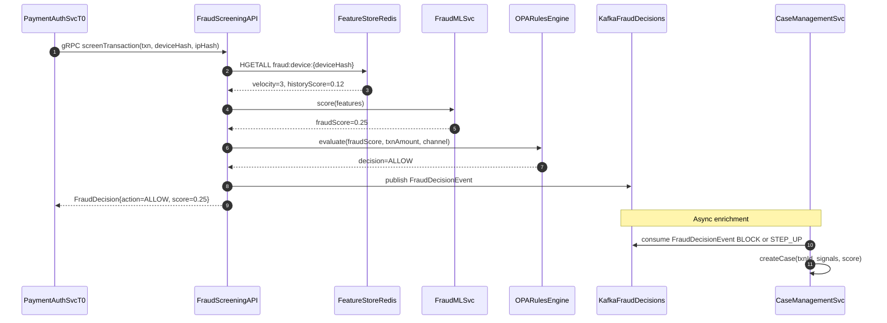

# Fraud Screening Platform

Status: Draft | Last Reviewed: 2026-05-16 | Owner: @risk-management-domain-owner
Catalog ID: REF-007 | Radii
Tier Applicability: T0

## Problem Statement

- Real-time transaction authorization requires a fraud score within 200 ms; ML inference services with cold-start latency (model loading) routinely exceed this budget, causing timeouts that default to ALLOW — effectively disabling fraud screening under load.
- Fraud signal data (device fingerprint, IP velocity, transaction velocity) is produced by multiple upstream services but consumed only by the ML model; without a unified feature store, each signal source implements its own aggregation, producing inconsistent feature definitions that degrade model accuracy.
- Blocking a legitimate transaction (false positive) causes customer friction and increases dispute volume; failing to block a fraudulent transaction (false negative) causes financial loss and potential regulatory sanction; the platform must support configurable score thresholds with step-up authentication for the uncertain middle band.
- Case management for analyst investigation is disconnected from the real-time scoring pipeline; analysts re-derive context from raw logs rather than consuming pre-computed fraud signals, increasing mean-time-to-investigate by 3–5x.
- PSD2 SCA exemption logic (low-value transactions, trusted beneficiaries) must be applied before the fraud check to avoid unnecessary step-up challenges; without a pre-filter, all transactions are screened at full latency.

## Context

The fraud screening platform is a T0 dependency of the payment authorization hot path. Every NAPAS and SWIFT transaction calls this platform synchronously via gRPC with a 150 ms hard timeout. The platform composes: signal collection (SEC-009), feature store (Redis), ML inference (served via Spring Boot model wrapper), rules engine (OPA), and case management. It must operate in both active regions (Ha Noi, Ho Chi Minh City) with sub-100 ms cross-region failover.

## Solution

Fraud scoring is a two-path architecture: a sync path for real-time decisioning (gRPC → FeatureStore → ML inference → score) and an async path for signal ingestion and case management. The sync path must return a score within 150 ms; the async path enriches the feature store and feeds analyst dashboards. The score thresholds (ALLOW / STEP_UP / BLOCK) are managed as OPA policy bundles, enabling threshold updates without code deployment.



## Implementation Guidelines

### 1. FraudScreeningAPI — gRPC Service (Spring Boot)

```java
@GrpcService
@RequiredArgsConstructor
public class FraudScreeningGrpcService extends FraudScreeningGrpc.FraudScreeningImplBase {

    private final FeatureStoreService featureStore;
    private final FraudMLClient mlClient;
    private final OpaFraudClient opaClient;
    private final FraudDecisionPublisher publisher;

    @Override
    public void screenTransaction(ScreenRequest req, StreamObserver<ScreenResponse> resp) {
        FeatureVector features = featureStore.getFeatures(
            req.getDeviceHash(), req.getIpHash(), req.getAmount());

        double score = mlClient.score(features);

        FraudDecision decision = opaClient.evaluate(score, req.getAmount(), req.getChannel());

        publisher.publish(FraudDecisionEvent.of(req.getTxnId(), score, decision));

        resp.onNext(ScreenResponse.newBuilder()
            .setAction(decision.action().name())
            .setScore(score)
            .build());
        resp.onCompleted();
    }
}
```

### 2. OPA Fraud Decisioning Rules

```rego
package fraud.decision

import future.keywords.if

default action = "STEP_UP"

action = "ALLOW" if {
    input.fraudScore < 0.30
    input.txnAmount < 5000000
}

action = "ALLOW" if {
    input.fraudScore < 0.30
    input.channel == "branch"
}

action = "BLOCK" if {
    input.fraudScore > 0.70
}

action = "BLOCK" if {
    input.txnAmount > 500000000
    input.fraudScore > 0.40
}
```

### 3. FeatureStoreService — Redis feature retrieval

```java
@Service
@RequiredArgsConstructor
public class FeatureStoreService {

    private final ReactiveRedisTemplate<String, String> redis;

    public FeatureVector getFeatures(String deviceHash, String ipHash, BigDecimal amount) {
        Map<Object, Object> deviceFeatures = redis.opsForHash()
            .entries("fraud:device:" + deviceHash)
            .collectMap(Map.Entry::getKey, Map.Entry::getValue)
            .blockOptional(Duration.ofMillis(20))
            .orElse(Map.of());

        return FeatureVector.builder()
            .velocityCount(parseInt(deviceFeatures, "velocity", 0))
            .historyScore(parseDouble(deviceFeatures, "history_score", 0.0))
            .amount(amount)
            .build();
    }
}
```

## When to Use

- Payment authorization flows (NAPAS, SWIFT, card-present) requiring real-time fraud scoring within a 150 ms budget.
- Implementing a unified fraud platform that serves multiple payment channels from a single feature store and ML model.
- Replacing an offline batch fraud detection system with a real-time streaming platform to reduce false-negative window from hours to milliseconds.

## When Not to Use

- Fraud investigation analytics and retrospective model retraining — use a data lake pipeline (kappa architecture DATA-007) rather than the real-time feature store.
- Anti-money-laundering (AML) transaction monitoring — AML requires aggregation over days/weeks with different signal patterns; use a separate AML monitoring system that consumes from the same Kafka topic but processes offline.
- Internal employee fraud detection — different signal model and case management process; this architecture is optimized for customer transaction fraud.

## Variants

| Variant | Use when | Trade-off |
|---------|----------|-----------|
| Real-time gRPC + Redis feature store (this pattern) | T0 payment hot path; <150 ms budget | Model freshness depends on feature store update latency; feature drift possible during high ingestion lag |
| Inline rules-only (no ML) | Simple velocity-based rules; no model infrastructure available | Lower operational complexity; limited detection accuracy for sophisticated fraud patterns |
| Asynchronous post-authorization scoring | Non-real-time channels (batch file payments); high-volume card-not-present | Cannot block in-flight transactions; used for dispute pre-screening only |

## NFR Acceptance Criteria

| Metric | Threshold | Measurement |
|--------|-----------|-------------|
| gRPC screening p99 latency | 100 ms (end-to-end: API, FeatureStore, ML, OPA) | Load test 1,000 concurrent transactions; assert p99 100 ms |
| Feature store read p99 | 5 ms (Redis HGETALL) | Measure Redis `latency_ms` histogram; assert p99 5 ms |
| ML inference p99 | 50 ms | Measure ML client call duration; assert p99 50 ms |
| False positive rate (legitimate transactions blocked) | 0.5% | Weekly report: blocked transactions subsequently reversed / total blocked |
| Availability | T0 — 99.95% (payment hot path dependency) | On FraudScreeningAPI unavailability, PaymentAuthSvc defaults to ALLOW with audit flag |
| RTO | 5 min (FraudScreeningAPI pod failure + Redis failover) | Chaos: kill primary FraudScreeningAPI pod; measure time to first successful screening |

## Compliance Mapping

| Ring | Regulation | Provision | How this architecture satisfies |
|------|-----------|-----------|--------------------------------|
| Ring 0 | OWASP Top 10 | A04 Insecure Design — fraud screening must be on critical transaction paths | FraudScreeningAPI is a mandatory synchronous call in PaymentAuthSvc; timeouts default to STEP_UP (not ALLOW) for amounts > VND 5M; no bypass path exists without explicit OPA policy change. |
| Ring 1 | PSD2 RTS | Article 18 — SCA exemption for low-value transactions; Article 22 — real-time fraud monitoring | OPA exemption rules implement PSD2 Article 18 low-value threshold (< VND 5M, fraudScore < 0.30 = ALLOW without SCA); BLOCK decisions trigger SCA step-up via AuthSvc; fraud monitoring covers 100% of card-not-present transactions. |
| Ring 2 | Decree 13/2023 | §9 — device hash and behavioral data treated as personal data for profiling purposes ⚠️ (working summary — pending Legal review) | Device ID is HMAC-SHA256 hashed before storage (SEC-009); OPA fraud policy uses hashed device identifier only; raw device ID never stored in feature store; Legal review required to confirm that hashed device ID is sufficient anonymisation under Decree 13/2023 and that fraud profiling has documented consent basis. |

## Cost / FinOps

- FraudScreeningAPI: 3 pods (HA across 2 AZs) × `c5.large` = ~USD 180/month. Scales horizontally at 1,000 concurrent transactions.
- Redis feature store: shared with session store (SEC-011); fraud features add ~200 MB active data at 50,000 device hashes with 1h TTL.
- FraudMLSvc: 2 pods × GPU-backed instance for inference. Model serving cost justified by avoiding even 0.1% additional fraud rate on VND 1 trillion daily payment volume (= VND 1 billion fraud prevention value).
- OPA sidecar per FraudScreeningAPI pod: 64 MiB / 0.1 vCPU — negligible.

## Threat Model

- **Feature poisoning (Tampering)**: Attacker submits high-volume low-value transactions to suppress their device velocity counter below the BLOCK threshold, then executes a high-value fraudulent transaction under the artificially clean profile. Mitigation: velocity features are computed over multiple time windows (5 min, 1h, 24h); OPA policy evaluates all windows simultaneously; a device with 50+ transactions in 5 minutes triggers STEP_UP regardless of individual transaction amount.
- **ML model inversion (Information Disclosure)**: By submitting many crafted transactions and observing the score response, an attacker reconstructs the model's decision boundary and engineers transactions that score just below the BLOCK threshold. Mitigation: `fraudScore` is NOT returned to the payment API caller — only `action` (ALLOW/STEP_UP/BLOCK); score is logged internally to the audit Kafka topic only; API response contains no discriminating numerical feature.

## Operational Runbook Stub

**Alert: `fraud_screening_p99 > 150ms`**
- p50 baseline: 20 ms | p99 SLO: 100 ms
- Remediation: (1) Check Redis latency: `redis-cli --latency -h fraud-redis-cluster`. (2) Check FraudMLSvc CPU: `kubectl top pod -l app=fraud-ml-svc`. (3) If ML inference is slow, check if model reload is in progress (cold start spike) — wait 30s. (4) Scale FraudScreeningAPI pods if CPU > 70%: `kubectl scale deploy fraud-screening-api --replicas=6`.

**Alert: `fraud_block_rate_spike > 5%` of transactions** (sudden spike in BLOCK decisions)
- p50 baseline: 1% | p99 SLO: N/A
- Remediation: (1) Check if a recent OPA bundle update changed thresholds — compare current bundle with previous via bundle server history. (2) Check if Redis feature store is stale (screener consumer lag spike causing zero-feature reads → higher raw score). (3) If false positive spike, rollback OPA bundle to previous version: `kubectl rollout undo deploy/opa-bundle-server`. (4) Notify on-call risk team.

## Test Strategy Stub

- **Unit**: `FraudScreeningGrpcServiceTest` — score 0.25, amount 1M asserts ALLOW; score 0.75 asserts BLOCK; score 0.50 asserts STEP_UP; verify `publisher.publish` called for all outcomes.
- **Unit**: `FeatureStoreServiceTest` — Redis returns velocity=5 asserts `FeatureVector.velocityCount == 5`; Redis timeout asserts `FeatureVector` with defaults (0 velocity, 0.0 historyScore).
- **Integration**: Spring Boot Test with Testcontainers (Redis + Kafka) + WireMock (ML): 100 transactions under 150 ms budget; feature store miss asserts defaults used, not exception; BLOCK decision asserts `FraudDecisionEvent` published to Kafka.
- **Compliance**: PSD2 Article 18 — submit 100 transactions with amount < VND 5M and fraudScore < 0.30, assert all return ALLOW. Device hash privacy — submit transaction with known raw device ID, scan Redis for any key matching raw device ID pattern, assert zero matches.

## Related Patterns

- [SEC-009 Fraud Signal Collection](../patterns/security/fraud-signal-collection.md)
- [BSP-003 Sanction Screening Pipeline](../patterns/banking-solutions/sanction-screening-pipeline.md)
- [SEC-010 Attribute-Based Access Control](../patterns/security/attribute-based-access-control.md)
- [REF-002 Real-Time Payments NAPAS](real-time-payments-napas.md)

## References

- [PSD2 RTS on Strong Customer Authentication — Commission Delegated Regulation 2018/389](https://eur-lex.europa.eu/legal-content/EN/TXT/?uri=CELEX:32018R0389)
- [FATF Recommendation 16 — Electronic Funds Transfers](https://www.fatf-gafi.org/en/recommendations/r16.html)
- [Redis HGETALL Command](https://redis.io/commands/hgetall/)
- [Open Policy Agent Documentation](https://www.openpolicyagent.org/docs/latest/)
- [Decree 13/2023/ND-CP — Personal Data Protection](https://vanban.chinhphu.vn/default.aspx?pageid=27160&docid=207126)
- Catalog reference: `governance/standards/enterprise-architecture-catalog.md`
