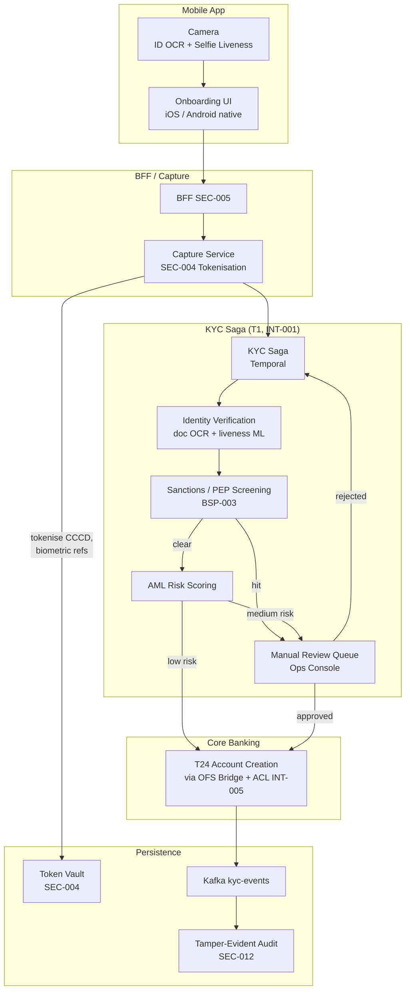

# KYC / AML Onboarding

Status: Draft | Last Reviewed: 2026-05-09 | Owner: @risk-management-domain-owner, @ea-board, @head-of-compliance
Catalog ID: REF-003 | Radii (composes spine)
Tier Applicability: T1

## Problem Statement

Onboarding a new customer to Techcombank requires identity proofing (Vietnamese national ID — CCCD), liveness-checked selfie, sanctions / PEP screening, AML risk scoring, and core-banking account creation — all within a customer-tolerable time window (sub-5-minute target for the low-risk path) while satisfying SBV §III, FATF Recommendations 10–12, GDPR Art. 9 (biometric special category), and Decree 13/2023 personal-data protection. This reference architecture is the canonical blueprint for retail customer onboarding via the mobile app.

## Context

Reach for this architecture when:

- Designing or modifying any customer-onboarding flow.
- Updating sanction-screening lists or AML risk-scoring rules.
- Integrating a new identity-document type (passport, residence card).
- Adding a B2B / corporate KYC variant (Wave-2 extension; this doc covers retail).

## Solution



### Risk-tier outcome paths

| Risk score | Path | Customer experience | Time to outcome |
| --- | --- | --- | --- |
| **Low** (≥ 80% of submissions) | Auto-approve via T24 account creation | "Account ready" in-app | < 30 s |
| **Medium** (~15%) | Manual review queue; SLA 4 business hours | "Under review" + push when complete | 1–4 h |
| **High** (~4%) | Enhanced Due Diligence (EDD); analyst contact | "We'll be in touch" | 1–3 business days |
| **Sanction hit** (~1%) | Hard block + compliance hand-off | "Unable to proceed" — generic message | Immediate |

### Data minimisation & residency

- CCCD captured once, tokenised immediately (SEC-004); all downstream services see token.
- Selfie biometric stored temporarily for ML inference, then deleted (per Decree 13 minimisation principle); only the liveness *score* is retained.
- All raw PII stays within Vietnam-resident Vault (per [PRIN-007 Data Residency](../principles/data-residency.md)).
- Audit log entries reference tokens, not raw values.

### Sanctions / PEP screening (BSP-003)

- Lists: SBV consolidated list, OFAC, UN, EU, internal watchlist.
- Updated daily; emergency updates within 1 h of regulator publication.
- Screening uses fuzzy-matching (Levenshtein + phonetic) with a tunable threshold; hits go to manual review.

## Implementation Guidelines

### iOS Swift — ID capture + liveness

```swift
import VisionKit
import LocalAuthentication

final class IdCaptureViewController: UIViewController, VNDocumentCameraViewControllerDelegate {

    func startScan() {
        let scanner = VNDocumentCameraViewController()
        scanner.delegate = self
        present(scanner, animated: true)
    }

    func documentCameraViewController(_ controller: VNDocumentCameraViewController,
                                       didFinishWith scan: VNDocumentCameraScan) {
        let image = scan.imageOfPage(at: 0)
        Task {
            // 1. Local OCR for fast feedback
            let local = try await localOcr.extract(image)
            // 2. Show user the extracted fields for confirmation
            await ui.confirm(local)
            // 3. Upload encrypted blob to BFF for server-side OCR + tokenisation
            try await bff.uploadIdImage(image, idempotencyKey: UUID())
        }
    }
}
```

Liveness is performed via ARKit face-tracking with random-prompt instructions (look-left, blink, smile) — prevents replay-photo attacks. Resulting "liveness score" is uploaded; raw video is never sent.

### Android Kotlin — analogous flow

(Uses CameraX + ML Kit for OCR; uses Face Detection + custom random-prompt overlay for liveness; same upload semantics.)

### KYC Saga — Temporal workflow

```java
@WorkflowInterface
public interface KycSaga {
    @WorkflowMethod
    KycOutcome onboard(KycSubmission submission);
}

public class KycSagaImpl implements KycSaga {
    private final IdentityActivity identity = ...;
    private final SanctionsActivity sanctions = ...;
    private final RiskActivity risk = ...;
    private final ManualReviewActivity manual = ...;
    private final CoreBankingActivity coreBanking = ...;
    private final OutboxActivity outbox = ...;

    @Override
    public KycOutcome onboard(KycSubmission submission) {
        IdentityResult ident = identity.verify(submission);   // OCR + liveness ML
        if (!ident.passed()) {
            outbox.publish(new KycRejected(submission.id(), "identity"));
            return KycOutcome.rejected("identity");
        }

        SanctionsResult sanctionsResult = sanctions.screen(submission.identity());
        if (sanctionsResult.hardBlock()) {
            outbox.publish(new KycBlocked(submission.id(), "sanctions"));
            return KycOutcome.blocked();
        }

        RiskScore score = risk.score(submission, sanctionsResult);
        return switch (score.tier()) {
            case LOW -> {
                AccountResult acc = coreBanking.createAccount(submission);
                outbox.publish(new KycCompleted(submission.id(), acc));
                yield KycOutcome.success(acc);
            }
            case MEDIUM -> {
                ReviewResult rr = manual.queueForReview(submission, score);   // Activity blocks until decision
                if (rr.approved()) {
                    AccountResult acc = coreBanking.createAccount(submission);
                    outbox.publish(new KycCompleted(submission.id(), acc));
                    yield KycOutcome.success(acc);
                }
                yield KycOutcome.rejected(rr.reason());
            }
            case HIGH -> {
                manual.queueEdd(submission, score);
                yield KycOutcome.pending();   // analyst follow-up
            }
        };
    }
}
```

### Core-banking integration via T24 OFS bridge + ACL

```java
@Service
@RequiredArgsConstructor
public class T24AccountCreationActivity {

    private final T24OfsClient ofs;
    private final AntiCorruptionLayer acl;   // INT-005

    @ActivityMethod
    public AccountResult createAccount(KycSubmission s) {
        T24Customer t24Request = acl.toT24Customer(s);   // domain → T24 mapping
        T24Response response = ofs.create(t24Request, s.id() /* OFS_KEY = idempotent */);
        return acl.fromT24Response(response);
    }
}
```

### React (web) — abbreviated onboarding kiosk

Web onboarding for in-branch use (kiosk mode). Same flow, simpler camera capture (HTML `<input type="file" capture>`), uses same backend BFF and saga.

## Variants & Trade-offs

| Variant | When | Trade-off |
|---|---|---|
| **Mobile-first (default)** | Retail | Best UX; requires native dev |
| **In-branch kiosk** | Customers without smartphone | Branch infrastructure cost |
| **Re-KYC (refresh)** | Existing customer renewal | Lower friction; reuses prior tokens |
| **Corporate / B2B KYC** | Business accounts | Out of scope for this doc; Wave 2 |

## NFR Acceptance Criteria

```yaml
nfr_acceptance_criteria:
  service_name: kyc-onboarding-service
  tier: T1
  rto_minutes: 15
  rpo_seconds: 300
  availability_target_pct: 99.95
  recovery_topology: multi-region-active-passive-hot
  failover_mode: automatic-via-data-plane

  latency:
    p50_ms: 5000           # full saga
    p95_ms: 30000          # low-risk path P95
    p99_ms: 60000

  failure_modes:
    - id: FM1
      description: ML inference (liveness / OCR) timeout
      response: graceful degrade — submit for manual review
      time_to_recover: variable
    - id: FM2
      description: T24 account creation fails
      response: saga compensates KYC token; customer advised; manual triage
    - id: FM3
      description: Sanctions list update lag
      response: cache fallback to prior list with banner; alert compliance

  catalog_references:
    - {id: NFR-001, reason: "Tier T1"}
    - {id: PRIN-006, reason: "Saga steps idempotent"}
    - {id: PRIN-007, reason: "Data residency — biometric in Vietnam only"}
    - {id: SEC-004, reason: "CCCD tokenisation"}
    - {id: SEC-005, reason: "Mobile auth"}
    - {id: SEC-008, reason: "Display masking of PII"}
    - {id: SEC-013, reason: "FPE for legacy fields"}
    - {id: INT-001, reason: "Saga"}
    - {id: INT-002, reason: "Outbox + CDC"}
    - {id: INT-005, reason: "Anti-corruption to T24"}
    - {id: BSP-003, reason: "Sanctions screening pipeline"}
    - {id: REF-001, reason: "Multi-region (active-passive)"}
```

## Compliance Mapping

| Layer | Reference | Section/Control | How |
|---|---|---|---|
| Ring 0 | NIST SP 800-63A | Identity proofing IAL2 (remote, OCR + liveness) | OCR + ARKit/MLKit liveness + random-prompt anti-spoof |
| Ring 0 | OWASP ASVS V8 (Data Protection) | PII minimisation | Selfies discarded post-inference; only scores retained |
| Ring 1 | FATF Recommendation 10 (CDC) | Customer due diligence — identification + verification | OCR + liveness + sanctions screening together satisfy IAL2 + FATF |
| Ring 1 | FATF Recommendation 11 (Record-keeping) | 5-year retention of CDD records | Tokenised audit log (SEC-012) retains for 7 years |
| Ring 1 | FATF Recommendation 12 (PEPs) | Politically Exposed Persons screening | PEP list integrated into BSP-003 |
| Ring 1 | GDPR Art. 9 (Special category) | Biometric data lawfully processed | Explicit consent banner; minimised retention; lawful basis: contract |
| Ring 2 | SBV Circular 09/2020 §III ⚠️ (working summary — pending Legal review) | Multi-factor + identity verification | Biometric + government ID + OTP satisfies multi-factor |
| Ring 2 | Decree 13/2023 ⚠️ (working summary — pending Legal review) | Personal-data protection — biometric special category | Explicit consent + minimised retention + Vietnamese vault |
| Ring 2 | Decree 53/2022 ⚠️ (working summary — pending Legal review) | Data localisation | All PII stays in Vietnam-resident vault and core banking |

## Cost / FinOps Notes

| Component | Cost driver | Order of magnitude / month |
|---|---|---|
| ML inference (OCR + liveness) | per-submission inference cost | ~$0.05 per submission; volume-driven |
| Sanctions / PEP screening service | API calls + list licensing | ~$3–10k including list-vendor fees |
| Manual review staff | Reviewer FTE × volume | Bounded by auto-approve rate; key lever |
| Token vault + audit log retention | 7-year retention for FATF-11 | Cold-tier dominant |

**Levers**:
- Improve auto-approve rate (currently 80% target → 90%+) via better ML; saves manual-review labour.
- Cache identity-verification results for re-KYC (re-use prior token where validity window permits).

**Cost of NOT having this canonical flow**: per-product onboarding flows that re-derive sanctions screening, retention, audit trails — high audit risk + duplicated cost.

## Threat Model Summary

STRIDE: primarily **Spoofing** (deepfakes, stolen IDs) and **Information Disclosure** (PII exposure).

- **Top 3 threats addressed**:
  1. *Replay / photo spoofing* — random-prompt liveness defeats static-image attacks.
  2. *Stolen ID submission* — face-match between selfie and ID + sanction screening + manual-review for medium-risk.
  3. *PII leakage in downstream systems* — tokenisation at capture; downstream sees only tokens.
- **Top 3 residual threats**:
  1. *Sophisticated deepfake* — current ML may pass; mitigation: continuous model improvement; behavioural-anomaly post-onboarding detection.
  2. *Insider with access to vault detokenisation* — separation of duties; SEC-012 tamper-evident audit; alerts on anomalous detok rate per analyst.
  3. *Compromised mobile app* — mitigation: device-attestation (Apple App Attest / Android Play Integrity); rooted/jailbroken detection.

## Operational Runbook

- **Alerts**:
  - `KYC_AutoApprove_Drop`: auto-approve rate falls below threshold (e.g., < 70%). Severity: High (model regression or list update).
  - `KYC_ManualBacklog`: review queue depth > N for > 4 h. Severity: Warning escalating.
  - `KYC_SanctionListLag`: list older than 24 h. Severity: High.
  - `KYC_FraudPatternSpike`: rejection rate from a specific channel > 3× baseline. Severity: High (possible fraud campaign).
- **Dashboards**: Grafana — `kyc-overview` (submission rate, outcome distribution, P95 saga duration, manual queue depth, list freshness).
- **Incident playbooks**: ML-model regression; sanction-list provider outage; mass-review backlog; fraud-campaign detection.

## Test Strategy

- **Unit**: each saga step + compensation; tokenisation aspect; ACL mappings.
- **Integration**: Testcontainer end-to-end with synthetic submissions covering all risk paths.
- **Contract**: T24 OFS schema fixtures.
- **ML evaluation**: weekly liveness model evaluation against curated spoof dataset; precision / recall thresholds enforced.
- **Penetration test**: annual; covers identity-spoof, deepfake, replay attacks.
- **Compliance audit**: annual sample of 100 onboardings cross-referenced against FATF/GDPR/Decree-13 obligations.

## When to Use

- All retail customer onboarding via mobile or kiosk.

## When NOT to Use

- Corporate / B2B onboarding (Wave-2 extension).
- Re-authentication for existing customers (use [SEC-005 BFF + Token-Binding](../patterns/security/bff-token-binding.md) login flow, not full KYC).

## Related Patterns

- All 6 spine docs
- [SEC-004 Tokenization + HSM](../patterns/security/tokenization-hsm.md), [SEC-005 BFF + Token-Binding](../patterns/security/bff-token-binding.md), [SEC-008 Data Masking](../patterns/security/data-masking.md), [SEC-013 PII FPE](../patterns/security/pii-tokenization-format-preserving.md), [SEC-012 Tamper-Evident Audit](../patterns/security/audit-logging-tamper-evident.md)
- [INT-001 Saga](../patterns/integration/saga-orchestration.md), [INT-002 Outbox+CDC](../patterns/integration/cdc-outbox-pattern.md), [INT-005 Anti-Corruption Layer](../patterns/integration/anti-corruption-layer.md)
- [BSP-003 Sanctions Screening](../patterns/banking-solutions/sanction-screening-pipeline.md)
- [PRIN-007 Data Residency](../principles/data-residency.md)
- [MOB-002 Mobile Secure Storage](../patterns/mobile/mobile-secure-storage.md), [MOB-003 Mobile Biometric Auth](../patterns/mobile/mobile-biometric-auth.md)

## References

- FATF Recommendations 10–12
- GDPR Article 9 (Special category)
- SBV Circular 09/2020 ⚠️ (working summary — pending Legal review)
- Decree 13/2023, Decree 53/2022 ⚠️ (working summary — pending Legal review)
- NIST SP 800-63A (Identity Proofing)
- Apple Vision / VisionKit, Android ML Kit
- `_research-notes.md`

---

**Key Takeaway**: T1 retail onboarding = mobile-first capture + ML OCR/liveness + sanctions/PEP screening + risk-tiered routing (low → auto / medium → manual / high → EDD) + T24 via ACL. Tokenise PII at capture; minimise biometric retention; full audit trail. Satisfies FATF 10–12, GDPR Art. 9, Decree 13.
