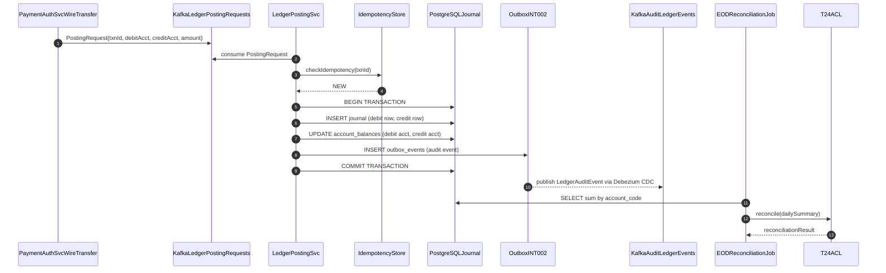

# Ledger Posting Engine

Status: Draft | Last Reviewed: 2026-05-16 | Owner: @core-banking-domain-owner
Catalog ID: REF-010 | Radii
Tier Applicability: T0

## Problem Statement

- The double-entry ledger (BSP-001) defines the posting rules but does not specify how to scale to 5,000 TPS peak; without a reference architecture that shows how idempotency (BSP-002), batch EOD (BSP-004), and audit logging (SEC-012) are wired together, each team implements its own ledger integration with inconsistent error handling.
- Balance calculation at query time (scanning ledger rows) is O(n) over the full account history; without materialised balance views that are updated atomically with ledger entries, high-TPS environments exhibit contention between readers and writers on the `journal` table.
- End-of-day reconciliation between the ledger and T24 core banking requires a separate batch job (BSP-004) that must complete within a hard 4-hour window; without a reference showing the reconciliation data flow, teams design ad-hoc batch scripts that miss edge cases (in-flight transactions, timezone boundary entries).
- The audit trail requirement (PCI-DSS §10, BCBS 239) for every ledger posting must survive a ledger service failure; if audit events are published synchronously in the same transaction as the posting, a Kafka failure can rollback the posting, creating phantom audit events without corresponding ledger entries.

## Context

The Ledger Posting Engine is the highest-throughput T0 system in Techcombank: it processes every NAPAS payment, every SWIFT wire, every internal book transfer, and every card settlement. This reference architecture composes BSP-001 (double-entry invariant), BSP-002 (idempotency), BSP-004 (EOD reconciliation), and SEC-012 (audit logging) into a production-grade posting engine. The Kafka outbox pattern (INT-002) decouples audit publishing from the posting transaction.

## Solution

The LedgerPostingSvc receives posting requests from upstream services (PaymentAuthSvc, WireTransferSvc, CardSettlementJob) via Kafka topic `ledger.posting.requests`. An idempotency store (BSP-002) prevents duplicate postings. The posting writes two ledger rows (debit + credit) and updates the materialised balance views atomically. Audit events are published via the Outbox pattern (INT-002) — decoupled from the posting transaction. The EOD reconciliation job (BSP-004) runs nightly and compares ledger totals against T24.



## Implementation Guidelines

### 1. LedgerPostingSvc — Consumer and Posting Logic

```java
@Service
@RequiredArgsConstructor
public class LedgerPostingService {

    private final JdbcTemplate jdbc;
    private final IdempotencyStore idempotencyStore;

    @KafkaListener(topics = "ledger.posting.requests", groupId = "ledger-svc")
    @Transactional("transactionManager")
    public void onPostingRequest(PostingRequest req) {
        if (idempotencyStore.exists(req.txnId())) {
            log.info("Duplicate posting ignored: txnId={}", req.txnId());
            return;
        }

        Instant now = Instant.now();
        jdbc.update(
            "INSERT INTO journal (txn_id, account_id, direction, amount, currency, posted_at)"
            + " VALUES (?,?,?,?,?,?)",
            req.txnId(), req.debitAccountId(), "DR", req.amount(), req.currency(), now);
        jdbc.update(
            "INSERT INTO journal (txn_id, account_id, direction, amount, currency, posted_at)"
            + " VALUES (?,?,?,?,?,?)",
            req.txnId(), req.creditAccountId(), "CR", req.amount(), req.currency(), now);

        jdbc.update(
            "UPDATE account_balances SET balance = balance - ? WHERE account_id = ?",
            req.amount(), req.debitAccountId());
        jdbc.update(
            "UPDATE account_balances SET balance = balance + ? WHERE account_id = ?",
            req.amount(), req.creditAccountId());

        jdbc.update(
            "INSERT INTO outbox_events (aggregate_id, event_type, payload, created_at)"
            + " VALUES (?,?,?,?)",
            req.txnId(), "LEDGER_POSTED",
            JsonUtil.serialize(req), now);

        idempotencyStore.markProcessed(req.txnId());
    }
}
```

### 2. PostgreSQL Schema — Journal and Balances

```sql
CREATE TABLE journal (
    id          BIGSERIAL PRIMARY KEY,
    txn_id      TEXT         NOT NULL,
    account_id  TEXT         NOT NULL,
    direction   CHAR(2)      NOT NULL CHECK (direction IN ('DR', 'CR')),
    amount      NUMERIC(20,4) NOT NULL,
    currency    CHAR(3)      NOT NULL,
    posted_at   TIMESTAMPTZ  NOT NULL DEFAULT NOW(),
    UNIQUE (txn_id, account_id, direction)
) PARTITION BY RANGE (posted_at);

CREATE TABLE account_balances (
    account_id   TEXT         PRIMARY KEY,
    balance      NUMERIC(20,4) NOT NULL DEFAULT 0,
    currency     CHAR(3)       NOT NULL,
    last_posted  TIMESTAMPTZ   NOT NULL
);

CREATE TABLE journal_2026_05
    PARTITION OF journal
    FOR VALUES FROM ('2026-05-01') TO ('2026-06-01');
```

### 3. EOD Reconciliation Job (BSP-004 integration)

```java
@Component
@RequiredArgsConstructor
public class EodReconciliationJob {

    private final JdbcTemplate jdbc;
    private final T24Client t24Client;
    private final AlertService alertService;

    @Scheduled(cron = "0 0 23 * * *")
    public void reconcile() {
        LocalDate today = LocalDate.now();
        List<AccountSummary> ledgerSummary = jdbc.query(
            "SELECT account_id, SUM(CASE WHEN direction='CR' THEN amount ELSE -amount END) as net"
            + " FROM journal WHERE posted_at::date = ? GROUP BY account_id",
            (rs, i) -> new AccountSummary(rs.getString("account_id"), rs.getBigDecimal("net")),
            today);

        ReconciliationResult result = t24Client.reconcile(today, ledgerSummary);
        result.discrepancies().forEach(d ->
            alertService.fireCritical("ledger_reconciliation_discrepancy",
                Map.of("accountId", d.accountId(), "variance", d.variance())));
    }
}
```

## When to Use

- Any service that writes financial transactions requiring double-entry integrity, idempotent posting, and BCBS 239-compliant audit trail.
- Scaling the posting pipeline beyond 1,000 TPS using Kafka consumer group partitioning across account ranges.
- Replacing a synchronous database-trigger-based balance update with an event-driven materialised balance pattern.

## When Not to Use

- Non-financial data updates (customer profile changes, address updates) — the double-entry overhead is not justified; use standard CRUD with audit logging.
- Intraday position tracking for market risk (FX, derivatives) — requires mark-to-market revaluation logic not present in this architecture; use a dedicated position-keeping system.
- Micro-ledger within a single service (e.g., reward points) — the full BSP-001 pattern is justified for money; for non-monetary value stores, a simpler append-only table suffices.

## Variants

| Variant | Use when | Trade-off |
|---------|----------|-----------|
| Kafka consumer group posting (this pattern) | High-TPS payment environments; horizontal scalability required | Consumer group rebalancing introduces temporary latency; Kafka consumer group lag is the key SLO metric |
| Synchronous REST posting | Lower-volume, latency-sensitive use cases (e.g., teller single transaction) | Simpler; no Kafka lag; not scalable beyond ~500 TPS on a single DB connection pool |
| Dual-write T24 + ledger | During T24 modernisation; both systems must be consistent | Complex saga; risk of split-brain between T24 and ledger; use INT-005 ACL to serialise T24 call |

## NFR Acceptance Criteria

| Metric | Threshold | Measurement |
|--------|-----------|-------------|
| Posting throughput | 5,000 TPS (sustained, across 10 Kafka partitions) | Gatling load test; assert 5,000 TPS with zero sum-zero violations |
| Posting p99 latency (Kafka consume to DB commit) | 50 ms | Measure `onPostingRequest` duration; assert p99 50 ms |
| Balance read p99 latency | 5 ms (materialised view query) | `SELECT balance FROM account_balances WHERE account_id = ?`; assert p99 5 ms |
| Sum-zero invariant | 100% — every txnId has exactly one DR and one CR of equal amount | Nightly SQL check: `SELECT txn_id FROM journal GROUP BY txn_id HAVING SUM(CASE direction WHEN 'CR' THEN amount ELSE -amount END) != 0` — must return 0 rows |
| Availability | T0 — 99.99% | Kafka consumer group failover; PostgreSQL Multi-AZ |
| RTO | 5 min (LedgerPostingSvc pod failure; Kafka offset replay) | Chaos: kill all LedgerPostingSvc pods; measure time to first successful posting |

## Compliance Mapping

| Ring | Regulation | Provision | How this architecture satisfies |
|------|-----------|-----------|--------------------------------|
| Ring 0 | PCI-DSS v4.0 | §10.3 — Protect audit logs; §3.3 — Do not store sensitive authentication data post-authorization | Ledger entries are append-only (PostgreSQL INSERT-only, no DELETE/UPDATE permissions); Outbox → Kafka audit trail is immutable; no card PAN stored in journal — only account IDs. |
| Ring 1 | BCBS 239 | §3 — Accuracy: data aggregations must be complete and accurate; §6 — Adaptability: risk data must be reproducible on demand | Sum-zero nightly check enforces accuracy invariant; journal partitioned by date enables ad-hoc period-specific aggregation for regulatory submissions; all postings traceable to originating txnId. |
| Ring 2 | SBV Circular 09/2020 | §IV.2 — Audit trail for all financial transactions; minimum 5-year retention ⚠️ (working summary — pending Legal review) | Journal entries are append-only and partition-pruned only after S3 WORM export (SEC-012 audit pattern); Outbox → Kafka → S3 provides secondary immutable copy; Legal review required to confirm 5-year retention period and partition-drop-after-WORM-export approach satisfies SBV §IV.2. |

## Cost / FinOps

- LedgerPostingSvc: 5 pods × `c5.xlarge` (4 vCPU, 8 GiB) for 5,000 TPS throughput = ~USD 700/month. HPA scales down to 2 pods at off-peak.
- PostgreSQL journal table: at 5,000 TPS × 2 rows (DR+CR) × 200 bytes/row = 1 MB/s raw; with compression ~300 KB/s = ~26 GB/day; monthly partitions archived to S3 after 30 days; S3 cost ~USD 0.50/GB/month × 780 GB = ~USD 390/month for 30-day hot retention.
- Debezium CDC for Outbox: 1 connector per Kafka cluster; existing infrastructure shared with INT-002.
- Cost of NOT using this architecture: ledger reconciliation incidents historically cost 2 engineer-days each (manual reconciliation); at 2 incidents/month = 48 engineer-days/year avoided.

## Threat Model

- **Balance manipulation — balance table direct update (Tampering)**: A user with database write access updates `account_balances.balance` directly without a corresponding journal entry, creating a balance that does not match the sum of journal rows. Mitigation: Database role `ledger_svc` has INSERT on `journal` and UPDATE on `account_balances` only when called from within the LedgerPostingSvc transaction; no direct UPDATE grant to balance without journal INSERT; nightly sum-zero and balance-vs-journal reconciliation alerts on any discrepancy.
- **Duplicate posting (Tampering)**: A Kafka consumer restart replays an already-processed posting request, creating a second debit/credit pair for the same transaction. Mitigation: `UNIQUE (txn_id, account_id, direction)` constraint on `journal` table; `IdempotencyStore` soft-check before attempting INSERT; PostgreSQL will throw `DataIntegrityViolationException` on hard duplicate, which is caught and treated as idempotent success.

## Operational Runbook Stub

**Alert: `journal_sum_zero_violation > 0`**
- p50 baseline: 0 violations | p99 SLO: 0 violations
- Remediation: CRITICAL — financial integrity breach. (1) Halt all new postings: set Kafka consumer group lag limit to 0. (2) Identify violating txnIds from nightly check. (3) Notify CFO and Head of Operations immediately. (4) Do NOT attempt to fix by inserting compensating entries until root cause is established. (5) Preserve DB state for forensic analysis.

**Alert: `ledger_consumer_lag > 10000 messages`**
- p50 baseline: 100 messages | p99 SLO: 5,000 messages
- Remediation: (1) Scale LedgerPostingSvc pods: `kubectl scale deploy ledger-posting-svc --replicas=10`. (2) Check DB connection pool saturation: `SELECT count(*) FROM pg_stat_activity WHERE application_name = 'ledger-svc'`. (3) If DB is the bottleneck, enable read replica for idempotency checks. (4) If lag exceeds 100,000 messages, escalate to on-call DBA — potential DB performance incident.

## Test Strategy Stub

- **Unit**: `LedgerPostingServiceTest` — happy path asserts 2 journal INSERTs and 2 balance UPDATEs called; duplicate txnId asserts no DB calls (idempotency short-circuit); amount = 0 asserts `IllegalArgumentException`. Sum-zero: post 100 random transactions, sum journal by txnId, assert all sums = 0.
- **Integration**: Spring Boot Test with Testcontainers (Kafka + PostgreSQL): consume 1,000 posting requests, assert 2,000 journal rows, assert all sum-zero, assert outbox_events populated, assert account_balances updated correctly. Duplicate replay: consume same PostingRequest twice, assert exactly 2 journal rows (DR+CR), assert balance updated once.
- **Chaos**: Kill LedgerPostingSvc mid-batch, restart, assert all un-committed transactions replayed from Kafka, assert no partial postings. Kill PostgreSQL primary mid-transaction, assert Kafka consumer retries, after failover assert consistency.

## Related Patterns

- [BSP-001 Double-Entry Ledger](../../patterns/banking-solutions/double-entry-ledger.md)
- [BSP-002 Idempotent Payment Key](../../patterns/banking-solutions/idempotent-payment-key.md)
- [BSP-004 End-of-Day Batch Window](../../patterns/banking-solutions/end-of-day-batch-window.md)
- [INT-002 CDC Outbox Pattern](../../patterns/integration/cdc-outbox-pattern.md)
- [SEC-012 Tamper-Evident Audit Logging](../../patterns/security/audit-logging-tamper-evident.md)

## References

- [PostgreSQL Table Partitioning](https://www.postgresql.org/docs/current/ddl-partitioning.html)
- [Debezium Outbox Event Router](https://debezium.io/documentation/reference/stable/transformations/outbox-event-router.html)
- [BCBS 239 — Risk Data Aggregation Principles](https://www.bis.org/publ/bcbs239.htm)
- [PCI-DSS v4.0 §10 — Audit Logging](https://www.pcisecuritystandards.org/document_library/)
- Catalog reference: `governance/standards/enterprise-architecture-catalog.md`
