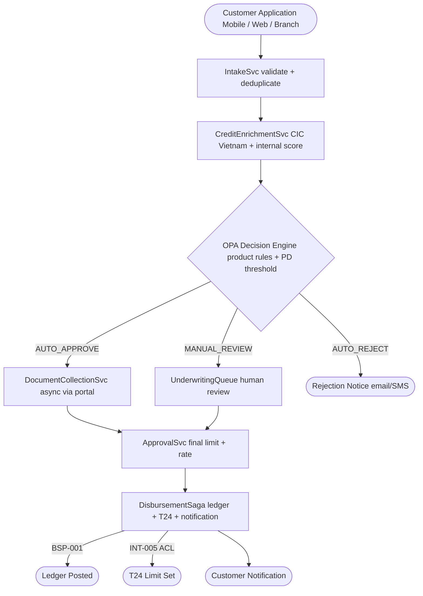

# Loan Origination

Status: Draft | Last Reviewed: 2026-05-16 | Owner: @lending-domain-owner
Catalog ID: REF-006 | Radii
Tier Applicability: T1

## Problem Statement

- Credit scoring from multiple bureaus (CIC Vietnam, internal behavioural) returns inconsistent data schemas; without a normalisation layer, each loan product implements its own bureau integration, leading to divergent decisioning logic and inconsistent IFRS 9 PD (probability of default) calculations across products.
- Manual underwriting review queues create SLA breaches for retail loans; the absence of a decision engine that auto-approves low-risk applications forces every application through a human queue, resulting in 3–5 business day TAT when the market standard is same-day for digital channels.
- KYC/AML re-checking during loan origination duplicates work already done at account opening (REF-003); without a shared KYC result cache with TTL, each loan triggers a fresh bureau and sanctions check, adding cost and latency.
- Loan disbursement to the customer account is a multi-step process (approval, limit setting, disbursement posting, T24 core-banking update); without a saga (INT-001), a failure between approval and posting can leave the customer approved but not funded — undetectable without daily reconciliation.
- IFRS 9 provisioning requires the PD assigned at origination to be stored immutably alongside the loan record; if the origination system does not capture the point-in-time PD at disbursement, the ECL calculation team must reconstruct it from model snapshots — a manual, error-prone process.

## Context

Loan origination at Techcombank spans three digital channels (mobile app, web, branch tablet) and two product lines (unsecured consumer, mortgage). This reference architecture covers the shared origination pipeline. Product-specific underwriting rules are plugged in as OPA policy bundles (SEC-010 ABAC). The pipeline integrates CIC credit bureau, internal behavioural scoring, KYC/AML (REF-003), and T24 core banking (INT-005). Disbursement volume is 2,000–5,000 applications/day with peak during salary season.

## Solution

Applications flow through a six-stage pipeline orchestrated by the LoanOriginationSvc (Saga INT-001): intake, credit bureau enrichment, decisioning (rules engine + ML score), document collection (async), approval, disbursement. The OPA decision engine evaluates product-specific rules against the enriched application. Approved applications trigger a disbursement saga that posts the ledger entry (BSP-001) and updates T24 via the Anti-Corruption Layer (INT-005).



## Implementation Guidelines

### 1. LoanOriginationSaga — Spring Boot + Saga (INT-001)

```java
@Service
@RequiredArgsConstructor
public class DisbursementSaga {

    private final LedgerClient ledgerClient;
    private final T24Client t24Client;
    private final NotificationClient notificationClient;
    private final LoanRepository loanRepo;

    @Transactional
    public void disburse(String loanId) {
        Loan loan = loanRepo.findByLoanId(loanId)
            .orElseThrow(() -> new IllegalArgumentException("Loan not found: " + loanId));

        ledgerClient.postEntries(LedgerPostingRequest.builder()
            .transactionId(loan.loanId())
            .debitAccount("LOAN_BOOK_ACCOUNT")
            .creditAccount(loan.customerAccountId())
            .amount(loan.approvedAmount())
            .currency(loan.currency())
            .build());

        t24Client.setLoanLimit(loan.t24CustomerId(), loan.approvedAmount(), loan.productCode());

        notificationClient.sendDisbursementConfirmation(loan.customerId(), loan.approvedAmount());

        loan.updateStatus(LoanStatus.DISBURSED);
        loanRepo.save(loan);
    }
}
```

### 2. OPA Credit Decision Policy (Rego)

```rego
package lending.decision

import future.keywords.if

default decision = "MANUAL_REVIEW"

decision = "AUTO_APPROVE" if {
    input.creditScore >= 700
    input.dti <= 0.35
    input.requestedAmount <= 500000000
    not input.applicant.is_pep
    input.kycStatus == "CLEARED"
}

decision = "AUTO_REJECT" if {
    input.creditScore < 500
}

decision = "AUTO_REJECT" if {
    input.applicant.is_sanctioned
}
```

### 3. Credit Enrichment — CIC Bureau Integration

```java
@Service
@RequiredArgsConstructor
public class CreditEnrichmentService {

    private final CicBureauClient cicClient;
    private final InternalScoringClient internalClient;
    private final RedisTemplate<String, CreditProfile> cache;

    public CreditProfile enrich(String nationalId) {
        String cacheKey = "credit:" + nationalId;
        CreditProfile cached = cache.opsForValue().get(cacheKey);
        if (cached != null) return cached;

        CicReport cicReport = cicClient.fetch(nationalId);
        int internalScore = internalClient.score(nationalId);

        CreditProfile profile = CreditProfile.builder()
            .creditScore(blend(cicReport.score(), internalScore))
            .dti(cicReport.debtToIncomeRatio())
            .defaultHistory(cicReport.defaults())
            .isPep(cicReport.isPep())
            .isSanctioned(cicReport.isSanctioned())
            .build();

        cache.opsForValue().set(cacheKey, profile, Duration.ofHours(24));
        return profile;
    }

    private int blend(int cicScore, int internalScore) {
        return (int) (cicScore * 0.6 + internalScore * 0.4);
    }
}
```

## When to Use

- Digital loan origination for unsecured consumer and mortgage products where automated decisioning, KYC reuse, and IFRS 9 PD capture are required.
- Implementing or replacing a manual underwriting queue with a rules-engine-backed auto-decisioning pipeline.
- Any new loan product that must integrate CIC Vietnam credit bureau and T24 core banking via the Anti-Corruption Layer.

## When Not to Use

- Trade finance or structured products where underwriting involves collateral assessment, legal due diligence, and multi-party negotiation — these require a case management system (not a pipeline) and fall outside this architecture's scope.
- Micro-lending products with purely behavioural scoring (no CIC bureau access) — the CIC enrichment stage can be replaced with an internal-only scoring path, but the architecture should be adapted rather than used as-is.
- Corporate loan syndication — syndicated lending involves multiple lenders, participation agreements, and agent bank flows outside this single-bank origination architecture.

## Variants

| Variant | Use when | Trade-off |
|---------|----------|-----------|
| Fully automated (auto-approve / auto-reject only) | Low-value consumer loans with high decision confidence; speed-to-market priority | Regulatory scrutiny on automated rejection decisions; requires explainability for adverse action notices |
| Hybrid (this pattern — auto + manual queue) | Mix of retail and high-value loans; regulatory preference for human oversight on large exposures | Manual queue introduces TAT variability; requires SLA monitoring on queue length |
| Document-first (manual collection before decisioning) | Mortgage; products requiring income verification before credit decision | Longer TAT; reduces misapplication waste for products with frequent document failures |

## NFR Acceptance Criteria

| Metric | Threshold | Measurement |
|--------|-----------|-------------|
| Auto-decision p99 latency (intake to decision) | 5 s (CIC bureau sync call included) | Load test 100 concurrent applications; assert p99 5 s |
| Disbursement saga p99 latency | 10 s (ledger + T24 + notification) | End-to-end trace from ApprovalSvc to notification delivery; assert p99 10 s |
| Duplicate application prevention | 0 duplicate disbursements for same loanId | Idempotency test: call disburse twice with same loanId; assert one ledger posting |
| Bureau cache hit rate | 70% within 24h window | Redis cache hit metric; assert 70% hit rate under normal load |
| Availability | T1 — 99.9% (non-critical path; maintenance windows permitted) | Uptime alert; circuit breaker on CIC bureau client |
| RTO | 1 h (DisbursementSaga pod failure + Kafka replay) | Chaos test: kill DisbursementSaga pod; verify in-flight sagas resume from Kafka offset |

## Compliance Mapping

| Ring | Regulation | Provision | How this architecture satisfies |
|------|-----------|-----------|--------------------------------|
| Ring 0 | IFRS 9 | §5.5 — Impairment: Expected Credit Loss requires PD at origination | OPA decision policy captures `creditScore` and `dti`; PD model output stored immutably in `loans.origination_pd` column at disbursement; used by ECL calculation job. |
| Ring 1 | BCBS 239 | §3 — Data accuracy: credit risk data must be complete and accurate at origination | CIC bureau report and internal score stored in `credit_enrichments` table with `fetch_ts`; immutable after disbursement; BCBS 239 data lineage tracked via DATA-009. |
| Ring 2 | Decree 13/2023 | §9 — Personal data processing during credit assessment requires documented purpose and consent ⚠️ (working summary — pending Legal review) | Credit bureau query uses applicant `nationalId` (personal data); consent captured during application intake and stored in consent management DB; CIC data cached for 24h only; Legal review required to confirm consent basis and CIC data retention period satisfy Decree 13/2023 in full. |

## Cost / FinOps

- CIC Vietnam bureau: charged per query; at 3,000 applications/day with 70% cache hit rate = 900 bureau calls/day. Negotiate a volume tier; the 24h cache pays for itself after 2,100 cached calls/day.
- OPA decision engine: sidecar per LoanOriginationSvc pod; 64 MiB / 0.1 vCPU — negligible.
- T24 ACL (INT-005): existing infrastructure; loan origination adds ~3,000 `setLoanLimit` OFS calls/day — within existing T24 interface capacity.
- Manual review queue infrastructure: 1 Spring Boot pod for queue management; cost justified by the SLA enforcement and audit trail it provides compared to email-based manual review.

## Threat Model

- **Credit score manipulation (Tampering)**: Internal user with CIC query access manipulates the bureau response cache (Redis) to inflate a connected party's credit score, enabling fraudulent auto-approval. Mitigation: Redis AUTH enforced; OPA ABAC (SEC-010) restricts CIC cache write access to `CreditEnrichmentSvc` service account only; HMAC signature on cached credit profile validates integrity at read time.
- **Duplicate disbursement (Tampering)**: Race condition between two concurrent DisbursementSaga invocations for the same loanId results in two ledger postings. Mitigation: `loans` table has `UNIQUE(loan_id)` constraint; DisbursementSaga uses `SELECT ... FOR UPDATE` on `loan_id` before posting; Kafka consumer group ensures single-consumer processing.

## Operational Runbook Stub

**Alert: `loan_auto_decision_p99 > 10s`**
- p50 baseline: 2 s | p99 SLO: 5 s
- Remediation: (1) Check CIC bureau latency: `curl -w "%{time_total}" https://cic-bureau.internal/health`. (2) If CIC is slow, check cache hit rate — a cold start after Redis restart will cause all calls to hit the bureau. (3) Check OPA decision latency: `kubectl logs -l app=loan-origination-svc | grep opa_decision_ms`. (4) If consistently slow, increase CIC cache TTL from 24h to 48h for non-PEP applicants.

**Alert: `disbursement_saga_stuck > 30min`** (saga in IN_PROGRESS state)
- p50 baseline: 10 s | p99 SLO: 30 s
- Remediation: (1) Identify stuck saga: `SELECT loan_id, status, updated_at FROM loans WHERE status = 'DISBURSING' AND updated_at < NOW() - INTERVAL '30 minutes'`. (2) Check T24 connectivity: `kubectl logs -l app=t24-acl-adapter`. (3) If T24 is unavailable, Saga retries with exponential backoff — do not manually intervene until 2h timeout. (4) After 2h, trigger manual compensation: revert ledger entry and notify customer.

## Test Strategy Stub

- **Unit**: `DisbursementSagaTest` — happy path asserts ledger, T24, and notification called in order; T24 failure asserts saga rolls back ledger entry; duplicate loanId asserts `DataIntegrityViolationException`.
- **Unit**: `CreditEnrichmentServiceTest` — cache hit asserts CIC client NOT called; cache miss asserts CIC client called and result cached; `isPep = true` asserts `CreditProfile.isPep = true`.
- **Integration**: Spring Boot Test with Testcontainers (Kafka + Redis + PostgreSQL) + WireMock (CIC bureau, T24): creditScore 750, dti 0.30, amount 200M asserts AUTO_APPROVE; same nationalId twice within 24h asserts single CIC bureau call; `is_pep = true` asserts MANUAL_REVIEW.
- **Compliance**: IFRS 9 PD capture — disburse loan, query `loans.origination_pd`, assert not null and matches OPA decision policy output. Decree 13/2023 consent — attempt CIC query without consent record, assert `ConsentRequiredException`.

## Related Patterns

- [REF-003 KYC/AML Onboarding](kyc-aml-onboarding.md)
- [BSP-001 Double-Entry Ledger](../patterns/banking-solutions/double-entry-ledger.md)
- [INT-001 Saga Orchestration](../patterns/integration/saga-orchestration.md)
- [INT-005 Anti-Corruption Layer](../patterns/integration/anti-corruption-layer.md)
- [COMP-005 BCBS 239](../compliance/basel-bcbs-239.md)

## References

- [IFRS 9 Financial Instruments — Impairment](https://www.ifrs.org/issued-standards/list-of-standards/ifrs-9-financial-instruments/)
- [CIC Vietnam Credit Information Centre](https://cic.gov.vn/)
- [BCBS 239 — Principles for Effective Risk Data Aggregation](https://www.bis.org/publ/bcbs239.htm)
- [Decree 13/2023/ND-CP — Personal Data Protection](https://vanban.chinhphu.vn/default.aspx?pageid=27160&docid=207126)
- [OPA Policy Language (Rego)](https://www.openpolicyagent.org/docs/latest/policy-language/)
- Catalog reference: `governance/standards/enterprise-architecture-catalog.md`
