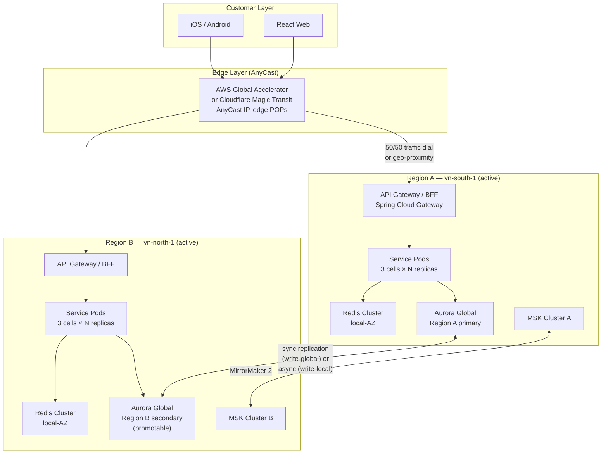

# Multi-Region Active-Active

Status: Draft | Last Reviewed: 2026-05-09 | Owner: @ea-board, @sre-lead
Catalog ID: REF-001 | **Spine**
Tier Applicability: T0 (mandatory), T1 (recommended; otherwise active-passive hot)

## Problem Statement

A T0 service must survive any single-region event (network partition, AZ-wide power loss, regional control-plane impairment, regional cyber incident) with sub-5-minute RTO and zero RPO. A passive-standby topology cannot meet this — promotion takes minutes; data tail loss is non-zero. Active-active across two (or more) Vietnam-eligible regions is the only topology that satisfies SBV §IV.2 + BCBS 230 Principle 6 (Incident Management) for Tier-0 services.

This reference architecture is the canonical T0 blueprint. Every T0 service inherits this topology unless it explicitly opts out (with EA-Board approval and a documented compensating control).

## Context

Reach for this doc when:

- Designing a new T0 service.
- Evaluating whether a T1 service should upgrade to active-active.
- Planning capacity for an existing T0 — the active-active footprint sets the cost baseline.
- Investigating a regional incident — this doc defines the recovery topology that should already be deployed.

## Solution



### Topology choices

For T0 sync APIs (payment auth, ledger post): **write-global with Aurora Global Database**.
- All writes route to Region A primary; reads serve from local region.
- Region A primary loss → promote Region B secondary in < 1 minute via Application Recovery Controller (ARC).
- Sub-second cross-region replication lag.
- Sync replication for write commits gives RPO = 0.

For high-throughput ingest (events, telemetry): **write-local with DynamoDB Global Tables or Kafka MirrorMaker 2**.
- Each region accepts writes; last-writer-wins or per-key partitioning.
- Higher throughput; eventual consistency between regions.
- Required for write hot-spots that can't fit a single Region A primary.

For T0 read-heavy paths (account inquiry): **read-local + write-global**.
- Stale reads tolerated by application-layer policy (e.g., display "as of" timestamp).

### Failover playbook

```
Trigger: regional health check fails for 60s OR manual ARC switch.

Steps:
1. ARC switches Route 53 / Global Accelerator endpoint health to Region B.
2. Aurora Global Database promotion: Region B becomes primary.
3. New connections from clients route to Region B (cached DNS may delay 30-60s; Global Accelerator AnyCast bypasses DNS).
4. Existing Region A connections: drained over 60s with retry-after-backoff (RES-003).
5. Service pods in Region B autoscale to handle 100% traffic.
6. Verify: health checks green, smoke tests pass, business metrics within tier-budget.
```

### Cell-based partitioning (RES-005) within each region

Each region is partitioned into N cells (default 3). Cell boundary = customer-id hash. Failure of one cell affects ≤ 1/N of users; rest of the region remains healthy.

### What active-active does NOT solve

- **Data corruption / logical errors** — bad data replicates to both regions. Mitigation: point-in-time backups (BP-002), idempotency-by-default (PRIN-006), cell-based blast radius (RES-005).
- **Cyber incident affecting both regions** — Vietnam regulatory expectation is that both regions are within Vietnam (Decree 53). A nation-state attack could affect both. Mitigation: cold backup in a third region (potentially offshore, with Decree 53 carve-outs).
- **Long-tail data residency** for customer PII — must comply with Decree 53 (see PRIN-007); both active regions must be within Vietnam unless a specific data class has cross-border permission.

## Implementation Guidelines

### Java / Spring — region-aware service registration

```java
@Configuration
public class RegionAwareConfig {

    @Value("${techcombank.region:vn-south-1}")
    private String region;

    @Bean
    public DiscoveryClientRegistration registration() {
        Map<String, String> metadata = new HashMap<>();
        metadata.put("region", region);
        metadata.put("zone", System.getenv("AWS_AVAILABILITY_ZONE"));
        return DiscoveryClientRegistration.builder()
            .metadata(metadata)
            .preferLocalZone(true)
            .preferLocalRegion(true)
            .build();
    }

    @Bean
    public LoadBalancer regionPreferringLb() {
        return LoadBalancer.builder()
            .priorityRoutes(List.of(
                Predicates.localZone(),
                Predicates.localRegion(),
                Predicates.any()
            ))
            .build();
    }
}
```

### Spring Cloud Gateway — region-aware routing

```java
@Configuration
public class GatewayRoutingConfig {

    @Bean
    public RouteLocator routes(RouteLocatorBuilder builder) {
        return builder.routes()
            .route("payment-auth", r -> r
                .path("/payments/**")
                .filters(f -> f
                    .header("X-Region", "${techcombank.region}")
                    .circuitBreaker(c -> c.setName("payment-auth").setFallbackUri("forward:/fallback/payment-auth"))
                )
                .uri("lb://payment-auth"))
            .build();
    }
}
```

### Kubernetes — multi-region deployment manifest

```yaml
# regions/vn-south-1/payment-auth/values.yaml
region: vn-south-1
replicaCount: 12          # 3 cells × 4 replicas
priority: primary

# regions/vn-north-1/payment-auth/values.yaml
region: vn-north-1
replicaCount: 12
priority: secondary       # active but receives 50% via Global Accelerator dial

# templates/deployment.yaml
metadata:
  labels:
    techcombank.io/region: {{ .Values.region }}
    techcombank.io/tier: T0
    techcombank.io/topology: multi-region-active-active
spec:
  template:
    spec:
      topologySpreadConstraints:
        - maxSkew: 1
          topologyKey: topology.kubernetes.io/zone
          whenUnsatisfiable: DoNotSchedule
          labelSelector:
            matchLabels:
              app: payment-auth
        - maxSkew: 1
          topologyKey: techcombank.io/cell
          whenUnsatisfiable: DoNotSchedule
          labelSelector:
            matchLabels:
              app: payment-auth
```

### Aurora Global Database — write-global config

```sql
-- create global cluster (Region A primary)
CREATE GLOBAL CLUSTER aurora_payment_global
  ENGINE aurora-postgresql
  ENGINE_VERSION '15.4'
  ;

-- secondary in Region B
ALTER GLOBAL CLUSTER aurora_payment_global
  ADD REGION 'vn-north-1'
  AS SECONDARY
  ;

-- promotion (during failover)
SELECT aws_aurora.global_db_failover('aurora_payment_global', 'vn-north-1');
-- promotion completes in < 60 s
```

### MirrorMaker 2 — Kafka cross-region replication

```yaml
# kafka-mirror-maker.yaml
clusters:
  vn-south-1:
    bootstrap.servers: kafka-vn-south-1.techcombank.local:9092
  vn-north-1:
    bootstrap.servers: kafka-vn-north-1.techcombank.local:9092

replicationFlows:
  - source: vn-south-1
    target: vn-north-1
    topics: payment-events, ledger-events, kyc-events
    replicationFactor: 3
    consumer.fetch.min.bytes: 1024
    producer.compression.type: lz4
  - source: vn-north-1
    target: vn-south-1
    topics: payment-events, ledger-events, kyc-events
```

### T24 / legacy integration

T24 is generally a single-region database. Active-active integration with T24 follows two patterns:

1. **CDC fan-out (preferred)**: T24 OFS bridge writes to Kafka in both regions via Outbox + CDC (INT-002). Downstream services read from local-region topic.
2. **Bridge replication**: a secondary T24 instance in Region B receives synchronous replication; cutover via T24-native tools at failover.

Both require careful idempotency (PRIN-006) at the bridge to prevent double-posting on failover.

### React + TypeScript — region-aware client

```typescript
// src/lib/region-config.ts
const REGION_PRIORITY = ['vn-south-1', 'vn-north-1'];

export function getApiBase(): string {
    // Global Accelerator AnyCast IP — single endpoint, edge routes to nearest region
    return 'https://api.techcombank.vn';
}

// for advanced clients that want explicit region pinning
export async function pingRegions(): Promise<string[]> {
    const results = await Promise.all(
        REGION_PRIORITY.map(async (r) => {
            try {
                const start = performance.now();
                await fetch(`https://${r}.api.techcombank.vn/health`, { method: 'HEAD' });
                return { region: r, latency: performance.now() - start };
            } catch {
                return { region: r, latency: Infinity };
            }
        })
    );
    return results.sort((a, b) => a.latency - b.latency).map((r) => r.region);
}
```

### iOS / Android

Mobile clients use the AnyCast endpoint; no region-pinning logic. The Global Accelerator edge handles routing. Clients only need to handle a region failover transparently — same URL, same TLS cert, the only observable signal is a brief retry storm during cutover (handled by retry-with-backoff and idempotency).

## Variants & Trade-offs

| Variant | When | Trade-off |
|---|---|---|
| **Active-active write-global** (this doc, default for T0 sync) | Payment auth, ledger | Slightly higher write latency (cross-region sync); RPO = 0 |
| **Active-active write-local** | High-throughput ingest, telemetry | Eventual consistency; reconciliation logic needed |
| **Active-passive hot standby** (T1 default) | Account services, KYC | Lower cost; ~1-5 min RTO during promotion |
| **Pilot light** (T2) | Reporting | Cheapest; ~15-30 min RTO; manual scale-up |
| **Three-region** | Cross-border with offshore DR (with Decree 53 carve-out) | Triple cost; survives nation-state-scale incidents |

## NFR Acceptance Criteria

- **HA**: enables T0 RTO < 5 min, RPO 0, availability ≥ 99.99%. Inherited by every T0 service via [NFR-001](../nfr/service-tiering-rto-rpo.md).
- **HP**: cross-region sync replication adds 1–5 ms per write commit (within T0 budget per [NFR-002](../nfr/latency-budget-model.md)). Reads served from local region with no cross-region penalty.
- **HR**: failure modes documented; RES-005 cell-based limits blast radius within each region; Global Accelerator + ARC drives data-plane failover (no control-plane dependency).

## Compliance Mapping

| Layer | Reference | Section/Control | How this satisfies |
|---|---|---|---|
| Ring 0 (generic) | AWS Well-Architected Reliability Pillar — §3 (Failure mode topology) | "Multi-site Active-Active for near-zero RTO/RPO" | This is the canonical AWS WA recovery pattern, applied to Techcombank context |
| Ring 1 (international banking) | Basel BCBS 239 — §3 (Timeliness) | Risk-data must be aggregated timely | Active-active ensures continuous ledger and risk-data flow even during regional events |
| Ring 1 (international banking) | Basel BCBS 230 Principle 3 (BCP) + Principle 6 (Incident Management) | Operational resilience requires explicit recovery topology ⚠️ (working summary — pending PDF fetch + Legal review) | Active-active is the documented Tier-0 topology |
| Ring 2 (Vietnam) | SBV Circular 09/2020 — §IV.2 | Operational continuity ⚠️ (working summary — pending Legal review) | Multi-region within Vietnam (vn-south-1 + vn-north-1) satisfies SBV continuity expectations while keeping data resident per Decree 53 |
| Ring 2 (Vietnam) | Decree 53/2022 — Data localisation ⚠️ (working summary — pending Legal review) | Customer data must be stored within Vietnam | Both active regions are domestic Vietnamese data centres / cloud regions |

## Cost / FinOps Notes

| Component | Region A | Region B | Notes |
|---|---|---|---|
| Compute (3 cells × N replicas) | 100% baseline | 100% baseline | Each region carries 100% peak capacity for failover |
| Database (Aurora Global) | Primary (full) | Secondary (full) | ~1.6× single-region (sync replication, dual storage) |
| Cache (Redis) | Local | Local | Two clusters; cache rebuilds on failover |
| Cross-region egress | — | continuous | Aurora replication, MirrorMaker, MirrorMaker chatter |
| Global Accelerator | shared edge | shared edge | ~$0.02 per GB processed |
| **Total cost multiple** | | | **~2.2× single-region baseline** |

**Levers**:
- Right-size per-region capacity to **100% peak** (active-active requires each region can absorb 100% during failover); over-provisioning beyond this is wasteful.
- Use Aurora I/O Optimized for high-write workloads; consider read-replicas in same region for read-heavy.
- Compress Kafka MirrorMaker traffic with LZ4 to reduce egress.
- Reserved Instances for steady-state compute; on-demand for spike capacity.

**Cost of NOT having active-active for T0**: a 30-minute regional outage on a payment system at peak (e.g., Tet eve) costs ~10× the annual active-active premium in customer goodwill, regulatory penalty exposure, and lost transaction fees.

## Threat Model Summary

STRIDE: active-active addresses **Denial of Service** and **Operational Excellence** primarily.

- **Top 3 threats addressed**:
  1. *Regional outage* (single AZ, network partition, regional control-plane impairment) — surviving region absorbs traffic.
  2. *DDoS targeting one region* — Global Accelerator distributes; affected region drains.
  3. *Planned-maintenance unavailability* — drain one region, deploy, restore; no customer impact.
- **Top 3 residual threats**:
  1. *Logical / data corruption replicates* — point-in-time backups (BP-002) and idempotency (PRIN-006) are the mitigation.
  2. *Both regions affected by single cyber incident* — coordinated nation-state attack. Mitigation: cold backup offshore (with Decree 53 carve-out approval); air-gapped DR plan.
  3. *Replication lag* causing data divergence — sync replication for T0 mitigates; monitor lag with `replication-lag-budget` alert (BP-007).

## Operational Runbook (stub)

- **Alerts**:
  - `Regional-Health-Critical`: < 95% of T0 health checks passing in a region for 60 s. Severity: Critical (PagerDuty).
  - `Replication-Lag-T0`: cross-region replication lag > 1 s. Severity: High.
  - `ARC-Failover-Triggered`: Application Recovery Controller engaged a failover. Severity: Critical (incident logged).
  - `Cross-Region-Egress-Spike`: > 200% of baseline egress over 1 hour (FinOps anomaly). Severity: Warning.
- **Dashboards**: Grafana — `multi-region-overview`, `aurora-global-replication-lag`, `mirrormaker-throughput`, `arc-traffic-dial`.
- **On-call escalation**:
  - L1: SRE primary (regional issue) — 5 min.
  - L2: SRE Lead + on-call EA-Board member (sustained or unclear) — 15 min.
  - L3: VP Infrastructure + CISO (cyber suspected, both regions) — 30 min.
- **Recovery steps**: see `governance/runbooks/regional-failover.md` (to be authored).

## Test Strategy (stub)

- **Unit**: region-aware config tests; load-balancer priority tests.
- **Integration**: deploy to two regions; verify replication lag < 1 s; verify Region B can serve requests with Region A unreachable.
- **Chaos** (BP-005): monthly inject region-A failure; measure RTO; verify RPO = 0.
- **DR drill** (BP-002): quarterly full regional failover; restore Region A; reverse direction.
- **Performance**: load test 2× peak across both regions; verify each region survives at 100% peak alone.

## When to Use

- **Mandatory** for every T0 service.
- **Recommended** for T1 services that have customer impact during regional outages.

## When NOT to Use

- T2 / T3 services where active-passive (hot standby) or pilot light is sufficient.
- Services where Decree 53 data-residency cannot be satisfied across the available regions (extremely rare in Vietnam-domestic deployments).

## Related Patterns

- [NFR-001 Service Tiering + RTO/RPO Matrix](../nfr/service-tiering-rto-rpo.md) — defines T0 (mandatory active-active)
- [NFR-002 Latency Budget Model](../nfr/latency-budget-model.md) — accommodates cross-region sync overhead
- [PRIN-006 Idempotency-by-default](../principles/idempotency-by-default.md) — required for safe failover
- [PRIN-007 Data Residency](../principles/data-residency.md) — both regions in Vietnam
- [RES-001 Bulkhead Isolation](../patterns/resilience/bulkhead-isolation.md) → [RES-005 Cell-Based Architecture](../patterns/resilience/cell-based-architecture.md) — within-region partitioning
- [RES-002 Circuit Breaker](../patterns/resilience/circuit-breaker.md) — fails fast on regional issues
- [INT-002 Transactional Outbox + CDC](../patterns/integration/cdc-outbox-pattern.md) — replication pattern
- [REF-002 Real-Time Payments NAPAS](real-time-payments-napas.md) — concrete T0 service consuming this topology
- [BP-002 Disaster Recovery Playbook](../best-practices/disaster-recovery-playbook.md) — operational complement
- [BP-005 Chaos Engineering](../best-practices/chaos-engineering.md) — drill cadence

## References

- AWS Well-Architected Reliability Pillar — Disaster Recovery Strategies whitepaper (`_research-notes.md` §AWS)
- AWS Application Recovery Controller (ARC)
- Aurora Global Database documentation
- Kafka MirrorMaker 2 documentation

---

**Key Takeaway**: T0 services run active-active across two Vietnam-resident regions with sync database replication, AnyCast edge, and ARC-driven data-plane failover. Cost is ~2.2× single-region; customer benefit is RTO < 5 min and RPO = 0.
