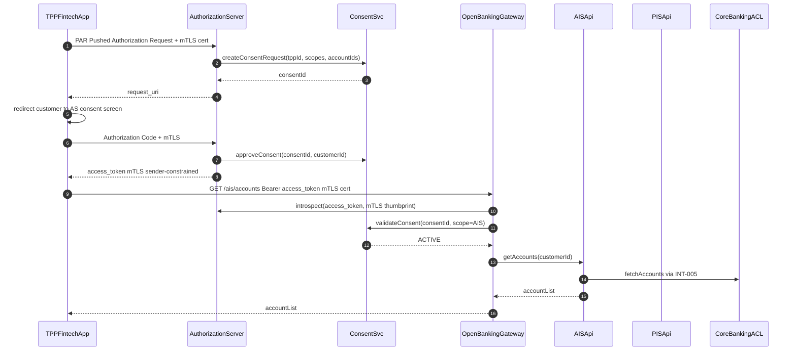

# Open Banking (PSD2)

Status: Draft | Last Reviewed: 2026-05-16 | Owner: @digital-channels-domain-owner
Catalog ID: REF-011 | Radii
Tier Applicability: T1

## Problem Statement

- Third-party providers (TPPs) accessing Techcombank accounts via open banking APIs without a centralised consent management system create compliance risk: the bank cannot produce a machine-readable audit of which TPP accessed which account under which consent grant, as required by PSD2 Article 32.
- FAPI 2.0 Baseline Security Profile requirements (mTLS sender-constrained tokens, Pushed Authorization Requests) are complex to implement correctly; each new open-banking API endpoint implemented without a shared Authorization Server re-implements the security profile, creating inconsistent token validation.
- TPP onboarding (registration, certificate validation, redirect URI whitelisting) is manual and error-prone; a fraudulent TPP with a forged eIDAS certificate can obtain production access if the TPP registry does not validate the certificate chain against the trust anchor.
- Consent expiry and revocation must be enforced at the API layer in real time; if revoked consent is only applied at the nightly batch, a TPP can continue accessing account data for up to 24 hours after the customer revoked consent — a PSD2 Article 67 violation.
- Account Information Service (AIS) and Payment Initiation Service (PIS) APIs have different SCA requirements; without a shared SCA orchestrator, each API type implements its own step-up authentication flow, producing inconsistent customer experience and non-uniform SCA evidence for audit.

## Context

Vietnam's open banking framework is emerging (SBV Circular 09/2020 references open API requirements). Techcombank is implementing PSD2-aligned controls proactively, using the European regulatory framework as a design reference while adapting for Vietnamese regulatory context. FAPI 2.0 is used as the security baseline. TPPs are registered Vietnamese fintech companies with NAPAS membership, not European licensed PIs/AISPs. The Authorization Server is based on Spring Authorization Server.

## Solution

A dedicated Authorization Server (AS) implements FAPI 2.0 Baseline: Pushed Authorization Request (PAR), sender-constrained access tokens (mTLS), and Demonstration of Proof of Possession (DPoP). The consent lifecycle is managed by ConsentSvc, which enforces real-time revocation via Redis. AIS and PIS APIs are exposed through a dedicated Open Banking Gateway (Spring Cloud Gateway) that validates token binding and consent scope before forwarding to core banking via INT-005.



## Implementation Guidelines

### 1. Spring Authorization Server — FAPI 2.0 Configuration

```java
@Configuration
public class AuthorizationServerConfig {

    @Bean
    public AuthorizationServerSettings authorizationServerSettings() {
        return AuthorizationServerSettings.builder()
            .issuer("https://auth.openbanking.techcombank.com.vn")
            .pushedAuthorizationRequestEndpoint("/oauth2/par")
            .build();
    }

    @Bean
    public RegisteredClientRepository registeredClientRepository(JdbcTemplate jdbcTemplate) {
        return new JdbcRegisteredClientRepository(jdbcTemplate);
    }

    @Bean
    public SecurityFilterChain authorizationServerSecurityFilterChain(HttpSecurity http)
            throws Exception {
        OAuth2AuthorizationServerConfigurer authorizationServerConfigurer =
            new OAuth2AuthorizationServerConfigurer();
        authorizationServerConfigurer.pushedAuthorizationRequestEndpoint(Customizer.withDefaults());
        authorizationServerConfigurer.tokenGenerator(mTLSConstrainedTokenGenerator());
        return http
            .with(authorizationServerConfigurer, Customizer.withDefaults())
            .build();
    }
}
```

### 2. ConsentSvc — Real-Time Revocation

```java
@Service
@RequiredArgsConstructor
public class ConsentService {

    private final StringRedisTemplate redis;
    private final ConsentRepository repo;
    private static final String CONSENT_KEY_PREFIX = "consent:";

    public void approveConsent(String consentId, String customerId) {
        Consent consent = repo.findById(consentId)
            .orElseThrow(() -> new ConsentNotFoundException(consentId));
        consent.approve(customerId);
        repo.save(consent);
        redis.opsForValue().set(
            CONSENT_KEY_PREFIX + consentId,
            "ACTIVE",
            Duration.ofDays(consent.expiryDays()));
    }

    public ConsentStatus validateConsent(String consentId, String requestedScope) {
        String status = redis.opsForValue().get(CONSENT_KEY_PREFIX + consentId);
        if (!"ACTIVE".equals(status)) return ConsentStatus.REVOKED_OR_EXPIRED;
        Consent consent = repo.findById(consentId).orElse(null);
        if (consent == null || !consent.hasScope(requestedScope)) {
            return ConsentStatus.SCOPE_INSUFFICIENT;
        }
        return ConsentStatus.VALID;
    }

    public void revokeConsent(String consentId) {
        redis.delete(CONSENT_KEY_PREFIX + consentId);
        repo.findById(consentId).ifPresent(c -> {
            c.revoke();
            repo.save(c);
        });
    }
}
```

## When to Use

- Exposing Techcombank account data and payment initiation capabilities to licensed third-party fintech applications under a governed consent framework.
- Implementing FAPI 2.0-compliant OAuth2 authorization for any partner API requiring strong sender-constraining and pushed authorization requests.
- Regulatory compliance with emerging SBV open banking circulars that require banks to provide open APIs to licensed fintechs.

## When Not to Use

- Internal microservice-to-microservice authentication — use mTLS service mesh (SEC-001) and internal OAuth2 client credentials instead; the full FAPI 2.0 PAR flow is designed for external TPP interactions.
- Simple partner API integrations with pre-agreed static credentials — if the partner is not a regulated TPP and consent is not required, use API key + mTLS without the full FAPI 2.0 flow.
- B2C mobile banking authentication — Techcombank's own mobile app does not need TPP-grade consent management; use the standard OAuth2 + PKCE flow (SEC-002).

## Variants

| Variant | Use when | Trade-off |
|---------|----------|-----------|
| FAPI 2.0 Baseline with mTLS (this pattern) | External TPP access; PSD2-aligned regulatory requirement | Higher implementation complexity; TPP must have eIDAS/NAPAS certificate |
| FAPI 2.0 Advanced with DPoP | Maximum token security; JARM response signing required | Even higher complexity; only justified for high-value PIS APIs |
| OAuth2 with PKCE (no FAPI) | Internal partner integrations; non-regulated fintech access | Lower security posture; not suitable for open banking under PSD2 |

## NFR Acceptance Criteria

| Metric | Threshold | Measurement |
|--------|-----------|-------------|
| Authorization flow p99 latency (PAR to access token) | 3 s | Load test 100 concurrent TPP authorizations; assert p99 3 s |
| AIS API p99 latency (token validated to response) | 500 ms | Load test 500 rps; assert p99 500 ms |
| Consent revocation effectiveness | 0 API calls succeed after revocation | Test: revoke consent; immediately call AIS API; assert 401 |
| TPP certificate validation | 0 fraudulent TPP certificates accepted | Red-team: present self-signed cert; assert registration rejected |
| Availability | T1 — 99.9% (non-critical path; maintenance windows permitted) | Uptime alert |
| RTO | 15 min (AS pod failure) | Chaos: kill AS pods; measure time to first successful authorization |

## Compliance Mapping

| Ring | Regulation | Provision | How this architecture satisfies |
|------|-----------|-----------|--------------------------------|
| Ring 0 | FAPI 2.0 Security Profile | §4.3.1 — PAR required; §4.3.2 — mTLS sender-constraining; §4.3.3 — PKCE | Spring Authorization Server configured with PAR endpoint; access tokens bound to client mTLS certificate thumbprint; PKCE enforced via authorization server policy. |
| Ring 1 | PSD2 RTS on SCA | Article 97 — SCA required for payment initiation and account access; Article 67 — AIS consent expiry | SCA step-up triggered for PIS API calls via ConsentSvc scope check; AIS consent TTL enforced via Redis key expiry; revocation effective within 1 Redis round-trip (~5ms). |
| Ring 2 | SBV Circular 09/2020 | §IV.5 — Open API requirements for credit institutions providing third-party access ⚠️ (working summary — pending Legal review) | ConsentSvc provides machine-readable audit of TPP-consent-accountId triples; all API access logged to `audit.access.decisions` Kafka topic; Legal review required to confirm FAPI 2.0 implementation satisfies SBV §IV.5 TPP registration and consent format requirements. |

## Cost / FinOps

- Spring Authorization Server: 2 pods × `t3.medium` = ~USD 60/month. Shared across all TPP clients.
- ConsentSvc + Redis: Redis consent store adds ~1 KB per active consent × estimated 50,000 active consents = 50 MB — negligible on existing Redis Cluster.
- Open Banking Gateway (Spring Cloud Gateway): 2 pods × `t3.medium` = ~USD 60/month. Token introspection adds one Redis round-trip per API call.
- Regulatory risk offset: PSD2/open banking non-compliance fines in EU equivalent to 2–4% of annual turnover; proactive FAPI 2.0 compliance avoids the cost of retrofit after SBV mandates open banking.

## Threat Model

- **Fraudulent TPP registration (Spoofing)**: An attacker registers as a TPP using a forged or stolen certificate, gaining access to customer account data. Mitigation: TPP registration validates certificate chain against NAPAS trust anchor; certificate serial number checked against CRL; TPP onboarding requires manual compliance review and contractual agreement before production access.
- **Consent scope escalation (Elevation of Privilege)**: A TPP requests an AIS token with `scope=accounts` but attempts to use it for a PIS payment initiation. Mitigation: Open Banking Gateway validates `scope` claim in access token against the requested API operation for every call; PIS endpoints require `scope=payments` which requires separate SCA; mismatch returns 403.

## Operational Runbook Stub

**Alert: `open_banking_consent_validation_failure_rate > 1%`**
- p50 baseline: 0.1% | p99 SLO: N/A
- Remediation: (1) Check Redis consent store: `redis-cli keys "consent:*" | wc -l` — if count much lower than expected, Redis may have evicted keys. (2) If eviction occurred, increase Redis `maxmemory` for consent namespace. (3) Check if a recent ConsentSvc deployment changed the key format — rollback if key format migration incomplete.

**Alert: `tpp_authorization_failure_rate > 5%`**
- p50 baseline: 1% | p99 SLO: N/A
- Remediation: (1) Check Spring Authorization Server logs for certificate validation errors. (2) If all failures are from a single TPP client_id, check if their mTLS certificate has expired. (3) Notify TPP via secure channel to renew certificate.

## Test Strategy Stub

- **Unit**: `ConsentServiceTest` — approve sets Redis key with correct TTL; revoke deletes Redis key; validate ACTIVE consent with correct scope returns VALID; validate after revoke returns REVOKED_OR_EXPIRED; validate with wrong scope returns SCOPE_INSUFFICIENT.
- **Unit**: `OpenBankingGatewayTest` — valid token + ACTIVE consent + correct scope forwards to AIS; revoked consent returns 401; wrong scope (AIS token used for PIS) returns 403.
- **Integration**: Spring Boot Test with Testcontainers (Redis + PostgreSQL): full PAR → auth code → access token flow with WireMock TPP client; AIS account list call asserts account data returned; revoke consent mid-session, next AIS call returns 401. mTLS sender-constraining: call API with access token issued to cert A but present cert B, assert 401.
- **Compliance**: PSD2 SCA — PIS API call without completed SCA asserts step-up challenge returned. Consent audit trail — complete 10 TPP authorizations, query `audit.access.decisions`, assert each has TPP client_id, consent_id, and scope.

## Related Patterns

- [SEC-002 OAuth2 Authorization](../../patterns/security/oauth2-authorization.md)
- [SEC-005 BFF Token Binding](../../patterns/security/bff-token-binding.md)
- [INT-008 Backend-for-Frontend Routing](../../patterns/integration/backend-for-frontend-routing.md)
- [SEC-011 Session Revocation](../../patterns/security/session-revocation.md)

## References

- [FAPI 2.0 Security Profile — OpenID Foundation](https://openid.net/specs/fapi-2_0-security-profile.html)
- [PSD2 RTS on Strong Customer Authentication — Commission Delegated Regulation 2018/389](https://eur-lex.europa.eu/legal-content/EN/TXT/?uri=CELEX:32018R0389)
- [Spring Authorization Server Reference](https://docs.spring.io/spring-authorization-server/reference/)
- [RFC 9449 — OAuth 2.0 Demonstrating Proof of Possession (DPoP)](https://www.rfc-editor.org/rfc/rfc9449)
- [SBV Circular 09/2020/TT-NHNN](https://thuvienphapluat.vn/van-ban/Tien-te-ngan-hang/Thong-tu-09-2020-TT-NHNN)
- Catalog reference: `governance/standards/enterprise-architecture-catalog.md`
