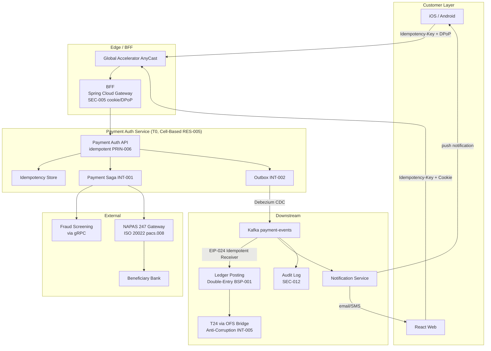
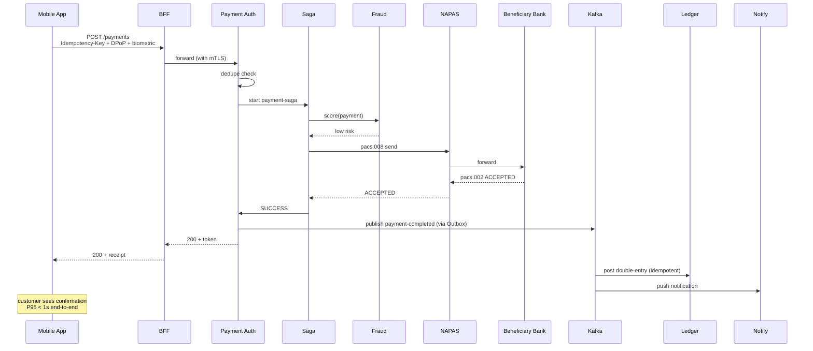

# Real-Time Payments — NAPAS / Instant

Status: Draft | Last Reviewed: 2026-05-09 | Owner: @payments-domain-owner, @ea-board
Catalog ID: REF-002 | Radii (composes spine)
Tier Applicability: T0

## Problem Statement

Real-time inter-bank payments via NAPAS 247 require sub-second customer-facing response, exactly-once settlement, regulatory-grade auditability, and operation 24/7 across both Vietnamese regions. The flow integrates Techcombank's mobile/web clients, the BFF, the payment-auth service, the NAPAS gateway, fraud screening, the ledger, and the customer-notification path. Without a canonical reference architecture, each new payment-flow project re-derives the design — and inevitably gets some piece wrong (idempotency, multi-region replication, fraud-screen back-pressure, settlement-event ordering).

## Context

This is the canonical T0 reference architecture composed from spine + Wave 0 starter-set patterns. Reach for it when:

- Designing any new flow that initiates a NAPAS 247 transfer.
- Modifying the existing flow (e.g., adding a new fraud signal, changing settlement reconciliation cadence).
- Onboarding a new payment-flow engineer.
- Reviewing a DAB submission that touches the payment hot path.

## Solution



### End-to-end timeline (happy path)



### Compensation paths

If NAPAS rejects (`pacs.002 REJECTED`):
- Saga compensates: emits `payment-failed` event; no ledger posting; user notified.

If NAPAS times out (no `pacs.002` within 60 s):
- Saga marks `pending-investigation`; reconciliation job (every 5 min) queries NAPAS status; on definitive answer, forward-or-reverse.

If beneficiary bank later returns `pacs.007 REVERSAL`:
- Reverse-payment saga: ledger posts the inverse (BSP-005 Reversal & Chargeback); customer notified; original `payment_id` traceable.

### Mobile UX

- Customer taps "Confirm" → biometric prompt → BFF receives DPoP-signed request.
- App shows "processing" with ≤ 2 s timeout to a "still working" screen.
- On completion: push notification + in-app receipt.
- On failure: in-app actionable error (insufficient funds, beneficiary unavailable, etc.).

## Implementation Guidelines

### Payment Auth Service — Spring Boot core

```java
@SpringBootApplication
@ServiceTier(value = ServiceTier.Tier.T0,
             rationale = "On NAPAS 247 hot path; SBV Circ. 09 §IV.2",
             catalogRefs = {"NFR-001", "REF-001", "REF-002", "PRIN-006"})
public class PaymentAuthApplication { /* ... */ }

@RestController
@RequestMapping("/payments")
public class PaymentController {

    @PostMapping("/authorise")
    @Idempotent(ttlHours = 24)
    @LatencyBudget(tier = "T0", p50Millis = 200, p95Millis = 1_000, p99Millis = 3_000)
    public ResponseEntity<PaymentResult> authorise(
            @Valid @RequestBody PaymentRequest req,
            @RequestHeader("Idempotency-Key") String idempotencyKey) {
        // Idempotency aspect handles dedupe; this method runs only on first request.
        return ResponseEntity.ok(paymentSaga.start(req, idempotencyKey));
    }
}
```

### Saga — Temporal workflow

```java
@WorkflowInterface
public interface PaymentSaga {
    @WorkflowMethod
    PaymentResult execute(PaymentRequest req);
}

public class PaymentSagaImpl implements PaymentSaga {
    private final FraudActivity fraud = Workflow.newActivityStub(FraudActivity.class);
    private final NapasActivity napas = Workflow.newActivityStub(NapasActivity.class);
    private final OutboxActivity outbox = Workflow.newActivityStub(OutboxActivity.class);

    @Override
    public PaymentResult execute(PaymentRequest req) {
        FraudScore score = fraud.score(req);
        if (score.isHigh()) {
            outbox.publish(new PaymentBlocked(req.id(), "fraud"));
            return PaymentResult.blocked();
        }
        try {
            NapasResponse napasResult = napas.send(req);
            outbox.publish(new PaymentCompleted(req.id(), napasResult));
            return PaymentResult.success(napasResult);
        } catch (NapasRejectedException ex) {
            outbox.publish(new PaymentFailed(req.id(), ex.reason()));
            return PaymentResult.failed(ex.reason());
        } catch (NapasTimeoutException ex) {
            outbox.publish(new PaymentPendingInvestigation(req.id()));
            return PaymentResult.pending();
        }
    }
}
```

### Outbox event schemas (versioned via Schema Registry)

```json
{
  "type": "record",
  "name": "PaymentCompleted",
  "namespace": "vn.techcombank.payments.v1",
  "fields": [
    {"name": "paymentId", "type": "string"},
    {"name": "endToEndId", "type": "string"},
    {"name": "amount", "type": {"type": "fixed", "name": "Amount", "size": 16}},
    {"name": "currency", "type": "string"},
    {"name": "fromAccount", "type": "string"},
    {"name": "toAccountToken", "type": "string"},
    {"name": "completedAt", "type": "long"},
    {"name": "napasReference", "type": "string"}
  ]
}
```

### Ledger consumer (idempotent receiver)

```java
@KafkaListener(topics = "payment-events", groupId = "ledger-poster")
@Transactional
public void apply(PaymentCompleted event,
                  @Header("messageId") String messageId,
                  Acknowledgment ack) {

    if (dedupe.existsById(messageId)) {
        ack.acknowledge();
        return;
    }
    ledger.postDoubleEntry(event);
    dedupe.save(new ProcessedMessage(messageId));
    ack.acknowledge();
}
```

### iOS Swift — payment confirmation

```swift
struct PaymentService {
    let bffClient: BFFClient
    let deviceKey: SecureEnclave.P256.Signing.PrivateKey

    func authorise(_ request: PaymentRequest) async throws -> PaymentResult {
        let idempotencyKey = UUID()
        let dpopProof = try await DeviceKeyManager.makeDpopProof(
            for: bffClient.paymentURL,
            method: "POST",
            key: deviceKey
        )
        return try await bffClient.post(
            path: "/payments/authorise",
            body: request,
            headers: [
                "Idempotency-Key": idempotencyKey.uuidString,
                "DPoP": dpopProof
            ],
            timeoutSeconds: 5
        )
    }
}
```

### Android Kotlin — analogous structure

(Pattern identical: same Idempotency-Key + DPoP signature + 5 s timeout; uses `BiometricPrompt` to unlock the Keystore-bound key; uses `OkHttp` client.)

### React + TypeScript — web flow

```typescript
async function authorisePayment(req: PaymentRequest) {
    return bffPost<PaymentResult>('/payments/authorise', req);
    // BFF handles Idempotency-Key generation, cookie session, CSRF; React doesn't.
}
```

### T24 OFS bridge — ledger posting

The ledger consumer's `ledger.postDoubleEntry()` call invokes the OFS bridge with the same `paymentId` as `OFS_KEY` to ensure T24-side idempotency. Reversals use the same `OFS_KEY` with a reversal indicator.

## Variants & Trade-offs

| Variant | When | Trade-off |
|---|---|---|
| **Sync customer response** (default) | Customer expects immediate confirmation | Tighter latency budget |
| **Async ack + push** | Slow flows (e.g., suspicious-pattern, manual review) | Better UX during fraud holds |
| **Cross-bank instant transfer** (NAPAS 247) | Default | Hard sub-second budget |
| **Same-bank transfer** | Internal | Simpler — no NAPAS leg; ledger-only saga |
| **Scheduled future-dated transfer** | Recurring payments | Kafka-scheduled job; no real-time-payment SLA |

## NFR Acceptance Criteria

```yaml
nfr_acceptance_criteria:
  service_name: payment-auth-service
  tier: T0
  rto_minutes: 5
  rpo_seconds: 0
  availability_target_pct: 99.99
  recovery_topology: multi-region-active-active
  failover_mode: automatic-via-data-plane

  latency:
    p50_ms: 200
    p95_ms: 1000
    p99_ms: 3000
  throughput_target:
    sustained_rps: 5000
    peak_rps: 15000   # Tet eve
  capacity_headroom_pct: 60

  failure_modes:
    - id: FM1
      description: NAPAS unreachable
      detection: circuit-breaker opens
      response: customer-visible "service degraded" + queue for retry
      time_to_detect_seconds: 60
      time_to_recover_seconds: variable (NAPAS-dependent)
    - id: FM2
      description: Region A failure
      detection: regional health-check fail
      response: Global Accelerator failover to Region B
      time_to_detect_seconds: 60
      time_to_recover_seconds: 300
    - id: FM3
      description: Aurora primary loss
      detection: 3 failed health checks
      response: automatic Aurora Global promotion
      time_to_recover_seconds: 60

  blast_radius: single-cell
  cell_count: 3

  catalog_references:
    - {id: NFR-001, reason: "Tier T0"}
    - {id: NFR-002, reason: "P95 latency"}
    - {id: PRIN-006, reason: "Idempotency-Key required"}
    - {id: REF-001, reason: "Multi-region active-active"}
    - {id: SEC-005, reason: "BFF + DPoP auth"}
    - {id: SEC-004, reason: "Card data tokenisation if relevant"}
    - {id: RES-005, reason: "Cell-based blast radius"}
    - {id: EIP-024, reason: "Idempotent ledger consumer"}
    - {id: EIP-025, reason: "DLT for poison events"}
    - {id: INT-001, reason: "Saga orchestration"}
    - {id: INT-002, reason: "Outbox + CDC"}
    - {id: BSP-001, reason: "Double-entry ledger posting"}
    - {id: BSP-002, reason: "Idempotent payment key"}
```

## Compliance Mapping

| Layer | Reference | Section/Control | How this satisfies |
|---|---|---|---|
| Ring 0 | AWS Well-Architected Reliability Pillar | Multi-region active-active | Inherited via REF-001 |
| Ring 0 | EIP §10.1 + §10.5 | Idempotent Receiver + Dead Letter Channel | EIP-024 + EIP-025 in the consumer chain |
| Ring 1 | ISO 20022 — pacs.008 / pacs.002 / pacs.004 / pacs.007 | Payment-clearing message set | NAPAS gateway adapter speaks the canonical message types |
| Ring 1 | Basel BCBS 239 §3 (Timeliness), §6 (Accuracy) | Risk-data aggregation requirements | Idempotent ledger + outbox + sync replication preserve timeliness and accuracy |
| Ring 1 | PCI-DSS 4.0 (where card-funded) | §3 PAN protection; §8 Authentication | SEC-004 tokenisation; SEC-005 BFF auth |
| Ring 2 | SBV Circular 09/2020 §IV ⚠️ (working summary — pending Legal review) | Operational continuity for payments | T0 multi-region active-active + cell-based blast radius |
| Ring 2 | Decree 53/2022 ⚠️ (working summary — pending Legal review) | Data localisation | Both regions in Vietnam; tokens not customer data per [PRIN-007](../principles/data-residency.md) |

## Cost / FinOps Notes

| Component | Order of magnitude / month |
|---|---|
| Multi-region T0 compute (3 cells × 2 regions × 6 replicas) | ~$15–25k |
| Aurora Global (sync replicated) | ~$5–8k |
| Kafka MSK + MirrorMaker | ~$3–5k |
| HSM cluster (PCI-DSS) | ~$5–10k |
| NAPAS connection charges | per-bank arrangement |
| Cross-region egress | proportional to message rate |

**Levers**:
- Reserved instances for steady-state compute.
- Cache fraud-score for repeat low-value transactions (60 s TTL).
- Coalesce settlement events into batches at NAPAS gateway when permitted by spec.

**Cost of NOT having this canonical architecture**: each payment-flow project re-derives, gets some piece wrong, produces an incident → reconciliation work + customer-trust impact.

## Threat Model Summary

STRIDE: full-spectrum, primary concerns:

- **Top 3 threats addressed**:
  1. *Double-payment* on retry (Tampering) — eliminated by PRIN-006 + EIP-024 + ledger idempotency at OFS bridge.
  2. *Fraud / account takeover* (Spoofing) — fraud screening saga step + SEC-005 device-binding + biometric.
  3. *Single-region outage during peak* — multi-region active-active + cell-based blast radius.
- **Top 3 residual threats**:
  1. *NAPAS-side error or outage* (Denial of Service) — outside our control; mitigation: graceful degradation, customer-facing "service degraded" UX, queue-and-retry.
  2. *Insider with both BFF and HSM access* — mitigation: separation of duties; tamper-evident audit.
  3. *Sophisticated client compromise* (root, malware) — mitigation: device-attestation; behavioural anomaly detection on unusual transaction patterns.

## Operational Runbook

- **Alerts**:
  - Alert: NAPASPaymentProcessingLatencyHigh — `NAPAS_CircuitOpen`: CB to NAPAS gateway open. Severity: Critical (page payments-domain-owner).
  - `Payment_AuthRate_Anomaly`: rate of declined / failed payments > 3× baseline. Severity: High.
  - `Saga_Pending_Backlog`: pending-investigation queue depth > 100. Severity: Critical.
  - `Ledger_Lag`: ledger consumer lag > 5 s on payment-events topic. Severity: Critical.
  - `DLT_PaymentEvents`: payment-events DLT depth > 0 unaddressed for > 1 h. Severity: Critical.
- **Dashboards**: Grafana folder `payments-T0` with: auth rate, latency P95/P99, fraud-block rate, NAPAS RTT, ledger lag, DLT depth, per-cell health.
- **Standard incidents** (preconfigured response runbooks): NAPAS outage; Aurora primary failure; fraud-service degradation; mass DLT spike.
- **War-room procedure**: triggered automatically on `Payment_AuthRate_Anomaly` Critical; convenes payments-domain-owner + SRE Lead + on-call EA-Board.

## Test Strategy

- **Unit**: each saga step + compensation; idempotency-key validation; outbox-write atomicity.
- **Integration**: Testcontainer Kafka + Aurora + Temporal; happy-path; each FM scenario.
- **Contract**: schema-registry compatibility on payment-events versions.
- **Performance**: load test at peak (15k RPS) for 30 min; measure P95/P99; verify cell-balance.
- **Chaos** (BP-005): monthly cell-drain; quarterly NAPAS-circuit drill; quarterly regional failover drill; annual full game-day.
- **DR drill** (BP-002): quarterly Aurora failover; reconcile ledger state after.
- **Penetration test**: annual; covers DPoP-replay, idempotency abuse, fraud-bypass, etc.

## When to Use

- **The canonical** flow for any new NAPAS 247 payment initiation.
- **Reference baseline** for any existing payment-flow modernisation.

## When NOT to Use

- Same-bank transfers within Techcombank (use a simpler internal-saga variant — no NAPAS leg).
- Future-dated / scheduled transfers (use a queueing variant — no real-time SLA).
- Card-network flows ([REF-004 Card Authorization 3DS2](card-authorization-3ds2.md) is the canonical for those).

## Related Patterns

- All 6 spine docs: NFR-001, NFR-002, PRIN-006, TPL-001, COMP-001, REF-001
- [SEC-004 Tokenization + HSM](../patterns/security/tokenization-hsm.md), [SEC-005 BFF + Token-Binding](../patterns/security/bff-token-binding.md)
- [INT-001 Saga](../patterns/integration/saga-orchestration.md), [INT-002 Outbox+CDC](../patterns/integration/cdc-outbox-pattern.md), [INT-005 Anti-Corruption Layer](../patterns/integration/anti-corruption-layer.md)
- [EIP-024 Idempotent Receiver](../patterns/eip/idempotent-receiver.md), [EIP-025 DLC](../patterns/eip/dead-letter-channel.md), [EIP-023 Guaranteed Delivery](../patterns/eip/guaranteed-delivery.md)
- [RES-002 Circuit Breaker](../patterns/resilience/circuit-breaker.md), [RES-005 Cell-Based](../patterns/resilience/cell-based-architecture.md), [RES-006 Timeout Budget](../patterns/resilience/timeout-budget.md)
- [BSP-001 Double-Entry Ledger](../patterns/banking-solutions/double-entry-ledger.md), [BSP-002 Idempotent Payment Key](../patterns/banking-solutions/idempotent-payment-key.md), [BSP-005 Reversal/Chargeback](../patterns/banking-solutions/reversal-and-chargeback.md)
- [BP-005 Chaos Engineering](../best-practices/chaos-engineering.md), [BP-007 Golden Signals](../best-practices/golden-signals-sre.md)

## References

- ISO 20022 message-set documentation (pacs domain)
- NAPAS public payment-products documentation
- Spring Cloud Gateway, Temporal, Debezium documentation
- `_research-notes.md` §ISO20022 §NAPAS §EIP §AWS

---

**Key Takeaway**: T0 NAPAS payment flow = idempotent BFF API + Temporal saga + outbox + Kafka events + idempotent ledger consumer + cell-based blast radius + multi-region active-active. Compose it from spine + Wave-0 patterns; don't redesign.
