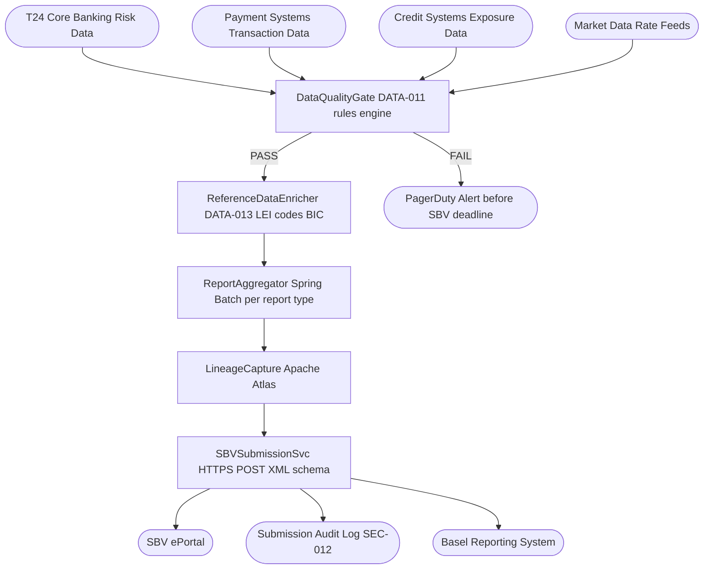

# Regulatory Reporting

Status: Draft | Last Reviewed: 2026-05-16 | Owner: @head-of-compliance
Catalog ID: REF-008 | Radii
Tier Applicability: T1

## Problem Statement

- SBV requires daily prudential reports (liquidity ratio, capital adequacy, credit concentration) submitted by 09:00 the next business day; manual report assembly from multiple source systems routinely misses the deadline when any source is late, creating regulatory breach risk.
- BCBS 239 requires a documented, auditable data lineage from each risk number in a report back to the source transaction; without a lineage-tracked data pipeline, a regulator can challenge the accuracy of reported figures and the bank cannot respond with evidence within the required 24-hour window.
- Report figures calculated by different teams using slightly different SQL queries produce inconsistent numbers; the CCAR/DFAST reconciliation exercise reveals discrepancies of 0.5–2% between independently-computed capital ratios, which must be explained in regulatory submissions.
- Current report generation is procedural SQL scripts maintained by the compliance team without version control, test coverage, or automated quality gates; a script error introduced during quarter-end maintenance caused a restatement filing in the previous year.
- The SBV ePortal submission API requires authenticated HTTPS POST with a specific XML schema; manual upload via browser UI creates an auditable gap — the submission event is not machine-readable and cannot trigger downstream alerts on submission failure.

## Context

Regulatory reporting aggregates data from core banking (T24), payment systems, credit systems, and market data feeds into a set of standard reports: SBV Circular 22/2019 prudential ratios, BCBS 239 risk data aggregation, Basel III capital reports, and AML transaction monitoring reports. This architecture covers the batch pipeline. Real-time regulatory notifications (e.g., large transaction reporting) are handled separately by REF-002/REF-005.

## Solution

A Spring Batch pipeline orchestrated by Apache Airflow (DAG-per-report) extracts from source systems, applies data quality rules (DATA-011), enriches with reference data (DATA-013), produces report-specific aggregations, validates against regulatory thresholds, and submits to the SBV ePortal. Apache Atlas provides data lineage from source to submitted figure. Failed quality gates halt submission and trigger PagerDuty alert before the SBV deadline.



## Implementation Guidelines

### 1. Spring Batch Report Job — Capital Adequacy

```java
@Configuration
@RequiredArgsConstructor
public class CapitalAdequacyReportJob {

    private final JobBuilderFactory jobBuilderFactory;
    private final StepBuilderFactory stepBuilderFactory;
    private final DataSource reportingDataSource;

    @Bean
    public Job capitalAdequacyJob() {
        return jobBuilderFactory.get("capitalAdequacyReport")
            .start(extractRwaStep())
            .next(calculateRatioStep())
            .next(validateThresholdStep())
            .next(submitToSbvStep())
            .build();
    }

    @Bean
    public Step validateThresholdStep() {
        return stepBuilderFactory.get("validateThreshold")
            .<CapitalRatio, CapitalRatio>chunk(1)
            .reader(capitalRatioReader())
            .processor(item -> {
                if (item.car().compareTo(BigDecimal.valueOf(0.08)) < 0) {
                    throw new RegBreachException("CAR below 8%: " + item.car());
                }
                return item;
            })
            .writer(ratioWriter())
            .build();
    }
}
```

### 2. SBV ePortal Submission — Authenticated XML POST

```java
@Service
@RequiredArgsConstructor
public class SbvSubmissionService {

    private final RestTemplate sbvRestTemplate; // mTLS configured via Vault cert
    private final AuditPublisher auditPublisher;

    @Value("${sbv.eportal.url}")
    private String eportalUrl;

    public void submit(ReportPayload payload) {
        String xml = payload.toSbvXml();
        HttpHeaders headers = new HttpHeaders();
        headers.setContentType(MediaType.APPLICATION_XML);
        headers.set("X-Report-Period", payload.reportingPeriod());

        ResponseEntity<String> response = sbvRestTemplate.exchange(
            eportalUrl + "/submit",
            HttpMethod.POST,
            new HttpEntity<>(xml, headers),
            String.class);

        if (!response.getStatusCode().is2xxSuccessful()) {
            throw new SubmissionFailedException(response.getStatusCode().toString());
        }

        auditPublisher.publishSubmission(SubmissionAuditEvent.builder()
            .reportType(payload.reportType())
            .reportingPeriod(payload.reportingPeriod())
            .submittedAt(Instant.now())
            .sbvAckReference(extractAckRef(response.getBody()))
            .build());
    }
}
```

### 3. Data Quality Gate — DATA-011 Rules

```java
@Component
@RequiredArgsConstructor
public class DataQualityGate {

    private final DataQualityRulesEngine rulesEngine;
    private final AlertService alertService;

    public ValidationResult validate(ReportDataset dataset) {
        List<QualityViolation> violations = rulesEngine.evaluate(dataset);

        if (!violations.isEmpty()) {
            alertService.fireCritical("regulatory_data_quality_failure",
                Map.of("reportType", dataset.reportType(),
                       "violations", violations.size(),
                       "deadline", dataset.sbvDeadline()));
            return ValidationResult.failed(violations);
        }
        return ValidationResult.passed();
    }
}
```

## When to Use

- Daily, monthly, and quarterly regulatory report submission to SBV, BIS, and Basel reporting systems requiring automated quality gates and machine-readable audit trails.
- BCBS 239 risk data aggregation where end-to-end data lineage from source transaction to submitted figure must be provable during regulatory examination.
- Replacing manual SQL-script-based report generation with a version-controlled, tested Spring Batch pipeline with automated SBV ePortal submission.

## When Not to Use

- Real-time large-transaction reporting (>VND 300M single transaction) — use the REF-002/REF-005 pipeline which has the sub-minute reporting requirement; this architecture is batch-only.
- AML suspicious transaction reports (STRs) — STRs require investigator workflow and FIU submission format; use a case management system integrated with this pipeline's data, not the pipeline itself.
- Ad-hoc management reporting (dashboards, internal analytics) — use a separate data warehouse and BI layer; this pipeline is for regulatory submissions with strict schema and deadline requirements.

## Variants

| Variant | Use when | Trade-off |
|---------|----------|-----------|
| Batch daily pipeline with Airflow (this pattern) | Standard SBV daily reports; data latency T+1 acceptable | T+1 latency; Airflow adds operational overhead but provides retry/alert/lineage |
| Near-real-time streaming (Kafka + Flink) | Reports requiring intraday snapshots; stress testing data | Higher infrastructure cost; model complexity; required for Basel Intraday Liquidity reports |
| Manual with automated validation | Low-frequency annual reports (ICAAP, SREP) | Lower automation investment justified by report frequency; quality gate still required |

## NFR Acceptance Criteria

| Metric | Threshold | Measurement |
|--------|-----------|-------------|
| Report generation completion time | 4 h from EOD data availability to SBV submission | Airflow DAG duration metric; assert completion before SBV 09:00 deadline |
| Data quality pass rate | 99.5% of daily runs complete without quality gate failure | Weekly metric: failed quality gate runs / total runs |
| Submission audit trail completeness | 100% of submissions have SBV ACK reference in audit log | Query `submission_audit_log` after each run; assert ACK present |
| Lineage coverage | 100% of report figures traceable to source table in Apache Atlas | Atlas lineage API: assert each report column maps to source table |
| Availability | T1 — 99.9% (report failure triggers PagerDuty before SBV deadline) | Alert fires if Airflow DAG fails or misses schedule by > 30 min |
| RTO | 2 h (Spring Batch job failure + retry from last checkpoint) | Chaos: kill batch job mid-run; measure time to successful completion from checkpoint |

## Compliance Mapping

| Ring | Regulation | Provision | How this architecture satisfies |
|------|-----------|-----------|--------------------------------|
| Ring 0 | ISO 27001 | A.12.1.2 — Change Management: regulatory scripts must be version-controlled and tested | Report jobs in Git with automated test suite; promoted via CI/CD pipeline; no ad-hoc SQL edits to production report jobs permitted. |
| Ring 1 | BCBS 239 | Principle 3 — Accuracy: data used in risk reports must be accurate and complete; Principle 6 — Adaptability: reports must be producible on ad-hoc basis | DATA-011 quality gate enforces completeness and accuracy thresholds before submission; Apache Atlas lineage proves data provenance; ad-hoc report re-run capability via Airflow manual trigger. |
| Ring 2 | SBV Circular 09/2020 | §V — Reporting obligations: credit institutions must submit prudential reports within SBV-specified deadlines ⚠️ (working summary — pending Legal review) | Airflow DAG enforces submission deadline SLA; PagerDuty alert fires 2h before deadline on quality gate failure; SBV ePortal submission is fully automated with machine-readable ACK captured in audit log; Legal review required to confirm report format and submission endpoint satisfy current SBV Circular 09/2020 §V requirements. |

## Cost / FinOps

- Apache Airflow: 1 scheduler + 3 worker pods; ~USD 150/month on Kubernetes. Shared across all reporting DAGs.
- Spring Batch executor: ephemeral Kubernetes Job per report run; spin up on schedule, terminate after completion. No always-on cost.
- Apache Atlas: 2-node cluster for lineage graph; ~USD 200/month on `m5.large`. Shared with DATA-009 Data Lineage.
- SBV ePortal mTLS certificate: issued by Vault PKI (SEC-003); no additional cost.
- Cost of non-compliance: SBV late-submission fine (VND 50–100 million per occurrence) + reputational cost of regulatory breach; automated submission pays for itself after first prevented breach.

## Threat Model

- **Data tampering before submission (Tampering)**: A user with database write access modifies source data after the quality gate passes but before the report is submitted, causing the submitted figures to differ from the audited source data. Mitigation: Quality gate computes and stores a SHA-256 hash of the validated dataset; SbvSubmissionService recomputes the hash before submission and rejects if it differs; all post-gate modifications are captured in the immutable audit log (SEC-012).
- **SBV ePortal credential theft (Spoofing)**: Attacker obtains the mTLS client certificate used to authenticate to the SBV ePortal, enabling fraudulent submissions. Mitigation: Client certificate stored in Vault (SEC-003) with per-deployment TTL of 1 day; Vault audit log captures every certificate issuance; SBV ePortal submission IP whitelisted to Techcombank's egress IP range.

## Operational Runbook Stub

**Alert: `regulatory_report_quality_gate_failure`**
- p50 baseline: never fires | p99 SLO: N/A
- Remediation: CRITICAL — fire immediately, SBV deadline at risk. (1) Identify failing report: Airflow UI → DAG run → failed step. (2) Check quality violations: `SELECT * FROM quality_violations WHERE run_id = '<run_id>'`. (3) If violation is a data source late arrival: check source system connectivity; trigger manual re-extract. (4) If violation is a genuine data error: escalate to data owner; do not submit until resolved. (5) If resolution takes > 2h before SBV deadline: notify Compliance team for manual SBV communication.

**Alert: `sbv_submission_failure`**
- p50 baseline: never fires | p99 SLO: N/A
- Remediation: CRITICAL. (1) Check SBV ePortal status page. (2) Check mTLS certificate validity: `vault pki issue techcombank-pki roles/sbv-client`. (3) Retry submission: Airflow task re-run. (4) If ePortal is down past 08:00, notify Compliance team to manually upload via browser and capture the submission reference number in the audit log.

## Test Strategy Stub

- **Unit**: `DataQualityGateTest` — dataset with CAR < 8% asserts `ValidationResult.failed` and `alertService.fireCritical` called; valid dataset asserts `ValidationResult.passed`.
- **Unit**: `SbvSubmissionServiceTest` — mock RestTemplate returning 200 asserts `auditPublisher.publishSubmission` called with ACK reference; mock returning 500 asserts `SubmissionFailedException`.
- **Integration**: Spring Batch integration test with H2 + WireMock (SBV ePortal): run full job, assert XML POST sent, assert ACK in audit table. Inject quality violation, assert job halted before submission step.
- **Compliance**: BCBS 239 adaptability — trigger ad-hoc report re-run via Airflow API for prior reporting period, assert successful completion within 4h. SBV deadline SLA — simulate quality gate failure at T-3h, assert PagerDuty alert fires within 5 min.

## Related Patterns

- [COMP-005 BCBS 239](../compliance/basel-bcbs-239.md)
- [DATA-009 Data Lineage](../patterns/data/data-lineage.md)
- [DATA-011 Data Quality Rules](../patterns/data/data-quality-rules.md)
- [BSP-004 End-of-Day Batch Window](../patterns/banking-solutions/end-of-day-batch-window.md)
- [SEC-012 Tamper-Evident Audit Logging](../patterns/security/audit-logging-tamper-evident.md)

## References

- [BCBS 239 — Principles for Effective Risk Data Aggregation and Reporting](https://www.bis.org/publ/bcbs239.htm)
- [SBV Circular 22/2019/TT-NHNN — Prudential Ratios for Credit Institutions](https://thuvienphapluat.vn/van-ban/Tien-te-ngan-hang/Thong-tu-22-2019-TT-NHNN)
- [Spring Batch Reference Documentation](https://docs.spring.io/spring-batch/docs/current/reference/html/)
- [Apache Atlas Data Governance](https://atlas.apache.org/)
- [Apache Airflow Documentation](https://airflow.apache.org/docs/)
- Catalog reference: `governance/standards/enterprise-architecture-catalog.md`
