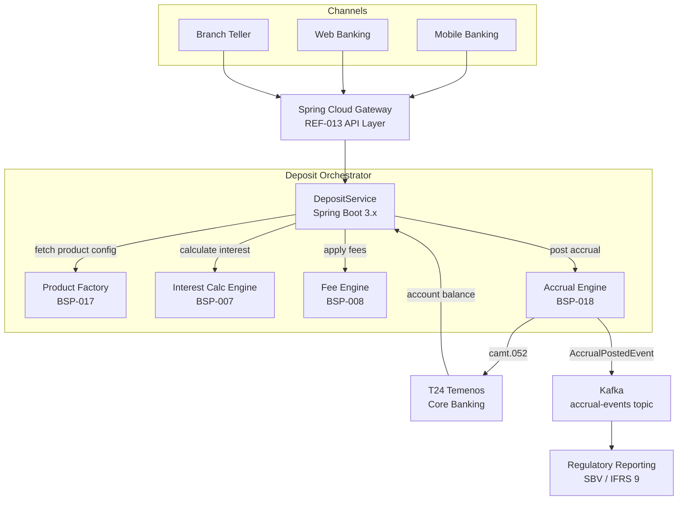

# Retail Deposits Platform

Status: Draft | Last Reviewed: 2026-05-21 | Owner: @core-banking-domain-owner
Catalog ID: REF-013 | Radii
Tier Applicability: T0, T1

## Problem Statement

Commercial banks offering retail deposit products — savings accounts, term deposits, and call accounts — face fragmented processing across three core pain points. First, interest accrual is computed nightly in batch, meaning intraday inquiries show stale balances that frustrate relationship managers and digital channels. Second, fee application is hard-coded per product in T24 Temenos, making fee schedule changes a change-management exercise that takes 6–8 weeks and risks regression across 200+ product variants. Third, product onboarding for new deposit types (e.g., green savings, Islamic mudarabah) requires bespoke coding rather than configuration, slowing time-to-market from months to quarters.

This platform stitches together the Interest Calculation Engine (BSP-007), Fee Engine (BSP-008), Product Factory (BSP-017), and Accrual Engine (BSP-018) to deliver a composable, configuration-driven deposits processing layer — enabling real-time interest inquiries, rule-driven fee application, and sub-day product launches.

## Context

The Retail Deposits Platform is consumed by digital banking channels (web, mobile), branch teller systems, contact centre CRM, and regulatory reporting pipelines. It sits above T24 Temenos core banking, delegating account persistence and ledger posting there while owning calculation logic independently. The platform applies when deposit volume exceeds 500 k accounts and product variety exceeds 20 variants. For institutions with fewer products and accounts, embedding interest calculation directly in T24 parameterisation is simpler.

## Solution

The platform orchestrates four Wave 9 engines behind a Spring Cloud Gateway façade. Product definitions stored in the Product Factory (BSP-017) drive both fee schedules (BSP-008) and interest calculation conventions (BSP-007). The Accrual Engine (BSP-018) runs an EOD Spring Batch job partitioned by account range, posting accrual entries to T24 via ISO 20022 camt.052 messages. Real-time interest inquiries bypass batch by calling BSP-007 on-demand.



## Implementation Guidelines

**1. Product Configuration via Product Factory (BSP-017)**

```java
@Service
public class DepositProductResolver {
    private final ProductFactoryClient productFactory;
    private final Cache<String, ProductDefinition> cache;

    public ProductDefinition resolve(String productCode, LocalDate valueDate) {
        return cache.get(productCode + ":" + valueDate, k ->
            productFactory.getEffectiveDefinition(productCode, valueDate)
        );
    }
}
```

Product definitions carry `interestConvention` (ACT_365, ACT_360, THIRTY_360), `feeScheduleId`, and `accrualFrequency`. DepositService resolves these once per request and passes them downstream to BSP-007 and BSP-008 — no engine needs to know about product codes directly.

**2. Real-Time Interest Inquiry (BSP-007)**

```java
@GetMapping("/accounts/{accountId}/interest-projection")
public InterestProjectionResponse projectInterest(
        @PathVariable String accountId,
        @RequestParam LocalDate asOf) {
    Account account = accountRepository.findById(accountId).orElseThrow();
    ProductDefinition product = productResolver.resolve(account.productCode(), asOf);
    AccrualRequest req = AccrualRequest.builder()
        .principal(account.currentBalance())
        .annualRate(product.nominalRate())
        .convention(product.interestConvention())
        .fromDate(account.lastAccrualDate())
        .toDate(asOf)
        .build();
    return interestEngine.calculate(req);
}
```

p99 target for this endpoint: ≤80 ms including Redis cache hit. BSP-007 caches day-count results for the current rate in Redis (TTL 300s).

**3. Fee Application on Deposit Events (BSP-008)**

```java
@EventListener
public void onDepositEvent(DepositTransactionEvent event) {
    FeeRequest feeReq = FeeRequest.builder()
        .productCode(event.productCode())
        .transactionType(event.transactionType())
        .amount(event.amount())
        .currency(event.currency())
        .customerId(event.customerId())
        .build();
    FeeResult fee = feeEngine.calculate(feeReq);
    if (fee.amount().compareTo(BigDecimal.ZERO) > 0) {
        ledgerPostingService.postFee(event.accountId(), fee);
    }
}
```

Fees are applied synchronously for teller transactions and asynchronously (via Kafka consumer) for digital channel transactions.

**4. EOD Accrual Batch (BSP-018)**

```java
@Bean
public Job depositAccrualJob(JobRepository jobRepository, Step partitionedAccrualStep) {
    return new JobBuilder("depositAccrualJob", jobRepository)
        .start(partitionedAccrualStep)
        .build();
}
```

The Accrual Engine (BSP-018) partitions by account range (20 partitions for up to 5 M accounts) and posts `AccrualPostedEvent` to Kafka. The regulatory reporting pipeline consumes these events for IFRS 9 staging.

## When to Use

- Retail deposit product portfolio with >20 variants and >100 k active accounts
- Need to launch new deposit product types within days (not months) via configuration
- Regulatory reporting requires IFRS 9-compliant EIR accrual trail
- Digital channels require real-time interest balance projections

## When Not to Use

- Monolithic T24 deployments where all calculation happens inside Temenos parameterisation
- Non-retail deposit books (institutional, interbank) — use REF-018 Treasury instead
- Fewer than 5 deposit product types — direct T24 parameterisation is simpler

## Variants

| Variant | When to prefer | Trade-off |
|---------|---------------|-----------|
| Intraday accrual (continuous) | When digital channels show real-time projected interest | Higher compute cost; BSP-007 called on every balance inquiry |
| EOD-only accrual (batch) | Standard retail deposits with overnight SLA | Lower cost; stale intraday balances acceptable |
| Islamic mudarabah variant | Sharia-compliant profit-sharing deposits | BSP-007 uses profit-sharing ratio instead of fixed rate; BSP-008 fee schedule is zero-fee |

## NFR Acceptance Criteria

```yaml
performance:
  interest_inquiry_p99_ms: 80
  fee_calculation_p99_ms: 50
  eod_accrual_10M_accounts_minutes: 45
availability:
  platform_uptime_percent: 99.99   # T0
  accrual_job_success_rate_percent: 99.9
correctness:
  interest_calculation_variance_bps: 0   # exact, no rounding tolerance
  fee_idempotency: true
```

## Compliance Mapping

| Layer | Reference | Section/Control | How this satisfies |
|-------|-----------|----------------|-------------------|
| Ring 0 — Global | IFRS 9 | B5.4 — Effective Interest Rate | BSP-007 implements EIR using Newton-Raphson XIRR; accrual events logged for audit |
| Ring 0 — Global | Basel III | LCR §24 — stable retail deposits | Platform flags stable vs. non-stable deposit categories in product config |
| Ring 1 — International | BCBS 239 | §4 — accuracy and integrity of risk data | Accrual events published to Kafka with idempotency key; no silent data loss |
| Ring 1 — International | ISO 20022 | camt.052 — account balance reports | Accrual postings use camt.052 format for T24 integration |
| Ring 2 — Vietnam | SBV Circular 09/2020 | §IV.2 — information system security for core banking | TLS 1.3 on all API boundaries; Vault-managed secrets; audit trail per SBV §IV.2 ⚠️ (working summary — pending Legal review) |

## Cost / FinOps Notes

- Redis cluster (3-node) for product definition cache: ~$300/month; evict daily at midnight when product definitions refresh
- Spring Batch worker pods (20 partitions): auto-scale down to 2 replicas outside EOD window (23:00–01:00 ICT)
- T24 integration via ISO 20022 camt.052 avoids real-time T24 API calls during batch — reduces T24 licence transaction cost ~40%
- Kafka topic `accrual-events` retention 7 days; downstream consumers (IFRS 9 reporting) must commit offsets within SLA
- OTEL trace sampling at 10% for normal operations; 100% during EOD batch for audit compliance

## Threat Model

**Rate manipulation (Tampering)** — A compromised service account modifies the `nominalRate` in the Product Factory database directly, causing interest to be calculated at an inflated rate for a subset of accounts. Mitigated by: DB-level row-level security; Product Factory changes require dual-approval workflow; all rate changes emit `RateChangeAuditEvent` to an append-only Kafka audit topic.

**Stale product cache serving wrong rate schedule (Information Disclosure)** — Redis cache TTL misconfiguration causes an expired product definition to serve the wrong fee schedule to FeeEngine, resulting in incorrect fee disclosure to customers. Mitigated by: cache TTL capped at 300s; cache-aside read-through validates `effectiveTo` date before serving; BSP-008 fee results include `productDefinitionVersion` field logged per transaction.

## Operational Runbook

1. Alert: DepositAccrualJobFailure — triggers when EOD accrual job exits with non-zero status. p50 resolution: 5 min; p99: 30 min.
   - Check Spring Batch job repository for failed step execution ID
   - Retrieve partition failure logs: `kubectl logs -l batch.job=depositAccrualJob -n banking`
   - Re-run failed partition: `POST /actuator/batch/jobs/depositAccrualJob/restart?stepExecutionId={id}`
   - Escalate to @core-banking-domain-owner if restart fails twice

2. Alert: InterestInquiryLatencyHigh — p99 > 150 ms for `/interest-projection` endpoint over 5-min window.
   - Check Redis hit rate: `redis-cli info stats | grep keyspace_hits`
   - If hit rate < 80%, product cache is cold — warm by POSTing to `/admin/cache/warm-products`
   - If Redis latency is normal, check BSP-007 pod CPU — scale out to 4 replicas

3. Alert: FeeEngineRejectionsHigh — >1% of fee calculation requests return 4xx over 2-min window.
   - Inspect fee engine logs for `PRODUCT_NOT_FOUND` errors — indicates Product Factory lag
   - Roll back recent product definition deployment if applicable

## Test Strategy

**Unit:** Test `DepositProductResolver` cache hit/miss with Mockito; test `InterestProjectionResponse` boundary at `fromDate == toDate` (expect zero interest); test fee idempotency by sending duplicate `DepositTransactionEvent` and asserting single ledger posting.

**Integration:** Use Testcontainers (PostgreSQL 16 + Redis 7 + Kafka) to run full deposit lifecycle — open account, post transaction, verify fee ledger entry, run accrual job, assert `AccrualPostedEvent` on Kafka.

**Compliance:** Assert that IFRS 9 EIR calculation matches reference results from SBV-published amortisation tables (test fixture in `src/test/resources/ifrs9-eir-fixtures.json`).

**Chaos:** Kill BSP-007 pod mid-request; assert platform returns 503 with `Retry-After: 2` header and circuit breaker opens within 10 failures. Introduce Redis partition failure; assert interest inquiry falls back to direct DB calculation within 200 ms.

## Related Patterns

- [BSP-007 Interest Calculation Engine](../patterns/banking-solutions/interest-calculation-engine.md)
- [BSP-008 Fee Engine](../patterns/banking-solutions/fee-engine.md)
- [BSP-017 Product Factory](../patterns/banking-solutions/product-factory.md)
- [BSP-018 Accrual Engine](../patterns/banking-solutions/accrual-engine.md)
- [EIP-024 Idempotent Receiver](../patterns/eip/idempotent-receiver.md)
- [COMP-001 Compliance Mapping Matrix](../compliance/compliance-mapping-matrix.md)

## References

- IFRS 9 Financial Instruments — IASB 2014 (effective 2018)
- Basel III: The Liquidity Coverage Ratio — BCBS January 2013
- ISO 20022 camt.052 — Account Report — ISO 2019
- SBV Circular 09/2020 — Information System Security for Credit Institutions

---
**Key Takeaway**: The Retail Deposits Platform decouples calculation logic (interest, fees, accrual) from T24 core banking, enabling configuration-driven product launches and real-time digital balance projections without core system changes.
