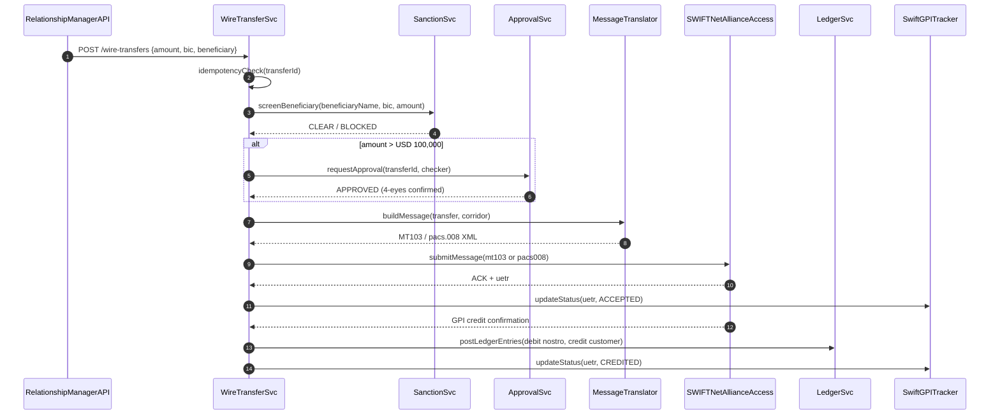

# SWIFT MT/MX Wire Transfer

Status: Draft | Last Reviewed: 2026-05-16 | Owner: @payments-domain-owner
Catalog ID: REF-005 | Radii
Tier Applicability: T0

## Problem Statement

- SWIFT MT103 messages are plain-text flat files with no native idempotency key; a network retry from the correspondent bank or the SWIFT interface processor creates a duplicate payment unless the wire transfer service implements its own deduplication.
- ISO 20022 MX migration (deadline 2025) requires parallel support for MT103 (legacy corridor) and pacs.008 (ISO 20022); without a translation layer, separate code paths diverge, causing inconsistent sanction-screening and audit-trail coverage between the two message formats.
- Cross-border payments require real-time sanctions screening against OFAC/UN/MAS lists and SBV-mandated beneficial-owner checking; a sync sanctions check on the T0 hot path imposes unacceptable latency unless the screening result is cached and the cache invalidation strategy is auditable.
- 4-eyes approval for high-value transfers (>USD 100,000 or VND equivalent) must be enforced before the message reaches SWIFTNet; approvals made outside the payment system leave no machine-readable audit trail that can satisfy SWIFT CSP Control 1.2.
- SWIFTNet GPI tracker must be updated at each transfer lifecycle event (accepted, processed, credited); failure to update GPI status within the SLA exposes the bank to GPI non-compliance findings during SWIFT self-attestation.

## Context

This architecture covers all outgoing SWIFT wire transfers originating from Techcombank: corporate treasury payments, correspondent-bank nostro funding, and retail international remittance via the SWIFT corridor. It composes: sanctions screening (BSP-003), 4-eyes ABAC approval (SEC-010), ISO 20022 translation (COMP-007), SWIFT CSP controls (COMP-008), and double-entry ledger posting (BSP-001). The SWIFTNet Alliance Access gateway is on-premise; the translation and orchestration services are cloud-hosted Spring Boot microservices on Kubernetes.

## Solution

Wire transfers flow through a five-stage pipeline: (1) intake and idempotency check, (2) sanctions pre-screening, (3) 4-eyes approval for high-value, (4) message construction (MT103 or pacs.008 depending on corridor), (5) SWIFTNet submission and GPI status tracking. Async confirmation updates the ledger and triggers customer notification. The message format adapter is an Apache Camel route with a content-based router that selects the MT103 or pacs.008 template based on the receiving BIC's registered format.



## Implementation Guidelines

### 1. WireTransferSvc — Spring Boot Orchestrator

```java
@Service
@RequiredArgsConstructor
public class WireTransferOrchestrator {

    private final SanctionClient sanctionClient;
    private final ApprovalService approvalService;
    private final MessageTranslatorClient translatorClient;
    private final SwiftGatewayClient swiftClient;
    private final LedgerClient ledgerClient;
    private final WireTransferRepository repo;

    @Transactional
    public WireTransferResult initiateTransfer(WireTransferRequest req) {
        if (repo.existsByTransferId(req.transferId())) {
            return repo.findByTransferId(req.transferId()).toResult();
        }

        SanctionResult sanction = sanctionClient.screen(
            req.beneficiaryName(), req.receivingBic(), req.amount());
        if (sanction.isBlocked()) {
            throw new SanctionBlockedException(req.transferId(), sanction.matchedList());
        }

        if (req.amountUsd().compareTo(BigDecimal.valueOf(100_000)) > 0) {
            approvalService.requireApproval(req.transferId(), req.requesterId());
        }

        String corridor = swiftClient.resolveCorridor(req.receivingBic());
        String rawMessage = translatorClient.build(req, corridor);

        SwiftAck ack = swiftClient.submit(rawMessage);
        repo.save(WireTransfer.fromRequest(req, ack.uetr(), TransferStatus.SUBMITTED));
        return WireTransferResult.submitted(ack.uetr());
    }
}
```

### 2. Apache Camel — MT103 / pacs.008 Content-Based Router

```java
@Component
public class MessageTranslatorRoute extends RouteBuilder {

    @Override
    public void configure() {
        from("direct:build-message")
            .choice()
                .when(header("corridor").isEqualTo("MT"))
                    .to("direct:build-mt103")
                .otherwise()
                    .to("direct:build-pacs008")
            .end();

        from("direct:build-mt103")
            .bean(Mt103Builder.class, "build");

        from("direct:build-pacs008")
            .bean(Pacs008Builder.class, "build");
    }
}

@Component
public class Pacs008Builder {
    public String build(@Body WireTransferRequest req) {
        return """
            <Document xmlns="urn:iso:std:iso:20022:tech:xsd:pacs.008.001.10">
              <FIToFICstmrCdtTrf>
                <GrpHdr>
                  <MsgId>%s</MsgId>
                  <CreDtTm>%s</CreDtTm>
                  <NbOfTxs>1</NbOfTxs>
                  <TtlIntrBkSttlmAmt Ccy="%s">%s</TtlIntrBkSttlmAmt>
                </GrpHdr>
                <CdtTrfTxInf>
                  <PmtId><EndToEndId>%s</EndToEndId><UETR>%s</UETR></PmtId>
                  <Amt><IntrBkSttlmAmt Ccy="%s">%s</IntrBkSttlmAmt></Amt>
                  <CdtrAgt><FinInstnId><BICFI>%s</BICFI></FinInstnId></CdtrAgt>
                  <Cdtr><Nm>%s</Nm></Cdtr>
                </CdtTrfTxInf>
              </FIToFICstmrCdtTrf>
            </Document>
            """.formatted(
                req.transferId(), Instant.now(), req.currency(), req.amount(),
                req.transferId(), UUID.randomUUID(), req.currency(), req.amount(),
                req.receivingBic(), req.beneficiaryName());
    }
}
```

### 3. GPI Status Update — async after SWIFTNet confirmation

```java
@KafkaListener(topics = "swift.gpi.confirmations", groupId = "wire-svc")
public void onGpiConfirmation(GpiConfirmationEvent event) {
    WireTransfer transfer = repo.findByUetr(event.uetr())
        .orElseThrow(() -> new IllegalStateException("Unknown UETR: " + event.uetr()));

    ledgerClient.postEntries(LedgerPostingRequest.builder()
        .debitAccount(transfer.nostroAccount())
        .creditAccount(transfer.customerAccount())
        .amount(transfer.amount())
        .currency(transfer.currency())
        .transactionId(transfer.transferId())
        .build());

    transfer.updateStatus(TransferStatus.CREDITED);
    repo.save(transfer);
    gpiClient.updateStatus(event.uetr(), "CREDITED");
}
```

## When to Use

- Initiating outgoing SWIFT wire transfers (MT103 legacy corridors or pacs.008 ISO 20022 corridors) with end-to-end traceability and SWIFTNet GPI tracking.
- Any transfer requiring mandatory 4-eyes approval before SWIFTNet submission (high-value, cross-border, treasury).
- Replacing an existing non-idempotent wire-transfer integration to eliminate duplicate-payment risk from SWIFT retry storms.

## When Not to Use

- NAPAS domestic inter-bank transfers — use REF-002 (Real-Time Payments NAPAS) instead; the SWIFT pipeline adds unnecessary SWIFT Alliance latency and licensing cost for domestic VND flows.
- Bulk MT101 debit instruction files (payroll, standing orders) — use BSP-004 End-of-Day Batch Window, which handles file-based bulk submission more efficiently than the single-message pipeline.
- Internal book-transfer between Techcombank accounts — use BSP-001 Double-Entry Ledger directly; SWIFT is not involved.

## Variants

| Variant | Use when | Trade-off |
|---------|----------|-----------|
| MT103 legacy corridor (this path) | Receiving BIC has not migrated to ISO 20022; pre-2025 corridors | MT103 is field-length constrained; no structured remittance data; manual reconciliation overhead |
| pacs.008 ISO 20022 corridor | Receiving BIC supports MX; post-November 2025 all SWIFT corridors | Full structured data; GPI native; slightly larger message; requires SWIFT MX capability in Alliance Access |
| GPI Instant (sub-30s) | Bilateral agreement with correspondent bank supporting GPI Instant SLA | Requires pre-funded nostro balance; bilateral service-level agreement with correspondent |

## NFR Acceptance Criteria

| Metric | Threshold | Measurement |
|--------|-----------|-------------|
| Transfer submission p99 latency (intake to SWIFTNet ACK) | 3 s | Load test 100 concurrent transfers; assert p99 3 s |
| Sanctions screening p99 | 500 ms (cached result for repeat BIC) | Load test with 1,000 unique BICs; assert p99 500 ms |
| 4-eyes approval flow | 30 min SLA (business hours) | Alerting: fire if approval pending > 30 min |
| GPI status update latency | 5 min from SWIFTNet confirmation to GPI tracker update | Monitor GPI dashboard; assert confirmation-to-update < 5 min |
| Availability | T0 — 99.95% (wire transfer is T0 critical) | Uptime alert; circuit breaker on SWIFTNet gateway |
| Duplicate prevention | 0 duplicate wire postings | Idempotency test: submit same transferId twice; assert second returns 200 with same UETR, no second SWIFT message |
| RTO | 30 min (WireTransferSvc pod failure + Kafka replay) | Chaos: kill WireTransferSvc; measure time to CREDITED status for in-flight transfers |

## Compliance Mapping

| Ring | Regulation | Provision | How this architecture satisfies |
|------|-----------|-----------|--------------------------------|
| Ring 0 | FATF Recommendation 16 | Wire transfer — originator and beneficiary information must accompany the transfer | pacs.008 structured fields carry full originator (Techcombank BIC, account) and beneficiary (name, BIC, account) in machine-readable form; sanctions screening validates both parties before SWIFTNet submission. |
| Ring 1 | SWIFT CSP v2024 | Control 1.2 — Restrict and Monitor Privileged Account Use; Control 2.9 — Transaction Business Controls | 4-eyes ABAC approval enforced via SEC-010 before high-value submission; ABAC audit log written to Kafka audit.access.decisions; GPI tracker provides immutable timeline of all transfer lifecycle events. |
| Ring 2 | SBV Circular 09/2020 | §IV.3 — Cross-border payment reporting obligations for credit institutions ⚠️ (working summary — pending Legal review) | Each pacs.008/MT103 submission recorded in audit log with UETR, amount, currency, beneficiary BIC; daily export to regulatory reporting pipeline (REF-008); Legal review required to confirm reporting fields and submission cadence satisfy SBV §IV.3 in full. |

## Cost / FinOps

- SWIFTNet Alliance Access on-premise: fixed licensing cost; no per-message compute cost for the gateway itself. Spring Boot WireTransferSvc on Kubernetes: 2 pods × `c5.large` at ~USD 60/month.
- Apache Camel translator: co-located in WireTransferSvc; no separate infrastructure.
- Sanctions screening cache (Redis): 5,000 unique BIC entries at 1 KB each = 5 MB — negligible on existing Redis Cluster.
- GPI non-compliance risk mitigation: SWIFT GPI non-compliance findings in annual SWIFT self-attestation carry remediation cost of 2–4 engineer-weeks; the automated GPI status update eliminates this risk.

## Threat Model

- **Spoofed SWIFTNet message injection (Spoofing)**: Attacker with SWIFTNet LT access injects a fraudulent MT103 crediting a controlled account. Mitigation: SWIFT CSP Control 1.2 — all SWIFTNet messages validated with SWIFT PKI digital signature; Alliance Access configured to reject unsigned messages; operator MFA enforced (COMP-008).
- **4-eyes bypass — collusion between maker and checker (Elevation of Privilege)**: Two colluding employees approve a fraudulent high-value transfer using each other's credentials. Mitigation: ABAC policy (SEC-010) enforces that maker and checker must have different `user.branch_id` AND different `user.employee_id`; both approvals logged to immutable audit trail (SEC-012); daily reconciliation of approved high-value transfers against GPI confirmations.

## Operational Runbook Stub

**Alert: `wire_transfer_sanctions_blocked_spike > 10/hour`**
- p50 baseline: 2 blocked/hour | p99 SLO: N/A
- Remediation: (1) Review blocked transfers in WireTransferSvc dashboard. (2) Check if sanctions list was recently updated — a bad list update can cause false positives. (3) If false positives confirmed, rollback sanctions list to previous version. (4) Notify compliance team for each legitimate block within 2 hours.

**Alert: `swift_gpi_confirmation_lag > 1h`** (GPI status not updated)
- p50 baseline: 5 min | p99 SLO: 30 min
- Remediation: (1) Check SWIFTNet Alliance Access connectivity: `kubectl logs -l app=swift-gateway-adapter`. (2) If Alliance Access unreachable, escalate to SWIFT operations team. (3) If Kafka consumer for `swift.gpi.confirmations` is lagging, scale WireTransferSvc pods. (4) Manually update GPI status via Alliance Access GUI if automated path is down > 1h.

## Test Strategy Stub

- **Unit**: `WireTransferOrchestratorTest` — duplicate `transferId` returns existing result (no second SWIFT call); sanction `BLOCKED` throws `SanctionBlockedException`; amount > USD 100,000 calls `approvalService.requireApproval`; amount below threshold does not.
- **Unit**: `Pacs008BuilderTest` — valid request produces XML with correct `EndToEndId`, `BICFI`, and `IntrBkSttlmAmt` fields; invalid currency throws `IllegalArgumentException`.
- **Integration**: Spring Boot Test with Testcontainers (Kafka + PostgreSQL) + WireMock (SWIFTNet, sanctions): submit wire transfer, assert UETR stored in DB, assert GPI confirmation consumed, assert ledger posting called. Submit duplicate `transferId` — assert one SWIFT submission only.
- **Compliance**: 4-eyes enforcement — attempt approval by same `employee_id` as maker, assert `AuthorizationDecision(false)`. Same `branch_id` — assert denied. Audit trail — submit 10 transfers, query `audit.access.decisions` Kafka topic, assert 10 approval events with distinct maker/checker IDs.

## Related Patterns

- [COMP-007 ISO 20022 Messaging](../../compliance/iso-20022-messaging.md)
- [COMP-008 SWIFT CSP v2024](../../compliance/swift-csp-2024.md)
- [BSP-003 Sanction Screening Pipeline](../../patterns/banking-solutions/sanction-screening-pipeline.md)
- [BSP-001 Double-Entry Ledger](../../patterns/banking-solutions/double-entry-ledger.md)
- [SEC-010 Attribute-Based Access Control](../../patterns/security/attribute-based-access-control.md)

## References

- [SWIFT ISO 20022 Migration Programme](https://www.swift.com/standards/iso-20022)
- [SWIFT GPI Tracker API Reference](https://developer.swift.com/reference#tag/gpi-tracker)
- [SWIFT CSP v2024 Controls Framework](https://www.swift.com/myswift/customer-security-programme-csp)
- [FATF Recommendation 16 — Wire Transfers](https://www.fatf-gafi.org/en/recommendations/r16.html)
- [ISO 20022 pacs.008 FIToFICustomerCreditTransfer](https://www.iso20022.org/catalogue-messages/iso-20022-messages-archive?search=pacs.008)
- Catalog reference: `governance/standards/enterprise-architecture-catalog.md`
