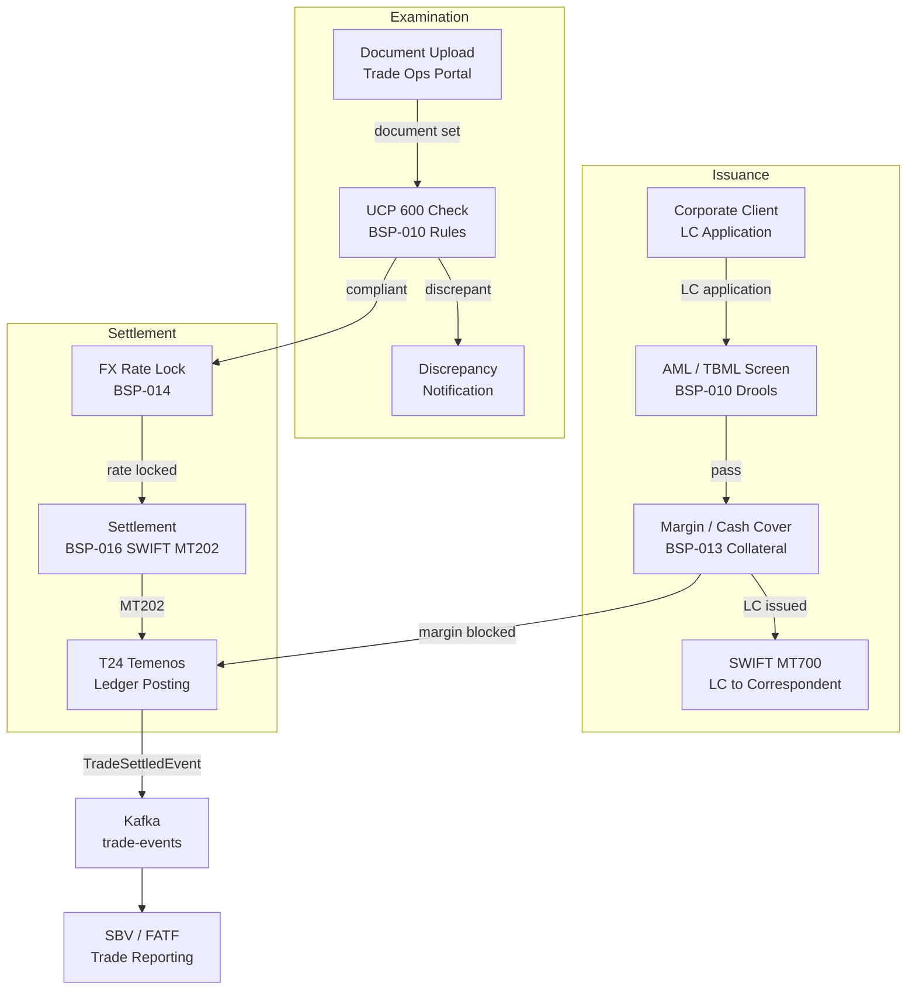

# Trade Finance Platform

Status: Draft | Last Reviewed: 2026-05-21 | Owner: @core-banking-domain-owner
Catalog ID: REF-017 | Radii
Tier Applicability: T0, T1

## Problem Statement

Trade finance — letters of credit (LC), documentary collections, bank guarantees, and supply chain finance — is characterised by document-intensive processing, cross-border FX settlement, and FATF-mandated trade-based money laundering (TBML) screening. Three platform-level pain points emerge. First, LC examination is manual: trade operations staff physically verify document compliance against UCP 600 rules, taking 3–5 days per LC and introducing human error that causes discrepancies. Second, FX settlement for cross-border LCs requires manual rate booking with Treasury, creating a settlement timing risk window that exposes the bank to FX mark-to-market movements. Third, TBML screening (FATF Rec. 16, Wolfsberg TBML) is performed post-transaction via batch AML, meaning suspicious trade transactions are not blocked at point of entry.

This platform integrates BSP-010 (Rule/Decisioning for UCP 600 + AML screening), BSP-013 (Collateral Management for LC margin/cash cover), BSP-014 (FX Rate Engine for live rate booking), and BSP-016 (Settlement Engine for SWIFT-based cross-border settlement) to automate trade finance processing from LC issuance through document examination and settlement.

## Context

The Trade Finance Platform is used by trade finance operations teams, corporate relationship managers, and the treasury settlement desk. It integrates with SWIFT (MT700/MT710 for LC issuance, MT202 for bank-to-bank settlement) and the FX Rate Engine (BSP-014) for live rate locking. Applicable for LC volumes > 500/month or cross-border trade finance > USD 50 M monthly. For domestic documentary collections only, a simpler implementation (BSP-010 + BSP-016) without BSP-013 is adequate.

## Solution

The platform orchestrates four Wave 9 engines across three phases: Issuance (BSP-010 credit/AML check + BSP-013 margin), Examination (BSP-010 UCP 600 document compliance), and Settlement (BSP-014 FX rate lock + BSP-016 SWIFT settlement).



## Implementation Guidelines

**1. AML / TBML Screening at LC Issuance (BSP-010)**

```java
@PostMapping("/trade/lc/applications/{applicationId}/screen")
public ScreeningResult screenApplication(@PathVariable String applicationId) {
    LcApplication application = lcRepository.findById(applicationId).orElseThrow();
    TbmlScreenRequest req = TbmlScreenRequest.builder()
        .applicantName(application.applicantName())
        .beneficiaryName(application.beneficiaryName())
        .beneficiaryCountry(application.beneficiaryCountry())
        .goodsDescription(application.goodsDescription())
        .amount(application.lcAmount())
        .currency(application.currency())
        .build();
    DecisionResult result = ruleEngine.evaluate("trade-aml-policy", req);
    if (!result.approved()) {
        lcRepository.flagForManualReview(applicationId, result.declineReasons());
    }
    return ScreeningResult.from(result);
}
```

TBML rules include: dual-use goods check (Wassenaar Arrangement), over/under-invoicing detection (price-versus-benchmark check using BSP-014 FX rates), and OFAC/UN sanctions list screening.

**2. UCP 600 Document Examination (BSP-010)**

```java
public ExaminationResult examineDocuments(String lcId, DocumentSet documentSet) {
    LcTerms terms = lcRepository.findTerms(lcId);
    Ucp600CheckRequest req = Ucp600CheckRequest.builder()
        .requiredDocuments(terms.requiredDocuments())
        .submittedDocuments(documentSet.documents())
        .latestShipmentDate(terms.latestShipmentDate())
        .expiryDate(terms.expiryDate())
        .portOfLoading(terms.portOfLoading())
        .portOfDischarge(terms.portOfDischarge())
        .build();
    DecisionResult result = ruleEngine.evaluate("ucp600-examination-policy", req);
    return ExaminationResult.from(result);
}
```

UCP 600 rules (Articles 14–28) are encoded as Drools `.drl` rules: missing documents, stale bills of lading (> 21 days from shipment date), inconsistent goods description, and non-conforming invoice amounts. Rules are updated annually post-ICC guidance.

**3. FX Rate Lock on Settlement (BSP-014)**

```java
public FxLockResult lockSettlementRate(String lcId, BigDecimal settlementAmount, String currency) {
    FxRateRequest req = FxRateRequest.builder()
        .fromCurrency(currency)
        .toCurrency("VND")
        .amount(settlementAmount)
        .tenor(FxTenor.SPOT)
        .rateType(RateType.SETTLEMENT)
        .build();
    FxRateResult rate = fxRateEngine.getRate(req);
    BigDecimal vndEquivalent = settlementAmount.multiply(rate.midRate());
    fxLockRepository.save(new FxLock(lcId, rate.midRate(), vndEquivalent, rate.rateTimestamp()));
    return FxLockResult.locked(rate.midRate(), vndEquivalent);
}
```

Rate is locked at the moment of UCP 600 examination approval. BSP-014 uses the BIDV FX feed cached in Redis (TTL 60s). Locked rates are stored for audit; settlement deviations > 1 pip trigger `FxSettlementVarianceAlert`.

**4. SWIFT Settlement (BSP-016)**

```java
public void settleLC(String lcId) {
    FxLock lock = fxLockRepository.findByLcId(lcId);
    SettlementInstruction instruction = SettlementInstruction.builder()
        .settlementType("CROSS_BORDER")
        .currency(lock.foreignCurrency())
        .amount(lock.foreignAmount())
        .correspondentBIC(lcRepository.findCorrespondentBIC(lcId))
        .valueDate(LocalDate.now())
        .reference(lcId)
        .build();
    SettlementResult result = settlementEngine.settle(instruction);
    lcRepository.markSettled(lcId, result.settlementReference());
}
```

BSP-016 routes to RTGS for USD/EUR amounts > USD 100 k; DNS net for smaller VND settlements. MT202 messages are generated per ISO 20022 pacs.008 equivalent.

## When to Use

- LC issuance volumes > 500/month or cross-border trade > USD 50 M/month
- UCP 600 document examination requiring automated discrepancy detection
- TBML screening required at point of LC issuance
- Cross-border FX settlement requiring live rate locking

## When Not to Use

- Domestic documentary collections only — simpler direct T24 + BSP-016 integration
- Supply chain finance / receivables discounting without LC — use a dedicated receivables platform
- FX spot trading / treasury — use REF-018 Treasury instead

## Variants

| Variant | When to prefer | Trade-off |
|---------|---------------|-----------|
| Import LC (issuing bank) | Bank's corporate client is the importer | Full UCP 600 examination; SWIFT MT700 outbound |
| Export LC (advising/confirming bank) | Bank's client is the exporter | SWIFT MT710/MT720; confirming risk managed in BSP-011 |
| Bank guarantee | Performance/tender bonds for corporate clients | No document examination; BSP-013 cash cover; SWIFT MT760 |

## NFR Acceptance Criteria

```yaml
performance:
  aml_screening_p99_ms: 2000
  ucp600_examination_p99_ms: 5000
  fx_rate_lock_p99_ms: 200
  swift_mt202_send_p99_ms: 1000
availability:
  platform_uptime_percent: 99.99
correctness:
  ucp600_false_negative_rate_percent: 0
  fx_lock_variance_pips: 1
```

## Compliance Mapping

| Layer | Reference | Section/Control | How this satisfies |
|-------|-----------|----------------|-------------------|
| Ring 0 — Global | FATF Rec. 16 | Wire transfer information — trade-based | SWIFT MT700/MT202 carries full originator/beneficiary chain; TBML screening at issuance |
| Ring 0 — Global | UCP 600 | Articles 14–28 — Document examination standards | BSP-010 Drools encodes all UCP 600 examination rules; examination results stored with article reference |
| Ring 0 — Global | ISBP 745 | International Standard Banking Practice | BSP-010 supplementary rules encode ISBP 745 bill of lading and invoice conventions |
| Ring 1 — International | SWIFT CSP | Customer Security Programme controls | SWIFT Alliance Access gateway hardened per SWIFT CSP; RMA authorisation enforced |
| Ring 1 — International | ISO 20022 pain.001 | Credit transfer initiation | MT202 settlement messages generated using pain.001 equivalents internally; SWIFT gpi tracker updated |
| Ring 2 — Vietnam | SBV Circular 09/2020 | §IV — Cross-border payment system security | TLS 1.3 on all SWIFT adapter interfaces; FX lock audit trail per SBV foreign exchange control requirements ⚠️ (working summary — pending Legal review) |

## Cost / FinOps Notes

- BSP-010 Drools for trade AML + UCP 600: shared rule engine with consumer lending; no additional infrastructure
- BSP-014 FX rate feed (BIDV): fixed monthly data licence; shared with REF-018 Treasury
- SWIFT Alliance Access: ~$5,000/month fixed; shared across all SWIFT-using platforms
- Document scanning for UCP examination: SFTP-based document ingestion; no OCR cost (manual upload by trade ops)
- MT202 messages: priced per message by SWIFT bureau; optimize by batching DNS net settlements

## Threat Model

**Over-invoicing for capital flight (Tampering)** — A corporate customer submits an LC for goods at 300% of market price, enabling VND-to-USD capital movement disguised as trade. Mitigated by: BSP-010 price-versus-benchmark rule compares invoice price against OECD/WTO commodity indices; deviations > 30% trigger manual review flag; BSP-014 FX rate confirms currency is eligible for trade settlement.

**SWIFT MT700 interception (Information Disclosure)** — Attacker intercepts an LC issuance SWIFT message and extracts commercial terms (goods, price, counterparty). Mitigated by: SWIFT Alliance Access end-to-end encryption; RMA authorisation restricts which correspondent banks can receive MT700 from this BIC; audit log of all outbound SWIFT messages retained 7 years.

## Operational Runbook

1. Alert: SwiftMt202SendFailure — outbound MT202 settlement message fails delivery within 30 min.
   - Check SWIFT Alliance Access connectivity: `swift-admin status`
   - If SWIFT is down, queue settlement instruction locally and retry on reconnection
   - Escalate to @core-banking-domain-owner and treasury settlement desk — FX lock expiry risk

2. Alert: FxLockExpiry — FX lock older than 2 business days without settlement completion.
   - Check settlement status in BSP-016 settlement engine
   - If SWIFT settlement is pending, contact correspondent bank operations
   - Re-lock FX rate at current market rate and record variance against original lock

3. Alert: Ucp600ExaminationBacklog — document examination queue > 50 items pending for > 4 h.
   - Scale UCP examination service: `kubectl scale deployment ucp-examiner --replicas=4 -n trade`
   - Notify trade operations supervisor — manual fallback examination for time-sensitive LCs

## Test Strategy

**Unit:** Test TBML screening rule triggers for: dual-use goods on Wassenaar list; invoice amount deviating > 30% from benchmark; OFAC-sanctioned beneficiary country. Test UCP 600 examination: missing bill of lading, stale shipment date (> 21 days), inconsistent goods description.

**Integration:** Testcontainers (PostgreSQL + Redis + Kafka) end-to-end: submit LC application → AML screen passes → margin blocked in BSP-013 → SWIFT MT700 emitted → upload document set → UCP check passes → FX rate locked → MT202 settlement emitted → T24 ledger posted.

**Compliance:** Assert FATF originator chain present in all MT700 and MT202 messages; assert UCP 600 Article 14(b) stale document rule fires correctly for 22-day-old bills of lading.

**Chaos:** Kill BSP-014 FX engine; assert FX lock step fails gracefully with `FX_RATE_UNAVAILABLE` and LC examination is paused (not settled at stale rate). Kill BSP-016 pod; assert MT202 is queued locally and retried with idempotency key on recovery.

## Related Patterns

- [BSP-010 Rule / Decisioning Engine](../patterns/banking-solutions/rule-decisioning-engine.md)
- [BSP-013 Collateral Management Engine](../patterns/banking-solutions/collateral-management-engine.md)
- [BSP-014 FX Rate Engine](../patterns/banking-solutions/fx-rate-engine.md)
- [BSP-016 Settlement Engine](../patterns/banking-solutions/settlement-engine.md)
- [EIP-024 Idempotent Receiver](../patterns/eip/idempotent-receiver.md)
- [COMP-001 Compliance Mapping Matrix](../compliance/compliance-mapping-matrix.md)

## References

- UCP 600 — Uniform Customs and Practice for Documentary Credits — ICC 2007
- ISBP 745 — International Standard Banking Practice — ICC 2013
- FATF Recommendations 2012 (updated 2023), Rec. 16 Wire Transfers
- Wolfsberg Group Trade Finance Principles 2019
- SWIFT MT7xx Standards (MT700, MT710, MT202)
- SBV Circular 09/2020 — Information System Security for Credit Institutions

---
**Key Takeaway**: The Trade Finance Platform automates UCP 600 document examination, TBML screening, and SWIFT-based FX settlement — reducing LC processing from 5 days to same-day and blocking suspicious trade transactions at point of issuance rather than in overnight AML batch.
