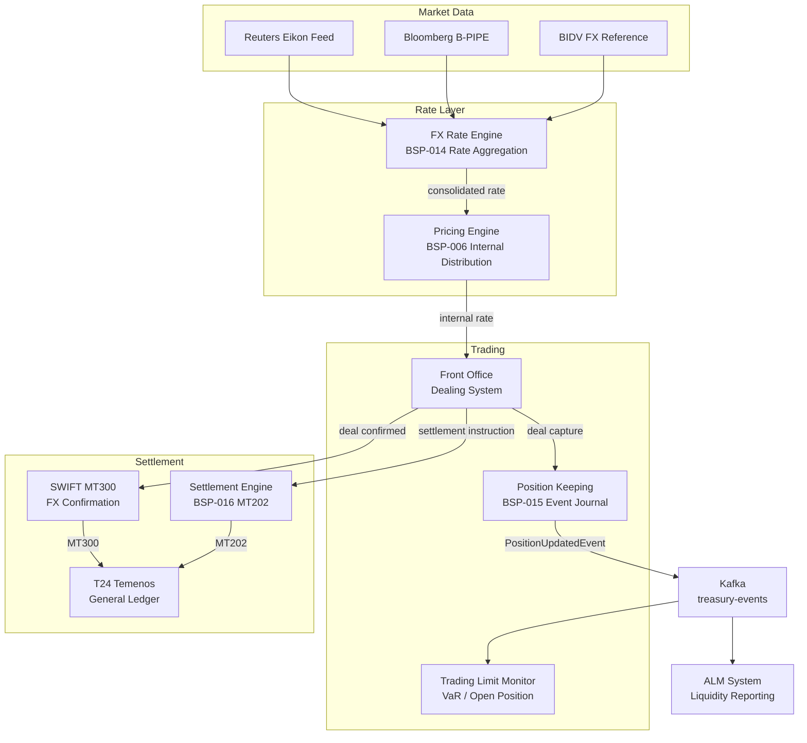

# Treasury and FX Platform

Status: Draft | Last Reviewed: 2026-05-21 | Owner: @wealth-domain-owner
Catalog ID: REF-018 | Radii
Tier Applicability: T0

## Problem Statement

Treasury operations — FX spot/forward trading, money market placements, and interbank lending — require real-time position visibility across all currency books, sub-second deal capture, and intraday limit monitoring. Three failures characterise unprepared treasury systems. First, FX position is aggregated from T24 in nightly batch, meaning intraday FX dealers operate without real-time P&L visibility — violating Basel III FRTB's intraday position reporting requirements. Second, interbank deal confirmation (SWIFT MT300 FX confirmation) is sent manually by back-office staff hours after execution, creating a confirmation gap that exposes the bank to counterparty settlement risk. Third, rate feed ingestion from multiple providers (Reuters, Bloomberg, BIDV) is handled by three different batch jobs with no reconciliation, causing rate inconsistencies between the front office dealing system and the settlement engine.

This platform integrates BSP-006 (Pricing Engine for FX rate distribution), BSP-014 (FX Rate Engine for live rate ingestion), BSP-015 (Position Keeping for real-time P&L), and BSP-016 (Settlement Engine for SWIFT-based interbank settlement) to deliver a real-time treasury operations hub.

## Context

The Treasury and FX Platform serves FX dealers (spot/forward), money market traders, and the ALM (Asset-Liability Management) team. It connects upstream to market data providers (Reuters Eikon / Bloomberg B-PIPE) and downstream to SWIFT for inter-bank settlement and T24 for book-keeping. Applicable for daily FX turnover > USD 100 M or interbank books > VND 5 trillion. For smaller FX volumes, T24 treasury module is sufficient.

## Solution

BSP-014 ingests multi-source FX rates and distributes a consolidated best-bid/offer to BSP-006 for internal rate distribution. Deals captured by the front office system update BSP-015's position journal in real time. BSP-016 routes interbank settlement via SWIFT (MT300 confirmations, MT202 payments).



## Implementation Guidelines

**1. Multi-Source FX Rate Aggregation (BSP-014)**

```java
@Service
public class FxRateAggregator {
    private final List<FxRateProvider> providers; // Reuters, Bloomberg, BIDV

    @Scheduled(fixedDelay = 1000)
    public void aggregateRates() {
        Map<String, List<FxRate>> ratesByPair = providers.stream()
            .flatMap(p -> p.fetchLatestRates().stream())
            .collect(Collectors.groupingBy(FxRate::currencyPair));

        ratesByPair.forEach((pair, rates) -> {
            BigDecimal midRate = rates.stream()
                .map(FxRate::midRate)
                .reduce(BigDecimal.ZERO, BigDecimal::add)
                .divide(BigDecimal.valueOf(rates.size()), 6, RoundingMode.HALF_UP);
            fxRateEngine.publish(pair, midRate, Instant.now());
        });
    }
}
```

Rates published to Redis (TTL 60s) and to Kafka topic `fx-rates` for downstream consumers (BSP-006, BSP-016, REF-017).

**2. Real-Time Position Update (BSP-015)**

```java
@KafkaListener(topics = "fx-deal-events", groupId = "position-keeper")
public void onDealEvent(FxDealEvent event) {
    PositionUpdateCommand cmd = PositionUpdateCommand.builder()
        .bookId(event.bookId())
        .currencyPair(event.currencyPair())
        .baseCurrencyAmount(event.baseCurrencyAmount())
        .quoteCurrencyAmount(event.quoteCurrencyAmount())
        .dealTimestamp(event.executionTimestamp())
        .dealId(event.dealId())
        .build();
    positionKeepingEngine.applyEvent(cmd);
    BigDecimal currentPosition = positionKeepingEngine.getPosition(event.bookId(), event.currencyPair());
    if (currentPosition.abs().compareTo(openPositionLimit) > 0) {
        alertService.send(new OpenPositionLimitBreachEvent(event.bookId(), currentPosition));
    }
}
```

BSP-015 maintains an event-sourced position journal; positions are never mutated — new events are appended. Real-time VaR calculated every 60s using position snapshot + BSP-014 volatility surface.

**3. SWIFT MT300 Confirmation (BSP-016)**

```java
public void confirmFxDeal(String dealId) {
    FxDeal deal = dealRepository.findById(dealId).orElseThrow();
    SettlementInstruction instruction = SettlementInstruction.builder()
        .settlementType("CROSS_BORDER")
        .currency(deal.quoteCurrency())
        .amount(deal.quoteCurrencyAmount())
        .correspondentBIC(deal.counterpartyBIC())
        .valueDate(deal.settlementDate())
        .reference(dealId)
        .build();
    swiftClient.sendMt300Confirmation(deal);
    settlementEngine.settle(instruction);
}
```

MT300 FX confirmations are sent automatically within 30 minutes of deal capture. BSP-016 routes USD/EUR settlement via SWIFT RTGS; VND leg posted directly to T24.

**4. VaR Limit Monitoring**

```java
@Scheduled(fixedDelay = 60000)
public void calculateVaR() {
    Map<String, BigDecimal> positions = positionKeepingEngine.getAllPositions();
    VaRResult var = varCalculator.calculate(positions, confidenceLevel(0.99), holdingPeriodDays(1));
    if (var.portfolioVaR().compareTo(varLimit) > 0) {
        alertService.send(new VarLimitBreachEvent(var.portfolioVaR(), varLimit));
    }
    metricsRegistry.gauge("treasury.var.portfolio", var.portfolioVaR());
}
```

1-day 99% VaR calculated using historical simulation with 250-day lookback; FRTB-compliant internal model approach.

## When to Use

- Daily FX turnover > USD 100 M or interbank book > VND 5 trillion
- Basel III FRTB intraday position reporting required
- MiFID II transaction reporting applicable
- Real-time VaR limit monitoring required

## When Not to Use

- Retail FX for digital banking customers — BSP-014 + BSP-006 alone for customer rate display
- Pure treasury liquidity management without trading — use REF-020 Cash Management instead
- Simple FX settlement for trade finance — REF-017 handles the FX lock without full treasury platform

## Variants

| Variant | When to prefer | Trade-off |
|---------|---------------|-----------|
| Spot FX only | Simple currency conversion without forward book | No forward position journal; lower infra cost |
| Spot + Forward | Corporate hedging client base | Forward position journal + tenor-bucketed VaR |
| Full treasury (MM + FX + derivatives) | FRTB internal model approach | Full historical simulation VaR; derivatives pricing models required |

## NFR Acceptance Criteria

```yaml
performance:
  fx_rate_ingestion_latency_ms: 200
  deal_position_update_ms: 50
  var_calculation_seconds: 10
  swift_mt300_send_minutes: 30
availability:
  platform_uptime_percent: 99.999
  position_keeping_uptime_percent: 99.999
correctness:
  position_reconciliation_variance_bps: 0
  var_model_backtesting_exceptions_per_250_days: 10
```

## Compliance Mapping

| Layer | Reference | Section/Control | How this satisfies |
|-------|-----------|----------------|-------------------|
| Ring 0 — Global | IFRS 9 | §5.7 — Fair value changes on FX positions | BSP-015 position journal provides mark-to-market P&L per deal; reconciled to T24 daily |
| Ring 0 — Global | Basel III FRTB | §DIS40 — Intraday position reporting | BSP-015 publishes position updates in < 1 s; VaR calculated every 60 s |
| Ring 0 — Global | MiFID II | Article 26 — Transaction reporting | Deal capture events published to Kafka `fx-deal-events` with ISIN/LEI for regulatory reporting |
| Ring 1 — International | SWIFT GPI | End-to-end payment tracking | BSP-016 MT202 includes gpi tracker UETR; camt.054 confirmation matched on UETR |
| Ring 1 — International | ISO 20022 pacs.008 | Credit transfer settlement | MT202 messages generated from pacs.008 equivalent data model |
| Ring 2 — Vietnam | SBV Circular 09/2020 | §IV.3 — Foreign currency management systems | FX position reconciled to T24 nightly; open position reported to SBV via statutory FX report ⚠️ (working summary — pending Legal review) |

## Cost / FinOps Notes

- Reuters Eikon / Bloomberg B-PIPE feed: ~$8,000/month combined; costs shared with REF-017 Trade Finance
- BSP-015 position journal (PostgreSQL + Redis): 5-node Redis cluster for sub-millisecond position lookup; ~$600/month
- VaR calculation: CPU-intensive 60-second job; runs on dedicated 8-core pod during trading hours (08:00–18:00 ICT); scales down to 2 cores after-hours
- SWIFT RTGS transaction fees: per-message; batch DNS netting for same-day VND settlements reduces count by 70%
- OTEL trace sampling at 100% for all FX deal events (audit requirement); storage ~200 GB/month

## Threat Model

**Rate feed manipulation (Tampering)** — A compromised Reuters feed adapter injects a fake FX rate (e.g., USD/VND 10,000 instead of 25,000), causing BSP-006 to distribute a catastrophically wrong internal rate to trading desks and product channels. Mitigated by: multi-source rate aggregation — BSP-014 requires ≥2 of 3 providers to agree within 2% tolerance; outlier rejection algorithm discards any single-source rate deviating > 3σ from median; `RateSpikeAlert` fires if any pair moves > 5% in 60 s.

**Position journal tampering (Repudiation)** — A rogue trader deletes deal events from the position journal to hide an unauthorised position. Mitigated by: BSP-015 uses an append-only event journal (no UPDATE/DELETE on deal_events table); journal entries hash-chained using SHA-256; any gap in chain sequence triggers `PositionJournalTamperAlert`.

## Operational Runbook

1. Alert: FxRateFeedStale — all three provider feeds silent for > 60 s.
   - Check network connectivity to Reuters/Bloomberg adaptors
   - Activate manual rate entry mode: `POST /admin/fx-rates/manual` — dealers enter indicative rates manually
   - Escalate to @wealth-domain-owner and treasury head; suspend automated rate distribution to BSP-006 consumers

2. Alert: VarLimitBreach — portfolio VaR > VaR limit for > 5 min.
   - Alert FX desk head immediately; require position reduction within 30 min
   - Suspend new deal capture above USD 1 M until position within limit
   - Log breach with timestamp, breach magnitude, and responsible book

3. Alert: SwiftMt300Overdue — FX deal captured > 30 min without MT300 confirmation sent.
   - Check SWIFT Alliance Access connectivity
   - If SWIFT is up, check for deal status = `CONFIRMED` in dealing system; trigger manual re-send: `POST /deals/{dealId}/resend-mt300`
   - If SWIFT is down, log manual confirmation fallback to counterparty operations email

## Test Strategy

**Unit:** Test `FxRateAggregator` outlier rejection: inject Reuters 24,800, Bloomberg 25,100, BIDV outlier 22,000 — assert BIDV excluded; mid-rate = 24,950. Test `VaRCalculator` with 250-day fixture — assert 99% VaR within 1 bp of reference Python NumPy calculation.

**Integration:** Testcontainers (PostgreSQL + Redis + Kafka) end-to-end: inject FX rates → capture deal → assert position updated within 50 ms → assert MT300 emitted to Kafka within 30 min simulation.

**Compliance:** Assert FRTB backtesting exception count ≤ 10 per 250-day fixture; assert position reconciliation matches T24 snapshot within 0 bps. Assert MiFID II deal report fields (ISIN, LEI, quantity, price) present on Kafka deal event.

**Chaos:** Kill BSP-014 rate provider adapter; assert aggregator excludes provider gracefully and continues with remaining 2 sources. Kill BSP-015 position keeping pod; assert deal capture is held (not lost) in Kafka topic and position is replayed on recovery.

## Related Patterns

- [BSP-006 Pricing Engine](../patterns/banking-solutions/pricing-engine.md)
- [BSP-014 FX Rate Engine](../patterns/banking-solutions/fx-rate-engine.md)
- [BSP-015 Position Keeping Engine](../patterns/banking-solutions/position-keeping-engine.md)
- [BSP-016 Settlement Engine](../patterns/banking-solutions/settlement-engine.md)
- [EIP-025 Dead Letter Channel](../patterns/eip/dead-letter-channel.md)
- [RES-002 Circuit Breaker](../patterns/resilience/circuit-breaker.md)

## References

- Basel III FRTB — Minimum Capital Requirements for Market Risk — BCBS January 2019
- MiFID II — Directive 2014/65/EU — European Parliament 2018
- IFRS 9 Financial Instruments — IASB 2014 (effective 2018)
- SWIFT GPI — Global Payments Innovation — SWIFT 2017
- ISO 20022 pacs.008 — FI to FI Customer Credit Transfer
- SBV Circular 09/2020 — Information System Security for Credit Institutions

---
**Key Takeaway**: The Treasury and FX Platform delivers real-time position visibility, automated SWIFT confirmation, and FRTB-compliant VaR monitoring — eliminating the overnight batch lag that obscures intraday FX risk and creates regulatory reporting gaps.
