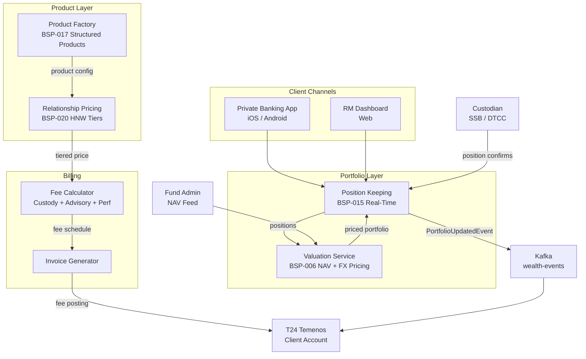

# Wealth Management Platform

Status: Draft | Last Reviewed: 2026-05-21 | Owner: @wealth-domain-owner
Catalog ID: REF-019 | Radii
Tier Applicability: T0, T1

## Problem Statement

Wealth management clients — high-net-worth (HNW) and ultra-high-net-worth (UHNW) individuals — expect real-time portfolio visibility, relationship-based pricing on FX and structured products, and proactive rebalancing notifications. Three operational failures characterise under-invested wealth platforms. First, portfolio valuation is calculated nightly from T24 positions, so relationship managers cannot answer "what is my client's P&L today?" without a phone call to back-office — causing client attrition to private banks with live dashboards. Second, fee billing for wealth management services (custody fees, advisory fees, performance fees) requires manual spreadsheet calculation quarterly, introducing errors and delaying invoice generation by 3–4 weeks. Third, product distribution is product-push rather than needs-based: without a product configuration engine, relationship managers cannot quickly create tailored structured deposit or fund combinations for individual clients.

This platform integrates BSP-006 (Pricing Engine for product pricing), BSP-015 (Position Keeping for real-time portfolio valuation), BSP-017 (Product Factory for structured product definition), and BSP-020 (Relationship Pricing for HNW tiered pricing) to deliver a real-time wealth operations hub.

## Context

The Wealth Management Platform serves relationship managers, investment advisors, and wealth clients via private banking digital channels. It integrates with custody systems (SSB/DTC for international securities) and fund administrators for NAV feeds. Applicable for HNW client segments (AUM > VND 10 billion per client) with > 200 active wealth relationships. For mass-affluent segments with simpler needs, BSP-015 position keeping + BSP-020 relationship pricing alone (without BSP-017 structured products) is adequate.

## Solution

BSP-015 maintains a real-time position journal updated on each transaction event; BSP-006 prices securities using NAV feeds and FX rates from BSP-014; BSP-020 applies tiered pricing discounts; BSP-017 defines structured product configurations that combine base products into client-tailored solutions.



## Implementation Guidelines

**1. Real-Time Portfolio Valuation (BSP-015 + BSP-006)**

```java
@GetMapping("/portfolios/{portfolioId}/valuation")
public PortfolioValuationResponse getValuation(@PathVariable String portfolioId) {
    List<Position> positions = positionKeepingEngine.getPositions(portfolioId);

    BigDecimal totalVnd = positions.stream()
        .map(pos -> {
            PricingResult price = pricingEngine.calculate(PricingRequest.builder()
                .productCode(pos.instrumentCode())
                .currency(pos.currency())
                .valueDate(LocalDate.now())
                .build());
            BigDecimal valueInCcy = pos.quantity().multiply(price.unitPrice());
            return fxRateEngine.convert(valueInCcy, pos.currency(), "VND");
        })
        .reduce(BigDecimal.ZERO, BigDecimal::add);

    return new PortfolioValuationResponse(portfolioId, totalVnd, LocalDateTime.now());
}
```

Portfolio valuation is computed on-demand with p99 target ≤ 2,000 ms for 50-position portfolio. BSP-006 caches NAV prices (TTL 300s) and FX rates (TTL 60s) in Redis.

**2. Structured Product Configuration (BSP-017)**

```java
public StructuredProductDefinition createStructuredDeposit(StructuredDepositRequest request) {
    ProductDefinition baseDeposit = productFactory.getEffectiveDefinition("TD_VND_12M", request.valueDate());
    ProductDefinition capitalProtection = productFactory.getEffectiveDefinition("CAPITAL_PROTECT_100", request.valueDate());

    return ProductDefinition.builder()
        .productCode("STRUCT_DEP_" + UUID.randomUUID())
        .components(List.of(
            ProductComponent.of(baseDeposit, request.principalAmount().multiply(BigDecimal.valueOf(0.90))),
            ProductComponent.of(capitalProtection, request.principalAmount().multiply(BigDecimal.valueOf(0.10)))
        ))
        .tenor(request.tenor())
        .minimumInvestment(BigDecimal.valueOf(500_000_000))
        .clientSegment("HNW")
        .effectiveDate(request.valueDate())
        .build();
}
```

Structured products are assembled from base product components in BSP-017's product catalogue. Each component carries its own pricing rule, fee schedule, and compliance flags.

**3. Tiered Fee Calculation (BSP-020)**

```java
public FeeSchedule calculateWealthFees(String clientId, String portfolioId) {
    BigDecimal aum = portfolioValuationService.getAum(portfolioId);
    RelationshipTier tier = relationshipPricingEngine.getTier(clientId, aum);

    BigDecimal custodyFeeRate = tier == RelationshipTier.PLATINUM ?
        new BigDecimal("0.0010") : new BigDecimal("0.0015");
    BigDecimal advisoryFeeRate = tier == RelationshipTier.PLATINUM ?
        new BigDecimal("0.0050") : new BigDecimal("0.0075");

    return FeeSchedule.builder()
        .custodyFee(aum.multiply(custodyFeeRate))
        .advisoryFee(aum.multiply(advisoryFeeRate))
        .billingFrequency(BillingFrequency.QUARTERLY)
        .tier(tier)
        .build();
}
```

BSP-020 relationship tiers: Standard (AUM < VND 5 B), Priority (VND 5–20 B), Gold (VND 20–100 B), Platinum (> VND 100 B). Tier determines custody and advisory fee rates, FX spread, and structured product access.

**4. Rebalancing Notification**

```java
@KafkaListener(topics = "wealth-events", groupId = "rebalancing-advisor")
public void onPortfolioEvent(PortfolioUpdatedEvent event) {
    PortfolioAllocation current = portfolioService.getAllocation(event.portfolioId());
    PortfolioAllocation target = clientProfileService.getTargetAllocation(event.clientId());
    AllocationDrift drift = AllocationAnalyzer.computeDrift(current, target);
    if (drift.maxDriftPercent().compareTo(REBALANCING_THRESHOLD) > 0) {
        notificationService.send(event.clientId(), NotificationType.REBALANCING_REQUIRED, drift);
    }
}
```

Rebalancing threshold: 5% drift from target allocation. Notifications sent via push notification (mobile) and RM dashboard alert.

## When to Use

- HNW/UHNW client segment with AUM > VND 10 billion per relationship
- Real-time portfolio valuation required for RM dashboard and client mobile app
- Relationship-tiered pricing for FX, custody, and advisory fees
- Structured product distribution with MiFID suitability gating

## When Not to Use

- Mass-affluent segment with < VND 5 billion AUM — simpler fund distribution platform sufficient
- Pure mutual fund distribution without advisory — fund admin + NAV feed without BSP-017 is adequate
- Digital-only robo-advisory — algorithmic rebalancing replaces RM relationship model

## Variants

| Variant | When to prefer | Trade-off |
|---------|---------------|-----------|
| Discretionary (DPM) | Bank manages portfolio on client's behalf | Full delegation; rebalancing automated; lower client interaction cost |
| Advisory | RM recommends; client approves each trade | Higher engagement; suitability obligation per trade; higher operational cost |
| Execution-only | Client self-directs; platform provides valuation | No suitability obligation; lower liability; lower revenue |

## NFR Acceptance Criteria

```yaml
performance:
  portfolio_valuation_50_positions_p99_ms: 2000
  fee_calculation_p99_ms: 100
  rebalancing_notification_latency_s: 30
availability:
  platform_uptime_percent: 99.99
  position_keeping_uptime_percent: 99.99
correctness:
  portfolio_valuation_variance_bps: 0
  fee_billing_accuracy_percent: 100
```

## Compliance Mapping

| Layer | Reference | Section/Control | How this satisfies |
|-------|-----------|----------------|-------------------|
| Ring 0 — Global | IFRS 9 | §5.7 — Fair value through OCI for investment securities | BSP-015 position journal records fair value at each transaction; daily mark-to-market via BSP-006 |
| Ring 0 — Global | MiFID II | Article 24 — Suitability and appropriateness | Product Factory (BSP-017) flags each structured product with MiFID suitability category; RM dashboard enforces client profile match |
| Ring 0 — Global | FATF Rec. 10 | Customer due diligence for HNW clients | Wealth onboarding includes enhanced due diligence (EDD) workflow; product access gated by EDD completion status |
| Ring 1 — International | BCBS 239 | §4 — Accuracy and integrity of risk data | Portfolio valuation published to risk reporting via Kafka; no silent data loss (idempotent consumers) |
| Ring 1 — International | ISO 20022 | camt.052 — Account balance reports | Custody confirmation messages from SSB/DTCC parsed as camt.052 equivalents |
| Ring 2 — Vietnam | SBV Circular 09/2020 | §IV — Information system security | Portfolio data encrypted at rest; Vault-managed client data keys; audit log of all valuation queries ⚠️ (working summary — pending Legal review) |

## Cost / FinOps Notes

- NAV feed from fund administrators: ~$500/month per fund family (typically 3–5 families); consider consolidating to Bloomberg B-PIPE (shared with REF-018)
- BSP-015 position journal: low transaction volume (HNW clients, not mass retail); 2-node Redis cluster sufficient — ~$150/month
- Quarterly fee invoice generation: batch job runs on 1st of each quarter; terminates in < 5 min for 200 wealth clients
- Structured product lifecycle: BSP-017 product definitions archived for 7 years (IFRS audit trail); PostgreSQL cold storage tier
- Custodian reconciliation: daily SFTP file from SSB/DTCC; no API cost; parsing handled by Spring Batch reader

## Threat Model

**Portfolio valuation manipulation (Tampering)** — An insider modifies NAV prices in BSP-006's Redis cache to inflate a client's portfolio value, enabling a larger collateral-backed loan drawdown. Mitigated by: BSP-006 Redis write access restricted to rate-feed-adapter service account only; NAV prices validated against custodian SFTP statement on each daily reconciliation; `NavPriceMismatchAlert` fires when Redis price deviates > 1% from custodian statement.

**Unauthorised product access (Elevation of Privilege)** — A relationship manager creates a structured product (BSP-017) for a retail-segment client who lacks the required MiFID suitability assessment. Mitigated by: Product Factory enforces `minimumClientSegment` constraint at product creation time; RM dashboard checks EDD status and suitability category before displaying product; audit log records every product offering with RM identity.

## Operational Runbook

1. Alert: PortfolioValuationStale — any portfolio NAV not updated within 8 h during business day.
   - Check BSP-006 NAV feed adapter for failed fund admin SFTP pull
   - Trigger manual NAV refresh: `POST /admin/nav/refresh?fundCode={code}`
   - If persistent, use T-1 NAV with staleness flag shown on RM dashboard

2. Alert: CustodianReconciliationFail — daily position reconciliation between BSP-015 and custodian SFTP differs by > 0 units.
   - Pull custodian SFTP statement: `/data/custodian/daily/{date}.csv`
   - Run reconciliation report: `POST /admin/reconciliation/run?date={date}`
   - Escalate mismatched positions to operations team for manual investigation

3. Alert: FeeInvoiceGenerationFail — quarterly fee batch fails.
   - Check batch execution log for failed portfolio IDs
   - Re-run failed portfolios: `POST /admin/fees/rerun?portfolioId={id}`
   - If portfolio AUM data is stale, defer invoice to next business day after manual AUM confirmation

## Test Strategy

**Unit:** Test `PortfolioValuationResponse` for multi-currency portfolio: 3 positions (VND, USD, EUR) — assert VND total equals sum of FX-converted values using fixture rates. Test fee schedule for each tier at boundary AUM values (VND 4.99 B, VND 5 B, VND 20 B, VND 100 B).

**Integration:** Testcontainers (PostgreSQL + Redis + Kafka) end-to-end: create portfolio → add positions → update NAV price via BSP-006 → assert real-time valuation changes → calculate quarterly fees → assert T24 fee posting event on Kafka.

**Compliance:** Assert MiFID II suitability block prevents Platinum structured product being offered to Standard-tier client. Assert FATF EDD gate blocks product access for clients without completed EDD documentation.

**Chaos:** Kill BSP-006 NAV cache; assert valuation falls back to T-1 NAV with staleness warning within 200 ms. Kill BSP-015 pod; assert position reads return last known snapshot and `PositionServiceUnavailable` flag is set on RM dashboard.

## Related Patterns

- [BSP-006 Pricing Engine](../patterns/banking-solutions/pricing-engine.md)
- [BSP-015 Position Keeping Engine](../patterns/banking-solutions/position-keeping-engine.md)
- [BSP-017 Product Factory](../patterns/banking-solutions/product-factory.md)
- [BSP-020 Relationship Pricing Engine](../patterns/banking-solutions/relationship-pricing-engine.md)
- [RES-002 Circuit Breaker](../patterns/resilience/circuit-breaker.md)
- [COMP-001 Compliance Mapping Matrix](../compliance/compliance-mapping-matrix.md)

## References

- IFRS 9 Financial Instruments — IASB 2014 (effective 2018)
- MiFID II — Directive 2014/65/EU — European Parliament 2018
- FATF Recommendations 2012 (updated 2023), Rec. 10 Customer Due Diligence
- BCBS 239 — Principles for Effective Risk Data Aggregation — BCBS January 2013
- ISO 20022 camt.052 — Account Balance Reports
- SBV Circular 09/2020 — Information System Security for Credit Institutions

---
**Key Takeaway**: The Wealth Management Platform replaces overnight portfolio snapshots with real-time event-sourced positions (BSP-015), automated relationship-tiered fee billing (BSP-020), and MiFID-gated structured product distribution (BSP-017) — delivering private banking-grade capabilities on a commercial bank platform.
