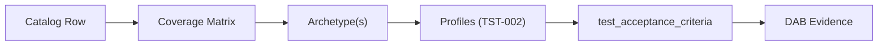

# Testing Knowledge Base (IT Quality Engineering)

This corpus is the normative test strategy for the 191 catalog rows in
`knowledge-base/`, organised by verification method rather than by pattern domain. Two
patterns from different domains that fail the same way — say, a ledger invariant and a
position-keeping invariant — share one archetype, because the test design that catches one
catches the other. A coverage matrix then maps every catalog row to the archetype(s) that
verify it, so "is this pattern tested, and how" has one answer instead of one per squad.

This is not a test harness. There is no Maven or Gradle project here, no `package.json`, no
dependency management, and nothing runs in CI from this folder. Every code fragment —
JMeter JMX snippets, Karate features, k6 scripts — is a worked example to copy into the QE
team's own harness repository, not a runnable artefact maintained here. This repository
stays documentation-only, matching every other category in `knowledge-base/`.

## How to Use This Corpus

1. Find your pattern's catalog ID in [`coverage/coverage-matrix.md`](./coverage/coverage-matrix.md).
2. Open the archetype(s) it maps to, for the oracle, invariants, and canonical harness.
3. Read [`TST-002`](./strategy/performance-test-standard.md) for the performance profiles
   your service's tier requires.
4. Fill the `test_acceptance_criteria` block defined in
   [`TST-001`](./strategy/test-strategy-standard.md) and attach it as DAB evidence.

## Index — Strategy

| Catalog ID | Document | Purpose |
|---|---|---|
| TST-001 | [Test Strategy Standard](./strategy/test-strategy-standard.md) | Spine. Six disciplines, four oracles, obligation levels, the `test_acceptance_criteria` contract |
| TST-002 | [Performance Test Standard](./strategy/performance-test-standard.md) | Eight normative performance profiles and their pass criteria |
| TST-003 | [Workload Modelling](./strategy/workload-modelling.md) | Open vs closed workload models, Little's Law, Vietnam-specific peak factors, named journey blends |
| TST-004 | [Test Data Management](./strategy/test-data-management.md) | Synthetic/anonymised data mandate, referential integrity, teardown |
| TST-005 | [Test Environments and Quality Gates](./strategy/environments-quality-gates.md) | Environment tiers and pipeline gate placement |
| TST-006 | [Resilience Test Standard](./strategy/resilience-test-standard.md) | Fault-injection and declared-failure-mode test obligations |
| TST-007 | [Contract and Integration Test Standard](./strategy/contract-integration-test-standard.md) | Producer/consumer contract compatibility testing |
| TST-008 | [Security Test Standard](./strategy/security-test-standard.md) | AuthN/AuthZ and data-protection test obligations |
| TST-009 | [Data Quality Test Standard](./strategy/data-quality-test-standard.md) | Data accuracy, completeness, and timeliness testing |

## Index — Tooling

| Catalog ID | Document | Purpose |
|---|---|---|
| TST-010 | [Tool Selection Matrix](./tooling/tool-selection-matrix.md) | Capability matrix and decision tree across JMeter, Gatling+Karate, k6, and Locust |
| TST-011 | [JMeter Guide](./tooling/jmeter.md) | Primary performance tool — installation, project layout, worked examples |
| TST-012 | [Gatling + Karate Guide](./tooling/gatling-karate.md) | Shared `.feature` files across functional and performance testing |
| TST-013 | [k6 Guide](./tooling/k6.md) | Thresholds-as-code CI gate tooling |
| TST-014 | [Locust Guide](./tooling/locust.md) | Specialist tool for bespoke stateful load scenarios |

## Index — Archetypes

Grouped into seven families by shared method of verification, not by domain. See
[TST-001](./strategy/test-strategy-standard.md) for what an archetype is and how oracles are
assigned.

> All seven families have landed — all twenty-four documents exist and are Approved. `TST-040`
> and `TST-041` (Family F) were sequenced last because both required `@infosec-architect` review;
> that review is now complete for both. The `TST-039` → `TST-042` ID gap in the catalog is a
> deliberate artefact of that sequencing, not an error to "fix".

### Family A — Correctness & State (landed)

| Catalog ID | Archetype | Covers |
|---|---|---|
| TST-020 | [Idempotency & Replay Safety](./archetypes/idempotency-replay.md) | BSP-002, EIP-024, PRIN-006, INT-014, RES-003 |
| TST-021 | [Ledger & Monetary Invariant](./archetypes/ledger-monetary-invariant.md) | BSP-001, BSP-015, BSP-016, BSP-005, REF-010 |
| TST-022 | [Deterministic Calculation Engine](./archetypes/deterministic-calculation-engine.md) | BSP-018, BSP-007, BSP-008, BSP-009, BSP-006, BSP-020, BSP-014, BSP-017 |
| TST-023 | [Concurrent Limit & Counter Contention](./archetypes/concurrent-limit-contention.md) | BSP-011, BSP-012, BSP-013 |
| TST-024 | [Saga & Compensation Correctness](./archetypes/saga-compensation.md) | INT-001, INT-016, EIP-017, EIP-016 |
| TST-025 | [Decision Table & Screening Accuracy](./archetypes/decision-screening-accuracy.md) | BSP-010, BSP-003, BSP-019, SEC-009, SEC-010 |

### Family B — Messaging & Integration (landed)

| Catalog ID | Archetype | Covers |
|---|---|---|
| TST-026 | [Message Transformation & Routing Correctness](./archetypes/message-transformation-routing.md) | EIP-004, EIP-005, EIP-006, EIP-007, EIP-008, EIP-010, EIP-014, EIP-012, EIP-019, INT-009, INT-005, INT-012 |
| TST-027 | [Ordering, Sequencing & Resequencing](./archetypes/ordering-resequencing.md) | EIP-013, INT-017, EIP-003 |
| TST-028 | [Fan-out / Fan-in Correlation](./archetypes/fanout-fanin-correlation.md) | EIP-015, EIP-011, EIP-009, EIP-018 |
| TST-029 | [Delivery Guarantee, Retry & DLQ](./archetypes/delivery-guarantee-dlq.md) | EIP-023, EIP-022, EIP-025, EIP-021, EIP-001, EIP-002, EIP-020, INT-014 |
| TST-030 | [Contract & Schema Compatibility](./archetypes/contract-schema-compatibility.md) | INT-015, INT-010, INT-011, INT-013, INT-003 |

### Family C — Load & Capacity (landed)

| Catalog ID | Archetype | Covers |
|---|---|---|
| TST-031 | [Rate Limit, Throttle & Breakpoint](./archetypes/rate-limit-breakpoint.md) | RES-008, RES-009, RES-011 |
| TST-032 | [Batch Window & Cutoff Throughput](./archetypes/batch-window-cutoff.md) | BSP-004, BSP-019, REF-008, DATA-004 |
| TST-033 | [Multi-Tenant Isolation & Noisy Neighbour](./archetypes/multitenant-noisy-neighbour.md) | PLT-008, RES-001, RES-005, PLT-006 |
| TST-034 | [Blended Journey Workload](./archetypes/blended-journey-workload.md) | All 20 `REF-*` reference architectures; owns the `mixed` and journey-level `soak` profiles |

### Family D — Resilience (landed)

| Catalog ID | Archetype | Covers |
|---|---|---|
| TST-035 | [Fault Injection & Graceful Degradation](./archetypes/fault-injection-degradation.md) | RES-002, RES-007, RES-004, RES-006, RES-012, RES-010, RES-001, RES-003, BP-005 |
| TST-036 | [Zero-Downtime Deploy, Traffic Shift & Rotation](./archetypes/zero-downtime-deploy-rotation.md) | PLT-003, PLT-001, PLT-005, INT-006, SEC-007, SEC-003, FE-004, MOB-006 |

### Family E — Data (landed)

| Catalog ID | Archetype | Covers |
|---|---|---|
| TST-037 | [Read-Model Convergence & CDC Lag](./archetypes/read-model-convergence-lag.md) | DATA-001, DATA-008, DATA-007, DATA-006, DATA-012, INT-002, INT-004 |
| TST-038 | [Temporal & Historisation Correctness](./archetypes/temporal-historisation.md) | DATA-005, DATA-003, DATA-004, DATA-010 |
| TST-039 | [Data Quality & Reconciliation](./archetypes/data-quality-reconciliation.md) | DATA-011, DATA-013, DATA-009, DATA-002 |

### Family F — Security (landed)

| Catalog ID | Archetype | Covers |
|---|---|---|
| TST-040 | [AuthN/AuthZ Matrix & Token Lifecycle](./archetypes/authn-authz-token-lifecycle.md) | SEC-010, SEC-006, SEC-002, SEC-005, SEC-011, SEC-001, MOB-003 |
| TST-041 | [Data Protection, Masking & Tokenisation](./archetypes/data-protection-masking-tokenisation.md) | SEC-008, SEC-013, SEC-004, SEC-012, MOB-002, FE-003, MOB-005, MOB-004 |

### Family G — Observability & Client (landed)

| Catalog ID | Archetype | Covers |
|---|---|---|
| TST-042 | [Telemetry & Observability Verification](./archetypes/telemetry-verification.md) | OBS-001, OBS-002, OBS-003, OBS-004, OBS-005, OBS-006, OBS-007, OBS-008, OBS-009, OBS-010, BP-004, BP-007, BP-008 |
| TST-043 | [Client Experience, Offline Sync & Perf Budget](./archetypes/client-experience-offline-perf.md) | FE-005, FE-006, FE-001, FE-002, MOB-001, MOB-006 |

## Coverage

[`coverage/coverage-matrix.md`](./coverage/coverage-matrix.md) is the generated, human-readable
view of `coverage/_testing-coverage.yml` — one row per catalog inventory row, recording its
tier(s), assigned archetype(s), per-discipline obligation level, and primary tooling.
Coverage is enforced by `scripts/validate-testing-coverage.py`: a catalog row added without a
matching coverage row, an archetype reference that does not resolve to a real file, or a
discipline value outside the normative set fails the gate. Coverage is provable, not asserted
in prose.

## Related

- [NFR-001 Service Tiering + RTO/RPO Matrix](../nfr/service-tiering-rto-rpo.md)
- [NFR-002 Latency Budget Model](../nfr/latency-budget-model.md)
- [TPL-001 NFR Acceptance Criteria — DAB Submission Template](../templates/nfr-acceptance-criteria-dab.md)
- [TPL-005 Test Archetype Document Template](../templates/test-archetype-template.md)
- [INT-015 API Contract Testing](../patterns/integration/api-contract-testing.md)
- [EIP §11 Test Message](../patterns/eip/test-message.md)
- [Synthetic Monitoring / Canary](../patterns/observability/synthetic-monitoring-canary.md)
- [BP-005 Chaos Engineering](../best-practices/chaos-engineering.md)
