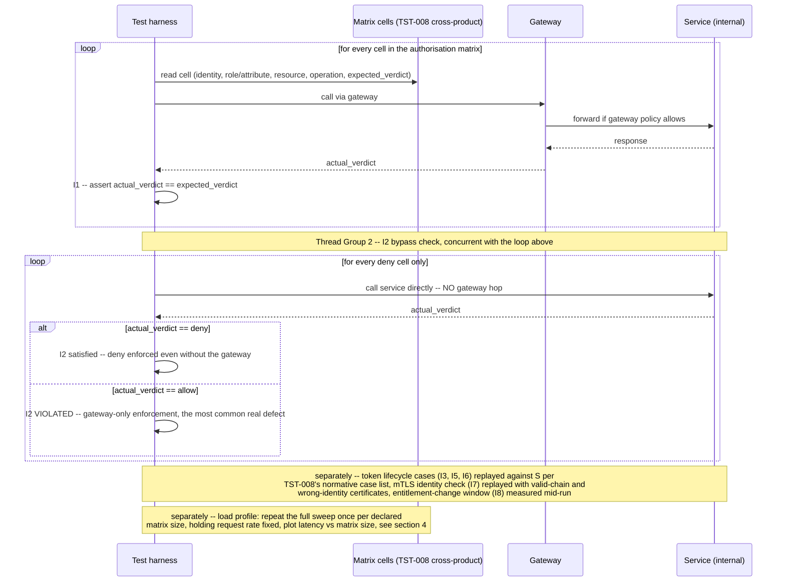

# AuthN/AuthZ Matrix & Token Lifecycle

Status: Approved | Last Reviewed: 2026-08-12 | Owner: @qe-lead
Catalog ID: TST-040 | Radii
Tier Applicability: T0, T1

## 1. Applies To

| Catalog ID | Title | Document |
|---|---|---|
| SEC-010 | Attribute-Based Access Control | [../../patterns/security/attribute-based-access-control.md](../../patterns/security/attribute-based-access-control.md) |
| SEC-006 | JWT Best Practices | [../../patterns/security/jwt-best-practices.md](../../patterns/security/jwt-best-practices.md) |
| SEC-002 | OAuth2 Authorization | [../../patterns/security/oauth2-authorization.md](../../patterns/security/oauth2-authorization.md) |
| SEC-005 | BFF + Token-Binding (web + iOS + Android) | [../../patterns/security/bff-token-binding.md](../../patterns/security/bff-token-binding.md) |
| SEC-011 | Session Revocation | [../../patterns/security/session-revocation.md](../../patterns/security/session-revocation.md) |
| SEC-001 | mTLS Service Mesh | [../../patterns/security/mtls-service-mesh.md](../../patterns/security/mtls-service-mesh.md) |
| MOB-003 | Mobile Biometric Auth | [../../patterns/mobile/mobile-biometric-auth.md](../../patterns/mobile/mobile-biometric-auth.md) |

These seven rows share one archetype because each names a distinct control point on the same
identity-to-resource decision path, and every one of them is verified the same way: an exhaustive
matrix sweep of the relevant dimensions, cross-checked against the normative case list
[TST-008 § Token Lifecycle Cases](../strategy/security-test-standard.md#token-lifecycle-cases)
defines, run against the actual resource or authorization server rather than inferred from
configuration or a library's own unit tests. SEC-010 Attribute-Based Access Control supplies the
policy-evaluation mechanism the authorisation-matrix cells (§3) exercise; SEC-006 JWT Best
Practices and SEC-002 OAuth2 Authorization supply the bearer-token format and issuance flow the
token-lifecycle cases validate; SEC-005 BFF + Token-Binding supplies the client-bound token this
archetype's replay case (I6) targets; SEC-011 Session Revocation supplies the propagation window
I4 asserts against; SEC-001 mTLS Service Mesh supplies the peer-identity assertion I7 targets; and
MOB-003 Mobile Biometric Auth supplies the client-side factor whose fallback behaviour the Failure
Taxonomy's biometric-fallback entry targets. The verification method is identical across all
seven; only the control point differs.

`SEC-010` is already claimed by [TST-025 Decision Table and Screening Accuracy](./decision-screening-accuracy.md)
for the decision-accuracy half of its testing obligation — its confusion-matrix run over this
archetype's own authorisation-matrix cell set, per
[TST-008 § Authorisation Matrix Method](../strategy/security-test-standard.md#authorisation-matrix-method).
This document appends `TST-040` to `SEC-010`'s existing `archetypes:` list in the coverage matrix
rather than creating a second row or overwriting TST-025's claim. TST-025 continues to own
decision-accuracy coverage for that row; this archetype owns authorisation-matrix-sweep and
token-lifecycle coverage for it — the two obligations are independent halves of the same catalog
row, not a replacement of one by the other. See §6 for the row's `primary_tool` resolution.

## 2. Failure Taxonomy

- Authorisation is enforced at the gateway but not at the service, so a direct call to the service
  bypasses it.
- An expired token is accepted because the clock-skew tolerance is too wide.
- Revocation is not honoured until natural expiry.
- Refresh-token reuse is permitted.
- A client-bound token is replayed successfully by a different client.
- mTLS validates the certificate chain but not the identity.
- A biometric fallback to a weaker factor with no policy governing when that fallback is allowed.
- An entitlement change does not take effect until the user re-logs in.

## 3. Functional Test Design

**Oracle:** `invariant-assertion` — every invariant below is checked mechanically against a
running resource or authorization server, per
[TST-001 § The Four Oracles](../strategy/test-strategy-standard.md#the-four-oracles); none of them
is inferred from configuration.

### Invariants

| # | Invariant | Assertion |
|---|---|---|
| I1 | Every authorisation-matrix cell returns its expected allow or deny | `assert actual_verdict(identity, resource, operation) == expected_verdict` for every cell in [TST-008 § Authorisation Matrix Method](../strategy/security-test-standard.md#authorisation-matrix-method)'s cross-product — never a sampled subset |
| I2 | A deny cannot be bypassed by calling the service directly, around the gateway | `assert direct_to_service_call(identity, resource, operation) == gateway_call(identity, resource, operation)` for every cell whose expected verdict is deny, issued from a second Thread Group with no gateway hop (§5) |
| I3 | Expired, wrong-audience, wrong-issuer, and tampered-signature tokens are all rejected | `assert response.status == rejected` for each of [TST-008 § Token Lifecycle Cases](../strategy/security-test-standard.md#token-lifecycle-cases)'s `expired-rejected`, `wrong-audience-rejected`, `wrong-issuer-rejected`, and `tampered-signature-rejected` cases, including the `alg: none` variant; and, bounding the leeway itself rather than only the boundary around it, `assert declared_clock_skew_tolerance <= declared_max_clock_skew_tolerance` against [SEC-006 JWT Best Practices](../../patterns/security/jwt-best-practices.md)'s validator configuration (boundary detail in §3) |
| I4 | A revoked token is rejected before its natural expiry, within the declared propagation window | `assert time_to_rejection <= declared_propagation_window`, measured from the revocation action (logout, admin action, compromise response) to the first rejected request, on a token whose `exp` claim is still in the future |
| I5 | A used refresh token cannot be reused | `assert second_use(refresh_token) == rejected` after a first successful rotation, per TST-008's `refresh-rotation-invalidates-prior-refresh` case |
| I6 | A client-bound token replayed by another client is rejected | `assert replay_by_other_client(bound_token) == rejected` for a token bound via `cnf`/DPoP, an mTLS-bound token, or a BFF-issued session cookie scoped to one client — binding is enforced at the resource server, not merely recorded in the token |
| I7 | mTLS asserts peer *identity*, not merely a valid chain | `assert mtls_call(valid_chain, wrong_identity) == rejected` — a certificate signed by a trusted CA but presenting an identity outside the caller's declared allow-list must be denied, distinct from `assert mtls_call(invalid_chain, any_identity) == rejected` |
| I8 | An entitlement change takes effect within its declared window | `assert time_to_effect(entitlement_change) <= declared_propagation_window`, measured from the entitlement change's commit to the first authorisation decision that reflects it, without requiring the affected session to re-authenticate |

**I2 is the most consequential invariant in this document.** Gateway-only enforcement — where an
API gateway or edge proxy correctly denies a request, but the service behind it accepts the
identical call when reached directly — is the single most common real authorisation defect, and
it is structurally invisible to any test suite that only ever calls through the gateway. A matrix
sweep that exercises every cell in I1 but issues every request through the same gateway path can
report 100% cell coverage while a direct-to-service bypass sits completely untested. §5's second
Thread Group exists specifically to make this defect visible: it repeats every deny cell from I1
as a direct-to-service call with no gateway hop, so a service that only enforces the policy when
fronted by the gateway fails I2 even though it passes I1.

### Equivalence classes and boundaries

- A cell whose expected verdict is allow, called through the gateway — the canonical happy path
  (I1).
- A cell whose expected verdict is deny, called through the gateway — the case the Failure
  Taxonomy's false-allow entry targets; every deny cell gets an explicit test, never an assumption
  of default-deny (I1).
- The same deny cell, called directly against the service with no gateway hop — I2's bypass check,
  and the boundary between "policy declared" and "policy actually enforced everywhere it must be".
- A cell whose role or attribute is held constant and would earn an allow verdict against the
  resource *type*, but whose resource is a specific instance owned by an identity other than the
  caller — e.g. a teller authorised for `account:read` at their own branch calling that same
  operation against an account owned by a different customer at that branch. This is OWASP API
  Security Top 10 API1:2023 (Broken Object Level Authorization / IDOR), and it is its own
  equivalence class distinct from the class-level role/attribute mismatches above: I1's
  cross-product only exercises it when the `resource` column (§5) is populated with specific
  owned instances, not merely resource *types* — a matrix that varies resource type but never
  resource ownership can report full nominal cell coverage while never testing the case a QE
  engineer must actually vary (I1).
- A token whose `exp` falls exactly at the system's *declared* clock-skew tolerance boundary — one
  second inside that declared tolerance must be accepted, one second beyond it must be rejected.
  The boundary is defined relative to `declared_clock_skew_tolerance`, per
  [SEC-006 JWT Best Practices](../../patterns/security/jwt-best-practices.md)'s validator
  configuration, not a fixed number: a boundary fixed at "one second past `exp`" assumes zero
  tolerance and can never detect the Failure Taxonomy's own named defect, because a tolerance
  configured far wider than intended still passes a fixed boundary cleanly (I3).
- The declared tolerance value itself, checked against the maximum
  [SEC-006 JWT Best Practices](../../patterns/security/jwt-best-practices.md)'s validator
  configuration must declare for it —
  `assert declared_clock_skew_tolerance <= declared_max_clock_skew_tolerance`. This is the
  assertion that actually catches "someone configured skew tolerance too wide": the boundary
  bullet above only proves the system enforces *whichever* tolerance happens to be configured,
  wide or not, so a second, independent check on the configured value itself is required (I3).
- A revoked token checked immediately after revocation, and again at the edge of the declared
  propagation window — both must reject; only the *measured* time-to-rejection is a boundary
  concern, not the verdict itself (I4).
- A refresh token used exactly once (must rotate and succeed) versus the same token presented a
  second time immediately afterward (must be rejected) — I5's boundary is temporal adjacency, not
  elapsed time.
- A client-bound token presented by its own binding party (must succeed) versus the identical
  token presented by any other party (must be rejected) — I6.
- A certificate whose chain is valid but whose subject identity is outside the declared allow-list,
  as the boundary case distinct from an invalid chain (I7).
- An entitlement change measured at the edge of its declared propagation window, against an
  already-active session that never re-authenticates (I8).

### Negative paths

- A request with no token at all is rejected before any authorisation-matrix lookup runs, never
  defaulted into an anonymous-role cell.
- A token whose claims are individually well-formed but whose `alg` field has been changed to
  `none` is rejected as tampered-signature, not accepted because signature verification was
  skipped for that algorithm (I3's negative path).
- A revocation action issued against a token ID that does not exist is rejected explicitly by the
  revocation endpoint, never silently accepted as a no-op that could mask a real revocation
  failure.
- An mTLS handshake presenting no client certificate at all is rejected at the transport layer,
  distinct from and prior to the identity check I7 asserts (I7's negative path).
- A biometric-authentication attempt that fails is never silently retried against a weaker factor
  without an explicit, declared fallback policy naming which weaker factor is permitted and under
  what condition (Failure Taxonomy's biometric-fallback entry, made concrete as a negative path).

## 4. Performance Test Design

| Profile | Applies | Why | Threshold source |
|---|---|---|---|
| `baseline` | yes | Confirms authorisation-decision latency and token-validation latency have not regressed before any load-shaped run | [NFR-002](../../nfr/latency-budget-model.md) |
| `load` | yes | Proves authorisation-decision latency holds under sustained request rate as **authorisation-matrix size** grows — this archetype's own performance concern, addressed by reusing [TST-025 § Performance Test Design](./decision-screening-accuracy.md#4-performance-test-design)'s cardinality-curve redefinition rather than restating its mechanics: the harness re-runs the identical profile against a series of synthetic matrix snapshots of increasing declared size (identity × role/attribute × resource × operation), holding request rate and virtual-user population fixed per run, and plots authorisation-decision latency against matrix size rather than solely against request rate | [NFR-002](../../nfr/latency-budget-model.md), [NFR-003](../../nfr/capacity-planning-model.md) |
| `soak` | yes | Targets token-cache and revocation-list growth over an extended window — proves cache eviction and revocation-list pruning actually run, and that revocation-check latency (I4) does not degrade as the revocation list grows unbounded, rather than merely being declared to happen | [NFR-003](../../nfr/capacity-planning-model.md) |

**Workload model:** `closed` for all three profiles — each holds a declared, bounded population of
virtual users at steady state, per [TST-003](../strategy/workload-modelling.md). The `load`
profile's matrix-size sweep follows the same deliberate redefinition
[TST-025 § Performance Test Design](./decision-screening-accuracy.md#4-performance-test-design)
establishes for its own `stress` profile against list cardinality: the independent variable across
runs is a declared dimension size, not open-model arrival rate, so a fixed, `closed` population is
re-run once per matrix-size snapshot rather than ramped once against a single fixed matrix.

## 5. Canonical Harness — JMeter

The `resource` column in the CSV Data Set Config below encodes a specific, owned resource
*instance* (e.g. a synthetic account ID together with its owning identity), not a resource *type*
such as `account`. This is what makes §3's BOLA/IDOR equivalence class exercisable at all: it
requires the same `role_or_attribute` and `operation` to appear against resource instances owned
by more than one identity, with `expected_verdict` differing by ownership alone rather than by
role, attribute, or resource type. Every BOLA equivalence class named in §3 must therefore be
present as its own row in `authz_matrix_cells_*.csv`, not left to be inferred from a role/attribute
× resource-*type* cross-product that never varies ownership.

```xml
<!-- Thread Group 1: the authorisation-matrix sweep, through the gateway. Every cell from the
     TST-008 cross-product (identity x role/attribute x resource x operation) is one CSV row,
     with the expected verdict declared alongside it -- never inferred. -->
<ThreadGroup testname="tg-authz-matrix-sweep-via-gateway">
  <stringProp name="ThreadGroup.num_threads">${__P(users,20)}</stringProp>
  <stringProp name="ThreadGroup.ramp_time">${__P(rampup,60)}</stringProp>
  <stringProp name="ThreadGroup.duration">${__P(duration,600)}</stringProp>
</ThreadGroup>

<CSVDataSet testname="authz_matrix_cells.csv (SYNTHETIC -- no real identities)">
  <stringProp name="filename">data/authz_matrix_cells_${__P(matrix_size_ref,1x)}.csv</stringProp>
  <stringProp name="variableNames">cell_id,identity_id,role_or_attribute,resource,operation,expected_verdict,token_case</stringProp>
  <boolProp name="recycle">true</boolProp>
</CSVDataSet>

<HTTPSamplerProxy testname="Call via gateway (I1, I3, I5, I6, I8)">
  <stringProp name="HTTPSampler.domain">${__P(gateway_host)}</stringProp>
  <stringProp name="HTTPSampler.path">/v1/${resource}/${operation}</stringProp>
  <stringProp name="HTTPSampler.method">POST</stringProp>
</HTTPSamplerProxy>

<JSR223Assertion testname="assert actual verdict matches expected_verdict (I1)">
  <stringProp name="script"><![CDATA[
    def actual = (prev.getResponseCode() as int) < 400 ? "allow" : "deny";
    def expected = vars.get("expected_verdict");
    if (actual != expected) {
        AssertionResult.setFailure(true);
        AssertionResult.setFailureMessage(
            "I1 violated on cell " + vars.get("cell_id") + ": expected " + expected + ", got " + actual
        );
    }
  ]]></stringProp>
</JSR223Assertion>

<!-- Thread Group 2: I2's bypass check -- replays only the deny cells directly against the
     service, with no gateway hop. A service that enforces the policy only when fronted by the
     gateway passes Thread Group 1 and fails here. -->
<ThreadGroup testname="tg-direct-to-service-bypass-check">
  <stringProp name="ThreadGroup.num_threads">${__P(users,5)}</stringProp>
  <stringProp name="ThreadGroup.duration">${__P(duration,600)}</stringProp>
</ThreadGroup>

<CSVDataSet testname="authz_matrix_deny_cells.csv (filtered: expected_verdict == deny)">
  <stringProp name="filename">data/authz_matrix_deny_cells_${__P(matrix_size_ref,1x)}.csv</stringProp>
  <stringProp name="variableNames">cell_id,identity_id,role_or_attribute,resource,operation</stringProp>
  <boolProp name="recycle">true</boolProp>
</CSVDataSet>

<HTTPSamplerProxy testname="Call service directly, bypassing gateway (I2)">
  <stringProp name="HTTPSampler.domain">${__P(service_internal_host)}</stringProp>
  <stringProp name="HTTPSampler.path">/internal/${resource}/${operation}</stringProp>
  <stringProp name="HTTPSampler.method">POST</stringProp>
</HTTPSamplerProxy>

<ResponseAssertion testname="assert direct call is ALSO denied (I2)">
  <stringProp name="Assertion.test_field">Assertion.response_code</stringProp>
  <stringProp name="Assertion.test_type">8</stringProp>
  <stringProp name="1">403</stringProp>
</ResponseAssertion>
```

```bash
# mTLS cases (I7) run against a dedicated HTTPS Request Defaults element whose keystore is
# supplied at the JVM level -- JMeter has no GUI "Keystore" element of its own; the client
# keystore, its password, and the trust store are wired in as system properties on invocation.
jmeter -n -t authn-authz-token-lifecycle.jmx \
  -Jusers="${JMETER_USERS}" -Jrampup="${JMETER_RAMPUP}" -Jduration="${JMETER_DURATION}" \
  -Jgateway_host="${GATEWAY_HOST}" -Jservice_internal_host="${SERVICE_INTERNAL_HOST}" \
  -Jmatrix_size_ref="${MATRIX_SIZE_REF}" -Jprofile="${JMETER_PROFILE}" \
  -Djavax.net.ssl.keyStore="${SYNTHETIC_CLIENT_KEYSTORE}" \
  -Djavax.net.ssl.keyStorePassword="${SYNTHETIC_KEYSTORE_PASSWORD}" \
  -Djavax.net.ssl.trustStore="${SYNTHETIC_TRUST_STORE}" \
  -l results.jtl -e -o report/
```

The **second Thread Group** is this harness's load-bearing design choice, not an optional extra:
without it, the plan can report full I1 cell coverage while I2 — the bypass path — goes completely
untested, because every sampler in Thread Group 1 shares the same gateway-fronted path. Running
both Thread Groups concurrently, rather than as separate plans, matters for the same reason
[TST-033 § Security overlay](./multitenant-noisy-neighbour.md#7-overlays) runs its own cross-tenant
denial check under load rather than in isolation: a check that only passes when the system is idle
can hide behind an untested concurrent case. The **mTLS keystore configuration** is the other
notable element: JMeter has no dedicated GUI "Keystore Configuration" component, so the client
certificate, its password, and the trust store are supplied as `javax.net.ssl.*` JVM system
properties on the command line, applying to every `HTTPSamplerProxy` in the plan that targets an
mTLS-protected endpoint.

## 6. Tool Fit

| Tool | Fit | When to prefer |
|---|---|---|
| JMeter | BEST | A CSV Data Set Config drives the full matrix sweep declaratively, a second Thread Group gives the direct-to-service bypass check (I2) its own independent path with no code, and `javax.net.ssl.*` system properties configure client-certificate mTLS (I7) natively — no other tool in the corpus combines declarative matrix-sweep parameterisation with native keystore support in one plan |
| k6 | good | A `SharedArray` can drive the matrix sweep from a CSV-equivalent source and `tlsAuth`/client-certificate options in `options.tlsAuth` cover the mTLS cases, but there is no first-class equivalent to a second, independently-configured Thread Group for the I2 bypass path — it must be a second `scenario` block wired together by hand |
| Gatling + Karate | good | Karate's `Examples` tables are a natural fit for the matrix sweep and Karate has native client-certificate support for the mTLS cases, but Gatling's own injection profile and Karate's scenario runner must be wired together rather than sharing one native plan the way JMeter's two Thread Groups do |
| Locust | fair | A plain Python CSV reader can drive the matrix sweep and `requests`' `cert=(...)` tuple covers mTLS, but the direct-to-service bypass check and the client-certificate configuration are both hand-built in Python rather than configured declaratively, per [TST-014](../tooling/locust.md#when-to-use-this-tool) |

Record `primary_tool: jmeter` for all seven coverage rows in §1, including `SEC-010`. For
`SEC-010` specifically, this supersedes TST-025's `locust` designation on that single row field,
for the same class of reason [TST-032](./batch-window-cutoff.md) recorded a `primary_tool` change
on `BSP-019`'s coverage row (see
[TST-025 § Tool Fit](./decision-screening-accuracy.md#6-tool-fit) and the coverage YAML's `notes`
field on that row for the precedent): the two archetypes verify independent halves of the same
catalog row, and a coverage row has exactly one `primary_tool` field to hold. TST-025's
confusion-matrix method and its `locust` recommendation for *that* method are unchanged and remain
the correct tool for decision-accuracy coverage; only the row's single `primary_tool` designation
is updated, to `jmeter`, for this archetype's own matrix-sweep and mTLS-keystore obligation. See
the coverage YAML's `notes` field on the `SEC-010` row for the resolution.

## 7. Overlays

Security is not a secondary overlay layered over some other primary method in this archetype — it
is the body of the document. The authorisation-matrix sweep and the token-lifecycle case list
(§§2-6) are this archetype's primary functional and performance test design, not an add-on to a
different oracle, so there is no separate "Security overlay" subsection here: §§2-6 already are
the security verification, cross-linking
[TST-008 § Authorisation Matrix Method](../strategy/security-test-standard.md#authorisation-matrix-method)
and [TST-008 § Token Lifecycle Cases](../strategy/security-test-standard.md#token-lifecycle-cases)
for the method and the normative case list rather than restating either.

Resilience, Contract, and Data-quality overlays are omitted: this archetype's failure modes are
about authorisation-decision correctness and token-lifecycle enforcement, not fault tolerance
under injected failure, schema or wire compatibility, or data reconciliation, so none of the three
overlays applies.

## 8. Test Data Requirements

Synthetic only, per [TST-004](../strategy/test-data-management.md). Entities needed: a set of
synthetic identities spanning every declared role or attribute combination; a set of synthetic
protected resources and the operations declared on each, with at least two distinct owning
identities per resource type so §3's BOLA/IDOR equivalence class is representable without
introducing a new dimension; the full authorisation-matrix cell list with its `expected_verdict`
column, sourced from
[TST-008 § Authorisation Matrix Method](../strategy/security-test-standard.md#authorisation-matrix-method)'s
cross-product rather than re-derived here; a synthetic token set covering every case in
[TST-008 § Token Lifecycle Cases](../strategy/security-test-standard.md#token-lifecycle-cases)
(valid, expired, wrong-audience, wrong-issuer, tampered-signature, revoked-before-expiry,
refresh-rotation), plus a token pair bracketing the declared clock-skew tolerance boundary (one
second inside, one second beyond `declared_clock_skew_tolerance`, per §3); a synthetic
client-certificate pair per mTLS identity case (valid chain plus
correct identity, valid chain plus wrong identity, invalid chain); a declared biometric-fallback
policy fixture; and a synthetic entitlement-change event with its commit timestamp. The
cardinality driver for §3's boundary matrix is the authorisation-matrix cell count itself — every
role/attribute, resource, and operation combination named in §1's patterns must appear at least
once. The cardinality driver for the `load` profile's matrix-size sweep (§4) is the declared
matrix size, orthogonal to the virtual-user population the profile also declares. Referential
integrity requirement: every matrix cell's `expected_verdict` resolves against a specific, named
policy or ruleset version, so a verdict can always be traced to the exact version it was declared
against. Teardown: purge the synthetic identities, certificates, tokens, and matrix-cell fixtures
at environment reset, per [TST-005](../strategy/environments-quality-gates.md).

## 9. Evidence and Observability

Metrics to capture: authorisation-matrix cell coverage (cells exercised versus cells declared, per
I1) and per-cell pass/fail; the direct-to-service bypass check's pass/fail per deny cell (I2); the
pass/fail outcome of every token-lifecycle case by its normative case ID (I3, I5, I6); revocation
propagation latency, from revocation action to first rejected request (I4); the mTLS
identity-versus-chain distinction's pass/fail per certificate case (I7); entitlement-change
propagation latency (I8); and the matrix-size-versus-latency curve from the `load` profile's
cardinality sweep. Trace assertions: every request must carry a queryable attribute distinguishing
a gateway-fronted call from a direct-to-service call, so I2's bypass check is verifiable
mechanically from trace data rather than only from the harness's own pass/fail output. Artifacts
to attach to a DAB submission: the JMeter aggregate report and HTML dashboard covering both Thread
Groups (per [TST-005](../strategy/environments-quality-gates.md)); the authorisation-matrix
coverage summary (cells declared, cells exercised, cells failed); the token-lifecycle case results
table, keyed by normative case ID; and the matrix-size-versus-latency curve chart from the `load`
profile.

## 10. Exit Criteria

The block below is illustrative for a synthetic service implementing this archetype's patterns —
every value is an example, not a normative one, per [TST-001](../strategy/test-strategy-standard.md).

```yaml
test_acceptance_criteria:
  service_name: synthetic-account-access-service
  archetypes: [TST-040]
  catalog_refs: [SEC-010, SEC-006, SEC-002, SEC-005, SEC-011, SEC-001, MOB-003]
  functional:
    invariants_covered: 8                 # I1-I8, all eight assertable
    negative_paths_covered: 5
    oracle: invariant-assertion
  performance:
    profiles_executed: [baseline, load, soak]
    workload_model: closed                # load re-runs per declared matrix size, not open
                                           # arrival rate; see §4
  security:
    authz_matrix_cells_covered: 72        # illustrative -- every declared cell, none sampled
    token_lifecycle_cases: 7              # TST-008's full normative case list
  data_quality:
    dq_rules_asserted: 0                  # out of scope for this archetype; see §7
    reconciliation_tolerance: 'n/a'
```

## Compliance Mapping

| Layer | Reference | Section/Control | How this satisfies |
|---|---|---|---|
| Ring 0 | OWASP ASVS — V1 (Architecture), V4 (Access Control) | Secure-architecture and access-control verification | I1 and I2 are the assertable form of V4's access-control requirement, exercised exhaustively over every declared matrix cell and checked at the point of enforcement, not merely at the gateway; V1's architecture requirement is satisfied by I2's explicit distinction between a gateway-fronted call and a direct-to-service call |
| Ring 0 | OAuth 2.0 (RFC 6749, RFC 6750); OAuth Security Best Current Practice (RFC 9700) | Authorization framework, bearer-token usage, and refresh-token rotation | I3 is the assertable form of the bearer-token validation obligation RFC 6749/6750 define; I5's refresh-token-reuse rejection is the assertable form of RFC 9700's rotation recommendation specifically — RFC 6749/6750 alone do not mandate rotation — both checked against a running authorization server, not inferred from configuration |
| Ring 0 | RFC 8705 — mTLS client authentication and certificate-bound tokens | OAuth client authentication with mutual TLS | I6 and I7 are the assertable form of RFC 8705's certificate-binding requirement: a bound token must be rejected when replayed by another client, and a peer certificate must be checked for identity, not merely chain validity |
| Ring 0 | NIST SP 800-53 — AC-3 (Access Enforcement) | Access enforcement | I1 and I2 together are the control-verification evidence that access enforcement is exercised at every declared point, including the point a gateway-only implementation would otherwise leave unchecked |
| Ring 1 | [PCI-DSS 4.0](../../compliance/pci-dss-4-0.md) — §7 (least privilege), §8 (authentication) | Restrict access by business need to know; identify and authenticate access to system components | §7's least-privilege obligation is satisfied by I1's exhaustive matrix-cell verification; §8's authentication obligation is satisfied by I3, I4, and I5's token-lifecycle enforcement checks |
| Ring 1 | SWIFT Customer Security Programme (CSP) — Control 1.4 (Restriction of Internet Access) | Restrict internet access to the secure zone | I2's direct-to-service bypass check is the assertable evidence that a call reaching a service without transiting the declared gateway path is still denied, not merely trusted because it originated inside the network boundary |
| Ring 1 | SWIFT Customer Security Programme (CSP) — Objective 5, Control 5.1 (Logical Access Control) | Identify and restrict privileged access to systems and data | I7's mTLS peer-identity assertion is the assertable evidence that a caller's identity, not merely possession of a chain-valid certificate, is checked before privileged service-to-service access is granted |
| Ring 2 | SBV Circular 09/2020/TT-NHNN — authentication requirements ⚠️ (working summary — pending Legal review); Decree 13/2023 ⚠️ (working summary — pending Legal review) | Authentication and access-control obligations for information systems handling personal or financial data | This archetype's authorisation-matrix and token-lifecycle invariants (I1-I7) are the technical control most directly responsible for satisfying these authentication and access-control expectations for an SBV review |

## 12. Related Patterns

- [SEC-010 Attribute-Based Access Control](../../patterns/security/attribute-based-access-control.md)
- [SEC-006 JWT Best Practices](../../patterns/security/jwt-best-practices.md)
- [SEC-002 OAuth2 Authorization](../../patterns/security/oauth2-authorization.md)
- [SEC-005 BFF + Token-Binding (web + iOS + Android)](../../patterns/security/bff-token-binding.md)
- [SEC-011 Session Revocation](../../patterns/security/session-revocation.md)
- [SEC-001 mTLS Service Mesh](../../patterns/security/mtls-service-mesh.md)
- [MOB-003 Mobile Biometric Auth](../../patterns/mobile/mobile-biometric-auth.md)

## 13. Related Archetypes

- [TST-008 Security Test Standard](../strategy/security-test-standard.md) — supplies the
  authorisation-matrix method (the cross-product cell-count formula) and the normative
  token-lifecycle case list this archetype's §3 consumes directly rather than re-deriving.
- [TST-025 Decision Table and Screening Accuracy](./decision-screening-accuracy.md) — supplies the
  cardinality-curve technique this archetype's §4 reuses, applied to authorisation-matrix size
  rather than list cardinality; also co-owns the `SEC-010` coverage row for its own
  decision-accuracy half (§1, §6).
- [TST-033 Multitenant Noisy-Neighbour Isolation](./multitenant-noisy-neighbour.md) — consumes this
  archetype's bypass-path assertion (I2) for its own narrower cross-tenant denial check, run
  concurrently with load rather than in isolation.
- TST-041 — Data Protection, Masking & Tokenisation (this plan's other Wave F security archetype,
  not yet published): expected to own the broader data-egress and masking assertions
  [TST-008 § Egress Assertion for Sensitive Data](../strategy/security-test-standard.md#egress-assertion-for-sensitive-data)
  defines, distinct from this archetype's authorisation and token-lifecycle scope.

## 14. Diagram


